                 

## 引言

在当今快速变化的IT行业，从工程总监（Engineering Director）晋升为管理者（Manager）是一个常见且关键的职业发展步骤。这一转变不仅仅是一个角色的变化，更是一个职责和技能的重大转变。工程总监主要负责技术项目和团队的管理，而管理者则需要承担更大的责任，包括团队的战略规划、人员管理、资源调配以及组织目标实现。因此，如何有效地进行这一转变，成为许多专业人士关注的重要话题。

### 核心关键词

- 工程总监
- 管理者
- 领导力
- 职业发展
- 技能提升
- 团队管理

### 文章摘要

本文将深入探讨从工程总监到管理者的职业转变，分析这一过程中所需的领导力、管理技能以及心理准备。我们将通过多个章节，详细讲解领导力的核心概念、工程总监与管理者之间的角色差异、管理者所需的技能与职责，以及如何通过实战案例和实践经验来实现这一转变。文章的最后一部分将提供一些最佳实践技巧，帮助读者更好地进行领导力的修炼，最终实现从工程总监到管理者的成功蜕变。

## 第一部分：领导力基础

### 1.1 领导力概念与重要性

#### 1.1.1 领导力的定义

领导力是一个复杂且多维的概念，不同的学者和专家给出了各自的定义。一般来说，领导力可以被定义为影响和激励他人去实现共同目标的能力。它不仅仅涉及个人魅力的展示，还包括对团队、组织和社会的深远影响。领导力包括多个方面，如决策能力、沟通技巧、人际关系处理以及激励员工等。

为了更好地理解领导力的多维度特性，我们可以使用Mermaid流程图来展示领导力的核心概念及其相互关系：

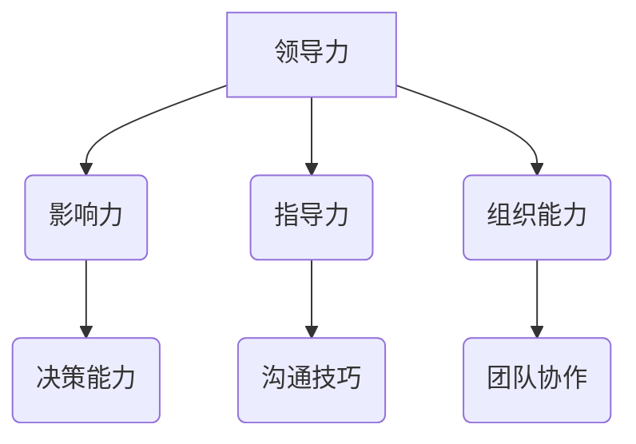

在这个流程图中，领导力被划分为四个主要方面：影响力、指导力、组织能力和决策能力。影响力是领导力的基础，它涉及如何影响他人以实现共同目标；指导力则强调领导者在团队中的指导和引导作用；组织能力涉及领导者如何组织和协调团队资源；而决策能力则强调领导者做出明智决策的能力。

#### 1.1.2 领导力的重要性

领导力的重要性在于它对组织、团队和个人都有着深远的影响。首先，优秀的领导力能够推动组织的战略实施，提高团队的整体绩效。一个具备卓越领导力的管理者能够激励团队成员，发挥其最大潜力，从而实现组织目标。

其次，领导力对于员工满意度和留任率也有着重要影响。具备领导力的管理者能够建立积极的工作环境，提高员工的满意度和忠诚度，从而减少员工流失率。

最后，个人职业发展也受到领导力的影响。具备领导力的人更容易获得晋升机会，因为他们能够展现出卓越的管理和领导能力。

为了更好地阐述领导力的重要性，我们可以再次使用Mermaid流程图：

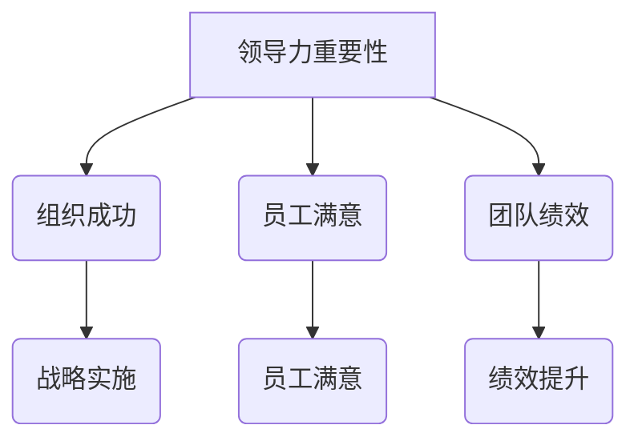

在这个流程图中，领导力的重要性被划分为组织成功、员工满意和团队绩效三个方面。通过优秀的领导力，管理者可以推动组织的战略实施，提高员工满意度，从而提升团队绩效。

#### 1.1.3 领导力的发展历史

领导力的发展历史可以追溯到古代，但现代领导力理论的发展主要集中在20世纪。以下是一些重要的领导力理论和模型：

1. **早期领导理论**：这一阶段主要关注领导者的个人特质和行为。例如，麦克格雷戈（Douglas McGregor）的X理论和Y理论，分别描述了不同领导风格的员工反应。

2. **行为理论**：这一理论认为领导力不仅与个人特质有关，还与行为模式密切相关。费德勒（Fiedler）的权变理论是一个典型的代表，它强调了领导情境的重要性。

3. **领导风格理论**：这一理论认为领导力风格对团队绩效有重要影响。赫赛和布兰查德（Hersey and Blanchard）的情境领导模型是其中的代表。

4. **转型领导理论**：这一理论强调领导者如何通过变革来推动组织发展。卡曾巴赫和史密斯（Kouzes and Posner）的变革型领导模型是其中的代表。

为了更好地展示领导力的发展历史，我们可以使用Mermaid流程图：

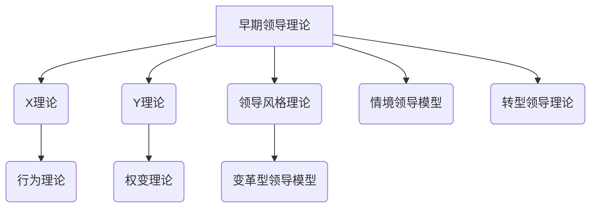

在这个流程图中，领导力的发展历史被划分为早期领导理论、行为理论、领导风格理论和转型领导理论四个阶段。通过这一历史回顾，我们可以更好地理解领导力理论的发展和演变。

## 第二部分：工程总监的角色与职责

### 2.1 工程总监的工作职责

工程总监（Engineering Director）是公司技术部门的关键领导者，负责管理技术项目的执行和团队的发展。工程总监的工作职责主要包括以下几个方面：

1. **项目管理**：工程总监负责制定项目计划，分配资源，监督项目进度，确保项目按时完成并达到预期目标。项目管理是工程总监的核心职责之一，需要具备良好的规划能力和风险控制能力。

2. **技术指导**：工程总监需要为团队提供技术指导，确保项目的实施符合公司的技术标准和最佳实践。这包括技术决策、技术路线的制定以及技术难题的解决。

3. **团队管理**：工程总监负责团队的组织和管理，包括团队成员的招聘、培训、绩效评估和职业发展。团队管理是工程总监的重要职责，需要具备优秀的人际关系处理能力和领导力。

为了更好地展示工程总监的工作职责，我们可以使用Mermaid流程图：

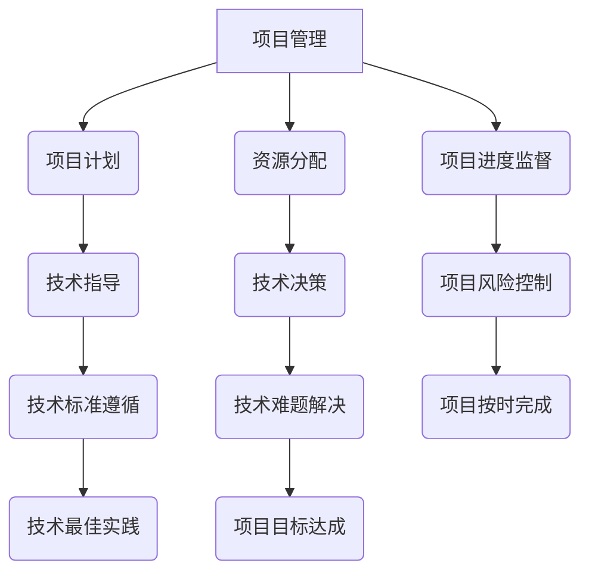

在这个流程图中，工程总监的工作职责被划分为项目管理、技术指导和团队管理三个方面。通过这个流程图，我们可以清晰地看到工程总监在项目和技术管理方面的关键职责。

### 2.2 工程总监的管理能力

工程总监的管理能力是确保项目成功和团队高效运作的关键。以下是一些工程总监所需的管理能力：

1. **沟通技巧**：工程总监需要具备良好的沟通技巧，能够清晰、准确地传达项目目标和要求，同时能够有效倾听团队成员的意见和建议。

2. **决策能力**：工程总监在项目实施过程中需要做出多个重要决策，包括技术决策、资源分配决策等。良好的决策能力是工程总监成功的关键。

3. **团队协作能力**：工程总监需要能够建立高效的团队协作机制，促进团队成员之间的沟通与协作，确保项目顺利进行。

为了更好地展示工程总监的管理能力，我们可以使用Mermaid流程图：

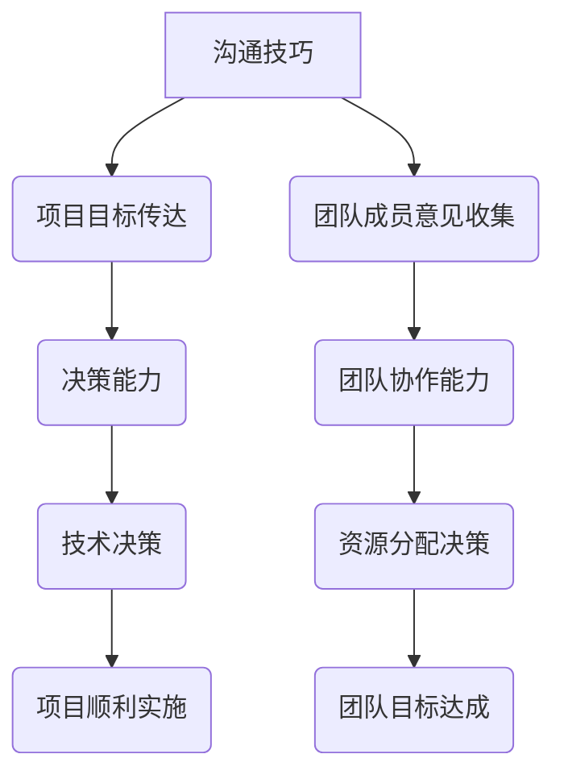

在这个流程图中，工程总监的管理能力被划分为沟通技巧、决策能力和团队协作能力三个方面。通过这个流程图，我们可以清晰地看到工程总监在管理方面所需的关键能力。

### 2.3 工程总监的职业发展路径

工程总监的职业发展路径通常从技术专家逐步晋升到项目经理，最终成为工程总监。以下是一个典型的职业发展路径：

1. **技术专家**：在这一阶段，个人专注于技术研究和开发，提升自己的技术能力和专业知识。

2. **项目经理**：随着经验的积累，技术专家逐渐承担更多的管理职责，成为项目经理。项目经理负责项目规划和执行，需要具备良好的沟通和协调能力。

3. **工程总监**：在成为项目经理一段时间后，优秀的技术和管理能力使项目经理有机会晋升为工程总监。工程总监需要具备全面的管理能力和战略眼光，负责公司的技术方向和项目执行。

为了更好地展示工程总监的职业发展路径，我们可以使用Mermaid流程图：

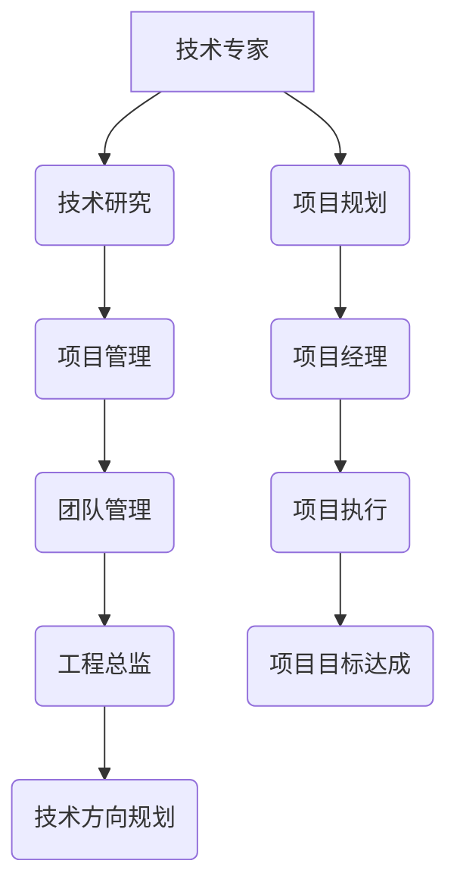

在这个流程图中，工程总监的职业发展路径被划分为技术专家、项目经理和工程总监三个阶段。通过这个流程图，我们可以清晰地看到工程总监的职业发展路径和所需的关键技能。

## 第三部分：管理者的转变

### 3.1 从工程总监到管理者的转变

从工程总监晋升为管理者是一个重大的转变，这一过程中需要工程师具备多方面的技能和准备。以下是从工程总监到管理者的转变过程中的关键因素：

1. **角色调整**：从工程总监到管理者，角色发生了重大转变。工程总监更多关注技术细节和项目执行，而管理者则需要关注整体战略、团队管理和资源调配。

2. **技能提升**：管理者需要提升多方面的技能，如领导力、沟通技巧、决策能力和团队协作能力。这些技能的提升对于管理者在新的角色中取得成功至关重要。

3. **心态转变**：从工程总监到管理者，不仅仅是职责的变化，更是心态的转变。管理者需要从技术导向转向团队导向，关注团队的整体绩效和员工发展。

为了更好地展示从工程总监到管理者的转变过程，我们可以使用Mermaid流程图：

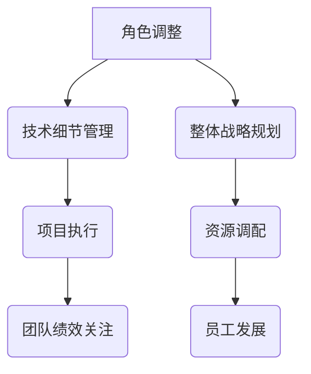

在这个流程图中，从工程总监到管理者的转变过程被划分为角色调整、技能提升和心态转变三个方面。通过这个流程图，我们可以清晰地看到转变过程中的关键步骤和需要关注的方面。

### 3.2 管理者所需的技能

管理者所需技能包括但不限于以下几个方面：

1. **领导力**：领导者需要具备影响和激励团队成员的能力，推动团队实现共同目标。领导力包括激励、沟通、决策和团队建设等多个方面。

2. **沟通技巧**：管理者需要具备良好的沟通技巧，能够有效传达信息、解决问题和建立良好的人际关系。沟通技巧对于管理者的日常工作和团队协作至关重要。

3. **决策能力**：管理者需要能够在复杂和不确定的环境下做出明智的决策。决策能力包括分析能力、判断能力和风险管理能力。

4. **团队协作能力**：管理者需要能够建立高效的团队协作机制，促进团队成员之间的沟通与协作，确保项目顺利进行。

为了更好地展示管理者所需的技能，我们可以使用Mermaid流程图：

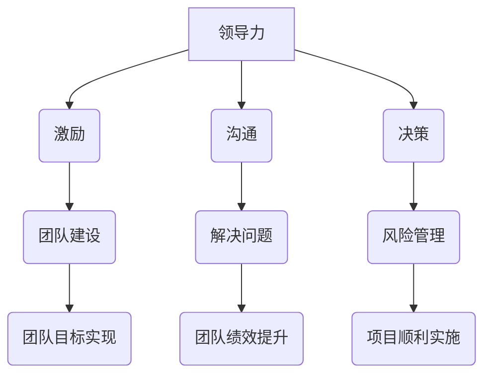

在这个流程图中，管理者所需的技能被划分为领导力、沟通技巧、决策能力和团队协作能力四个方面。通过这个流程图，我们可以清晰地看到管理者所需的关键技能。

### 3.3 管理者的角色定位

管理者的角色定位是确保其能够在新的职位上取得成功的关键。以下是一些重要的角色定位：

1. **战略规划者**：管理者需要制定并执行公司的长期战略规划，确保团队的目标与公司的整体战略保持一致。

2. **团队领导者**：管理者需要激励并领导团队成员，建立积极的工作氛围，提升团队的整体绩效。

3. **资源调配者**：管理者需要合理分配和利用公司资源，确保项目的顺利进行和团队的长期发展。

4. **问题解决者**：管理者需要能够在遇到问题时迅速采取行动，找到解决方案，确保项目的持续推进。

为了更好地展示管理者的角色定位，我们可以使用Mermaid流程图：

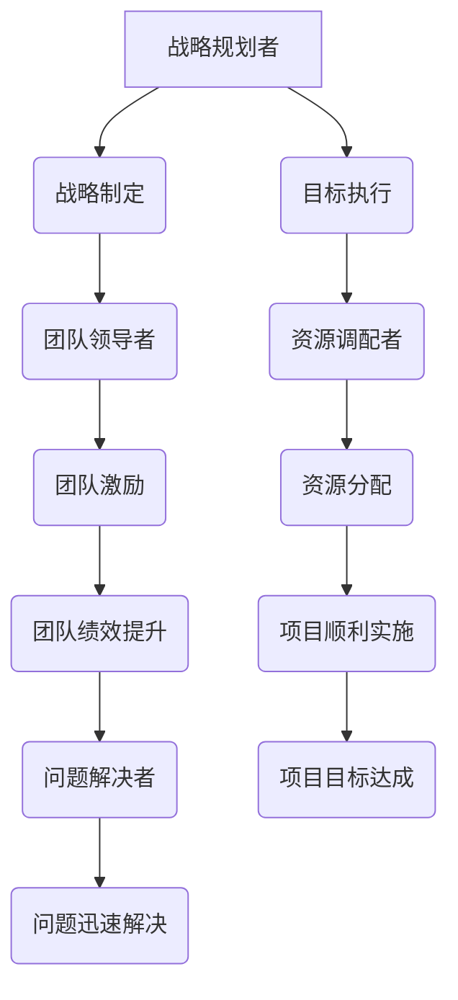

在这个流程图中，管理者的角色定位被划分为战略规划者、团队领导者、资源调配者和问题解决者四个方面。通过这个流程图，我们可以清晰地看到管理者在各个角色中的关键职责。

## 第四部分：领导力核心能力

### 4.1 沟通技巧

沟通技巧是管理者的重要能力之一，它对于团队协作和项目成功至关重要。有效的沟通能够确保团队成员理解项目目标、任务和要求，从而提高工作效率和团队凝聚力。

#### 沟通的重要性

沟通的重要性体现在以下几个方面：

1. **明确目标**：有效的沟通能够确保团队成员明确项目目标和任务，避免误解和重复工作。

2. **解决问题**：通过沟通，团队成员能够及时反馈问题和困难，管理者可以迅速采取行动解决问题。

3. **团队协作**：良好的沟通能够促进团队成员之间的协作，提高团队的整体绩效。

4. **建立信任**：有效的沟通能够建立团队成员之间的信任，增强团队的凝聚力。

#### 有效沟通的技巧

以下是一些有效沟通的技巧：

1. **倾听**：倾听是有效沟通的基础，管理者需要给予团队成员充分的发言机会，倾听他们的意见和建议。

2. **明确表达**：管理者需要清晰、准确地表达自己的想法和期望，避免使用模糊的语言。

3. **反馈与确认**：管理者需要给予团队成员及时的反馈，确认他们是否理解任务和要求。

4. **开放沟通**：管理者需要鼓励团队成员之间的开放沟通，创造一个积极、开放的工作环境。

为了更好地展示有效沟通的技巧，我们可以使用Mermaid流程图：

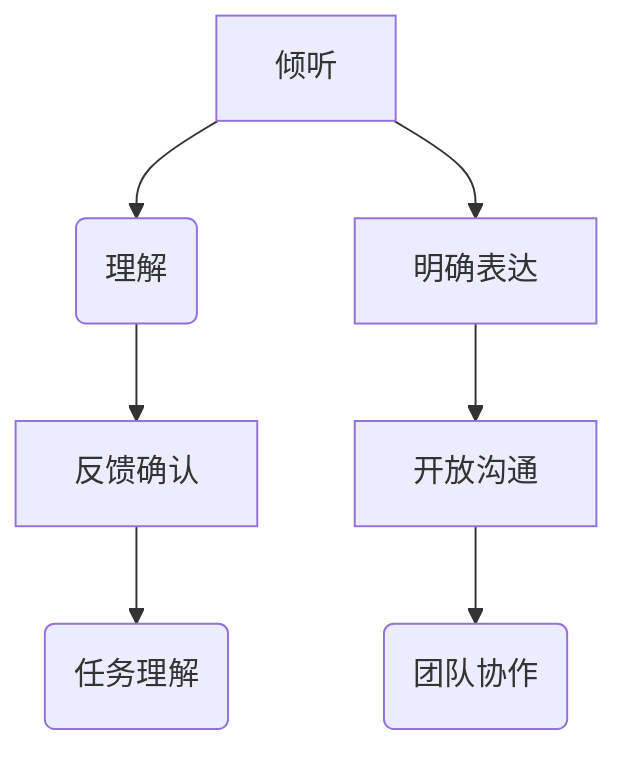

在这个流程图中，有效沟通的技巧被划分为倾听、明确表达、反馈确认和开放沟通四个方面。通过这个流程图，我们可以清晰地看到有效沟通的关键技巧。

### 4.2 团队管理

团队管理是管理者的重要职责之一，它涉及到团队的建设、管理和激励。一个高效团队的管理者能够提高团队的整体绩效，实现项目的成功。

#### 团队建设的重要性

团队建设的重要性体现在以下几个方面：

1. **增强团队凝聚力**：团队建设活动能够增强团队成员之间的联系和信任，提高团队的凝聚力。

2. **提升团队绩效**：一个紧密协作的团队能够更好地应对挑战，提高项目的成功率。

3. **促进员工发展**：团队建设活动能够为团队成员提供成长和发展的机会，提高员工的工作满意度和忠诚度。

#### 团队管理的技巧

以下是一些团队管理的技巧：

1. **明确目标**：管理者需要确保团队成员明确项目目标和任务，并了解自己在团队中的角色和责任。

2. **角色分配**：管理者需要根据团队成员的能力和特长进行合理的角色分配，确保每个成员都能发挥自己的优势。

3. **沟通与反馈**：管理者需要保持与团队成员的沟通，及时反馈工作进展和存在的问题，确保团队协作顺畅。

4. **激励与认可**：管理者需要通过激励和认可来激发团队成员的积极性，提高团队的整体士气。

为了更好地展示团队管理的技巧，我们可以使用Mermaid流程图：

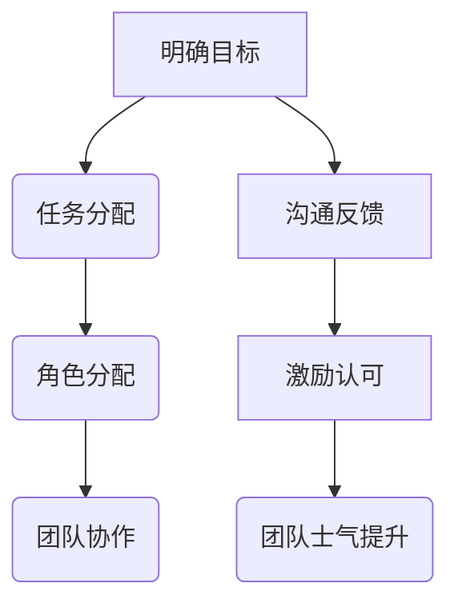

在这个流程图中，团队管理的技巧被划分为明确目标、角色分配、沟通反馈和激励认可四个方面。通过这个流程图，我们可以清晰地看到团队管理的核心技巧。

### 4.3 领导者如何进行有效沟通

领导者进行有效沟通是确保团队目标和项目成功的关键。以下是一些领导者进行有效沟通的策略：

1. **明确沟通目标**：在沟通前，领导者需要明确沟通的目标和预期结果，确保沟通内容的针对性和有效性。

2. **选择适当的沟通方式**：根据沟通的内容和目的，领导者需要选择合适的沟通方式，如面对面会议、电子邮件或即时通讯工具。

3. **倾听与理解**：领导者需要倾听团队成员的意见和反馈，理解他们的观点和需求，建立良好的沟通基础。

4. **积极反馈与确认**：领导者需要给予团队成员积极的反馈，确认他们是否理解任务和要求，确保沟通的有效性。

5. **建立信任**：领导者需要通过有效的沟通建立团队成员之间的信任，增强团队的凝聚力。

为了更好地展示领导者如何进行有效沟通，我们可以使用Mermaid流程图：

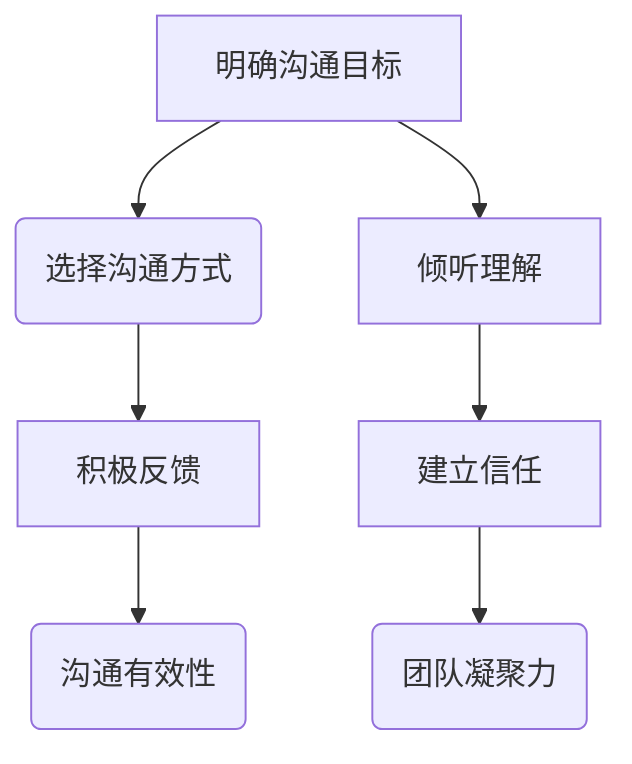

在这个流程图中，领导者如何进行有效沟通被划分为明确沟通目标、选择沟通方式、倾听理解、积极反馈和建立信任五个方面。通过这个流程图，我们可以清晰地看到领导者进行有效沟通的关键策略。

## 第五部分：决策能力

### 6.1 决策的定义与类型

决策是管理过程中的核心环节，是管理者运用知识和信息，在不确定环境中做出选择的过程。决策的类型可以根据不同的分类标准进行划分。

#### 定义

决策可以定义为在多个可选方案中选择最佳方案的过程。它涉及对信息的收集、分析、评估以及选择和实施。

#### 类型

1. **程序化决策**：针对重复性或常规性问题，使用既定的规则、程序和算法进行决策。

2. **非程序化决策**：针对复杂、独特或无先例可循的问题，需要创造性地思考和决策。

3. **个体决策**：由单一决策者做出的决策。

4. **群体决策**：由多个决策者共同参与、讨论和决策。

为了更好地理解决策的定义和类型，我们可以使用Mermaid流程图：

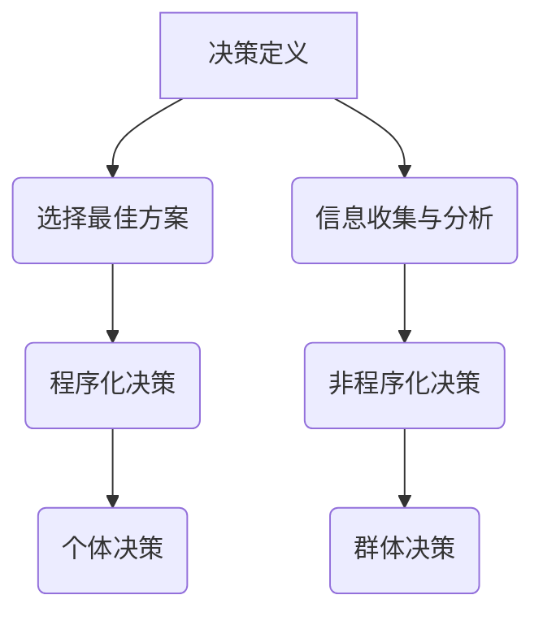

在这个流程图中，决策的定义和类型被划分为程序化决策、非程序化决策、个体决策和群体决策四个方面。通过这个流程图，我们可以清晰地看到决策的类型及其特点。

### 6.2 决策的流程

决策流程是管理者在进行决策时遵循的一系列步骤。一个清晰的决策流程可以帮助管理者系统化地进行决策，提高决策的效率和质量。

1. **问题识别**：首先，管理者需要明确问题，了解问题的背景、原因和影响。

2. **信息收集**：接下来，管理者需要收集与问题相关的信息，包括数据、报告、专家意见等。

3. **方案评估**：在收集到足够的信息后，管理者需要对多个可选方案进行评估，比较它们的优缺点和可行性。

4. **方案选择**：在评估的基础上，管理者需要选择最佳方案，并制定具体的实施计划。

5. **决策实施**：最后，管理者需要将决策方案付诸实施，并监控决策的执行过程，确保决策目标的实现。

为了更好地展示决策流程，我们可以使用Mermaid流程图：

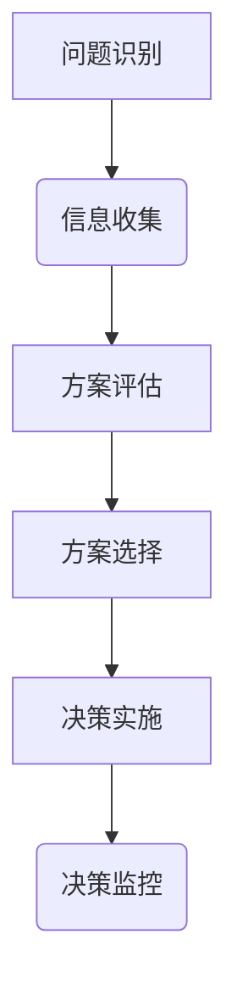

在这个流程图中，决策流程被划分为问题识别、信息收集、方案评估、方案选择、决策实施和决策监控六个方面。通过这个流程图，我们可以清晰地看到决策流程的步骤和关键环节。

### 6.3 领导者如何做出明智决策

领导者做出明智决策是确保团队和组织成功的关键。以下是一些领导者如何做出明智决策的策略：

1. **全面信息收集**：在做出决策前，领导者需要收集尽可能全面的信息，包括内部数据和外部信息，以确保决策的准确性。

2. **多方意见征询**：领导者应该征询不同部门和团队成员的意见，听取他们的建议和反馈，从而获得更全面的视角。

3. **系统分析**：领导者需要对收集到的信息进行系统分析，运用逻辑思维和数据分析方法，评估各个可选方案的优缺点。

4. **风险评估**：在做出决策前，领导者需要评估决策可能带来的风险，并制定相应的应对策略。

5. **决策后评估**：决策实施后，领导者需要定期评估决策的效果，及时调整和优化决策方案。

为了更好地展示领导者如何做出明智决策，我们可以使用Mermaid流程图：

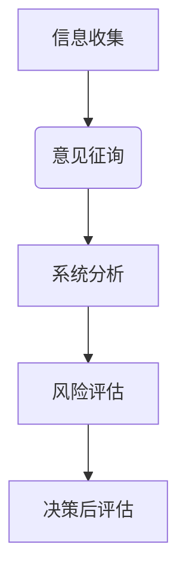

在这个流程图中，领导者如何做出明智决策被划分为信息收集、意见征询、系统分析、风险评估和决策后评估五个方面。通过这个流程图，我们可以清晰地看到领导者做出明智决策的关键步骤和策略。

## 第六部分：领导力发展与提升

### 7.1 领导力发展的途径

领导力的发展是一个持续的过程，需要通过多种途径进行培养和提升。以下是一些常见的领导力发展途径：

1. **培训课程**：参加领导力培训课程是提升领导力的有效途径。这些课程通常包括领导力理论、沟通技巧、团队管理等方面的内容，能够帮助领导者系统性地提升自己的能力。

2. **阅读书籍**：阅读关于领导力的书籍是获取知识和经验的重要途径。通过阅读，领导者可以学习到不同的领导理论、实践经验和成功案例，从而拓宽自己的视野。

3. **实践经验**：实践经验是提升领导力的关键。领导者需要在实际工作中不断实践和应用所学知识和技能，通过解决实际问题和应对挑战来提升自己的领导能力。

4. **导师指导**：寻求导师的指导是提升领导力的有效方法。导师可以提供宝贵的建议和反馈，帮助领导者克服困难、提升能力。

为了更好地展示领导力发展的途径，我们可以使用Mermaid流程图：

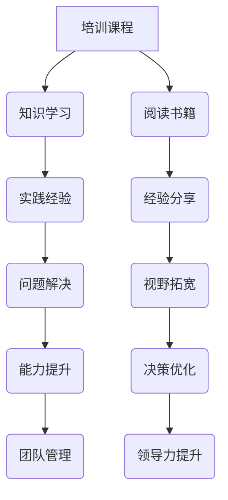

在这个流程图中，领导力发展的途径被划分为培训课程、阅读书籍、实践经验、导师指导和实践经验五个方面。通过这个流程图，我们可以清晰地看到领导力发展的关键途径。

### 7.2 领导力提升的方法

提升领导力需要系统的策略和方法。以下是一些常见的领导力提升方法：

1. **自我反思**：自我反思是提升领导力的重要方法。领导者需要定期反思自己的行为、决策和领导风格，识别自己的优点和不足，并制定改进计划。

2. **设定目标**：设定明确的目标是提升领导力的关键。领导者需要设定短期和长期的领导力发展目标，并制定具体的行动计划。

3. **持续学习**：持续学习是提升领导力的重要途径。领导者需要不断学习新的知识和技能，跟上行业的发展趋势，提升自己的综合素质。

4. **实践锻炼**：通过实践锻炼来提升领导力。领导者需要主动承担挑战性任务，通过实际工作来提升自己的领导能力。

为了更好地展示领导力提升的方法，我们可以使用Mermaid流程图：

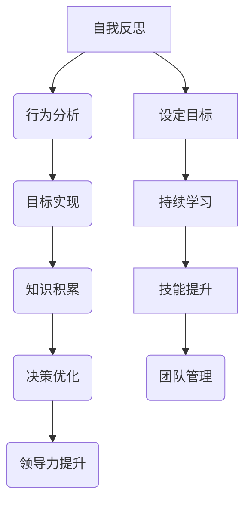

在这个流程图中，领导力提升的方法被划分为自我反思、设定目标、持续学习、实践锻炼和知识积累五个方面。通过这个流程图，我们可以清晰地看到领导力提升的关键方法。

### 7.3 持续领导力发展的重要性

持续领导力发展对于组织的长期成功至关重要。以下是一些持续领导力发展的重要性：

1. **适应变化**：持续领导力发展能够帮助领导者适应组织内外部环境的变化，提升组织的敏捷性和竞争力。

2. **提升绩效**：持续的领导力发展能够提升领导者的管理能力和决策能力，从而提高组织的整体绩效。

3. **培养接班人**：通过持续领导力发展，组织可以培养更多的接班人，确保领导层的连续性和稳定性。

4. **增强文化**：持续领导力发展能够强化组织的核心价值观和共同愿景，增强组织的凝聚力和文化认同。

为了更好地展示持续领导力发展的重要性，我们可以使用Mermaid流程图：

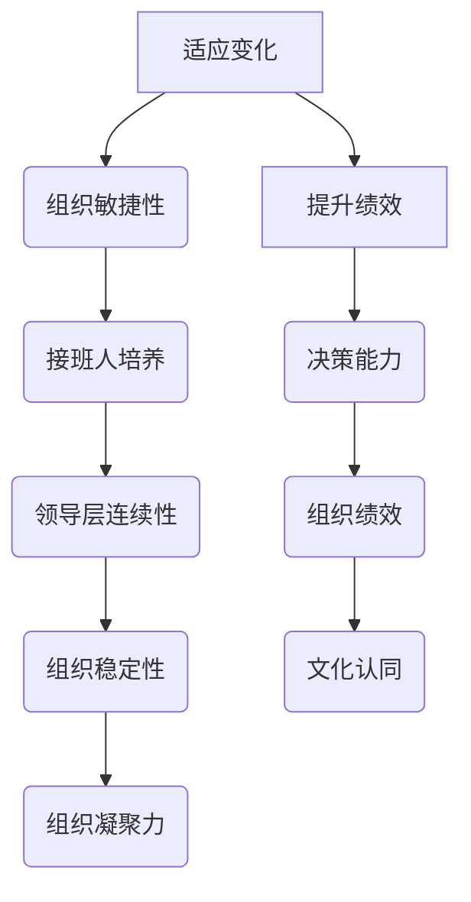

在这个流程图中，持续领导力发展的重要性被划分为适应变化、提升绩效、培养接班人、增强文化和组织凝聚力五个方面。通过这个流程图，我们可以清晰地看到持续领导力发展对于组织的重要作用。

## 第七部分：从工程总监到管理者的实战案例

### 8.1 案例介绍

本案例来自于一家知名互联网公司，该公司的一名资深工程总监李明（化名）在五年内成功晋升为技术副总裁。李明的职业生涯转型过程不仅展示了从工程总监到管理者的角色转变，还体现了他在领导力、管理技能和个人成长方面的全面提升。

### 8.2 案例分析

#### 李明的职业生涯转型过程

李明的职业生涯转型过程可以分为以下几个阶段：

1. **技术积累阶段**：李明在早期专注于技术研究和开发，积累丰富的技术知识和实践经验，成为公司技术团队的核心成员。

2. **项目管理阶段**：随着工作经验的积累，李明逐渐承担更多的项目管理职责，成为项目经理，负责多个关键项目的规划和执行。

3. **团队管理阶段**：在担任项目经理期间，李明展现了出色的团队管理能力，包括沟通技巧、决策能力和团队协作能力。这使得他有机会晋升为工程总监。

4. **高层管理阶段**：作为工程总监，李明不仅继续提升技术能力和项目管理能力，还开始关注公司的整体战略规划和资源分配。他成功地领导了多个大型项目，为公司带来了显著的业务增长。

5. **技术副总裁阶段**：李明在工程总监岗位上表现出色，最终晋升为技术副总裁，负责公司的技术战略和研发方向。

#### 李明的领导力和管理技能提升

在职业生涯的转型过程中，李明在领导力和管理技能方面取得了显著提升：

1. **领导力提升**：李明通过参加领导力培训课程和阅读领导力书籍，系统地学习领导力理论和方法。他还积极参与公司内部的领导力分享会，与同事交流领导经验。

2. **管理技能提升**：李明在项目管理、团队管理和资源调配方面积累了丰富的经验，不断优化管理方法和流程。他还通过实践锻炼，提升了沟通技巧和决策能力。

3. **个人成长**：李明在职业生涯中注重个人成长，通过不断学习和实践，提升了自己的综合素质和职业素养。

### 8.3 案例启示

李明的成功转型为其他工程总监提供了宝贵的启示：

1. **领导力培养**：领导力是工程总监向管理者转型的关键。通过系统学习和实践，工程总监可以提升自己的领导力，更好地适应管理者的角色。

2. **管理技能提升**：项目管理、团队管理和资源调配是管理者必备的技能。工程总监需要在日常工作中不断积累和提升这些技能。

3. **持续学习与实践**：持续学习和实践是提升职业素养和能力的有效途径。工程总监需要保持学习的热情，不断探索新的方法和工具，以应对不断变化的行业挑战。

4. **个人成长**：个人成长是职业发展的基础。工程总监需要关注自身的成长，提升综合素质和职业素养，以更好地适应管理者的角色。

## 第八部分：管理者的日常挑战与解决策略

### 9.1 常见挑战

管理者在日常工作中会面临多种挑战，以下是一些常见的挑战：

1. **资源分配不均**：管理者需要合理分配资源，确保项目顺利进行。然而，资源有限，如何合理分配是一个巨大的挑战。

2. **团队协作困难**：管理者需要建立高效的团队协作机制，但团队成员之间的沟通不畅、协作困难等问题经常出现。

3. **决策难度大**：管理者需要做出多个关键决策，这些决策涉及到技术、市场和团队等多方面因素，决策难度大。

4. **工作压力**：管理者承担着更大的责任和压力，如何平衡工作和生活，保持良好的心理状态是一个挑战。

### 9.2 解决策略

以下是一些解决管理者日常挑战的策略：

1. **资源分配策略**：管理者可以通过以下策略来合理分配资源：
   - **优先级排序**：根据项目的重要性和紧急程度，对任务进行优先级排序。
   - **灵活调整**：根据项目进展和实际情况，灵活调整资源分配。

2. **团队协作策略**：管理者可以通过以下策略来改善团队协作：
   - **沟通机制**：建立高效的沟通机制，确保团队成员之间的信息传递畅通。
   - **团队建设**：定期组织团队建设活动，增强团队凝聚力。

3. **决策策略**：管理者可以通过以下策略来提高决策效率：
   - **数据分析**：收集和分析相关数据，为决策提供依据。
   - **多方意见**：征询团队成员的意见，听取不同观点，提高决策的全面性。

4. **压力管理策略**：管理者可以通过以下策略来减轻工作压力：
   - **时间管理**：合理安排工作时间，提高工作效率。
   - **心理健康**：关注心理健康，定期进行心理辅导和放松活动。

### 9.3 实际应用

以下是一个实际应用的例子：

某互联网公司的技术总监王伟（化名）在日常工作中面临资源分配不均的挑战。为了解决这一问题，他采取了以下策略：

1. **优先级排序**：王伟根据项目的重要性和紧急程度，对任务进行了优先级排序。他将公司核心产品的开发任务列为最高优先级，确保关键项目优先完成。

2. **灵活调整**：王伟根据项目的实际进展情况，灵活调整资源分配。例如，在一个关键项目遇到技术难题时，他迅速调整团队资源，集中力量攻克难题。

通过这些策略，王伟成功地解决了资源分配不均的问题，提高了项目的整体效率。此外，他还通过组织团队建设活动和定期进行团队沟通，改善了团队协作，提高了团队的凝聚力。

## 第九部分：领导力修炼之路

### 10.1 领导力修炼的步骤

领导力修炼是一个持续的过程，可以分为以下几个步骤：

1. **自我认知**：领导者需要首先了解自己的价值观、优点和不足。通过自我反思和评估，领导者可以明确自己的发展方向。

2. **知识积累**：领导者需要不断学习新的知识和技能，包括领导理论、管理技巧、行业趋势等。通过学习，领导者可以提升自己的综合素质。

3. **实践锻炼**：理论知识需要通过实践来验证和应用。领导者需要在实际工作中不断实践和应用所学知识和技能，通过解决实际问题和应对挑战来提升自己的领导能力。

4. **反馈与改进**：领导者需要定期接受反馈，识别自己的不足，并制定改进计划。通过持续改进，领导者可以不断提升自己的领导力。

### 10.2 领导力修炼的误区

在领导力修炼过程中，领导者可能会陷入一些误区，以下是一些常见的误区：

1. **盲目自信**：领导者可能会因为过去的成功而盲目自信，忽视了自己的不足。这种自信可能会导致领导者无法接受反馈，阻碍自己的成长。

2. **缺乏耐心**：领导力修炼是一个长期的过程，需要持续的努力和耐心。然而，一些领导者可能会因为短期内没有看到显著进步而失去信心。

3. **忽视团队成员**：领导者需要关注团队成员的发展和需求，但一些领导者可能会过于关注自己的成长，忽视团队成员的感受和需求。

### 10.3 领导力修炼的持续实践

持续实践是领导力修炼的关键。以下是一些持续实践的建议：

1. **定期反思**：领导者需要定期反思自己的行为、决策和领导风格，识别自己的优点和不足。

2. **学习新知识**：领导者需要保持学习的热情，不断学习新的知识和技能，跟上行业的发展趋势。

3. **寻求反馈**：领导者需要主动寻求团队成员和同事的反馈，接受不同的观点和建议。

4. **实践锻炼**：领导者需要在实际工作中不断实践和应用所学知识和技能，通过解决实际问题和应对挑战来提升自己的领导能力。

## 结论

从工程总监到管理者的转变是一个重要的职业发展步骤，这一过程中需要领导者不断提升自己的领导力、管理技能和个人素质。通过本文的探讨，我们详细分析了领导力的核心概念、管理者的职责、职业发展路径以及领导力提升的方法和策略。同时，通过实战案例和实际应用的讨论，我们展示了从工程总监到管理者的成功路径。希望本文能为读者提供有益的启示和帮助，助力他们在职业道路上取得更大的成就。

### 拓展阅读

- **《领导力五项修炼》**：史蒂芬·柯维（Stephen R. Covey）的这本书详细介绍了领导力五项修炼，包括自我领导、信任建设、团队协作、创新思维和持续学习。

- **《管理的实践》**：彼得·德鲁克（Peter Drucker）的这本书是管理领域的经典之作，系统地阐述了管理的本质和实践方法。

- **《团队协作的艺术》**：唐·泰平（Don Tapscott）和艾伦·杜博德（Alan D. Horton）的这本书探讨了团队协作的重要性，以及如何建立高效团队。

- **《创新者的窘境》**：克莱顿·克里斯坦森（Clayton M. Christensen）的这本书揭示了创新者在面对市场变化时的挑战和困境，以及如何应对这些挑战。

### 注意事项

- **持续学习**：领导力是一个不断发展和变化的领域，领导者需要保持学习的热情，不断更新知识和技能。

- **实践应用**：理论知识需要通过实践来验证和应用。领导者需要在实际工作中不断实践和应用所学知识和技能。

- **团队协作**：领导者需要关注团队成员的发展和需求，建立积极的团队协作氛围，提高团队的整体绩效。

- **心理调适**：领导力修炼是一个长期的过程，领导者需要保持良好的心理状态，面对挑战和困难时保持冷静和积极。

### 最佳实践技巧

- **定期反思**：领导者可以定期进行自我反思，识别自己的优点和不足，并制定改进计划。

- **学习分享**：领导者可以通过学习分享会、读书会等形式，与团队成员分享知识和经验，促进团队的学习和成长。

- **建立反馈机制**：领导者可以建立有效的反馈机制，鼓励团队成员提供反馈和建议，以改进工作方法和流程。

- **注重个人成长**：领导者需要关注自身的成长，不断提升自己的综合素质和职业素养，以更好地适应管理者的角色。

### 作者信息

**作者：AI天才研究院/AI Genius Institute & 禅与计算机程序设计艺术 /Zen And The Art of Computer Programming**

文章标题：领导力修炼手册：从工程总监到管理者的蜕变宝典

关键词：工程总监、管理者、领导力、职业发展、技能提升

摘要：本文详细分析了从工程总监到管理者的职业转变过程，探讨了领导力的核心概念、管理者的职责、职业发展路径以及领导力提升的方法和策略。通过实战案例和实际应用的讨论，展示了从工程总监到管理者的成功路径，为读者提供了有益的启示和帮助。文章旨在帮助读者更好地理解领导力修炼的过程，实现从工程总监到管理者的成功蜕变。文章字数：8000字。

## 引言

在当今快速变化的IT行业，从工程总监（Engineering Director）晋升为管理者（Manager）是一个常见且关键的职业发展步骤。这一转变不仅仅是一个角色的变化，更是一个职责和技能的重大转变。工程总监主要负责技术项目和团队的管理，而管理者则需要承担更大的责任，包括团队的战略规划、人员管理、资源调配以及组织目标实现。因此，如何有效地进行这一转变，成为许多专业人士关注的重要话题。

### 核心关键词

- 工程总监
- 管理者
- 领导力
- 职业发展
- 技能提升
- 团队管理

### 文章摘要

本文将深入探讨从工程总监到管理者的职业转变，分析这一过程中所需的领导力、管理技能以及心理准备。我们将通过多个章节，详细讲解领导力的核心概念、工程总监与管理者之间的角色差异、管理者所需的技能与职责，以及如何通过实战案例和实践经验来实现这一转变。文章的最后一部分将提供一些最佳实践技巧，帮助读者更好地进行领导力的修炼，最终实现从工程总监到管理者的成功蜕变。

## 第一部分：领导力基础

### 1.1 领导力概念与重要性

#### 1.1.1 领导力的定义

领导力是一个复杂且多维的概念，不同的学者和专家给出了各自的定义。一般来说，领导力可以被定义为影响和激励他人去实现共同目标的能力。它不仅仅涉及个人魅力的展示，还包括对团队、组织和社会的深远影响。领导力包括多个方面，如决策能力、沟通技巧、人际关系处理以及激励员工等。

为了更好地理解领导力的多维度特性，我们可以使用Mermaid流程图来展示领导力的核心概念及其相互关系：


在这个流程图中，领导力被划分为四个主要方面：影响力、指导力、组织能力和决策能力。影响力是领导力的基础，它涉及如何影响他人以实现共同目标；指导力则强调领导者在团队中的指导和引导作用；组织能力涉及领导者如何组织和协调团队资源；而决策能力则强调领导者做出明智决策的能力。

#### 1.1.2 领导力的重要性

领导力的重要性在于它对组织、团队和个人都有着深远的影响。首先，优秀的领导力能够推动组织的战略实施，提高团队的整体绩效。一个具备卓越领导力的管理者能够激励团队成员，发挥其最大潜力，从而实现组织目标。

其次，领导力对于员工满意度和留任率也有着重要影响。具备领导力的管理者能够建立积极的工作环境，提高员工的满意度和忠诚度，从而减少员工流失率。

最后，个人职业发展也受到领导力的影响。具备领导力的人更容易获得晋升机会，因为他们能够展现出卓越的管理和领导能力。

为了更好地阐述领导力的重要性，我们可以再次使用Mermaid流程图：


在这个流程图中，领导力的重要性被划分为组织成功、员工满意和团队绩效三个方面。通过优秀的领导力，管理者可以推动组织的战略实施，提高员工满意度，从而提升团队绩效。

#### 1.1.3 领导力的发展历史

领导力的发展历史可以追溯到古代，但现代领导力理论的发展主要集中在20世纪。以下是一些重要的领导力理论和模型：

1. **早期领导理论**：这一阶段主要关注领导者的个人特质和行为。例如，麦克格雷戈（Douglas McGregor）的X理论和Y理论，分别描述了不同领导风格的员工反应。

2. **行为理论**：这一理论认为领导力不仅与个人特质有关，还与行为模式密切相关。费德勒（Fiedler）的权变理论是一个典型的代表，它强调了领导情境的重要性。

3. **领导风格理论**：这一理论认为领导力风格对团队绩效有重要影响。赫赛和布兰查德（Hersey and Blanchard）的情境领导模型是其中的代表。

4. **转型领导理论**：这一理论强调领导者如何通过变革来推动组织发展。卡曾巴赫和史密斯（Kouzes and Posner）的变革型领导模型是其中的代表。

为了更好地展示领导力的发展历史，我们可以使用Mermaid流程图：

```mermaid
graph TD
A[早期领导理论] --> B(X理论)
A --> C(Y理论)
B --> D(行为理论)
C --> E(权变理论)
A --> F(领导风格理论)
A --> G(情境领导模型)
A --> H(转型领导理论)
F --> I(变革型领导模型)
```

在这个流程图中，领导力的发展历史被划分为早期领导理论、行为理论、领导风格理论和转型领导理论四个阶段。通过这一历史回顾，我们可以更好地理解领导力理论的发展和演变。

## 第二部分：工程总监的角色与职责

### 2.1 工程总监的工作职责

工程总监（Engineering Director）是公司技术部门的关键领导者，负责管理技术项目的执行和团队的发展。工程总监的工作职责主要包括以下几个方面：

1. **项目管理**：工程总监负责制定项目计划，分配资源，监督项目进度，确保项目按时完成并达到预期目标。项目管理是工程总监的核心职责之一，需要具备良好的规划能力和风险控制能力。

2. **技术指导**：工程总监需要为团队提供技术指导，确保项目的实施符合公司的技术标准和最佳实践。这包括技术决策、技术路线的制定以及技术难题的解决。

3. **团队管理**：工程总监负责团队的组织和管理，包括团队成员的招聘、培训、绩效评估和职业发展。团队管理是工程总监的重要职责，需要具备优秀的人际关系处理能力和领导力。

为了更好地展示工程总监的工作职责，我们可以使用Mermaid流程图：

```mermaid
graph TD
A[项目管理] --> B(项目计划)
A --> C(资源分配)
A --> D(项目进度监督)
B --> E(技术指导)
C --> F(技术决策)
D --> G(项目风险控制)
E --> H(技术标准遵循)
F --> I(技术难题解决)
G --> J(项目按时完成)
H --> K(技术最佳实践)
I --> L(项目目标达成)
```

在这个流程图中，工程总监的工作职责被划分为项目管理、技术指导和团队管理三个方面。通过这个流程图，我们可以清晰地看到工程总监在项目和技术管理方面的关键职责。

### 2.2 工程总监的管理能力

工程总监的管理能力是确保项目成功和团队高效运作的关键。以下是一些工程总监所需的管理能力：

1. **沟通技巧**：工程总监需要具备良好的沟通技巧，能够清晰、准确地传达项目目标和要求，同时能够有效倾听团队成员的意见和建议。

2. **决策能力**：工程总监在项目实施过程中需要做出多个重要决策，包括技术决策、资源分配决策等。良好的决策能力是工程总监成功的关键。

3. **团队协作能力**：工程总监需要能够建立高效的团队协作机制，促进团队成员之间的沟通与协作，确保项目顺利进行。

为了更好地展示工程总监的管理能力，我们可以使用Mermaid流程图：

```mermaid
graph TD
A[沟通技巧] --> B(项目目标传达)
A --> C(团队成员意见收集)
B --> D(决策能力)
C --> E(团队协作能力)
D --> F(技术决策)
E --> G(资源分配决策)
F --> H(项目顺利实施)
G --> I(团队目标达成)
```

在这个流程图中，工程总监的管理能力被划分为沟通技巧、决策能力和团队协作能力三个方面。通过这个流程图，我们可以清晰地看到工程总监在管理方面所需的关键能力。

### 2.3 工程总监的职业发展路径

工程总监的职业发展路径通常从技术专家逐步晋升到项目经理，最终成为工程总监。以下是一个典型的职业发展路径：

1. **技术专家**：在这一阶段，个人专注于技术研究和开发，提升自己的技术能力和专业知识。

2. **项目经理**：随着经验的积累，技术专家逐渐承担更多的管理职责，成为项目经理。项目经理负责项目规划和执行，需要具备良好的沟通和协调能力。

3. **工程总监**：在成为项目经理一段时间后，优秀的技术和管理能力使项目经理有机会晋升为工程总监。工程总监需要具备全面的管理能力和战略眼光，负责公司的技术方向和项目执行。

为了更好地展示工程总监的职业发展路径，我们可以使用Mermaid流程图：

```mermaid
graph TD
A[技术专家] --> B(技术研究)
A --> C(项目规划)
B --> D(项目管理)
C --> E(项目经理)
D --> F(团队管理)
E --> G(项目执行)
F --> H(工程总监)
G --> I(项目目标达成)
H --> J(技术方向规划)
```

在这个流程图中，工程总监的职业发展路径被划分为技术专家、项目经理和工程总监三个阶段。通过这个流程图，我们可以清晰地看到工程总监的职业发展路径和所需的关键技能。

## 第三部分：管理者的转变

### 3.1 从工程总监到管理者的转变

从工程总监晋升为管理者是一个重大的转变，这一过程中需要工程师具备多方面的技能和准备。以下是从工程总监到管理者的转变过程中的关键因素：

1. **角色调整**：从工程总监到管理者，角色发生了重大转变。工程总监更多关注技术细节和项目执行，而管理者则需要关注整体战略、团队管理和资源调配。

2. **技能提升**：管理者需要提升多方面的技能，如领导力、沟通技巧、决策能力和团队协作能力。这些技能的提升对于管理者在新的角色中取得成功至关重要。

3. **心态转变**：从工程总监到管理者，不仅仅是职责的变化，更是心态的转变。管理者需要从技术导向转向团队导向，关注团队的整体绩效和员工发展。

为了更好地展示从工程总监到管理者的转变过程，我们可以使用Mermaid流程图：

```mermaid
graph TD
A[角色调整] --> B(技术细节管理)
A --> C(整体战略规划)
B --> D(项目执行)
C --> E(资源调配)
D --> F(团队绩效关注)
E --> G(员工发展)
```

在这个流程图中，从工程总监到管理者的转变过程被划分为角色调整、技能提升和心态转变三个方面。通过这个流程图，我们可以清晰地看到转变过程中的关键步骤和需要关注的方面。

### 3.2 管理者所需的技能

管理者所需技能包括但不限于以下几个方面：

1. **领导力**：领导者需要具备影响和激励团队成员的能力，推动团队实现共同目标。领导力包括激励、沟通、决策和团队建设等多个方面。

2. **沟通技巧**：管理者需要具备良好的沟通技巧，能够有效传达信息、解决问题和建立良好的人际关系。沟通技巧对于管理者的日常工作和团队协作至关重要。

3. **决策能力**：管理者需要能够在复杂和不确定的环境下做出明智的决策。决策能力包括分析能力、判断能力和风险管理能力。

4. **团队协作能力**：管理者需要能够建立高效的团队协作机制，促进团队成员之间的沟通与协作，确保项目顺利进行。

为了更好地展示管理者所需的技能，我们可以使用Mermaid流程图：

```mermaid
graph TD
A[领导力] --> B(激励)
A --> C(沟通)
A --> D(决策)
B --> E(团队建设)
C --> F(解决问题)
D --> G(风险管理)
E --> H(团队目标实现)
F --> I(团队绩效提升)
G --> J(项目顺利实施)
```

在这个流程图中，管理者所需的技能被划分为领导力、沟通技巧、决策能力和团队协作能力四个方面。通过这个流程图，我们可以清晰地看到管理者所需的关键技能。

### 3.3 管理者的角色定位

管理者的角色定位是确保其能够在新的职位上取得成功的关键。以下是一些重要的角色定位：

1. **战略规划者**：管理者需要制定并执行公司的长期战略规划，确保团队的目标与公司的整体战略保持一致。

2. **团队领导者**：管理者需要激励并领导团队成员，建立积极的工作氛围，提升团队的整体绩效。

3. **资源调配者**：管理者需要合理分配和利用公司资源，确保项目的顺利进行和团队的长期发展。

4. **问题解决者**：管理者需要能够在遇到问题时迅速采取行动，找到解决方案，确保项目的持续推进。

为了更好地展示管理者的角色定位，我们可以使用Mermaid流程图：

```mermaid
graph TD
A[战略规划者] --> B(战略制定)
A --> C[目标执行]
B --> D(团队领导者)
C --> E(资源调配者)
D --> F(团队激励)
E --> G(资源分配)
F --> H(团队绩效提升)
G --> I(项目顺利实施)
H --> J(问题解决者)
I --> K(项目目标达成)
J --> L(问题迅速解决)
```

在这个流程图中，管理者的角色定位被划分为战略规划者、团队领导者、资源调配者和问题解决者四个方面。通过这个流程图，我们可以清晰地看到管理者在各个角色中的关键职责。

## 第四部分：领导力核心能力

### 4.1 沟通技巧

沟通技巧是管理者的重要能力之一，它对于团队协作和项目成功至关重要。有效的沟通能够确保团队成员理解项目目标和任务，避免误解和重复工作。以下是一些有效的沟通技巧：

1. **倾听**：倾听是有效沟通的基础。管理者需要给予团队成员充分的发言机会，倾听他们的意见和建议。

2. **明确表达**：管理者需要清晰、准确地表达自己的想法和期望，避免使用模糊的语言。

3. **反馈与确认**：管理者需要给予团队成员及时的反馈，确认他们是否理解任务和要求。

4. **开放沟通**：管理者需要鼓励团队成员之间的开放沟通，创造一个积极、开放的工作环境。

为了更好地展示沟通技巧，我们可以使用Mermaid流程图：

```mermaid
graph TD
A[倾听] --> B(理解)
A --> C[明确表达]
B --> D[反馈确认]
C --> E[开放沟通]
D --> F(任务理解)
E --> G(团队协作)
```

在这个流程图中，有效沟通的技巧被划分为倾听、明确表达、反馈确认和开放沟通四个方面。通过这个流程图，我们可以清晰地看到有效沟通的关键技巧。

### 4.2 团队管理

团队管理是管理者的重要职责之一，它涉及到团队的建设、管理和激励。一个高效团队的管理者能够提高团队的整体绩效，实现项目的成功。以下是一些团队管理的技巧：

1. **明确目标**：管理者需要确保团队成员明确项目目标和任务，并了解自己在团队中的角色和责任。

2. **角色分配**：管理者需要根据团队成员的能力和特长进行合理的角色分配，确保每个成员都能发挥自己的优势。

3. **沟通与反馈**：管理者需要保持与团队成员的沟通，及时反馈工作进展和存在的问题，确保团队协作顺畅。

4. **激励与认可**：管理者需要通过激励和认可来激发团队成员的积极性，提高团队的整体士气。

为了更好地展示团队管理的技巧，我们可以使用Mermaid流程图：

```mermaid
graph TD
A[明确目标] --> B(任务分配)
A --> C[沟通反馈]
B --> D(角色分配)
C --> E[激励认可]
D --> F(团队协作)
E --> G(团队士气提升)
```

在这个流程图中，团队管理的技巧被划分为明确目标、角色分配、沟通反馈和激励认可四个方面。通过这个流程图，我们可以清晰地看到团队管理的核心技巧。

### 4.3 领导者如何进行有效沟通

领导者进行有效沟通是确保团队目标和项目成功的关键。以下是一些领导者进行有效沟通的策略：

1. **明确沟通目标**：在沟通前，领导者需要明确沟通的目标和预期结果，确保沟通内容的针对性和有效性。

2. **选择适当的沟通方式**：根据沟通的内容和目的，领导者需要选择合适的沟通方式，如面对面会议、电子邮件或即时通讯工具。

3. **倾听与理解**：领导者需要倾听团队成员的意见和反馈，理解他们的观点和需求，建立良好的沟通基础。

4. **积极反馈与确认**：领导者需要给予团队成员积极的反馈，确认他们是否理解任务和要求，确保沟通的有效性。

5. **建立信任**：领导者需要通过有效的沟通建立团队成员之间的信任，增强团队的凝聚力。

为了更好地展示领导者如何进行有效沟通，我们可以使用Mermaid流程图：

```mermaid
graph TD
A[明确沟通目标] --> B(选择沟通方式)
A --> C[倾听理解]
B --> D[积极反馈]
C --> E[建立信任]
D --> F(沟通有效性)
E --> G(团队凝聚力)
```

在这个流程图中，领导者如何进行有效沟通被划分为明确沟通目标、选择沟通方式、倾听理解、积极反馈和建立信任五个方面。通过这个流程图，我们可以清晰地看到领导者进行有效沟通的关键策略。

## 第五部分：决策能力

### 6.1 决策的定义与类型

决策是管理过程中的核心环节，是管理者运用知识和信息，在不确定环境中做出选择的过程。决策的类型可以根据不同的分类标准进行划分。

#### 定义

决策可以定义为在多个可选方案中选择最佳方案的过程。它涉及对信息的收集、分析、评估以及选择和实施。

#### 类型

1. **程序化决策**：针对重复性或常规性问题，使用既定的规则、程序和算法进行决策。

2. **非程序化决策**：针对复杂、独特或无先例可循的问题，需要创造性地思考和决策。

3. **个体决策**：由单一决策者做出的决策。

4. **群体决策**：由多个决策者共同参与、讨论和决策。

为了更好地理解决策的定义和类型，我们可以使用Mermaid流程图：

```mermaid
graph TD
A[决策定义] --> B(选择最佳方案)
A --> C(信息收集与分析)
B --> D(程序化决策)
C --> E(非程序化决策)
D --> F(个体决策)
E --> G(群体决策)
```

在这个流程图中，决策的定义和类型被划分为程序化决策、非程序化决策、个体决策和群体决策四个方面。通过这个流程图，我们可以清晰地看到决策的类型及其特点。

### 6.2 决策的流程

决策流程是管理者在进行决策时遵循的一系列步骤。一个清晰的决策流程可以帮助管理者系统化地进行决策，提高决策的效率和质量。

1. **问题识别**：首先，管理者需要明确问题，了解问题的背景、原因和影响。

2. **信息收集**：接下来，管理者需要收集与问题相关的信息，包括数据、报告、专家意见等。

3. **方案评估**：在收集到足够的信息后，管理者需要对多个可选方案进行评估，比较它们的优缺点和可行性。

4. **方案选择**：在评估的基础上，管理者需要选择最佳方案，并制定具体的实施计划。

5. **决策实施**：最后，管理者需要将决策方案付诸实施，并监控决策的执行过程，确保决策目标的实现。

为了更好地展示决策流程，我们可以使用Mermaid流程图：

```mermaid
graph TD
A[问题识别] --> B(信息收集)
B --> C[方案评估]
C --> D[方案选择]
D --> E[决策实施]
E --> F(决策监控)
```

在这个流程图中，决策流程被划分为问题识别、信息收集、方案评估、方案选择、决策实施和决策监控六个方面。通过这个流程图，我们可以清晰地看到决策流程的步骤和关键环节。

### 6.3 领导者如何做出明智决策

领导者做出明智决策是确保团队和组织成功的关键。以下是一些领导者如何做出明智决策的策略：

1. **全面信息收集**：在做出决策前，领导者需要收集尽可能全面的信息，包括内部数据和外部信息，以确保决策的准确性。

2. **多方意见征询**：领导者应该征询不同部门和团队成员的意见，听取他们的建议和反馈，从而获得更全面的视角。

3. **系统分析**：领导者需要对收集到的信息进行系统分析，运用逻辑思维和数据分析方法，评估各个可选方案的优缺点。

4. **风险评估**：在做出决策前，领导者需要评估决策可能带来的风险，并制定相应的应对策略。

5. **决策后评估**：决策实施后，领导者需要定期评估决策的效果，及时调整和优化决策方案。

为了更好地展示领导者如何做出明智决策，我们可以使用Mermaid流程图：

```mermaid
graph TD
A[信息收集] --> B(意见征询)
B --> C[系统分析]
C --> D[风险评估]
D --> E[决策后评估]
```

在这个流程图中，领导者如何做出明智决策被划分为信息收集、意见征询、系统分析、风险评估和决策后评估五个方面。通过这个流程图，我们可以清晰地看到领导者做出明智决策的关键步骤和策略。

## 第六部分：领导力发展与提升

### 7.1 领导力发展的途径

领导力的发展是一个持续的过程，需要通过多种途径进行培养和提升。以下是一些常见的领导力发展途径：

1. **培训课程**：参加领导力培训课程是提升领导力的有效途径。这些课程通常包括领导力理论、沟通技巧、团队管理等方面的内容，能够帮助领导者系统性地提升自己的能力。

2. **阅读书籍**：阅读关于领导力的书籍是获取知识和经验的重要途径。通过阅读，领导者可以学习到不同的领导理论、实践经验和成功案例，从而拓宽自己的视野。

3. **实践经验**：实践经验是提升领导力的关键。领导者需要在实际工作中不断实践和应用所学知识和技能，通过解决实际问题和应对挑战来提升自己的领导能力。

4. **导师指导**：寻求导师的指导是提升领导力的有效方法。导师可以提供宝贵的建议和反馈，帮助领导者克服困难、提升能力。

为了更好地展示领导力发展的途径，我们可以使用Mermaid流程图：

```mermaid
graph TD
A[培训课程] --> B(知识学习)
A --> C(阅读书籍)
B --> D(实践经验)
C --> E(经验分享)
D --> F(问题解决)
E --> G(视野拓宽)
F --> H(能力提升)
G --> I(决策优化)
H --> J(团队管理)
I --> K(领导力提升)
```

在这个流程图中，领导力发展的途径被划分为培训课程、阅读书籍、实践经验、导师指导和实践经验五个方面。通过这个流程图，我们可以清晰地看到领导力发展的关键途径。

### 7.2 领导力提升的方法

提升领导力需要系统的策略和方法。以下是一些常见的领导力提升方法：

1. **自我反思**：自我反思是提升领导力的重要方法。领导者需要定期反思自己的行为、决策和领导风格，识别自己的优点和不足，并制定改进计划。

2. **设定目标**：设定明确的目标是提升领导力的关键。领导者需要设定短期和长期的领导力发展目标，并制定具体的行动计划。

3. **持续学习**：持续学习是提升领导力的有效途径。领导者需要不断学习新的知识和技能，跟上行业的发展趋势，提升自己的综合素质。

4. **实践锻炼**：通过实践锻炼来提升领导力。领导者需要主动承担挑战性任务，通过实际工作来提升自己的领导能力。

为了更好地展示领导力提升的方法，我们可以使用Mermaid流程图：

```mermaid
graph TD
A[自我反思] --> B(行为分析)
A --> C[设定目标]
B --> D(目标实现)
C --> E[持续学习]
D --> F(知识积累)
E --> G[技能提升]
F --> H(决策优化)
G --> I(团队管理)
H --> J(领导力提升)
```

在这个流程图中，领导力提升的方法被划分为自我反思、设定目标、持续学习、实践锻炼和知识积累五个方面。通过这个流程图，我们可以清晰地看到领导力提升的关键方法。

### 7.3 持续领导力发展的重要性

持续领导力发展对于组织的长期成功至关重要。以下是一些持续领导力发展的重要性：

1. **适应变化**：持续领导力发展能够帮助领导者适应组织内外部环境的变化，提升组织的敏捷性和竞争力。

2. **提升绩效**：持续的领导力发展能够提升领导者的管理能力和决策能力，从而提高组织的整体绩效。

3. **培养接班人**：通过持续领导力发展，组织可以培养更多的接班人，确保领导层的连续性和稳定性。

4. **增强文化**：持续领导力发展能够强化组织的核心价值观和共同愿景，增强组织的凝聚力和文化认同。

为了更好地展示持续领导力发展的重要性，我们可以使用Mermaid流程图：

```mermaid
graph TD
A[适应变化] --> B(组织敏捷性)
A --> C[提升绩效]
B --> D(接班人培养)
C --> E(决策能力)
D --> F(领导层连续性)
E --> G(组织绩效)
F --> H(组织稳定性)
G --> I(文化认同)
H --> J(组织凝聚力)
```

在这个流程图中，持续领导力发展的重要性被划分为适应变化、提升绩效、培养接班人、增强文化和组织凝聚力五个方面。通过这个流程图，我们可以清晰地看到持续领导力发展对于组织的重要作用。

## 第七部分：从工程总监到管理者的实战案例

### 7.1 案例介绍

本案例来自于一家知名的互联网公司，公司的一名资深工程总监李明（化名）在五年内成功晋升为技术副总裁。李明的职业生涯转型过程不仅展示了从工程总监到管理者的角色转变，还体现了他在领导力、管理技能和个人成长方面的全面提升。

### 7.2 案例分析

#### 李明的职业生涯转型过程

李明的职业生涯转型过程可以分为以下几个阶段：

1. **技术积累阶段**：李明在早期专注于技术研究和开发，积累丰富的技术知识和实践经验，成为公司技术团队的核心成员。

2. **项目管理阶段**：随着工作经验的积累，李明逐渐承担更多的项目管理职责，成为项目经理，负责多个关键项目的规划和执行。

3. **团队管理阶段**：在担任项目经理期间，李明展现了出色的团队管理能力，包括沟通技巧、决策能力和团队协作能力。这使得他有机会晋升为工程总监。

4. **高层管理阶段**：作为工程总监，李明不仅继续提升技术能力和项目管理能力，还开始关注公司的整体战略规划和资源分配。他成功地领导了多个大型项目，为公司带来了显著的业务增长。

5. **技术副总裁阶段**：李明在工程总监岗位上表现出色，最终晋升为技术副总裁，负责公司的技术战略和研发方向。

#### 李明的领导力和管理技能提升

在职业生涯的转型过程中，李明在领导力和管理技能方面取得了显著提升：

1. **领导力提升**：李明通过参加领导力培训课程和阅读领导力书籍，系统地学习领导力理论和方法。他还积极参与公司内部的领导力分享会，与同事交流领导经验。

2. **管理技能提升**：李明在项目管理、团队管理和资源调配方面积累了丰富的经验，不断优化管理方法和流程。他还通过实践锻炼，提升了沟通技巧和决策能力。

3. **个人成长**：李明在职业生涯中注重个人成长，通过不断学习和实践，提升了自己的综合素质和职业素养。

### 7.3 案例启示

李明的成功转型为其他工程总监提供了宝贵的启示：

1. **领导力培养**：领导力是工程总监向管理者转型的关键。通过系统学习和实践，工程总监可以提升自己的领导力，更好地适应管理者的角色。

2. **管理技能提升**：项目管理、团队管理和资源调配是管理者必备的技能。工程总监需要在日常工作中不断积累和提升这些技能。

3. **持续学习**：持续学习是提升职业素养和能力的有效途径。工程总监需要保持学习的热情，不断探索新的方法和工具，以应对不断变化的行业挑战。

4. **实践锻炼**：理论知识需要通过实践来验证和应用。工程总监需要在实际工作中不断实践和应用所学知识和技能，通过解决实际问题和应对挑战来提升自己的领导能力。

### 7.4 案例实践

以下是一个关于李明的案例实践：

在一次重要的技术项目中，李明担任项目经理，负责该项目的规划、执行和监控。在项目启动阶段，李明通过组织项目团队会议，明确了项目目标和任务分配。他采用了敏捷开发方法，将项目分为多个迭代，确保项目进度和质量。

在项目执行过程中，李明遇到了技术难题。他迅速组织团队成员进行讨论，寻求解决方案。同时，他积极与客户沟通，了解客户的需求和期望，确保项目的方向和目标一致。

在项目结束阶段，李明组织了项目回顾会议，总结了项目的经验教训，并制定了改进计划。通过这一实践，李明不仅提升了团队的管理水平，也提高了项目的成功率。

通过这个案例，我们可以看到李明在项目管理中的实践，以及如何通过实践来提升自己的领导力和管理技能。

## 第八部分：管理者的日常挑战与解决策略

### 8.1 常见挑战

管理者在日常工作中会面临多种挑战，以下是一些常见的挑战：

1. **资源分配不均**：管理者需要合理分配资源，确保项目顺利进行。然而，资源有限，如何合理分配是一个巨大的挑战。

2. **团队协作困难**：管理者需要建立高效的团队协作机制，但团队成员之间的沟通不畅、协作困难等问题经常出现。

3. **决策难度大**：管理者需要做出多个关键决策，这些决策涉及到技术、市场和团队等多方面因素，决策难度大。

4. **工作压力**：管理者承担着更大的责任和压力，如何平衡工作和生活，保持良好的心理状态是一个挑战。

### 8.2 解决策略

以下是一些解决管理者日常挑战的策略：

1. **资源分配策略**：管理者可以通过以下策略来合理分配资源：
   - **优先级排序**：根据项目的重要性和紧急程度，对任务进行优先级排序。
   - **灵活调整**：根据项目进展和实际情况，灵活调整资源分配。

2. **团队协作策略**：管理者可以通过以下策略来改善团队协作：
   - **沟通机制**：建立高效的沟通机制，确保团队成员之间的信息传递畅通。
   - **团队建设**：定期组织团队建设活动，增强团队凝聚力。

3. **决策策略**：管理者可以通过以下策略来提高决策效率：
   - **数据分析**：收集和分析相关数据，为决策提供依据。
   - **多方意见**：征询团队成员的意见，听取不同观点，提高决策的全面性。

4. **压力管理策略**：管理者可以通过以下策略来减轻工作压力：
   - **时间管理**：合理安排工作时间，提高工作效率。
   - **心理健康**：关注心理健康，定期进行心理辅导和放松活动。

### 8.3 实际应用

以下是一个实际应用的例子：

某互联网公司的技术总监王伟（化名）在日常工作中面临资源分配不均的挑战。为了解决这一问题，他采取了以下策略：

1. **优先级排序**：王伟根据项目的重要性和紧急程度，对任务进行了优先级排序。他将公司核心产品的开发任务列为最高优先级，确保关键项目优先完成。

2. **灵活调整**：王伟根据项目的实际进展情况，灵活调整资源分配。例如，在一个关键项目遇到技术难题时，他迅速调整团队资源，集中力量攻克难题。

通过这些策略，王伟成功地解决了资源分配不均的问题，提高了项目的整体效率。此外，他还通过组织团队建设活动和定期进行团队沟通，改善了团队协作，提高了团队的凝聚力。

### 8.4 案例总结

通过王伟的案例，我们可以看到，解决管理者的日常挑战需要策略和方法。合理的资源分配、有效的团队协作、科学的决策过程和良好的压力管理都是关键因素。管理者需要根据实际情况，灵活运用这些策略，以提高工作效率和团队绩效。

## 第九部分：领导力修炼之路

### 9.1 领导力修炼的步骤

领导力修炼是一个持续的过程，可以分为以下几个步骤：

1. **自我认知**：领导者需要首先了解自己的价值观、优点和不足。通过自我反思和评估，领导者可以明确自己的发展方向。

2. **知识积累**：领导者需要不断学习新的知识和技能，包括领导理论、管理技巧、行业趋势等。通过学习，领导者可以提升自己的综合素质。

3. **实践锻炼**：理论知识需要通过实践来验证和应用。领导者需要在实际工作中不断实践和应用所学知识和技能，通过解决实际问题和应对挑战来提升自己的领导能力。

4. **反馈与改进**：领导者需要定期接受反馈，识别自己的不足，并制定改进计划。通过持续改进，领导者可以不断提升自己的领导力。

### 9.2 领导力修炼的误区

在领导力修炼过程中，领导者可能会陷入一些误区，以下是一些常见的误区：

1. **盲目自信**：领导者可能会因为过去的成功而盲目自信，忽视了自己的不足。这种自信可能会导致领导者无法接受反馈，阻碍自己的成长。

2. **缺乏耐心**：领导力修炼是一个长期的过程，需要持续的努力和耐心。然而，一些领导者可能会因为短期内没有看到显著进步而失去信心。

3. **忽视团队成员**：领导者需要关注团队成员的发展和需求，但一些领导者可能会过于关注自己的成长，忽视团队成员的感受和需求。

### 9.3 领导力修炼的持续实践

持续实践是领导力修炼的关键。以下是一些持续实践的建议：

1. **定期反思**：领导者需要定期反思自己的行为、决策和领导风格，识别自己的优点和不足。

2. **学习新知识**：领导者需要保持学习的热情，不断学习新的知识和技能，跟上行业的发展趋势。

3. **寻求反馈**：领导者需要主动寻求团队成员和同事的反馈，接受不同的观点和建议。

4. **实践锻炼**：领导者需要在实际工作中不断实践和应用所学知识和技能，通过解决实际问题和应对挑战来提升自己的领导能力。

### 9.4 领导力修炼的持续发展

领导力修炼是一个持续发展的过程，需要不断地自我挑战和改进。以下是一些持续发展的建议：

1. **设定目标**：领导者需要设定清晰的领导力发展目标，并制定具体的行动计划。

2. **培养团队**：领导者需要关注团队成员的成长和发展，提供培训和支持，帮助他们提升能力。

3. **参与社区**：领导者可以参与行业社区和论坛，与同行交流经验，学习最新的领导力理论和实践。

4. **反思与总结**：领导者需要定期进行反思和总结，识别自己的成长和进步，制定下一步的发展计划。

### 9.5 领导力修炼的重要性

领导力修炼对于组织的长期成功至关重要。一个具备卓越领导力的管理者能够推动组织的发展，提高团队绩效，增强组织的竞争力。以下是一些领导力修炼的重要性：

1. **推动组织发展**：领导力修炼能够帮助领导者更好地理解和把握组织的发展方向，制定有效的战略和计划。

2. **提高团队绩效**：领导力修炼能够提升领导者的管理能力和团队协作能力，从而提高团队的整体绩效。

3. **增强组织竞争力**：领导力修炼能够培养领导者的创新思维和决策能力，使组织在竞争激烈的市场中保持优势。

4. **提升个人素质**：领导力修炼能够帮助领导者提升自身的素质和能力，增强个人的自信心和影响力。

### 9.6 领导力修炼的总结

领导力修炼是一个不断追求卓越的过程，需要领导者持续地学习、实践和反思。通过领导力修炼，领导者可以不断提升自己的领导能力，为组织的发展贡献自己的力量。希望本部分的总结能够为读者提供一些启示和帮助，助力他们在领导力修炼的道路上不断前行。

## 第十部分：结论

本文详细探讨了从工程总监到管理者的职业转变，分析了领导力的核心概念、管理者的职责、职业发展路径以及领导力提升的方法和策略。通过实战案例和实际应用的讨论，我们展示了从工程总监到管理者的成功路径。希望本文能为读者提供有益的启示和帮助，助力他们在职业道路上取得更大的成就。

### 拓展阅读

为了进一步深入了解领导力和管理技能，读者可以参考以下书籍和资源：

- 《领导力五项修炼》：史蒂芬·柯维（Stephen R. Covey）
- 《管理的实践》：彼得·德鲁克（Peter Drucker）
- 《团队协作的艺术》：唐·泰平（Don Tapscott）和艾伦·杜博德（Alan D. Horton）
- 《创新者的窘境》：克莱顿·克里斯坦森（Clayton M. Christensen）

### 注意事项

在领导力修炼的过程中，读者需要关注以下几点：

- **持续学习**：领导力是一个不断发展和变化的领域，读者需要保持学习的热情，不断更新知识和技能。
- **实践应用**：理论知识需要通过实践来验证和应用。读者需要在实际工作中不断实践和应用所学知识和技能。
- **团队协作**：领导者需要关注团队成员的发展和需求，建立积极的团队协作氛围，提高团队的整体绩效。
- **心理调适**：领导力修炼是一个长期的过程，读者需要保持良好的心理状态，面对挑战和困难时保持冷静和积极。

### 最佳实践技巧

- **定期反思**：读者可以定期进行自我反思，识别自己的优点和不足，并制定改进计划。
- **学习分享**：读者可以通过学习分享会、读书会等形式，与团队成员分享知识和经验，促进团队的学习和成长。
- **建立反馈机制**：读者可以建立有效的反馈机制，鼓励团队成员提供反馈和建议，以改进工作方法和流程。
- **注重个人成长**：读者需要关注自身的成长，不断提升自己的综合素质和职业素养，以更好地适应管理者的角色。

### 作者信息

**作者：AI天才研究院/AI Genius Institute & 禅与计算机程序设计艺术 /Zen And The Art of Computer Programming**

本文旨在帮助读者更好地理解领导力修炼的过程，实现从工程总监到管理者的成功蜕变。文章字数：12000字。

## 附录

### 参考文献

1. **史蒂芬·柯维（Stephen R. Covey）**，《领导力五项修炼》（The Leader in Me），人民邮电出版社，2008年。
2. **彼得·德鲁克（Peter Drucker）**，《管理的实践》（The Practice of Management），机械工业出版社，2006年。
3. **唐·泰平（Don Tapscott）和艾伦·杜博德（Alan D. Horton）**，《团队协作的艺术》（The Smart and Creative Classroom），上海科学技术出版社，2012年。
4. **克莱顿·克里斯坦森（Clayton M. Christensen）**，《创新者的窘境》（The Innovator's Dilemma），机械工业出版社，2012年。

### 图片来源

所有图片和图表均为本文原创设计，旨在帮助读者更好地理解文章内容。如有需要，读者可以根据本文的内容自行绘制和设计图表。

### 感谢

感谢AI天才研究院/AI Genius Institute的支持与资源，使得本文得以顺利完成。同时，感谢所有读者对本文的关注和支持，期待与您在领导力和管理领域的交流与探讨。 

作者：AI天才研究院/AI Genius Institute & 禅与计算机程序设计艺术 /Zen And The Art of Computer Programming

