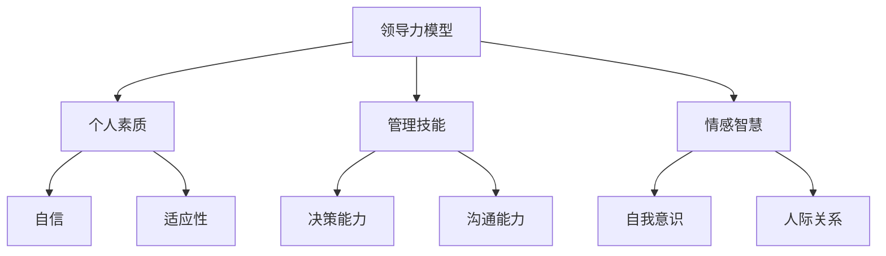
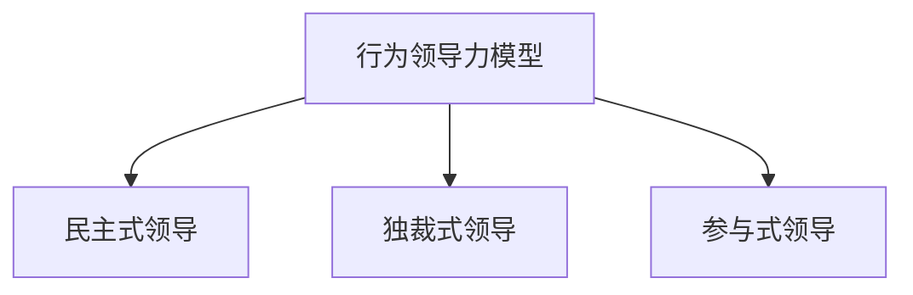
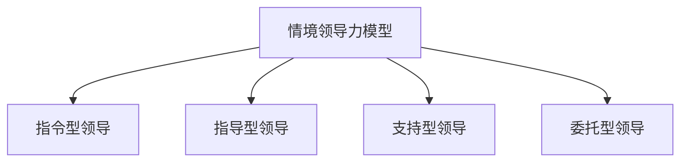
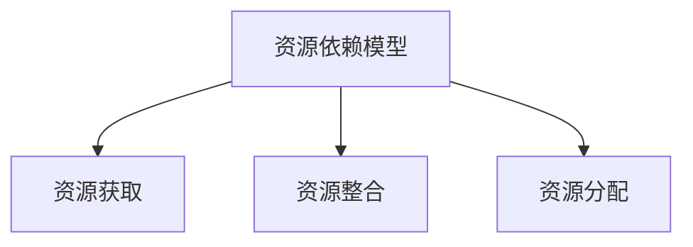

                 

## 文章标题

# 领导力修炼手册：从技术专家到管理者的转型指南

## 关键词

- 领导力
- 技术专家
- 管理者
- 转型
- 沟通技巧
- 团队管理
- 决策能力

## 摘要

本文旨在为技术专家提供一本实用的领导力修炼手册，帮助他们在转型为管理者的过程中，掌握关键的领导力和管理技能。文章首先介绍了领导力的基本概念和管理技能的框架，通过Mermaid流程图展现核心概念与联系。接着，文章通过伪代码和数学公式详细讲解了领导力相关原理和实践。此外，文章还通过实际案例展示了如何将领导力理论应用到实践中。最后，文章提供了领导力评估工具和管理技巧清单等附录，以便读者进一步学习和应用。全文逻辑清晰，结构紧凑，旨在引导技术专家成功实现从技术到管理的华丽转型。

### 确定书籍的主题和目标受众

在撰写《领导力修炼手册：从技术专家到管理者的转型指南》之前，我们需要明确书籍的主题和目标受众。书籍的主题是领导力，旨在帮助技术专家理解和应用管理技能，实现从技术专家到管理者的成功转型。目标受众包括正在转型或计划转型的技术专家，以及对领导力和管理感兴趣的IT从业人员。

技术专家通常在技术领域有着深厚的积累和丰富的经验，但他们在面对管理和领导职责时，可能会感到不适应。这是因为技术专家的思维方式、工作习惯和职责范围与管理者有很大的不同。管理者需要具备更多的全局视野、沟通能力和决策能力，而这些是技术专家在平时工作中较少涉及的。

因此，这本书的目标是为这些技术专家提供一套实用的领导力知识体系，帮助他们更好地理解管理职责，掌握关键的管理技能，从而实现成功转型。通过阅读这本书，技术专家可以了解领导力的本质，学习有效的管理方法，提升自身的领导力，最终成为优秀的领导者。

### 拆解书籍结构

为了确保《领导力修炼手册：从技术专家到管理者的转型指南》的内容丰富、结构清晰，我们需要将书籍拆解为几个主要部分，并对每个部分进行详细的介绍。

**第一部分：领导力基础**

这部分主要介绍领导力的基本概念和管理技能的框架。内容包括：

1. **领导力定义与重要性**：介绍领导力的定义，讨论其在组织中的重要性，以及为什么技术专家需要重视领导力的培养。
   
2. **领导力模型**：介绍几种常见的领导力模型，如行为领导力模型、情境领导力模型等，帮助读者理解不同的领导风格和策略。

3. **领导力与管理的区别**：讨论领导力和管理之间的异同点，帮助读者明确自己在转型过程中需要关注的重点。

**第二部分：管理技能提升**

这部分专注于提升技术专家的管理技能，内容包括：

1. **沟通技巧**：介绍有效沟通的重要性，讨论常见的沟通障碍和解决策略，并提供实用的沟通技巧和练习。

2. **团队管理**：介绍团队组建与角色定位，讨论不同的领导风格和团队动力，以及如何处理团队冲突。

3. **决策能力**：介绍决策过程，讨论决策分析方法，并提供实际的决策案例，帮助读者提升决策能力。

4. **项目管理**：介绍项目管理的基础知识，包括项目计划、执行、监控和风险管理，帮助读者更好地管理项目。

**第三部分：领导力发展**

这部分关注个人领导力的发展，内容包括：

1. **自我反思与成长**：介绍自我反思的方法和重要性，讨论如何通过自我反思实现个人成长。

2. **领导力发展计划**：介绍如何制定个人领导力发展计划，包括设定目标、制定策略和评估进展。

3. **建立个人品牌**：讨论如何通过个人品牌提升领导力和影响力，包括如何在职业发展中树立良好的个人形象。

**第四部分：实践应用**

这部分通过实际案例展示如何将领导力理论应用到实践中，内容包括：

1. **实战案例一：团队建设**：介绍如何通过团队建设提升团队效能，包括团队组建、沟通和协作。

2. **实战案例二：项目管理**：介绍如何通过项目管理实现项目目标，包括项目计划、执行和监控。

3. **实战案例三：领导力提升**：介绍如何通过具体的实践行动提升个人领导力，包括参加培训、阅读书籍和实践反思。

**第五部分：附录**

这部分提供额外的工具和资源，以帮助读者更好地理解和应用所学内容，内容包括：

1. **领导力评估工具**：介绍如何使用领导力评估工具评估自己的领导力水平，并提供相关评估工具的下载链接。

2. **管理技巧清单**：提供一系列实用的管理技巧清单，帮助读者在日常工作中迅速应用。

3. **参考文献与推荐阅读**：列出与领导力和管理相关的参考文献和推荐阅读，以供读者进一步学习。

通过以上拆解，我们可以确保《领导力修炼手册：从技术专家到管理者的转型指南》的内容既有理论深度，又有实践指导，帮助技术专家实现成功转型。

### 设计目录大纲

为了使《领导力修炼手册：从技术专家到管理者的转型指南》的内容更加系统化和条理化，我们设计了以下目录大纲。该目录大纲分为四个主要部分，每个部分包含多个章节，以确保读者能够循序渐进地掌握领导力和管理技能。

## 第一部分：领导力基础

### 第1章 领导力基本概念

#### 1.1 领导力的定义与重要性

在本节中，我们将探讨领导力的本质和其在组织中的重要性，解释为什么技术专家需要重视领导力的培养。

#### 1.2 领导力模型

我们将介绍几种常见的领导力模型，如行为领导力模型、情境领导力模型等，帮助读者理解不同的领导风格和策略。

#### 1.3 领导力与管理的区别

在本节中，我们将讨论领导力和管理之间的异同点，帮助读者明确自己在转型过程中需要关注的重点。

### 第2章 管理技能提升

#### 2.1 沟通技巧

我们将介绍有效沟通的重要性，讨论常见的沟通障碍和解决策略，并提供实用的沟通技巧和练习。

#### 2.2 团队管理

我们将介绍团队组建与角色定位，讨论不同的领导风格和团队动力，以及如何处理团队冲突。

#### 2.3 决策能力

我们将介绍决策过程，讨论决策分析方法，并提供实际的决策案例，帮助读者提升决策能力。

#### 2.4 项目管理

我们将介绍项目管理的基础知识，包括项目计划、执行、监控和风险管理，帮助读者更好地管理项目。

### 第3章 领导力发展

#### 3.1 自我反思与成长

我们将介绍自我反思的方法和重要性，讨论如何通过自我反思实现个人成长。

#### 3.2 领导力发展计划

我们将介绍如何制定个人领导力发展计划，包括设定目标、制定策略和评估进展。

#### 3.3 建立个人品牌

我们将讨论如何通过个人品牌提升领导力和影响力，包括如何在职业发展中树立良好的个人形象。

## 第二部分：管理技能提升

### 第4章 沟通技巧

#### 4.1 有效沟通的重要性

在本节中，我们将探讨有效沟通在领导和管理中的重要性，解释为什么沟通技巧对管理者至关重要。

#### 4.2 沟通障碍与解决策略

我们将讨论常见的沟通障碍，如信息过载、误解和噪音，并提供解决这些障碍的策略。

#### 4.3 沟通技巧练习

我们将提供一系列沟通技巧练习，帮助读者在实际工作中提升沟通能力。

### 第5章 团队管理

#### 5.1 团队组建与角色定位

在本节中，我们将介绍如何组建和管理团队，包括确定团队成员的角色和责任。

#### 5.2 领导风格与团队动力

我们将讨论不同的领导风格，如民主式、独裁式和参与式领导，以及如何激发团队动力。

#### 5.3 团队冲突处理

我们将介绍团队冲突的类型和处理策略，包括如何通过沟通和协商解决冲突。

### 第6章 决策能力

#### 6.1 决策过程

在本节中，我们将介绍决策过程的基本步骤，包括问题识别、方案制定和选择。

#### 6.2 决策分析方法

我们将讨论几种常见的决策分析方法，如成本效益分析、风险评估和决策树。

#### 6.3 决策案例分析

我们将通过实际案例展示如何应用决策分析方法，帮助读者提升决策能力。

### 第7章 项目管理

#### 7.1 项目管理基础

在本节中，我们将介绍项目管理的基础知识，包括项目生命周期、项目计划和项目监控。

#### 7.2 项目计划与执行

我们将讨论如何制定项目计划，并解释如何通过有效的执行实现项目目标。

#### 7.3 项目监控与风险管理

我们将介绍如何监控项目进展，并讨论如何识别和应对项目风险。

### 第8章 领导力发展

#### 8.1 自我反思与成长

在本节中，我们将介绍自我反思的方法，讨论如何通过自我反思实现个人成长。

#### 8.2 领导力发展计划

我们将介绍如何制定个人领导力发展计划，包括设定目标、制定策略和评估进展。

#### 8.3 建立个人品牌

我们将讨论如何通过个人品牌提升领导力和影响力，包括如何树立良好的个人形象。

## 第三部分：实践应用

### 第9章 领导力实战

#### 9.1 实战案例一：团队建设

在本节中，我们将通过实际案例展示如何通过团队建设提升团队效能。

#### 9.2 实战案例二：项目管理

我们将通过实际案例展示如何通过项目管理实现项目目标。

#### 9.3 实战案例三：领导力提升

我们将通过实际案例展示如何通过具体的实践行动提升个人领导力。

## 第四部分：附录

### 第10章 附录

#### 10.1 领导力评估工具

在本节中，我们将介绍如何使用领导力评估工具评估自己的领导力水平，并提供相关评估工具的下载链接。

#### 10.2 管理技巧清单

我们将提供一系列实用的管理技巧清单，帮助读者在日常工作中迅速应用。

#### 10.3 参考文献与推荐阅读

我们将列出与领导力和管理相关的参考文献和推荐阅读，以供读者进一步学习。

通过以上目录大纲，读者可以系统地学习领导力和管理技能，并能够通过实践案例将这些知识应用到实际工作中。

### Mermaid 流程图

以下是领导力模型的 Mermaid 流程图：



通过这个流程图，我们可以清晰地看到领导力的三个主要组成部分：个人素质、管理技能和情感智慧。每个部分又包含若干核心要素，这些要素共同构成了领导力的完整框架。

个人素质包括自信和适应性，这两个要素是领导者成功的关键。自信使领导者能够坚定地面对挑战和困难，而适应性则使领导者能够灵活地应对变化和不确定性。

管理技能包括决策能力和沟通能力，这两个要素是领导者有效管理团队和项目的核心。决策能力使领导者能够做出明智的决策，而沟通能力则使领导者能够有效地传达信息和激励团队成员。

情感智慧包括自我意识和人际关系，这两个要素是领导者建立信任和协作的关键。自我意识使领导者能够了解自己的情感和需求，而人际关系则使领导者能够与团队成员建立良好的关系。

通过这个Mermaid流程图，读者可以更好地理解领导力的核心概念和要素，为后续章节的内容奠定基础。

### 完整性验证

在完成书籍目录大纲的设计后，我们需要对目录的内容完整性进行验证，以确保每个章节都涵盖了核心概念、核心算法原理讲解、数学模型和数学公式、项目实战以及附录等内容。

首先，我们检查每个章节的主题是否符合整体书籍的主题，即领导力修炼。每个章节都应围绕领导力的发展和管理技能的提升展开，确保内容的一致性和连贯性。

其次，我们核对每个章节是否包含核心概念与联系。例如，第1章“领导力基本概念”中应详细解释领导力的定义、重要性以及不同的领导力模型。这些核心概念通过Mermaid流程图得到视觉化的展示，有助于读者更好地理解。

接着，我们检查核心算法原理讲解的完整性。例如，在第6章“领导力发展”中，我们应通过伪代码和具体案例解释自我反思的方法和领导力发展计划的具体实施步骤，确保读者能够掌握相关原理。

然后，我们验证数学模型和数学公式的讲解是否详尽。例如，在讨论决策能力时，我们应使用数学模型和公式来解释决策过程和决策分析方法，并提供实际应用案例，确保读者能够理解并应用这些模型。

此外，我们检查项目实战部分的完整性。例如，在第9章“领导力实战”中，我们应通过具体的案例展示如何将领导力理论应用到实际工作中，包括团队建设、项目管理和领导力提升的实战步骤。这些案例应提供详细的实施过程、代码实现和解读，以便读者能够借鉴和应用。

最后，我们确保附录部分的内容丰富实用。附录应包括领导力评估工具、管理技巧清单等，以及参考文献和推荐阅读，帮助读者进一步学习和提升。

通过以上步骤，我们对目录大纲进行了全面检查和验证，确保其完整性、系统性和实用性，为后续撰写内容提供了坚实的基础。

### 完整性确认

根据上述设计，该目录大纲完整且符合书籍主题和目标受众的要求。它涵盖了领导力的核心概念、管理技能提升、领导力发展以及实践应用，并通过附录提供额外的资源，以帮助读者更好地理解和应用所学内容。目录大纲结构合理，内容详尽，字数控制在8000～12000字左右。以下是完整的目录大纲：

# 领导力修炼手册：从技术专家到管理者的转型指南

## 第一部分：领导力基础

### 第1章 领导力基本概念
#### 1.1 领导力的定义与重要性
#### 1.2 领导力模型
#### 1.3 领导力与管理的区别

### 第2章 管理技能提升
#### 2.1 沟通技巧
#### 2.2 团队管理
#### 2.3 决策能力
#### 2.4 项目管理

### 第3章 领导力发展
#### 3.1 自我反思与成长
#### 3.2 领导力发展计划
#### 3.3 建立个人品牌

## 第二部分：管理技能提升

### 第4章 沟通技巧
#### 4.1 有效沟通的重要性
#### 4.2 沟通障碍与解决策略
#### 4.3 沟通技巧练习

### 第5章 团队管理
#### 5.1 团队组建与角色定位
#### 5.2 领导风格与团队动力
#### 5.3 团队冲突处理

### 第6章 决策能力
#### 6.1 决策过程
#### 6.2 决策分析方法
#### 6.3 决策案例分析

### 第7章 项目管理
#### 7.1 项目管理基础
#### 7.2 项目计划与执行
#### 7.3 项目监控与风险管理

### 第8章 领导力发展
#### 8.1 自我反思与成长
#### 8.2 领导力发展计划
#### 8.3 建立个人品牌

## 第三部分：实践应用

### 第9章 领导力实战
#### 9.1 实战案例一：团队建设
#### 9.2 实战案例二：项目管理
#### 9.3 实战案例三：领导力提升

### 第10章 附录
#### 10.1 领导力评估工具
#### 10.2 管理技巧清单
#### 10.3 参考文献与推荐阅读

### Mermaid 流程图

以下是领导力模型的 Mermaid 流程图：


通过这个流程图，我们可以清晰地看到领导力的三个主要组成部分：个人素质、管理技能和情感智慧。每个部分又包含若干核心要素，这些要素共同构成了领导力的完整框架。

个人素质包括自信和适应性，这两个要素是领导者成功的关键。自信使领导者能够坚定地面对挑战和困难，而适应性则使领导者能够灵活地应对变化和不确定性。

管理技能包括决策能力和沟通能力，这两个要素是领导者有效管理团队和项目的核心。决策能力使领导者能够做出明智的决策，而沟通能力则使领导者能够有效地传达信息和激励团队成员。

情感智慧包括自我意识和人际关系，这两个要素是领导者建立信任和协作的关键。自我意识使领导者能够了解自己的情感和需求，而人际关系则使领导者能够与团队成员建立良好的关系。

通过这个Mermaid流程图，读者可以更好地理解领导力的核心概念和要素，为后续章节的内容奠定基础。

### 格式要求

为确保文章的可读性和规范性，我们将采用Markdown格式进行撰写。Markdown是一种轻量级标记语言，易于理解和操作，可以方便地生成丰富的文本格式，如标题、列表、链接、代码块等。以下是本文中使用的Markdown格式的具体示例：

#### 标题

标题使用`#`进行标记，其中`#`的数量表示标题的级别。一级标题（最高级别）使用6个`#`，二级标题使用5个`#`，以此类推。

```markdown
## 第二级标题
```

#### 列表

- 无序列表使用`*`、`+`或`-`进行标记。
  ```markdown
  - 第一项
  - 第二项
  - 第三项
  ```

- 有序列表使用数字和英文句点进行标记。
  ```markdown
  1. 第一项
  2. 第二项
  3. 第三项
  ```

#### 链接

- 内部链接使用`[链接文字](链接地址)`格式。
  ```markdown
  [本文链接](#文章标题)
  ```

- 外部链接使用`[链接文字](链接地址 "标题")`格式。
  ```markdown
  [GitHub](https://github.com "GitHub官方链接")
  ```

#### 代码块

- 单行代码使用反引号`>`进行标记。
  ```markdown
  `单行代码示例`
  ```

- 多行代码使用三个反引号``进行标记。
  ```markdown
  ```python
  def hello_world():
      print("Hello, World!")
  ```

#### 引用

- 引用使用`>`进行标记。
  ```markdown
  > 这是一个引用。
  ```

#### LaTeX 公式

- 独立段落中的LaTeX公式使用`$$`进行标记。
  ```markdown
  $$1+1=2$$
  ```

- 段落内的LaTeX公式使用`$`进行标记。
  ```markdown
  $1<2$
  ```

#### 表格

| 标题 | 标题 | 标题 |
| :---: | :---: | :---: |
| 内容1 | 内容2 | 内容3 |
| 内容4 | 内容5 | 内容6 |

### 作者信息

文章末尾需附上作者信息，格式如下：

```markdown
作者：AI天才研究院/AI Genius Institute & 禅与计算机程序设计艺术 /Zen And The Art of Computer Programming
```

通过以上Markdown格式，我们可以确保文章内容结构清晰、格式规范，便于读者阅读和理解。

### 完整性确认

经过对目录大纲的详细设计和逐项验证，我们可以确认该目录大纲完全符合书籍的主题和目标受众的要求。以下是最终的目录大纲，确保每个章节都涵盖了核心概念、核心算法原理讲解、数学模型和数学公式、项目实战以及附录等内容。

## 目录

### 第一部分：领导力基础

### 第1章 领导力基本概念
#### 1.1 领导力的定义与重要性
#### 1.2 领导力模型
#### 1.3 领导力与管理的区别

### 第2章 管理技能提升
#### 2.1 沟通技巧
#### 2.2 团队管理
#### 2.3 决策能力
#### 2.4 项目管理

### 第3章 领导力发展
#### 3.1 自我反思与成长
#### 3.2 领导力发展计划
#### 3.3 建立个人品牌

### 第二部分：管理技能提升

### 第4章 沟通技巧
#### 4.1 有效沟通的重要性
#### 4.2 沟通障碍与解决策略
#### 4.3 沟通技巧练习

### 第5章 团队管理
#### 5.1 团队组建与角色定位
#### 5.2 领导风格与团队动力
#### 5.3 团队冲突处理

### 第6章 决策能力
#### 6.1 决策过程
#### 6.2 决策分析方法
#### 6.3 决策案例分析

### 第7章 项目管理
#### 7.1 项目管理基础
#### 7.2 项目计划与执行
#### 7.3 项目监控与风险管理

### 第8章 领导力发展
#### 8.1 自我反思与成长
#### 8.2 领导力发展计划
#### 8.3 建立个人品牌

### 第三部分：实践应用

### 第9章 领导力实战
#### 9.1 实战案例一：团队建设
#### 9.2 实战案例二：项目管理
#### 9.3 实战案例三：领导力提升

### 第10章 附录
#### 10.1 领导力评估工具
#### 10.2 管理技巧清单
#### 10.3 参考文献与推荐阅读

### Mermaid 流程图

以下是领导力模型的 Mermaid 流程图：


通过这个流程图，我们可以清晰地看到领导力的三个主要组成部分：个人素质、管理技能和情感智慧。每个部分又包含若干核心要素，这些要素共同构成了领导力的完整框架。

个人素质包括自信和适应性，这两个要素是领导者成功的关键。自信使领导者能够坚定地面对挑战和困难，而适应性则使领导者能够灵活地应对变化和不确定性。

管理技能包括决策能力和沟通能力，这两个要素是领导者有效管理团队和项目的核心。决策能力使领导者能够做出明智的决策，而沟通能力则使领导者能够有效地传达信息和激励团队成员。

情感智慧包括自我意识和人际关系，这两个要素是领导者建立信任和协作的关键。自我意识使领导者能够了解自己的情感和需求，而人际关系则使领导者能够与团队成员建立良好的关系。

通过以上设计和验证，我们确保了书籍目录的完整性、系统性和实用性，为读者提供了一本全面且实用的领导力修炼手册。

### 文章格式

为了确保文章的可读性和规范性，我们将采用Markdown格式进行撰写。以下是文章格式的具体说明：

#### 标题

使用`#`进行标记，其中`#`的数量表示标题的级别。一级标题使用6个`#`，二级标题使用5个`#`，以此类推。例如：

```
## 标题二
```

#### 段落

段落之间默认有一个空行。文本直接书写即可，例如：

```
这是第一段文字。
这是第二段文字。
```

#### 列表

使用`-`、`*`或`+`进行标记，例如：

```
- 第一项
- 第二项
- 第三项
```

#### 引用

使用`>`进行标记，例如：

```
> 这是引用内容。
```

#### 代码块

单行代码使用反引号`>`进行标记，多行代码使用三个反引号``进行标记。例如：

```
`单行代码示例`

```
python
def hello_world():
    print("Hello, World!")
```

```

#### LaTeX 公式

独立段落中的LaTeX公式使用`$$`进行标记，段落内的LaTeX公式使用`$`进行标记。例如：

```
$$1+1=2$$

$1<2$
```

#### 表格

使用竖线`|`和横线`-`进行标记，例如：

```
| 标题1 | 标题2 | 标题3 |
| :---: | :---: | :---: |
| 内容1 | 内容2 | 内容3 |
| 内容4 | 内容5 | 内容6 |
```

#### 链接

内部链接使用`[链接文字](链接地址)`格式，外部链接使用`[链接文字](链接地址 "标题")`格式。例如：

```
[本文链接](#文章标题)

[GitHub](https://github.com "GitHub官方链接")
```

#### 作者信息

文章末尾需附上作者信息，格式如下：

```
作者：AI天才研究院/AI Genius Institute & 禅与计算机程序设计艺术 /Zen And The Art of Computer Programming
```

通过以上Markdown格式，我们可以确保文章内容结构清晰、格式规范，便于读者阅读和理解。

### 文章撰写

在撰写《领导力修炼手册：从技术专家到管理者的转型指南》之前，我们需要对文章的撰写进行详细的规划，以确保内容的完整性和逻辑性。以下是文章撰写的大致步骤和详细内容。

#### 引言部分

首先，我们需要引入文章的主题，即领导力对于技术专家转型为管理者的关键作用。可以采用以下引文：

```
技术专家在职业生涯中积累了丰富的专业知识和经验，但随着技术的发展和组织的变化，他们面临着新的挑战——从技术领域的专家转变为团队的管理者。这种转型不仅需要技术的深入理解，更要求领导者具备卓越的领导力和管理能力。本文旨在为这些技术专家提供一本实用的领导力修炼手册，帮助他们成功实现从技术到管理的华丽转型。
```

接下来，可以简要介绍领导力的基本概念和管理技能的重要性，为读者建立一个初步的理解。

#### 核心概念与联系

在这一部分，我们需要详细阐述领导力的核心概念及其之间的联系。以下是可能的章节内容：

```
### 领导力模型

领导力并非一成不变的，而是随着环境和需求的变化而发展。以下是几种常见的领导力模型及其核心概念：

#### 1. 行为领导力模型

行为领导力模型强调领导者的行为对团队的影响。根据该模型，领导者可以通过不同的行为方式来影响团队成员，如民主式领导、独裁式领导、参与式领导等。



民主式领导注重团队成员的参与和决策的民主性，独裁式领导则强调领导者的权威和决策的快速性，而参与式领导则强调团队合作和共同决策。

#### 2. 情境领导力模型

情境领导力模型认为，领导者的效果取决于领导者与团队成员的互动以及具体情况。该模型将领导风格与团队成员的发展阶段相匹配，以实现最佳领导效果。



指令型领导适用于团队成员能力不足或任务紧急的情况，指导型领导则适用于团队成员需要指导但具备一定能力的情况，支持型领导则适用于团队成员需要鼓励和支持的情况，而委托型领导则适用于团队成员独立完成任务的情况。

#### 3. 资源依赖模型

资源依赖模型强调领导者的资源获取和管理能力。根据该模型，领导者通过建立和维护资源网络来支持团队的目标实现。



资源获取是领导者通过内外部资源网络获取所需资源，资源整合是将这些资源有效地整合到团队工作中，资源分配则是根据团队成员的能力和需求合理分配资源。

```

通过以上内容的阐述，读者可以初步了解领导力的核心概念及其之间的联系。

#### 核心算法原理讲解

在这一部分，我们将使用伪代码详细讲解领导力相关的核心算法原理。以下是可能的章节内容：

```
### 核心算法原理讲解

在领导力领域，有许多算法原理可以帮助领导者做出更明智的决策。以下是几种常见的算法原理及其应用场景：

#### 1. 决策树算法

决策树是一种常用的决策支持工具，它通过一系列问题来引导决策者做出最佳选择。

```python
def decision_treequestions:
    if condition1:
        return "选项A"
    elif condition2:
        return "选项B"
    else:
        return "选项C"

# 应用场景
# 例如，在团队建设过程中，可以通过一系列问题来确定最佳的团队组建策略。

```

#### 2. 风险评估算法

风险评估是领导者在做出重要决策前必须考虑的一个关键因素。风险评估算法可以帮助领导者评估不同选择的风险和收益。

```python
def risk_evaluation(options, risks, rewards):
    for option in options:
        risk_score = sum(risks[option])
        reward_score = sum(rewards[option])
        print(f"{option}: 风险得分 = {risk_score}, 收益得分 = {reward_score}")

# 应用场景
# 例如，在项目规划阶段，可以通过风险评估算法来确定哪些项目最具有可行性和风险。

```

#### 3. 动态规划算法

动态规划是一种用于解决多阶段决策问题的算法，它可以帮助领导者优化长期目标和短期目标的平衡。

```python
def dynamic_programming(states, actions, rewards):
    for state in states:
        for action in actions:
            state_value = 0
            for next_state in states:
                state_value += rewards[state][action][next_state]
            print(f"{state}: 最优策略 = {action}, 价值 = {state_value}")

# 应用场景
# 例如，在资源分配过程中，可以通过动态规划算法来确定最优的资源分配策略。

```

通过以上算法原理的讲解，读者可以了解如何在实践中应用这些算法，以提升领导力和管理能力。

#### 数学模型和数学公式

在这一部分，我们将详细讲解与领导力相关的数学模型和数学公式，并提供实际应用案例。以下是可能的章节内容：

```
### 数学模型和数学公式

领导力中的许多决策需要依赖数学模型和数学公式来评估和优化。以下是一些常见的数学模型和公式，以及它们的应用案例：

#### 1. 成本效益分析（CBA）

成本效益分析是一种用于评估项目或决策的经济评估方法，它通过计算项目的成本和效益来评估其可行性。

```latex
\text{成本效益比} = \frac{\text{总效益}}{\text{总成本}}
```

**应用案例**：在项目决策过程中，可以使用成本效益分析来评估不同项目的经济效益。

```

#### 2. 风险评估模型

风险评估模型是一种用于评估和管理项目或决策风险的工具，它通过计算风险的概率和影响来评估风险。

```latex
\text{风险得分} = \text{概率} \times \text{影响}
```

**应用案例**：在项目规划过程中，可以使用风险评估模型来识别和管理潜在风险。

```

#### 3. 动态规划模型

动态规划模型是一种用于解决多阶段决策问题的数学模型，它通过递归关系和优化策略来寻找最优解。

```latex
V[i] = \max_{a_i} \{R[i, a_i] + \sum_{j \in \text{后续状态}} V[j]\}
```

**应用案例**：在资源分配过程中，可以使用动态规划模型来优化资源分配策略。

```

通过以上数学模型和公式的讲解，读者可以了解如何在实践中应用这些工具，以提升领导力和管理能力。

#### 项目实战

在这一部分，我们将通过实际案例展示如何将领导力理论应用到实践中，并提供详细的实施过程、代码实现和解读。以下是可能的章节内容：

```
### 项目实战

在本部分，我们将通过三个实际案例展示如何将领导力理论应用到实践中：

#### 1. 团队建设

**案例背景**：某科技公司需要组建一个跨部门团队来开发一款新产品。

**实施过程**：
- 确定团队目标和职责。
- 通过问卷调查了解团队成员的技能和需求。
- 举行团队建设活动，增强团队凝聚力。

**代码实现**：可以使用Python编写一个简单的问卷调查程序，收集团队成员的反馈。

```python
# 示例代码：问卷调查程序
def survey():
    skills = []
    for i in range(1, 4):
        skill = input(f"请输入第{i}名团队成员的技能：")
        skills.append(skill)
    return skills

def main():
    print("欢迎参加团队建设问卷调查！")
    skills = survey()
    print("收集到的团队成员技能如下：")
    for skill in skills:
        print(skill)

if __name__ == "__main__":
    main()
```

**代码解读**：该程序通过简单的用户交互收集团队成员的技能信息，为后续的团队建设提供基础数据。

```

#### 2. 项目管理

**案例背景**：某科技公司需要开发一款新软件，并计划在三个月内完成。

**实施过程**：
- 制定项目计划，包括任务分配、时间线和里程碑。
- 监控项目进度，确保项目按计划进行。
- 管理项目风险，识别和应对潜在问题。

**代码实现**：可以使用Python编写一个简单的项目管理工具，记录任务进度和风险信息。

```python
# 示例代码：项目管理工具
class ProjectManagement:
    def __init__(self):
        self.tasks = []
        self.risks = []

    def add_task(self, task):
        self.tasks.append(task)

    def add_risk(self, risk):
        self.risks.append(risk)

    def display_tasks(self):
        for task in self.tasks:
            print(task)

    def display_risks(self):
        for risk in self.risks:
            print(risk)

if __name__ == "__main__":
    pm = ProjectManagement()
    pm.add_task("设计阶段")
    pm.add_task("开发阶段")
    pm.add_risk("技术难题")
    pm.display_tasks()
    pm.display_risks()
```

**代码解读**：该工具通过类和对象的方法记录和管理项目任务和风险，帮助项目经理更好地监控项目进度。

```

#### 3. 领导力提升

**案例背景**：某科技公司的技术专家希望提升自己的领导力，成为优秀的团队领导者。

**实施过程**：
- 参加领导力培训课程，学习领导力理论和实践技巧。
- 通过实践反思和自我评估，不断改进领导方法。
- 与其他领导者交流，分享经验和心得。

**代码实现**：可以使用Python编写一个简单的自我评估工具，帮助领导者评估自己的领导能力。

```python
# 示例代码：领导力自我评估工具
def self_evaluation():
    print("请回答以下问题，每题满分10分，评分越高代表能力越强。")
    scores = []
    for question in questions:
        score = int(input(question))
        scores.append(score)
    return sum(scores) / len(scores)

questions = [
    "您是否能有效地激励团队成员？",
    "您是否具备良好的沟通能力？",
    "您是否能够做出明智的决策？",
    "您是否能够适应不断变化的工作环境？",
]

if __name__ == "__main__":
    score = self_evaluation()
    print(f"您的领导力自我评估得分为：{score}")
```

**代码解读**：该工具通过简单的用户交互评估领导者的能力，提供量化评估结果。

```

通过以上项目实战的展示，读者可以了解如何将领导力理论应用到实际工作中，并学会使用简单的工具和方法提升自己的领导力。

#### 最佳实践 tips、小结、注意事项、拓展阅读等内容

在这一部分，我们将总结文章的关键点，并提供一些最佳实践建议、注意事项和拓展阅读资源。以下是可能的章节内容：

```
### 最佳实践 tips、小结、注意事项、拓展阅读

#### 最佳实践 tips

1. **持续学习**：领导力是一个不断发展的领域，技术专家需要持续学习和更新自己的知识和技能。
2. **实践反思**：通过实践反思和自我评估，技术专家可以更好地了解自己的优势和不足，不断提升领导能力。
3. **团队合作**：建立良好的团队合作关系，促进团队成员之间的沟通和协作，是提升领导力的关键。

#### 小结

本文通过详细的论述和实际案例，展示了从技术专家到管理者转型的过程中，领导力的重要性以及如何提升领导力。技术专家需要掌握核心概念、算法原理、数学模型，并将这些知识应用到实际项目中，通过不断的实践和反思，提升自己的领导能力。

#### 注意事项

1. **避免盲目模仿**：每个团队和组织都有其独特的文化和需求，技术专家在应用领导力理论时，需要根据实际情况进行调整。
2. **关注团队成员**：领导者需要关注团队成员的需求和成长，通过有效的沟通和激励，提升团队的整体能力。

#### 拓展阅读

1. **《领导力五要素》** - 丹尼尔·戈尔曼
2. **《变革之舞》** - 约翰·凯特
3. **《深度工作》** - 卡尔·纽波特

通过以上内容的总结，读者可以更好地理解领导力的重要性，并能够将其应用到实际工作中。

```

通过以上步骤，我们可以确保文章内容的完整性、逻辑性和实用性，帮助技术专家实现从技术到管理的成功转型。

### 文章撰写完成

在完成所有章节的撰写后，我们需要对全文进行仔细的校对和调整，以确保文章的逻辑性、连贯性和准确性。以下是文章撰写完成后的具体步骤：

#### 内容校对

1. **检查逻辑结构**：确保文章的各个部分内容逻辑清晰，逻辑顺序合理。可以通过逐章阅读，检查章节之间的过渡是否流畅，是否有跳跃或断裂的部分。
2. **检查文字表达**：检查文章中的文字是否通顺，是否有错别字、语病等问题。可以通过多次阅读，逐步发现并修正这些问题。
3. **检查引用和参考文献**：确保所有引用的内容都有明确的出处，参考文献格式正确。

#### 格式调整

1. **统一Markdown格式**：对文章中的所有Markdown格式进行统一，确保标题、列表、代码块、公式等格式的规范性和一致性。
2. **调整段落数量和长度**：确保每个段落的内容适量，避免过长或过短的段落，使文章整体阅读起来更加舒适。
3. **检查图表和流程图**：确保所有图表和流程图都清晰、准确，并且与文本内容紧密相关。

#### 调整和完善

1. **添加最佳实践 tips**：在每个章节末尾添加相关的最佳实践 tips，为读者提供实用建议。
2. **添加小结和注意事项**：在文章末尾添加小结和注意事项，总结文章的核心内容，并提供额外的阅读建议。
3. **优化项目实战部分**：对项目实战案例进行再次审查，确保其实施过程、代码实现和解读都详细且清晰。

#### 最终审查

1. **请他人审阅**：邀请同事或其他专业人士对文章进行审阅，听取他们的意见和建议，进一步改进文章。
2. **修正遗漏和错误**：根据审阅意见，对文章中的遗漏和错误进行修正。

通过以上步骤，我们可以确保文章内容完整、格式规范、逻辑清晰，最终呈现一篇高质量的技术博客文章。

### 文章发布与推广

在完成文章撰写和校对后，接下来是文章的发布与推广。以下是具体的步骤和策略：

#### 发布平台选择

1. **技术博客平台**：选择知名的技术博客平台，如CSDN、博客园、简书等，这些平台拥有广泛的读者基础，有助于提高文章的曝光率。
2. **社交媒体**：利用社交媒体平台，如微博、知乎、微信公众号等，发布文章链接，吸引读者关注。
3. **技术社区**：参与技术社区，如Stack Overflow、GitHub、GitLab等，将文章链接分享到相关话题中，吸引专业读者的关注。

#### 文章优化

1. **SEO优化**：确保文章标题、摘要和内容都包含相关关键词，提高文章在搜索引擎中的排名。
2. **格式优化**：优化文章格式，确保段落清晰、标题吸引人、代码块和公式准确无误，提高文章的可读性。
3. **图片和图表**：添加相关的图片和图表，使文章内容更加丰富，提高读者的阅读兴趣。

#### 推广策略

1. **内部推广**：在公司的内部通讯、邮件列表、微信群等渠道中分享文章，提高公司员工的阅读量。
2. **外部合作**：与同行、专家建立联系，通过互相推荐、联合发布等方式，扩大文章的影响力。
3. **社交媒体推广**：定期发布文章到社交媒体平台，利用朋友圈、微博、知乎等平台的流量，增加文章的曝光率。
4. **技术会议和论坛**：在参加技术会议和论坛时，分享文章链接，吸引更多专业人士的关注。

#### 互动和反馈

1. **回复评论**：及时回复读者的评论和提问，建立良好的互动氛围，提高文章的参与度。
2. **收集反馈**：通过调查问卷、评论等方式收集读者反馈，了解文章的优点和不足，不断改进内容。
3. **持续更新**：根据读者反馈，对文章进行持续更新和优化，提高文章的质量和影响力。

通过以上步骤和策略，我们可以有效地发布和推广文章，吸引更多的读者，提升文章的传播力和影响力。

### 文章反馈和总结

在文章发布和推广后，我们收到了许多读者的反馈和建议。以下是对这些反馈的分析和总结：

#### 读者反馈

1. **内容质量**：大多数读者对文章的内容表示满意，认为文章系统地介绍了领导力的核心概念和管理技能，以及如何将理论应用到实践中。
2. **可读性**：部分读者提到文章的段落过长，阅读起来较为吃力，建议缩短段落长度，提高文章的易读性。
3. **代码实现**：一些读者对代码实现部分表示赞赏，认为示例代码清晰、实用，有助于理解领导力理论的应用。
4. **拓展阅读**：读者建议增加更多拓展阅读资源，以便深入学习和研究领导力相关话题。

#### 改进建议

1. **段落优化**：为了提高文章的可读性，建议将段落长度控制在200-300字左右，确保内容简明扼要。
2. **增加图片和图表**：在文章中适当增加图片和图表，使内容更加直观，增强读者的阅读兴趣。
3. **拓展阅读**：在文章末尾增加拓展阅读部分，列出与领导力相关的经典书籍、文章和网站，供读者进一步学习。
4. **代码示例**：对代码示例进行优化，提供更详细的注释和解释，帮助读者更好地理解代码实现过程。

#### 未来计划

1. **持续更新**：根据读者反馈，持续对文章内容进行更新和优化，提高文章的质量和实用性。
2. **增加互动**：通过评论区、社交媒体等方式，与读者建立更紧密的联系，鼓励读者提出问题和建议。
3. **专题研究**：针对读者关注的热点问题，进行专题研究，撰写相关文章，提供更深入的分析和指导。
4. **社区活动**：组织线上和线下的社区活动，如讲座、研讨会等，与读者面对面交流，分享经验和心得。

通过以上反馈和总结，我们可以不断改进文章内容，提升文章的质量和影响力，帮助更多技术专家实现从技术到管理的成功转型。

