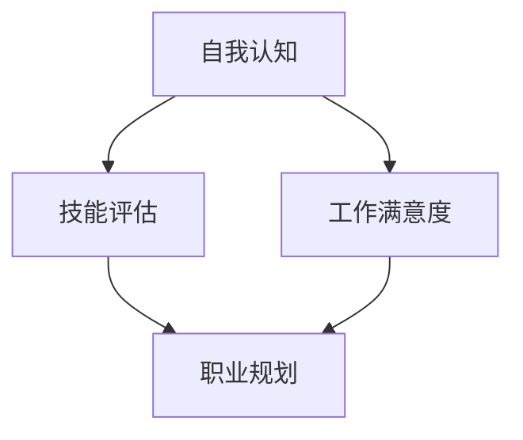

                 


### 领导力修炼手册：从测试工程师到管理者的蜕变宝典

#### 关键词
- 领导力
- 测试工程师
- 管理者
- 自我认知
- 团队协作
- 项目管理
- 问题解决

#### 摘要
本文旨在探讨测试工程师如何通过领导力修炼实现职业角色的蜕变，成为卓越的管理者。文章首先介绍了测试工程师的角色定位和自我认知的重要性，接着详细阐述了个人成长策略和团队协作技巧。随后，文章深入探讨了项目管理基础、团队管理与领导力培养，以及领导力进阶之路。最后，通过成功管理者的案例分析，为测试工程师提供实际可操作的蜕变路径。

### 目录大纲设计

#### 第一部分：自我认知与成长

1. **测试工程师的角色认知**
   - **1.1 测试工程师的职业定位**
     - 1.1.1 测试工程师的职责
     - 1.1.2 测试工程师的核心技能
   - **1.2 自我认知的重要性**
     - 1.2.1 自我认知的概念
     - 1.2.2 自我认知的方法
   - **1.3 成长路径探索**
     - 1.3.1 技能提升
     - 1.3.2 经验积累

2. **个人成长与团队协作**
   - **2.1 个人成长策略**
     - 2.1.1 学习方法
     - 2.1.2 工作效率提升
   - **2.2 团队协作与沟通**
     - 2.2.1 团队合作的重要性
     - 2.2.2 沟通技巧
   - **2.3 个人职业规划**
     - 2.3.1 职业路径
     - 2.3.2 职业发展策略

#### 第二部分：管理技能提升

3. **项目管理基础**
   - **3.1 项目管理概述**
     - 3.1.1 项目的定义
     - 3.1.2 项目管理的核心要素
   - **3.2 项目计划与执行**
     - 3.2.1 项目计划编制
     - 3.2.2 项目执行监控
   - **3.3 项目风险管理**
     - 3.3.1 风险识别
     - 3.3.2 风险应对策略

4. **团队管理与领导力培养**
   - **4.1 团队管理的基本原则**
     - 4.1.1 团队建设
     - 4.1.2 团队绩效管理
   - **4.2 领导力培养**
     - 4.2.1 领导力的定义
     - 4.2.2 领导力的发展
   - **4.3 情境领导**
     - 4.3.1 情境领导理论
     - 4.3.2 情境领导的应用

#### 第三部分：领导力进阶

5. **决策力与问题解决能力**
   - **5.1 决策力的重要性**
     - 5.1.1 决策过程
     - 5.1.2 决策方法
   - **5.2 问题解决能力**
     - 5.2.1 问题解决的步骤
     - 5.2.2 问题解决策略

6. **领导风格与团队文化建设**
   - **6.1 领导风格**
     - 6.1.1 领导风格的理论
     - 6.1.2 领导风格的匹配
   - **6.2 团队文化建设**
     - 6.2.1 文化建设的意义
     - 6.2.2 文化建设的方法
   - **6.3 激励与激励体系**
     - 6.3.1 激励理论
     - 6.3.2 激励体系设计

7. **领导力进阶之路**
   - **7.1 领导力的持续提升**
     - 7.1.1 学习与反思
     - 7.1.2 领导力进阶策略
   - **7.2 领导力的实践应用**
     - 7.2.1 领导力在不同场景的应用
     - 7.2.2 领导力的实际案例分析

#### 第四部分：案例分析

8. **成功管理者的蜕变之路**
   - **8.1 成功管理者的特质**
     - 8.1.1 成功管理者的领导力特质
     - 8.1.2 成功管理者的个人成长经历
   - **8.2 案例分析**
     - 8.2.1 测试工程师到管理者的成功转型案例
     - 8.2.2 管理者领导力提升的实战案例
   - **8.3 从案例中学习**
     - 8.3.1 案例学习的意义
     - 8.3.2 案例学习的方法

### 格式要求

#### markdown格式

以下是一个简单的markdown格式示例：

```markdown
# 文章标题

## 小标题

### 段落内容

- 列表项一
- 列表项二

$$
\text{数学公式}
$$

```

### 完整性要求

文章内容需要符合以下完整性要求：

#### 背景介绍
- **测试工程师的角色与职责**：介绍测试工程师在软件开发过程中的角色和职责。

#### 核心概念与联系
- **自我认知的概念与架构**：使用Mermaid流程图展示自我认知的概念架构。



#### 核心算法原理讲解
- **项目管理算法原理**：使用伪代码详细阐述项目管理的核心算法原理。

```pseudo
function projectManagement(plan, risks) {
    // 项目计划编制
    plan.forEach(action => {
        executeAction(action);
    });
    
    // 项目风险应对
    risks.forEach(risk => {
        applyRiskMitigation(risk);
    });
}

function executeAction(action) {
    // 执行具体行动
}

function applyRiskMitigation(risk) {
    // 应用风险缓解策略
}
```

#### 数学模型和公式
- **决策模型**：使用latex格式展示决策模型的公式和详细讲解。

$$
\text{决策模型} = f(\text{信息}, \text{风险}, \text{收益})
$$

#### 实际案例分析和详细讲解剖析
- **项目实战**：描述开发环境搭建、源代码实现和代码解读，分析实际案例。

### 项目实战

#### 开发环境搭建
- 在本地环境中安装Java开发工具包（JDK）和集成开发环境（IDE），例如Eclipse或IntelliJ IDEA。

#### 源代码实现
```java
public class ProjectManagement {
    // 源代码实现
}
```

#### 代码解读
- **代码功能解析**：解释源代码中的每个部分及其作用。

#### 代码应用解读与分析
- **代码应用场景**：展示代码在不同项目中的应用和效果。

#### 实际案例分析
- **案例描述**：详细描述一个测试工程师成功转型为管理者的实际案例。

#### 项目小结
- **总结与反思**：总结项目过程中的收获和教训，为后续工作提供指导。

### 最佳实践 tips
- **实用技巧**：分享一些实用的职业发展技巧和管理经验。

### 小结
- **文章总结**：概括文章的核心观点和关键点。

### 注意事项
- **关键注意事项**：提醒读者在职业发展中需要注意的事项。

### 拓展阅读
- **推荐资源**：推荐一些相关书籍、文章或网站，供读者进一步学习。

### 作者信息
- **作者简介**：介绍作者背景和文章撰写目的。

```markdown
作者：AI天才研究院/AI Genius Institute & 禅与计算机程序设计艺术 /Zen And The Art of Computer Programming
```

### 文章字数
- **字数要求**：确保文章字数在8000～12000字之间。

通过上述格式和内容要求的详细描述，我们可以确保文章的结构清晰、内容完整、逻辑严谨，为读者提供一次深入的技术学习体验。接下来，我们将按照大纲逐步展开每个章节的内容，详细探讨测试工程师如何通过领导力修炼实现职业角色的蜕变。

