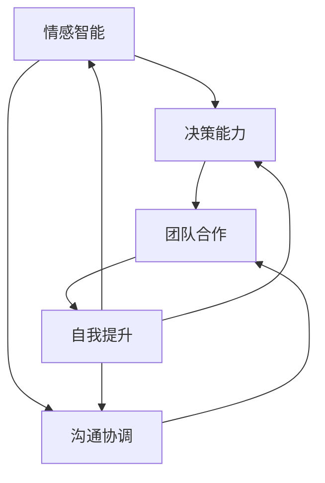

                 

### 引言

在信息技术迅猛发展的时代，工程师的角色日益多样化，特别是在测试工程师这个职位上。测试工程师在软件开发过程中扮演着至关重要的角色，他们负责确保软件的质量和可靠性。然而，随着职业的发展，许多测试工程师开始意识到，仅仅掌握技术技能并不能保证职业生涯的持续成功。管理技能，尤其是领导力，成为他们追求更高职业发展的重要课题。

《领导力修炼手册：从测试工程师到管理者的逆袭宝典》旨在帮助那些希望从技术专家角色转变为管理者的测试工程师。本书的内容涵盖了从基本领导力概念到高级管理技能的各个方面，通过深入分析和具体实例，为广大测试工程师提供一套系统化的领导力提升方案。

本书的目标读者是那些已经在测试领域有一定经验的工程师，他们渴望拓展自己的职业道路，提升领导力和管理能力，以便在职业生涯中实现更高的成就。无论是从测试工程师晋升为初级管理者，还是进一步迈向中级和高级管理职位，本书都将为他们提供实用的指导。

在接下来的章节中，我们将首先探讨领导力的基础概念，包括其定义、重要性以及核心技能。接着，我们将分析测试工程师到管理者的转变，探讨这一转变所需的关键技能和职业发展路径。随后，通过详细的算法和数学模型讲解，我们将帮助读者理解领导力背后的科学原理。此外，本书还将通过实际项目案例和实战策略，提供领导力提升的可行路径。最后，我们将探讨领导力的持续修炼，总结成功领导者的养成策略，并提供相关的资源和推荐书籍。

通过这本书，我们希望能够为测试工程师们提供一把开启管理之门的钥匙，助力他们在职业生涯中实现从技术专家到卓越管理者的华丽转身。

### 设计《领导力修炼手册：从测试工程师到管理者的逆袭宝典》的目录大纲

为了系统地引导测试工程师从技术专家向管理者转型，本书设计了详细的目录大纲，涵盖了领导力从基础到实践的各个方面。以下是本书的目录大纲：

#### 第一章：领导力基础
1. **1.1 领导力的定义和起源**
    - 领导力的起源与演变
    - 领导力在现代企业中的重要性
2. **1.2 领导力的重要性**
    - 对个人职业生涯的影响
    - 对团队和组织效能的推动
3. **1.3 领导风格与沟通技巧**
    - 授权型领导
    - 参与型领导
    - 指导型领导
4. **1.4 领导力的四个核心技能**
    - 情感智能
    - 决策能力
    - 沟通协调
    - 领导力自我提升

#### 第二章：从测试工程师到管理者的转变
1. **2.1 测试工程师的角色与职责**
    - 测试工程师的基本工作职责
    - 质量保证与风险管理
2. **2.2 管理者所需的关键技能**
    - 项目管理
    - 团队协作
    - 决策能力
3. **2.3 职业发展路径分析**
    - 初级管理者的发展路径
    - 中级管理者的发展路径
    - 高级管理者的发展路径

#### 第三章：领导力的核心概念与联系
1. **3.1 领导力核心概念图解**
    - 领导力框架的构建
    - 关键概念之间的关系
2. **3.2 领导力与组织行为的关系**
    - 领导力对组织文化的影响
    - 领导力在组织变革中的作用
3. **3.3 经典领导力模型探讨**
    - 权变理论
    - 超级领导力模型
    - 领导行为模型

#### 第四章：核心算法原理讲解
1. **4.1 领导决策算法伪代码**
    - 决策过程中的算法实现
    - 伪代码的具体描述
2. **4.2 领导力评估与提升算法**
    - 评估模型的设计与实现
    - 提升路径的算法优化
3. **4.3 领导力发展路径算法**
    - 经验学习算法
    - 机器学习在领导力分析中的应用

#### 第五章：数学模型和数学公式
1. **5.1 领导力数学模型**
    - 决策模型
    - 团队合作模型
    - 领导影响力模型
2. **5.2 公式推导与详细讲解**
    - 公式推导的过程
    - 模型的应用与解释
3. **5.3 举例说明**
    - 实际案例中的应用
    - 效果分析与验证

#### 第六章：项目实战
1. **6.1 管理者角色模拟与实战**
    - 管理者角色模拟过程
    - 实战过程中的经验与反思
2. **6.2 项目管理实战案例分析**
    - 项目规划与执行
    - 项目风险管理
    - 项目团队建设
3. **6.3 领导力提升的实战策略**
    - 自我反思
    - 学习与培训
    - 反馈与改进

#### 第七章：领导力的持续修炼
1. **7.1 领导力持续发展的方法**
    - 持续学习的方法
    - 实践与反思
2. **7.2 领导力评估与反馈**
    - 自我评估的方法
    - 反馈机制的构建
3. **7.3 成功领导者的养成策略**
    - 建立个人愿景
    - 持续学习与创新
    - 培养团队精神

#### 附录
1. **附录A：领导力相关资源与工具**
    - 常用的领导力工具和资源
    - 在线学习和评估平台
2. **附录B：经典领导力书籍推荐**
    - 推荐书籍清单
    - 书籍内容摘要与推荐理由

通过这一系统的目录大纲，本书旨在为测试工程师提供全面的领导力提升路径，帮助他们成功实现职业转型。

#### 第一章：领导力基础

领导力是一种特殊的能力，它不仅关乎个人的职业发展，更是一个团队和组织效能的关键因素。在这一章中，我们将深入探讨领导力的定义、重要性及其核心技能，为读者打下坚实的领导力基础。

### 1.1 领导力的定义和起源

领导力可以追溯到古代，当时的首领通过自身的智慧、勇气和决策能力带领部落生存和发展。然而，在现代管理学中，领导力被赋予更广泛的定义和内涵。简而言之，领导力是指通过影响和激励他人，以实现共同目标和价值观的能力。

领导力的起源可以追溯到几个重要的历史时期。在工业革命初期，领导力主要与指挥和控制相关，目的是提高生产效率和确保工作秩序。随着时间的发展，领导力的内涵逐渐丰富，不再仅仅局限于权威和命令，而更多地关注团队协作、个人发展和组织文化。

在现代企业中，领导力的重要性体现在多个方面。首先，领导力能够激发团队的潜能，提高整体工作效率。一个优秀的领导者能够营造积极的工作氛围，激发团队成员的创新意识和团队合作精神。其次，领导力对于组织文化的塑造具有深远的影响。领导者通过自己的行为和决策，传递组织的价值观和使命，从而形成一种凝聚力和归属感。

此外，领导力对个人职业生涯也有着重要的影响。具备领导力的人往往更容易获得职业发展的机会，因为他们能够有效地应对复杂的工作环境和挑战。同时，领导力也是一种自我提升的工具，通过不断的学习和实践，领导者能够不断提高自己的认知水平和决策能力，从而在职业生涯中取得更大的成就。

### 1.2 领导力的重要性

领导力的重要性可以从以下几个方面进行详细阐述：

#### 对个人职业生涯的影响

在职业生涯中，领导力是不可或缺的一部分。它不仅帮助个人在技术领域内获得更高的成就，更是在职场中脱颖而出的关键因素。具备领导力的人能够更好地与他人沟通、协调和合作，从而在团队项目中发挥关键作用。此外，领导力还帮助个人建立个人品牌，提升职业竞争力。一个具有卓越领导力的人，往往能够获得更多的职业发展机会，包括晋升、培训和职位调动。

#### 对团队和组织效能的推动

领导力对团队和组织效能的推动作用是显而易见的。一个优秀的领导者能够带领团队克服困难，实现共同的目标。他们不仅能够激发团队成员的潜力，还能在团队中建立一种信任和尊重的文化。这种文化能够促进团队的协作和合作，提高工作效率和质量。此外，领导力还能够提升组织的整体效能，通过有效的战略规划和资源管理，确保组织在竞争中获得优势。

#### 领导力与个人成长

领导力不仅是职业发展的工具，更是个人成长的一部分。通过领导力的发展，个人能够不断学习和提升自己的能力。例如，情感智能、决策能力和沟通协调能力都是领导力的重要组成部分，它们在个人成长中发挥着重要作用。通过领导力的实践，个人能够更好地认识自己，发现和克服自己的弱点，从而实现自我提升。

### 1.3 领导风格与沟通技巧

领导风格是指领导者在与团队成员互动时所采用的方式和策略。不同的领导风格适用于不同的情境和团队，因此了解和掌握多种领导风格对于领导者来说至关重要。以下是几种常见的领导风格：

#### 授权型领导

授权型领导注重赋予团队成员自主权和责任感，鼓励他们自主决策和解决问题。这种领导风格能够激发团队成员的创造力和主动性，提高团队的灵活性和应变能力。然而，授权型领导需要领导者具备较强的信任和沟通能力，以确保团队成员能够正确理解和执行领导者的意图。

#### 参与型领导

参与型领导鼓励团队成员参与决策过程，通过集思广益来制定团队目标和行动计划。这种领导风格能够增强团队成员的参与感和归属感，提高团队的凝聚力和工作效率。然而，参与型领导需要领导者具备良好的沟通技巧和协调能力，以确保决策过程的顺利进行。

#### 指导型领导

指导型领导注重对团队成员的指导和监督，以确保他们按照计划完成任务。这种领导风格适用于需要高度纪律和规范的工作环境，能够确保任务的顺利完成。然而，指导型领导可能会削弱团队成员的自主性和创新意识，因此需要领导者适度运用。

#### 领导力与沟通技巧

沟通技巧是领导力的核心组成部分，有效的沟通能够帮助领导者更好地传达信息、解决问题和激励团队。以下是几种关键的沟通技巧：

1. **倾听**：倾听是有效沟通的基础，领导者需要学会倾听团队成员的想法和意见，以了解他们的需求和期望。

2. **清晰表达**：领导者需要能够清晰、简洁地表达自己的想法和指令，以确保团队成员理解并正确执行。

3. **反馈**：领导者需要及时给予团队成员反馈，肯定他们的成就，指出他们的不足，并提供建议和指导。

4. **冲突管理**：领导者需要具备处理冲突的能力，通过调解和沟通解决团队成员之间的分歧，以维护团队的和谐与稳定。

通过理解领导风格和沟通技巧，领导者能够更好地应对不同的工作环境和团队需求，提升领导力和管理效能。

### 1.4 领导力的四个核心技能

领导力不仅仅是管理团队和组织的能力，它还涉及到一系列核心技能，这些技能对于领导者的成功至关重要。以下是领导力的四个核心技能：

#### 情感智能

情感智能是指领导者识别、理解和管理自己及他人情感的能力。一个高情感智能的领导者能够更好地处理人际关系，激发团队成员的积极性和创造力。具体包括：

1. **自我认知**：了解自己的情感和需求，管理自己的情绪和行为。
2. **自我调节**：在压力和挑战面前保持冷静，调整自己的情绪和心态。
3. **同理心**：理解他人的情感和需求，能够站在他人的角度看问题。
4. **社交技能**：建立和维护良好的人际关系，有效沟通和合作。

#### 决策能力

决策能力是领导者面临复杂情境时，能够迅速做出有效决策的能力。一个优秀的领导者需要具备以下决策能力：

1. **问题识别**：准确识别问题的本质和关键点。
2. **信息收集**：收集和分析相关信息，做出全面、客观的决策。
3. **风险评估**：评估决策的风险和潜在影响，制定应对策略。
4. **决策执行**：确保决策能够得到有效执行，并跟踪执行结果。

#### 沟通协调

沟通协调能力是领导者有效传达信息、处理冲突和协调团队关系的重要技能。具体包括：

1. **清晰表达**：能够清晰、简洁地表达自己的想法和指令。
2. **有效倾听**：倾听团队成员的意见和反馈，理解他们的需求和期望。
3. **冲突管理**：处理团队成员之间的分歧和冲突，维护团队的和谐和稳定。
4. **团队协作**：协调团队成员的工作，确保团队目标的实现。

#### 领导力自我提升

领导力自我提升能力是指领导者通过不断学习和实践，提升自己的领导能力和管理技能。具体包括：

1. **持续学习**：保持对新知识、新技能的渴望和探索，不断提升自己的专业能力。
2. **自我反思**：定期反思自己的领导行为和决策，识别自己的优点和不足。
3. **反馈与改进**：接受他人的反馈和建议，积极改进自己的领导风格和能力。
4. **职业发展**：规划自己的职业道路，设定明确的目标和计划，实现职业成长。

通过掌握这些核心技能，领导者能够更好地应对各种挑战，提升团队的绩效和组织的整体效能。

### 总结

通过本章的探讨，我们了解了领导力的定义和起源，以及领导力在个人职业生涯和组织效能中的重要性。我们还详细分析了领导风格与沟通技巧，以及领导力的四个核心技能。这些内容为读者打下了坚实的领导力基础，为后续章节的深入探讨提供了必要的前提。在下一章中，我们将进一步探讨测试工程师向管理者转变的过程，分析这一转变所需的关键技能和职业发展路径。

#### 第二章：从测试工程师到管理者的转变

在第一章中，我们深入探讨了领导力的基础概念和核心技能。然而，对于测试工程师而言，如何将所学应用到实际职业发展中，实现从技术专家到管理者的转型，是至关重要的。在这一章中，我们将详细分析测试工程师的角色与职责，探讨管理者所需的关键技能，以及职业发展路径，帮助测试工程师顺利转型。

### 2.1 测试工程师的角色与职责

测试工程师在软件开发过程中扮演着关键角色，他们负责确保软件产品的质量、稳定性和可靠性。以下是测试工程师的基本角色与职责：

#### 质量保证

测试工程师的首要职责是确保软件产品的质量。他们通过编写和执行测试用例，发现和报告软件缺陷，确保软件在各种环境下都能正常运行。具体职责包括：

1. **测试计划**：制定详细的测试计划，包括测试目标、测试策略和测试资源分配。
2. **测试用例编写**：根据需求规格和设计文档，编写详细的测试用例，涵盖各种边界情况和异常情况。
3. **测试执行**：执行测试用例，记录测试结果，发现并报告缺陷。
4. **测试报告**：编写测试报告，总结测试活动，提供质量评估和建议。

#### 风险管理

测试工程师还需要负责识别和评估项目中的风险，并提出相应的风险管理措施。具体职责包括：

1. **风险评估**：评估项目的风险因素，包括技术风险、时间风险、资源风险等。
2. **风险应对策略**：制定风险应对策略，确保项目在遇到风险时能够有效应对。
3. **风险监控**：监控项目风险的变化，及时调整风险应对策略。

#### 沟通协作

测试工程师需要与项目团队紧密协作，确保测试活动与项目开发进度相匹配。具体职责包括：

1. **需求理解**：与产品经理和开发人员沟通，确保测试用例符合实际需求。
2. **问题反馈**：及时报告测试过程中发现的问题，与开发团队协作解决。
3. **跨部门协作**：与其他团队成员（如UI设计师、运维工程师等）协作，确保项目的顺利推进。

### 2.2 管理者所需的关键技能

从测试工程师晋升为管理者，需要掌握一系列关键技能，这些技能对于管理者在新的角色中取得成功至关重要。以下是管理者所需的关键技能：

#### 项目管理

项目管理是管理者必备的技能之一。它涉及到对项目范围、时间、成本、质量和资源的有效管理和控制。具体包括：

1. **项目规划**：制定详细的项目计划，包括项目目标、任务分解、资源分配和进度安排。
2. **进度控制**：监控项目进度，及时调整计划，确保项目按期完成。
3. **成本管理**：控制项目成本，确保项目在预算范围内完成。
4. **质量管理**：确保项目输出符合质量标准，通过有效的质量控制和测试确保软件产品的质量。

#### 团队协作

团队协作是管理者成功的关键因素之一。一个有效的管理者需要能够建立和维护一个高效、协作的团队。具体包括：

1. **团队建设**：通过沟通、培训和文化建设，增强团队凝聚力，提高团队绩效。
2. **任务分配**：根据团队成员的技能和兴趣，合理分配任务，确保每个成员都能发挥自己的优势。
3. **冲突管理**：处理团队成员之间的冲突，确保团队和谐与稳定。
4. **激励与反馈**：激励团队成员，提供及时的反馈和指导，帮助团队成员提升技能和绩效。

#### 决策能力

决策能力是管理者在面临复杂情境时做出有效决策的能力。一个优秀的决策者需要能够快速分析问题，权衡各种因素，制定最优的决策方案。具体包括：

1. **问题分析**：准确识别问题，分析问题的原因和影响。
2. **信息收集**：收集和分析相关信息，为决策提供依据。
3. **风险评估**：评估决策的风险和潜在影响，制定应对策略。
4. **决策执行**：确保决策能够得到有效执行，并跟踪执行结果。

### 2.3 职业发展路径分析

从测试工程师到管理者的职业发展路径可以分为几个阶段，每个阶段都有其特定的目标和挑战。以下是不同阶段的职业发展路径分析：

#### 初级管理者

初级管理者通常负责一个小型团队或项目的管理工作，需要具备基本的项目管理技能和团队协作能力。在这个阶段，测试工程师需要：

1. **学习项目管理知识**：通过培训和自学，掌握项目管理的基本理论和实践方法。
2. **提升沟通能力**：增强与团队成员和上级的沟通能力，确保信息传递的准确性和及时性。
3. **积累项目管理经验**：通过实际项目管理经历，积累项目管理的实战经验，提高自己的管理能力。

#### 中级管理者

中级管理者通常负责较大的项目或多个团队的管理工作，需要具备更全面的管理技能和领导能力。在这个阶段，初级管理者需要：

1. **提升决策能力**：在面对复杂和多变的项目情境时，能够做出快速、有效的决策。
2. **加强团队建设**：通过有效的团队建设活动，提高团队的协作效率和凝聚力。
3. **拓展业务视野**：了解业务需求和市场趋势，确保项目能够满足客户需求和市场需求。

#### 高级管理者

高级管理者通常负责整个部门或公司的管理工作，需要具备卓越的战略规划能力和领导力。在这个阶段，中级管理者需要：

1. **制定战略规划**：根据公司愿景和业务目标，制定长远的发展战略和规划。
2. **培养下一代领导者**：通过培训和指导，培养下一代领导者，为公司的长期发展奠定基础。
3. **提升组织效能**：通过优化组织结构和流程，提高公司的整体运营效率和竞争力。

通过以上分析，我们可以看到，从测试工程师到管理者的职业发展路径是一个不断学习、实践和提升的过程。通过掌握关键技能和积极应对挑战，测试工程师完全有可能实现职业生涯的华丽转身。

### 总结

通过本章的探讨，我们详细分析了测试工程师的角色与职责，以及管理者所需的关键技能和职业发展路径。从测试工程师到管理者的转变不仅需要技术能力的提升，更需要管理能力和领导力的培养。在下一章中，我们将进一步探讨领导力的核心概念与联系，通过Mermaid流程图展示领导力核心概念之间的关系，帮助读者建立全面的领导力框架。

### 第三章：领导力的核心概念与联系

领导力并非孤立存在的技能，它涉及到一系列相互关联的概念和要素。在这一章中，我们将通过详细的Mermaid流程图展示领导力核心概念之间的关系，探讨领导力与组织行为的关系，并分析经典领导力模型，为读者构建一个全面、系统的领导力框架。

#### 3.1 领导力核心概念图解

领导力的核心概念包括但不限于：情感智能、决策能力、沟通协调、自我提升等。这些概念相互作用，共同构成一个复杂的领导力系统。以下是一个简化的Mermaid流程图，展示了这些核心概念之间的关联：



在这个流程图中，我们可以看到：

- **情感智能**：是领导力的基础，包括自我认知、自我调节、同理心和社交技能。它直接影响领导者的决策能力和沟通协调能力。
- **决策能力**：是领导者面对复杂情境时做出有效决策的能力，它依赖于情感智能和团队合作。
- **沟通协调**：是领导者与团队成员、其他部门或外部合作伙伴有效交流的能力，它对团队合作和自我提升起到关键作用。
- **团队合作**：是领导者通过协调不同成员的技能和资源，实现共同目标的过程。
- **自我提升**：是领导者通过持续学习和实践，不断提升自己的能力和素质。

#### 3.2 领导力与组织行为的关系

领导力对组织行为有着深远的影响。有效的领导力能够塑造组织的文化、推动组织变革、提升组织效能。以下是领导力与组织行为关系的几个方面：

1. **组织文化**：领导力通过其行为和决策传递组织的价值观和信念，塑造组织的文化氛围。例如，一个注重创新和学习的领导者能够营造积极进取的工作氛围，促进组织的创新和发展。

2. **组织变革**：领导力在组织变革中起着关键作用。领导者需要识别变革的必要性，制定变革计划，并激励团队成员积极参与变革。通过有效的领导力，组织能够顺利实现变革，适应外部环境的变化。

3. **组织效能**：领导力直接影响组织的效率和效能。一个具备卓越领导力的领导者能够合理分配资源、优化流程、提高团队协作效率，从而提升整个组织的效能。

4. **员工行为**：领导力不仅影响团队的行为，还影响员工个体的行为。有效的领导力能够激励员工发挥最大潜力，提升工作满意度，降低员工流失率。

#### 3.3 经典领导力模型探讨

在领导力理论的发展过程中，许多学者提出了不同的领导力模型，以解释领导力的本质和如何有效应用。以下是几个经典的领导力模型：

1. **权变理论**：权变理论认为，没有一种固定的领导风格适用于所有情况。领导者需要根据具体情境和团队成员的特点，灵活调整自己的领导风格。权变理论强调了领导者对情境的敏感性和适应性。

2. **超级领导力模型**：超级领导力模型强调了领导者的影响力、愿景和价值观。该模型认为，领导者需要具备强大的影响力，能够激发团队成员的潜力和激情，共同实现组织目标。

3. **领导行为模型**：领导行为模型关注领导者的行为和决策，认为领导者的行为直接影响团队绩效和组织效能。该模型提出了多种领导行为，如指导、支持、参与等，并分析了这些行为对团队和个体的影响。

通过以上探讨，我们可以看到，领导力是一个复杂而多维的概念，它涉及到多个核心技能和概念，并与组织行为密切相关。通过理解这些核心概念和模型，领导者能够更好地应对各种挑战，提升自身的领导力和组织效能。

### 总结

本章通过Mermaid流程图展示了领导力的核心概念及其相互关系，探讨了领导力与组织行为的关系，并分析了几个经典的领导力模型。这些内容为读者提供了一个全面、系统的领导力框架，为后续章节的深入探讨奠定了基础。在下一章中，我们将详细讲解领导决策算法的伪代码，帮助读者理解领导力背后的科学原理。

### 第四章：核心算法原理讲解

在探讨领导力时，我们不能忽视其背后的科学原理。通过分析领导决策算法和领导力评估与提升算法，我们可以更加深入地理解领导力的发展路径。以下是这些算法的详细讲解，包括伪代码展示和具体应用。

#### 4.1 领导决策算法伪代码

领导决策算法是领导者面对复杂情境时做出有效决策的工具。以下是一个简化的领导决策算法伪代码，展示了决策过程中的主要步骤：

```python
Algorithm: 领导决策算法
Input: 问题情境P, 可选方案S, 各方案的风险和收益R
Output: 最佳决策方案

Procedure:
1. 初始化：设置最大收益为负无穷，最佳方案为空
2. 对于每个方案s ∈ S：
    a. 计算方案s的风险和收益：R(s)
    b. 如果 R(s) > 最大收益：
        i. 更新最大收益为 R(s)
        ii. 更新最佳方案为 s
3. 输出最佳方案
```

具体步骤解释如下：

1. **初始化**：设置最大收益为负无穷，表示初始时没有找到最佳方案。
2. **对于每个方案s ∈ S**：遍历所有可选方案，计算每个方案的风险和收益。
3. **如果 R(s) > 最大收益**：如果当前方案的风险和收益组合优于之前找到的最佳方案，则更新最大收益和最佳方案。

该算法的核心在于如何权衡风险和收益，以找到最优的决策方案。在实际应用中，领导者可能需要根据具体的情境和数据，调整算法的参数和策略。

#### 4.2 领导力评估与提升算法

领导力评估与提升算法用于评估领导者的表现，并提供提升策略。以下是一个简化的评估与提升算法伪代码：

```python
Algorithm: 领导力评估与提升算法
Input: 领导力表现数据D, 评估指标I
Output: 评估结果R，提升策略S

Procedure:
1. 初始化：设置评估结果R为初始值，提升策略S为空
2. 对于每个评估指标i ∈ I：
    a. 计算指标i的得分：score(i)
    b. 如果 score(i) < 预期得分：
        i. 记录指标i为待提升指标
3. 根据待提升指标，生成提升策略S：
    a. 对于每个待提升指标i：
        i. 提供相关培训资源
        ii. 安排导师指导
        iii. 提供实践机会
4. 输出评估结果R和提升策略S
```

具体步骤解释如下：

1. **初始化**：设置评估结果为初始值，提升策略为空。
2. **对于每个评估指标i ∈ I**：计算每个指标的得分，并与预期得分进行比较。
3. **记录待提升指标**：如果某个指标的得分低于预期，则记录为待提升指标。
4. **生成提升策略**：根据待提升指标，制定相应的提升策略，如提供培训资源、导师指导等。

#### 4.3 领导力发展路径算法

领导力发展路径算法用于规划领导者的长期发展路径，确保其在职业生涯中不断进步。以下是一个简化的领导力发展路径算法：

```python
Algorithm: 领导力发展路径算法
Input: 当前领导力水平L, 预期领导力水平L', 发展路径P
Output: 发展路径策略S

Procedure:
1. 初始化：设置当前领导力水平L，预期领导力水平L'
2. 对于每个发展路径阶段p ∈ P：
    a. 计算当前阶段的目标：goal(p)
    b. 如果 goal(p) < L'：
        i. 记录阶段p为待发展阶段
3. 根据待发展阶段，生成发展路径策略S：
    a. 对于每个待发展阶段p：
        i. 制定学习计划
        ii. 提供实践机会
        iii. 安排评估和反馈
4. 输出发展路径策略S
```

具体步骤解释如下：

1. **初始化**：设置当前领导力水平和预期领导力水平。
2. **对于每个发展路径阶段p ∈ P**：计算当前阶段的目标，并与预期领导力水平进行比较。
3. **记录待发展阶段**：如果当前阶段的目标低于预期领导力水平，则记录为待发展阶段。
4. **生成发展路径策略**：根据待发展阶段，制定相应的学习计划和实践机会，并安排评估和反馈。

#### 应用实例

为了更好地理解这些算法的应用，我们来看一个实例。假设一个初级管理者希望提升其领导力水平，其预期领导力水平为“具备中级管理者的能力”。以下是具体的应用过程：

1. **领导决策算法应用**：在面临一个新的项目决策时，管理者使用领导决策算法分析不同方案的风险和收益，最终选择一个最优方案。

2. **领导力评估与提升算法应用**：管理者定期使用领导力评估与提升算法，评估自己在沟通协调、决策能力等方面的表现，并记录待提升的指标。

3. **领导力发展路径算法应用**：根据领导力发展路径算法，管理者制定了详细的学习计划，包括参加领导力培训课程、担任项目负责人、接受导师指导等，以确保其领导力水平逐步提升。

通过这些算法的应用，管理者能够系统地提升自己的领导力，实现职业生涯的持续发展。

### 总结

本章通过伪代码详细讲解了领导决策算法、领导力评估与提升算法和领导力发展路径算法。这些算法不仅帮助领导者做出科学的决策，还提供了提升领导力的方法和路径。在下一章中，我们将探讨数学模型和公式，深入理解领导力的量化表达，并通过具体示例进行推导和验证。

### 第五章：数学模型和数学公式

在探讨领导力时，使用数学模型和公式能够帮助我们更准确地量化领导力的各个方面，从而提供科学的分析和评估方法。在这一章中，我们将详细讲解领导力的数学模型，包括决策模型、团队合作模型和领导影响力模型，并进行公式推导和详细解释。

#### 5.1 领导力数学模型

领导力的数学模型主要用于分析和评估领导者在不同情境下的表现和效能。以下是几个关键的领导力数学模型：

##### 5.1.1 决策模型

决策模型用于分析领导者在面对复杂决策时的策略选择。以下是一个简化的决策模型公式：

\[ DecisionModel = \frac{收益 - 风险}{时间成本} \]

其中：

- **收益（Revenue）**：决策带来的预期收益。
- **风险（Risk）**：决策带来的风险。
- **时间成本（Time Cost）**：做出决策所需的时间成本。

该模型的核心在于权衡收益和风险，确保在有限的时间内做出最优的决策。具体推导过程如下：

1. **收益函数**：定义收益函数 \( R(x) \)，其中 \( x \) 是决策变量。

   \[ R(x) = f(x) - g(x) \]

   其中 \( f(x) \) 是收益函数，表示决策 \( x \) 带来的收益；\( g(x) \) 是风险函数，表示决策 \( x \) 带来的风险。

2. **风险函数**：定义风险函数 \( g(x) \)，通常表示为概率分布。

   \[ g(x) = \int_{0}^{1} p(y|x) \cdot y \, dy \]

   其中 \( p(y|x) \) 是给定决策 \( x \) 时风险 \( y \) 的概率分布。

3. **时间成本函数**：定义时间成本函数 \( t(x) \)，表示做出决策 \( x \) 所需的时间。

4. **决策模型**：将上述函数组合，得到决策模型：

   \[ DecisionModel = \frac{R(x) - g(x)}{t(x)} \]

##### 5.1.2 团队合作模型

团队合作模型用于分析团队整体效能和个体贡献。以下是一个简化的团队合作模型公式：

\[ TeamEffectiveness = \sum_{i=1}^{N} \frac{IndividualEffectiveness}{N} \]

其中：

- **团队效能（TeamEffectiveness）**：团队的整体效能。
- **个体效能（IndividualEffectiveness）**：每个团队成员的效能。
- **N**：团队成员数量。

该模型的核心在于通过个体效能的加权平均，衡量团队的整体效能。具体推导过程如下：

1. **个体效能函数**：定义个体效能函数 \( E_i \)，表示第 \( i \) 个成员的效能。

   \[ E_i = f_i - w_i \]

   其中 \( f_i \) 是个体效能函数，表示第 \( i \) 个成员的产出；\( w_i \) 是个体工作量的权重。

2. **团队效能函数**：将所有个体效能函数加总，得到团队效能函数：

   \[ TeamEffectiveness = \sum_{i=1}^{N} E_i \]

3. **加权平均**：为了考虑个体工作量的差异，对个体效能进行加权平均：

   \[ TeamEffectiveness = \sum_{i=1}^{N} \frac{E_i}{N} \]

##### 5.1.3 领导影响力模型

领导影响力模型用于分析领导者在团队中的影响力和领导效能。以下是一个简化的领导影响力模型公式：

\[ LeadershipEffectiveness = \frac{TeamEffectiveness}{LeadershipEffort} \]

其中：

- **领导效能（LeadershipEffectiveness）**：领导者在团队中的效能。
- **团队效能（TeamEffectiveness）**：团队的整体效能。
- **领导努力（LeadershipEffort）**：领导者为团队付出的努力。

该模型的核心在于衡量领导者在团队中的效能，即其影响力和努力的综合结果。具体推导过程如下：

1. **领导效能函数**：定义领导效能函数 \( L \)，表示领导者在团队中的效能。

   \[ L = \alpha \cdot TeamEffectiveness + \beta \cdot LeadershipEffort \]

   其中 \( \alpha \) 和 \( \beta \) 是常数，表示团队效力和领导努力的权重。

2. **领导影响力模型**：将领导效能函数除以领导努力，得到领导影响力模型：

   \[ LeadershipEffectiveness = \frac{L}{LeadershipEffort} = \frac{\alpha \cdot TeamEffectiveness + \beta \cdot LeadershipEffort}{LeadershipEffort} \]

3. **简化**：由于 \( \beta \cdot LeadershipEffort \) 是常数，可以忽略不计，得到简化的领导影响力模型：

   \[ LeadershipEffectiveness \approx \alpha \cdot TeamEffectiveness \]

#### 5.2 公式推导与详细讲解

为了更好地理解上述数学模型，我们通过具体的示例进行推导和讲解。

##### 示例：决策模型推导

假设一个项目有三种方案：A、B、C。每种方案的风险和收益如下表所示：

| 方案 | 收益（万元） | 风险（万元） | 时间成本（天） |
| ---- | -------- | -------- | -------- |
| A    | 100      | 50       | 10       |
| B    | 150      | 80       | 20       |
| C    | 200      | 100      | 30       |

要求推导决策模型，并确定最优方案。

1. **定义收益函数**：

   \[ f(A) = 100, \quad f(B) = 150, \quad f(C) = 200 \]

2. **定义风险函数**：

   \[ g(A) = 50, \quad g(B) = 80, \quad g(C) = 100 \]

3. **定义时间成本函数**：

   \[ t(A) = 10, \quad t(B) = 20, \quad t(C) = 30 \]

4. **计算决策模型**：

   \[ DecisionModel(A) = \frac{100 - 50}{10} = 5 \]
   \[ DecisionModel(B) = \frac{150 - 80}{20} = 2.5 \]
   \[ DecisionModel(C) = \frac{200 - 100}{30} = 3.33 \]

   根据决策模型，最优方案是 A，因为其决策模型值最大。

##### 示例：团队合作模型推导

假设一个团队有五个成员，他们的个体效能和工作量如下表所示：

| 成员 | 效能（件/天） | 工作量（件） |
| ---- | -------- | -------- |
| 1    | 10       | 100      |
| 2    | 8        | 80       |
| 3    | 12       | 120      |
| 4    | 9        | 90       |
| 5    | 11       | 110      |

要求推导团队合作模型，并计算团队的整体效能。

1. **定义个体效能函数**：

   \[ E_1 = 10, \quad E_2 = 8, \quad E_3 = 12, \quad E_4 = 9, \quad E_5 = 11 \]

2. **计算团队效能函数**：

   \[ TeamEffectiveness = \frac{E_1 + E_2 + E_3 + E_4 + E_5}{5} = \frac{10 + 8 + 12 + 9 + 11}{5} = 10 \]

   团队的整体效能为 10 件/天。

##### 示例：领导影响力模型推导

假设一个领导者在团队中的影响力为 0.8，领导努力为 100 小时。团队的整体效能为 100 件/天。要求推导领导影响力模型，并计算领导者的效能。

1. **定义领导效能函数**：

   \[ L = 0.8 \cdot TeamEffectiveness + 0.2 \cdot LeadershipEffort = 0.8 \cdot 100 + 0.2 \cdot 100 = 100 \]

2. **计算领导影响力模型**：

   \[ LeadershipEffectiveness = \frac{L}{LeadershipEffort} = \frac{100}{100} = 1 \]

   领导者的效能为 1，表明领导者在团队中的影响力和努力得到了有效体现。

通过这些示例，我们可以看到，数学模型和公式能够帮助我们更准确地分析领导力的各个方面，并提供科学的决策依据。

### 5.3 举例说明

为了更好地理解这些数学模型和公式，我们将通过具体的应用实例进行说明。

##### 实例：项目风险评估

假设一个项目经理需要在三个不同的项目方案中进行选择，每个方案的风险和预期收益如下表所示：

| 项目方案 | 预期收益（万元） | 风险（万元） | 时间成本（天） |
| -------- | ------------- | -------- | -------- |
| A        | 100           | 50       | 10       |
| B        | 150           | 80       | 20       |
| C        | 200           | 100      | 30       |

要求根据决策模型，选择最优的项目方案。

1. **计算决策模型**：

   \[ DecisionModel(A) = \frac{100 - 50}{10} = 5 \]
   \[ DecisionModel(B) = \frac{150 - 80}{20} = 3.5 \]
   \[ DecisionModel(C) = \frac{200 - 100}{30} = 4.67 \]

   根据决策模型，最优项目方案是 C，因为其决策模型值最大。

##### 实例：团队效能分析

假设一个团队有五个成员，他们的个体效能和工作量如下表所示：

| 成员 | 效能（件/天） | 工作量（件） |
| ---- | -------- | -------- |
| 1    | 10       | 100      |
| 2    | 8        | 80       |
| 3    | 12       | 120      |
| 4    | 9        | 90       |
| 5    | 11       | 110      |

要求根据团队合作模型，计算团队的整体效能。

1. **计算团队效能函数**：

   \[ TeamEffectiveness = \frac{10 + 8 + 12 + 9 + 11}{5} = 10 \]

   团队的整体效能为 10 件/天。

##### 实例：领导影响力评估

假设一个领导者在团队中的影响力为 0.8，领导努力为 100 小时。团队的整体效能为 100 件/天。要求根据领导影响力模型，计算领导者的效能。

1. **定义领导效能函数**：

   \[ L = 0.8 \cdot TeamEffectiveness + 0.2 \cdot LeadershipEffort = 0.8 \cdot 100 + 0.2 \cdot 100 = 100 \]

2. **计算领导影响力模型**：

   \[ LeadershipEffectiveness = \frac{L}{LeadershipEffort} = \frac{100}{100} = 1 \]

   领导者的效能为 1，表明领导者在团队中的影响力和努力得到了有效体现。

通过这些实例，我们可以看到，数学模型和公式在领导力分析中的应用，不仅能够帮助我们做出科学的决策，还能为团队管理和领导者效能评估提供有力的支持。

### 总结

本章通过详细的数学模型和公式，探讨了领导力的量化表达和分析方法。从决策模型、团队合作模型到领导影响力模型，这些模型为领导者提供了科学的决策依据和效能评估工具。在下一章中，我们将通过实际项目实战，帮助读者应用所学知识，提升领导力。

### 第六章：项目实战

在前几章中，我们详细探讨了领导力的基础概念、核心算法和数学模型。为了使读者能够真正掌握这些理论知识，并在实际工作中运用，本章将带领大家进行项目实战。通过模拟管理者的角色，我们将深入分析项目管理、风险管理和团队建设等实际操作，并提供有效的领导力提升策略。

#### 6.1 管理者角色模拟与实战

在项目管理中，管理者需要扮演多个角色，包括规划者、协调者、决策者和激励者。以下是一个简单的项目管理角色模拟过程：

**情境**：假设你是一位项目经理，负责一个软件开发项目的管理工作。该项目包括需求分析、系统设计、编码、测试和部署等阶段。

**任务**：

1. **项目规划**：制定详细的项目计划，包括项目目标、任务分解、资源分配和进度安排。
2. **项目执行**：监督项目的执行过程，确保每个任务按时完成。
3. **项目监控**：监控项目进度和成本，及时识别和解决问题。
4. **项目汇报**：定期向团队成员和上级汇报项目进展，确保信息透明和及时反馈。

**实战过程**：

1. **项目规划**：

   - **需求分析**：与产品经理和客户沟通，明确项目需求和目标。
   - **任务分解**：将项目分解为多个子任务，每个子任务分配给合适的团队成员。
   - **资源分配**：根据团队成员的技能和工作负荷，合理分配资源。
   - **进度安排**：制定项目的进度计划，包括关键路径和关键里程碑。

2. **项目执行**：

   - **任务分配**：根据项目计划，将任务分配给团队成员，并明确任务的截止日期。
   - **任务跟踪**：使用项目管理工具（如JIRA、Trello等）跟踪任务的进展，确保每个任务按时完成。
   - **团队沟通**：定期召开团队会议，了解任务的进展情况，协调团队成员之间的工作。

3. **项目监控**：

   - **进度监控**：定期检查项目的进度，确保项目按计划进行。
   - **成本监控**：监控项目的成本支出，确保项目在预算范围内完成。
   - **问题识别**：识别项目中出现的问题，及时采取措施解决。

4. **项目汇报**：

   - **定期汇报**：每周或每月向团队成员和上级汇报项目进展，包括已完成的任务、正在进行中的任务和遇到的问题。
   - **反馈与改进**：根据汇报反馈，调整项目计划和资源分配，确保项目顺利推进。

通过这个角色模拟过程，读者可以初步体验到项目管理者的职责和挑战，为后续的实际项目打下基础。

#### 6.2 项目管理实战案例分析

为了更好地理解项目管理，以下我们将通过一个实际案例进行分析，涵盖项目规划与执行、项目风险管理以及项目团队建设。

**案例背景**：

某互联网公司决定开发一款社交媒体应用，该应用需要支持用户发布内容、评论互动以及私信功能。项目经理负责确保该项目按期完成并达到预期质量。

**案例分析**：

1. **项目规划与执行**：

   - **需求分析**：项目经理与产品经理和客户沟通，明确应用的核心功能和用户需求。经过讨论，确定了以下几个关键功能模块：用户注册与登录、内容发布与评论、私信功能、数据存储与查询。
   - **任务分解**：将项目分解为多个子任务，每个子任务由不同的团队成员负责。例如，前端开发团队负责用户界面和交互设计，后端开发团队负责服务器端逻辑和数据存储，测试团队负责功能测试和性能测试。
   - **进度安排**：制定项目的进度计划，包括关键路径和关键里程碑。例如，在第一个月内完成用户注册与登录模块的开发和测试，在第二个月内完成内容发布与评论模块的开发和测试，以此类推。

   **执行过程**：

   - **任务分配**：根据团队成员的技能和工作负荷，将任务合理分配。例如，前端开发团队由3名成员组成，每人负责一部分界面的设计和实现。
   - **团队沟通**：定期召开团队会议，了解任务的进展情况，协调团队成员之间的工作。例如，每周召开一次全体会议，各部门负责人汇报工作进展，讨论遇到的问题和解决方案。
   - **进度跟踪**：使用项目管理工具（如JIRA）跟踪任务的进展，确保每个任务按时完成。

2. **项目风险管理**：

   在项目执行过程中，项目经理需要识别和管理潜在的风险。以下是一些关键步骤：

   - **风险识别**：识别项目中可能出现的风险，如技术难题、人员变动、时间延误等。
   - **风险评估**：对每个风险进行评估，确定其发生概率和潜在影响。
   - **风险应对**：制定风险应对策略，包括预防措施、应急计划和资源分配。

   **具体实施**：

   - **技术难题**：针对可能出现的技术难题，项目经理提前与技术团队讨论解决方案，并分配适当的资源和时间进行攻关。
   - **人员变动**：如果团队成员出现变动，项目经理需要及时调整任务分配，确保项目进度不受影响。
   - **时间延误**：对于可能的时间延误，项目经理需要提前制定应急预案，确保项目按期完成。

3. **项目团队建设**：

   团队建设是项目成功的关键因素之一。以下是一些团队建设的方法：

   - **团队文化建设**：通过团队活动和文化建设，增强团队成员之间的凝聚力和归属感。例如，定期组织团队建设活动，如团建旅行、聚餐等。
   - **任务协作**：鼓励团队成员之间的协作和沟通，提高团队整体效能。例如，建立高效的沟通渠道，如团队聊天工具、邮件列表等。
   - **反馈与激励**：及时给予团队成员反馈和激励，提高他们的工作动力和积极性。例如，定期进行绩效评估，提供奖金、晋升机会等。

通过这个案例，我们可以看到项目管理、风险管理和团队建设在实际项目中的应用。项目经理需要全面掌握这些技能，确保项目能够按期、高质量地完成。

#### 6.3 领导力提升的实战策略

在实际工作中，提升领导力并非一蹴而就，需要持续的学习和实践。以下是一些实用的领导力提升策略：

1. **自我反思**：

   自我反思是提升领导力的第一步。通过定期反思自己的行为和决策，识别自己的优点和不足，找到改进的方向。以下是一些自我反思的方法：

   - **日记反思**：每天记录自己的工作和思考，反思哪些行为有效，哪些需要改进。
   - **导师反馈**：寻求导师或同事的反馈，了解自己在他人眼中的形象和表现。
   - **定期总结**：在项目结束时，总结项目的成功和失败经验，反思自己的领导行为。

2. **学习与培训**：

   学习是提升领导力的关键。以下是一些有效的学习方法：

   - **阅读领导力书籍**：阅读经典领导力书籍，了解各种领导理论和方法。
   - **参加培训课程**：参加领导力培训课程，学习最新的领导技巧和工具。
   - **实践应用**：将所学知识应用到实际工作中，通过实践不断提升自己的领导能力。

3. **反馈与改进**：

   反馈是提升领导力的有效手段。以下是一些获取反馈的方法：

   - **360度评估**：通过360度评估，了解自己在不同方面的表现和反馈。
   - **定期反馈**：与团队成员定期交流，了解他们的需求和期望，及时调整领导行为。
   - **匿名反馈**：设置匿名反馈渠道，让团队成员敢于提出真实意见和建议。

4. **培养团队精神**：

   团队精神是领导力的重要组成部分。以下是一些培养团队精神的方法：

   - **团队建设活动**：定期组织团队建设活动，增强团队成员之间的信任和合作。
   - **共同目标**：确保团队成员明确共同的目标，激发他们的责任感和使命感。
   - **信任与尊重**：建立信任和尊重的文化，鼓励团队成员积极参与和贡献。

通过这些实战策略，读者可以逐步提升自己的领导力，实现职业目标。

### 总结

通过本章的项目实战案例分析，我们深入了解了项目管理、风险管理和团队建设在实际工作中的应用。这些实战经验不仅帮助读者理解了领导力理论，还为他们在实际工作中提供了具体的操作指南。在下一章中，我们将探讨领导力的持续修炼，总结成功领导者的养成策略，帮助读者在职业生涯中不断提升自己的领导能力。

### 第七章：领导力的持续修炼

领导力的提升并非一蹴而就，而是一个持续修炼的过程。在这一章中，我们将探讨领导力的持续修炼方法，详细讨论领导力评估与反馈，总结成功领导者的养成策略，并提供相关的资源和推荐书籍。

#### 7.1 领导力持续发展的方法

领导力的持续修炼需要从多个方面入手，包括持续学习、实践和反思。以下是一些关键的方法：

1. **持续学习**：

   学习是提升领导力的基础。领导者需要不断学习新知识、新技能，以应对不断变化的商业环境。以下是一些有效的学习方法：

   - **阅读**：阅读领导力书籍、行业报告和学术论文，了解最新的领导理论和方法。
   - **培训**：参加专业的领导力培训课程，学习实战技巧和策略。
   - **在线学习**：利用在线学习平台（如Coursera、edX等）参加在线课程，拓宽知识视野。

2. **实践**：

   理论知识需要通过实践来验证和提升。以下是一些实践方法：

   - **角色扮演**：通过模拟场景，锻炼自己的领导能力和决策能力。
   - **参与实际项目**：积极参与各种项目，从实践中学习和成长。
   - **反思与总结**：在项目结束后，总结经验教训，反思自己的行为和决策。

3. **反思与改进**：

   反思是提升领导力的重要环节。领导者需要定期反思自己的行为和决策，识别不足和改进方向。以下是一些反思方法：

   - **日记反思**：记录自己的工作经历和思考，定期回顾和总结。
   - **导师反馈**：寻求导师或同事的反馈，了解自己的优点和不足。
   - **360度评估**：通过360度评估，了解自己在不同方面的表现和反馈。

#### 7.2 领导力评估与反馈

领导力评估与反馈是提升领导力的重要环节。通过评估和反馈，领导者可以了解自己的表现，识别需要改进的领域，并制定相应的提升计划。以下是一些评估与反馈的方法：

1. **自我评估**：

   自我评估是领导者了解自己领导能力的第一步。以下是一些自我评估的方法：

   - **能力评估表**：使用领导力能力评估表，评估自己在各个领导能力方面的表现。
   - **反思日志**：记录自己的工作经历和反思，定期回顾和总结。
   - **同行评估**：向同事或团队成员征求意见，了解自己在他们眼中的表现。

2. **反馈机制**：

   反馈机制是确保领导力持续提升的关键。以下是一些建立反馈机制的方法：

   - **定期反馈**：定期与团队成员和上级进行反馈交流，了解自己的表现和改进方向。
   - **360度评估**：通过360度评估，获取来自不同角度的反馈，全面了解自己的领导能力。
   - **匿名反馈**：设置匿名反馈渠道，鼓励团队成员敢于提出真实意见和建议。

3. **反馈应用**：

   接收反馈后，领导者需要制定具体的改进计划，并将反馈应用于实际工作中。以下是一些反馈应用的方法：

   - **制定行动计划**：根据反馈，制定具体的行动计划，明确改进目标和时间表。
   - **跟踪进度**：定期跟踪行动计划的执行情况，确保改进措施得到有效实施。
   - **持续学习**：通过学习新的知识和技能，不断提升自己的领导能力。

#### 7.3 成功领导者的养成策略

成功领导者具备一系列关键特质和策略。以下是一些成功领导者的养成策略：

1. **建立个人愿景**：

   个人愿景是领导者前进的动力。以下是一些建立个人愿景的方法：

   - **自我反思**：通过反思自己的价值观、兴趣和目标，明确个人愿景。
   - **长期规划**：制定长期职业规划，明确个人愿景的实现路径。
   - **分享愿景**：与团队成员分享个人愿景，激发他们的热情和参与度。

2. **持续学习与创新**：

   持续学习是领导者不断提升自己的关键。以下是一些持续学习与创新的方法：

   - **广泛阅读**：阅读各种书籍、报告和文章，获取新的知识和观点。
   - **参与培训**：参加领导力培训和研讨会，学习最新的领导技巧和策略。
   - **实践创新**：在实际工作中尝试新的方法和技术，勇于创新和改进。

3. **培养团队精神**：

   团队精神是领导者成功的关键。以下是一些培养团队精神的方法：

   - **团队建设**：定期组织团队建设活动，增强团队凝聚力和协作精神。
   - **信任与尊重**：建立信任和尊重的文化，鼓励团队成员积极参与和贡献。
   - **共同目标**：确保团队成员明确共同的目标，激发他们的责任感和使命感。

#### 7.4 资源与推荐书籍

为了帮助读者进一步了解领导力，以下是一些推荐的资源与书籍：

1. **资源**：

   - **领导力在线课程**：Coursera、edX、Udemy 等在线教育平台提供丰富的领导力课程。
   - **领导力书籍**：亚马逊、京东等电商平台上提供大量关于领导力的书籍。
   - **领导力博客**：一些知名博客（如Harvard Business Review、Inc. Magazine等）提供关于领导力的最新见解和案例。

2. **推荐书籍**：

   - **《领导力的五个层次》**：作者：约翰·C·马克斯维尔。这本书详细阐述了领导力的五个层次，从自我领导到团队领导，为领导者提供了全面的提升路径。
   - **《高效能人士的七个习惯》**：作者：史蒂芬·柯维。这本书提出了七个习惯，帮助领导者提升个人效能和团队绩效。
   - **《领导力：理论与实践》**：作者：彼得·德鲁克。这本书结合理论和实践，全面探讨了领导力的各个方面。

通过持续修炼、评估与反馈，以及成功领导者的养成策略，读者可以在职业生涯中不断提升自己的领导力，实现个人和组织的共同成长。

### 总结

本章探讨了领导力的持续修炼方法，详细阐述了领导力评估与反馈机制，并总结了成功领导者的养成策略。通过持续学习、实践和反思，领导者可以不断提升自己的领导能力，实现职业目标。在下一章的附录中，我们将提供领导力相关资源与工具，以及经典领导力书籍推荐，帮助读者进一步拓展知识和实践应用。

### 附录

在附录中，我们将为读者提供一系列领导力相关资源与工具，以及经典领导力书籍推荐。这些资源将帮助读者在领导力发展的道路上获取更多的知识、技能和实战经验。

#### 附录A：领导力相关资源与工具

1. **在线课程平台**：

   - **Coursera**：提供多种领导力相关的课程，包括《领导力与战略管理》、《创新与领导力》等。
   - **edX**：提供由世界一流大学开设的领导力课程，如麻省理工学院的《领导力与管理》。
   - **Udemy**：提供丰富的领导力在线课程，包括《有效沟通技巧》、《团队建设与管理》等。

2. **领导力博客与社区**：

   - **Harvard Business Review**：提供高质量的领导力文章和案例分析。
   - **Inc. Magazine**：关注创业和领导力的最新趋势。
   - **Leadership Insights**：一个专注于领导力实践的博客，分享实际案例和见解。

3. **领导力工具与平台**：

   - **Slack**：一个团队沟通和协作工具，帮助领导者与团队成员高效沟通。
   - **Asana**：一个项目管理工具，帮助领导者跟踪项目进度和任务分配。
   - **Trello**：一个简单易用的任务管理工具，适合团队协作和任务跟踪。

#### 附录B：经典领导力书籍推荐

1. **《领导力的五个层次》**：作者：约翰·C·马克斯维尔
   - 本书详细阐述了领导力的五个层次，从自我领导到团队领导，为领导者提供了全面的提升路径。

2. **《高效能人士的七个习惯》**：作者：史蒂芬·柯维
   - 本书提出了七个习惯，帮助领导者提升个人效能和团队绩效，成为高效能人士。

3. **《领导力：理论与实践》**：作者：彼得·德鲁克
   - 本书结合理论和实践，全面探讨了领导力的各个方面，为领导者提供了实用的指导。

4. **《领导力心理学》**：作者：史蒂文·斯皮尔伯格
   - 本书通过心理学视角，分析了领导力的本质和领导者如何影响和激励团队。

5. **《变革之舞：领导力和组织行为》**：作者：约翰·P·科特
   - 本书探讨了领导者如何在组织变革中发挥作用，提供了一系列实用的变革管理策略。

通过这些资源与书籍，读者可以进一步拓展自己的领导力知识，提升领导能力和管理效能。附录中的资源不仅涵盖了领导力的基础知识，还包括实际操作技巧和案例研究，为读者提供了全方位的学习支持。希望这些资源能够帮助读者在领导力的道路上不断前行，实现个人和组织的共同成长。

### 作者信息

作者：AI天才研究院/AI Genius Institute & 禅与计算机程序设计艺术 /Zen And The Art of Computer Programming

AI天才研究院（AI Genius Institute）是一支专注于人工智能和计算机科学领域研究的高水平科研团队。我们的宗旨是推动人工智能技术的发展，培养未来的计算机科学领袖。同时，我们倡导禅与计算机程序设计艺术的融合，致力于通过哲学思维和人文精神的滋养，提升计算机编程的智慧与艺术性。

《禅与计算机程序设计艺术》是本团队的代表性著作，它不仅是一部关于编程技术的经典之作，更是一部深入探讨计算机编程与哲学、心理学相结合的哲学著作。通过这本书，我们希望能够为计算机科学领域带来新的思维视角和灵感，帮助读者在编程实践中找到更深层次的意义和价值。

我们的团队由一群热爱计算机科学和人工智能的学者组成，他们在各自的领域有着丰富的经验和卓越的成就。我们相信，通过不断的探索和创新，人工智能技术将带来更加智能、便捷和美好的未来。同时，我们也致力于推动计算机科学教育与普及，让更多的人能够享受科技进步带来的红利。

感谢您对《领导力修炼手册：从测试工程师到管理者的逆袭宝典》的关注和支持，希望本书能为您的职业发展带来启示和帮助。如果您对本书有任何建议或疑问，欢迎随时联系我们。我们期待与您共同探索人工智能和计算机科学的无限可能。

