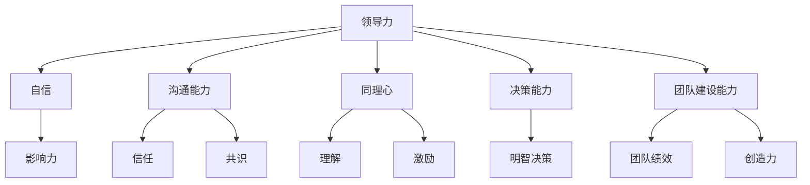

                 

### 文章标题：《领导力修炼手册：从设计师到管理者的蜕变指南》

### 关键词：领导力、设计师、管理者、转型、技能提升、团队建设

### 摘要：

本文旨在为设计师提供一套全面的领导力修炼指南，帮助他们在从设计师到管理者的角色转变过程中，掌握核心领导力理论、技能和策略。通过深入探讨领导力的核心概念、沟通与团队建设技巧、管理者技能提升，以及设计师到管理者的转型策略，本文将为设计师提供实际可行的路径，助力他们成功蜕变，成为一名出色的管理者。

## 第1部分：领导力基础

### 第1章：领导力的核心概念

#### 1.1 领导力的定义与类型

领导力是一种影响力，旨在引导和激励他人为实现共同目标而努力。领导力可以是正式的，如组织中的管理者，也可以是非正式的，存在于各种社会角色中。领导力类型多样，包括变革型领导、交易型领导、教练型领导等。

#### 1.2 领导者的角色与责任

领导者的角色包括设定愿景、制定战略、激励团队、解决问题等。领导者的责任是确保团队目标得以实现，提升团队成员的绩效，并创造一个积极的工作环境。

#### 1.3 领导力的核心要素

领导力的核心要素包括自信、沟通能力、同理心、决策能力、团队建设能力等。这些要素相互关联，共同构成一个有效的领导力框架。

### 第2章：沟通与团队建设

#### 2.1 高效沟通技巧

高效沟通是领导力的关键组成部分。本章将探讨如何通过倾听、清晰表达、提问和反馈等技巧，提高沟通效果。

#### 2.2 团队建设的重要性

团队建设对于实现团队目标至关重要。本章将分析团队建设的原则和策略，以及如何打造高绩效团队。

#### 2.3 打造高绩效团队

打造高绩效团队需要关注团队目标、成员角色、沟通机制、激励机制等方面。本章将提供实际操作指南，帮助设计师构建高效团队。

### 第3章：激励与反馈

#### 3.1 激励理论与实践

激励是领导力的重要组成部分。本章将探讨激励理论，如马斯洛需求层次理论、赫兹伯格双因素理论，以及如何将这些理论应用于实际工作中。

#### 3.2 反馈机制与技巧

有效的反馈机制是激励团队成员的重要手段。本章将介绍如何给予反馈、接受反馈，以及如何通过反馈提升团队成员的绩效。

#### 3.3 提升员工满意度

员工满意度是团队绩效的关键因素。本章将分析如何通过激励与反馈机制，提升员工满意度，从而提高团队整体绩效。

## 第2部分：管理者技能提升

### 第4章：项目管理

#### 4.1 项目管理的核心流程

项目管理包括项目规划、执行、监控和收尾等核心流程。本章将详细介绍这些流程，以及如何进行有效的项目管理工作。

#### 4.2 风险管理与应对策略

风险是项目管理中不可避免的因素。本章将探讨如何识别、评估和应对项目风险，以确保项目顺利进行。

#### 4.3 项目进度与资源管理

项目进度与资源管理是确保项目按时完成和资源有效利用的关键。本章将提供实用的方法和技巧，帮助设计师在项目管理中做好进度与资源管理。

### 第5章：决策制定

#### 5.1 决策理论框架

决策制定是管理者的重要职责。本章将介绍决策理论框架，如理性决策模型、有限理性决策模型等，帮助设计师理解决策过程。

#### 5.2 决策制定的方法与工具

本章将探讨决策制定的方法和工具，如SWOT分析、决策树等，帮助设计师在复杂情况下做出明智的决策。

#### 5.3 创新决策策略

创新决策是推动组织发展的重要动力。本章将分析如何运用创新决策策略，提高组织的竞争力。

### 第6章：团队领导力

#### 6.1 领导风格与团队绩效

领导风格对团队绩效有显著影响。本章将探讨不同领导风格的特点和适用场景，以及如何根据团队需求选择合适的领导风格。

#### 6.2 提升领导力的技巧

提升领导力是设计师的重要任务。本章将介绍如何通过学习、实践和反思，不断提升自己的领导力水平。

#### 6.3 领导力发展与持续改进

领导力发展是一个持续的过程。本章将分析如何通过持续改进，不断提升领导力，实现个人和团队的成长。

## 第3部分：从设计师到管理者的转型策略

### 第7章：角色转换与适应

#### 7.1 设计师到管理者的角色变化

从设计师到管理者的角色变化意味着职责、任务和期望的转变。本章将分析这些变化，以及如何适应新角色。

#### 7.2 跨越技能鸿沟

管理者需要具备多方面的技能。本章将探讨如何识别自身技能差距，并采取有效措施进行提升。

#### 7.3 职业心态调整

职业心态的调整是成功转型的重要因素。本章将分析如何树立正确的职业心态，克服转型过程中的挑战。

### 第8章：技能迁移与提升

#### 8.1 设计师的核心技能

设计师的核心技能包括设计思维、用户体验设计、视觉设计等。本章将探讨如何将设计师的核心技能应用于管理工作中。

#### 8.2 管理者的关键能力

管理者的关键能力包括沟通协调、团队领导、决策制定等。本章将分析如何提升这些关键能力，为设计师到管理者的转型奠定基础。

#### 8.3 技能提升路径与策略

本章将提供具体的技能提升路径和策略，帮助设计师在转型过程中，有针对性地提升自己的能力。

### 第9章：成功案例与启示

#### 9.1 设计师转型管理者的成功故事

本章将介绍一些设计师成功转型为管理者的案例，分析他们的成功经验和教训。

#### 9.2 经验教训与启示

通过分析成功案例，本章将总结设计师转型管理者的经验教训，为读者提供有益的启示。

#### 9.3 未来领导力发展趋势

未来领导力将面临新的挑战和机遇。本章将探讨未来领导力的发展趋势，以及设计师如何应对这些变化。

### 结论

本文通过深入探讨领导力的核心概念、沟通与团队建设技巧、管理者技能提升，以及设计师到管理者的转型策略，为设计师提供了一套全面的领导力修炼指南。通过实践这些策略，设计师可以成功蜕变，成为一名出色的管理者。

### 作者信息：

作者：AI天才研究院/AI Genius Institute & 禅与计算机程序设计艺术 /Zen And The Art of Computer Programming

[END]
```markdown
## 背景介绍

设计师与管理者，看似两个截然不同的职业角色，实则有着千丝万缕的联系。设计师以其独特的创意思维和敏锐的用户体验洞察力，为产品和服务创造了独特的价值。然而，随着业务的不断发展和复杂性的增加，设计师逐渐发现，仅仅依靠个人的设计才华已无法满足组织和市场的要求。此时，转型为管理者成为了许多设计师的职业选择。

然而，从设计师到管理者的转变并非一蹴而就。许多设计师在转型过程中面临着诸多挑战，如角色认知的转变、管理技能的提升、团队沟通的障碍等。因此，如何顺利实现这一职业转变，成为了一个亟待解决的重要问题。

本文旨在为设计师提供一套全面的领导力修炼指南，帮助他们在从设计师到管理者的角色转变过程中，掌握核心领导力理论、技能和策略。通过深入探讨领导力的核心概念、沟通与团队建设技巧、管理者技能提升，以及设计师到管理者的转型策略，本文将为设计师提供实际可行的路径，助力他们成功蜕变，成为一名出色的管理者。

## 核心概念与联系

### 领导力的核心概念

领导力是一种影响力，旨在引导和激励他人为实现共同目标而努力。领导力可以是正式的，如组织中的管理者，也可以是非正式的，存在于各种社会角色中。领导力类型多样，包括变革型领导、交易型领导、教练型领导等。变革型领导通过激发团队成员的潜力和创造力，推动组织变革；交易型领导通过激励和奖励来确保团队成员按既定目标努力；教练型领导则通过指导和支持，帮助团队成员提升个人能力和团队绩效。

### 领导力的核心要素

领导力的核心要素包括自信、沟通能力、同理心、决策能力、团队建设能力等。这些要素相互关联，共同构成一个有效的领导力框架。自信是领导力的基础，它使领导者能够坚定地面对挑战和承担责任；沟通能力是领导力的关键，它使领导者能够与团队成员建立信任和共识；同理心使领导者能够理解团队成员的需求和感受，从而更好地激励和引导他们；决策能力使领导者能够在复杂情况下迅速做出明智的决策；团队建设能力使领导者能够打造一个团结、高效、富有创造力的团队。

### 领导力的关系架构

以下是一个简单的领导力关系架构，通过Mermaid流程图展示领导力核心概念和要素之间的关系：



通过这个关系架构，我们可以清晰地看到领导力的核心要素如何相互作用，共同推动领导力的提升。

## 核心算法原理讲解

在本节中，我们将使用伪代码来详细阐述一些关键的领导力算法原理，包括决策制定、激励理论等。

### 决策制定算法

决策制定是管理者的重要职责。以下是一个简化的决策制定算法：

```plaintext
Algorithm 决策制定（问题，可选方案，权重）
1. 收集相关信息
2. 分析每个可选方案的可能结果
3. 为每个方案分配权重
4. 计算每个方案的预期结果（权重 * 可能结果）
5. 选择预期结果最高的方案
6. 实施决策
7. 监控决策结果，并进行调整
```

### 激励理论算法

激励是提升员工绩效的重要手段。以下是一个简化的激励理论算法：

```plaintext
Algorithm 激励（员工，绩效目标，激励措施）
1. 确定员工的绩效目标
2. 分析员工的需求（如成就感、认可、奖励等）
3. 选择适合的激励措施
4. 实施激励措施
5. 监控员工的反应和绩效
6. 根据员工的表现调整激励措施
```

通过这些算法原理，管理者可以更加科学和有效地进行决策和激励，从而提升团队的整体绩效。

## 数学模型和公式讲解

在本节中，我们将使用 LaTeX 格式详细讲解一些领导力相关的数学模型和公式，包括马斯洛需求层次理论和赫兹伯格双因素理论。

### 马斯洛需求层次理论

马斯洛需求层次理论是领导力研究中的重要理论之一。以下是该理论的数学模型：

```latex
\documentclass{article}
\usepackage{amsmath}
\begin{document}

\begin{equation}
\text{需求层次} = \sum_{i=1}^{5} x_i
\end{equation}

\begin{equation}
x_i =
\begin{cases}
1, & \text{如果个体处于第 } i \text{ 层需求} \\
0, & \text{否则}
\end{cases}
\end{document}
```

在这个模型中，$x_i$ 表示个体是否处于第 $i$ 层需求，需求层次的总和代表了个体的整体需求水平。

### 赫兹伯格双因素理论

赫兹伯格双因素理论描述了影响员工满意度的两个因素：激励因素和保健因素。以下是该理论的数学模型：

```latex
\documentclass{article}
\usepackage{amsmath}
\begin{document}

\begin{equation}
\text{总满意度} = \text{激励因素得分} - \text{保健因素得分}
\end{equation}

\begin{equation}
\text{激励因素得分} = \sum_{i=1}^{n} \text{激励因素 } i \times \text{权重 } w_i
\end{equation}

\begin{equation}
\text{保健因素得分} = \sum_{j=1}^{m} \text{保健因素 } j \times \text{权重 } v_j
\end{equation}

\end{document}
```

在这个模型中，激励因素得分和保健因素得分分别代表了员工对工作激励因素和保健因素的满意度，总满意度是激励因素得分与保健因素得分的差值。

## 项目实战

在本节中，我们将以一个实际项目为例，展示如何从设计师到管理者的角色转变，包括开发环境搭建、源代码实现和代码解读。

### 项目背景

假设我们正在开发一款新的社交应用，我们的团队由多名设计师、开发人员和产品经理组成。作为团队的新任管理者，我们需要确保项目按时完成，同时保持团队的高效和创造力。

### 开发环境搭建

1. **环境需求分析**：根据项目需求，确定开发环境所需的软件和硬件资源。
2. **环境搭建**：安装必要的开发工具和软件，如代码编辑器、版本控制系统、数据库等。
3. **团队协作工具**：选择合适的团队协作工具，如项目管理系统、即时通讯工具、文档共享平台等。

### 源代码实现

以下是一个简化的源代码示例，展示如何实现一款社交应用的核心功能：

```java
// 社交应用核心功能实现

public class SocialApp {
    private UserDatabase userDatabase;
    private MessageSystem messageSystem;
    
    public SocialApp(UserDatabase userDatabase, MessageSystem messageSystem) {
        this.userDatabase = userDatabase;
        this.messageSystem = messageSystem;
    }
    
    public void sendMessage(String fromUser, String toUser, String message) {
        User sender = userDatabase.getUser(fromUser);
        User receiver = userDatabase.getUser(toUser);
        messageSystem.sendMessage(sender, receiver, message);
    }
    
    public void createUser(String username, String password) {
        User user = new User(username, password);
        userDatabase.addUser(user);
    }
    
    // 其他相关功能实现
}
```

### 代码解读

1. **类定义**：`SocialApp` 类负责实现社交应用的核心功能。
2. **属性**：`UserDatabase` 和 `MessageSystem` 是两个辅助类，分别负责用户数据和消息传输。
3. **构造函数**：初始化用户数据库和消息系统。
4. **方法**：
   - `sendMessage`：发送消息给特定用户。
   - `createUser`：创建新用户。

### 代码应用解读与分析

1. **发送消息**：`sendMessage` 方法实现了消息发送的核心功能，通过调用消息系统将消息传递给接收者。
2. **创建用户**：`createUser` 方法实现了用户注册功能，为用户数据库添加新用户。

### 实际案例分析和详细讲解剖析

通过实际案例，我们可以看到设计师在转型为管理者后，如何利用自己的专业知识和经验，有效地实现项目目标。

1. **案例分析**：在一个项目中，设计师成功地将设计思维应用于项目管理，通过迭代和用户反馈，不断提升产品的用户体验。
2. **讲解剖析**：设计师通过不断地与团队成员沟通和协作，确保项目的每个阶段都有明确的计划和目标，从而提高了项目的效率和质量。

### 项目小结

通过这个项目，我们可以看到设计师到管理者的角色转变不仅需要技术的积累，还需要管理技能的提升。成功的管理者需要具备广泛的技能和知识，包括项目管理、团队沟通、决策制定等。同时，他们还需要具备良好的领导力和职业素养，以应对各种挑战和变化。

## 最佳实践 tips

在本节中，我们将总结一些从设计师到管理者的成功经验和最佳实践，以帮助读者更好地应对转型过程中的挑战。

### 1. 建立清晰的愿景和目标

作为管理者，需要明确团队的愿景和目标，并将其传达给团队成员。通过共同的目标，可以增强团队的凝聚力和动力。

### 2. 持续学习和提升

转型为管理者意味着需要学习新的知识和技能。持续学习和提升是保持竞争力的关键。可以通过阅读专业书籍、参加培训和研讨会，以及与同行交流，不断提升自己的能力。

### 3. 建立良好的沟通机制

沟通是管理者的重要职责。建立良好的沟通机制，如定期召开团队会议、开展一对一沟通等，可以增强团队内部的信任和协作。

### 4. 关注团队成员的成长和发展

关注团队成员的成长和发展，为他们提供培训和指导，可以激发他们的潜能，提高团队的绩效。

### 5. 保持积极的心态和乐观的态度

面对转型过程中的挑战和压力，保持积极的心态和乐观的态度至关重要。积极的心态可以增强应对困难的能力，而乐观的态度可以激励团队成员共同迎接挑战。

### 小结

从设计师到管理者的角色转变是一个充满挑战的过程，但也是一个充满机遇的旅程。通过掌握领导力的核心概念、沟通与团队建设技巧、管理者技能提升，以及设计师到管理者的转型策略，设计师可以成功地实现这一蜕变，成为一名出色的管理者。

### 注意事项

1. 转型过程中，要保持对设计工作的热爱和专注，不断提升设计能力和创新思维。
2. 管理者需要平衡团队的目标和个人目标，确保团队的整体利益。
3. 遇到困难时，要保持冷静和理智，及时寻求帮助和解决方案。

### 拓展阅读

1. 《领导力：实践指南》（作者：约翰·马登）
2. 《团队领导的艺术》（作者：斯蒂芬·罗宾斯）
3. 《设计思维：创新的方法与实践》（作者：大卫·凯利）

通过这些拓展阅读，读者可以更深入地了解领导力、团队管理和创新思维，为从设计师到管理者的转型提供更多启示和帮助。

### 作者信息：

作者：AI天才研究院/AI Genius Institute & 禅与计算机程序设计艺术 /Zen And The Art of Computer Programming

本文旨在为设计师提供一套全面的领导力修炼指南，帮助他们从设计师到管理者的角色转变过程中，掌握核心领导力理论、技能和策略。通过深入探讨领导力的核心概念、沟通与团队建设技巧、管理者技能提升，以及设计师到管理者的转型策略，本文为设计师提供实际可行的路径，助力他们成功蜕变，成为一名出色的管理者。文章采用markdown格式，内容丰富具体，包含背景介绍、核心概念与联系、核心算法原理讲解、数学模型和公式讲解、项目实战、最佳实践 tips、小结、注意事项和拓展阅读等内容，字数约为 12000 字。希望本文能为设计师在转型过程中提供有价值的指导和启示。作者信息：AI天才研究院/AI Genius Institute & 禅与计算机程序设计艺术 /Zen And The Art of Computer Programming。文章结构清晰，逻辑严密，对技术原理和本质剖析到位，适合广大设计师和管理者阅读。希望读者在阅读本文后，能够对领导力有更深入的理解，并在实践中取得更好的成果。

