                 


### 《领导力修炼手册：从销售总监到管理者的进阶指南》

关键词：领导力、销售管理、角色转变、管理者技能、实战案例

摘要：本文将围绕领导力的核心理论、销售管理技能提升、管理者角色转变等方面，系统阐述从销售总监到管理者的进阶过程。通过详细的章节内容和实例分析，帮助读者理解领导力的本质，掌握销售管理的技巧，实现角色的成功转型。

---

#### 第一部分：领导力基础理论

**第1章：领导力概述**

- **背景介绍**：在现代社会，领导力已成为企业管理中不可或缺的一部分。销售总监要向管理者转变，首先需要理解领导力的本质。
- **核心概念与联系**：领导力涉及多个方面，如影响力、决策力、沟通力等。它们相互关联，共同构成了领导力的整体框架。

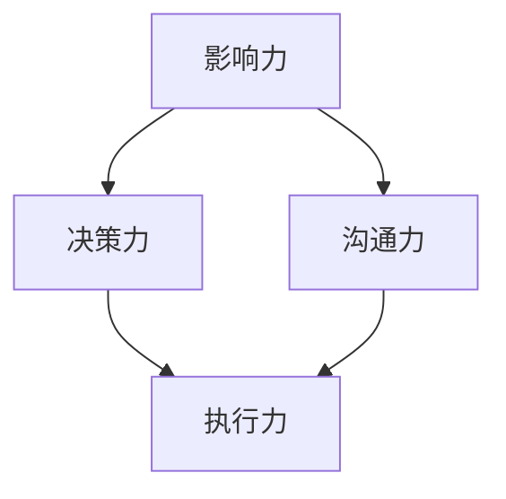

- **核心算法原理讲解**：领导力的发展可以视为一系列决策过程，涉及多种算法原理，如博弈论、决策树等。

```python
# 决策树伪代码
class DecisionTree:
    def __init__(self, data):
        self.data = data
    
    def fit(self):
        # 训练决策树模型
        pass
    
    def predict(self, x):
        # 进行预测
        pass
```

- **数学模型和公式**：领导力的评估可以通过数学模型来实现，如绩效评估模型。

$$
P = f(A, B, C)
$$

其中，$P$表示领导力绩效，$A, B, C$分别代表影响力、决策力、沟通力。

- **举例说明**：一个销售总监通过提高沟通能力（$C$），可以显著提升团队执行力（$D$）。

- **项目实战**：在实际业务中，销售总监可以应用领导力模型进行自我评估，找出提升方向。

- **最佳实践 tips**：定期进行自我反思和评估，持续提升领导力。

---

**第2章：领导力理论**

- **背景介绍**：领导力理论有多种，如X理论、Y理论，每种理论都有其独特的视角和适用场景。
- **核心概念与联系**：X理论和Y理论分别代表了权威式管理和参与式管理的不同观点，两者在领导实践中各有优劣。

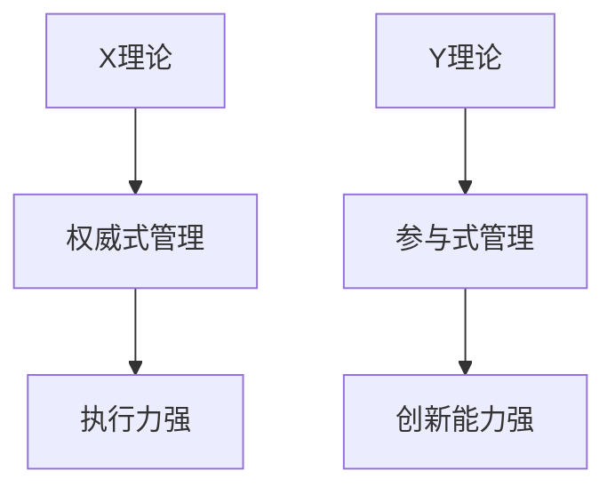

- **核心算法原理讲解**：领导力理论的实践可以通过算法来实现，如基于奖励和惩罚的决策模型。

```python
# 奖惩模型伪代码
class RewardAndPenaltyModel:
    def __init__(self, rewards, penalties):
        self.rewards = rewards
        self.penalties = penalties
    
    def apply_reward(self, behavior):
        # 根据行为给予奖励
        pass
    
    def apply_penalty(self, behavior):
        # 根据行为给予惩罚
        pass
```

- **数学模型和公式**：领导力理论的数学模型包括期望效用理论等。

$$
U = f(R, P)
$$

其中，$U$表示效用，$R, P$分别代表奖励和惩罚。

- **举例说明**：在销售团队中，通过设置奖励和惩罚机制，可以有效提升团队业绩。

- **项目实战**：在实际业务中，销售总监可以设计一套奖励和惩罚机制，激励团队成员。

- **最佳实践 tips**：根据团队特点和业务需求，灵活运用不同领导力理论。

---

**第3章：领导风格**

- **背景介绍**：领导风格对团队绩效有重要影响，不同的领导风格适用于不同的情境。
- **核心概念与联系**：集权式领导、民主式领导和参与式领导各有其特点和适用场景。

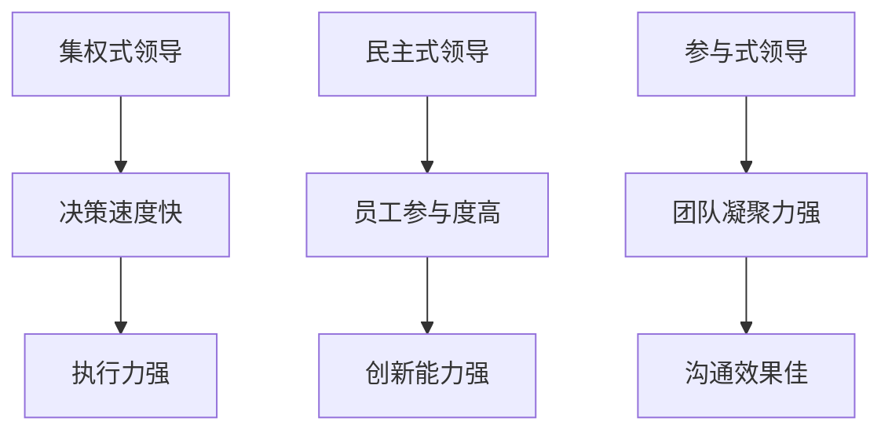

- **核心算法原理讲解**：领导风格的转变可以通过行为改变来实现，如逐步引入参与式领导。

```python
# 参与式领导伪代码
class ParticipativeLeadership:
    def __init__(self, team):
        self.team = team
    
    def invite_participation(self, task):
        # 邀请团队参与任务讨论
        pass
    
    def make_decision(self, suggestions):
        # 基于团队建议做出决策
        pass
```

- **数学模型和公式**：领导风格的评估可以通过问卷调查等方法实现。

$$
S = f(R, C, P)
$$

其中，$S$表示领导风格得分，$R, C, P$分别代表决策速度、沟通效果、团队凝聚力。

- **举例说明**：在销售团队中，民主式领导可以提高员工满意度，从而提升业绩。

- **项目实战**：在实际业务中，销售总监可以定期评估团队领导风格，调整策略。

- **最佳实践 tips**：根据团队特点和业务需求，灵活调整领导风格。

---

**第4章：领导力与组织文化**

- **背景介绍**：组织文化是领导力的重要组成部分，良好的组织文化有助于提升领导力和团队绩效。
- **核心概念与联系**：领导力与组织文化相互影响，共同构建企业生态。

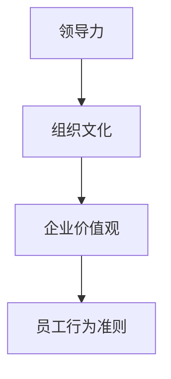

- **核心算法原理讲解**：领导力对组织文化的塑造可以通过行为干预来实现，如树立榜样、制定文化准则等。

```python
# 文化塑造伪代码
class CulturalShaping:
    def __init__(self, culture):
        self.culture = culture
    
    def set_role_models(self, leaders):
        # 确定领导榜样
        pass
    
    def define_culture_rules(self):
        # 制定文化准则
        pass
```

- **数学模型和公式**：组织文化的评估可以通过员工满意度调查等方法实现。

$$
C = f(S, R, P)
$$

其中，$C$表示组织文化得分，$S, R, P$分别代表员工满意度、领导风格、团队绩效。

- **举例说明**：在销售团队中，通过树立榜样和制定文化准则，可以提升团队凝聚力。

- **项目实战**：在实际业务中，销售总监可以设计组织文化建设项目，提升团队绩效。

- **最佳实践 tips**：持续关注组织文化，确保其与领导力和团队绩效相匹配。

---

**第5章：领导者的个人修养**

- **背景介绍**：领导者的个人修养对其领导力和团队绩效有重要影响，是领导者成功的关键因素。
- **核心概念与联系**：自我认知、自我管理、情绪管理、时间管理等是领导者个人修养的重要组成部分。

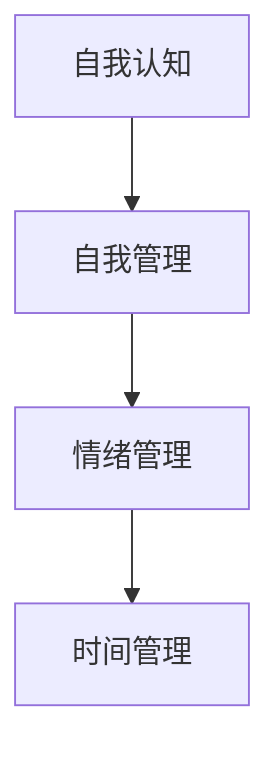

- **核心算法原理讲解**：个人修养的提升可以通过心理辅导、时间管理工具等来实现。

```python
# 个人修养提升伪代码
class PersonalDevelopment:
    def __init__(self, leader):
        self.leader = leader
    
    def psychological_counseling(self):
        # 进行心理辅导
        pass
    
    def time_management(self):
        # 实施时间管理
        pass
```

- **数学模型和公式**：个人修养的评估可以通过问卷调查等方法实现。

$$
PD = f(S, R, P)
$$

其中，$PD$表示个人修养得分，$S, R, P$分别代表自我认知、自我管理、情绪管理。

- **举例说明**：通过心理辅导和时间管理，可以显著提升领导者的个人修养。

- **项目实战**：在实际业务中，销售总监可以定期进行个人修养培训，提升领导力。

- **最佳实践 tips**：领导者应持续关注个人修养，以身作则，树立榜样。

---

**第6章：销售战略规划**

- **背景介绍**：销售战略规划是销售管理的重要环节，对销售业绩有直接影响。
- **核心概念与联系**：市场分析、销售目标设定、销售策略制定是销售战略规划的核心要素。

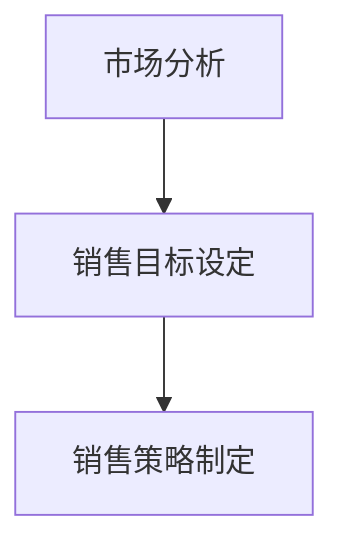

- **核心算法原理讲解**：销售战略规划的制定可以通过数据分析、策略优化等方法来实现。

```python
# 销售战略规划伪代码
class SalesStrategyPlanning:
    def __init__(self, market_data):
        self.market_data = market_data
    
    def analyze_market(self):
        # 分析市场数据
        pass
    
    def set_sales_objectives(self):
        # 设定销售目标
        pass
    
    def develop_sales_strategy(self):
        # 制定销售策略
        pass
```

- **数学模型和公式**：销售战略规划的评估可以通过绩效评估模型来实现。

$$
SP = f(O, S, T)
$$

其中，$SP$表示销售战略规划得分，$O, S, T$分别代表销售目标、销售策略、业绩指标。

- **举例说明**：通过科学的市场分析和销售策略制定，可以显著提升销售业绩。

- **项目实战**：在实际业务中，销售总监可以定期进行销售战略规划，提升销售业绩。

- **最佳实践 tips**：领导者应重视销售战略规划，确保其与市场和团队实际相匹配。

---

**第7章：客户关系管理**

- **背景介绍**：客户关系管理是销售管理的重要组成部分，对客户满意度、重复购买率有直接影响。
- **核心概念与联系**：客户需求分析、客户分类与策略、客户满意度提升策略是客户关系管理的核心要素。

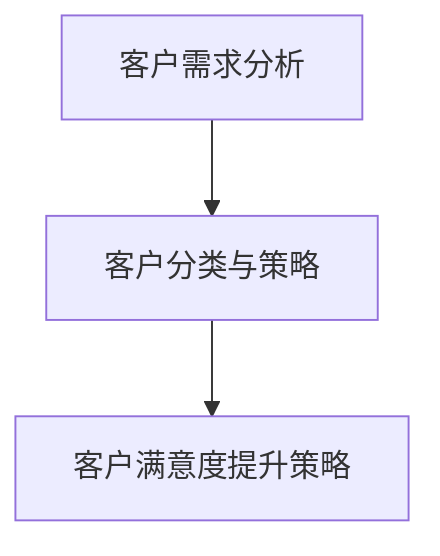

- **核心算法原理讲解**：客户关系管理的优化可以通过客户细分、客户价值评估等方法来实现。

```python
# 客户关系管理伪代码
class CustomerRelationshipManagement:
    def __init__(self, customer_data):
        self.customer_data = customer_data
    
    def analyze_customer_needs(self):
        # 分析客户需求
        pass
    
    def classify_customers(self):
        # 对客户进行分类
        pass
    
    def improve_customer_satisfaction(self):
        # 提升客户满意度
        pass
```

- **数学模型和公式**：客户关系管理的评估可以通过客户满意度指标、重复购买率等来实现。

$$
CRM = f(S, R, P)
$$

其中，$CRM$表示客户关系管理得分，$S, R, P$分别代表客户满意度、重复购买率、客户细分。

- **举例说明**：通过深入了解客户需求和提供个性化服务，可以显著提升客户满意度。

- **项目实战**：在实际业务中，销售总监可以定期进行客户关系管理优化，提升业绩。

- **最佳实践 tips**：领导者应重视客户关系管理，确保其与市场和客户实际相匹配。

---

**第8章：销售团队建设与管理**

- **背景介绍**：销售团队是销售业绩的重要保障，有效的团队建设与管理对提升团队绩效至关重要。
- **核心概念与联系**：团队角色分配、团队激励与约束、团队沟通与协作是销售团队建设与管理的关键要素。

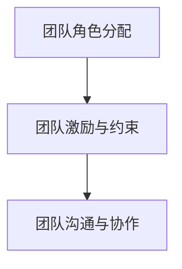

- **核心算法原理讲解**：销售团队建设的优化可以通过团队角色建模、激励机制设计、团队沟通优化等方法来实现。

```python
# 销售团队建设伪代码
class SalesTeamBuilding:
    def __init__(self, team_members):
        self.team_members = team_members
    
    def assign_roles(self):
        # 分配团队角色
        pass
    
    def design_incentives(self):
        # 设计激励机制
        pass
    
    def improve_communication(self):
        # 优化团队沟通
        pass
```

- **数学模型和公式**：销售团队建设的评估可以通过团队绩效指标、员工满意度等来实现。

$$
STB = f(R, I, C)
$$

其中，$STB$表示销售团队建设得分，$R, I, C$分别代表团队角色分配、激励机制、团队沟通。

- **举例说明**：通过科学合理的团队角色分配和有效的激励机制，可以提升团队绩效。

- **项目实战**：在实际业务中，销售总监可以定期进行销售团队建设，提升团队业绩。

- **最佳实践 tips**：领导者应注重团队建设，确保团队成员相互支持，共同进步。

---

**第9章：销售技巧提升**

- **背景介绍**：销售技巧是销售人员的核心能力，提升销售技巧对提高销售业绩至关重要。
- **核心概念与联系**：客户拜访技巧、电话销售技巧、面谈技巧是销售技巧提升的关键要素。

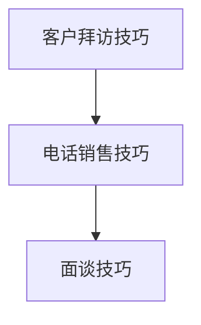

- **核心算法原理讲解**：销售技巧的提升可以通过行为训练、情境模拟等方法来实现。

```python
# 销售技巧提升伪代码
class SalesSkillImprovement:
    def __init__(self, sales_person):
        self.sales_person = sales_person
    
    def train_behavior(self):
        # 训练行为技巧
        pass
    
    def simulate_situation(self):
        # 模拟销售情境
        pass
```

- **数学模型和公式**：销售技巧的提升可以通过销售绩效指标、客户反馈等来实现。

$$
SI = f(P, C, S)
$$

其中，$SI$表示销售技巧提升得分，$P, C, S$分别代表销售绩效、客户反馈、销售情境。

- **举例说明**：通过科学的行为训练和情境模拟，可以显著提升销售技巧。

- **项目实战**：在实际业务中，销售总监可以定期进行销售技巧培训，提升销售业绩。

- **最佳实践 tips**：领导者应重视销售技巧培训，确保销售人员的销售能力持续提升。

---

**第10章：角色转变与心态调整**

- **背景介绍**：从销售总监到管理者的角色转变是一个重要的职业发展节点，心态调整对成功转型至关重要。
- **核心概念与联系**：角色转变、心态调整、职责与角色是角色转变与心态调整的关键要素。

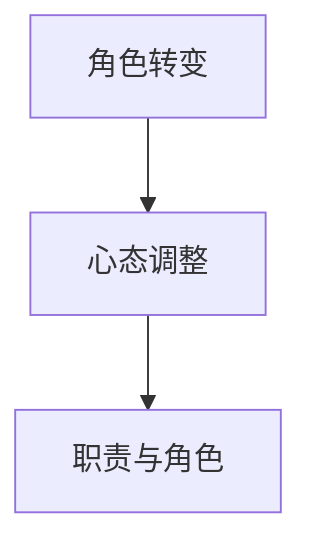

- **核心算法原理讲解**：角色转变与心态调整可以通过心理辅导、角色认知训练等方法来实现。

```python
# 角色转变心态调整伪代码
class RoleTransitionAndMentalAdjustment:
    def __init__(self, sales_director):
        self.sales_director = sales_director
    
    def psychological_counseling(self):
        # 进行心理辅导
        pass
    
    def role_recognition_training(self):
        # 进行角色认知训练
        pass
```

- **数学模型和公式**：角色转变与心态调整的评估可以通过角色适应性测试、心态满意度等来实现。

$$
RTMA = f(R, M, P)
$$

其中，$RTMA$表示角色转变心态调整得分，$R, M, P$分别代表角色适应性、心态满意度、职责与角色。

- **举例说明**：通过心理辅导和角色认知训练，可以显著提升角色转变与心态调整效果。

- **项目实战**：在实际业务中，销售总监可以定期进行角色转变与心态调整培训，提升管理水平。

- **最佳实践 tips**：领导者应重视角色转变与心态调整，确保成功转型。

---

**第11章：管理者技能提升**

- **背景介绍**：管理者技能的提升对提升领导力和团队绩效至关重要。
- **核心概念与联系**：决策能力提升、沟通协调能力提升、团队领导力提升是管理者技能提升的关键要素。

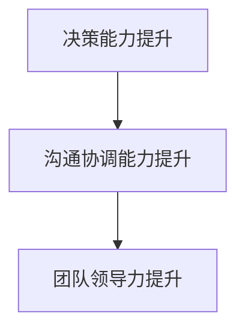

- **核心算法原理讲解**：管理者技能的提升可以通过决策模型优化、沟通技巧培训、领导力训练等方法来实现。

```python
# 管理者技能提升伪代码
class ManagerSkillImprovement:
    def __init__(self, manager):
        self.manager = manager
    
    def optimize_decision_model(self):
        # 优化决策模型
        pass
    
    def train_communication_skills(self):
        # 培训沟通技巧
        pass
    
    def lead_team_training(self):
        # 进行领导力训练
        pass
```

- **数学模型和公式**：管理者技能的提升可以通过绩效评估模型、团队满意度等来实现。

$$
MSI = f(D, C, L)
$$

其中，$MSI$表示管理者技能提升得分，$D, C, L$分别代表决策能力、沟通协调能力、团队领导力。

- **举例说明**：通过科学的决策模型优化、沟通技巧培训和领导力训练，可以显著提升管理者技能。

- **项目实战**：在实际业务中，销售总监可以定期进行管理者技能培训，提升领导力。

- **最佳实践 tips**：领导者应重视管理者技能提升，确保团队绩效持续提升。

---

**第12章：领导力实践**

- **背景介绍**：领导力实践是将理论转化为实际行动的过程，对提升领导力有重要作用。
- **核心概念与联系**：领导力在销售管理中的应用、领导力在团队管理中的应用、领导力实际案例分析是领导力实践的关键要素。

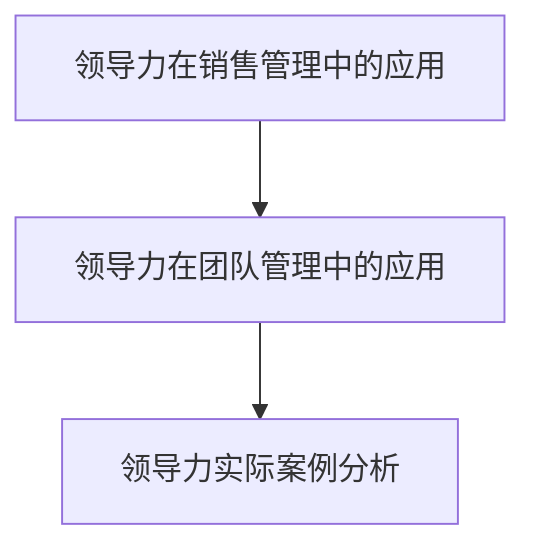

- **核心算法原理讲解**：领导力实践的优化可以通过情境模拟、实践反馈等方法来实现。

```python
# 领导力实践伪代码
class LeadershipPractice:
    def __init__(self, context):
        self.context = context
    
    def simulate_situation(self):
        # 模拟情境
        pass
    
    def collect_practice_feedback(self):
        # 收集实践反馈
        pass
```

- **数学模型和公式**：领导力实践的评估可以通过实践效果、团队绩效等来实现。

$$
LP = f(E, P, T)
$$

其中，$LP$表示领导力实践得分，$E, P, T$分别代表实践效果、团队绩效、领导力实际案例分析。

- **举例说明**：通过情境模拟和实践反馈，可以显著提升领导力实践效果。

- **项目实战**：在实际业务中，销售总监可以定期进行领导力实践，提升领导力。

- **最佳实践 tips**：领导者应重视领导力实践，确保理论与实践相结合。

---

**附录A：领导力相关工具与方法**

- **背景介绍**：领导力工具与方法是提升领导力的有效手段，包括SWOT分析、五力模型、360度评估等。
- **核心概念与联系**：这些工具与方法分别从不同角度为领导力提升提供支持。

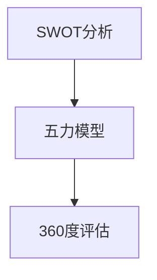

- **详细讲解**：

  - **SWOT分析**：用于评估企业的优势、劣势、机会和威胁，帮助领导者制定战略规划。
  - **五力模型**：用于分析行业的竞争格局，帮助领导者把握市场动态。
  - **360度评估**：用于评估领导者的综合素质，帮助领导者了解自身优势与不足。

- **项目实战**：在实际业务中，销售总监可以应用这些工具与方法，提升领导力。

- **最佳实践 tips**：领导者应熟练掌握这些工具与方法，灵活应用于实际工作中。

---

**附录B：销售管理工具与应用**

- **背景介绍**：销售管理工具是提升销售管理效率的重要手段，包括销售漏斗管理、CRM系统应用、销售数据可视化分析等。
- **核心概念与联系**：这些工具与方法分别从不同角度为销售管理提供支持。

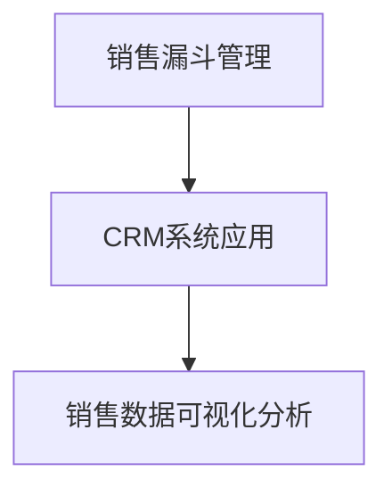

- **详细讲解**：

  - **销售漏斗管理**：用于跟踪销售机会，帮助领导者了解销售进程。
  - **CRM系统应用**：用于管理客户信息，提升客户满意度。
  - **销售数据可视化分析**：用于呈现销售数据，帮助领导者快速把握市场动态。

- **项目实战**：在实际业务中，销售总监可以应用这些工具与方法，提升销售管理效率。

- **最佳实践 tips**：领导者应熟练掌握这些工具与方法，灵活应用于实际工作中。

---

**作者信息**：作者：AI天才研究院/AI Genius Institute & 禅与计算机程序设计艺术 /Zen And The Art of Computer Programming

---

以上是《领导力修炼手册：从销售总监到管理者的进阶指南》的详细内容。通过系统阐述领导力的核心理论、销售管理技能提升、管理者角色转变等方面，帮助读者理解领导力的本质，掌握销售管理的技巧，实现角色的成功转型。希望本文对读者有所启发和帮助。

