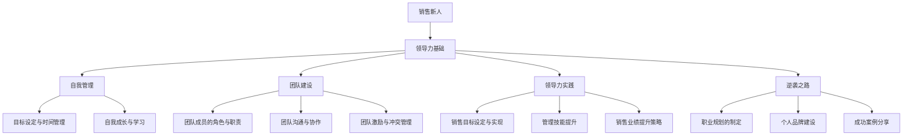

                 


### 文章标题：领导力修炼手册：从销售新人到管理者的逆袭宝典

#### 关键词：
- 领导力
- 销售新人
- 管理者
- 自我提升
- 团队建设
- 目标设定
- 实践策略

#### 摘要：
本文旨在为销售新人提供一本全面而实用的领导力修炼手册，帮助他们从新手阶段逐步成长为合格的管理者。文章分为四个主要部分，分别探讨了领导力的基本概念、提升方法、实践技巧以及逆袭之路。通过深入分析自我管理、团队建设、目标设定等关键领域，结合具体案例和实战经验，文章为读者提供了系统化的指导，助力他们在职场中实现逆袭。

## 第一部分：领导力基础

### 第1章：领导力的基本概念

#### 1.1 领导力的定义与重要性

领导力是一种激励和影响他人共同实现目标的能力。它不仅仅是管理的一种表现形式，更是一种跨越层级、跨越组织边界的影响力。在当今企业环境中，领导力的重要性不言而喻。一个优秀的领导者不仅能够带领团队高效完成任务，还能激发团队成员的潜能，形成积极向上的企业文化。

- **领导力的定义：**
  领导力是一种能力，它包括激励他人、设定愿景、建立信任、沟通协作等关键技能。领导力不仅仅关乎权力，更关乎影响力。

- **领导力的重要性：**
  领导力是企业发展的关键因素。优秀的领导者能够推动企业创新、提升团队绩效、建立良好的企业文化。

- **领导力与管理的区别：**
  管理侧重于规划和执行，关注的是过程和效率；而领导力侧重于愿景和激励，关注的是未来和目标。

#### 1.2 领导力的五大要素

- **影响力：** 领导者通过个人魅力和专业知识，影响和激励团队成员。
- **沟通能力：** 有效的沟通是领导力的重要组成部分，它包括倾听、表达、反馈等技能。
- **决策能力：** 领导者需要在复杂多变的环境中做出明智的决策。
- **情绪管理能力：** 情绪管理是领导者必备的技能，它有助于保持冷静、应对压力。
- **自我认知能力：** 领导者需要深刻理解自己的优势和不足，不断进行自我提升。

#### 1.3 领导力与管理的区别

- **管理侧重于过程和效率：** 管理主要关注如何实现目标，如何优化流程，提高效率。
- **领导侧重于愿景和激励：** 领导主要关注如何设定目标，如何激励团队成员，推动企业创新发展。
- **管理是保障组织的稳定运作：** 管理是确保组织按照既定计划稳定运作，保障组织的正常运营。
- **领导是推动组织的创新发展：** 领导是激发组织创新，推动企业不断突破，实现持续发展。

## 第二部分：领导力提升

### 第2章：销售新人的领导力挑战

#### 2.1 销售新人的心理转变

从销售新人到领导者的转变，不仅仅是技能的提升，更是心理的转变。销售新人需要认识到自己的角色变化，从被领导者转变为领导者，从关注个人绩效到关注团队绩效。

- **角色转变：** 销售新人需要从执行者转变为决策者，从关注个人绩效到关注团队绩效。
- **心理素质的培养：** 销售新人需要培养坚韧不拔、乐观向上的心理素质，以应对职场挑战。
- **情绪管理与自我调节：** 销售新人需要学会情绪管理，保持冷静，以积极的心态应对工作压力。

#### 2.2 销售新人的技能提升

销售新人的技能提升是领导力提升的基础。以下是一些关键技能：

- **销售技巧的掌握：** 销售新人需要掌握有效的销售技巧，如客户需求分析、谈判技巧等。
- **客户需求的挖掘：** 销售新人需要深入了解客户需求，为客户提供个性化的解决方案。
- **团队协作能力的提升：** 销售新人需要学会与团队成员有效沟通，形成良好的团队协作氛围。

#### 2.3 销售新人的团队合作

团队合作是销售新人提升领导力的重要途径。以下是一些团队合作的关键要素：

- **团队成员的角色与责任：** 销售新人需要明确团队成员的角色和责任，确保团队成员各司其职。
- **团队沟通的有效性：** 销售新人需要掌握有效的沟通技巧，确保信息传递准确无误。
- **团队协作的激励机制：** 销售新人需要建立合理的激励机制，激发团队成员的积极性和创造力。

### 第3章：自我管理

#### 3.1 自我认知与情绪管理

自我认知和情绪管理是自我管理的关键。以下是一些核心要点：

- **自我认知的重要性：** 自我认知有助于销售新人了解自己的优势和不足，制定个性化的提升计划。
- **情绪管理的方法：** 销售新人需要学会情绪管理，如深呼吸、冥想等，以保持冷静应对工作压力。
- **自我调节的策略：** 销售新人需要学会自我调节，如积极心态、设定目标等，以保持工作的连续性和稳定性。

#### 3.2 目标设定与时间管理

目标设定和时间管理是自我管理的重要组成部分。以下是一些核心要点：

- **SMART目标设定原则：** 销售新人需要学会设定SMART目标，即具体（Specific）、可衡量（Measurable）、可实现（Achievable）、相关（Relevant）、有时限（Time-bound）。
- **时间管理的基本策略：** 销售新人需要学会时间管理的基本策略，如优先级排序、时间块管理等，以提高工作效率。
- **提高工作效率的方法：** 销售新人需要掌握提高工作效率的方法，如合理分配时间、避免拖延等。

#### 3.3 自我成长与学习

自我成长和学习是自我管理的重要方面。以下是一些核心要点：

- **学习的重要性：** 销售新人需要认识到学习的重要性，不断充实自己的知识储备。
- **成长路径的规划：** 销售新人需要规划自己的成长路径，如学习目标、学习计划等。
- **自我提升的策略：** 销售新人需要学会自我提升的策略，如自我反思、求助他人等。

### 第4章：团队建设

#### 4.1 团队成员的角色与职责

团队成员的角色与职责是团队建设的基础。以下是一些核心要点：

- **团队成员的角色划分：** 销售新人需要明确团队成员的角色，如销售代表、市场专员等。
- **职责的明确与落实：** 销售新人需要确保团队成员明确各自的职责，并确保职责的落实。
- **团队成员的协作机制：** 销售新人需要建立有效的协作机制，确保团队成员能够高效协作。

#### 4.2 团队沟通与协作

团队沟通与协作是团队建设的核心。以下是一些核心要点：

- **有效沟通的基本原则：** 销售新人需要掌握有效沟通的基本原则，如尊重、倾听、表达等。
- **协作工具的选择与应用：** 销售新人需要选择合适的协作工具，如项目管理系统、即时通讯工具等，以提高团队协作效率。
- **团队协作的流程优化：** 销售新人需要优化团队协作流程，确保团队协作的高效性。

#### 4.3 团队激励与冲突管理

团队激励与冲突管理是团队建设的重要方面。以下是一些核心要点：

- **激励理论的应用：** 销售新人需要了解激励理论，如目标激励、情感激励等，以有效激励团队成员。
- **冲突的类型与处理：** 销售新人需要识别冲突的类型，如沟通冲突、资源冲突等，并采取相应的处理策略。
- **团队激励的方法：** 销售新人需要学会多种团队激励方法，如表扬、奖励、培训等，以激发团队成员的积极性和创造力。

## 第三部分：领导力实践

### 第5章：销售目标设定与实现

#### 5.1 销售目标的设定方法

销售目标的设定是销售管理的重要环节。以下是一些核心要点：

- **销售目标的分类：** 销售目标可以分为长期目标和短期目标，如年度目标、季度目标等。
- **销售目标的设定原则：** 销售目标的设定需要遵循SMART原则，即具体、可衡量、可实现、相关、有时限。
- **销售目标的实现策略：** 销售新人需要制定具体的实现策略，如客户开发策略、市场推广策略等。

#### 5.2 客户关系管理

客户关系管理是销售工作的重要组成部分。以下是一些核心要点：

- **客户关系的重要性：** 客户关系是销售成功的关键，良好的客户关系有助于提升客户满意度，增加销售机会。
- **客户分类与定位：** 销售新人需要根据客户的特点进行分类，并明确不同类型客户的需求和偏好。
- **客户关系管理的策略：** 销售新人需要制定客户关系管理的策略，如定期回访、个性化服务、情感维系等。

#### 5.3 销售业绩提升策略

销售业绩的提升是销售工作的最终目标。以下是一些核心要点：

- **市场调研与分析：** 销售新人需要进行市场调研，了解市场需求和竞争状况，为销售策略的制定提供依据。
- **产品策略与推广：** 销售新人需要制定合适的产品策略，如定价策略、促销策略等，以提升产品竞争力。
- **销售策略与执行：** 销售新人需要制定具体的销售策略，并确保策略的有效执行，如销售渠道选择、销售团队培训等。

### 第6章：管理技能提升

#### 6.1 管理者必备的技能

管理者必备的技能是提升领导力的关键。以下是一些核心要点：

- **领导技能的培养：** 管理者需要培养领导技能，如沟通能力、决策能力、团队合作能力等。
- **沟通技能的提升：** 管理者需要不断提升沟通技能，确保信息传递的准确性和有效性。
- **决策能力的增强：** 管理者需要增强决策能力，确保在复杂多变的环境中做出明智的决策。

#### 6.2 团队管理与领导

团队管理与领导是管理者的重要职责。以下是一些核心要点：

- **团队管理的基本原则：** 管理者需要遵循团队管理的基本原则，如公平、公正、透明等。
- **领导风格的选择：** 管理者需要根据团队特点和自身风格选择合适的领导风格，如民主型领导、权威型领导等。
- **团队领导的策略：** 管理者需要制定团队领导的策略，如目标管理、绩效评估等，以提升团队绩效。

#### 6.3 销售团队的绩效评估

销售团队的绩效评估是管理者的重要工作。以下是一些核心要点：

- **绩效评估的标准：** 管理者需要制定明确的绩效评估标准，如销售目标达成率、客户满意度等。
- **绩效评估的方法：** 管理者需要选择合适的绩效评估方法，如360度评估、关键绩效指标等。
- **绩效评估的结果应用：** 管理者需要将绩效评估的结果应用于团队管理和个人发展，如激励、培训等。

## 第四部分：逆袭之路

### 第7章：从销售新人到管理者的转变

#### 7.1 职业规划的制定

职业规划是销售新人实现逆袭的重要步骤。以下是一些核心要点：

- **职业规划的制定：** 销售新人需要制定明确的职业规划，包括短期目标和长期目标。
- **职业目标的设定：** 销售新人需要设定具体的职业目标，如晋升为销售经理、拓展海外市场等。
- **职业路径的规划：** 销售新人需要规划职业路径，明确每个阶段的发展方向和目标。

#### 7.2 个人品牌建设

个人品牌建设是销售新人实现逆袭的关键。以下是一些核心要点：

- **个人品牌的打造：** 销售新人需要打造个人品牌，如专业形象、专业知识等。
- **个人品牌的传播：** 销售新人需要通过多种渠道传播个人品牌，如社交媒体、行业会议等。
- **个人品牌的维护：** 销售新人需要维护个人品牌，如保持专业素养、积极学习等。

#### 7.3 成功案例分享

成功案例分享是激励销售新人实现逆袭的重要手段。以下是一些核心要点：

- **成功案例的收集：** 销售新人需要收集行业内的成功案例，学习成功者的经验和策略。
- **成功案例的分析：** 销售新人需要对成功案例进行分析，总结成功的关键因素。
- **成功案例的借鉴：** 销售新人需要借鉴成功案例，制定适合自己的职业发展策略。

### 总结

从销售新人到管理者的逆袭并非一蹴而就，它需要坚定的信念、持续的努力和系统的学习。本文通过深入分析领导力的基础、提升方法、实践技巧以及逆袭之路，为销售新人提供了全面而实用的指导。希望通过本文，销售新人能够明确自己的职业规划，不断提升自己的领导力，最终实现从销售新人到管理者的华丽转变。

### 作者信息

作者：AI天才研究院/AI Genius Institute & 禅与计算机程序设计艺术 /Zen And The Art of Computer Programming

### 最佳实践 Tips、小结、注意事项、拓展阅读等内容

**最佳实践 Tips：**
1. **时间管理：** 制定详细的日程安排，确保高效利用时间。
2. **自我反思：** 定期进行自我反思，识别自己的优势和不足。
3. **学习习惯：** 培养良好的学习习惯，不断充实自己的知识储备。

**小结：**
本文通过系统化的分析，为销售新人提供了从新手阶段逐步成长为合格管理者的路径。通过自我管理、团队建设、目标设定和实践技巧的提升，销售新人可以实现职业逆袭。

**注意事项：**
1. **持续学习：** 销售新人需要保持持续学习的态度，紧跟行业发展趋势。
2. **团队协作：** 团队协作是提升领导力的关键，销售新人需要注重团队建设。

**拓展阅读：**
1. 《领导力的五个层次》作者：史蒂芬·柯维（Stephen R. Covey）
2. 《销售之神》作者：松下幸之助（Konosuke Matsushita）
3. 《团队协作工具》作者：凯西·考克斯（Cathy Cox）

### 数学公式

- **SMART目标设定原则：**
  $$ \text{具体}(Specific) $$
  $$ \text{可衡量}(Measurable) $$
  $$ \text{可实现}(Achievable) $$
  $$ \text{相关}(Relevant) $$
  $$ \text{有时限}(Time-bound) $$

- **绩效评估指标：**
  $$ \text{销售目标达成率} = \frac{\text{实际销售额}}{\text{目标销售额}} \times 100\% $$
  $$ \text{客户满意度} = \frac{\text{满意客户数}}{\text{总客户数}} \times 100\% $$

### 项目实战

**开发环境搭建：**
1. 安装Python编程环境
2. 安装相关库，如pandas、numpy、matplotlib等

**源代码实现：**
```python
# 示例代码：销售目标达成率计算
def calculate_sales_performance(sales_data, target_sales):
    actual_sales = sum(sales_data.values())
    sales_performance = actual_sales / target_sales
    return sales_performance

# 示例数据
sales_data = {'Q1': 50000, 'Q2': 60000, 'Q3': 55000, 'Q4': 48000}
target_sales = 200000

# 计算销售目标达成率
sales_performance = calculate_sales_performance(sales_data, target_sales)
print(f"销售目标达成率：{sales_performance * 100}%")
```

**代码解读与分析：**
- `calculate_sales_performance` 函数用于计算销售目标达成率。
- `sales_data` 是一个字典，存储每个季度的实际销售额。
- `target_sales` 是目标销售额。
- 函数计算实际销售额与目标销售额的比值，得到销售目标达成率。

**实际案例分析和详细讲解剖析：**
- 假设某销售团队在2021年的目标销售额为200万元，实际销售额为180万元。
- 通过`calculate_sales_performance`函数计算得出销售目标达成率为90%。
- 分析原因：可能是因为市场环境变化、竞争对手压力等因素导致销售额未达到预期。

**项目小结：**
- 本项目通过Python编程实现了销售目标达成率的计算，为销售团队提供了重要的绩效评估指标。
- 通过实际案例的分析，销售团队可以了解自身的销售表现，制定改进策略。

### 附录：Mermaid 流程图



该流程图展示了销售新人从入门到逆袭的全过程，涵盖了领导力的基础、提升方法、实践技巧以及逆袭之路的关键步骤。通过逐步实践和不断学习，销售新人可以实现职业晋升，从销售新人成长为合格的管理者。

