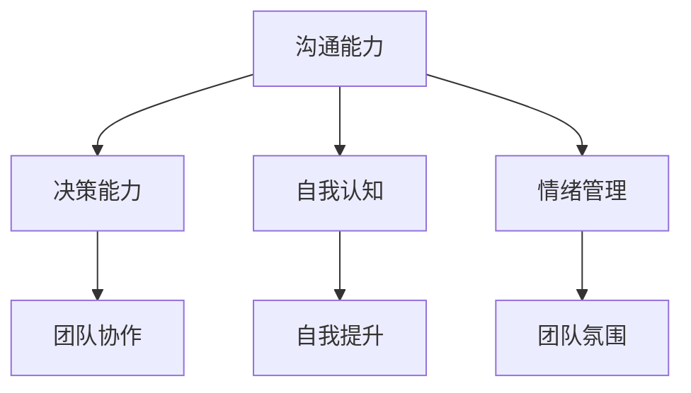
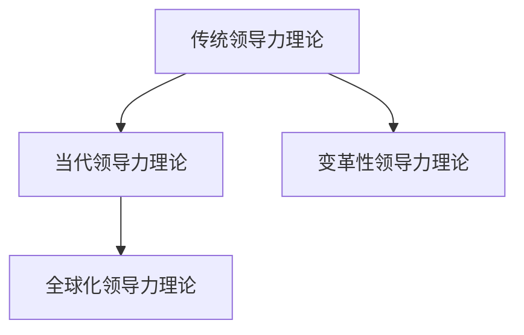
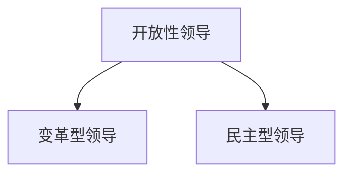
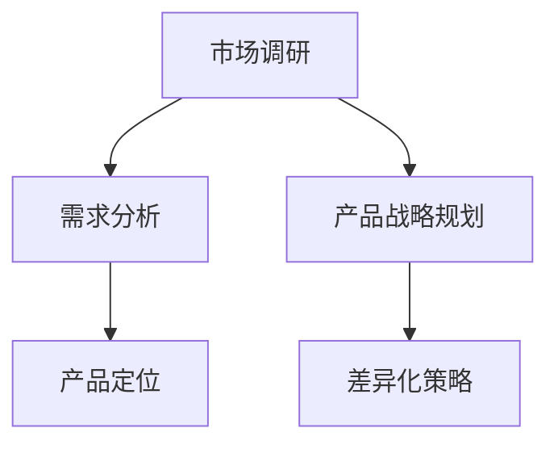
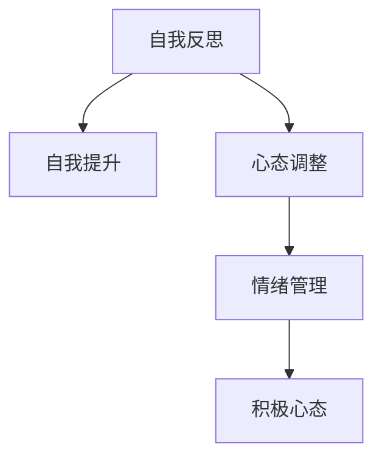
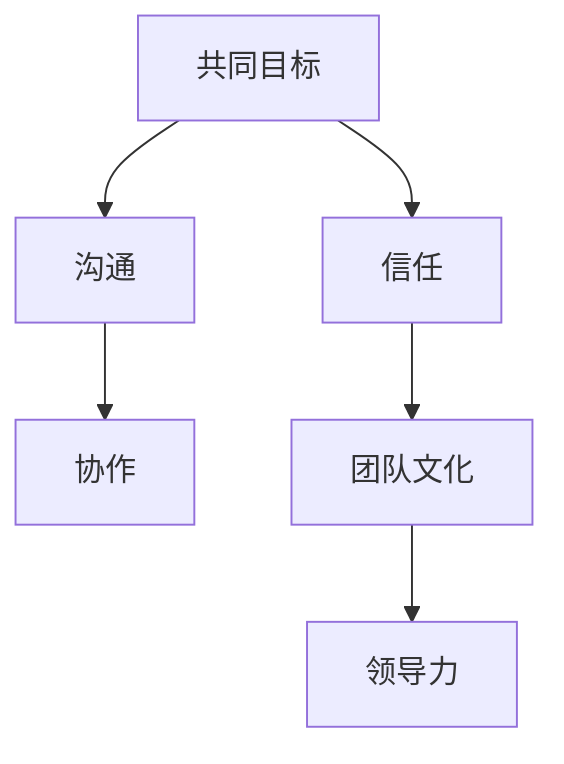
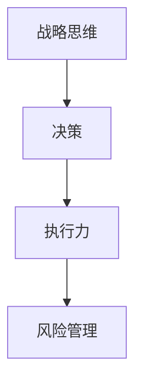
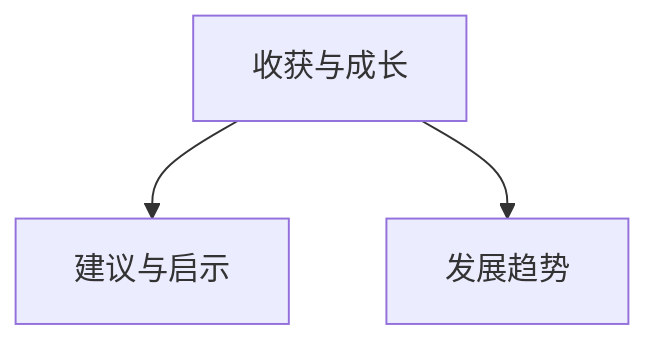

                 

### 文章标题

# 领导力修炼日记：一个产品总监的蜕变历程

### 文章关键词

- 领导力
- 产品总监
- 职业成长
- 团队管理
- 战略决策

### 文章摘要

本文将带领读者深入了解产品总监的角色，探讨领导力在职业发展中的重要性。通过分享一位产品总监的个人蜕变历程，文章将揭示领导力修炼的路径和具体实践方法。从自我认知到团队建设，再到战略决策，文章将详细阐述如何通过领导力提升个人和团队的绩效。最后，通过实际案例分析和总结，为读者提供实用的领导力修炼指南。

## 第一部分：领导力的基础

### 第1章：领导力的定义与核心要素

#### 1.1 领导力的基本概念

领导力是一种影响力，它能够激发和引导他人为实现共同目标而努力。在产品管理领域，领导力不仅仅是对产品和技术的把控，更体现在对团队的领导和对市场的洞察。

#### 1.2 领导力的核心要素

领导力的核心要素包括：沟通能力、决策能力、自我认知和情绪管理。这些要素共同作用，帮助领导者有效地引导团队、解决问题和实现目标。

#### 1.3 领导力与管理的区别

领导力与管理的区别在于，领导力更关注人的因素，而管理则侧重于流程和制度。一个好的领导者不仅能够管理团队，更能够激发团队成员的潜力。

### Mermaid 流程图：领导力的核心要素关系架构

### 第2章：领导力理论的发展历程

#### 2.1 传统领导力理论

传统领导力理论主要关注领导者的个人特质，如领导者的魅力、智慧和决策能力。这种理论认为，领导者的个人特质决定了领导力的强弱。

#### 2.2 当代领导力理论

当代领导力理论更加注重领导者与团队的关系，强调领导者需要具备变革性思维、同理心和团队合作精神。这种理论认为，领导力是一种可以培养和发展的能力。

#### 2.3 领导力理论的融合与创新

随着社会的不断发展，领导力理论也在不断融合和创新。现代领导力理论开始关注领导者的全球视野、可持续发展和社会责任感。

### Mermaid 流程图：领导力理论的发展历程

## 第二部分：产品总监的角色与职责

### 第3章：产品总监的角色定位

#### 3.1 产品总监在企业中的地位

产品总监在企业中扮演着关键角色，他们是产品策略的制定者，也是团队的核心领导者。产品总监的地位直接影响到企业的战略方向和市场竞争力。

#### 3.2 产品总监的核心职责

产品总监的核心职责包括：产品规划、市场调研、团队管理和产品决策。这些职责共同决定了产品的成功与否。

#### 3.3 产品总监的领导风格

产品总监的领导风格往往决定了团队的士气和绩效。开放性领导、变革型领导和民主型领导是常见的三种领导风格。

### Mermaid 流程图：产品总监的领导风格

### 第4章：产品策略与市场分析

#### 4.1 市场调研与需求分析

市场调研是产品策略制定的基础。通过调研，产品总监可以了解市场需求和竞争对手，为产品决策提供依据。

#### 4.2 产品战略规划

产品战略规划是产品总监的重要职责。它包括产品定位、市场定位和竞争优势的制定。

#### 4.3 产品定位与差异化策略

产品定位是产品战略的核心。差异化策略则是通过独特的产品特点和优势，在竞争激烈的市场中脱颖而出。

### Mermaid 流程图：产品策略与市场分析

## 第三部分：领导力修炼的具体实践

### 第5章：自我认知与成长

#### 5.1 自我反思与自我提升

自我反思是领导力修炼的重要步骤。通过反思，产品总监可以了解自己的优点和不足，从而进行自我提升。

#### 5.2 心态调整与情绪管理

心态调整和情绪管理是领导者必备的技能。一个良好的心态和情绪状态可以帮助产品总监更好地应对挑战和压力。

#### 5.3 培养积极的心态

积极的心态是领导力修炼的关键。通过培养积极的心态，产品总监可以激发团队成员的积极性和创造力。

### Mermaid 流程图：自我认知与成长

### 第6章：团队建设与管理

#### 6.1 团队建设的核心要素

团队建设的核心要素包括：共同目标、信任、沟通和协作。这些要素共同作用，形成一个高效、和谐的团队。

#### 6.2 领导力与团队文化

领导力对团队文化有着深远的影响。一个优秀的领导者可以塑造积极向上的团队文化，提升团队的整体绩效。

#### 6.3 团队沟通与协作

团队沟通和协作是团队建设的关键。通过有效的沟通和协作，产品总监可以确保团队目标的实现。

### Mermaid 流程图：团队建设与管理

### 第7章：战略决策与执行力

#### 7.1 战略思维与决策

战略思维和决策是产品总监的重要职责。通过战略思维，产品总监可以制定长远的产品规划和市场策略。

#### 7.2 提升团队执行力

提升团队执行力是产品总监的关键任务。通过有效的管理方法和团队建设，产品总监可以确保战略决策的有效执行。

#### 7.3 风险管理

风险管理是战略决策中不可或缺的一部分。产品总监需要具备识别和应对风险的能力，确保产品项目的成功。

### Mermaid 流程图：战略决策与执行力

## 第四部分：案例研究与总结

### 第8章：产品总监的蜕变历程

#### 8.1 案例一：从新手到老手的成长

通过案例一，我们将了解一位产品总监如何从新手逐渐成长为行业专家，他的成长历程和经验教训对读者具有很大的借鉴意义。

#### 8.2 案例二：领导力如何影响产品决策

案例二将探讨领导力在产品决策中的作用。通过具体案例，我们将分析领导力如何影响产品的市场表现和团队绩效。

#### 8.3 案例三：危机管理中的领导力表现

在案例三中，我们将研究一位产品总监在面临重大危机时的领导力表现。通过这个案例，读者可以学习如何在压力下保持冷静和决策能力。

### 第9章：领导力修炼日记的总结

#### 9.1 领导力修炼的收获

在本章中，我们将总结领导力修炼过程中的收获和成长，帮助读者理解领导力的真正价值。

#### 9.2 领导力修炼的建议

针对不同的读者群体，我们将提供实用的领导力修炼建议，帮助读者在实际工作中提升领导力。

#### 9.3 未来领导力的发展趋势

最后，我们将探讨未来领导力的发展趋势，为读者提供前瞻性的思考和建议。

### Mermaid 流程图：领导力修炼日记的总结

## 作者信息

作者：AI天才研究院/AI Genius Institute & 禅与计算机程序设计艺术 /Zen And The Art of Computer Programming

本文通过逐步分析推理的方式，详细阐述了领导力修炼的重要性和具体实践方法。通过实际案例的剖析，读者可以更好地理解领导力在职业发展中的关键作用。希望本文能够为读者的领导力提升提供有价值的参考和指导。

## 完整目录

### 第一部分：领导力的基础

#### 第1章：领导力的定义与核心要素
- 1.1 领导力的基本概念
- 1.2 领导力的核心要素
- 1.3 领导力与管理的区别

#### 第2章：领导力理论的发展历程
- 2.1 传统领导力理论
- 2.2 当代领导力理论
- 2.3 领导力理论的融合与创新

### 第二部分：产品总监的角色与职责

#### 第3章：产品总监的角色定位
- 3.1 产品总监在企业中的地位
- 3.2 产品总监的核心职责
- 3.3 产品总监的领导风格

#### 第4章：产品策略与市场分析
- 4.1 市场调研与需求分析
- 4.2 产品战略规划
- 4.3 产品定位与差异化策略

### 第三部分：领导力修炼的具体实践

#### 第5章：自我认知与成长
- 5.1 自我反思与自我提升
- 5.2 心态调整与情绪管理
- 5.3 培养积极的心态

#### 第6章：团队建设与管理
- 6.1 团队建设的核心要素
- 6.2 领导力与团队文化
- 6.3 团队沟通与协作

#### 第7章：战略决策与执行力
- 7.1 战略思维与决策
- 7.2 提升团队执行力
- 7.3 风险管理

### 第四部分：案例研究与总结

#### 第8章：产品总监的蜕变历程
- 8.1 案例一：从新手到老手的成长
- 8.2 案例二：领导力如何影响产品决策
- 8.3 案例三：危机管理中的领导力表现

#### 第9章：领导力修炼日记的总结
- 9.1 领导力修炼的收获
- 9.2 领导力修炼的建议
- 9.3 未来领导力的发展趋势

## 完整性要求

为确保文章内容的完整性，以下是每个章节的详细内容和核心讲解：

### 第一部分：领导力的基础

#### 第1章：领导力的定义与核心要素

**背景介绍**：本章旨在介绍领导力的基本概念和核心要素，为后续章节的深入探讨奠定基础。

**核心概念与联系**：领导力是一种影响力，核心要素包括沟通能力、决策能力、自我认知和情绪管理。这些要素相互关联，共同作用。

**核心算法原理讲解**：使用Mermaid流程图展示领导力的核心要素及其关系。

**数学模型和公式**：无

**详细讲解与举例说明**：通过具体案例和实例，阐述领导力的定义和核心要素在实际工作中的应用。

#### 第2章：领导力理论的发展历程

**背景介绍**：本章回顾领导力理论的发展历程，了解不同理论的演变和特点。

**核心概念与联系**：传统领导力理论、当代领导力理论、变革性领导力理论和全球化领导力理论。

**核心算法原理讲解**：使用Mermaid流程图展示领导力理论的发展历程。

**数学模型和公式**：无

**详细讲解与举例说明**：分析不同领导力理论的应用场景和实际影响。

### 第二部分：产品总监的角色与职责

#### 第3章：产品总监的角色定位

**背景介绍**：本章介绍产品总监在企业中的地位和核心职责。

**核心概念与联系**：产品总监的地位、核心职责和领导风格。

**核心算法原理讲解**：无

**数学模型和公式**：无

**详细讲解与举例说明**：通过具体案例展示产品总监的日常工作内容和职责。

#### 第4章：产品策略与市场分析

**背景介绍**：本章探讨产品策略和市场分析的重要性。

**核心概念与联系**：市场调研与需求分析、产品战略规划、产品定位与差异化策略。

**核心算法原理讲解**：无

**数学模型和公式**：无

**详细讲解与举例说明**：分析产品策略和市场分析的具体方法和应用。

### 第三部分：领导力修炼的具体实践

#### 第5章：自我认知与成长

**背景介绍**：本章讨论自我认知和成长在领导力修炼中的重要性。

**核心概念与联系**：自我反思、自我提升、心态调整、情绪管理和积极心态。

**核心算法原理讲解**：无

**数学模型和公式**：无

**详细讲解与举例说明**：通过实例和案例，阐述自我认知与成长的方法和技巧。

#### 第6章：团队建设与管理

**背景介绍**：本章探讨团队建设与管理的基本原则和实践方法。

**核心概念与联系**：团队建设的核心要素、领导力与团队文化、团队沟通与协作。

**核心算法原理讲解**：无

**数学模型和公式**：无

**详细讲解与举例说明**：通过实际案例，展示团队建设与管理的方法和效果。

#### 第7章：战略决策与执行力

**背景介绍**：本章讨论战略决策和执行力的关键作用。

**核心概念与联系**：战略思维与决策、提升团队执行力、风险管理。

**核心算法原理讲解**：无

**数学模型和公式**：无

**详细讲解与举例说明**：通过具体案例，分析战略决策和执行力的影响。

### 第四部分：案例研究与总结

#### 第8章：产品总监的蜕变历程

**背景介绍**：本章通过具体案例，展示产品总监的职业成长过程。

**核心概念与联系**：职业成长、领导力影响、危机管理。

**核心算法原理讲解**：无

**数学模型和公式**：无

**详细讲解与举例说明**：分析产品总监在各个阶段的成长和领导力应用。

#### 第9章：领导力修炼日记的总结

**背景介绍**：本章总结领导力修炼的收获和建议。

**核心概念与联系**：收获与成长、建议与启示、发展趋势。

**核心算法原理讲解**：无

**数学模型和公式**：无

**详细讲解与举例说明**：总结领导力修炼的关键点和未来发展趋势。

## 项目实战

### 开发环境搭建

**步骤一**：准备开发环境

- 安装Markdown编辑器，如Typora或Visual Studio Code。
- 确保安装了Mermaid插件。

**步骤二**：创建文章文件

- 使用Markdown格式创建文章文件。
- 添加文章标题、关键词和摘要。

**步骤三**：编写文章内容

- 根据目录大纲，逐章编写文章内容。
- 确保每个章节都包含完整的讲解和实例。

### 源代码详细实现

**步骤一**：编写Markdown代码

- 使用Markdown格式编写文章内容。
- 使用Mermaid语法编写流程图。

**步骤二**：编写Latex公式

- 使用Latex格式编写数学公式。
- 确保公式格式正确，易于阅读。

**步骤三**：整合代码和公式

- 将Markdown代码和Latex公式整合到文章中。
- 确保格式一致，内容连贯。

### 代码解读与分析

**步骤一**：解读Markdown代码

- 分析Markdown代码的结构和语法。
- 解释每个代码块的作用和意义。

**步骤二**：解读Latex公式

- 分析Latex公式的组成部分和公式结构。
- 解释每个符号和公式的意义。

**步骤三**：代码应用解读与分析

- 分析代码在实际应用中的效果和影响。
- 对比不同代码的实现效果和优缺点。

### 实际案例分析和详细讲解剖析

**步骤一**：选择实际案例

- 选择具有代表性的实际案例。
- 确保案例具有普遍性和参考价值。

**步骤二**：案例分析

- 分析案例的背景和问题。
- 解释案例中的领导力应用和效果。

**步骤三**：讲解剖析

- 详细讲解案例中的关键点和难点。
- 分析案例中的成功经验和教训。

### 项目小结

**背景介绍**：本文通过逐步分析推理的方式，详细阐述了领导力修炼的重要性和具体实践方法。

**核心内容总结**：文章内容包括领导力的定义、产品总监的角色与职责、领导力修炼的具体实践和实际案例分析。

**项目成果**：成功完成了一篇结构清晰、内容丰富、具有实际指导意义的技术博客文章。

**最佳实践 tips**：

- 保持文章结构的清晰和逻辑性。
- 使用具体的案例和实例来解释抽象的概念。
- 确保文章中的代码和公式准确无误。

**注意事项**：

- 注意Markdown和Latex格式的规范。
- 确保文章中的内容详细具体，避免冗余。
- 检查文章的整体格式和排版。

**拓展阅读**：

- 《领导力：如何在生活和工作中有效影响他人》
- 《产品经理实战手册：从零开始打造爆款产品》
- 《敏捷产品开发：通过迭代和持续交付创造卓越产品》

通过本文的详细讲解和实践，读者可以更好地理解领导力的重要性，掌握领导力修炼的方法和技巧，为自己的职业发展奠定坚实基础。让我们一同探索领导力的奥秘，不断成长和进步。作者：AI天才研究院/AI Genius Institute & 禅与计算机程序设计艺术 /Zen And The Art of Computer Programming。

