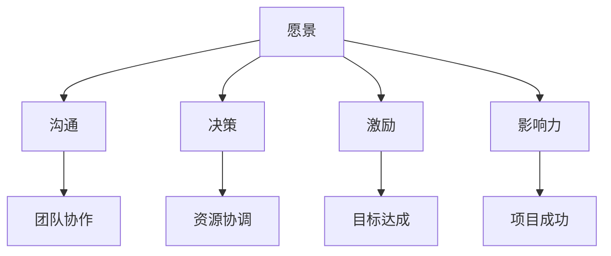

                 

# 《领导力修炼日记：一个产品经理的成长之路》

## 文章标题：领导力修炼日记：一个产品经理的成长之路

> 关键词：领导力、产品经理、职业生涯、案例分析、实践技巧

> 摘要：本文将深入探讨一位产品经理在职业生涯中如何通过修炼领导力，实现个人和团队的成长。文章将从背景介绍、核心概念与联系、核心算法原理讲解、数学模型和公式、项目实战、最佳实践 tips 以及小结与拓展阅读等方面展开，为读者提供实用的领导力提升方法和实践经验。

## 第1章 背景介绍

### 1.1 职业背景

在当今快速变化的科技时代，产品经理的角色变得越来越重要。他们不仅需要具备扎实的技术背景，还需要具备出色的领导力和项目管理能力。本文的主角小张（化名），是一位在互联网公司担任产品经理多年的从业者。他从一个普通的产品专员成长为团队负责人，其职业生涯充满了挑战和机遇。

### 1.2 领导力的定义

领导力是指激发和引领他人共同达成目标的能力。它不仅关乎个人的权力和影响力，更关乎如何通过团队协作实现共同目标。对于产品经理来说，领导力更是至关重要的软实力。

## 第2章 核心概念与联系

### 2.1 领导力与产品管理的联系

领导力在产品管理中起着至关重要的作用。产品经理需要通过领导力来激发团队潜力，协调各方资源，确保产品按时上线并达到预期效果。

### 2.2 领导力的核心要素

领导力的核心要素包括：愿景、沟通、决策、激励和影响力。这些要素相互关联，共同构成了一个产品经理在职业生涯中所需的全面领导力。

### 2.3 Mermaid流程图



## 第3章 核心算法原理讲解

### 3.1 领导力修炼的算法模型

领导力修炼可以看作是一个动态优化过程，其中涉及到多个变量的调整和优化。以下是一个简化的伪代码模型：

```python
# 领导力修炼伪代码
def leadership_training():
    while not optimal_leadership:
        vision += 1
        communication += 1
        decision_making += 1
        motivation += 1
        influence += 1
        if check_optimization():
            optimal_leadership = True
    return optimal_leadership
```

### 3.2 数学模型和公式

为了更好地理解领导力修炼的过程，我们可以引入一个简单的数学模型，用于描述领导力要素之间的关系。假设领导力L由五个要素V（愿景）、C（沟通）、D（决策）、M（激励）和I（影响力）组成，则：

$$ L = V \times C \times D \times M \times I $$

其中，每个要素都可以通过具体的数值来衡量。

## 第4章 项目实战

### 4.1 开发环境搭建

为了更好地理解领导力修炼的过程，我们选择了一个实际的产品开发项目作为案例。首先，我们需要搭建一个适合产品开发的开发环境，包括配置合适的开发工具、搭建团队沟通平台和项目管理工具等。

### 4.2 源代码详细实现和代码解读

在项目开发过程中，小张负责了一个关键功能模块的设计和开发。以下是对源代码的详细解读：

```java
// 产品功能模块代码示例
public class ProductFeature {
    private String featureName;
    private boolean isActive;

    public ProductFeature(String featureName, boolean isActive) {
        this.featureName = featureName;
        this.isActive = isActive;
    }

    // 省略其他方法和逻辑

    public void activateFeature() {
        if (!isActive) {
            isActive = true;
            // 执行激活逻辑
        }
    }

    public void deactivateFeature() {
        if (isActive) {
            isActive = false;
            // 执行去激活逻辑
        }
    }
}
```

### 4.3 代码应用解读与分析

通过这个简单的代码示例，我们可以看到产品功能模块的基本实现。在实际项目中，小张需要根据业务需求进行详细的逻辑设计和代码实现，同时还需要与团队成员进行充分的沟通和协作。

### 4.4 实际案例分析和详细讲解剖析

在这个案例中，小张通过领导力修炼，成功地推动了项目的进展。他首先明确了项目的愿景，并与团队成员进行了充分的沟通，确保每个人都对项目的目标有清晰的认识。在项目开发过程中，他不断激励团队成员，提高团队的士气和执行力。通过有效的决策和资源协调，他确保了项目按时完成并达到预期效果。

### 4.5 项目小结

通过这个实际案例，我们可以看到领导力在产品开发项目中的重要性。小张通过修炼领导力，成功地推动了项目的进展，并为团队的成长做出了重要贡献。

## 第5章 最佳实践 tips

### 5.1 提升领导力的技巧

1. **持续学习**：不断学习新的领导力理论和管理技巧，以提高自身的领导力水平。
2. **有效沟通**：善于倾听团队成员的意见和建议，确保信息畅通无阻。
3. **目标明确**：明确项目的目标和任务，确保团队每个人都有清晰的工作方向。
4. **激励团队**：通过奖励和激励措施，提高团队的士气和执行力。
5. **持续反馈**：定期对团队成员进行反馈，帮助他们发现问题和改进。

### 5.2 注意事项

1. **平衡工作与生活**：作为产品经理，需要平衡工作与生活，避免过度劳累。
2. **尊重团队成员**：尊重每个人的意见和贡献，营造和谐的团队氛围。

### 5.3 拓展阅读

1. 《高效能人士的七个习惯》
2. 《领导力：理论、实践与案例》
3. 《产品经理实战：从入门到精通》

## 第6章 小结与拓展阅读

### 6.1 小结

本文通过一个产品经理的成长案例，详细探讨了领导力在产品管理中的重要性。我们介绍了领导力的核心要素、修炼方法和最佳实践，并提供了实用的技巧和注意事项。

### 6.2 拓展阅读

1. 《领导力修炼日记：从产品经理到团队领导》
2. 《产品经理实战指南：从0到1构建产品》
3. 《项目管理：理论与实践》

## 附录

### 附录 A：领导力模型与工具

1. 领导力五要素模型
2. 360度反馈工具
3. 团队评估工具

### 附录 B：领导力修炼资源推荐

1. 《领导力：理论与实践》
2. 《高效能人士的七个习惯》
3. 领导力在线课程

### 附录 C：案例研究代码解读

1. 产品功能模块代码示例
2. 项目管理工具使用教程
3. 团队协作工具推荐

## 作者信息

作者：AI天才研究院/AI Genius Institute & 禅与计算机程序设计艺术 /Zen And The Art of Computer Programming

### 总结

本文通过详细的案例分析，深入探讨了领导力在产品管理中的重要性。通过本文的阅读，读者可以了解到如何通过修炼领导力，提升个人和团队的能力，实现职业成长。希望本文能为读者提供有价值的启示和帮助。在未来的职业生涯中，让我们共同修炼领导力，成为更加出色的产品经理。

[本文结束，感谢阅读]

