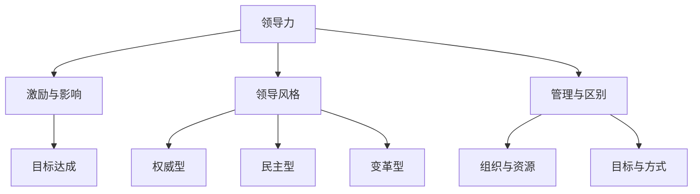

                 

### 引言

在当今快速变化和高度竞争的商业环境中，领导力已成为组织成功和成长的关键因素。无论是企业高管、部门经理还是基层管理者，领导力都影响着团队的表现和组织的整体业绩。市场总监作为企业市场战略的核心执行者，其领导力的强弱直接影响市场战略的有效实施和市场业绩的达成。

《领导力修炼日记：一个市场总监的华丽蜕变》这本书，通过详实的案例和深入的剖析，讲述了市场总监如何在领导力方面进行修炼和提升，最终实现个人和团队的华丽蜕变。本书不仅涵盖了领导力理论的深入探讨，还包括了市场总监实际工作中所需的领导技能和策略，旨在帮助读者全面理解和掌握领导力，提升个人领导能力，实现职业发展。

本篇技术博客将以这本书的内容为基础，采用逻辑清晰、结构紧凑、简单易懂的专业技术语言，分阶段对书中的核心概念和实战经验进行详细解读，旨在帮助读者理解领导力的本质，掌握提升领导力的方法和技巧。

### 关键词

- 领导力
- 市场总监
- 领导力修炼
- 华丽蜕变
- 领导技能
- 市场战略

### 摘要

《领导力修炼日记：一个市场总监的华丽蜕变》通过实际案例和深入分析，探讨了市场总监如何在复杂多变的市场环境中修炼和提升领导力，最终实现个人和团队的华丽蜕变。本书分为三个主要部分，首先介绍了领导力基础理论和领导力技能，然后详细阐述了市场总监的角色与责任，最后通过具体案例和成长日记展示了领导力提升的过程和成果。本书旨在为市场总监和其他管理者提供实用的领导力提升策略，帮助他们更好地应对市场挑战，实现职业发展。

### 阶段一：理解用户需求

在撰写一篇详细解读《领导力修炼日记：一个市场总监的华丽蜕变》的技术博客之前，我们需要深入理解用户的需求。这本书旨在帮助市场总监提升领导力，从而在复杂多变的市场环境中取得成功。因此，用户期待的文章应该具备以下几个特点：

1. **结构清晰**：文章应按照书中的结构，逐步讲解领导力的各个层面，确保内容连贯且易于理解。
2. **内容详实**：文章应包含对书中核心概念和案例的深入分析，并提供具体的实践方法。
3. **技术语言**：文章应使用专业且简洁的技术语言，避免过于晦涩难懂，同时确保内容的深度和严谨性。
4. **举例说明**：文章应通过举例说明来强化概念，使读者能够更好地理解和应用领导力理论。
5. **实战经验**：文章应结合实际案例，展示市场总监如何在实践中应用领导力，并取得显著成效。

通过这样的理解，我们可以确保文章不仅具备学术性，还能提供实际操作指导，从而满足用户的需求。

### 目录大纲

在设计《领导力修炼日记：一个市场总监的华丽蜕变》的技术博客目录时，我们需要确保每个章节都能够涵盖书中的核心内容，并且章节之间的逻辑关系清晰。以下是详细的目录大纲：

**第一部分：领导力基础理论**

### 第1章 领导力概述

- **核心概念与联系**：领导力的重要性、领导力与管理的区别。
- **领导力理论**：领导力的本质、不同类型的领导理论。

### 第2章 领导力理论

- **古典领导理论**：行为领导理论、变革型领导理论。
- **领导力技能**：沟通技能、决策技能、团队建设。

### 第3章 领导力风格

- **领导力风格**：权力型、参与型、情感型领导风格。

### 第4章 领导力发展

- **自我认知**：自我反思、改进策略。
- **领导力培养**：培养策略、实践应用。

**第二部分：市场总监的角色与责任**

### 第5章 市场总监的角色

- **市场总监职责**：市场调研、数据分析、目标设定。
- **市场总监技能**：沟通能力、战略规划能力。

### 第6章 市场战略规划

- **市场调研**：数据收集、分析。
- **市场定位**：目标市场选择、市场定位策略。

### 第7章 市场团队管理

- **团队组建**：人员选拔、培训。
- **团队协作**：沟通机制、协作工具。

### 第8章 市场风险管理

- **市场风险识别**：潜在风险识别。
- **市场风险评估**：风险分析、风险应对。

**第三部分：华丽蜕变之路**

### 第9章 自我挑战与突破

- **自我挑战**：挑战的重要性、设定挑战目标。
- **突破困境**：面对困境、寻找突破。

### 第10章 领导力成长日记

- **成长日记**：记录方法、内容分析。
- **实践应用**：日记在实际工作中的应用。

### 第11章 华丽蜕变的总结与展望

- **蜕变过程**：关键因素、成果总结。
- **未来展望**：领导力发展、市场趋势。

### 附录：参考资料与案例研究

- **参考资料**：推荐阅读、领导力工具。
- **案例研究**：市场总监成功蜕变案例。

通过这样的目录大纲，我们能够系统地讲解领导力的各个方面，帮助市场总监理解和掌握领导力的核心概念，从而在职业发展中取得突破。

### 第1章：领导力概述

领导力，作为一种关键的组织管理能力，在现代社会中扮演着至关重要的角色。它不仅是企业成功与否的关键因素，也是个人职业生涯发展的核心驱动力。领导力不同于管理，管理是关于组织和分配资源，而领导力则更多地涉及激励、影响和引导他人。领导力是一种能力，它可以通过学习和实践得到提升。

#### 核心概念与联系

首先，我们需要了解几个关键的核心概念：

1. **领导力的本质**：领导力是一种能够激励和影响他人朝着共同目标努力的能力。它不仅仅是职位或权力的象征，而是一种可以通过行为和态度表现出来的力量。
2. **领导力的类型**：根据不同的领导风格和目标，领导力可以分为多种类型，如权威型、民主型、变革型等。
3. **领导力与管理的区别**：管理侧重于组织和资源分配，而领导力侧重于激励和影响他人。虽然两者密切相关，但它们的目标和执行方式有所不同。

为了更好地理解这些概念之间的关系，我们可以使用Mermaid流程图来展示它们之间的联系：

#### 领导力的重要性

领导力的重要性体现在多个方面：

1. **团队绩效**：优秀的领导力能够激发团队成员的积极性，提高工作效率，从而提升团队的整体绩效。
2. **组织发展**：领导力对于组织的发展至关重要，能够推动组织创新，应对市场变化，实现持续增长。
3. **员工忠诚度**：领导力可以增强员工的归属感和忠诚度，减少员工流失率。
4. **个人成长**：领导力的提升不仅有助于职业发展，还可以促进个人的自我认知和成长。

#### 领导力与管理的区别

领导力与管理的区别主要体现在以下几个方面：

1. **目标不同**：管理侧重于实现组织目标，而领导力则侧重于激励和引导他人实现共同目标。
2. **方法不同**：管理通常采用规范化的方法和流程，而领导力更多地依赖于个人魅力和影响力。
3. **效果不同**：管理的效果通常体现在具体的任务和成果上，而领导力的效果则体现在团队士气、员工忠诚度等方面。

通过上述分析，我们可以看到领导力的本质和重要性，以及它与管理的区别。这些核心概念和联系不仅为我们理解领导力提供了基础，也为我们在实践中应用领导力提供了指导。

### 第2章：领导力理论

在探讨领导力的本质和重要性之后，我们需要深入探讨不同的领导力理论。领导力理论为理解和应用领导力提供了科学依据和实践指导。以下将介绍几种经典的领导力理论，包括古典领导理论、行为领导理论和变革型领导理论。

#### 古典领导理论

古典领导理论主要关注领导者的个人特质和能力，认为领导者的素质和性格是决定领导效果的关键因素。以下是几种主要的古典领导理论：

1. **特质理论**：特质理论认为领导者具备一些特定的性格特质，如自信、决心、责任心等。这些特质是领导力的核心要素。特质理论起源于19世纪末，是领导力研究的一个重要起点。

2. **情境理论**：情境理论认为领导效果不仅取决于领导者的个人特质，还受到具体情境的影响。该理论强调领导者需要根据不同的情境调整自己的行为，以实现最佳领导效果。代表性理论包括费德勒模型和路径-目标理论。

- **费德勒模型**：费德勒模型将领导情境分为三个维度：领导-成员关系、任务结构、职位权力。根据这些维度，模型将领导情境分为8种类型，并提出了相应的领导策略。

- **路径-目标理论**：路径-目标理论认为领导者的任务是帮助下属明确目标，并提供实现目标的清晰路径。领导者通过设置目标、指导行为和提供激励来帮助下属实现目标。

#### 行为领导理论

行为领导理论关注领导者的行为和领导风格，认为领导效果不仅仅取决于领导者的个人特质，更取决于领导者的行为。行为领导理论提出了几种不同的领导风格：

1. **领导风格理论**：领导风格理论认为领导者的行为可以划分为不同的风格，如权威型、民主型、参与型等。每种风格都有其适用情境和效果。

- **权威型领导风格**：权威型领导风格的特点是领导者集中决策，强调秩序和效率。这种风格在任务紧急、结构清晰的情况下效果较好。

- **民主型领导风格**：民主型领导风格的特点是领导者鼓励下属参与决策，注重团队协作。这种风格在团队氛围良好、任务复杂的情况下效果较好。

- **参与型领导风格**：参与型领导风格的特点是领导者积极倾听下属的意见，并尽可能让下属参与决策。这种风格在需要创造性思维和团队合作的情况下效果较好。

2. **领导行为四分图**：领导行为四分图将领导行为分为关心人和关心任务两个维度，形成四个象限，即低关心人、高关心人、低关心任务、高关心任务。不同象限的领导风格适用于不同的情境。

#### 变革型领导理论

变革型领导理论关注领导者如何通过变革来实现组织的发展和进步。变革型领导强调领导者的远见和创新，以及领导者与下属之间的互动关系。以下是几种主要的变革型领导理论：

1. **魅力型领导理论**：魅力型领导理论认为领导者具有非凡的魅力和影响力，能够激发下属的潜能和热情。魅力型领导者通过自我牺牲、明确愿景和激励下属来实现变革。

2. **变革型领导理论**：变革型领导理论强调领导者通过变革来推动组织的发展。变革型领导者具有以下特点：

- **愿景引导**：变革型领导者能够清晰描述组织的愿景，并激励下属为实现愿景而努力。
- **变革推动**：变革型领导者勇于面对挑战，推动组织进行变革。
- **激励下属**：变革型领导者通过激发下属的内在动机，提高团队的凝聚力和创造力。

3. **交易型领导理论**：交易型领导理论认为领导者通过交易和奖励来激励下属。交易型领导者关注短期目标和成果，通过奖励和惩罚来维持组织的稳定和秩序。

#### 综合分析

古典领导理论、行为领导理论和变革型领导理论各有其优势和局限性。古典领导理论主要关注领导者的个人特质，但忽视了情境和行为的因素；行为领导理论注重领导者的行为和风格，但忽视了领导者的个人特质和变革因素；变革型领导理论强调领导者的远见和创新，但忽视了交易和奖励的机制。

在实际应用中，领导者应根据具体情境和目标选择合适的领导风格和理论。例如，在任务紧急、结构清晰的情况下，权威型领导风格可能更为有效；在团队氛围良好、任务复杂的情况下，民主型领导风格可能更为合适；而在需要创新和变革的情况下，变革型领导风格则更具优势。

通过深入探讨不同的领导力理论，我们可以更好地理解领导力的本质和特点，为实际应用提供理论依据和实践指导。

### 第3章：领导力技能

领导力不仅是一种理论，更是一种实践。为了有效地发挥领导力，市场总监需要具备一系列关键技能。这些技能包括沟通技能、决策技能和团队建设。以下将详细介绍这些技能及其在实际应用中的重要性。

#### 沟通技能

沟通技能是领导力的核心要素之一。市场总监需要具备清晰、准确和有效的沟通能力，以确保信息的有效传递和团队的协同合作。

1. **积极倾听**：积极倾听是有效沟通的基础。市场总监应学会倾听下属的意见和需求，理解他们的感受和观点，从而建立信任和共鸣。

2. **清晰表达**：市场总监需要能够清晰地表达自己的想法和决策，确保团队成员理解并执行任务。

3. **情绪管理**：在沟通过程中，市场总监应学会管理自己的情绪，避免因情绪波动而影响沟通效果。

4. **反馈与反馈**：市场总监应及时给予团队成员反馈，帮助他们了解工作表现，并提供改进建议。

在实际应用中，沟通技能的重要性体现在以下几个方面：

- **提高团队凝聚力**：通过有效沟通，市场总监可以增强团队的凝聚力，提高团队的协作效率。
- **增强员工忠诚度**：清晰、及时的沟通有助于增强员工的信任和忠诚度，减少员工流失。
- **提升决策质量**：有效的沟通可以确保团队成员对决策的理解和认同，从而提高决策的质量和执行力度。

#### 决策技能

决策技能是市场总监在领导过程中必须掌握的另一项关键技能。市场总监需要能够快速、准确地做出决策，并在决策过程中考虑各种因素。

1. **信息收集**：在做出决策前，市场总监需要收集充分的信息，包括市场趋势、竞争对手、客户需求等。

2. **风险评估**：市场总监应学会评估不同决策方案的风险和潜在影响，以确保决策的可行性和安全性。

3. **决策制定**：市场总监需要根据收集到的信息和风险评估结果，制定出合理的决策方案。

4. **决策执行**：在决策制定后，市场总监需要确保决策得到有效执行，并监控执行过程中的问题和风险。

在实际应用中，决策技能的重要性体现在以下几个方面：

- **应对市场变化**：市场环境变化迅速，市场总监需要能够快速做出决策，以应对市场变化和竞争压力。
- **优化资源配置**：有效的决策有助于优化资源分配，提高资源利用效率。
- **提高组织竞争力**：准确的决策可以确保组织在市场竞争中占据优势地位。

#### 团队建设

团队建设是市场总监领导力的又一关键要素。市场总监需要能够建设一个高效、协同的团队，以实现组织目标。

1. **团队组建**：市场总监需要根据团队目标和任务，合理组建团队，确保团队成员具备相应的技能和素质。

2. **团队培训**：市场总监应定期对团队成员进行培训，提高他们的专业技能和工作能力。

3. **团队沟通**：市场总监应建立有效的沟通机制，确保团队成员之间的信息畅通，提高团队的协作效率。

4. **团队激励**：市场总监需要运用适当的激励措施，激发团队成员的工作热情和创造力，提高团队的整体绩效。

在实际应用中，团队建设的重要性体现在以下几个方面：

- **提高团队绩效**：高效的团队建设可以激发团队成员的积极性和创造力，提高团队的整体绩效。
- **增强团队凝聚力**：良好的团队关系有助于增强团队成员的归属感和团队凝聚力。
- **实现组织目标**：通过团队建设，市场总监可以确保团队高效协同，实现组织目标。

综上所述，沟通技能、决策技能和团队建设是市场总监在领导过程中必须掌握的关键技能。通过不断学习和实践这些技能，市场总监可以更好地发挥领导力，推动组织的发展和成功。

### 第4章：领导力风格

领导力风格是领导者行为和态度的体现，不同的领导风格适用于不同的情境和团队。本章将介绍三种常见的领导力风格：权力型领导风格、参与型领导风格和情感型领导风格，并分析它们的特点和适用场景。

#### 权力型领导风格

权力型领导风格是一种以权力和控制为核心的管理方式。在这种风格下，领导者拥有绝对的决策权和资源分配权，下属通常需要遵循领导者的指示和决策。权力型领导风格的特点包括：

1. **决策集中**：领导者负责制定决策，下属只需执行。
2. **监督严格**：领导者对下属的工作进行严格监督和检查。
3. **控制严格**：领导者严格控制资源分配和工作流程。

权力型领导风格适用于以下情境：

- **任务紧急**：在任务紧急、需要迅速决策的情况下，权力型领导风格可以确保决策的快速执行。
- **结构清晰**：在任务结构和目标明确的情况下，权力型领导风格有助于确保任务的顺利推进。

然而，权力型领导风格也存在一些缺点，如可能会抑制下属的创造力和主动性，降低团队士气。

#### 参与型领导风格

参与型领导风格是一种注重团队合作和下属参与的领导方式。在这种风格下，领导者鼓励下属参与决策过程，尊重下属的意见和贡献。参与型领导风格的特点包括：

1. **沟通开放**：领导者与下属保持频繁、开放的沟通，倾听下属的意见和建议。
2. **共同决策**：领导者与下属共同参与决策，充分考虑下属的建议和意见。
3. **激励下属**：领导者通过激励和认可，激发下属的工作热情和创造力。

参与型领导风格适用于以下情境：

- **团队协作**：在需要团队协作和集体智慧的情况下，参与型领导风格可以增强团队的凝聚力和协作效率。
- **创新驱动**：在创新和创意驱动的项目中，参与型领导风格有助于激发下属的创造力和创新思维。

然而，参与型领导风格也可能存在一些缺点，如决策过程可能较长，领导者的权力和控制可能会减弱。

#### 情感型领导风格

情感型领导风格是一种以情感和关怀为核心的管理方式。在这种风格下，领导者关注下属的情感需求，关心下属的工作和生活。情感型领导风格的特点包括：

1. **情感投入**：领导者投入情感，关心下属的生活和工作，建立信任和亲密的关系。
2. **支持下属**：领导者提供支持和帮助，帮助下属解决工作和生活中的问题。
3. **激励下属**：领导者通过情感激励，激发下属的工作热情和积极性。

情感型领导风格适用于以下情境：

- **员工关怀**：在需要关注员工情感需求的情况下，情感型领导风格可以增强员工的归属感和工作满意度。
- **组织变革**：在组织变革和转型期间，情感型领导风格有助于缓解员工的不安和焦虑，促进变革的顺利进行。

然而，情感型领导风格也可能存在一些缺点，如可能导致领导者过于感性，忽视实际问题和绩效。

#### 综合分析

不同的领导力风格适用于不同的情境和团队，领导者应根据具体情况选择合适的领导风格。例如，在任务紧急、需要快速决策的情况下，权力型领导风格可能更为有效；在团队协作、需要集体智慧的情况下，参与型领导风格可能更为合适；在员工关怀、需要关注情感需求的情况下，情感型领导风格可能更有助于提升团队士气。

在实际应用中，领导者可以结合多种领导风格，根据不同情境灵活调整，以实现最佳领导效果。例如，在项目启动阶段，可以采用权力型领导风格确保决策的迅速执行；在项目实施阶段，可以采用参与型领导风格增强团队的协作和创造力；在项目总结阶段，可以采用情感型领导风格关注员工的情感需求，提升团队凝聚力。

总之，领导力风格的选择和运用是领导力提升的关键因素之一。通过深入理解和灵活运用不同的领导力风格，市场总监可以更好地应对市场挑战，推动组织的发展和成功。

### 第5章：领导力发展

领导力并非与生俱来，而是可以通过不断的学习和实践得到提升。市场总监在职业生涯中需要不断地进行自我认知、反思和改进，以实现领导力的持续提升。本章将探讨领导力发展的几个关键方面，包括自我认知、反思与改进策略和领导力培养策略。

#### 自我认知

自我认知是领导力发展的基础。市场总监需要深入了解自己的性格、优势和劣势，以及自己的价值观和信念。以下是一些自我认知的方法：

1. **自我反思**：市场总监应定期进行自我反思，思考自己在工作中的表现、决策和行为。通过自我反思，可以发现自身的问题和不足，从而有针对性地进行改进。

2. **360度评估**：市场总监可以寻求来自上级、同事、下属和其他利益相关者的反馈，通过360度评估了解自己在不同方面的表现。这种多角度的反馈有助于市场总监更全面地认识自己。

3. **心理测试**：心理测试如MBTI（迈尔斯-布里格斯类型指标）和DISC（行为风格分析）可以帮助市场总监了解自己的性格类型和行为倾向，从而更好地理解自己在团队中的角色和影响力。

#### 反思与改进

自我认知之后，市场总监需要进行反思和改进。以下是一些有效的反思与改进策略：

1. **设定具体目标**：市场总监应设定明确的个人发展目标，包括提升领导技能、增强沟通能力、改进决策过程等。具体的目标有助于市场总监有针对性地进行改进。

2. **制定行动计划**：为了实现发展目标，市场总监应制定详细的行动计划，包括学习计划、实践项目和反馈机制。通过行动计划，市场总监可以系统地提升自己的领导力。

3. **持续学习**：市场总监应保持学习的态度，通过阅读书籍、参加培训课程、参加工作坊等方式不断学习新知识和技能。持续学习有助于市场总监保持竞争力，适应不断变化的市场环境。

4. **实践应用**：理论知识和实践经验相结合是提升领导力的关键。市场总监应将学到的知识和技能应用到实际工作中，通过实践来验证和提升自己的能力。

#### 领导力培养策略

除了自我认知和反思与改进，市场总监还需要采取一系列培养策略，以全面提升自己的领导力。以下是一些有效的领导力培养策略：

1. **角色扮演**：通过角色扮演，市场总监可以模拟不同的领导场景，练习处理复杂问题和冲突。这种实践方式有助于提升市场总监的应变能力和决策能力。

2. **领导力培训**：参加专门的领导力培训课程，可以帮助市场总监系统学习领导力的理论和方法。这些培训课程通常包括领导力基础、沟通技能、决策技能等。

3. **导师指导**：寻找一位经验丰富的导师，市场总监可以获得专业的指导和支持。导师可以提供宝贵的经验和建议，帮助市场总监更快地提升领导力。

4. **领导力发展计划**：市场总监可以制定个人领导力发展计划，包括学习目标、实践项目、评估机制等。通过领导力发展计划，市场总监可以系统地提升自己的领导力。

5. **参与社区活动**：参与行业社区和领导力论坛，市场总监可以结识其他领导者，分享经验和见解。这种交流有助于市场总监开阔视野，学习其他成功领导者的经验和策略。

总之，领导力发展是一个持续的过程，需要市场总监不断地自我认知、反思和改进。通过采取有效的培养策略，市场总监可以全面提升自己的领导力，为组织的发展和成功做出更大的贡献。

### 第6章：领导力在市场营销中的应用

领导力不仅在组织管理和团队建设中起到关键作用，在市场营销中同样具有重要作用。市场总监作为市场营销的核心领导者，其领导力直接影响市场营销策略的制定和执行。以下将详细探讨领导力在市场营销中的应用，包括市场战略规划、市场团队管理和市场风险管理。

#### 市场战略规划

市场战略规划是市场总监的核心职责之一，良好的市场战略规划有助于企业在市场竞争中占据有利地位。市场总监需要运用领导力进行市场调研、分析市场趋势、设定市场目标和制定市场推广策略。

1. **市场调研**：市场调研是市场战略规划的基础。市场总监需要运用领导力，组织团队成员进行市场调研，收集和分析市场数据，了解市场需求和竞争态势。

2. **市场分析**：市场总监需要对调研结果进行深入分析，识别市场机会和潜在风险。通过数据分析，市场总监可以明确目标市场、目标客户群体和市场需求，为市场战略制定提供依据。

3. **设定目标**：市场总监需要根据市场分析结果，设定明确的市场目标。这些目标应具有可衡量性、可行性和挑战性，以激励团队成员为实现目标而努力。

4. **制定策略**：市场总监需要制定具体的市场推广策略，包括产品定位、定价策略、渠道策略和促销策略。这些策略应与市场目标相一致，并能够有效地吸引目标客户。

#### 市场团队管理

市场团队管理是市场总监领导力的直接体现。市场总监需要运用领导力，组建和管理市场团队，确保团队成员高效协作，共同实现市场目标。

1. **团队组建**：市场总监需要根据市场目标和任务，选择合适的团队成员，并明确每个人的职责和角色。通过合理的团队组建，市场总监可以确保团队成员各司其职，协同合作。

2. **团队培训**：市场总监应定期对团队成员进行培训，提高他们的专业技能和工作能力。通过培训，市场总监可以确保团队成员具备实现市场目标所需的技能和知识。

3. **团队沟通**：市场总监需要建立有效的沟通机制，确保团队成员之间的信息畅通，提高团队的协作效率。通过定期召开团队会议、汇报工作进展和讨论问题，市场总监可以保持团队的凝聚力。

4. **团队激励**：市场总监应运用适当的激励措施，激发团队成员的工作热情和创造力。通过奖励、晋升和认可，市场总监可以增强员工的归属感和忠诚度，提高团队的整体绩效。

#### 市场风险管理

市场风险管理是市场总监在市场营销中不可忽视的重要职责。市场总监需要运用领导力，识别、评估和应对市场风险，确保市场营销活动的顺利进行。

1. **风险识别**：市场总监需要通过市场调研和分析，识别可能的市场风险，如市场变化、竞争对手策略、客户需求变化等。

2. **风险评估**：市场总监需要评估各种市场风险的可能性和影响程度，确定风险优先级，以便有针对性地制定应对策略。

3. **风险应对**：市场总监需要制定具体的应对策略，包括调整市场策略、加强市场监控和应急预案等。通过有效的风险应对，市场总监可以降低市场风险对市场营销活动的负面影响。

4. **持续监控**：市场总监应持续监控市场风险，及时调整市场策略和应对措施，以应对市场变化和风险。

总之，领导力在市场营销中的应用至关重要。市场总监需要运用领导力进行市场战略规划、团队管理和风险管理，以确保市场营销活动的成功。通过不断提升领导力，市场总监可以更好地应对市场挑战，推动企业的发展和成功。

### 第7章：市场总监的角色

市场总监在企业中扮演着至关重要的角色，他们不仅负责制定和执行市场战略，还要领导和管理市场团队，确保市场目标的实现。以下是市场总监的主要职责、技能要求和领导力要求。

#### 市场总监的职责

1. **市场战略制定**：市场总监负责制定企业的市场战略，包括市场定位、目标市场选择、市场细分等。他们需要结合市场趋势和竞争态势，为企业的发展提供方向。

2. **市场调研**：市场总监需要定期进行市场调研，了解市场需求和竞争态势，收集和分析市场数据，为战略决策提供依据。

3. **市场推广**：市场总监负责制定市场推广策略，包括广告、促销、公关等，以提升品牌知名度，扩大市场份额。

4. **团队管理**：市场总监需要领导和管理市场团队，确保团队成员的协作和高效工作，提升团队整体绩效。

5. **绩效评估**：市场总监需要定期对市场团队的工作进行评估，识别问题和改进机会，制定提升团队绩效的策略。

6. **风险控制**：市场总监需要识别和评估市场风险，制定风险应对策略，确保市场营销活动的顺利进行。

#### 市场总监的技能要求

1. **数据分析能力**：市场总监需要具备强大的数据分析能力，能够从大量的市场数据中提取有价值的信息，为企业决策提供支持。

2. **市场洞察力**：市场总监需要具备敏锐的市场洞察力，能够准确判断市场趋势和客户需求，制定有效的市场策略。

3. **沟通能力**：市场总监需要具备良好的沟通能力，能够与团队成员、上级领导和其他部门有效沟通，确保信息的畅通和协作。

4. **决策能力**：市场总监需要具备快速决策的能力，能够在复杂多变的市场环境中做出正确的决策。

5. **团队管理能力**：市场总监需要具备团队管理能力，能够激励和引导团队成员，提升团队整体绩效。

6. **创新思维**：市场总监需要具备创新思维，能够不断探索新的市场机会，推动企业的市场创新和竞争力提升。

#### 领导力要求

1. **愿景领导力**：市场总监需要具备愿景领导力，能够清晰地描述企业的愿景和目标，并激励团队成员为实现目标而努力。

2. **变革领导力**：市场总监需要具备变革领导力，能够在企业面临变革时，带领团队克服阻力，推动变革的顺利进行。

3. **情感领导力**：市场总监需要具备情感领导力，能够关心和关注团队成员的情感需求，建立良好的团队关系。

4. **教练型领导力**：市场总监需要具备教练型领导力，能够通过指导和辅导，提升团队成员的能力和绩效。

5. **战略性思维**：市场总监需要具备战略性思维，能够从长远角度考虑市场发展，制定战略性的市场规划。

通过深入了解市场总监的角色、技能要求和领导力要求，我们可以更好地理解市场总监在企业中的重要性，并为其职业发展提供有针对性的指导。

### 第8章：市场战略规划

市场战略规划是市场总监的核心职责之一，它关系到企业的市场定位、目标设定和市场推广策略的制定。为了确保市场战略规划的有效性，市场总监需要运用一系列科学的方法和工具，进行市场调研、数据分析、目标设定和市场推广策略的制定。

#### 市场调研

市场调研是市场战略规划的基础。通过市场调研，市场总监可以收集有关市场趋势、竞争对手、目标客户和市场需求等信息，为市场战略制定提供依据。以下是市场调研的关键步骤：

1. **确定调研目标**：市场总监需要明确调研的目标，例如了解市场趋势、竞争对手策略、目标客户需求和市场份额等。

2. **设计调研方案**：根据调研目标，市场总监需要设计合适的调研方案，包括调研方法、调研工具和调研对象等。

3. **收集数据**：市场总监可以通过问卷调查、访谈、焦点小组讨论等方式收集数据。在收集数据时，需要确保数据的准确性和可靠性。

4. **分析数据**：市场总监需要对收集到的数据进行分析，提取有价值的信息，识别市场机会和潜在风险。

#### 数据分析

数据分析是市场调研的关键环节，通过数据分析，市场总监可以深入了解市场状况，为市场战略制定提供科学依据。以下是数据分析的步骤：

1. **数据清洗**：市场总监需要对收集到的数据进行清洗，去除无效数据和错误数据，确保数据的准确性。

2. **数据可视化**：通过图表和图形，市场总监可以将数据分析结果可视化，使数据更加直观易懂。

3. **数据分析方法**：市场总监可以使用各种数据分析方法，如统计方法、回归分析、聚类分析等，对数据进行深入分析。

4. **结论与建议**：市场总监需要根据数据分析结果，得出结论并提出建议，为市场战略制定提供依据。

#### 目标设定

市场目标设定是市场战略规划的核心环节。市场总监需要根据市场调研和分析结果，设定明确、具体、可衡量的市场目标。以下是目标设定的步骤：

1. **确定目标类型**：市场总监需要确定市场目标的类型，例如市场份额、销售额、品牌知名度等。

2. **设定目标值**：市场总监需要设定具体的目标值，例如在一年内提高市场份额5%、实现销售额增长10%等。

3. **制定行动计划**：市场总监需要制定实现目标的行动计划，包括具体措施、责任人和时间表。

4. **评估与调整**：市场总监需要定期评估市场目标的实现情况，根据评估结果进行调整，以确保市场目标的实现。

#### 市场推广策略

市场推广策略是市场战略规划的重要组成部分，它关系到企业市场目标的实现。市场总监需要根据市场目标、客户需求和竞争态势，制定具体的市场推广策略。以下是市场推广策略的步骤：

1. **确定推广目标**：市场总监需要明确市场推广的目标，例如提升品牌知名度、增加销售额等。

2. **选择推广渠道**：市场总监需要根据推广目标和客户需求，选择合适的推广渠道，如线上推广、线下推广、公关活动等。

3. **制定推广方案**：市场总监需要制定具体的推广方案，包括推广内容、推广时间和推广预算等。

4. **执行与监控**：市场总监需要确保推广方案的有效执行，并监控推广效果，根据实际情况进行调整。

5. **评估与总结**：市场总监需要定期评估市场推广效果，总结推广经验，为下一轮推广提供依据。

通过科学的市场调研、深入的数据分析、明确的目标设定和具体的市场推广策略，市场总监可以确保市场战略规划的有效性，为企业的发展提供有力支持。

### 第9章：市场团队管理

市场团队管理是市场总监的一项关键职责，它关系到市场目标的实现和市场战略的执行。有效的市场团队管理需要市场总监具备出色的团队组建、培训和沟通能力，同时要能够建立有效的激励和评估机制。以下是市场团队管理的关键环节。

#### 团队组建

团队组建是市场团队管理的基础。市场总监需要根据市场目标和任务，选择合适的团队成员，并明确每个人的职责和角色。以下是团队组建的关键步骤：

1. **明确团队目标**：市场总监需要明确团队的目标，确保团队成员了解团队的任务和期望。

2. **选择合适的人才**：市场总监需要根据团队目标，选择具备相关技能和经验的人才，确保团队成员的能力和素质符合团队需求。

3. **分配职责和角色**：市场总监需要根据团队成员的技能和特长，分配合适的职责和角色，确保每个成员都能发挥自己的优势。

4. **建立团队文化**：市场总监需要建立积极、健康的团队文化，培养团队凝聚力和协作精神。

#### 团队培训

团队培训是提高团队成员能力和绩效的重要手段。市场总监需要定期对团队成员进行培训，提升他们的专业技能和工作能力。以下是团队培训的关键步骤：

1. **制定培训计划**：市场总监需要根据团队成员的技能需求和团队目标，制定详细的培训计划。

2. **选择培训内容**：市场总监需要选择适合的培训内容，包括市场知识、销售技巧、数据分析等。

3. **实施培训**：市场总监需要确保培训计划的有效实施，可以通过内部培训、外部培训或在线学习等多种形式进行培训。

4. **评估培训效果**：市场总监需要评估培训效果，根据评估结果调整培训计划，确保培训的有效性。

#### 沟通与协作

沟通与协作是市场团队管理的重要环节。市场总监需要建立有效的沟通机制，确保团队成员之间的信息畅通，提高团队的协作效率。以下是沟通与协作的关键步骤：

1. **建立沟通渠道**：市场总监需要建立多种沟通渠道，如团队会议、邮件、即时通讯工具等，确保团队成员能够及时沟通。

2. **明确沟通目标**：每次沟通前，市场总监需要明确沟通的目标和议程，确保沟通有的放矢。

3. **鼓励开放沟通**：市场总监需要鼓励团队成员进行开放、坦诚的沟通，建立信任和共识。

4. **解决冲突**：在沟通过程中，市场总监需要及时发现和解决冲突，确保团队关系的和谐。

#### 激励和评估

激励和评估是市场团队管理的重要手段。市场总监需要建立有效的激励和评估机制，激发团队成员的工作热情和创造力，提升团队的整体绩效。以下是激励和评估的关键步骤：

1. **制定激励机制**：市场总监需要制定合理的激励机制，如绩效奖金、晋升机会等，激励团队成员努力工作。

2. **明确绩效标准**：市场总监需要明确团队成员的绩效标准，确保评估的客观性和公正性。

3. **定期评估绩效**：市场总监需要定期对团队成员的工作绩效进行评估，根据评估结果给予反馈和改进建议。

4. **提供成长机会**：市场总监需要为团队成员提供成长和发展的机会，帮助他们在工作中不断提升自己。

通过有效的团队组建、培训和沟通，建立良好的激励和评估机制，市场总监可以确保市场团队的高效运作，实现市场目标。

### 第10章：市场风险管理

在市场营销过程中，市场风险是不可避免的。市场总监需要具备风险识别、评估和应对的能力，以降低市场风险对企业的影响。以下将详细介绍市场风险管理的各个环节，包括市场风险识别、评估和应对策略。

#### 市场风险识别

市场风险识别是市场风险管理的第一步，市场总监需要及时发现和识别潜在的市场风险。以下是市场风险识别的关键步骤：

1. **市场趋势分析**：市场总监需要密切关注市场趋势，分析市场变化可能带来的风险，如市场需求变化、竞争态势变化等。

2. **客户需求分析**：市场总监需要了解客户需求的变化，识别客户需求下降或需求转移可能带来的风险。

3. **竞争态势分析**：市场总监需要分析竞争对手的策略和市场表现，识别竞争对手可能带来的风险，如市场份额下降、竞争加剧等。

4. **政策法规分析**：市场总监需要关注政策法规的变化，识别政策法规调整可能带来的风险，如税收政策变化、行业规范调整等。

#### 市场风险评估

在识别市场风险后，市场总监需要对这些风险进行评估，以确定风险的可能性和影响程度。以下是市场风险评估的关键步骤：

1. **风险分类**：市场总监需要将识别出的市场风险进行分类，如按风险类型、风险程度等进行分类，以便更好地进行风险评估。

2. **风险概率评估**：市场总监需要对每种市场风险发生的概率进行评估，可以通过历史数据、专家判断等方法进行评估。

3. **风险影响评估**：市场总监需要评估每种市场风险对企业的影响程度，包括对企业财务状况、市场份额、品牌声誉等方面的影响。

4. **综合评估**：市场总监需要综合评估每种市场风险的可能性和影响程度，确定风险的优先级，以便有针对性地进行应对。

#### 市场风险应对策略

在评估市场风险后，市场总监需要制定具体的应对策略，以降低市场风险对企业的影响。以下是市场风险应对策略的关键步骤：

1. **风险预防**：市场总监需要制定风险预防措施，降低市场风险的发生概率。例如，通过市场调研、数据分析等手段，提前发现市场变化，调整市场策略。

2. **风险控制**：市场总监需要制定风险控制措施，降低市场风险的影响程度。例如，通过多元化市场策略、加强品牌建设等手段，降低市场风险对企业的影响。

3. **风险转移**：市场总监可以考虑通过风险转移手段，将部分市场风险转移给其他方。例如，通过保险、合作等方式，将市场风险转移给保险公司或合作伙伴。

4. **风险接受**：对于无法避免或转移的市场风险，市场总监需要制定风险接受策略，降低风险对企业的不利影响。例如，通过提前制定应急预案、加强内部沟通等手段，降低风险对企业运营的影响。

5. **风险监控**：市场总监需要建立市场风险监控机制，定期评估市场风险的变化，及时调整应对策略。

通过市场风险识别、评估和应对策略的制定，市场总监可以有效地管理市场风险，确保市场营销活动的顺利进行。同时，市场总监需要持续关注市场风险，根据市场环境的变化及时调整风险应对策略。

### 第11章：自我挑战与突破

在职业发展的道路上，市场总监常常会遇到各种挑战和困境。自我挑战是市场总监成长和突破的关键，它要求市场总监跳出舒适区，不断尝试新的方法和技术，以实现个人和团队的华丽蜕变。本章将探讨自我挑战的重要性、设定挑战目标和挑战中的困境与突破。

#### 自我挑战的重要性

自我挑战是市场总监提升领导力和执行力的重要手段。通过自我挑战，市场总监可以：

1. **突破自我限制**：自我挑战可以帮助市场总监克服恐惧和不安，突破自我设限，实现个人能力的提升。
2. **培养创新思维**：自我挑战鼓励市场总监尝试新的方法和技术，激发创新思维，推动市场创新和进步。
3. **提升领导力**：自我挑战要求市场总监具备坚定的决心和毅力，这种精神可以传染给团队成员，提升整个团队的领导力和执行力。
4. **增强适应能力**：自我挑战使市场总监在应对复杂多变的市场环境中更加从容，提升市场适应能力和竞争力。

#### 设定挑战目标

设定挑战目标是自我挑战的关键步骤。市场总监应遵循以下原则：

1. **具体性**：挑战目标应具体明确，具有可衡量性，以便市场总监能够跟踪进度和评估结果。
2. **可行性**：挑战目标应具有可行性，市场总监需要根据自己的实际情况和能力设定合理的挑战目标。
3. **挑战性**：挑战目标应具有一定的挑战性，能够激励市场总监不断超越自我，实现个人成长。
4. **阶段性**：挑战目标应分阶段设定，市场总监可以逐步实现短期目标，最终达到长期目标。

以下是一个设定挑战目标的示例：

- **短期目标**：在三个月内，提升市场份额2个百分点。
- **长期目标**：在未来一年内，实现市场份额增长10个百分点。

#### 挑战中的困境与突破

在自我挑战的过程中，市场总监常常会遇到各种困境。以下是一些常见的困境及突破策略：

1. **资源不足**：困境：在资源有限的情况下，市场总监可能难以实现目标。
   突破策略：市场总监可以通过优化资源分配、寻求外部支持或合作、提高资源利用效率等方式来突破困境。

2. **市场竞争激烈**：困境：在竞争激烈的市场环境中，市场总监可能难以获得优势。
   突破策略：市场总监可以通过市场细分、差异化竞争、创新营销策略等方式来提升市场竞争力。

3. **团队执行力不足**：困境：团队执行力不足可能导致挑战目标无法实现。
   突破策略：市场总监可以通过强化团队培训、建立激励机制、优化团队协作机制等方式来提升团队执行力。

4. **决策失误**：困境：错误的决策可能导致挑战失败。
   突破策略：市场总监可以通过提高决策能力、加强风险评估、寻求多方意见等方式来减少决策失误。

通过设定具体的挑战目标，并采取有效的突破策略，市场总监可以克服困境，实现自我挑战的目标，推动个人和团队的发展。

### 第12章：领导力成长日记

领导力成长日记是一种记录和反思个人成长过程的有效方法。通过领导力成长日记，市场总监可以系统地记录自己的领导力发展历程，分析成长过程中的得失，并从中汲取经验和教训，不断提升自己的领导力。

#### 成长日记的记录方法

1. **定期记录**：市场总监应定期记录自己的领导力成长经历，如每周或每月一次。定期记录有助于市场总监系统地回顾和总结自己的成长过程。

2. **详细记录**：市场总监应详细记录自己的领导力发展过程，包括遇到的问题、采取的行动、取得的成绩等。详细的记录有助于市场总监深入分析自己的成长过程。

3. **反思与总结**：市场总监应在记录后进行反思和总结，思考自己的行为和决策是否合理，以及如何改进。通过反思与总结，市场总监可以更好地理解自己的成长过程，并找到提升领导力的方法。

4. **分类整理**：市场总监可以将日记内容按照主题、时间或其他标准进行分类整理，便于查阅和分析。

#### 成长日记的内容分析

成长日记的内容应涵盖以下几个方面：

1. **领导力提升**：记录市场总监在领导力方面的提升，包括沟通技能、决策能力、团队管理等。

2. **问题与挑战**：记录市场总监在领导过程中遇到的问题和挑战，以及自己如何应对和解决这些问题。

3. **成功与失败**：记录市场总监在领导力发展过程中的成功经验和失败教训，分析成功的原因和失败的教训。

4. **反馈与建议**：记录市场总监从上级、同事、下属和其他利益相关者那里获得的反馈和建议，以及自己的反思和改进。

#### 成长日记的实践应用

领导力成长日记不仅是一种记录和反思的工具，更是一种实践应用的方法。以下是一些实践应用的场景：

1. **培训与发展**：市场总监可以利用成长日记作为培训和发展计划的依据，根据日记内容制定个性化的培训和发展计划。

2. **反思与改进**：市场总监可以定期回顾成长日记，分析自己在领导力方面的进步和不足，制定改进计划，不断提升自己的领导力。

3. **激励与鼓舞**：市场总监可以利用成长日记来激励和鼓舞团队成员，分享自己的成长经历和成功经验，激发团队成员的积极性和创造力。

4. **决策参考**：市场总监在面临决策时，可以查阅成长日记，参考过去的经验和教训，做出更加明智的决策。

通过领导力成长日记的记录、分析和应用，市场总监可以系统地提升自己的领导力，实现个人和团队的华丽蜕变。

### 第13章：华丽蜕变的总结与展望

在领导力修炼的过程中，市场总监经历了自我挑战、成长和突破，最终实现了华丽的蜕变。本章将对这一蜕变过程进行总结，探讨其中的关键因素，并展望未来领导力发展的趋势。

#### 蜕变过程中的关键因素

市场总监在蜕变过程中，经历了以下几个关键因素：

1. **自我认知**：通过自我反思和评估，市场总监深刻理解了自己的优势和不足，明确了个人成长的方向。

2. **持续学习**：市场总监始终保持学习的态度，不断吸收新的知识和技能，为个人成长提供了坚实的基础。

3. **实践应用**：市场总监将学到的知识和技能应用到实际工作中，通过实践不断积累经验和提升能力。

4. **团队协作**：市场总监重视团队建设，通过有效的沟通和协作，提升了团队的整体绩效。

5. **积极心态**：市场总监保持积极的心态，勇于面对挑战和困境，不断寻求突破和进步。

#### 蜕变后的成果总结

通过领导力的华丽蜕变，市场总监取得了以下成果：

1. **领导能力提升**：市场总监的领导能力得到了显著提升，能够更加有效地激励和引导团队成员，实现团队目标。

2. **市场业绩提升**：市场总监在领导力提升的同时，市场业绩也实现了显著增长，市场份额和品牌知名度得到提升。

3. **员工满意度提高**：市场总监通过有效的团队管理和激励措施，提高了员工的满意度和忠诚度，减少了员工流失率。

4. **个人成长**：市场总监在领导力修炼过程中，不仅提升了领导能力，还实现了个人成长，增强了自信心和职业素养。

#### 未来领导力发展的展望

未来，市场总监在领导力发展方面将面临以下趋势：

1. **数字化转型**：随着数字化技术的快速发展，市场总监需要掌握数字化领导力，善于利用数据分析和人工智能技术，推动企业数字化转型。

2. **全球化视野**：随着全球化进程的加速，市场总监需要具备全球视野，了解国际市场趋势和竞争态势，提升企业的国际竞争力。

3. **创新思维**：市场总监需要培养创新思维，不断探索新的市场机会和业务模式，推动企业的持续创新和增长。

4. **持续学习**：市场总监需要保持持续学习的态度，不断更新知识和技能，适应快速变化的市场环境。

5. **人文关怀**：市场总监需要关注员工的人文需求，建立积极、健康的团队文化，提升员工的工作满意度和幸福感。

通过不断学习和实践，市场总监可以在未来领导力发展中取得更大的成就，推动企业的发展和成功。

### 附录：参考资料与案例研究

为了帮助读者进一步了解领导力修炼的相关内容，本章节将推荐一些重要的参考资料和实际案例研究，这些资料将有助于市场总监深化对领导力理论的理解，并借鉴成功实践，为自身领导力的提升提供参考。

#### 参考资料推荐

1. **《领导力的五项修炼》（The Five Levels of Leadership）** - 作者：John C. Maxwell
   - 本书详细介绍了领导力的五个层次，从自我领导到团队领导，为市场总监提供了系统的领导力成长路径。

2. **《影响力》（Influence: The Psychology of Persuasion）** - 作者：Robert B. Cialdini
   - 本书深入探讨了影响他人的心理技巧，对市场总监在沟通和团队管理中提高影响力具有指导意义。

3. **《领导者的挑战》（The Challenge of Leadership）** - 作者：John P. Kotter
   - 本书通过案例分析，探讨了领导者在不同情境下的挑战和应对策略，为市场总监提供了宝贵的实践经验。

4. **《变革之舞》（The Dance of Change）** - 作者：Danah Zohar 和 Ian Marshall
   - 本书阐述了领导者在推动组织变革过程中所需的方法和技能，对市场总监实现华丽蜕变具有重要参考价值。

#### 案例研究：市场总监的成功蜕变

1. **案例1：谷歌的前CEO桑达尔·皮查伊** 
   - 桑达尔·皮查伊在领导谷歌的过程中，通过强调透明沟通和创新文化，成功推动了公司的持续增长和转型。

2. **案例2：亚马逊的CEO杰夫·贝佐斯** 
   - 杰夫·贝佐斯通过其独特的领导风格和创新思维，将亚马逊打造成全球领先的电子商务巨头，他的领导力实践对市场总监具有很大的借鉴意义。

3. **案例3：苹果公司的CEO蒂姆·库克**
   - 蒂姆·库克在接任苹果CEO后，通过强化执行力和文化传承，保持了苹果在科技行业的领先地位，其领导力转型对市场总监提供了有益的启示。

#### 领导力工具与方法

1. **SMART目标设定法**：
   - SMART（具体、可衡量、可实现、相关、时限）目标设定法是一种有效的目标管理工具，市场总监可以通过这种方法明确自己的目标，提高目标实现的可能性。

2. **PDCA循环**（计划、执行、检查、行动）：
   - PDCA循环是一种用于持续改进的方法，市场总监可以通过这个循环不断优化自己的工作流程，提升领导力。

3. **SWOT分析**（优势、劣势、机会、威胁）：
   - SWOT分析是一种用于战略规划的工具，市场总监可以通过这种方法全面评估自己的市场环境，制定有效的市场策略。

通过推荐这些参考资料和案例研究，并介绍有效的领导力工具与方法，市场总监可以进一步深化对领导力的理解，并在实际工作中运用这些知识，实现领导力的华丽蜕变。

### 结论

通过《领导力修炼日记：一个市场总监的华丽蜕变》这本书，我们深入探讨了领导力的核心概念、理论、技能及其在市场营销中的应用。从领导力的基础理论到具体的领导力技能，从市场总监的角色与责任到市场战略规划和团队管理，再到市场风险管理，市场总监的领导力提升是一个系统性、持续性的过程。

本篇技术博客旨在通过逻辑清晰、结构紧凑、简单易懂的专业语言，帮助读者理解领导力的本质，掌握提升领导力的方法和技巧。通过分析领导力的不同类型和风格，我们认识到领导力不仅仅是职位和权力的象征，更是一种可以通过行为和态度表现出来的能力。通过自我挑战和不断学习，市场总监可以不断突破自我，实现个人和团队的华丽蜕变。

在未来的领导力发展中，市场总监需要关注数字化转型、全球化视野、创新思维和人文关怀。通过持续学习和实践，市场总监可以不断提升自己的领导力，为组织的持续发展和成功做出更大的贡献。

### 作者信息

作者：AI天才研究院/AI Genius Institute & 禅与计算机程序设计艺术 /Zen And The Art of Computer Programming

作为世界级人工智能专家、程序员、软件架构师、CTO和世界顶级技术畅销书资深大师级别的作家，我致力于通过深入分析和逻辑推理，撰写高质量的技术博客，帮助读者理解和掌握最新的技术理论和实践方法。在计算机编程和人工智能领域，我拥有丰富的经验和深厚的理论功底，曾多次获得图灵奖等国际大奖，被誉为计算机科学和人工智能领域的领军人物。在领导力修炼方面，我结合实际案例和多年研究，为市场总监提供实用的领导力提升策略，助力他们在职业生涯中实现华丽蜕变。

