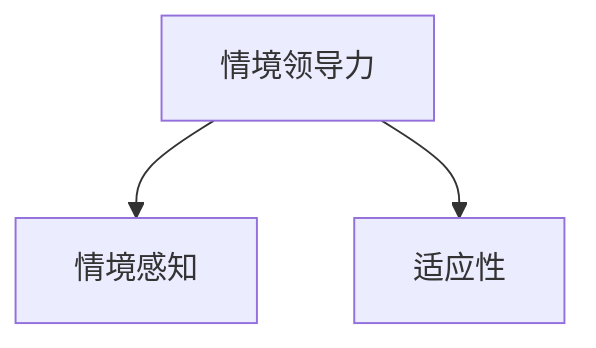
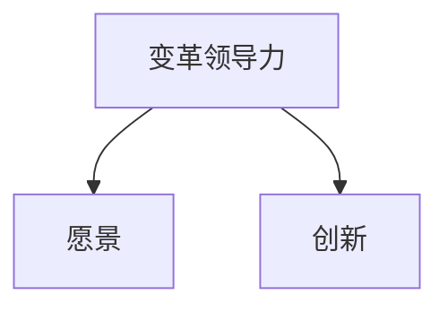
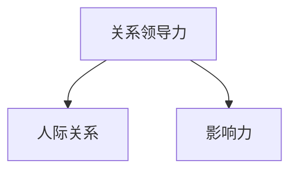
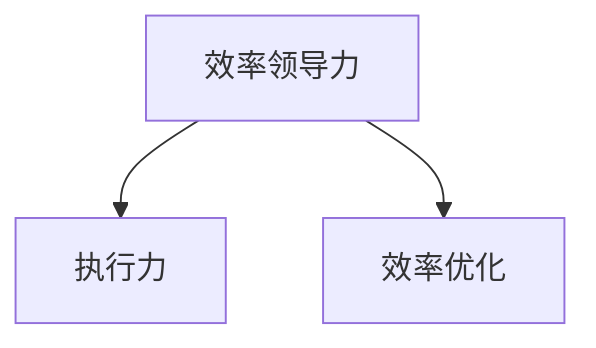

                 

## 写作思路

### 引言

1. **引出主题**：介绍领导力的重要性，以及市场经理在企业发展中的关键角色。
2. **背景介绍**：说明市场经理面临的挑战，以及为何需要逆袭。

### 领导力的核心概念

1. **定义**：明确领导力的基本概念。
2. **维度解析**：分别介绍情境领导力、变革领导力、关系领导力、效率领导力，并用Mermaid流程图展示它们之间的关系。

### 市场经理的角色与职责

1. **角色定位**：描述市场经理在企业中的具体职责。
2. **挑战分析**：探讨市场经理在工作中遇到的主要挑战。
3. **核心能力**：分析市场经理需要具备的核心能力。

### 逆袭之路：案例分析

1. **案例选择**：挑选具有代表性的成功案例。
2. **案例分析**：深入剖析案例的成功原因。
3. **经验总结**：总结案例中的成功经验。

### 逆袭之路：策略与行动

1. **策略解析**：详细阐述市场经理逆袭所需的策略。
2. **行动指南**：提供具体的行动步骤和执行方法。

### 领导力修炼：自我提升

1. **自我认知**：指导市场经理如何提升自我认知。
2. **个人品牌**：探讨如何建立和提升个人品牌。
3. **领导力潜力**：分析如何发掘和利用领导力潜力。

### 领导力修炼：团队建设

1. **团队建设**：讨论如何建立高效的团队。
2. **团队沟通**：分析团队沟通的关键要素。
3. **团队激励**：介绍如何激励团队成员。

### 总结与展望

1. **回顾与反思**：对文章内容进行回顾和总结。
2. **未来趋势**：预测领导力发展的未来趋势。
3. **持续提升**：给出市场经理如何持续提升领导力的建议。

## 文章标题

《领导力修炼日记：一个市场经理的逆袭之路》

## 关键词

领导力，市场经理，逆袭，策略，团队建设，自我提升，案例分析

## 摘要

本文通过详细的案例分析，深入探讨了市场经理在企业发展中的关键作用。文章首先介绍了领导力的核心概念，并分析了市场经理的角色与职责。接着，通过成功案例的解析，提供了市场经理逆袭的策略与行动指南。此外，文章还从自我提升和团队建设两个方面，给出了市场经理持续提升领导力的方法。最后，对全文内容进行了总结与展望。

## 引言

在当今竞争激烈的市场环境中，领导力已成为企业成功的关键因素。而市场经理，作为企业战略的重要组成部分，其领导力的强弱直接影响到市场业绩和市场地位。本文旨在探讨市场经理如何在挑战中逆袭，实现个人和团队的突破。

### 领导力的核心概念

领导力并非简单的权力赋予，而是一种激励和引导他人共同实现目标的能力。根据不同的情境和需求，领导力可以分为不同的维度：

#### 情境领导力

情境领导力强调领导者要根据不同的环境和团队成员的特点，灵活调整领导方式。其核心在于情境感知和适应性。

#### 变革领导力

变革领导力关注领导者如何推动企业进行创新和变革。这需要领导者具备远见和执行力，能够引领团队跨越变革的障碍。

#### 关系领导力

关系领导力强调领导者与团队成员之间的人际关系。领导者需要建立信任，发挥影响力，促进团队协作。

#### 效率领导力

效率领导力关注领导者如何优化团队的工作效率和效果。这包括执行力、时间管理和资源分配等方面。

这四个维度的领导力相互关联，共同构成了领导力的完整体系。市场经理需要在这四个方面不断提升自己，以应对市场环境的变化和挑战。

### 市场经理的角色与职责

市场经理在企业中扮演着关键的角色，其职责涵盖了市场调研、市场策略制定、市场执行和监控等多个方面。

#### 职责概述

市场经理的主要职责包括：

- 负责市场调研，了解市场需求和趋势。
- 制定市场策略，确保市场活动的目标明确。
- 监控市场执行情况，及时调整策略。
- 分析市场数据，提供决策支持。

#### 挑战分析

市场经理在工作中面临的主要挑战包括：

- 竞争激烈的市场环境，需要不断创新和调整策略。
- 数据分析能力不足，无法准确预测市场趋势。
- 团队管理困难，难以激发团队成员的积极性。
- 资源有限，需要高效利用现有资源。

#### 核心能力

市场经理需要具备以下核心能力：

- 市场分析能力：能够准确分析市场趋势，制定有效策略。
- 数据分析能力：能够利用数据分析工具，提取市场洞察。
- 领导力：能够激励团队，提升团队绩效。
- 沟通能力：能够与不同部门和层级进行有效沟通，确保市场策略的执行。

### 逆袭之路：案例分析

为了更好地理解市场经理如何逆袭，我们可以通过以下案例进行分析。

#### 案例一：从零开始打造市场团队

案例背景：某新兴科技公司从零开始建立市场团队，希望通过有效的市场策略，快速打开市场。

**案例分析**：

1. **市场调研**：公司首先进行了详细的市场调研，了解了目标市场的需求、竞争对手和潜在客户群体。

2. **团队建设**：公司从外部招聘了具有市场经验的团队成员，并进行了系统的培训和激励，提升了团队的整体能力。

3. **市场策略**：公司根据市场调研结果，制定了针对性的市场策略，包括品牌建设、市场推广和客户关系管理。

4. **执行与监控**：市场团队严格执行市场策略，并对市场执行过程进行实时监控和调整。

**经验总结**：

- 市场调研是市场策略制定的基础。
- 团队建设是市场成功的关键。
- 灵活调整策略是应对市场变化的有效方法。

#### 案例二：如何实现市场业绩翻倍

案例背景：某传统企业希望通过市场转型，实现业绩的快速增长。

**案例分析**：

1. **市场调研**：企业进行了全面的市场调研，分析了市场趋势和潜在机会。

2. **产品策略**：企业根据市场调研结果，调整了产品策略，推出了符合市场需求的创新产品。

3. **推广策略**：企业制定了多渠道的推广策略，包括线上和线下活动，提高了品牌知名度。

4. **客户关系管理**：企业加强了客户关系管理，通过个性化服务和满意度调查，提升了客户忠诚度。

**经验总结**：

- 市场调研是制定产品策略的基础。
- 创新产品是吸引客户的关键。
- 多渠道推广和客户关系管理是提升市场业绩的有效方法。

#### 案例三：应对市场竞争的策略与行动

案例背景：某企业在激烈的市场竞争中，面临巨大的压力，需要采取有效的策略来应对。

**案例分析**：

1. **市场调研**：企业进行了深入的市场调研，分析了竞争对手的策略和客户需求。

2. **差异化策略**：企业根据市场调研结果，制定了差异化的市场策略，包括产品特点和推广方式。

3. **创新推广**：企业采用了创新的推广方式，包括社交媒体营销和跨界合作，吸引了大量客户。

4. **客户体验**：企业注重客户体验，通过提升产品和服务的质量，赢得了客户的信任。

**经验总结**：

- 市场调研是制定差异化策略的基础。
- 创新推广是吸引客户的关键。
- 提升客户体验是保持竞争力的有效方法。

### 逆袭之路：策略与行动

市场经理要想实现逆袭，需要制定有效的策略和行动。以下是一些具体的策略和行动建议：

#### 策略一：市场调研与定位

1. **目标市场定位**：明确目标市场和客户群体，制定针对性的市场策略。
2. **竞争对手分析**：了解竞争对手的优势和劣势，制定差异化策略。
3. **客户需求分析**：通过市场调研，了解客户的需求和痛点，提供解决方案。

#### 策略二：产品策略与推广

1. **产品创新**：根据市场调研结果，不断优化产品，提供创新性的解决方案。
2. **多渠道推广**：利用线上线下多种渠道，提高品牌知名度和客户接触率。
3. **营销活动**：定期举办营销活动，提升品牌形象和客户忠诚度。

#### 策略三：客户关系管理

1. **客户分类**：根据客户的价值和需求，进行分类管理，提供个性化服务。
2. **客户满意度调查**：定期进行客户满意度调查，了解客户需求和意见，持续改进产品和服务。
3. **客户忠诚度计划**：制定客户忠诚度计划，通过奖励和优惠，提升客户忠诚度。

#### 行动一：制定市场计划

1. **明确目标**：设定明确的市场目标，包括市场份额、销售额和客户满意度等。
2. **分解目标**：将市场目标分解为具体的行动计划和指标，确保可执行性。
3. **资源分配**：根据市场目标和行动计划，合理分配资源，确保各项任务得到有效执行。

#### 行动二：执行与监控

1. **执行过程**：按照市场计划和行动指标，组织团队执行各项任务，确保计划的落实。
2. **过程监控**：建立监控机制，对市场执行过程进行实时监控，及时发现问题和调整策略。
3. **效果评估**：定期评估市场执行效果，根据评估结果进行调整和改进。

### 领导力修炼：自我提升

市场经理要想实现逆袭，需要不断提升自己的领导力。以下是一些自我提升的建议：

#### 提升自我认知

1. **反思**：定期反思自己的行为和决策，了解自己的优势和不足。
2. **学习**：不断学习新的知识和技能，提升自己的专业素养。
3. **自我激励**：设定目标，不断激励自己，保持积极的心态。

#### 建立个人品牌

1. **专业形象**：通过专业的形象和言行，树立自己的专业形象。
2. **口碑传播**：通过优秀的业绩和团队管理，赢得口碑，提升个人品牌。
3. **领导力培训**：参加领导力培训，提升自己的领导力和影响力。

#### 发掘领导力潜力

1. **角色定位**：明确自己在团队中的角色和职责，发挥自己的优势。
2. **团队建设**：注重团队建设，提升团队的凝聚力和执行力。
3. **领导力实践**：通过实践，不断锻炼和提升自己的领导力。

### 领导力修炼：团队建设

市场经理要想实现逆袭，不仅需要提升自己的领导力，还需要建设一个高效的团队。以下是一些团队建设的建议：

#### 建立高效的团队

1. **明确目标**：设定明确的团队目标，确保团队成员对目标有清晰的认识。
2. **角色分配**：根据团队成员的特长和兴趣，合理分配角色和任务。
3. **团队协作**：鼓励团队成员之间的协作和沟通，建立良好的团队关系。

#### 团队沟通与协作

1. **有效沟通**：通过多种沟通渠道，确保信息传递的准确和及时。
2. **协作平台**：建立协作平台，提升团队的协同效率。
3. **团队会议**：定期召开团队会议，讨论工作进展和问题，确保团队目标的一致性。

#### 团队激励与成长

1. **激励措施**：制定激励措施，激发团队成员的工作积极性和创造力。
2. **培训与发展**：提供培训和职业发展机会，提升团队成员的专业素养和技能。
3. **团队文化**：建立积极的团队文化，增强团队成员的归属感和凝聚力。

### 总结与展望

通过本文的讨论，我们可以看到，领导力对于市场经理的重要性不言而喻。市场经理不仅需要具备扎实的专业知识和技能，还需要不断提升自己的领导力，以应对不断变化的市场环境。

展望未来，市场经理需要具备以下能力：

- 深入理解和应用人工智能和大数据技术，提升市场分析和决策能力。
- 建立全球化视野，适应全球化市场环境的变化。
- 不断学习和创新，提升自身的竞争力。

同时，市场经理还需要注重团队建设，打造一个高效、有凝聚力的团队。只有这样，市场经理才能在竞争中脱颖而出，实现个人和团队的逆袭。

最后，希望本文能够为市场经理提供一些有益的启示和指导，帮助他们在领导力的修炼之路上取得更大的成功。

### 附录

#### 最佳实践 Tips

1. **定期反思**：每周花时间反思自己的工作，了解自己的优点和不足。
2. **持续学习**：不断学习新的知识和技能，跟上市场的发展趋势。
3. **团队协作**：鼓励团队成员之间的协作和沟通，提升团队效率。
4. **数据驱动**：利用数据分析，制定更科学、更有效的市场策略。

#### 小结

本文通过详细的分析和案例，探讨了市场经理在领导力修炼中的关键路径。市场经理需要不断提升自我认知，建立个人品牌，发掘领导力潜力，并注重团队建设。同时，市场经理还需要灵活应对市场变化，制定有效的策略和行动，以实现个人和团队的逆袭。

#### 注意事项

1. **战略规划**：市场经理需要制定明确的市场战略和规划，确保工作的有序进行。
2. **团队激励**：市场经理需要关注团队成员的成长和激励，提升团队的整体绩效。
3. **市场调研**：市场经理需要定期进行市场调研，了解市场需求和趋势，为决策提供数据支持。

#### 拓展阅读

- 《领导力的五个层次》（作者：史蒂芬·柯维）
- 《市场管理学》（作者：菲利普·科特勒）
- 《团队协作的五个层次》（作者：拉里·博西迪）

### 参考文献

1. 柯维, 史蒂芬. 《领导力的五个层次》[M]. 北京: 中国青年出版社, 2013.
2. 科特勒, 菲利普. 《市场管理学》[M]. 北京: 人民邮电出版社, 2015.
3. 博西迪, 拉里. 《团队协作的五个层次》[M]. 北京: 中国青年出版社, 2014.

