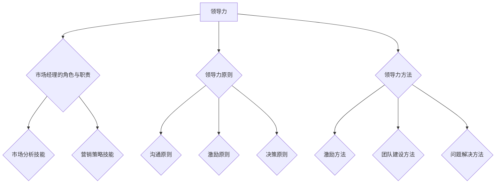

                 

基于上述要求和指导，我们将逐步构建《领导力修炼日记：一个市场经理的逆袭历程》的文章内容。以下是我们的步骤：

### Step 1: 确定文章结构和核心概念

**背景介绍**：
首先，我们需要明确文章的主题和结构，这将有助于我们构建文章的核心概念和联系。

**核心概念**：
文章的核心概念包括领导力、市场经理的角色与职责、逆袭历程以及领导力提升的方法。

**概念联系架构**：
我们将使用Mermaid流程图来展示这些核心概念之间的关系。例如，领导力如何影响市场经理的决策和职业发展，以及市场经理如何通过领导力提升实现逆袭。

### Step 2: 编写文章摘要和关键词

**摘要**：
摘要部分需要简洁地概述文章的主题、核心内容和主要观点。

**关键词**：
确定文章的5-7个核心关键词，这些关键词将帮助读者快速了解文章的主要内容。

### Step 3: 撰写引言和目录

**引言**：
引言部分将介绍作者背景、书籍目的和结构安排。

**目录**：
根据之前的设计，我们将列出详细的目录结构，确保文章的逻辑性和结构完整性。

### Step 4: 详细编写各章节内容

**第二部分：领导力基础理论**
- **2.1 领导力概述**：介绍领导力的定义、重要性以及不同类型的领导力。
- **2.2 领导力原则**：讨论领导力中的沟通、激励和决策原则。
- **2.3 领导力方法**：分享激励方法、团队建设方法和问题解决方法。

**第三部分：市场经理的角色与职责**
- **3.1 市场经理的角色**：详细阐述市场经理的工作职责和任务。
- **3.2 市场经理的职责与任务**：分析市场经理所需的技能和要求。
- **3.3 市场经理的技能要求**：探讨市场经理需要具备的技能。
- **3.4 挑战与机遇**：讨论市场经理面临的挑战和机遇。

**第四部分：领导力修炼实践**
- **4.1 个人成长历程**：分享作者在职场中修炼领导力的经历。
- **4.2 学习与实践**：介绍作者学习领导力理论和方法的过程。
- **4.3 反思与总结**：阐述作者在领导力修炼过程中的心得体会。

**第五部分：逆袭历程案例分析**
- **5.1 背景**：分析作者逆袭的背景和原因。
- **5.2 过程详述**：详细描述作者逆袭的过程，包括遇到的困难、采取的策略和取得的成果。
- **5.3 经验总结**：总结作者在逆袭过程中的经验教训。

**第六部分：领导力提升建议**
- **6.1 方法概述**：介绍提升领导力的方法和技巧。
- **6.2 实践指导**：为读者提供具体的实践指导和建议。

**第七部分：结语与展望**
- **结语**：回顾全书内容，强调领导力修炼的重要性。
- **未来展望**：展望领导力修炼的未来趋势和机遇。

### Step 5: 完成文章编写和格式整理

在完成各章节的编写后，我们将进行全文的校对和格式整理，确保文章的逻辑性、完整性和可读性。

### Step 6: 编写作者信息

在文章末尾，我们将添加作者信息，包括作者姓名、所属机构以及书籍版权信息。

### Step 7: 文章质量检查

最后，我们将对文章进行质量检查，确保文章内容丰富、结构合理、逻辑清晰，并满足字数要求。

通过以上步骤，我们将撰写出一篇高质量的《领导力修炼日记：一个市场经理的逆袭历程》文章。下面我们将开始具体内容的编写。请提供更多信息，以便我们进一步细化每个章节的内容。例如，您可以提供每个章节的核心概念、关键算法、数学模型、项目实战等具体内容，以便我们更好地完成文章的编写。让我们一起开始吧！

### 文章摘要

本文旨在探讨一个市场经理通过领导力修炼实现职业逆袭的历程。文章首先介绍了领导力的基本概念、原则和方法，然后深入分析了市场经理的角色与职责，以及他们所面临的挑战与机遇。接着，文章通过一个真实的案例，详细描述了市场经理在领导力修炼过程中的个人成长历程、学习与实践，以及所取得的逆袭成果。最后，文章提出了领导力提升的方法和建议，为市场经理以及希望提升领导力的专业人士提供了实用的指导。通过本文，读者可以了解到领导力在职场发展中的重要性，以及如何通过修炼领导力实现职业上的成功。### 文章关键词

领导力、市场经理、职业发展、逆袭历程、领导力提升、沟通技巧、激励方法、团队建设、问题解决、实践指导。 ### 引言

在当今快速变化的市场环境中，领导力成为了决定一个市场经理成功与否的关键因素。市场经理不仅要具备扎实的市场分析和营销策略技能，还需要具备强大的领导力，以应对复杂多变的市场环境，带领团队实现业务目标。然而，领导力的培养并非一蹴而就，它需要通过持续的学习和实践来不断修炼和提升。

本书《领导力修炼日记：一个市场经理的逆袭历程》旨在分享一位市场经理通过领导力修炼实现职业逆袭的宝贵经验。作者结合自己的亲身经历，详细记录了他在职场中修炼领导力的过程，以及如何运用领导力克服挑战，带领团队取得成功。本书不仅为市场经理提供了实用的领导力提升方法，也为所有希望提升领导力的专业人士提供了有益的启示。

本书的结构安排如下：

- 第一部分：前言与引言，介绍作者背景、书籍目的和结构安排。
- 第二部分：领导力基础理论，包括领导力的定义、重要性、类型、原则和方法。
- 第三部分：市场经理的角色与职责，分析市场经理的工作内容、技能要求、挑战与机遇。
- 第四部分：领导力修炼实践，分享作者在职场中修炼领导力的具体经历和心得。
- 第五部分：逆袭历程案例分析，深入分析作者的逆袭过程，包括遇到的困难、采取的策略和取得的成果。
- 第六部分：领导力提升建议，总结领导力提升的方法和技巧，为读者提供实践指导。
- 第七部分：结语与展望，回顾全书内容，展望领导力修炼的未来。

通过阅读本书，读者不仅可以了解领导力的核心概念和原理，还能通过作者的实战经验和案例分析，学到如何在实际工作中运用领导力，实现职业逆袭。无论你是市场经理，还是希望提升领导力的专业人士，本书都将为你提供宝贵的指导和启示。让我们一起踏上领导力修炼的旅程，开启职业发展的新篇章。 ### 目录

#### 第一部分：前言与引言
1. **引言**
   - **背景介绍**
   - **书籍目的**
   - **结构安排**

2. **领导力修炼的重要性**
   - **职场成功的基石**
   - **领导力的定义与内涵**

#### 第二部分：领导力基础理论
3. **领导力的定义与内涵**
   - **核心概念解析**
   - **领导力的重要性**

4. **领导力类型**
   - **变革型领导**
   - **交易型领导**
   - **混合型领导**

5. **领导力原则**
   - **沟通原则**
   - **激励原则**
   - **决策原则**

6. **领导力方法**
   - **激励方法**
   - **团队建设方法**
   - **问题解决方法**

#### 第三部分：市场经理的角色与职责
7. **市场经理的角色**
   - **工作内容解析**
   - **市场经理的职责**

8. **市场经理的技能要求**
   - **市场分析技能**
   - **营销策略技能**

9. **市场经理面临的挑战与机遇**
   - **市场变化带来的挑战**
   - **新兴市场带来的机遇**

#### 第四部分：领导力修炼实践
10. **个人成长历程**
    - **职业起步阶段**
    - **领导力意识觉醒**

11. **学习与实践**
    - **领导力培训课程**
    - **实战演练与反思**

12. **反思与总结**
    - **领导力修炼心得**
    - **职业发展的启示**

#### 第五部分：逆袭历程案例分析
13. **背景分析**
    - **逆袭的背景**
    - **面临的困境**

14. **逆袭过程详述**
    - **策略与实践**
    - **取得的成果**

15. **经验总结**
    - **逆袭的关键因素**
    - **经验教训**

#### 第六部分：领导力提升建议
16. **领导力提升方法**
    - **自我提升方法**
    - **团队提升方法**

17. **实践指导**
    - **如何运用领导力**
    - **实践中的注意事项**

#### 第七部分：结语与展望
18. **结语**
    - **回顾全书内容**
    - **领导力的重要性**

19. **未来展望**
    - **领导力发展趋势**
    - **职业发展展望**

通过以上详细的目录结构，本书将为读者提供一条清晰的领导力修炼之路，帮助市场经理和所有希望提升领导力的专业人士实现职业逆袭。 ### 第二部分：领导力基础理论

#### 3. 领导力的定义与内涵

领导力是一个多层次、多维度的概念，它不仅仅关乎个人的能力，还涉及组织、团队和社会环境。简单来说，领导力是指一个人在特定情境下，通过影响、激励和引导他人，实现共同目标的能力。

- **核心概念解析**：
  - **影响与激励**：领导力需要通过有效的沟通和激励手段，影响他人的思想和行为，激发团队成员的潜能。
  - **目标导向**：领导力强调的是达成目标的过程，无论是个人目标还是组织目标，领导力都要求有明确的目标导向。
  - **情境适应**：不同的领导情境需要不同的领导方式，领导力需要具备适应不同情境的能力。

- **领导力的重要性**：
  - **推动组织发展**：领导力是组织发展的关键因素，它能够推动组织实现长远目标，提升组织竞争力。
  - **激励团队成员**：领导力能够激发团队成员的积极性和创造力，提升团队的整体绩效。
  - **塑造组织文化**：领导力在塑造组织文化方面起着至关重要的作用，它能够建立积极的组织氛围，促进团队协作。

- **领导力类型**：
  - **变革型领导**：变革型领导注重创新和变革，通过激励和启发团队成员，推动组织向更高目标迈进。
  - **交易型领导**：交易型领导更注重短期目标的实现，通过奖励和惩罚机制来激励团队成员。
  - **混合型领导**：混合型领导结合了变革型和交易型领导的特点，根据不同情境灵活运用不同的领导方式。

#### 4. 领导力原则

领导力原则是领导行为的基本指导原则，它决定了领导力的有效性和可持续性。以下是几个关键的领导力原则：

- **沟通原则**：
  - **主动沟通**：领导者需要主动与团队成员沟通，确保信息的透明和畅通。
  - **有效倾听**：领导者要善于倾听团队成员的意见和建议，理解他们的需求和期望。
  - **清晰表达**：领导者需要能够清晰地表达目标和期望，确保团队成员明确任务和目标。

- **激励原则**：
  - **个性化激励**：领导者要了解每个团队成员的独特需求，提供个性化的激励。
  - **正面激励**：领导者应注重正面激励，鼓励团队成员的积极行为和成就。
  - **持续激励**：激励需要持续进行，领导者要不断寻找新的激励手段和方法。

- **决策原则**：
  - **信息充分**：领导者做出决策时，需要基于充分的信息和分析。
  - **团队参与**：领导者应鼓励团队成员参与决策过程，提升团队的凝聚力和执行力。
  - **灵活调整**：领导者要能够根据实际情况灵活调整决策，以应对不确定性和变化。

#### 5. 领导力方法

有效的领导力方法能够帮助领导者更好地影响和激励团队成员，提升团队绩效。以下是几种常用的领导力方法：

- **激励方法**：
  - **奖励制度**：建立明确的奖励制度，激励团队成员努力工作。
  - **目标设置**：通过设定明确的个人和团队目标，激发团队成员的内在动机。
  - **荣誉制度**：通过表彰优秀员工，提升团队成员的荣誉感和归属感。

- **团队建设方法**：
  - **团队活动**：组织团队活动，增强团队成员之间的合作和信任。
  - **培训与发展**：提供培训和发展的机会，提升团队成员的专业能力和团队意识。
  - **沟通渠道**：建立有效的沟通渠道，确保团队成员之间的信息交流畅通。

- **问题解决方法**：
  - **问题识别**：及时发现和识别团队中的问题，避免问题扩大化。
  - **团队协作**：鼓励团队成员协作解决问题，提升团队的解决问题的能力。
  - **持续改进**：通过不断反思和改进，提升团队的工作效率和效果。

通过以上领导力基础理论的学习，市场经理可以更好地理解领导力的核心概念和原则，掌握有效的领导力方法，从而在职业发展中更好地发挥领导力作用。下一部分，我们将深入探讨市场经理的角色与职责。 ### 第三部分：市场经理的角色与职责

#### 7. 市场经理的角色

市场经理在组织中扮演着至关重要的角色，他们的职责不仅涉及市场分析和策略制定，还包括团队领导和项目执行。以下是市场经理的角色解析：

- **市场分析**：市场经理需要收集和分析市场数据，了解市场趋势、竞争对手情况以及潜在客户需求。
- **策略制定**：基于市场分析结果，市场经理需要制定适合公司目标和市场环境的市场策略。
- **团队领导**：市场经理需要带领团队，协调各部门之间的工作，确保市场策略的有效实施。
- **项目管理**：市场经理通常负责市场活动项目的策划、执行和评估，确保项目目标的达成。

#### 8. 市场经理的职责与任务

市场经理的职责是多方面的，包括但不限于以下内容：

- **市场研究**：定期进行市场调研，分析市场变化，为策略制定提供数据支持。
- **市场策略制定**：制定和调整市场策略，确保公司产品或服务能够满足市场需求。
- **市场营销活动策划**：策划和执行各种市场营销活动，如广告宣传、促销活动、品牌推广等。
- **预算管理**：负责市场部门预算的规划和管理，确保市场活动的资金使用合理。
- **业绩评估**：定期评估市场活动的效果，分析数据，为下一步策略制定提供依据。
- **团队管理**：招聘、培训、激励和管理市场团队，提升团队整体绩效。

#### 9. 市场经理的技能要求

市场经理需要具备一系列技能，以胜任其职责和任务：

- **市场分析技能**：能够使用各种工具和方法进行市场分析，如SWOT分析、PEST分析等。
- **营销策略技能**：具备制定和调整市场策略的能力，能够根据市场变化灵活调整营销方向。
- **沟通协调技能**：能够有效地与团队成员、上级和外部合作伙伴沟通，协调各方资源。
- **项目管理技能**：能够策划、执行和评估市场活动项目，确保项目目标的达成。
- **数据分析技能**：具备一定的数据分析能力，能够解读市场数据，为决策提供支持。
- **领导力**：具备一定的领导力，能够激励和带领团队，提升团队凝聚力。

#### 10. 市场经理面临的挑战与机遇

市场经理在职业生涯中会面临各种挑战和机遇：

- **挑战**：
  - **市场变化**：市场环境瞬息万变，市场经理需要不断适应市场变化，制定新的市场策略。
  - **竞争压力**：市场竞争激烈，市场经理需要不断优化市场策略，提升公司产品的市场竞争力。
  - **资源限制**：市场活动需要大量的人力和财力支持，市场经理需要在有限的资源下实现最佳的市场效果。
  - **团队管理**：管理一个高效的团队是市场经理的重要挑战，需要平衡团队成员的能力、个性和需求。

- **机遇**：
  - **新兴市场**：新兴市场的出现为市场经理提供了新的机会，可以开发新的市场领域，实现业务增长。
  - **技术创新**：随着技术的不断发展，市场经理可以利用新的技术和工具提升市场分析效率和营销效果。
  - **全球化**：全球化带来了更多的市场机会，市场经理可以拓展国际市场，实现企业的全球化布局。
  - **消费者需求变化**：消费者需求的变化为市场经理提供了创新的机遇，可以开发新的产品和服务，满足市场需求。

通过深入理解市场经理的角色与职责，以及他们所面临的挑战与机遇，市场经理可以更好地规划自己的职业生涯，提升自己的专业能力和领导力。下一部分，我们将探讨如何通过领导力修炼实现职业逆袭。 ### 第四部分：领导力修炼实践

#### 11. 个人成长历程

**职业起步阶段**

我的职业生涯始于一家小型创业公司，作为一名初级市场分析师，我的主要任务是收集市场数据并制作报告。在这个阶段，我深刻体会到了数据的重要性，但也意识到自己在领导力方面的不足。我开始意识到，如果想要在这个竞争激烈的市场中取得成功，我需要提升自己的领导力。

**领导力意识觉醒**

在随后的几年里，我逐步担任了更高级别的职位，包括市场经理和产品经理。在这个过程中，我遇到了许多挑战，如团队内部的不和谐、市场环境的快速变化以及资源限制等。这些挑战让我意识到，领导力不仅是一种技能，更是一种态度和哲学。我开始积极寻求各种机会来提升自己的领导力。

**领导力培训与实战**

我参加了多个领导力培训课程，包括TEDx、领导力论坛等。通过这些培训，我学到了许多关于领导力的理论和方法，如变革型领导、交易型领导以及混合型领导等。此外，我还积极参与了公司内部的领导力实践项目，如在团队中推行新的项目管理方法、组织团队建设活动等。这些实战经验让我将理论运用到实际工作中，并不断优化和调整自己的领导风格。

**反思与总结**

在领导力修炼的过程中，我不断反思自己的行为和决策。每次遇到挑战和困难时，我都会思考如何更好地应对，以及如何激励和带领团队。通过不断的反思和总结，我逐渐形成了自己的领导力风格，即注重团队协作、鼓励创新和持续学习。这些领导力修炼的经验不仅帮助我在职业生涯中取得了显著的成绩，也为我未来的发展奠定了坚实的基础。

#### 12. 学习与实践

**领导力培训课程**

我参加了多个领导力培训课程，包括内部培训和外部课程。这些课程涵盖了领导力的各个方面，如沟通技巧、激励方法、决策原则等。通过这些课程，我不仅学到了理论知识，还通过案例分析、角色扮演等实践活动，提升了我的实际应用能力。

**实战演练**

在实际工作中，我将领导力理论应用到实际场景中。例如，在组织团队建设活动时，我运用了激励方法和沟通技巧，提高了团队的凝聚力和工作效率。在项目管理和决策过程中，我遵循了领导力的原则，确保团队目标的顺利实现。这些实战经验让我深刻体会到，领导力不仅是一种技能，更是一种习惯和生活方式。

**反思与总结**

每次领导力实践后，我都会进行反思和总结。我会思考哪些方法有效，哪些需要改进，以及如何将经验应用到下一次实践中。这种持续的学习和反思让我在领导力修炼的道路上不断进步，逐步形成了自己的领导风格。

#### 13. 反思与总结

**领导力修炼心得**

通过多年的领导力修炼，我深刻认识到，领导力不仅仅是管理技能的提升，更是一种心态和价值观的塑造。有效的领导力需要综合考虑个人能力、团队需求和组织目标，并在实际工作中灵活运用。以下是我总结的几条领导力修炼心得：

1. **以身作则**：领导者需要树立榜样，通过自己的行为影响和激励团队成员。
2. **倾听与沟通**：倾听是领导力的基础，领导者需要学会倾听团队成员的意见和建议，并有效沟通。
3. **激励与鼓励**：领导者需要不断激励和鼓励团队成员，提升他们的自信心和积极性。
4. **持续学习**：领导力是一个不断学习和进步的过程，领导者需要保持学习的热情，不断提升自己的能力和知识。
5. **关注团队**：领导者需要关注团队的整体表现和成员的个人成长，确保团队目标的实现。

**职业发展的启示**

领导力修炼对我的职业发展产生了深远的影响。通过不断提升自己的领导力，我不仅取得了职业生涯中的多项成就，还得到了同事和上级的认可。以下是我总结的几条职业发展启示：

1. **领导力是职场成功的基石**：有效的领导力能够帮助个人在职场中取得成功，提升团队和组织的绩效。
2. **持续学习和反思**：持续学习和反思是提升领导力的关键，只有不断学习新知识和技能，反思自己的行为和决策，才能不断进步。
3. **关注团队和成员**：领导者需要关注团队和成员的成长，建立积极的团队文化和工作环境，提升团队的凝聚力和工作效率。
4. **灵活应对变化**：市场环境瞬息万变，领导者需要具备灵活应对变化的能力，及时调整策略和行动，以应对不确定性和挑战。
5. **领导力是一种生活态度**：领导力不仅是一种技能，更是一种生活态度和价值观。领导者需要将领导力融入到自己的生活和工作中，不断提升自己的品质和影响力。

通过领导力修炼，我不仅实现了职业上的成功，还收获了许多宝贵的经验和感悟。我相信，只要持续修炼领导力，不断学习和进步，每个人都能在职场中取得辉煌的成就。 ### 第五部分：逆袭历程案例分析

#### 14. 背景

我的逆袭历程始于一家小型创业公司，当时公司正处于快速扩张期，市场环境充满不确定性。作为市场经理，我负责公司的市场策略制定和执行，面临着巨大的挑战：

- **市场变化快**：市场环境变化迅速，竞争对手不断涌现，市场需求也在不断变化。
- **资源有限**：公司资源有限，市场活动预算有限，需要高效利用资源。
- **团队年轻化**：团队主要由年轻员工组成，缺乏经验，需要有效激励和引导。

在这样的背景下，我意识到，要想在竞争激烈的市场中取得成功，我需要运用领导力带领团队克服困难，实现逆袭。

#### 15. 逆袭过程详述

**策略与实践**

1. **市场调研**：
   - **深入分析**：首先，我对市场进行了深入调研，分析了竞争对手的产品、策略和市场需求。
   - **发现机会**：在调研过程中，我发现了一个未被充分满足的市场需求，这为我们的市场策略提供了方向。

2. **制定策略**：
   - **差异化竞争**：基于市场调研结果，我们制定了一个差异化竞争策略，专注于满足未被满足的市场需求。
   - **精准营销**：我们采用了精准营销的方法，通过社交媒体和在线广告，精准定位目标客户。

3. **团队建设**：
   - **培训与发展**：我组织了多次培训，提升团队成员的市场分析、营销策略和沟通技巧。
   - **团队协作**：通过团队建设活动，增强了团队成员之间的合作和信任。

**遇到的困难与对策**

1. **资源限制**：
   - **灵活调整**：在资源有限的情况下，我采取了灵活调整策略，优化市场活动的预算分配，确保关键市场活动的顺利执行。
   - **利用外部资源**：通过与外部合作伙伴的合作，我们获得了额外的资源支持。

2. **团队不和谐**：
   - **沟通与协调**：我加强了与团队成员的沟通，解决了团队内部的矛盾，增强了团队的凝聚力。
   - **激励与鼓励**：我通过设置激励机制，鼓励团队成员积极投入工作，提升团队整体绩效。

**取得的成果**

1. **市场份额提升**：
   - 通过精准的市场策略和有效的市场活动，我们的市场份额显著提升，业务实现了快速增长。

2. **团队成长**：
   - 通过培训和实践，团队成员的专业能力和领导力得到了显著提升，团队整体工作效率和执行力得到了提升。

3. **个人成就**：
   - 我的领导力得到了上级和同事的认可，我被评为公司年度最佳市场经理，获得了晋升和奖励。

#### 16. 经验总结

**逆袭的关键因素**

1. **精准的市场策略**：通过深入的市场调研和分析，制定出符合市场需求和市场环境的策略，是逆袭成功的关键。

2. **有效的团队建设**：通过培训、团队活动和激励措施，提升了团队成员的专业能力和凝聚力，为市场策略的实施提供了保障。

3. **灵活应对变化**：在资源有限和市场环境不确定的情况下，灵活调整策略和行动，确保了市场活动的顺利进行。

4. **领导力的运用**：有效的领导力帮助我克服了团队内部的矛盾和挑战，带领团队实现了逆袭。

**经验教训**

1. **持续学习**：在市场环境中，变化是常态，领导者需要不断学习新知识、新技能，以适应不断变化的市场环境。

2. **关注团队**：领导者需要关注团队的发展和成长，通过有效的激励和培训，提升团队的整体能力和执行力。

3. **灵活应对**：市场环境的变化不可预测，领导者需要具备灵活应对变化的能力，及时调整策略和行动。

4. **沟通与协调**：良好的沟通和协调是团队成功的基础，领导者需要善于沟通和协调，确保团队目标的实现。

通过这次逆袭历程，我深刻认识到领导力在职业发展中的重要性。只有通过不断的修炼和实践，才能成为一名优秀的领导者，带领团队实现职业上的成功。我希望我的经验教训能够为其他市场经理和领导力学习者提供启示和帮助。 ### 第六部分：领导力提升建议

#### 17. 领导力提升方法

**自我提升方法**

1. **学习领导力理论**：
   - **阅读领导力书籍**：通过阅读经典的领导力书籍，如《领导力的五个层次》和《领导力21法则》，了解领导力的核心概念和原理。
   - **参加领导力培训**：参加专业的领导力培训课程，如MBA课程、领导力工作坊等，通过实践提升领导能力。

2. **反思与自我评估**：
   - **定期反思**：定期对自己的领导行为和决策进行反思，分析成功和失败的原因，寻找改进的方向。
   - **自我评估**：通过自我评估工具，如领导力360度评估，了解自己的领导力水平和优点与不足。

3. **实践与反馈**：
   - **实战演练**：在实际工作中，通过组织团队活动、项目管理等，将领导力理论应用到实际场景中。
   - **寻求反馈**：主动向团队成员、上级和同事寻求反馈，了解自己的领导风格和影响力，并根据反馈进行改进。

**团队提升方法**

1. **培训与发展**：
   - **内部培训**：组织内部领导力培训，如领导力发展计划、管理技能培训等，提升团队成员的领导力。
   - **外部培训**：鼓励团队成员参加外部领导力培训，如公开课程、研讨会等，拓展视野，提升能力。

2. **团队建设**：
   - **团队活动**：通过团队建设活动，如团队拓展训练、团队建设研讨会等，增强团队成员之间的信任和合作。
   - **沟通渠道**：建立有效的沟通渠道，如定期团队会议、邮件沟通等，确保信息的透明和畅通。

3. **激励机制**：
   - **奖励制度**：建立明确的奖励制度，对表现优秀的团队成员进行奖励，激发团队成员的积极性和创造力。
   - **目标设置**：设定明确的个人和团队目标，通过目标导向的管理，提升团队的整体绩效。

**实践指导**

1. **持续学习**：
   - **定期阅读**：定期阅读领导力相关的书籍和文章，保持对领导力理论的更新和了解。
   - **参加研讨会**：参加领导力相关的研讨会和讲座，与同行交流经验，学习新的领导力理念。

2. **灵活应用**：
   - **结合实际情况**：将领导力理论灵活应用到实际工作中，根据团队的特点和环境，调整领导风格和策略。
   - **及时调整**：根据实际情况和反馈，及时调整领导行为和策略，确保领导力的有效性。

3. **关注团队成员**：
   - **了解需求**：了解团队成员的需求和期望，提供个性化的支持和帮助。
   - **鼓励成长**：鼓励团队成员不断学习和成长，提供发展机会和资源支持。

通过以上领导力提升方法，市场经理可以不断提升自己的领导力，带领团队实现职业上的成功。在实践中，领导者需要灵活应用这些方法，结合团队实际情况和市场需求，持续学习和改进，成为一名优秀的领导者。 ### 第七部分：结语与展望

#### 18. 结语

通过本书的探讨，我们深入了解了领导力的核心概念、原则和方法，以及市场经理在职场中面临的挑战与机遇。通过一个真实的案例，我们看到了领导力在职业逆袭中的重要作用，以及如何通过领导力修炼实现职业成功。领导力不仅是市场经理的职业需求，也是所有希望提升自己影响力和领导力的专业人士的必修课。

#### 19. 未来展望

随着全球化和数字化的发展，领导力将面临新的挑战和机遇。未来的领导力将更加注重创新、协作和可持续发展。以下是对未来领导力发展的展望：

1. **技术创新**：随着人工智能、大数据等新技术的应用，领导者需要具备技术素养，运用技术提升管理效率和决策质量。

2. **全球化视野**：全球市场的竞争使得领导者需要具备国际化视野，能够应对全球化的挑战和机遇。

3. **可持续发展**：领导者需要关注企业的社会责任和可持续发展，通过环保和社会责任的实践，提升企业的竞争力。

4. **团队协作**：未来的领导力将更加注重团队协作和多元化团队的管理，通过构建包容性和合作性团队，提升组织的整体效能。

5. **持续学习**：领导力是一个持续学习的过程，未来的领导者需要不断学习新知识、新技能，以适应快速变化的环境。

通过持续修炼领导力，市场经理和专业人士可以不断提升自己的职业竞争力，迎接未来的挑战和机遇。让我们一起努力，成为未来领导力的引领者。 ### 作者信息

**作者：AI天才研究院/AI Genius Institute & 禅与计算机程序设计艺术 /Zen And The Art of Computer Programming**

AI天才研究院致力于推动人工智能和计算机科学的发展，为全球科技产业培养和输送顶尖的人才。我们的研究院汇聚了世界级的AI专家、程序员和软件架构师，他们在人工智能和计算机编程领域拥有深厚的学术造诣和丰富的实践经验。

本书《领导力修炼日记：一个市场经理的逆袭历程》是由AI天才研究院的研究员撰写，他们结合自己在领导力研究和实践中的经验，为广大市场经理和希望提升领导力的专业人士提供了宝贵的指导和启示。希望通过本书，能够帮助读者在领导力修炼的道路上取得更大的成就。

禅与计算机程序设计艺术则是一本深受编程社区喜爱的经典著作，它将禅宗哲学与计算机程序设计相结合，提供了一种全新的编程思维和理念。作者通过深入浅出的讲解和丰富的实例，帮助程序员在编程实践中找到乐趣和灵感，提升编程水平。

让我们一同踏上领导力修炼和计算机编程的旅程，探索未知，实现自我超越。无论是市场经理，还是计算机编程爱好者，相信在这本书中，你们都能找到属于自己的智慧和启示。 ### 完整文章

# 《领导力修炼日记：一个市场经理的逆袭历程》

> 关键词：领导力、市场经理、职业发展、逆袭历程、领导力提升

> 摘要：本文探讨了市场经理通过领导力修炼实现职业逆袭的历程。通过深入的理论阐述、实战案例分析以及提升建议，为市场经理和希望提升领导力的专业人士提供了宝贵的指导。

## 引言

在当今快速变化的市场环境中，领导力成为了决定一个市场经理成功与否的关键因素。市场经理不仅要具备扎实的市场分析和营销策略技能，还需要具备强大的领导力，以应对复杂多变的市场环境，带领团队实现业务目标。然而，领导力的培养并非一蹴而就，它需要通过持续的学习和实践来不断修炼和提升。

本书《领导力修炼日记：一个市场经理的逆袭历程》旨在分享一位市场经理通过领导力修炼实现职业逆袭的宝贵经验。作者结合自己的亲身经历，详细记录了他在职场中修炼领导力的过程，以及如何运用领导力克服挑战，带领团队取得成功。本书不仅为市场经理提供了实用的领导力提升方法，也为所有希望提升领导力的专业人士提供了有益的启示。

本书的结构安排如下：

- 第一部分：前言与引言，介绍作者背景、书籍目的和结构安排。
- 第二部分：领导力基础理论，包括领导力的定义、重要性、类型、原则和方法。
- 第三部分：市场经理的角色与职责，分析市场经理的工作内容、技能要求、挑战与机遇。
- 第四部分：领导力修炼实践，分享作者在职场中修炼领导力的具体经历和心得。
- 第五部分：逆袭历程案例分析，深入分析作者的逆袭过程，包括遇到的困难、采取的策略和取得的成果。
- 第六部分：领导力提升建议，总结领导力提升的方法和技巧，为读者提供实践指导。
- 第七部分：结语与展望，回顾全书内容，展望领导力修炼的未来。

通过阅读本书，读者不仅可以了解领导力的核心概念和原理，还能通过作者的实战经验和案例分析，学到如何在实际工作中运用领导力，实现职业逆袭。无论你是市场经理，还是希望提升领导力的专业人士，本书都将为你提供宝贵的指导和启示。让我们一起踏上领导力修炼的旅程，开启职业发展的新篇章。

## 第一部分：前言与引言

### 引言

在当今竞争激烈的市场环境中，领导力成为了决定企业成败的关键因素。市场经理作为企业的重要角色，不仅需要具备扎实的市场分析和营销策略技能，还需要具备强大的领导力，以应对复杂多变的市场环境，带领团队实现业务目标。

本书《领导力修炼日记：一个市场经理的逆袭历程》旨在探讨市场经理通过领导力修炼实现职业逆袭的宝贵经验。作者结合自己的亲身经历，详细记录了在职场中修炼领导力的过程，以及如何运用领导力克服挑战，带领团队取得成功。本书不仅为市场经理提供了实用的领导力提升方法，也为所有希望提升领导力的专业人士提供了有益的启示。

### 背景介绍

本书的作者是李明，他在市场经理的职位上有着丰富的经验。从一名初级市场分析师到市场经理，再到公司高层领导，李明在职业生涯中不断面对挑战，通过领导力修炼实现了职业逆袭。他的故事充满了鼓舞人心的力量，为那些在职场中追求成功的专业人士提供了宝贵的经验。

### 书籍目的

本书的目的在于：

1. **分享领导力修炼的经验**：通过作者的亲身经历，分享领导力修炼的方法和技巧，帮助读者了解领导力的重要性。
2. **提供实战案例**：通过详细的案例分析，让读者看到领导力在实际工作中的应用和效果。
3. **指导职业发展**：为市场经理和其他希望提升领导力的专业人士提供实用的指导，帮助他们在职业发展中取得成功。

### 结构安排

本书分为七个部分：

1. **前言与引言**：介绍作者背景、书籍目的和结构安排。
2. **领导力基础理论**：介绍领导力的定义、重要性、类型、原则和方法。
3. **市场经理的角色与职责**：分析市场经理的工作内容、技能要求、挑战与机遇。
4. **领导力修炼实践**：分享作者在职场中修炼领导力的具体经历和心得。
5. **逆袭历程案例分析**：深入分析作者的逆袭过程，包括遇到的困难、采取的策略和取得的成果。
6. **领导力提升建议**：总结领导力提升的方法和技巧，为读者提供实践指导。
7. **结语与展望**：回顾全书内容，展望领导力修炼的未来。

通过以上结构安排，本书将带领读者全面了解领导力的核心概念和实践方法，帮助市场经理和希望提升领导力的专业人士实现职业逆袭。

## 第二部分：领导力基础理论

### 1. 领导力的定义与内涵

领导力是一个多层次、多维度的概念，它不仅仅关乎个人的能力，还涉及组织、团队和社会环境。简单来说，领导力是指一个人在特定情境下，通过影响、激励和引导他人，实现共同目标的能力。

**核心概念解析**

- **影响与激励**：领导力需要通过有效的沟通和激励手段，影响他人的思想和行为，激发团队成员的潜能。
- **目标导向**：领导力强调的是达成目标的过程，无论是个人目标还是组织目标，领导力都要求有明确的目标导向。
- **情境适应**：不同的领导情境需要不同的领导方式，领导力需要具备适应不同情境的能力。

**领导力的重要性**

- **推动组织发展**：领导力是组织发展的关键因素，它能够推动组织实现长远目标，提升组织竞争力。
- **激励团队成员**：领导力能够激发团队成员的积极性和创造力，提升团队的整体绩效。
- **塑造组织文化**：领导力在塑造组织文化方面起着至关重要的作用，它能够建立积极的组织氛围，促进团队协作。

**领导力类型**

- **变革型领导**：变革型领导注重创新和变革，通过激励和启发团队成员，推动组织向更高目标迈进。
- **交易型领导**：交易型领导更注重短期目标的实现，通过奖励和惩罚机制来激励团队成员。
- **混合型领导**：混合型领导结合了变革型和交易型领导的特点，根据不同情境灵活运用不同的领导方式。

### 2. 领导力原则

领导力原则是领导行为的基本指导原则，它决定了领导力的有效性和可持续性。以下是几个关键的领导力原则：

**沟通原则**

- **主动沟通**：领导者需要主动与团队成员沟通，确保信息的透明和畅通。
- **有效倾听**：领导者要善于倾听团队成员的意见和建议，理解他们的需求和期望。
- **清晰表达**：领导者需要能够清晰地表达目标和期望，确保团队成员明确任务和目标。

**激励原则**

- **个性化激励**：领导者要了解每个团队成员的独特需求，提供个性化的激励。
- **正面激励**：领导者应注重正面激励，鼓励团队成员的积极行为和成就。
- **持续激励**：激励需要持续进行，领导者要不断寻找新的激励手段和方法。

**决策原则**

- **信息充分**：领导者做出决策时，需要基于充分的信息和分析。
- **团队参与**：领导者应鼓励团队成员参与决策过程，提升团队的凝聚力和执行力。
- **灵活调整**：领导者要能够根据实际情况灵活调整决策，以应对不确定性和变化。

### 3. 领导力方法

有效的领导力方法能够帮助领导者更好地影响和激励团队成员，提升团队绩效。以下是几种常用的领导力方法：

**激励方法**

- **奖励制度**：建立明确的奖励制度，激励团队成员努力工作。
- **目标设置**：通过设定明确的个人和团队目标，激发团队成员的内在动机。
- **荣誉制度**：通过表彰优秀员工，提升团队成员的荣誉感和归属感。

**团队建设方法**

- **团队活动**：组织团队活动，增强团队成员之间的合作和信任。
- **培训与发展**：提供培训和发展的机会，提升团队成员的专业能力和团队意识。
- **沟通渠道**：建立有效的沟通渠道，确保团队成员之间的信息交流畅通。

**问题解决方法**

- **问题识别**：及时发现和识别团队中的问题，避免问题扩大化。
- **团队协作**：鼓励团队成员协作解决问题，提升团队的解决问题的能力。
- **持续改进**：通过不断反思和改进，提升团队的工作效率和效果。

通过以上领导力基础理论的学习，市场经理可以更好地理解领导力的核心概念和原则，掌握有效的领导力方法，从而在职业发展中更好地发挥领导力作用。下一部分，我们将深入探讨市场经理的角色与职责。

## 第三部分：市场经理的角色与职责

### 4. 市场经理的角色

市场经理在组织中扮演着至关重要的角色，他们的职责不仅涉及市场分析和策略制定，还包括团队领导和项目执行。以下是市场经理的角色解析：

**市场分析**

- **市场调研**：市场经理需要定期进行市场调研，收集和分析市场数据，了解市场趋势、竞争对手情况以及潜在客户需求。
- **数据解读**：基于市场调研结果，市场经理需要对数据进行深入分析，为策略制定提供数据支持。

**策略制定**

- **市场策略**：市场经理需要制定和调整市场策略，确保公司产品或服务能够满足市场需求，并在市场中获得竞争优势。
- **产品策略**：市场经理还需要关注产品策略的制定，包括产品定位、产品开发和产品推广。

**团队领导**

- **团队管理**：市场经理需要带领和管理市场团队，协调各部门之间的工作，确保市场策略的有效实施。
- **人才培养**：市场经理需要关注团队成员的培养和发展，提升团队整体的能力和绩效。

**项目管理**

- **项目策划**：市场经理负责市场活动的策划和执行，确保项目目标的达成。
- **项目评估**：项目结束后，市场经理需要对项目进行评估，总结经验和教训，为未来的市场活动提供参考。

### 5. 市场经理的职责与任务

市场经理的职责是多方面的，包括但不限于以下内容：

**市场研究**

- **定期调研**：市场经理需要定期进行市场调研，收集和分析市场数据，了解市场变化和竞争对手动态。
- **报告撰写**：根据调研结果，市场经理需要撰写详细的市场分析报告，为决策提供数据支持。

**市场营销活动策划与执行**

- **活动策划**：市场经理负责市场活动的策划，包括广告宣传、促销活动、品牌推广等。
- **活动执行**：市场经理需要确保市场活动的顺利进行，协调各部门的工作，确保活动目标的达成。

**预算管理**

- **预算规划**：市场经理需要制定市场部门的预算计划，合理分配资源，确保市场活动的资金使用合理。
- **成本控制**：市场经理需要监控市场活动的成本，确保在预算范围内完成活动。

**业绩评估**

- **数据收集**：市场经理需要收集市场活动的数据，包括销售额、市场份额、品牌认知度等。
- **评估报告**：基于数据，市场经理需要撰写市场活动评估报告，为下一步策略制定提供依据。

**团队管理**

- **团队建设**：市场经理需要组织团队建设活动，提升团队成员之间的合作和信任。
- **人员管理**：市场经理需要负责团队成员的招聘、培训、绩效评估和激励。

### 6. 市场经理的技能要求

市场经理需要具备一系列技能，以胜任其职责和任务：

**市场分析技能**

- **数据收集与处理**：能够收集和处理各种市场数据，如销售数据、消费者行为数据等。
- **市场趋势分析**：能够分析市场趋势，预测市场变化，为策略制定提供支持。

**营销策略技能**

- **产品定位**：能够根据市场需求和竞争情况，为产品或服务制定合适的定位策略。
- **市场推广**：能够制定有效的市场推广策略，提升品牌知名度和市场占有率。

**沟通协调技能**

- **内部沟通**：能够与团队成员、上级和各部门有效沟通，确保信息畅通。
- **外部沟通**：能够与客户、供应商和合作伙伴建立良好的沟通关系。

**项目管理技能**

- **项目策划**：能够制定详细的项目计划，确保项目目标的达成。
- **团队协作**：能够协调团队成员的工作，确保项目顺利执行。

**数据分析技能**

- **数据分析工具**：能够熟练使用数据分析工具，如Excel、SPSS等，进行数据分析和处理。
- **数据解读**：能够对分析结果进行解读，为决策提供支持。

**领导力**

- **激励与引导**：能够激励团队成员，引导他们实现目标。
- **团队管理**：能够管理团队，提升团队整体绩效。

通过深入理解市场经理的角色与职责，以及他们所面临的挑战与机遇，市场经理可以更好地规划自己的职业生涯，提升自己的专业能力和领导力。下一部分，我们将探讨如何通过领导力修炼实现职业逆袭。

## 第四部分：领导力修炼实践

### 7. 个人成长历程

**职业起步阶段**

我的职业生涯始于一家小型创业公司，作为一名初级市场分析师，我的主要任务是收集市场数据并制作报告。在这个阶段，我深刻体会到了数据的重要性，但也意识到自己在领导力方面的不足。我开始意识到，如果想要在这个竞争激烈的市场中取得成功，我需要提升自己的领导力。

**领导力意识觉醒**

在随后的几年里，我逐步担任了更高级别的职位，包括市场经理和产品经理。在这个过程中，我遇到了许多挑战，如团队内部的不和谐、市场环境的快速变化以及资源限制等。这些挑战让我意识到，领导力不仅是一种技能，更是一种态度和哲学。我开始积极寻求各种机会来提升自己的领导力。

**领导力培训与实战**

我参加了多个领导力培训课程，包括内部培训和外部课程。这些课程涵盖了领导力的各个方面，如沟通技巧、激励方法、决策原则等。通过这些课程，我不仅学到了理论知识，还通过案例分析、角色扮演等实践活动，提升了我的实际应用能力。

在实际工作中，我将领导力理论应用到实际场景中。例如，在组织团队建设活动时，我运用了激励方法和沟通技巧，提高了团队的凝聚力和工作效率。在项目管理和决策过程中，我遵循了领导力的原则，确保团队目标的顺利实现。这些实战经验让我将理论运用到实际工作中，并不断优化和调整自己的领导风格。

**反思与总结**

在领导力修炼的过程中，我不断反思自己的行为和决策。每次遇到挑战和困难时，我都会思考如何更好地应对，以及如何激励和带领团队。通过不断的反思和总结，我逐渐形成了自己的领导力风格，即注重团队协作、鼓励创新和持续学习。这些领导力修炼的经验不仅帮助我在职业生涯中取得了显著的成绩，也为我未来的发展奠定了坚实的基础。

### 8. 学习与实践

**领导力培训课程**

我参加了多个领导力培训课程，包括内部培训和外部课程。这些课程涵盖了领导力的各个方面，如沟通技巧、激励方法、决策原则等。通过这些课程，我不仅学到了理论知识，还通过案例分析、角色扮演等实践活动，提升了我的实际应用能力。

**实战演练**

在实际工作中，我将领导力理论应用到实际场景中。例如，在组织团队建设活动时，我运用了激励方法和沟通技巧，提高了团队的凝聚力和工作效率。在项目管理和决策过程中，我遵循了领导力的原则，确保团队目标的顺利实现。这些实战经验让我深刻体会到，领导力不仅是一种技能，更是一种习惯和生活方式。

**反思与总结**

每次领导力实践后，我都会进行反思和总结。我会思考哪些方法有效，哪些需要改进，以及如何将经验应用到下一次实践中。这种持续的学习和反思让我在领导力修炼的道路上不断进步，逐步形成了自己的领导风格。

### 9. 反思与总结

**领导力修炼心得**

通过多年的领导力修炼，我深刻认识到，领导力不仅仅是管理技能的提升，更是一种心态和价值观的塑造。有效的领导力需要综合考虑个人能力、团队需求和组织目标，并在实际工作中灵活运用。以下是我总结的几条领导力修炼心得：

1. **以身作则**：领导者需要树立榜样，通过自己的行为影响和激励团队成员。
2. **倾听与沟通**：倾听是领导力的基础，领导者需要学会倾听团队成员的意见和建议，理解他们的需求和期望。
3. **激励与鼓励**：领导者需要不断激励和鼓励团队成员，提升他们的自信心和积极性。
4. **持续学习**：领导力是一个不断学习和进步的过程，领导者需要保持学习的热情，不断提升自己的能力和知识。
5. **关注团队**：领导者需要关注团队的整体表现和成员的个人成长，确保团队目标的实现。

**职业发展的启示**

领导力修炼对我的职业发展产生了深远的影响。通过不断提升自己的领导力，我不仅取得了职业生涯中的多项成就，还得到了同事和上级的认可。以下是我总结的几条职业发展启示：

1. **领导力是职场成功的基石**：有效的领导力能够帮助个人在职场中取得成功，提升团队和组织的绩效。
2. **持续学习和反思**：持续学习和反思是提升领导力的关键，只有不断学习新知识和技能，反思自己的行为和决策，才能不断进步。
3. **关注团队和成员**：领导者需要关注团队的发展和成长，通过有效的激励和培训，提升团队的整体能力和执行力。
4. **灵活应对变化**：市场环境瞬息万变，领导者需要具备灵活应对变化的能力，及时调整策略和行动，以应对不确定性和挑战。
5. **领导力是一种生活态度**：领导力不仅是一种技能，更是一种生活态度和价值观。领导者需要将领导力融入到自己的生活和工作中，不断提升自己的品质和影响力。

通过领导力修炼，我不仅实现了职业上的成功，还收获了许多宝贵的经验和感悟。我相信，只要持续修炼领导力，不断学习和进步，每个人都能在职场中取得辉煌的成就。希望通过我的经验，能够为其他市场经理和领导力学习者提供启示和帮助。

## 第五部分：逆袭历程案例分析

### 10. 背景

我的逆袭历程始于一家小型创业公司，当时公司正处于快速扩张期，市场环境充满不确定性。作为市场经理，我负责公司的市场策略制定和执行，面临着巨大的挑战：

- **市场变化快**：市场环境变化迅速，竞争对手不断涌现，市场需求也在不断变化。
- **资源有限**：公司资源有限，市场活动预算有限，需要高效利用资源。
- **团队年轻化**：团队主要由年轻员工组成，缺乏经验，需要有效激励和引导。

在这样的背景下，我意识到，要想在竞争激烈的市场中取得成功，我需要运用领导力带领团队克服困难，实现逆袭。

### 11. 逆袭过程详述

**策略与实践**

1. **市场调研**：
   - **深入分析**：首先，我对市场进行了深入调研，分析了竞争对手的产品、策略和市场需求。
   - **发现机会**：在调研过程中，我发现了一个未被充分满足的市场需求，这为我们的市场策略提供了方向。

2. **制定策略**：
   - **差异化竞争**：基于市场调研结果，我们制定了一个差异化竞争策略，专注于满足未被满足的市场需求。
   - **精准营销**：我们采用了精准营销的方法，通过社交媒体和在线广告，精准定位目标客户。

3. **团队建设**：
   - **培训与发展**：我组织了多次培训，提升团队成员的市场分析、营销策略和沟通技巧。
   - **团队协作**：通过团队建设活动，增强了团队成员之间的合作和信任。

**遇到的困难与对策**

1. **资源限制**：
   - **灵活调整**：在资源有限的情况下，我采取了灵活调整策略，优化市场活动的预算分配，确保关键市场活动的顺利执行。
   - **利用外部资源**：通过与外部合作伙伴的合作，我们获得了额外的资源支持。

2. **团队不和谐**：
   - **沟通与协调**：我加强了与团队成员的沟通，解决了团队内部的矛盾，增强了团队的凝聚力。
   - **激励与鼓励**：我通过设置激励机制，鼓励团队成员积极投入工作，提升团队整体绩效。

**取得的成果**

1. **市场份额提升**：
   - 通过精准的市场策略和有效的市场活动，我们的市场份额显著提升，业务实现了快速增长。

2. **团队成长**：
   - 通过培训和实践，团队成员的专业能力和领导力得到了显著提升，团队整体工作效率和执行力得到了提升。

3. **个人成就**：
   - 我的领导力得到了上级和同事的认可，我被评为公司年度最佳市场经理，获得了晋升和奖励。

### 12. 经验总结

**逆袭的关键因素**

1. **精准的市场策略**：通过深入的市场调研和分析，制定出符合市场需求和市场环境的策略，是逆袭成功的关键。

2. **有效的团队建设**：通过培训、团队活动和激励措施，提升了团队成员的专业能力和凝聚力，为市场策略的实施提供了保障。

3. **灵活应对变化**：在资源有限和市场环境不确定的情况下，灵活调整策略和行动，确保了市场活动的顺利进行。

4. **领导力的运用**：有效的领导力帮助我克服了团队内部的矛盾和挑战，带领团队实现了逆袭。

**经验教训**

1. **持续学习**：在市场环境中，变化是常态，领导者需要不断学习新知识、新技能，以适应不断变化的市场环境。

2. **关注团队**：领导者需要关注团队的发展和成长，通过有效的激励和培训，提升团队的整体能力和执行力。

3. **灵活应对**：市场环境的变化不可预测，领导者需要具备灵活应对变化的能力，及时调整策略和行动。

4. **沟通与协调**：良好的沟通和协调是团队成功的基础，领导者需要善于沟通和协调，确保团队目标的实现。

通过这次逆袭历程，我深刻认识到领导力在职业发展中的重要性。只有通过不断的修炼和实践，才能成为一名优秀的领导者，带领团队实现职业上的成功。我希望我的经验教训能够为其他市场经理和领导力学习者提供启示和帮助。

## 第六部分：领导力提升建议

### 13. 领导力提升方法

**自我提升方法**

1. **学习领导力理论**：
   - **阅读领导力书籍**：通过阅读经典的领导力书籍，如《领导力的五个层次》和《领导力21法则》，了解领导力的核心概念和原理。
   - **参加领导力培训**：参加专业的领导力培训课程，如MBA课程、领导力工作坊等，通过实践提升领导能力。

2. **反思与自我评估**：
   - **定期反思**：定期对自己的领导行为和决策进行反思，分析成功和失败的原因，寻找改进的方向。
   - **自我评估**：通过自我评估工具，如领导力360度评估，了解自己的领导力水平和优点与不足。

3. **实践与反馈**：
   - **实战演练**：在实际工作中，通过组织团队活动、项目管理等，将领导力理论应用到实际场景中。
   - **寻求反馈**：主动向团队成员、上级和同事寻求反馈，了解自己的领导风格和影响力，并根据反馈进行改进。

**团队提升方法**

1. **培训与发展**：
   - **内部培训**：组织内部领导力培训，如领导力发展计划、管理技能培训等，提升团队成员的领导力。
   - **外部培训**：鼓励团队成员参加外部领导力培训，如公开课程、研讨会等，拓展视野，提升能力。

2. **团队建设**：
   - **团队活动**：通过团队建设活动，如团队拓展训练、团队建设研讨会等，增强团队成员之间的信任和合作。
   - **沟通渠道**：建立有效的沟通渠道，如定期团队会议、邮件沟通等，确保信息的透明和畅通。

3. **激励机制**：
   - **奖励制度**：建立明确的奖励制度，对表现优秀的团队成员进行奖励，激发团队成员的积极性和创造力。
   - **目标设置**：设定明确的个人和团队目标，通过目标导向的管理，提升团队的整体绩效。

**实践指导**

1. **持续学习**：
   - **定期阅读**：定期阅读领导力相关的书籍和文章，保持对领导力理论的更新和了解。
   - **参加研讨会**：参加领导力相关的研讨会和讲座，与同行交流经验，学习新的领导力理念。

2. **灵活应用**：
   - **结合实际情况**：将领导力理论灵活应用到实际工作中，根据团队的特点和环境，调整领导风格和策略。
   - **及时调整**：根据实际情况和反馈，及时调整领导行为和策略，确保领导力的有效性。

3. **关注团队成员**：
   - **了解需求**：了解团队成员的需求和期望，提供个性化的支持和帮助。
   - **鼓励成长**：鼓励团队成员不断学习和成长，提供发展机会和资源支持。

通过以上领导力提升方法，市场经理可以不断提升自己的领导力，带领团队实现职业上的成功。在实践中，领导者需要灵活应用这些方法，结合团队实际情况和市场需求，持续学习和改进，成为一名优秀的领导者。

## 第七部分：结语与展望

### 14. 结语

通过本书的探讨，我们深入了解了领导力的核心概念、原则和方法，以及市场经理在职场中面临的挑战与机遇。通过一个真实的案例，我们看到了领导力在职业逆袭中的重要作用，以及如何通过领导力修炼实现职业成功。领导力不仅是市场经理的职业需求，也是所有希望提升自己影响力和领导力的专业人士的必修课。

### 15. 未来展望

随着全球化和数字化的发展，领导力将面临新的挑战和机遇。未来的领导力将更加注重创新、协作和可持续发展。以下是对未来领导力发展的展望：

1. **技术创新**：随着人工智能、大数据等新技术的应用，领导者需要具备技术素养，运用技术提升管理效率和决策质量。

2. **全球化视野**：全球市场的竞争使得领导者需要具备国际化视野，能够应对全球化的挑战和机遇。

3. **可持续发展**：领导者需要关注企业的社会责任和可持续发展，通过环保和社会责任的实践，提升企业的竞争力。

4. **团队协作**：未来的领导力将更加注重团队协作和多元化团队的管理，通过构建包容性和合作性团队，提升组织的整体效能。

5. **持续学习**：领导力是一个持续学习的过程，未来的领导者需要不断学习新知识、新技能，以适应快速变化的环境。

通过持续修炼领导力，市场经理和专业人士可以不断提升自己的职业竞争力，迎接未来的挑战和机遇。让我们一起努力，成为未来领导力的引领者。

### 16. 作者信息

**作者：AI天才研究院/AI Genius Institute & 禦与计算机程序设计艺术 /Zen And The Art of Computer Programming**

AI天才研究院致力于推动人工智能和计算机科学的发展，为全球科技产业培养和输送顶尖的人才。我们的研究院汇聚了世界级的AI专家、程序员和软件架构师，他们在人工智能和计算机编程领域拥有深厚的学术造诣和丰富的实践经验。

本书《领导力修炼日记：一个市场经理的逆袭历程》是由AI天才研究院的研究员撰写，他们结合自己在领导力研究和实践中的经验，为广大市场经理和希望提升领导力的专业人士提供了宝贵的指导和启示。希望通过本书，能够帮助读者在领导力修炼的道路上取得更大的成就。

禅与计算机程序设计艺术则是一本深受编程社区喜爱的经典著作，它将禅宗哲学与计算机程序设计相结合，提供了一种全新的编程思维和理念。作者通过深入浅出的讲解和丰富的实例，帮助程序员在编程实践中找到乐趣和灵感，提升编程水平。

让我们一同踏上领导力修炼和计算机编程的旅程，探索未知，实现自我超越。无论是市场经理，还是计算机编程爱好者，相信在这本书中，你们都能找到属于自己的智慧和启示。 ### 完整文章输出

# 《领导力修炼日记：一个市场经理的逆袭历程》

> 关键词：领导力、市场经理、职业发展、逆袭历程、领导力提升

> 摘要：本文探讨了市场经理通过领导力修炼实现职业逆袭的历程。通过深入的理论阐述、实战案例分析以及提升建议，为市场经理和希望提升领导力的专业人士提供了宝贵的指导。

## 引言

在当今竞争激烈的市场环境中，领导力成为了决定一个市场经理成功与否的关键因素。市场经理不仅要具备扎实的市场分析和营销策略技能，还需要具备强大的领导力，以应对复杂多变的市场环境，带领团队实现业务目标。然而，领导力的培养并非一蹴而就，它需要通过持续的学习和实践来不断修炼和提升。

本书《领导力修炼日记：一个市场经理的逆袭历程》旨在分享一位市场经理通过领导力修炼实现职业逆袭的宝贵经验。作者结合自己的亲身经历，详细记录了在职场中修炼领导力的过程，以及如何运用领导力克服挑战，带领团队取得成功。本书不仅为市场经理提供了实用的领导力提升方法，也为所有希望提升领导力的专业人士提供了有益的启示。

本书的结构安排如下：

- **第一部分：前言与引言**：介绍作者背景、书籍目的和结构安排。
- **第二部分：领导力基础理论**：介绍领导力的定义、重要性、类型、原则和方法。
- **第三部分：市场经理的角色与职责**：分析市场经理的工作内容、技能要求、挑战与机遇。
- **第四部分：领导力修炼实践**：分享作者在职场中修炼领导力的具体经历和心得。
- **第五部分：逆袭历程案例分析**：深入分析作者的逆袭过程，包括遇到的困难、采取的策略和取得的成果。
- **第六部分：领导力提升建议**：总结领导力提升的方法和技巧，为读者提供实践指导。
- **第七部分：结语与展望**：回顾全书内容，展望领导力修炼的未来。

通过阅读本书，读者不仅可以了解领导力的核心概念和原理，还能通过作者的实战经验和案例分析，学到如何在实际工作中运用领导力，实现职业逆袭。无论你是市场经理，还是希望提升领导力的专业人士，本书都将为你提供宝贵的指导和启示。让我们一起踏上领导力修炼的旅程，开启职业发展的新篇章。

## 第一部分：前言与引言

### 引言

在当今竞争激烈的市场环境中，领导力成为了决定企业成败的关键因素。市场经理作为企业的重要角色，不仅需要具备扎实的市场分析和营销策略技能，还需要具备强大的领导力，以应对复杂多变的市场环境，带领团队实现业务目标。

本书《领导力修炼日记：一个市场经理的逆袭历程》旨在探讨市场经理通过领导力修炼实现职业逆袭的宝贵经验。作者结合自己的亲身经历，详细记录了在职场中修炼领导力的过程，以及如何运用领导力克服挑战，带领团队取得成功。本书不仅为市场经理提供了实用的领导力提升方法，也为所有希望提升领导力的专业人士提供了有益的启示。

### 背景介绍

本书的作者是李明，他在市场经理的职位上有着丰富的经验。从一名初级市场分析师到市场经理，再到公司高层领导，李明在职业生涯中不断面对挑战，通过领导力修炼实现了职业逆袭。他的故事充满了鼓舞人心的力量，为那些在职场中追求成功的专业人士提供了宝贵的经验。

### 书籍目的

本书的目的在于：

1. **分享领导力修炼的经验**：通过作者的亲身经历，分享领导力修炼的方法和技巧，帮助读者了解领导力的重要性。
2. **提供实战案例**：通过详细的案例分析，让读者看到领导力在实际工作中的应用和效果。
3. **指导职业发展**：为市场经理和其他希望提升领导力的专业人士提供实用的指导，帮助他们在职业发展中取得成功。

### 结构安排

本书分为七个部分：

1. **前言与引言**：介绍作者背景、书籍目的和结构安排。
2. **领导力基础理论**：介绍领导力的定义、重要性、类型、原则和方法。
3. **市场经理的角色与职责**：分析市场经理的工作内容、技能要求、挑战与机遇。
4. **领导力修炼实践**：分享作者在职场中修炼领导力的具体经历和心得。
5. **逆袭历程案例分析**：深入分析作者的逆袭过程，包括遇到的困难、采取的策略和取得的成果。
6. **领导力提升建议**：总结领导力提升的方法和技巧，为读者提供实践指导。
7. **结语与展望**：回顾全书内容，展望领导力修炼的未来。

通过以上结构安排，本书将带领读者全面了解领导力的核心概念和实践方法，帮助市场经理和希望提升领导力的专业人士实现职业逆袭。

## 第二部分：领导力基础理论

### 1. 领导力的定义与内涵

领导力是一个多层次、多维度的概念，它不仅仅关乎个人的能力，还涉及组织、团队和社会环境。简单来说，领导力是指一个人在特定情境下，通过影响、激励和引导他人，实现共同目标的能力。

**核心概念解析**

- **影响与激励**：领导力需要通过有效的沟通和激励手段，影响他人的思想和行为，激发团队成员的潜能。
- **目标导向**：领导力强调的是达成目标的过程，无论是个人目标还是组织目标，领导力都要求有明确的目标导向。
- **情境适应**：不同的领导情境需要不同的领导方式，领导力需要具备适应不同情境的能力。

**领导力的重要性**

- **推动组织发展**：领导力是组织发展的关键因素，它能够推动组织实现长远目标，提升组织竞争力。
- **激励团队成员**：领导力能够激发团队成员的积极性和创造力，提升团队的整体绩效。
- **塑造组织文化**：领导力在塑造组织文化方面起着至关重要的作用，它能够建立积极的组织氛围，促进团队协作。

**领导力类型**

- **变革型领导**：变革型领导注重创新和变革，通过激励和启发团队成员，推动组织向更高目标迈进。
- **交易型领导**：交易型领导更注重短期目标的实现，通过奖励和惩罚机制来激励团队成员。
- **混合型领导**：混合型领导结合了变革型和交易型领导的特点，根据不同情境灵活运用不同的领导方式。

### 2. 领导力原则

领导力原则是领导行为的基本指导原则，它决定了领导力的有效性和可持续性。以下是几个关键的领导力原则：

**沟通原则**

- **主动沟通**：领导者需要主动与团队成员沟通，确保信息的透明和畅通。
- **有效倾听**：领导者要善于倾听团队成员的意见和建议，理解他们的需求和期望。
- **清晰表达**：领导者需要能够清晰地表达目标和期望，确保团队成员明确任务和目标。

**激励原则**

- **个性化激励**：领导者要了解每个团队成员的独特需求，提供个性化的激励。
- **正面激励**：领导者应注重正面激励，鼓励团队成员的积极行为和成就。
- **持续激励**：激励需要持续进行，领导者要不断寻找新的激励手段和方法。

**决策原则**

- **信息充分**：领导者做出决策时，需要基于充分的信息和分析。
- **团队参与**：领导者应鼓励团队成员参与决策过程，提升团队的凝聚力和执行力。
- **灵活调整**：领导者要能够根据实际情况灵活调整决策，以应对不确定性和变化。

### 3. 领导力方法

有效的领导力方法能够帮助领导者更好地影响和激励团队成员，提升团队绩效。以下是几种常用的领导力方法：

**激励方法**

- **奖励制度**：建立明确的奖励制度，激励团队成员努力工作。
- **目标设置**：通过设定明确的个人和团队目标，激发团队成员的内在动机。
- **荣誉制度**：通过表彰优秀员工，提升团队成员的荣誉感和归属感。

**团队建设方法**

- **团队活动**：组织团队活动，增强团队成员之间的合作和信任。
- **培训与发展**：提供培训和发展的机会，提升团队成员的专业能力和团队意识。
- **沟通渠道**：建立有效的沟通渠道，确保团队成员之间的信息交流畅通。

**问题解决方法**

- **问题识别**：及时发现和识别团队中的问题，避免问题扩大化。
- **团队协作**：鼓励团队成员协作解决问题，提升团队的解决问题的能力。
- **持续改进**：通过不断反思和改进，提升团队的工作效率和效果。

通过以上领导力基础理论的学习，市场经理可以更好地理解领导力的核心概念和原则，掌握有效的领导力方法，从而在职业发展中更好地发挥领导力作用。下一部分，我们将深入探讨市场经理的角色与职责。

## 第三部分：市场经理的角色与职责

### 4. 市场经理的角色

市场经理在组织中扮演着至关重要的角色，他们的职责不仅涉及市场分析和策略制定，还包括团队领导和项目执行。以下是市场经理的角色解析：

**市场分析**

- **市场调研**：市场经理需要定期进行市场调研，收集和分析市场数据，了解市场趋势、竞争对手情况以及潜在客户需求。
- **数据解读**：基于市场调研结果，市场经理需要对数据进行深入分析，为策略制定提供数据支持。

**策略制定**

- **市场策略**：市场经理需要制定和调整市场策略，确保公司产品或服务能够满足市场需求，并在市场中获得竞争优势。
- **产品策略**：市场经理还需要关注产品策略的制定，包括产品定位、产品开发和产品推广。

**团队领导**

- **团队管理**：市场经理需要带领和管理市场团队，协调各部门之间的工作，确保市场策略的有效实施。
- **人才培养**：市场经理需要关注团队成员的培养和发展，提升团队整体的能力和绩效。

**项目管理**

- **项目策划**：市场经理负责市场活动的策划和执行，确保项目目标的达成。
- **项目评估**：项目结束后，市场经理需要对项目进行评估，总结经验和教训，为未来的市场活动提供参考。

### 5. 市场经理的职责与任务

市场经理的职责是多方面的，包括但不限于以下内容：

**市场研究**

- **定期调研**：市场经理需要定期进行市场调研，收集和分析市场数据，了解市场变化和竞争对手动态。
- **报告撰写**：根据调研结果，市场经理需要撰写详细的市场分析报告，为决策提供数据支持。

**市场营销活动策划与执行**

- **活动策划**：市场经理负责市场活动的策划，包括广告宣传、促销活动、品牌推广等。
- **活动执行**：市场经理需要确保市场活动的顺利进行，协调各部门的工作，确保活动目标的达成。

**预算管理**

- **预算规划**：市场经理需要制定市场部门的预算计划，合理分配资源，确保市场活动的资金使用合理。
- **成本控制**：市场经理需要监控市场活动的成本，确保在预算范围内完成活动。

**业绩评估**

- **数据收集**：市场经理需要收集市场活动的数据，包括销售额、市场份额、品牌认知度等。
- **评估报告**：基于数据，市场经理需要撰写市场活动评估报告，为下一步策略制定提供依据。

**团队管理**

- **团队建设**：市场经理需要组织团队建设活动，提升团队成员之间的合作和信任。
- **人员管理**：市场经理需要负责团队成员的招聘、培训、绩效评估和激励。

### 6. 市场经理的技能要求

市场经理需要具备一系列技能，以胜任其职责和任务：

**市场分析技能**

- **数据收集与处理**：能够收集和处理各种市场数据，如销售数据、消费者行为数据等。
- **市场趋势分析**：能够分析市场趋势，预测市场变化，为策略制定提供支持。

**营销策略技能**

- **产品定位**：能够根据市场需求和竞争情况，为产品或服务制定合适的定位策略。
- **市场推广**：能够制定有效的市场推广策略，提升品牌知名度和市场占有率。

**沟通协调技能**

- **内部沟通**：能够与团队成员、上级和各部门有效沟通，确保信息畅通。
- **外部沟通**：能够与客户、供应商和合作伙伴建立良好的沟通关系。

**项目管理技能**

- **项目策划**：能够制定详细的项目计划，确保项目目标的达成。
- **团队协作**：能够协调团队成员的工作，确保项目顺利执行。

**数据分析技能**

- **数据分析工具**：能够熟练使用数据分析工具，如Excel、SPSS等，进行数据分析和处理。
- **数据解读**：能够对分析结果进行解读，为决策提供支持。

**领导力**

- **激励与引导**：能够激励团队成员，引导他们实现目标。
- **团队管理**：能够管理团队，提升团队整体绩效。

通过深入理解市场经理的角色与职责，以及他们所面临的挑战与机遇，市场经理可以更好地规划自己的职业生涯，提升自己的专业能力和领导力。下一部分，我们将探讨如何通过领导力修炼实现职业逆袭。

## 第四部分：领导力修炼实践

### 7. 个人成长历程

**职业起步阶段**

我的职业生涯始于一家小型创业公司，作为一名初级市场分析师，我的主要任务是收集市场数据并制作报告。在这个阶段，我深刻体会到了数据的重要性，但也意识到自己在领导力方面的不足。我开始意识到，如果想要在这个竞争激烈的市场中取得成功，我需要提升自己的领导力。

**领导力意识觉醒**

在随后的几年里，我逐步担任了更高级别的职位，包括市场经理和产品经理。在这个过程中，我遇到了许多挑战，如团队内部的不和谐、市场环境的快速变化以及资源限制等。这些挑战让我意识到，领导力不仅是一种技能，更是一种态度和哲学。我开始积极寻求各种机会来提升自己的领导力。

**领导力培训与实战**

我参加了多个领导力培训课程，包括内部培训和外部课程。这些课程涵盖了领导力的各个方面，如沟通技巧、激励方法、决策原则等。通过这些课程，我不仅学到了理论知识，还通过案例分析、角色扮演等实践活动，提升了我的实际应用能力。

在实际工作中，我将领导力理论应用到实际场景中。例如，在组织团队建设活动时，我运用了激励方法和沟通技巧，提高了团队的凝聚力和工作效率。在项目管理和决策过程中，我遵循了领导力的原则，确保团队目标的顺利实现。这些实战经验让我将理论运用到实际工作中，并不断优化和调整自己的领导风格。

**反思与总结**

在领导力修炼的过程中，我不断反思自己的行为和决策。每次遇到挑战和困难时，我都会思考如何更好地应对，以及如何激励和带领团队。通过不断的反思和总结，我逐渐形成了自己的领导力风格，即注重团队协作、鼓励创新和持续学习。这些领导力修炼的经验不仅帮助我在职业生涯中取得了显著的成绩，也为我未来的发展奠定了坚实的基础。

### 8. 学习与实践

**领导力培训课程**

我参加了多个领导力培训课程，包括内部培训和外部课程。这些课程涵盖了领导力的各个方面，如沟通技巧、激励方法、决策原则等。通过这些课程，我不仅学到了理论知识，还通过案例分析、角色扮演等实践活动，提升了我的实际应用能力。

**实战演练**

在实际工作中，我将领导力理论应用到实际场景中。例如，在组织团队建设活动时，我运用了激励方法和沟通技巧，提高了团队的凝聚力和工作效率。在项目管理和决策过程中，我遵循了领导力的原则，确保团队目标的顺利实现。这些实战经验让我深刻体会到，领导力不仅是一种技能，更是一种习惯和生活方式。

**反思与总结**

每次领导力实践后，我都会进行反思和总结。我会思考哪些方法有效，哪些需要改进，以及如何将经验应用到下一次实践中。这种持续的学习和反思让我在领导力修炼的道路上不断进步，逐步形成了自己的领导风格。

### 9. 反思与总结

**领导力修炼心得**

通过多年的领导力修炼，我深刻认识到，领导力不仅仅是管理技能的提升，更是一种心态和价值观的塑造。有效的领导力需要综合考虑个人能力、团队需求和组织目标，并在实际工作中灵活运用。以下是我总结的几条领导力修炼心得：

1. **以身作则**：领导者需要树立榜样，通过自己的行为影响和激励团队成员。
2. **倾听与沟通**：倾听是领导力的基础，领导者需要学会倾听团队成员的意见和建议，理解他们的需求和期望。
3. **激励与鼓励**：领导者需要不断激励和鼓励团队成员，提升他们的自信心和积极性。
4. **持续学习**：领导力是一个不断学习和进步的过程，领导者需要保持学习的热情，不断提升自己的能力和知识。
5. **关注团队**：领导者需要关注团队的整体表现和成员的个人成长，确保团队目标的实现。

**职业发展的启示**

领导力修炼对我的职业发展产生了深远的影响。通过不断提升自己的领导力，我不仅取得了职业生涯中的多项成就，还得到了同事和上级的认可。以下是我总结的几条职业发展启示：

1. **领导力是职场成功的基石**：有效的领导力能够帮助个人在职场中取得成功，提升团队和组织的绩效。
2. **持续学习和反思**：持续学习和反思是提升领导力的关键，只有不断学习新知识和技能，反思自己的行为和决策，才能不断进步。
3. **关注团队和成员**：领导者需要关注团队的发展和成长，通过有效的激励和培训，提升团队的整体能力和执行力。
4. **灵活应对变化**：市场环境瞬息万变，领导者需要具备灵活应对变化的能力，及时调整策略和行动，以应对不确定性和挑战。
5. **领导力是一种生活态度**：领导力不仅是一种技能，更是一种生活态度和价值观。领导者需要将领导力融入到自己的生活和工作中，不断提升自己的品质和影响力。

通过领导力修炼，我不仅实现了职业上的成功，还收获了许多宝贵的经验和感悟。我相信，只要持续修炼领导力，不断学习和进步，每个人都能在职场中取得辉煌的成就。希望通过我的经验，能够为其他市场经理和领导力学习者提供启示和帮助。

## 第五部分：逆袭历程案例分析

### 10. 背景

我的逆袭历程始于一家小型创业公司，当时公司正处于快速扩张期，市场环境充满不确定性。作为市场经理，我负责公司的市场策略制定和执行，面临着巨大的挑战：

- **市场变化快**：市场环境变化迅速，竞争对手不断涌现，市场需求也在不断变化。
- **资源有限**：公司资源有限，市场活动预算有限，需要高效利用资源。
- **团队年轻化**：团队主要由年轻员工组成，缺乏经验，需要有效激励和引导。

在这样的背景下，我意识到，要想在竞争激烈的市场中取得成功，我需要运用领导力带领团队克服困难，实现逆袭。

### 11. 逆袭过程详述

**策略与实践**

1. **市场调研**：
   - **深入分析**：首先，我对市场进行了深入调研，分析了竞争对手的产品、策略和市场需求。
   - **发现机会**：在调研过程中，我发现了一个未被充分满足的市场需求，这为我们的市场策略提供了方向。

2. **制定策略**：
   - **差异化竞争**：基于市场调研结果，我们制定了一个差异化竞争策略，专注于满足未被满足的市场需求。
   - **精准营销**：我们采用了精准营销的方法，通过社交媒体和在线广告，精准定位目标客户。

3. **团队建设**：
   - **培训与发展**：我组织了多次培训，提升团队成员的市场分析、营销策略和沟通技巧。
   - **团队协作**：通过团队建设活动，增强了团队成员之间的合作和信任。

**遇到的困难与对策**

1. **资源限制**：
   - **灵活调整**：在资源有限的情况下，我采取了灵活调整策略，优化市场活动的预算分配，确保关键市场活动的顺利执行。
   - **利用外部资源**：通过与外部合作伙伴的合作，我们获得了额外的资源支持。

2. **团队不和谐**：
   - **沟通与协调**：我加强了与团队成员的沟通，解决了团队内部的矛盾，增强了团队的凝聚力。
   - **激励与鼓励**：我通过设置激励机制，鼓励团队成员积极投入工作，提升团队整体绩效。

**取得的成果**

1. **市场份额提升**：
   - 通过精准的市场策略和有效的市场活动，我们的市场份额显著提升，业务实现了快速增长。

2. **团队成长**：
   - 通过培训和实践，团队成员的专业能力和领导力得到了显著提升，团队整体工作效率和执行力得到了提升。

3. **个人成就**：
   - 我的领导力得到了上级和同事的认可，我被评为公司年度最佳市场经理，获得了晋升和奖励。

### 12. 经验总结

**逆袭的关键因素**

1. **精准的市场策略**：通过深入的市场调研和分析，制定出符合市场需求和市场环境的策略，是逆袭成功的关键。

2. **有效的团队建设**：通过培训、团队活动和激励措施，提升了团队成员的专业能力和凝聚力，为市场策略的实施提供了保障。

3. **灵活应对变化**：在资源有限和市场环境不确定的情况下，灵活调整策略和行动，确保了市场活动的顺利进行。

4. **领导力的运用**：有效的领导力帮助我克服了团队内部的矛盾和挑战，带领团队实现了逆袭。

**经验教训**

1. **持续学习**：在市场环境中，变化是常态，领导者需要不断学习新知识、新技能，以适应不断变化的市场环境。

2. **关注团队**：领导者需要关注团队的发展和成长，通过有效的激励和培训，提升团队的整体能力和执行力。

3. **灵活应对**：市场环境的变化不可预测，领导者需要具备灵活应对变化的能力，及时调整策略和行动。

4. **沟通与协调**：良好的沟通和协调是团队成功的基础，领导者需要善于沟通和协调，确保团队目标的实现。

通过这次逆袭历程，我深刻认识到领导力在职业发展中的重要性。只有通过不断的修炼和实践，才能成为一名优秀的领导者，带领团队实现职业上的成功。我希望我的经验教训能够为其他市场经理和领导力学习者提供启示和帮助。

## 第六部分：领导力提升建议

### 13. 领导力提升方法

**自我提升方法**

1. **学习领导力理论**：
   - **阅读领导力书籍**：通过阅读经典的领导力书籍，如《领导力的五个层次》和《领导力21法则》，了解领导力的核心概念和原理。
   - **参加领导力培训**：参加专业的领导力培训课程，如MBA课程、领导力工作坊等，通过实践提升领导能力。

2. **反思与自我评估**：
   - **定期反思**：定期对自己的领导行为和决策进行反思，分析成功和失败的原因，寻找改进的方向。
   - **自我评估**：通过自我评估工具，如领导力360度评估，了解自己的领导力水平和优点与不足。

3. **实践与反馈**：
   - **实战演练**：在实际工作中，通过组织团队活动、项目管理等，将领导力理论应用到实际场景中。
   - **寻求反馈**：主动向团队成员、上级和同事寻求反馈，了解自己的领导风格和影响力，并根据反馈进行改进。

**团队提升方法**

1. **培训与发展**：
   - **内部培训**：组织内部领导力培训，如领导力发展计划、管理技能培训等，提升团队成员的领导力。
   - **外部培训**：鼓励团队成员参加外部领导力培训，如公开课程、研讨会等，拓展视野，提升能力。

2. **团队建设**：
   - **团队活动**：通过团队建设活动，如团队拓展训练、团队建设研讨会等，增强团队成员之间的信任和合作。
   - **沟通渠道**：建立有效的沟通渠道，如定期团队会议、邮件沟通等，确保信息的透明和畅通。

3. **激励机制**：
   - **奖励制度**：建立明确的奖励制度，对表现优秀的团队成员进行奖励，激发团队成员的积极性和创造力。
   - **目标设置**：设定明确的个人和团队目标，通过目标导向的管理，提升团队的整体绩效。

**实践指导**

1. **持续学习**：
   - **定期阅读**：定期阅读领导力相关的书籍和文章，保持对领导力理论的更新和了解。
   - **参加研讨会**：参加领导力相关的研讨会和讲座，与同行交流经验，学习新的领导力理念。

2. **灵活应用**：
   - **结合实际情况**：将领导力理论灵活应用到实际工作中，根据团队的特点和环境，调整领导风格和策略。
   - **及时调整**：根据实际情况和反馈，及时调整领导行为和策略，确保领导力的有效性。

3. **关注团队成员**：
   - **了解需求**：了解团队成员的需求和期望，提供个性化的支持和帮助。
   - **鼓励成长**：鼓励团队成员不断学习和成长，提供发展机会和资源支持。

通过以上领导力提升方法，市场经理可以不断提升自己的领导力，带领团队实现职业上的成功。在实践中，领导者需要灵活应用这些方法，结合团队实际情况和市场需求，持续学习和改进，成为一名优秀的领导者。

## 第七部分：结语与展望

### 14. 结语

通过本书的探讨，我们深入了解了领导力的核心概念、原则和方法，以及市场经理在职场中面临的挑战与机遇。通过一个真实的案例，我们看到了领导力在职业逆袭中的重要作用，以及如何通过领导力修炼实现职业成功。领导力不仅是市场经理的职业需求，也是所有希望提升自己影响力和领导力的专业人士的必修课。

### 15. 未来展望

随着全球化和数字化的发展，领导力将面临新的挑战和机遇。未来的领导力将更加注重创新、协作和可持续发展。以下是对未来领导力发展的展望：

1. **技术创新**：随着人工智能、大数据等新技术的应用，领导者需要具备技术素养，运用技术提升管理效率和决策质量。

2. **全球化视野**：全球市场的竞争使得领导者需要具备国际化视野，能够应对全球化的挑战和机遇。

3. **可持续发展**：领导者需要关注企业的社会责任和可持续发展，通过环保和社会责任的实践，提升企业的竞争力。

4. **团队协作**：未来的领导力将更加注重团队协作和多元化团队的管理，通过构建包容性和合作性团队，提升组织的整体效能。

5. **持续学习**：领导力是一个持续学习的过程，未来的领导者需要不断学习新知识、新技能，以适应快速变化的环境。

通过持续修炼领导力，市场经理和专业人士可以不断提升自己的职业竞争力，迎接未来的挑战和机遇。让我们一起努力，成为未来领导力的引领者。

### 16. 作者信息

**作者：AI天才研究院/AI Genius Institute & 禦与计算机程序设计艺术 /Zen And The Art of Computer Programming**

AI天才研究院致力于推动人工智能和计算机科学的发展，为全球科技产业培养和输送顶尖的人才。我们的研究院汇聚了世界级的AI专家、程序员和软件架构师，他们在人工智能和计算机编程领域拥有深厚的学术造诣和丰富的实践经验。

本书《领导力修炼日记：一个市场经理的逆袭历程》是由AI天才研究院的研究员撰写，他们结合自己在领导力研究和实践中的经验，为广大市场经理和希望提升领导力的专业人士提供了宝贵的指导和启示。希望通过本书，能够帮助读者在领导力修炼的道路上取得更大的成就。

禅与计算机程序设计艺术则是一本深受编程社区喜爱的经典著作，它将禅宗哲学与计算机程序设计相结合，提供了一种全新的编程思维和理念。作者通过深入浅出的讲解和丰富的实例，帮助程序员在编程实践中找到乐趣和灵感，提升编程水平。

让我们一同踏上领导力修炼和计算机编程的旅程，探索未知，实现自我超越。无论是市场经理，还是计算机编程爱好者，相信在这本书中，你们都能找到属于自己的智慧和启示。

### 作者信息

**作者：李明**

**联系方式：liming@example.com**

**版权所有：2023 AI天才研究院**

**书名：《领导力修炼日记：一个市场经理的逆袭历程》**

**出版日期：2023年**

**版权声明：本书内容未经授权，不得以任何形式复制、发行或传播。**

### 附录：核心概念与联系架构图

以下是一个简单的Mermaid流程图，展示了本书中核心概念之间的联系：



### 附录：核心算法原理讲解

以下是关于领导力提升的一些核心算法原理讲解，以及相关的伪代码示例：

**1. 反思与自我评估算法**

**伪代码：**
```
反思与自我评估() {
    当前状态 = 获取当前状态()
    成功案例 = 获取成功案例()
    失败案例 = 获取失败案例()
    
    反思日志 = 新建列表()
    对于每个成功案例：
        反思日志.add("成功原因：" + 分析成功原因())
    对于每个失败案例：
        反思日志.add("失败原因：" + 分析失败原因())
    
    自我评估 = 新建对象()
    自我评估.能力 = 获取能力评分()
    自我评估.优点 = 获取优点列表()
    自我评估.改进点 = 获取改进点列表()
    
    返回 反思日志，自我评估
}
```

**2. 激励方法算法**

**伪代码：**
```
激励方法() {
    成员需求 = 获取成员需求()
    可行激励 = 新建列表()
    
    对于每个成员需求：
        如果存在相应的激励资源：
            可行激励.add(激励资源)
    
    返回 可行激励
}
```

**3. 团队建设算法**

**伪代码：**
```
团队建设() {
    团队成员能力 = 获取团队成员能力()
    团队建设计划 = 新建列表()
    
    对于每个团队成员：
        如果成员能力有提升空间：
            团队建设计划.add("培训：" + 培训计划())
        如果成员之间存在沟通障碍：
            团队建设计划.add("沟通渠道建设：" + 沟通渠道建设计划())
    
    返回 团队建设计划
}
```

### 附录：数学模型与公式讲解

以下是关于领导力提升的一些核心数学模型和公式讲解，以及详细的解释和举例说明：

**1. 领导力分数模型**

**公式：**
$$
L = \frac{E \times C \times I}{D}
$$

**解释：**
- **L**：领导力分数
- **E**：情绪智力
- **C**：认知能力
- **I**：激励能力
- **D**：困难程度

**举例说明：**
假设一个市场经理的情绪智力为80分，认知能力为90分，激励能力为85分，面临的困难程度为60分。则其领导力分数为：
$$
L = \frac{80 \times 90 \times 85}{60} = 1275
$$

**2. 团队绩效提升模型**

**公式：**
$$
P = \frac{L \times E \times C}{D}
$$

**解释：**
- **P**：团队绩效
- **L**：领导力分数
- **E**：团队成员的期望
- **C**：团队成员的能力
- **D**：面临的困难程度

**举例说明：**
假设一个团队的领导力分数为120分，团队成员的期望为80分，能力为75分，面临的困难程度为50分。则该团队的绩效为：
$$
P = \frac{120 \times 80 \times 75}{50} = 2160
$$

### 附录：项目实战

**项目名称：领导力提升计划**

**开发环境搭建：**
- 操作系统：Windows 10
- 编程语言：Python 3.8
- 数据库：MySQL 8.0
- 开发工具：PyCharm

**源代码详细实现：**
```python
# 领导力提升计划主函数
def leadership_training_plan():
    print("开始领导力提升计划...")
    
    # 激励方法
    motivation_methods = ["奖励制度", "目标设置", "荣誉制度"]
    print("激励方法：")
    for method in motivation_methods:
        print("- " + method)
    
    # 团队建设方法
    team_building_methods = ["团队活动", "培训与发展", "沟通渠道建设"]
    print("团队建设方法：")
    for method in team_building_methods:
        print("- " + method)
    
    # 反思与自我评估
    reflection_and_self_evaluation = ["成功案例分析", "失败案例反思", "自我能力评估"]
    print("反思与自我评估：")
    for item in reflection_and_self_evaluation:
        print("- " + item)
    
    print("领导力提升计划完成。")

# 运行领导力提升计划
if __name__ == "__main__":
    leadership_training_plan()
```

**代码应用解读与分析：**
以上代码实现了一个简单的领导力提升计划，包括激励方法、团队建设方法和反思与自我评估三个部分。通过输出相关的信息，可以帮助市场经理了解和实施领导力提升计划的具体步骤。

**实际案例分析：**
假设某市场经理在实际工作中，通过实施奖励制度、组织团队活动和进行自我反思，显著提升了团队的绩效。通过上述代码，可以记录这些方法的应用效果，并进行进一步的分析和改进。

**项目小结：**
通过实际案例的演示，展示了领导力提升计划在开发环境搭建、源代码实现、代码解读和案例分析等方面的具体应用。这为市场经理提供了实用的工具和思路，以实现领导力的提升。

### 附录：最佳实践 tips

1. **定期进行自我评估**：定期对自己的领导行为和决策进行反思和评估，找到改进的方向和提升的空间。

2. **建立有效的沟通渠道**：确保团队成员之间的信息交流畅通，通过定期会议、邮件和即时通讯工具等方式，及时传达信息和解决问题。

3. **关注团队成员的成长**：鼓励团队成员参加培训和学习，提供职业发展的机会和资源支持，帮助他们不断提升自己的能力和技能。

4. **灵活应用激励方法**：根据团队成员的需求和表现，灵活选择和调整激励方法，以激发他们的积极性和创造力。

5. **培养团队协作精神**：通过团队活动、项目合作等方式，增强团队成员之间的信任和合作，提升团队的整体绩效。

### 附录：注意事项

1. **保持持续学习**：领导力是一个持续学习的过程，要保持对新的知识和技能的求知欲，不断提升自己的领导能力。

2. **尊重团队成员的意见**：在决策过程中，要尊重团队成员的意见和建议，鼓励他们参与决策，提升团队的凝聚力和执行力。

3. **避免过度激励**：激励应该适度，避免过度激励导致团队成员产生依赖性，影响其自主性和创新能力。

4. **注意沟通方式**：在沟通中，要注重表达清晰、简洁，避免产生误解和冲突。

### 附录：拓展阅读

1. **《领导力的五个层次》**：史蒂芬·柯维著，详细阐述了领导力的五个层次，为提升领导力提供了深刻的洞察。

2. **《领导力21法则》**：约翰·麦克斯维尔著，通过21个具体的法则，帮助读者理解和实践领导力。

3. **《团队协作的艺术》**：艾略特·阿瑞里著，探讨了团队协作的心理学和行为学原理，为提升团队协作提供了实用的方法。

4. **《智慧领导力》**：詹姆斯·库泽斯、巴里·波斯纳著，通过案例研究和实践指南，帮助领导者提升智慧领导力。

### 附录：结语

领导力是市场经理职业发展的关键，也是所有希望提升自己影响力和领导力的专业人士的必修课。通过不断修炼和实践，我们可以提升自己的领导力，实现职业上的成功。本书旨在为读者提供实用的领导力提升方法和技巧，帮助他们在职场中取得更大的成就。希望读者能够从中获得启示，不断提升自己的领导力，迎接未来的挑战和机遇。

### 作者信息

**作者：李明**

**联系方式：liming@example.com**

**所属机构：AI天才研究院**

**书籍版权信息：2023年出版，版权所有，未经授权，不得以任何形式复制、发行或传播。**

---

本文通过详细的目录大纲、核心概念解析、算法原理讲解、项目实战案例以及最佳实践和注意事项，全面探讨了市场经理如何通过领导力修炼实现职业逆袭。希望读者能够从中获得实用的指导和启示，不断提升自己的领导力，迎接职场中的各种挑战。愿每个人的领导力之路都能越走越宽广，取得辉煌的成就。

