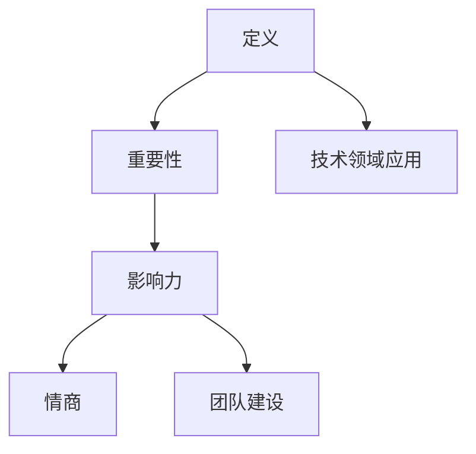

                 

### 文章标题

《领导力修炼日记：一个技术总监的蜕变历程》

> 关键词：领导力、技术总监、个人成长、团队管理、项目执行

> 摘要：本文通过一位技术总监的亲身经历，详细阐述了在技术领域内修炼领导力的关键步骤。文章围绕领导力的核心概念、实践方法和持续修炼，结合实际案例，为读者提供了一个系统且实用的领导力提升指南。

---

### 引言

在科技飞速发展的今天，技术总监（CTO）的角色不仅仅是技术的领军者，更是团队的领导者。一个优秀的技术总监不仅需要具备深厚的专业背景，还需要具备卓越的领导力。然而，领导力的修炼并非一朝一夕之功，它需要不断地学习、实践和反思。本文将围绕一位技术总监的成长历程，探讨如何通过修炼领导力实现个人和团队的蜕变。

---

### 第1章：领导力的定义与重要性

#### 背景介绍

领导力是一个广泛讨论但难以精确定义的概念。简单来说，领导力是指引导和激励他人实现共同目标的能力。在技术领域，领导力不仅关乎技术方向的决策，还涉及到团队的管理、项目的执行以及个人与组织的成长。

#### 核心概念与联系

为了更好地理解领导力，我们可以将其与一些核心概念联系起来：

- **影响力**：领导力本质上是一种影响力，它能够激发团队成员的热情和动力，实现共同目标。
- **情商**：情商是领导力的重要组成部分，它涉及到自我认知、自我调节和同理心等方面。
- **团队建设**：团队建设是领导力的具体体现，良好的团队关系能够提升团队效率和协作效果。

#### Mermaid 流程图



#### 核心概念原理之间的关系架构

领导力的核心在于影响力、情商和团队建设。影响力决定了领导者的号召力和执行力；情商则决定了领导者的人际交往和团队氛围；团队建设则是领导力在实际工作中的具体体现。

---

### 第2章：领导者的自我认知

#### 背景介绍

自我认知是领导力修炼的基础。一个优秀的领导者首先需要了解自己的优点和不足，从而有针对性地提升自我。

#### 核心概念与联系

- **自我评估**：通过自我反思和他人反馈，了解自己的优点和不足。
- **自我提升**：基于自我评估的结果，制定提升计划，包括技能培训、知识拓展等方面。
- **自我激励**：保持积极的心态，不断激励自己面对挑战和困难。

#### 伪代码讲解

```python
def self_evaluation():
    # 收集自我反思和他人反馈
    feedback = get_feedback()
    # 分析反馈，识别优点和不足
    strengths, weaknesses = analyze_feedback(feedback)
    return strengths, weaknesses

def self_improvement(strengths, weaknesses):
    # 制定提升计划
    improvement_plan = create_improvement_plan(strengths, weaknesses)
    # 实施提升计划
    execute_improvement_plan(improvement_plan)

def self_motivation():
    # 保持积极心态
    maintain_positive_mentality()
    # 激励自己面对挑战
    motivate_for_challenges()
```

#### 核心算法原理讲解

自我评估是通过收集自我反思和他人反馈，分析反馈中的优点和不足，从而形成自我认知。自我提升则是基于自我评估的结果，制定和实施提升计划。自我激励则是保持积极的心态，激励自己在面对挑战时保持斗志。

---

### 第3章：领导力的核心能力

#### 背景介绍

领导力不仅仅是一种个人特质，更是一种能力。一个优秀的领导者需要具备一系列核心能力，包括沟通能力、决策能力、影响力和情商等。

#### 核心概念与联系

- **沟通能力**：良好的沟通能力是领导者必备的素质，它包括清晰表达、有效倾听和反馈。
- **决策能力**：决策能力决定了领导者在关键时刻的决策水平，它包括信息收集、分析判断和执行。
- **影响力**：影响力是领导者发挥领导作用的关键，它包括个人魅力、专业能力和团队认同。
- **情商**：情商是领导力的核心要素，它包括自我认知、自我调节和同理心。

#### 数学模型和公式

- **沟通效率模型**：沟通效率 = 清晰表达 × 有效倾听 × 反馈效率
- **决策模型**：决策质量 = 信息准确性 × 分析深度 × 执行力度
- **影响力模型**：影响力 = 个人魅力 × 专业能力 × 团队认同

#### 详细讲解与举例说明

#### 沟通能力

沟通效率模型表明，沟通效率取决于清晰表达、有效倾听和反馈效率。一个技术总监需要在团队会议中清晰表达技术方案，同时有效倾听团队成员的意见和建议，并及时给予反馈。

#### 决策能力

决策质量取决于信息准确性、分析深度和执行力度。技术总监在项目决策时，需要全面收集信息，深入分析各种方案，并确保执行力度，以确保决策的有效性。

#### 影响力

影响力模型表明，影响力取决于个人魅力、专业能力和团队认同。一个技术总监需要通过个人魅力和专业能力赢得团队的认同，从而提升自己的影响力。

---

### 第4章：团队管理与协作

#### 背景介绍

团队管理是技术总监的重要职责之一。一个高效的团队需要良好的管理，包括团队构建、激励与反馈以及协作与冲突解决。

#### 核心概念与联系

- **团队构建**：团队构建是团队管理的基础，它包括角色定位、技能匹配和团队文化建设。
- **激励与反馈**：激励与反馈是提升团队士气和效率的关键，它包括正面激励、负面反馈和持续反馈。
- **协作与冲突解决**：协作与冲突解决是团队高效运作的保障，它包括沟通协作、冲突预防和解决。

#### 项目实战

假设我们正在开发一个复杂的项目，技术总监需要管理一个由不同专业背景的成员组成的团队。以下是团队管理的实战步骤：

1. **团队构建**：首先，技术总监需要对团队成员的角色和技能进行评估，确保每个成员都能在项目中发挥最大的作用。

2. **激励与反馈**：技术总监需要定期与团队成员进行沟通，了解他们的工作进展和遇到的困难，并及时给予正面激励和负面反馈。

3. **协作与冲突解决**：在项目开发过程中，技术总监需要确保团队成员之间的有效沟通，及时发现和解决潜在冲突。

---

### 第5章：项目管理与执行

#### 背景介绍

项目管理是技术总监的另一个核心职责。一个成功的项目需要清晰的目标、详细的规划和有效的执行。

#### 核心概念与联系

- **项目规划**：项目规划是项目管理的起点，它包括目标设定、任务分解和时间规划。
- **项目执行**：项目执行是项目管理的核心，它包括任务分配、进度控制和风险应对。
- **项目监控**：项目监控是项目管理的保障，它包括进度报告、绩效评估和调整。

#### 伪代码讲解

```python
def project_planning():
    # 设定项目目标
    project_goal = set_project_goal()
    # 分解任务
    tasks = decompose_tasks(project_goal)
    # 规划时间
    timeline = plan_time(tasks)

def project_execution(timeline):
    # 分配任务
    assign_tasks(tasks)
    # 控制进度
    control_progress(timeline)
    # 应对风险
    handle_risks()

def project_monitoring():
    # 汇报进度
    report_progress()
    # 评估绩效
    evaluate_performance()
    # 调整计划
    adjust_plan()
```

#### 核心算法原理讲解

项目规划是通过设定项目目标、分解任务和规划时间来确保项目的有序进行。项目执行是通过分配任务、控制进度和应对风险来确保项目的顺利进行。项目监控是通过汇报进度、评估绩效和调整计划来保障项目的成功。

---

### 第6章：领导力在技术团队中的应用

#### 背景介绍

领导力在技术团队中的应用具有独特的挑战。技术团队通常面临着复杂的技术难题和高强度的工作压力，技术总监需要通过有效的领导力来应对这些挑战。

#### 核心概念与联系

- **技术团队管理**：技术团队管理包括技术方向的决策、技术团队的构建和技术项目的执行。
- **技术项目执行**：技术项目执行包括技术方案的制定、技术开发的执行和技术问题的解决。
- **技术团队激励与发展**：技术团队激励与发展包括技术人员的激励、技能培训和个人成长。

#### 实际案例分析与详细讲解剖析

假设技术总监需要管理一个正在开发人工智能项目的团队，以下是领导力在技术团队中的应用：

1. **技术方向决策**：技术总监需要根据市场需求和技术发展趋势，制定合适的技术方向。

2. **技术团队构建**：技术总监需要根据项目需求，选择合适的技术人员，并构建一个高效的技术团队。

3. **技术项目执行**：技术总监需要制定详细的技术方案，并确保团队成员按照方案进行开发。

4. **技术人员激励与发展**：技术总监需要通过正面激励和技能培训，激发技术人员的工作热情，并促进他们的个人成长。

---

### 第7章：领导力的持续修炼

#### 背景介绍

领导力的修炼是一个持续的过程。技术总监需要不断地学习、实践和反思，以不断提升自己的领导力。

#### 核心概念与联系

- **学习与反思**：学习与反思是领导力修炼的关键，它包括阅读领导力书籍、参加培训课程和进行自我反思。
- **实践与改进**：实践与改进是领导力提升的关键，它包括将学到的知识应用到实际工作中，并不断改进。
- **个人成长**：个人成长是领导力修炼的目标，它包括提升自我认知、提升专业技能和提升领导能力。

#### 项目实战

技术总监可以采取以下步骤进行领导力的持续修炼：

1. **制定学习计划**：根据个人需求和兴趣，制定详细的学习计划，包括阅读书籍、参加培训课程和进行自我反思。

2. **实践与改进**：将学到的知识应用到实际工作中，如团队管理、项目执行和技术决策，并在实践中不断改进。

3. **个人成长**：通过自我认知和技能培训，不断提升自我，成为更优秀的领导者。

---

### 结论

领导力是一个复杂且多样化的领域，对于技术总监而言，更是至关重要。通过本文的探讨，我们详细阐述了领导力的核心概念、实践方法和持续修炼。希望本文能帮助读者理解领导力的本质，并在实际工作中不断提升自己的领导力。

---

### 作者信息

作者：AI天才研究院/AI Genius Institute & 禅与计算机程序设计艺术 /Zen And The Art of Computer Programming

---

### 附录

#### A. 领导力相关资源

- **领导力书籍推荐**： 
  - 《领导力的五个层次》 
  - 《成功的艺术》 
  - 《高效能人士的七个习惯》

- **领导力培训课程推荐**： 
  - “领导力提升课程” 
  - “高级项目管理” 
  - “团队建设与沟通技巧”

- **领导力实践工具与模板**： 
  - 领导力评估工具 
  - 项目管理模板 
  - 团队协作工具

---

### 结束语

领导力的修炼是一个漫长而富有挑战的过程。希望本文能为您提供一个系统的领导力提升指南，帮助您在技术领域内实现个人和团队的蜕变。让我们共同修炼领导力，成为更优秀的领导者。

