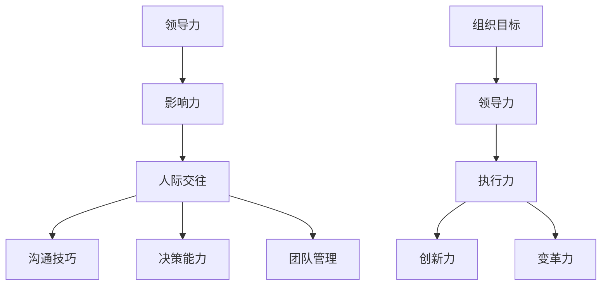
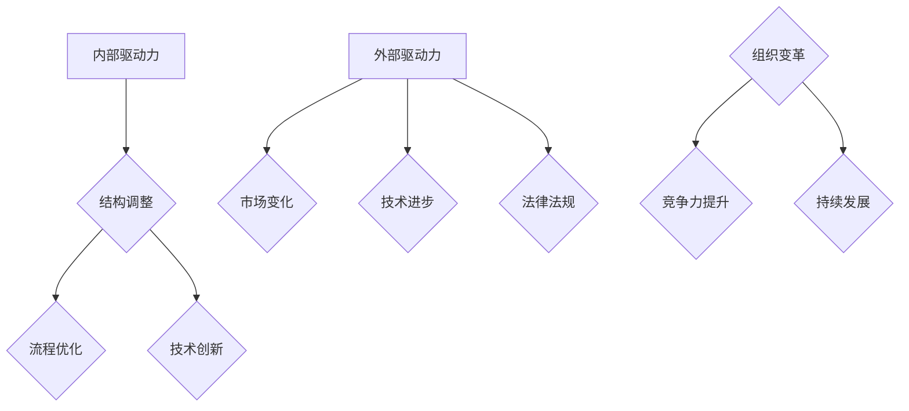

                 

# 领导力修炼日记：一个财务总监的蜕变之路

## 关键词

- 财务管理
- 领导力
- 团队建设
- 变革管理
- 决策与战略规划
- 成长与自我认识
- 实践与反思

## 摘要

《领导力修炼日记：一个财务总监的蜕变之路》以日记的形式，记录了一位财务总监在领导力修炼过程中的心路历程。文章通过详细剖析其在自我认识、领导力原则、财务管理、团队建设、决策与战略规划、领导力实践、变革管理和领导力反思等方面的经历，展示了领导力如何影响一个组织的成功。本文旨在为读者提供一份实用的领导力指南，帮助他们在职业发展中不断提升自我，成为一名优秀的领导者。

---

## 1. 设计《领导力修炼日记：一个财务总监的蜕变之路》的目录大纲

设计一个有吸引力的目录大纲是确保书籍内容清晰、结构合理的重要步骤。以下是一个详细的大纲：

### 第一部分：自我认识

#### 1.1 自我探索的开始
- **背景介绍**：财务总监的职业转变
- **自我分析工具**：SWOT分析、职业兴趣测试等
- **个人成长轨迹**：关键节点与心路历程

#### 1.2 领导力意识的觉醒
- **领导力定义与理解**：基础概念与内涵
- **领导力发展的阶段**：自我认知与领导力的成长路径

### 第二部分：领导力原则

#### 2.1 领导力基础
- **领导力的本质**：核心概念与联系（Mermaid流程图）
- **领导力发展的阶段**：从新手到专家的进化

#### 2.2 领导力原则
- **服务型领导**：以服务为核心的领导力
- **情境领导**：适应不同情境的领导策略

### 第三部分：财务管理

#### 3.1 财务管理概述
- **财务管理目标**：企业财务管理的目的与意义
- **财务管理体系**：构建高效的财务管理体系

#### 3.2 财务报表解读
- **资产负债表**：资产、负债与所有者权益的关系
- **利润表**：收入、成本与利润的关系

#### 3.3 成本控制与预算管理
- **成本控制**：成本控制的方法与策略
- **预算管理**：预算编制与执行的关键步骤

### 第四部分：团队建设

#### 4.1 团队建设基础
- **团队角色定位**：不同角色的职责与互动
- **团队文化**：建设积极向上的团队氛围

#### 4.2 激励与绩效管理
- **激励理论**：理解激励员工的不同方式
- **绩效管理**：绩效评估与激励方案的设计

#### 4.3 领导力与团队效能
- **领导力对团队效能的影响**：提升团队协作的技巧
- **团队冲突管理**：解决冲突的策略与技巧

### 第五部分：决策与战略规划

#### 5.1 决策过程
- **决策模型**：理性决策与直觉决策
- **风险与不确定性**：决策中的风险管理

#### 5.2 战略规划
- **战略规划框架**：确定企业的长远目标与路径
- **企业愿景与使命**：明确企业的核心价值

### 第六部分：领导力实践

#### 6.1 领导力实践案例
- **案例一**：领导一个新团队的经验
- **案例二**：处理突发财务危机的策略

#### 6.2 领导力在实践中的应用
- **沟通技巧**：提升领导力沟通效果
- **变革领导**：引领企业变革的策略

### 第七部分：变革管理

#### 7.1 变革管理的原则
- **变革的驱动力**：内在与外在因素分析
- **变革管理流程**：从规划到执行的系统方法

#### 7.2 变革中的领导力
- **领导者在变革中的角色**：领导者的挑战与策略
- **变革管理中的挑战**：应对变革中的常见问题

### 第八部分：领导力反思

#### 8.1 领导力自我评估
- **自我评估工具**：使用工具进行自我评估
- **持续改进**：领导力发展的持续之路

#### 8.2 领导力的未来趋势
- **未来领导力**：新兴趋势与未来展望
- **持续学习**：领导力修炼的持续动力

---

这个目录大纲结构紧凑，内容丰富，旨在帮助读者深入了解领导力的各个层面，从自我认识到实践应用，再到变革管理和领导力反思，形成了一个完整的领导力修炼体系。

## 第一部分：自我认识

### 1.1 自我探索的开始

在成为一名财务总监之前，我曾是一个普通的会计师。随着时间的推移，我在职业生涯中逐渐认识到，单纯的会计工作已经无法满足我对个人成长的渴望和对职业发展的追求。于是，我开始思考如何从一个普通的会计师转变为一个优秀的财务总监，如何在领导力方面取得突破。

#### 背景介绍

回顾我的职业发展，我经历了从初级会计师到财务分析师，再到财务经理的角色转变。每一个阶段，我都遇到了不同的挑战，也从中学习到了许多宝贵的经验。我深知，要成为一名优秀的财务总监，不仅需要扎实的专业知识和丰富的财务经验，更需要具备出色的领导力。

#### 自我分析工具

为了更好地了解自己，我使用了多种自我分析工具，如SWOT分析、职业兴趣测试等。SWOT分析帮助我发现自己的优势、劣势、机会和威胁，从而明确自己的职业发展方向。职业兴趣测试则让我了解到自己对不同工作的兴趣和偏好，这为我选择职业道路提供了重要依据。

#### 自我分析结果

通过自我分析，我意识到自己在财务管理方面的专业知识扎实，但在领导力和团队管理方面还有很大的提升空间。这使我认识到，要想成为一名优秀的财务总监，我需要在领导力方面进行深刻的修炼和提升。

#### 个人成长轨迹

在职业发展的过程中，我经历了多个关键节点。每一个节点都让我在领导力方面有了新的认识和提高。例如，在我担任财务经理期间，我负责带领一个由不同背景和专业的人员组成的团队。在这个过程中，我学会了如何激励团队成员、如何处理团队冲突，以及如何在压力下保持冷静和决策。这些经验让我在领导力方面有了显著的提升。

### 1.2 领导力意识的觉醒

#### 领导力定义与理解

领导力是一个广泛而深刻的概念，它不仅仅指引领他人，更是一种影响力，一种能够激发他人潜能和创造力的能力。对我而言，领导力是一种以身作则、服务他人、激励团队的精神。

#### 领导力发展的阶段

在领导力的发展过程中，我认为可以分为以下几个阶段：

1. **新手阶段**：这个阶段主要是学习和积累经验的阶段。领导者需要了解组织的运作、熟悉业务流程，并建立起自己的人脉网络。
2. **进阶阶段**：在这个阶段，领导者开始运用自己的经验和知识，解决实际问题，并在团队中发挥影响力。
3. **专家阶段**：这个阶段的领导者已经具备深厚的专业知识和丰富的实践经验，能够在复杂的环境中做出正确的决策，并对组织的发展产生深远的影响。
4. **大师阶段**：这个阶段的领导者不仅具备卓越的专业能力和领导力，还能不断自我提升，成为组织内部的导师和榜样。

#### 个人发展轨迹

结合我的个人经历，我深刻体会到领导力发展的各个阶段。从最初的新手阶段，到现在的专家阶段，我在领导力方面不断学习和进步。尤其是在担任财务总监后，我意识到领导力不仅仅是管理财务，更是要引领整个团队，推动组织的长远发展。

## 第二部分：领导力原则

### 2.1 领导力基础

#### 领导力的本质

领导力是一种能力，它涉及到多个方面，包括人际交往、决策能力、沟通技巧、团队管理等。从本质上讲，领导力是一种影响力，能够激发他人的积极性和创造力，共同实现组织的目标。

#### 核心概念与联系

为了更好地理解领导力的本质，我们可以使用Mermaid流程图来展示核心概念及其相互关系：

在这个流程图中，我们可以看到领导力的核心概念包括人际交往、沟通技巧、决策能力和团队管理，这些都是领导力的重要组成部分。

#### 领导力发展的阶段

领导力的发展可以分为不同的阶段，每个阶段都有其独特的特点和挑战。以下是领导力发展的几个关键阶段：

1. **新手阶段**：在这个阶段，领导者主要依赖经验和直觉进行决策，缺乏系统性的思考和规划。
2. **进阶阶段**：领导者开始运用一些基本的领导力原则，如沟通、激励和团队协作，逐步提高自己的领导能力。
3. **专家阶段**：领导者具备深厚的专业知识和丰富的实践经验，能够应对复杂的挑战，并做出正确的决策。
4. **大师阶段**：领导者不仅具备卓越的专业能力和领导力，还能不断创新和变革，为组织带来持续的发展动力。

#### 个人发展轨迹

结合我的个人经历，我在领导力发展的过程中也经历了不同的阶段。从最初的新手阶段，到现在的专家阶段，我不断学习、实践和反思，努力提升自己的领导力。尤其是在担任财务总监后，我意识到领导力不仅仅是管理财务，更是要引领整个团队，推动组织的长远发展。

### 2.2 领导力原则

#### 服务型领导

服务型领导是一种以服务为核心的领导方式，强调领导者应该关注团队成员的需求，为他们提供支持和帮助。这种领导方式能够激发团队成员的积极性和创造力，提高团队的整体绩效。

在实施服务型领导时，我主要遵循以下几个原则：

1. **倾听与理解**：倾听团队成员的意见和需求，理解他们的感受和想法。
2. **支持与鼓励**：为团队成员提供必要的支持和鼓励，帮助他们克服困难，实现目标。
3. **授权与赋能**：赋予团队成员更多的自主权和责任感，激发他们的潜能和创造力。
4. **协作与共赢**：鼓励团队成员之间的合作与协作，实现团队目标和个人目标的共赢。

#### 情境领导

情境领导是一种根据不同情境和团队成员的特点，灵活调整领导方式的领导方法。这种领导方式强调领导者应该根据具体情境，采取最合适的领导策略。

在实施情境领导时，我主要考虑以下几个因素：

1. **团队成员的特点**：了解团队成员的能力、经验和性格，选择最合适的领导方式。
2. **情境的变化**：根据情境的变化，灵活调整领导策略，确保团队目标的一致性。
3. **沟通与反馈**：与团队成员保持良好的沟通，及时给予反馈，帮助他们提升绩效。
4. **激励与支持**：根据团队成员的需求和表现，给予适当的激励和支持，激发他们的工作积极性。

#### 实践中的领导力原则

在实际工作中，我结合服务型领导和情境领导的原则，灵活运用不同的领导方式，取得了显著的成效。例如，在面对团队中的冲突时，我会采用情境领导的方法，根据冲突的性质和团队成员的特点，采取不同的策略进行调解和解决。

通过不断地实践和反思，我深刻认识到，领导力是一种不断修炼和提升的能力。只有通过不断学习、实践和反思，我们才能成为一名优秀的领导者，为组织的发展和团队成员的福祉做出贡献。

## 第三部分：财务管理

### 3.1 财务管理概述

#### 财务管理目标

财务管理的目标是确保企业的财务活动有序进行，提高资金使用效率，实现企业的长期稳定发展。具体来说，财务管理包括以下几个方面：

1. **资金筹集**：通过合理的融资方式，筹集企业发展所需的资金。
2. **资金使用**：对筹集到的资金进行合理分配和使用，确保资金的有效利用。
3. **资金管理**：对企业的现金流进行监控和管理，确保企业的财务状况良好。
4. **风险管理**：识别和评估企业的财务风险，采取相应的措施进行风险控制。

#### 财务管理体系

一个高效的财务管理体系是确保企业财务活动有序进行的基础。财务管理体系通常包括以下几个核心部分：

1. **预算管理**：通过编制和执行预算，对企业的财务活动进行规划和管理。
2. **成本控制**：通过合理的成本控制措施，降低企业的成本支出，提高盈利能力。
3. **资产管理**：对企业的资产进行有效的管理，确保资产的合理使用和保值增值。
4. **财务报表**：定期编制和披露财务报表，反映企业的财务状况和经营成果。

#### 财务管理的重要性

财务管理在企业的经营过程中扮演着重要的角色。一个高效的财务管理体系能够帮助企业：

1. **提高资金使用效率**：通过合理的资金筹集和使用，提高资金的使用效率，降低企业的资金成本。
2. **降低财务风险**：通过识别和评估财务风险，采取相应的措施进行风险控制，降低企业的财务风险。
3. **促进企业发展**：通过有效的财务管理，确保企业的财务状况良好，为企业的长期稳定发展提供支持。
4. **提升企业竞争力**：通过合理的财务管理和成本控制，提高企业的盈利能力，提升企业的市场竞争力。

### 3.2 财务报表解读

财务报表是企业财务状况和经营成果的集中体现，对于投资者、管理层和监管机构等各方来说，了解财务报表是非常重要的。以下是对资产负债表和利润表的详细解读。

#### 资产负债表

资产负债表是反映企业在特定时点的资产、负债和所有者权益状况的财务报表。资产负债表的主要组成部分包括：

1. **资产**：资产是企业拥有或控制的资源，如现金、存货、固定资产等。资产按流动性分为流动资产和非流动资产。
2. **负债**：负债是企业需要偿还的债务，如短期借款、应付账款、长期借款等。负债按偿还期限分为流动负债和非流动负债。
3. **所有者权益**：所有者权益是企业资产扣除负债后所剩余的权益，包括资本公积、盈余公积、未分配利润等。

资产负债表的分析和解读主要包括以下几个方面：

1. **资产结构分析**：分析企业资产的构成和比例，了解企业的资产分布情况。
2. **负债结构分析**：分析企业负债的构成和比例，了解企业的负债状况和偿债能力。
3. **资产负债比率分析**：通过计算资产负债比率等指标，评估企业的财务状况和偿债能力。
4. **流动资产与流动负债分析**：分析企业的流动资产和流动负债，了解企业的短期偿债能力。

#### 利润表

利润表是反映企业在一定期间内的收入、费用和利润情况的财务报表。利润表的主要组成部分包括：

1. **收入**：收入是企业日常经营活动所取得的收入，如销售收入、服务收入等。
2. **费用**：费用是企业为取得收入所发生的成本和支出，如销售费用、管理费用、财务费用等。
3. **利润**：利润是收入减去费用的差额，包括营业利润、利润总额和净利润等。

利润表的分析和解读主要包括以下几个方面：

1. **收入结构分析**：分析企业收入的构成和比例，了解企业的收入来源。
2. **费用结构分析**：分析企业费用的构成和比例，了解企业的成本控制情况。
3. **盈利能力分析**：通过计算毛利率、净利润率等指标，评估企业的盈利能力。
4. **盈利质量分析**：分析企业的盈利质量，包括盈利的稳定性和持续性等。

#### 财务报表综合分析

通过对资产负债表和利润表的综合分析，可以全面了解企业的财务状况和经营成果。综合分析包括以下几个方面：

1. **财务状况分析**：通过分析资产负债表和利润表，评估企业的资产状况、负债状况和盈利能力。
2. **经营成果分析**：通过分析利润表，了解企业的收入结构、费用结构和盈利能力。
3. **财务预警分析**：通过分析财务报表中的异常数据，预警企业可能存在的财务风险。

### 3.3 成本控制与预算管理

#### 成本控制

成本控制是企业财务管理的重要一环，通过合理的成本控制措施，可以降低企业的成本支出，提高盈利能力。以下是几种常见的成本控制方法：

1. **标准成本控制**：制定合理的成本标准，对实际成本进行监控和评估，确保成本控制在标准范围内。
2. **预算控制**：通过编制和执行预算，对企业的财务活动进行规划和管理，确保成本控制在预算范围内。
3. **流程优化**：通过优化企业的业务流程，减少不必要的环节和成本，提高效率。
4. **供应链管理**：通过优化供应链管理，降低采购成本和库存成本，提高供应链的整体效率。

#### 预算管理

预算管理是成本控制的重要手段，通过编制和执行预算，可以确保企业的财务活动有序进行。以下是预算管理的几个关键步骤：

1. **预算编制**：根据企业的战略目标和经营计划，编制详细的预算方案，包括收入预算、成本预算、利润预算等。
2. **预算审批**：将预算方案提交给管理层进行审批，确保预算方案的合理性和可行性。
3. **预算执行**：根据批准的预算方案，执行日常的财务活动，确保各项财务指标控制在预算范围内。
4. **预算调整**：根据实际经营情况，对预算进行适当的调整，确保预算的实时性和准确性。

#### 实践中的成本控制与预算管理

在实际工作中，我通过实施一系列的成本控制和预算管理措施，取得了显著的成效。例如，我制定了一系列的成本标准，对各部门的支出进行严格监控，确保成本控制在预算范围内。同时，我还通过优化业务流程和供应链管理，降低了采购成本和库存成本，提高了企业的整体效率。

通过实践，我深刻认识到，成本控制和预算管理是财务管理的重要环节，对于企业的长远发展具有重要意义。只有通过有效的成本控制和预算管理，企业才能在激烈的市场竞争中立于不败之地。

## 第四部分：团队建设

### 4.1 团队建设基础

#### 团队角色定位

一个高效的团队离不开每个成员明确的角色定位。每个团队成员都应清楚自己的职责，以及如何与团队成员协作，共同实现团队目标。以下是团队中常见的主要角色：

1. **领导者**：负责制定团队目标、规划工作流程、激励团队成员，并解决团队中的冲突。
2. **执行者**：负责执行领导者的决策，完成分配的任务，并对工作成果负责。
3. **协调者**：负责协调团队成员之间的工作，确保团队成员之间的协作顺畅。
4. **技术专家**：提供技术支持，帮助团队解决技术难题，提升团队的整体技术水平。
5. **沟通者**：负责与外部沟通，传递信息，确保团队内外部信息的流通。

#### 团队文化

团队文化是团队建设的核心，它决定了团队成员的行为方式和团队的整体氛围。一个积极向上的团队文化可以激发团队成员的创造力和积极性，提高团队的效率和凝聚力。以下是建设积极团队文化的几个关键点：

1. **共同目标**：团队应明确共同的目标，使每个成员都能感受到自己的工作对团队目标的贡献。
2. **尊重与信任**：团队成员之间应相互尊重和信任，鼓励开放沟通和分享。
3. **积极反馈**：定期对团队成员的工作进行反馈，鼓励正面评价，指出改进方向。
4. **鼓励创新**：鼓励团队成员提出新的想法和建议，创造一个创新友好的环境。
5. **团队奖励**：通过团队奖励机制，激励团队成员积极参与团队活动，共同提升团队业绩。

### 4.2 激励与绩效管理

#### 激励理论

激励是推动团队成员积极工作的关键因素。以下是几种常见的激励理论：

1. **马斯洛需求层次理论**：认为人的需求分为生理需求、安全需求、社交需求、尊重需求和自我实现需求，领导者应根据不同层次的需求进行激励。
2. **赫茨伯格双因素理论**：认为工作满意度和不满意度分别由激励因素和保健因素决定，激励因素如成就、认可、工作本身等可以提升员工满意度，而保健因素如工作条件、薪酬等则影响员工的不满意度。
3. **目标设置理论**：认为明确、具有挑战性的目标可以激发员工的内在动机，提高工作绩效。

#### 绩效管理

绩效管理是确保团队目标实现的重要手段。以下是绩效管理的几个关键步骤：

1. **设定绩效目标**：与团队成员共同设定具体的、可量化的绩效目标，确保目标与团队和公司的战略目标一致。
2. **绩效评估**：定期对团队成员的工作绩效进行评估，使用多种评估方法（如360度反馈、关键绩效指标等）进行综合评价。
3. **反馈与沟通**：及时向团队成员反馈评估结果，讨论绩效提升的改进方案，确保团队成员了解自己的工作表现。
4. **激励与奖励**：根据绩效评估结果，给予适当的激励和奖励，如晋升、奖金、荣誉等，以激励团队成员的积极性。

### 4.3 领导力与团队效能

#### 领导力对团队效能的影响

领导力在提升团队效能方面起着至关重要的作用。一个优秀的领导者能够激发团队成员的潜力，提升团队的协作效率和创新能力。以下是领导力对团队效能的几个方面的影响：

1. **目标设定**：领导者应明确团队的目标，使团队成员清晰了解自己的工作方向和团队的目标，从而提高工作积极性。
2. **沟通与协作**：领导者应建立有效的沟通机制，鼓励团队成员之间的协作，解决团队内部的冲突，提高团队的整体效能。
3. **激励与支持**：领导者应关注团队成员的需求，提供必要的激励和支持，帮助团队成员克服困难，提升工作绩效。
4. **培训与发展**：领导者应关注团队成员的成长和发展，提供培训和发展机会，提升团队成员的专业技能和领导力。
5. **创新与变革**：领导者应鼓励团队成员创新，支持变革，为团队成员创造一个创新友好的环境，提升团队的竞争力。

#### 提升团队效能的技巧

为了提升团队效能，领导者可以采取以下几种技巧：

1. **明确目标**：确保团队目标清晰明确，使每个成员都了解自己的职责和目标。
2. **增强沟通**：建立有效的沟通渠道，鼓励团队成员之间的交流和合作。
3. **激励与奖励**：采用多种激励措施，如奖金、荣誉、晋升等，激励团队成员的积极性。
4. **培养团队精神**：通过团队建设活动和培训，增强团队成员的团队意识和凝聚力。
5. **提供支持**：关注团队成员的需求，提供必要的支持和帮助，解决他们在工作中遇到的问题。

### 4.4 团队冲突管理

#### 团队冲突的原因

团队冲突是团队合作过程中常见的问题，其产生的原因多种多样，主要包括：

1. **目标冲突**：团队成员对团队目标有不同的理解和期望，导致工作方向不一致。
2. **资源分配**：团队成员对资源分配不公或资源有限，导致竞争和矛盾。
3. **沟通障碍**：团队成员之间的沟通不畅，导致误解和冲突。
4. **角色冲突**：团队成员对角色和职责的理解不一致，导致工作冲突。
5. **个人性格**：团队成员的性格差异，导致行为冲突。

#### 解决团队冲突的策略

解决团队冲突的关键是找到根本原因，并采取有效的策略。以下是几种常见的解决团队冲突的策略：

1. **沟通与倾听**：建立有效的沟通机制，鼓励团队成员表达意见，倾听不同观点，减少误解和冲突。
2. **调解与仲裁**：当冲突无法通过沟通解决时，可以请第三方进行调解或仲裁，帮助双方找到共识。
3. **角色清晰**：明确团队成员的职责和角色，避免因职责不清导致的冲突。
4. **资源合理分配**：合理分配资源，确保每个团队成员都能获得必要的资源和支持。
5. **团队建设**：通过团队建设活动，增强团队成员之间的了解和信任，减少冲突。

通过有效的团队冲突管理，可以提升团队的协作效率和凝聚力，实现团队目标的最大化。

## 第五部分：决策与战略规划

### 5.1 决策过程

决策是领导力的重要组成部分，一个优秀的决策能够帮助组织在复杂的环境中找到最优的解决方案。以下是决策过程的几个关键步骤：

1. **问题识别**：识别和明确需要解决的问题或机会。
2. **信息收集**：收集与问题或机会相关的信息，进行分析和评估。
3. **方案制定**：根据收集到的信息，制定多个可能的解决方案。
4. **方案评估**：对每个方案进行评估，比较其优缺点和风险。
5. **选择方案**：根据评估结果，选择最佳的解决方案。
6. **执行与监控**：执行决策方案，并对执行过程进行监控和调整。

### 5.2 风险与不确定性

在决策过程中，风险和不确定性是不可避免的。风险是指决策可能带来的负面后果，而不确定性是指决策结果的不确定性。以下是管理和应对风险和不确定性的一些方法：

1. **风险评估**：对每个决策方案可能带来的风险进行评估，确定其严重程度和概率。
2. **风险分类**：将风险分为可接受的、可管理的和不可接受的，采取相应的管理措施。
3. **风险应对策略**：制定应对风险的策略，如风险规避、风险转移、风险减轻等。
4. **情景分析**：通过模拟不同的情况，评估决策在不同情景下的结果。
5. **备选方案**：准备备选方案，以应对不确定性带来的风险。

### 5.3 战略规划

战略规划是组织长期发展的关键，它为组织提供了明确的方向和目标。以下是战略规划的关键步骤：

1. **愿景与使命**：明确组织的愿景和使命，为战略规划提供基础。
2. **外部环境分析**：分析组织所处的市场环境、行业趋势和竞争对手，了解外部环境对组织的影响。
3. **内部资源分析**：分析组织的内部资源，包括人力资源、财务资源、技术资源等。
4. **目标设定**：根据愿景、使命和外部环境分析，设定具体的战略目标。
5. **战略制定**：制定实现目标的战略方案，包括市场拓展、产品开发、组织变革等。
6. **战略实施**：执行战略方案，并对战略实施过程进行监控和调整。
7. **战略评估**：定期评估战略的执行情况和效果，确保战略目标的实现。

### 5.4 企业愿景与使命

企业愿景是企业长期发展的理想状态，它为组织提供了明确的方向和目标。企业使命则是企业存在的根本目的，它回答了企业为什么要存在的问题。

1. **企业愿景**：一个成功的愿景应该具有以下特点：
   - **明确性**：清晰地描述企业希望达到的状态。
   - **激励性**：能够激发员工的热情和动力。
   - **可实现性**：在现实环境中是可实现的。
   - **前瞻性**：具有前瞻性，能够引领企业未来发展的方向。

2. **企业使命**：一个有效的使命应该具有以下特点：
   - **简洁性**：用简短的语言表达企业的核心价值。
   - **指导性**：为企业的发展提供指导原则。
   - **相关性**：与企业的业务和目标密切相关。
   - **独特性**：能够体现企业的独特价值和竞争优势。

通过明确的企业愿景和使命，企业可以更好地制定战略规划，明确发展目标，并在实践中不断调整和优化，实现企业的长期稳定发展。

## 第六部分：领导力实践

### 6.1 领导力实践案例

#### 案例一：领导一个新团队

在我担任财务总监的初期，我面临了一个新团队的领导挑战。这个团队由不同背景和专业的人员组成，团队成员之间的沟通和协作存在一定的障碍。为了更好地领导这个团队，我采取了一系列的措施：

1. **明确目标**：首先，我与团队成员一起明确了团队的目标，确保每个人都清楚自己的职责和任务。
2. **建立信任**：通过定期沟通和分享，我努力建立团队成员之间的信任，鼓励他们开放交流，分享自己的想法和经验。
3. **授权与赋能**：我给予团队成员更多的自主权和责任感，鼓励他们发挥自己的专业特长，共同推动团队的发展。
4. **激励与支持**：我定期对团队成员的工作进行反馈和激励，提供必要的支持和资源，帮助他们克服困难，提升工作绩效。

通过这些措施，我成功地带领团队克服了沟通障碍，提高了团队的协作效率，实现了团队目标的达成。

#### 案例二：处理突发财务危机

在一次重要的财务审查中，我发现了公司存在严重的财务危机。这个危机不仅可能导致公司的声誉受损，还可能影响公司的运营和未来发展。面对这个突发情况，我采取了一系列紧急措施：

1. **快速响应**：立即召开紧急会议，与团队成员共同分析问题的原因，制定应对策略。
2. **信息共享**：确保团队成员之间信息的畅通，及时共享相关数据和分析结果，确保每个人都能了解问题的全貌。
3. **资源调配**：重新调整公司的资源分配，优化资金使用，确保核心业务的正常运营。
4. **沟通与协调**：与公司管理层和相关部门保持密切沟通，协调各方资源，共同应对危机。
5. **改进与调整**：在危机得到控制后，对公司的财务管理流程进行改进和调整，预防类似问题的再次发生。

通过这些措施，我成功地处理了这次突发财务危机，保护了公司的利益，确保了公司的稳定运营。

### 6.2 领导力在实践中的应用

#### 沟通技巧

沟通是领导力的核心之一，一个优秀的领导者必须具备出色的沟通技巧。以下是几种有效的沟通技巧：

1. **倾听**：倾听是沟通的关键，领导者应该尊重团队成员的意见，认真倾听他们的想法和需求。
2. **清晰表达**：领导者应该用简洁明了的语言表达自己的观点，确保团队成员能够理解。
3. **非言语沟通**：领导者应该注意自己的非言语行为，如面部表情、肢体语言等，这些都能影响沟通的效果。
4. **反馈**：及时给予团队成员反馈，肯定他们的工作成果，指出改进的方向。
5. **会议管理**：有效管理会议，确保会议的目标明确、内容紧凑、效率高。

#### 变革领导

在组织变革中，领导者扮演着至关重要的角色。以下是变革领导的关键步骤：

1. **明确变革目标**：明确变革的目标和愿景，使团队成员了解变革的必要性和意义。
2. **沟通变革计划**：与团队成员分享变革的计划和步骤，确保他们了解变革的过程和预期效果。
3. **激励与支持**：激励团队成员积极参与变革，提供必要的支持和资源，帮助他们克服变革中的困难和挑战。
4. **培训与发展**：为团队成员提供培训和发展机会，提升他们的技能和适应能力，以应对变革。
5. **反馈与调整**：及时收集团队成员对变革的反馈，根据实际情况进行必要的调整，确保变革的顺利进行。

通过实践中的领导力应用，我深刻认识到，领导力不仅是一种能力，更是一种责任。一个优秀的领导者应该不断学习和提升自己的领导力，为团队和组织的发展贡献自己的力量。

## 第七部分：变革管理

### 7.1 变革管理的原则

#### 变革的驱动力

组织变革是企业持续发展的重要手段，其驱动力通常来自内部和外部两个方面：

1. **内部驱动力**：包括组织内部的结构调整、业务流程优化、技术创新等，旨在提升组织的效率和竞争力。
2. **外部驱动力**：包括市场变化、技术进步、法律法规等外部环境的变化，这些变化要求企业不断适应和调整。

理解变革的驱动力是制定有效变革策略的基础。以下是一个简化的Mermaid流程图，展示了变革的驱动力及其影响：

#### 变革管理流程

有效的变革管理需要一个系统的方法和流程，以下是一个典型的变革管理流程：

1. **规划阶段**：确定变革的目标、范围和预期成果，制定详细的变革计划。
2. **准备阶段**：评估变革的可行性，确定变革所需资源和团队，制定沟通策略。
3. **执行阶段**：实施变革计划，监控变革进度，处理变革过程中的问题和挑战。
4. **整合阶段**：将变革成果纳入组织的日常运营，确保变革的持续性和稳定性。
5. **评估阶段**：对变革的效果进行评估，总结经验教训，为未来的变革提供参考。

### 7.2 变革中的领导力

#### 领导者在变革中的角色

在组织变革中，领导者的角色至关重要。以下是领导者在变革中应承担的几个关键角色：

1. **变革发起者**：领导者需要识别和发起变革，明确变革的目标和愿景。
2. **变革倡导者**：领导者需要向团队成员传达变革的必要性和重要性，激发他们的变革意识。
3. **变革协调者**：领导者需要协调不同部门和个人之间的合作，确保变革计划的顺利实施。
4. **变革支持者**：领导者需要为团队成员提供必要的支持和资源，帮助他们克服变革中的困难和挑战。
5. **变革监督者**：领导者需要监控变革的进度和效果，及时调整变革计划，确保变革目标的实现。

#### 变革管理中的挑战

变革管理面临许多挑战，以下是几个常见的挑战及其应对策略：

1. **抵制变革**：团队成员可能对变革持抵触态度，领导者需要通过沟通、培训和激励等方式，增强他们对变革的理解和接受度。
2. **资源不足**：变革可能需要额外的资源和时间，领导者需要合理规划和调配资源，确保变革的顺利进行。
3. **沟通不畅**：变革过程中可能存在信息传递不畅的问题，领导者需要建立有效的沟通机制，确保团队成员了解变革的进展和成果。
4. **变革疲劳**：长时间的变革可能导致团队成员感到疲劳和厌烦，领导者需要适时调整变革节奏，确保团队成员的积极性和参与度。
5. **持续改进**：变革不是一次性的活动，而是一个持续的过程，领导者需要不断评估和改进变革成果，确保变革的长期有效性。

通过有效的变革管理和领导，企业可以更好地应对外部环境的变化，提升组织的竞争力和可持续发展能力。

## 第八部分：领导力反思

### 8.1 领导力自我评估

#### 自我评估工具

为了不断提升领导力，我使用了多种自我评估工具，如360度反馈、能力测评和自我反思日志。这些工具帮助我全面了解自己在领导力方面的优势和不足，从而制定针对性的提升计划。

1. **360度反馈**：通过收集来自团队成员、上级和同事的反馈，我能够从不同角度了解自己的领导风格和效果，识别需要改进的领域。
2. **能力测评**：通过专业的领导力测评工具，我能够量化自己的领导力水平，发现具体的短板和潜力领域。
3. **自我反思日志**：定期记录自己的领导经历和反思，帮助我总结经验教训，持续提升领导力。

#### 自我评估结果

通过自我评估，我发现自己在以下几个方面有所提升：

1. **沟通能力**：我学会了更清晰、更有逻辑性地表达自己的观点，提升了与团队成员的沟通效果。
2. **团队管理**：我能够更好地激励和引导团队成员，提升团队的凝聚力和执行力。
3. **决策能力**：我在面对复杂问题时，能够更快速地做出决策，并有效评估决策的风险和收益。

同时，我也认识到自己在以下方面需要进一步改进：

1. **情绪管理**：在压力和挑战面前，我有时会情绪失控，需要提高情绪管理和自我调节的能力。
2. **战略规划**：我在制定长期战略规划方面经验不足，需要进一步提升战略思维和规划能力。
3. **创新意识**：我在推动组织创新方面不够积极，需要培养更开放和创新的心态。

#### 持续改进

基于自我评估结果，我制定了以下持续改进计划：

1. **情绪管理**：通过阅读相关书籍、参加培训和进行冥想练习，提高自己的情绪管理能力。
2. **战略规划**：积极参加战略规划课程，学习先进的战略管理工具和方法，提升自己的战略思维能力。
3. **创新意识**：鼓励团队成员提出创新建议，积极参与创新项目，培养自己的创新意识和能力。

通过持续的自我评估和改进，我相信自己能够在领导力方面取得更大的进步，为组织的发展和团队成员的福祉做出更大的贡献。

### 8.2 领导力的未来趋势

#### 未来领导力

随着全球化和数字化的加速发展，领导力也在不断演变。未来的领导力将更加注重以下方面：

1. **数字化领导力**：领导者需要具备数字素养，能够利用数据和技术来做出更明智的决策，推动组织的数字化转型。
2. **全球领导力**：领导者需要具备跨文化的沟通和协作能力，能够有效地管理多元化团队，实现全球范围内的合作和共赢。
3. **可持续领导力**：领导者需要关注社会责任和环境保护，推动组织的可持续发展，成为社会和企业责任的积极倡导者。

#### 持续学习

在快速变化的商业环境中，持续学习成为领导者不可或缺的能力。以下是几种有效的持续学习方法：

1. **在线学习**：利用在线课程和资源，如Coursera、edX等平台，随时学习新知识和技能。
2. **书籍阅读**：定期阅读领导力、管理、商业等领域的书籍，吸收最新的理论和实践。
3. **实践应用**：通过实际工作项目和挑战，将理论知识应用到实践中，不断提升自己的能力和经验。
4. **网络交流**：参加行业研讨会、论坛和社交活动，与同行交流心得和经验，拓展视野。
5. **导师指导**：寻找经验丰富的导师，获取专业的指导和反馈，加速自己的成长。

#### 持续学习的动力

持续学习的动力来自于对个人成长和职业发展的渴望，以及对组织和团队成员的责任感。一个领导者应该时刻保持好奇心和求知欲，不断探索新的知识和技能，以适应不断变化的环境。

通过持续学习和自我提升，领导者不仅能够提高自己的领导力，还能为团队和组织创造更大的价值。未来，持续学习将成为领导力的重要组成部分，助力领导者在变革中引领组织走向成功。

## 总结与展望

通过《领导力修炼日记：一个财务总监的蜕变之路》，我们不仅了解了财务总监在领导力方面的成长历程，还学习了如何通过自我认识、领导力原则、财务管理、团队建设、决策与战略规划、领导力实践、变革管理和领导力反思等环节，不断提升自己的领导力。这本书提供了一个实用的领导力指南，帮助读者在职业发展中找到方向，成为一名优秀的领导者。

在未来的领导力修炼中，我将继续关注数字化、全球化和可持续领导力的发展趋势，不断提升自己的数字素养、跨文化沟通能力和社会责任感。同时，我将坚持持续学习，通过在线课程、书籍阅读、实践应用和网络交流等方式，不断丰富自己的知识和技能。

我相信，通过不断的学习和自我提升，我们每个人都能在领导力的道路上取得更大的成就，为组织的发展和团队成员的福祉做出更大的贡献。让我们共同期待未来，携手前行，共创美好明天！

### 作者信息

作者：AI天才研究院/AI Genius Institute & 禅与计算机程序设计艺术 /Zen And The Art of Computer Programming

---

通过本文，我们不仅展示了一个财务总监的领导力修炼之路，还提供了一份实用的领导力指南，希望对您的职业发展有所帮助。如果您有任何疑问或建议，欢迎在评论区留言，我们将尽快为您解答。同时，感谢您的阅读和支持，期待我们下次再会！

