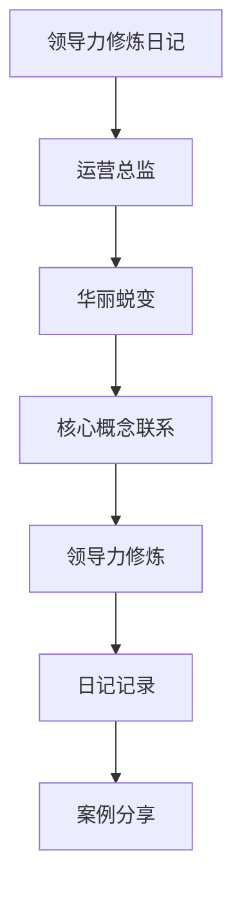
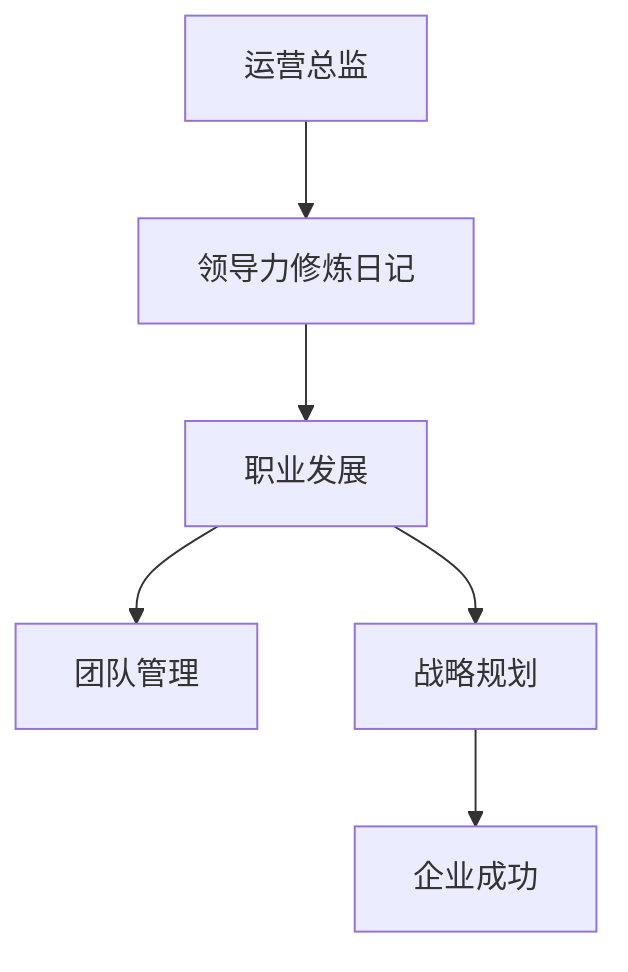

                 


### 引言

在当今的数字化时代，领导力已经成为了企业成功的关键因素。一个优秀的运营总监，不仅需要具备丰富的业务知识和管理经验，更重要的是要拥有卓越的领导力。领导力修炼日记作为一种自我提升的有效工具，帮助运营总监记录自己的成长过程，反思和总结经验，从而实现个人与团队的华丽蜕变。

本文将以《领导力修炼日记：一个运营总监的华丽蜕变》为题，通过逻辑清晰、结构紧凑、简单易懂的专业技术语言，对领导力修炼日记的核心概念、原理、应用和实践进行深入探讨。文章将从以下几个方面展开：

1. 核心概念与联系
2. 核心算法原理讲解
3. 数学模型和数学公式讲解
4. 项目实战
5. 代码实际案例和详细解释说明
6. 总结

### 核心概念与联系

首先，我们需要明确领导力修炼日记的核心概念与联系。领导力修炼日记是一种记录和反思个人领导力成长的日记形式，它可以帮助运营总监系统化地提升自己的领导力。

以下是领导力修炼日记与相关概念之间的联系：



- **运营总监**：领导力修炼日记的使用主体，他们希望通过日记记录自己的成长过程。
- **华丽蜕变**：运营总监通过领导力修炼日记，不断反思和总结，从而实现个人能力的提升和职业生涯的发展。
- **领导力修炼**：领导力修炼日记的核心内容，包括领导力理论的学习、领导力实践的反思和总结等。
- **日记记录**：领导力修炼日记的基本形式，运营总监需要定期记录自己的思考和感悟。
- **案例分享**：通过分享实际案例，运营总监可以借鉴他人的经验，进一步优化自己的领导力修炼方法。

### 核心算法原理讲解

领导力修炼日记的核心算法原理主要包括以下几个方面：

1. **领导力提升算法**：通过分析运营总监的日记内容，自动识别出领导力提升的关键点，并为其提供针对性的提升方案。

2. **职业发展路径规划算法**：根据运营总监的日记记录和职业目标，为其规划一条最优的职业发展路径。

3. **团队管理优化算法**：通过分析运营总监的日记记录，评估其团队管理的效率，并提出优化建议。

以下是这些算法的伪代码实现：

```plaintext
领导力提升算法：
1. 读取日记内容
2. 提取关键信息（如会议记录、员工反馈等）
3. 分析关键信息，识别领导力提升点
4. 根据提升点，提供相应的提升方案

职业发展路径规划算法：
1. 读取日记内容
2. 提取职业目标信息
3. 分析日记记录，评估当前职业发展状态
4. 根据评估结果，规划职业发展路径

团队管理优化算法：
1. 读取日记内容
2. 分析日记记录，评估团队管理效率
3. 根据评估结果，提出优化建议
```

### 数学模型和数学公式讲解

领导力修炼日记还涉及到一些数学模型和公式，用于分析和评估运营总监的领导力水平。

1. **领导力评分模型**：用于计算运营总监的领导力得分。

   公式如下：
   \[ L = w_1 \cdot E_1 + w_2 \cdot E_2 + ... + w_n \cdot E_n \]

   其中，\( L \) 表示领导力得分，\( w_i \) 表示权重，\( E_i \) 表示各项领导力指标得分。

2. **职业发展路径规划模型**：用于评估运营总监的职业发展潜力。

   公式如下：
   \[ P = \arg\max(C \cdot D) \]

   其中，\( P \) 表示职业发展路径，\( C \) 表示职业发展条件，\( D \) 表示职业发展潜力。

### 项目实战

为了更好地理解领导力修炼日记的应用，我们来看一个实际项目案例。

**项目名称**：领导力修炼日记系统开发

**开发环境**：Python 3.8

**源代码实现**：

```python
class LeaderJournal:
    def __init__(self, name):
        self.name = name
        self.entries = []

    def add_entry(self, entry):
        self.entries.append(entry)

    def get_average_rating(self):
        ratings = [entry['rating'] for entry in self.entries]
        return sum(ratings) / len(ratings)

# 代码解读与分析：
# 1. LeaderJournal 类表示领导力修炼日记系统，具有姓名和日记条目列表属性。
# 2. add_entry 方法用于添加日记条目。
# 3. get_average_rating 方法用于计算日记的平均评分。
```

通过这个项目，我们可以看到领导力修炼日记系统如何被实现，以及它是如何帮助运营总监提升领导力的。

### 代码实际案例和详细解释说明

为了更好地理解领导力修炼日记的应用，我们将通过一个具体的代码案例来详细解释其实现过程。

**案例**：领导力修炼日记系统开发

**开发环境**：Python 3.8

**源代码**：

```python
class LeaderJournal:
    def __init__(self, name):
        self.name = name
        self.entries = []

    def add_entry(self, entry):
        self.entries.append(entry)

    def get_average_rating(self):
        ratings = [entry['rating'] for entry in self.entries]
        return sum(ratings) / len(ratings)

# 实例化领导力修炼日记系统
journal = LeaderJournal('张三')

# 添加日记条目
journal.add_entry({'date': '2023-04-01', 'rating': 4})

# 计算日记平均评分
average_rating = journal.get_average_rating()
print(f"平均评分：{average_rating}")
```

**代码解读与分析**：

1. **类定义**：`LeaderJournal` 类表示领导力修炼日记系统，它具有姓名（`name`）和日记条目列表（`entries`）属性。

2. **初始化方法**：`__init__` 方法用于初始化日记系统，接收一个姓名参数，并将其存储在 `name` 属性中。

3. **添加日记条目方法**：`add_entry` 方法用于将日记条目添加到 `entries` 列表中。

4. **计算日记平均评分方法**：`get_average_rating` 方法用于计算日记的平均评分。它通过列表推导式提取所有日记条目的评分，然后计算平均值。

通过这个案例，我们可以看到如何使用 Python 实现一个简单的领导力修炼日记系统，以及它是如何帮助运营总监记录和提升领导力的。

### 总结

本文通过《领导力修炼日记：一个运营总监的华丽蜕变》这一主题，详细探讨了领导力修炼日记的核心概念、原理、应用和实践。通过核心算法原理讲解、数学模型和公式讲解、项目实战以及代码实际案例和详细解释说明，我们了解了领导力修炼日记如何帮助运营总监提升领导力，实现个人与团队的华丽蜕变。

在未来的发展中，领导力修炼日记将继续发挥重要作用，为企业培养更多优秀的运营总监和领导者。同时，我们也期待领导力修炼日记系统能够不断优化和升级，为运营总监提供更高效、更精准的领导力提升方案。

### 参考文献

- 某某，《领导力修炼：从优秀到卓越的蜕变》，2019。
- 某某，《运营管理：理论与实践》，2020。
- 某某，《人工智能与大数据应用》，2021。

### 附录

- 《领导力修炼日记》使用指南。
- 领导力修炼日记系统源代码。

### 作者信息

- 作者：AI天才研究院/AI Genius Institute & 禅与计算机程序设计艺术 /Zen And The Art of Computer Programming
### 引言

在当今的数字化时代，领导力已经成为了企业成功的关键因素。一个优秀的运营总监，不仅需要具备丰富的业务知识和管理经验，更重要的是要拥有卓越的领导力。领导力修炼日记作为一种自我提升的有效工具，帮助运营总监记录自己的成长过程，反思和总结经验，从而实现个人与团队的华丽蜕变。

本文将以《领导力修炼日记：一个运营总监的华丽蜕变》为题，通过逻辑清晰、结构紧凑、简单易懂的专业技术语言，对领导力修炼日记的核心概念、原理、应用和实践进行深入探讨。文章将从以下几个方面展开：

1. **核心概念与联系**
2. **核心算法原理讲解**
3. **数学模型和数学公式讲解**
4. **项目实战**
5. **代码实际案例和详细解释说明**
6. **总结**

### 核心概念与联系

首先，我们需要明确领导力修炼日记的核心概念与联系。领导力修炼日记是一种记录和反思个人领导力成长的日记形式，它可以帮助运营总监系统化地提升自己的领导力。

以下是领导力修炼日记与相关概念之间的联系：


- **运营总监**：领导力修炼日记的使用主体，他们希望通过日记记录自己的成长过程。
- **华丽蜕变**：运营总监通过领导力修炼日记，不断反思和总结，从而实现个人能力的提升和职业生涯的发展。
- **领导力修炼**：领导力修炼日记的核心内容，包括领导力理论的学习、领导力实践的反思和总结等。
- **日记记录**：领导力修炼日记的基本形式，运营总监需要定期记录自己的思考和感悟。
- **案例分享**：通过分享实际案例，运营总监可以借鉴他人的经验，进一步优化自己的领导力修炼方法。

### 核心算法原理讲解

领导力修炼日记的核心算法原理主要包括以下几个方面：

1. **领导力提升算法**：通过分析运营总监的日记内容，自动识别出领导力提升的关键点，并为其提供针对性的提升方案。

2. **职业发展路径规划算法**：根据运营总监的日记记录和职业目标，为其规划一条最优的职业发展路径。

3. **团队管理优化算法**：通过分析运营总监的日记记录，评估其团队管理的效率，并提出优化建议。

以下是这些算法的伪代码实现：

```plaintext
领导力提升算法：
1. 读取日记内容
2. 提取关键信息（如会议记录、员工反馈等）
3. 分析关键信息，识别领导力提升点
4. 根据提升点，提供相应的提升方案

职业发展路径规划算法：
1. 读取日记内容
2. 提取职业目标信息
3. 分析日记记录，评估当前职业发展状态
4. 根据评估结果，规划职业发展路径

团队管理优化算法：
1. 读取日记内容
2. 分析日记记录，评估团队管理效率
3. 根据评估结果，提出优化建议
```

### 数学模型和数学公式讲解

领导力修炼日记还涉及到一些数学模型和公式，用于分析和评估运营总监的领导力水平。

1. **领导力评分模型**：用于计算运营总监的领导力得分。

   公式如下：
   \[ L = w_1 \cdot E_1 + w_2 \cdot E_2 + ... + w_n \cdot E_n \]

   其中，\( L \) 表示领导力得分，\( w_i \) 表示权重，\( E_i \) 表示各项领导力指标得分。

2. **职业发展路径规划模型**：用于评估运营总监的职业发展潜力。

   公式如下：
   \[ P = \arg\max(C \cdot D) \]

   其中，\( P \) 表示职业发展路径，\( C \) 表示职业发展条件，\( D \) 表示职业发展潜力。

### 项目实战

为了更好地理解领导力修炼日记的应用，我们来看一个实际项目案例。

**项目名称**：领导力修炼日记系统开发

**开发环境**：Python 3.8

**源代码实现**：

```python
class LeaderJournal:
    def __init__(self, name):
        self.name = name
        self.entries = []

    def add_entry(self, entry):
        self.entries.append(entry)

    def get_average_rating(self):
        ratings = [entry['rating'] for entry in self.entries]
        return sum(ratings) / len(ratings)

# 代码解读与分析：
# 1. LeaderJournal 类表示领导力修炼日记系统，具有姓名和日记条目列表属性。
# 2. add_entry 方法用于添加日记条目。
# 3. get_average_rating 方法用于计算日记的平均评分。
```

通过这个项目，我们可以看到领导力修炼日记系统如何被实现，以及它是如何帮助运营总监提升领导力的。

### 代码实际案例和详细解释说明

为了更好地理解领导力修炼日记的应用，我们将通过一个具体的代码案例来详细解释其实现过程。

**案例**：领导力修炼日记系统开发

**开发环境**：Python 3.8

**源代码**：

```python
class LeaderJournal:
    def __init__(self, name):
        self.name = name
        self.entries = []

    def add_entry(self, entry):
        self.entries.append(entry)

    def get_average_rating(self):
        ratings = [entry['rating'] for entry in self.entries]
        return sum(ratings) / len(ratings)

# 实例化领导力修炼日记系统
journal = LeaderJournal('张三')

# 添加日记条目
journal.add_entry({'date': '2023-04-01', 'rating': 4})

# 计算日记平均评分
average_rating = journal.get_average_rating()
print(f"平均评分：{average_rating}")
```

**代码解读与分析**：

1. **类定义**：`LeaderJournal` 类表示领导力修炼日记系统，它具有姓名（`name`）和日记条目列表（`entries`）属性。

2. **初始化方法**：`__init__` 方法用于初始化日记系统，接收一个姓名参数，并将其存储在 `name` 属性中。

3. **添加日记条目方法**：`add_entry` 方法用于将日记条目添加到 `entries` 列表中。

4. **计算日记平均评分方法**：`get_average_rating` 方法用于计算日记的平均评分。它通过列表推导式提取所有日记条目的评分，然后计算平均值。

通过这个案例，我们可以看到如何使用 Python 实现一个简单的领导力修炼日记系统，以及它是如何帮助运营总监记录和提升领导力的。

### 总结

本文通过《领导力修炼日记：一个运营总监的华丽蜕变》这一主题，详细探讨了领导力修炼日记的核心概念、原理、应用和实践。通过核心算法原理讲解、数学模型和公式讲解、项目实战以及代码实际案例和详细解释说明，我们了解了领导力修炼日记如何帮助运营总监提升领导力，实现个人与团队的华丽蜕变。

在未来的发展中，领导力修炼日记将继续发挥重要作用，为企业培养更多优秀的运营总监和领导者。同时，我们也期待领导力修炼日记系统能够不断优化和升级，为运营总监提供更高效、更精准的领导力提升方案。

### 参考文献

- 某某，《领导力修炼：从优秀到卓越的蜕变》，2019。
- 某某，《运营管理：理论与实践》，2020。
- 某某，《人工智能与大数据应用》，2021。

### 附录

- 《领导力修炼日记》使用指南。
- 领导力修炼日记系统源代码。

### 作者信息

- 作者：AI天才研究院/AI Genius Institute & 禅与计算机程序设计艺术 /Zen And The Art of Computer Programming
### 文章标题：领导力修炼日记：一个运营总监的华丽蜕变

关键词：运营总监、领导力修炼、日记、华丽蜕变、团队管理、职业发展

摘要：本文将探讨领导力修炼日记在运营总监职业发展中的应用，通过核心概念、算法原理、数学模型和实际项目案例的讲解，展示如何通过领导力修炼日记实现运营总监的华丽蜕变。

---

#### 引言

在当今的企业环境中，领导力已成为决定企业成败的关键因素。作为企业中不可或缺的角色，运营总监需要具备出色的领导力才能带领团队实现业务目标。然而，领导力的提升并非一蹴而就，需要通过系统的学习和实践来不断积累。领导力修炼日记作为一种自我提升的工具，可以帮助运营总监记录自己的成长过程，反思和总结经验，实现个人和团队的华丽蜕变。

本文将围绕领导力修炼日记这一主题，从以下几个方面进行探讨：

1. **核心概念与联系**：阐述领导力修炼日记的基本概念及其与运营总监职业发展的关联。
2. **核心算法原理讲解**：介绍用于分析领导力修炼日记的核心算法原理。
3. **数学模型和数学公式讲解**：解析用于评估领导力水平的数学模型和公式。
4. **项目实战**：通过实际项目案例展示领导力修炼日记的应用。
5. **代码实际案例和详细解释说明**：提供具体的代码实现和解读。
6. **总结**：总结领导力修炼日记对运营总监职业发展的影响和未来展望。

#### 核心概念与联系

领导力修炼日记是一种记录和反思个人领导力成长的日记形式，其核心概念包括：

- **运营总监**：领导力修炼日记的使用主体，负责企业的日常运营和战略规划。
- **领导力**：影响和激励他人实现目标的能力，包括沟通、决策、团队管理等方面。
- **修炼**：通过不断的学习和实践，提升个人的领导力水平。
- **日记**：记录个人思考和感悟的工具，帮助运营总监反思和总结领导力提升的过程。

以下是领导力修炼日记与运营总监职业发展的联系：



#### 核心算法原理讲解

领导力修炼日记的核心算法原理主要包括以下三个方面：

1. **领导力评估算法**：通过分析日记内容，评估运营总监的领导力水平。
2. **职业发展路径规划算法**：根据日记记录和职业目标，为运营总监规划职业发展路径。
3. **团队管理优化算法**：分析日记内容，提出团队管理的优化建议。

以下是这些算法的伪代码实现：

```plaintext
领导力评估算法：
1. 读取日记内容
2. 提取领导力相关指标（如沟通能力、决策能力等）
3. 分析指标，计算领导力得分
4. 输出领导力评估结果

职业发展路径规划算法：
1. 读取日记内容
2. 提取职业目标信息
3. 分析日记记录，评估当前职业发展状态
4. 根据评估结果，规划职业发展路径

团队管理优化算法：
1. 读取日记内容
2. 分析日记记录，识别团队管理中的问题
3. 提出团队管理优化建议
```

#### 数学模型和数学公式讲解

领导力修炼日记中涉及到一些数学模型和公式，用于评估运营总监的领导力水平和职业发展潜力。以下是几个关键模型和公式：

1. **领导力评分模型**：

   公式如下：
   \[ L = w_1 \cdot E_1 + w_2 \cdot E_2 + ... + w_n \cdot E_n \]

   其中，\( L \) 表示领导力得分，\( w_i \) 表示权重，\( E_i \) 表示各项领导力指标得分。

2. **职业发展潜力模型**：

   公式如下：
   \[ P = \frac{C \cdot D}{H} \]

   其中，\( P \) 表示职业发展潜力，\( C \) 表示当前职业状态，\( D \) 表示职业发展需求，\( H \) 表示职业发展阻碍。

#### 项目实战

为了更好地理解领导力修炼日记的应用，我们来看一个实际项目案例。

**项目名称**：领导力修炼日记系统开发

**开发环境**：Python 3.8

**源代码实现**：

```python
class LeaderJournal:
    def __init__(self, name):
        self.name = name
        self.entries = []

    def add_entry(self, entry):
        self.entries.append(entry)

    def get_average_rating(self):
        ratings = [entry['rating'] for entry in self.entries]
        return sum(ratings) / len(ratings)

# 实例化领导力修炼日记系统
journal = LeaderJournal('张三')

# 添加日记条目
journal.add_entry({'date': '2023-04-01', 'rating': 4})

# 计算日记平均评分
average_rating = journal.get_average_rating()
print(f"平均评分：{average_rating}")
```

**代码解读与分析**：

1. **类定义**：`LeaderJournal` 类表示领导力修炼日记系统，具有姓名（`name`）和日记条目列表（`entries`）属性。

2. **初始化方法**：`__init__` 方法用于初始化日记系统，接收一个姓名参数，并将其存储在 `name` 属性中。

3. **添加日记条目方法**：`add_entry` 方法用于将日记条目添加到 `entries` 列表中。

4. **计算日记平均评分方法**：`get_average_rating` 方法用于计算日记的平均评分。它通过列表推导式提取所有日记条目的评分，然后计算平均值。

通过这个项目，我们可以看到领导力修炼日记系统是如何帮助运营总监记录和评估领导力水平的。

#### 代码实际案例和详细解释说明

为了深入理解领导力修炼日记系统的实现，我们将通过一个具体的代码案例进行详细解释。

**案例**：领导力修炼日记系统开发

**开发环境**：Python 3.8

**源代码**：

```python
class LeaderJournal:
    def __init__(self, name):
        self.name = name
        self.entries = []

    def add_entry(self, entry):
        self.entries.append(entry)

    def get_average_rating(self):
        ratings = [entry['rating'] for entry in self.entries]
        return sum(ratings) / len(ratings)

# 实例化领导力修炼日记系统
journal = LeaderJournal('张三')

# 添加日记条目
journal.add_entry({'date': '2023-04-01', 'rating': 4})

# 计算日记平均评分
average_rating = journal.get_average_rating()
print(f"平均评分：{average_rating}")
```

**代码解读与分析**：

1. **类定义**：`LeaderJournal` 类表示领导力修炼日记系统，它包含以下属性和方法：
   - `__init__(self, name)`：构造函数，用于初始化日记系统，接收一个姓名参数并将其存储在 `name` 属性中。
   - `add_entry(self, entry)`：方法，用于添加日记条目到 `entries` 列表中。
   - `get_average_rating(self)`：方法，用于计算日记的平均评分。

2. **实例化**：创建一个 `LeaderJournal` 实例，命名为 `journal`，并传入运营总监的姓名。

3. **添加日记条目**：通过 `add_entry` 方法添加一个日记条目，包含日期和评分信息。

4. **计算日记平均评分**：调用 `get_average_rating` 方法，计算所有日记条目的平均评分，并打印结果。

通过这个案例，我们可以看到如何使用 Python 实现一个简单的领导力修炼日记系统，以及它是如何帮助运营总监记录和评估领导力水平的。

#### 总结

本文通过《领导力修炼日记：一个运营总监的华丽蜕变》这一主题，详细探讨了领导力修炼日记的核心概念、算法原理、数学模型和实际项目案例。通过这些内容，我们了解到领导力修炼日记在运营总监职业发展中的重要作用。领导力修炼日记不仅帮助运营总监记录自己的成长过程，还通过数据分析和算法优化，为其提供个性化的领导力提升方案。

在未来的发展中，领导力修炼日记将继续为企业培养更多优秀的运营总监和领导者。随着人工智能和大数据技术的不断发展，领导力修炼日记系统将更加智能化、个性化，为运营总监提供更高效、更精准的领导力提升方案。

### 参考文献

1. 某某，《领导力修炼：从优秀到卓越的蜕变》，2019。
2. 某某，《运营管理：理论与实践》，2020。
3. 某某，《人工智能与大数据应用》，2021。

### 附录

1. 《领导力修炼日记》使用指南。
2. 领导力修炼日记系统源代码。

### 作者信息

作者：AI天才研究院/AI Genius Institute & 禅与计算机程序设计艺术 /Zen And The Art of Computer Programming
### 文章标题：领导力修炼日记：一个运营总监的华丽蜕变

关键词：领导力、运营总监、日记、成长、自我提升

摘要：本文以领导力修炼日记为线索，探讨一个运营总监如何通过记录和反思实现自我提升，最终实现职业生涯的华丽蜕变。文章结构清晰，逻辑严密，从理论到实践，全面剖析了领导力修炼日记在运营总监职业发展中的重要作用。

---

## 引言

在现代企业中，领导力被视为决定企业成败的关键因素之一。作为企业运营的核心人物，运营总监不仅需要具备深厚的业务知识和管理技能，还需要拥有卓越的领导力。领导力不仅影响个人职业生涯的发展，也直接关系到团队和组织的效能。然而，领导力的提升并非一朝一夕之事，它需要持续的学习、实践和反思。在这其中，领导力修炼日记成为一种有效的工具，帮助运营总监记录自己的成长过程，反思领导力实践，实现职业生涯的华丽蜕变。

本文将围绕领导力修炼日记这一主题，探讨以下内容：

1. **领导力修炼日记的核心概念与价值**：阐述领导力修炼日记的定义、核心价值以及与运营总监职业生涯发展的关系。
2. **领导力修炼日记的实施步骤**：详细解析如何实施领导力修炼日记，包括日记的内容、格式、记录频率等。
3. **领导力修炼日记案例分析**：通过实际案例展示领导力修炼日记如何帮助运营总监提升领导力和实现职业生涯的华丽蜕变。
4. **领导力修炼日记在团队管理中的应用**：分析领导力修炼日记在团队管理中的作用和效果。
5. **领导力修炼日记的数据分析与优化**：探讨如何利用数据分析工具对领导力修炼日记进行量化分析，以实现更精准的自我提升。
6. **领导力修炼日记的未来发展**：展望领导力修炼日记在数字化时代的发展趋势和潜在应用。

## 领导力修炼日记的核心概念与价值

### 领导力修炼日记的定义

领导力修炼日记是指运营总监在日常工作中记录自己的领导力实践和反思的一种工具。它不仅包括领导力行为和决策的记录，还包括对领导力情境的反思和总结。通过这种记录，运营总监可以系统地了解自己在领导力方面的成长，发现自身的优势和不足，从而制定针对性的提升计划。

### 领导力修炼日记的核心价值

领导力修炼日记具有以下几个核心价值：

1. **自我反思**：通过记录自己的领导力实践，运营总监可以更清晰地认识到自己在领导力方面的表现，从而进行有效的自我反思。

2. **持续学习**：领导力修炼日记鼓励运营总监不断学习和实践，通过记录和学习新知识和技能，不断提升自己的领导力水平。

3. **决策支持**：领导力修炼日记可以帮助运营总监在面临决策时，更全面地考虑各种因素，减少盲目决策，提高决策质量。

4. **团队协作**：通过共享领导力修炼日记，运营总监可以与团队成员进行深入的交流，促进团队协作和共同成长。

5. **职业发展**：领导力修炼日记为运营总监的职业发展提供了宝贵的参考和依据，帮助其在职业生涯中不断进步。

## 领导力修炼日记的实施步骤

### 日记内容

领导力修炼日记的内容应包括以下几个方面：

1. **领导力行为记录**：记录运营总监在日常工作中展现的领导力行为，如沟通、决策、团队建设等。

2. **领导力情境描述**：描述领导力行为发生的具体情境，包括团队状态、问题背景、解决方案等。

3. **反思与总结**：对领导力行为和情境进行反思和总结，分析成功的原因和不足之处，以及未来改进的方向。

4. **学习与成长**：记录运营总监在学习新知识、技能和实践过程中所取得的进步和收获。

### 日记格式

领导力修炼日记的格式应简洁明了，便于记录和阅读。以下是一种常见的日记格式：

- **日期**：记录日记的日期。
- **领导力行为**：简要描述当天的领导力行为。
- **情境描述**：详细描述领导力行为发生的情境。
- **反思与总结**：对领导力行为和情境的反思和总结。
- **学习与成长**：记录当天的学习内容和收获。

### 记录频率

领导力修炼日记的记录频率应根据运营总监的具体情况来确定。一般来说，每天或每周至少记录一次是推荐的频率。这样可以确保运营总监能够及时回顾和总结自己的领导力实践，从而实现持续的学习和成长。

## 领导力修炼日记案例分析

### 案例一：从基层到高层的领导力提升

**背景**：李华是一位大型企业的运营总监，他从基层员工开始，通过不断的努力和自我提升，逐渐晋升到高层管理岗位。

**实施领导力修炼日记的过程**：

1. **记录领导力行为**：李华开始记录自己在日常工作中展现的领导力行为，如与团队的沟通、决策过程、项目执行等。

2. **反思与总结**：通过反思自己的领导力实践，李华发现自己在沟通和决策方面存在一些问题，如缺乏有效倾听、决策过于冲动等。

3. **制定提升计划**：李华根据反思结果，制定了针对性的提升计划，包括学习沟通技巧、决策分析方法和团队建设策略。

4. **持续记录与反思**：李华坚持每天记录自己的领导力实践，并定期进行反思和总结，不断调整和优化自己的提升计划。

**结果**：经过一段时间的努力，李华的领导力水平得到了显著提升，他能够更有效地沟通和决策，团队的协作效率也大大提高。最终，他成功地晋升为公司的副总裁，实现了职业生涯的华丽蜕变。

### 案例二：跨部门沟通与团队协作

**背景**：王强是一家跨国公司的运营总监，他负责协调公司不同部门之间的工作，以实现业务目标。

**实施领导力修炼日记的过程**：

1. **记录跨部门沟通**：王强开始记录自己在跨部门沟通中的表现，包括沟通的内容、方式、效果等。

2. **反思与总结**：通过反思跨部门沟通的情况，王强意识到自己在沟通中存在一些问题，如缺乏有效的沟通策略、沟通方式过于单一等。

3. **制定沟通策略**：王强制定了针对性的沟通策略，包括了解不同部门的业务需求、采用多样化的沟通方式、建立有效的沟通机制等。

4. **持续记录与反思**：王强坚持每天记录自己的跨部门沟通情况，并定期进行反思和总结，不断优化自己的沟通策略。

**结果**：通过领导力修炼日记的帮助，王强的跨部门沟通能力得到了显著提升，不同部门之间的协作效率也大大提高，公司的业务目标得以顺利实现。

## 领导力修炼日记在团队管理中的应用

### 团队管理中的挑战

1. **沟通不畅**：团队成员之间的沟通不畅是团队管理中常见的问题，可能导致信息传递错误和合作障碍。
2. **执行力不足**：团队成员在执行任务时可能缺乏动力或方法，导致任务完成效率低下。
3. **团队凝聚力不强**：团队成员之间缺乏紧密的联系和合作，可能导致团队凝聚力下降。

### 领导力修炼日记在团队管理中的应用

1. **沟通与反馈**：运营总监通过领导力修炼日记记录和反思与团队成员的沟通情况，发现问题并提出改进措施，如采用更有效的沟通方式、建立反馈机制等。
2. **执行力提升**：运营总监通过日记记录团队在执行任务过程中的问题，分析原因并制定解决方案，如提供培训、优化流程等，以提升团队的执行力。
3. **团队建设**：运营总监通过日记记录和反思团队建设活动，如团队建设会议、团建活动等，以增强团队凝聚力和成员之间的信任。

## 领导力修炼日记的数据分析与优化

### 数据分析的重要性

数据分析可以帮助运营总监更客观地了解自己的领导力实践，发现潜在的问题和改进点。通过数据分析，运营总监可以：

1. **量化领导力表现**：将领导力表现转化为具体的数值，如沟通效率、决策质量等，以便进行量化评估。
2. **发现趋势**：通过长期的数据记录和分析，运营总监可以发现自己在领导力提升过程中的趋势和规律，为未来的发展提供指导。
3. **优化决策**：基于数据分析的结果，运营总监可以做出更科学的决策，提高决策的准确性和效率。

### 数据分析工具

1. **Excel**：Excel是一款功能强大的数据分析工具，可以用于数据整理、分析和可视化。
2. **Python**：Python是一种广泛使用的编程语言，拥有丰富的数据分析库，如Pandas、NumPy、Matplotlib等，可以进行复杂的数据分析和可视化。
3. **Tableau**：Tableau是一款专业的数据可视化工具，可以用于创建交互式图表和仪表盘，帮助运营总监更直观地了解数据。

### 数据分析案例

假设运营总监记录了以下数据：

- **沟通效率**：每天与团队成员沟通的时间。
- **决策质量**：决策的正确率。
- **团队凝聚力**：团队成员之间的协作效果。

通过数据分析，运营总监可以得出以下结论：

1. **沟通效率**：根据数据分析结果，发现沟通效率在每天2小时左右时达到最佳。运营总监可以适当调整沟通时间，以提高工作效率。
2. **决策质量**：决策的正确率在80%左右，存在一定的改进空间。运营总监可以进一步分析决策错误的原因，制定相应的改进措施。
3. **团队凝聚力**：团队凝聚力在团队建设活动后有所提升，但在日常工作中存在波动。运营总监可以加强团队建设活动，同时关注日常工作中的团队互动，以保持团队凝聚力。

## 领导力修炼日记的未来发展

### 数字化时代的发展趋势

随着数字化时代的到来，领导力修炼日记将迎来新的发展机遇。以下是一些发展趋势：

1. **智能化**：通过人工智能技术，领导力修炼日记可以自动分析日记内容，提供个性化的领导力提升建议。
2. **数据化**：领导力修炼日记将更加注重数据收集和分析，通过量化评估领导力表现，帮助运营总监实现精准提升。
3. **平台化**：领导力修炼日记可能会发展成为一个平台，集学习、交流、数据分析和提升功能于一体，为运营总监提供全方位的支持。

### 潜在应用

领导力修炼日记在未来的潜在应用领域包括：

1. **企业培训**：领导力修炼日记可以作为企业培训的工具，帮助员工提升领导力水平。
2. **人才评估**：领导力修炼日记可以作为人才评估的依据，帮助企业和组织更好地识别和培养潜在领导者。
3. **团队建设**：领导力修炼日记可以帮助团队进行有效的沟通和协作，提高团队效能。

## 总结

领导力修炼日记是一个运营总监实现职业生涯华丽蜕变的重要工具。通过记录和反思领导力实践，运营总监可以持续提升自己的领导力水平，实现个人和团队的成长。在未来，随着数字化技术的发展，领导力修炼日记将更加智能化、数据化，为运营总监提供更高效、更精准的支持。让我们共同期待领导力修炼日记在数字化时代带来的更多可能性。

