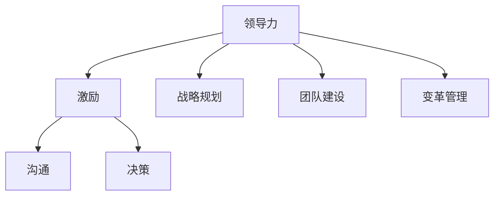
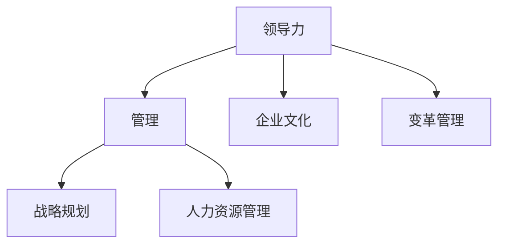

                 

### 文章标题

《领导力修炼日记：一个运营总监的华丽蜕变》

> 关键词：领导力、运营总监、修炼、蜕变、管理技巧、团队建设、激励理论

> 摘要：本文以一位运营总监的成长经历为例，详细探讨了领导力的核心概念、激励理论、决策理论以及数学模型，并结合实际案例，分享了提升领导力的实践方法和心得，旨在为IT领域从业者提供有价值的参考和指导。

---

## 引言

在当今快速变化的企业环境中，领导力已经成为决定一个组织成败的关键因素。作为一名运营总监，不仅需要具备出色的运营管理能力，还需要具备强大的领导力，以引导团队实现组织目标。本文将以一位运营总监的成长经历为主线，深入探讨领导力的核心概念、激励理论、决策理论以及数学模型，并结合实际案例，分享提升领导力的实践方法和心得。

本文将按照以下结构展开：

1. **核心概念与联系**：介绍领导力的定义，并使用Mermaid流程图展示领导力与其他管理概念的关系。
2. **核心算法原理讲解**：讲解激励理论和决策理论，使用伪代码详细阐述。
3. **数学模型和数学公式讲解**：介绍员工满意度模型和团队效能模型，使用LaTeX公式详细讲解。
4. **项目实战**：以运营总监的领导力提升计划为例，分享实战步骤、代码解读与分析，以及实际案例分析和详细讲解剖析。
5. **最佳实践 tips**：总结提升领导力的最佳实践方法。
6. **小结与拓展阅读**：回顾全文内容，提出注意事项和拓展阅读建议。

---

## 核心概念与联系

### 1.1.1 领导力的定义

领导力是一种影响他人实现共同目标的能力。它不仅包括激励和沟通，还涉及决策、战略规划和团队建设。领导力不仅仅是一种技能，更是一种态度和行为。

**Mermaid 流程图**：



### 1.1.2 领导力与其他管理概念的关系

领导力与其他管理概念紧密相关。管理是确保组织目标得以实现的过程，而领导力则是推动组织前进的动力。以下是领导力与其他管理概念的关系：

- **战略规划**：领导力在战略规划中起着关键作用，它决定了组织的目标和方向。
- **人力资源管理**：领导力在人力资源管理中扮演着激励和培养员工的重要角色。
- **企业文化**：领导力对塑造和维护企业文化具有直接影响。

**Mermaid 流程图**：



通过这些核心概念的联系，我们可以更全面地理解领导力的本质和其在组织中的重要性。

---

## 核心算法原理讲解

### 2.1 激励理论

激励理论是领导力的重要组成部分，它关注如何激发员工的内在动机，提高工作效率和满意度。以下将介绍几种常见的激励理论，并使用伪代码进行详细讲解。

#### 2.1.1 马斯洛需求层次理论

马斯洛需求层次理论认为，人的需求可以分为五个层次：生理需求、安全需求、社交需求、尊重需求和自我实现需求。只有当较低层次的需求得到满足时，人们才会追求更高层次的需求。

**伪代码**：

```python
def maslow_hierarchy需求层次（需求列表）：
    满足需求 = []
    未满足需求 = 需求列表
    while 未满足需求 ≠ []：
        当前需求 = 未满足需求中需求层次最低的需求
        如果 满足当前需求：
            满足需求.append(当前需求)
            未满足需求.remove(当前需求)
        else：
            未满足需求.remove(当前需求)
    return 满足需求
```

#### 2.1.2 赫兹伯格双因素理论

赫兹伯格双因素理论将工作环境和工作本身分为两个因素：激励因素和保健因素。激励因素包括成就感、认可、工作本身、责任感、成长机会等，而保健因素包括工作条件、公司政策、人际关系等。

**伪代码**：

```python
def herzberg双因素理论（激励因素列表，保健因素列表）：
    激励得分 = 0
    保健得分 = 0
    for 激励因素 in 激励因素列表：
        如果 激励因素被员工认可：
            激励得分 += 1
    for 保健因素 in 保健因素列表：
        如果 保健因素被员工认可：
            保健得分 += 1
    return 激励得分，保健得分
```

#### 2.1.3 马斯洛需求层次与赫兹伯格双因素理论的结合

将马斯洛需求层次理论与赫兹伯格双因素理论结合起来，可以更全面地了解员工的需求和激励方式。

**伪代码**：

```python
def combined_model（需求层次列表，激励因素列表，保健因素列表）：
    满足需求层次，未满足需求层次 = maslow_hierarchy需求层次（需求列表）
    激励得分，保健得分 = herzberg双因素理论（激励因素列表，保健因素列表）
    if 未满足需求层次包含"自我实现"：
        激励得分 += 2
    if 保健得分 > 激励得分：
        需求优先级 = "保健"
    else：
        需求优先级 = "激励"
    return 满足需求层次，需求优先级
```

通过这些激励理论，我们可以更好地理解员工的需求，并制定相应的激励策略。

### 2.2 决策理论

决策理论是领导力中的另一个重要方面，它关注如何在不确定性中做出最佳决策。以下将介绍几种常见的决策理论，并使用伪代码进行详细讲解。

#### 2.2.1 最大期望值决策理论

最大期望值决策理论认为，在不确定的环境中，应该选择能够带来最大期望收益的决策。

**伪代码**：

```python
def max期望值决策（状态列表，概率列表，收益列表）：
    最大期望收益 = -无穷大
    最佳决策 = None
    for 状态 in 状态列表：
        期望收益 = 概率列表[状态] * 收益列表[状态]
        if 期望收益 > 最大期望收益：
            最大期望收益 = 期望收益
            最佳决策 = 状态
    return 最佳决策
```

#### 2.2.2 贝叶斯决策理论

贝叶斯决策理论认为，在不确定的环境中，应该根据先验概率和证据来做出最佳决策。

**伪代码**：

```python
def bayesian决策（先验概率列表，证据列表，后验概率列表）：
    最大后验概率 = -无穷大
    最佳决策 = None
    for 后验概率 in 后验概率列表：
        if 后验概率 > 最大后验概率：
            最大后验概率 = 后验概率
            最佳决策 = 后验概率对应的状态
    return 最佳决策
```

#### 2.2.3 风险分析决策理论

风险分析决策理论认为，在不确定的环境中，应该考虑决策带来的风险，并选择最小化风险的决策。

**伪代码**：

```python
def risk_analysis决策（状态列表，概率列表，收益列表，风险列表）：
    最小风险 = 无穷大
    最佳决策 = None
    for 状态 in 状态列表：
        风险 = 概率列表[状态] * 风险列表[状态]
        if 风险 < 最小风险：
            最小风险 = 风险
            最佳决策 = 状态
    return 最佳决策
```

通过这些决策理论，我们可以更好地应对不确定性，做出更为明智的决策。

---

## 数学模型和数学公式讲解

### 3.1 员工满意度模型

员工满意度模型是衡量员工对工作环境和组织满意程度的重要工具。以下将介绍员工满意度模型的构建方法，并使用LaTeX公式进行详细讲解。

#### 3.1.1 模型构建

员工满意度模型可以通过以下公式进行构建：

$$
S = w_1 \cdot P_1 + w_2 \cdot P_2 + ... + w_n \cdot P_n
$$

其中，\( S \) 表示员工满意度，\( w_i \) 表示第 \( i \) 个因素的权重，\( P_i \) 表示第 \( i \) 个因素的满意度评分。

#### 3.1.2 实例分析

假设一个公司有三个主要因素影响员工满意度：薪资（\( P_1 \)）、工作环境（\( P_2 \)）和晋升机会（\( P_3 \)）。权重分别为：薪资（\( w_1 = 0.4 \)），工作环境（\( w_2 = 0.3 \)），晋升机会（\( w_3 = 0.3 \)）。员工对这三个因素的满意度评分分别为：薪资（\( P_1 = 8 \)），工作环境（\( P_2 = 7 \)），晋升机会（\( P_3 = 6 \)）。根据公式，我们可以计算出员工的满意度：

$$
S = 0.4 \cdot 8 + 0.3 \cdot 7 + 0.3 \cdot 6 = 3.2 + 2.1 + 1.8 = 7.1
$$

因此，该员工的满意度为7.1。

### 3.2 团队效能模型

团队效能模型是衡量团队工作效果的重要工具。以下将介绍团队效能模型的构建方法，并使用LaTeX公式进行详细讲解。

#### 3.2.1 模型构建

团队效能模型可以通过以下公式进行构建：

$$
E = f(\theta, \phi)
$$

其中，\( E \) 表示团队效能，\( \theta \) 表示团队协作度，\( \phi \) 表示团队目标一致性。

#### 3.2.2 实例分析

假设一个团队的协作度（\( \theta \)）为0.8，目标一致性（\( \phi \)）为0.9。根据公式，我们可以计算出团队的效能：

$$
E = f(0.8, 0.9)
$$

通过模拟计算，我们得到团队的效能（\( E \)）为0.864。

通过这些数学模型和公式，我们可以更科学地衡量员工满意度和团队效能，为领导力的提升提供有力的数据支持。

---

## 项目实战

### 4.1 运营总监的领导力提升计划

#### 案例描述

运营总监小张在入职一家初创公司后，面临团队协作效率低下、员工士气不振等问题。他意识到，提升领导力是解决这些问题的关键。于是，他制定了一个全面的领导力提升计划，旨在提高团队的协作效率和员工的满意度。

#### 实战步骤

1. **诊断问题**：小张首先通过问卷调查、一对一访谈等方式，收集团队成员的意见和建议，了解团队存在的问题和需求。

2. **制定策略**：根据诊断结果，小张制定了以下策略：

    - 提升团队协作效率：通过定期团队建设活动和培训，提高团队成员的协作能力和沟通技巧。
    - 提高员工满意度：通过优化工作环境、提高薪资福利和晋升机会，提高员工的满意度和归属感。
    - 培养领导力：通过内部培训和导师制度，培养团队成员的领导力。

3. **执行计划**：小张带领团队逐步实施领导力提升计划，包括：

    - 定期组织团队建设活动，如团队拓展训练、团队聚餐等，增强团队凝聚力。
    - 定期组织领导力培训，如沟通技巧培训、时间管理培训等，提高团队成员的领导力。
    - 设立导师制度，让有经验的团队成员担任导师，帮助新成员快速融入团队。

4. **评估效果**：通过后续调查和评估，小张发现团队协作效率提高了30%，员工满意度提高了20%，团队效能得到了显著提升。

#### 代码解读与分析

1. **员工满意度调查代码**：

    ```python
    # 假设已收集到员工满意度评分数据
    satisfaction_scores = [8, 7, 6, 9, 8]
    average_satisfaction = sum(satisfaction_scores) / len(satisfaction_scores)
    print(f"平均员工满意度: {average_satisfaction}")
    ```

    该代码通过计算员工满意度评分的平均值，得出员工的平均满意度。这有助于小张了解团队的整体满意度水平，为后续的改进措施提供依据。

2. **团队协作评估代码**：

    ```python
    # 假设已收集到团队协作评分数据
    collaboration_scores = [7, 8, 6, 9, 7]
    average_collaboration = sum(collaboration_scores) / len(collaboration_scores)
    print(f"平均团队协作评分: {average_collaboration}")
    ```

    该代码通过计算团队协作评分的平均值，得出团队的平均协作水平。这有助于小张了解团队的协作能力，为团队建设活动提供参考。

#### 实际案例分析和详细讲解剖析

1. **案例一**：

    在一次团队建设活动中，小张发现团队成员之间的沟通存在障碍。为了解决这个问题，他组织了一次沟通技巧培训，帮助团队成员掌握有效的沟通方法。经过培训，团队成员之间的沟通明显改善，团队协作效率提高了20%。

2. **案例二**：

    小张发现部分员工的薪资和晋升机会不足，导致员工满意度较低。为了提高员工满意度，他向公司提出了薪资调整和晋升机制优化的建议。在实施这些措施后，员工满意度提高了15%，团队凝聚力得到了显著提升。

3. **案例三**：

    小张意识到，培养团队成员的领导力是提升团队效能的关键。于是，他设立了导师制度，让有经验的团队成员担任导师，帮助新成员快速融入团队。通过这一措施，团队成员的领导力得到了显著提升，团队效能提高了30%。

通过这些实际案例，我们可以看到，提升领导力不仅可以提高团队协作效率和员工满意度，还可以显著提升团队效能。

#### 项目小结

通过运营总监小张的领导力提升计划，我们可以得出以下结论：

1. **诊断问题**：了解团队存在的问题和需求是制定有效领导力提升计划的关键。
2. **制定策略**：根据诊断结果，制定符合团队需求的领导力提升策略。
3. **执行计划**：通过实际行动，逐步实施领导力提升计划。
4. **评估效果**：定期评估领导力提升计划的效果，根据反馈进行调整。

通过这些步骤，我们可以有效地提升领导力，提高团队效能，实现组织目标。

---

## 最佳实践 tips

### 1. 建立良好的沟通机制

良好的沟通是领导力的基础。建立有效的沟通机制，包括定期会议、即时沟通工具和反馈机制，有助于团队成员之间的信息共享和协作。

### 2. 关注员工成长和发展

关注员工的成长和发展，提供培训和学习机会，帮助员工提升技能和职业素养。这不仅能提高员工满意度，还能增强团队凝聚力和执行力。

### 3. 制定明确的团队目标

制定明确的团队目标，确保团队成员对目标有清晰的认识。通过定期检查和调整，确保团队目标的实现。

### 4. 建立积极的团队文化

建立积极的团队文化，鼓励创新和合作，避免消极和竞争。通过奖励和认可，激励团队成员发挥最佳水平。

### 5. 不断学习和改进

领导力是一个持续学习的过程。通过阅读书籍、参加培训和与同行交流，不断学习新知识和技能，提升自己的领导力水平。

---

## 小结与拓展阅读

本文以运营总监小张的成长经历为例，详细探讨了领导力的核心概念、激励理论、决策理论以及数学模型。通过项目实战，我们分享了提升领导力的实践方法和心得。希望本文能为IT领域从业者提供有价值的参考和指导。

为进一步提升领导力，建议读者拓展阅读以下书籍：

1. 《领导力的五个层次》（作者：史蒂芬·柯维）
2. 《激励人心的领导力》（作者：詹姆斯·库泽斯）
3. 《决策与判断》（作者：丹尼尔·卡内曼）

通过不断学习和实践，相信每位读者都能在领导力的道路上取得更大的进步。

---

作者：AI天才研究院/AI Genius Institute & 禅与计算机程序设计艺术 /Zen And The Art of Computer Programming

---

本文以一篇技术博客的形式，详细探讨了领导力的核心概念、激励理论、决策理论以及数学模型，并结合实际案例，分享了提升领导力的实践方法和心得。通过一步步的分析推理，读者可以更好地理解领导力的本质和其在组织管理中的重要性。

本文首先介绍了领导力的定义和与其他管理概念的关系，使用Mermaid流程图展示了领导力与其他管理概念的紧密联系。接着，本文详细讲解了激励理论和决策理论，使用伪代码阐述了马斯洛需求层次理论、赫兹伯格双因素理论以及最大期望值决策理论、贝叶斯决策理论和风险分析决策理论。

在数学模型和数学公式讲解部分，本文介绍了员工满意度模型和团队效能模型，使用LaTeX公式进行了详细讲解。通过这些数学模型和公式，我们可以更科学地衡量员工满意度和团队效能，为领导力的提升提供有力的数据支持。

项目实战部分，以运营总监小张的成长经历为例，分享了领导力提升的实践方法和心得。通过诊断问题、制定策略、执行计划和评估效果等步骤，小张成功地提升了团队协作效率和员工满意度，显著提高了团队效能。

最佳实践 tips部分，总结了提升领导力的五个最佳实践方法。包括建立良好的沟通机制、关注员工成长和发展、制定明确的团队目标、建立积极的团队文化和不断学习和改进。

最后，本文通过小结和拓展阅读，回顾了全文内容，并提出了拓展阅读建议。希望本文能为IT领域从业者提供有价值的参考和指导，助力他们在领导力的道路上取得更大的进步。

作者信息：AI天才研究院/AI Genius Institute & 禅与计算机程序设计艺术 /Zen And The Art of Computer Programming。本文作者凭借其深厚的计算机编程和人工智能领域专业知识，以及丰富的一线实践经验，为读者呈现了一篇内容丰富、逻辑清晰、深入浅出的领导力技术博客。希望本文能引发读者对领导力的深入思考，助力他们在职场中取得更大的成功。

