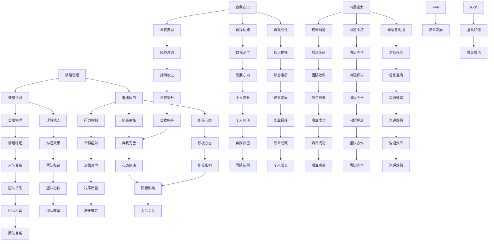

                 


为了撰写一篇符合用户需求的《领导力修炼笔记：00后职场新星的成长之路》技术博客文章，我们需要遵循以下步骤进行思考和分析：

### 1. 文章主题与目标

首先，明确文章的主题和目标。文章的核心主题是探讨00后职场新星如何通过领导力修炼实现个人成长和职业发展。文章的目标是提供一套实用的领导力培养方法和实践案例，帮助00后职场新星在职场中脱颖而出。

### 2. 文章结构规划

根据用户提供的目录大纲，我们可以将文章分为五个主要部分：

- **引言与基础**：介绍00后职场新星的特点、领导力的定义与重要性以及本书的目标与结构。
- **领导力的核心概念**：探讨领导力的核心要素，包括自我意识、沟通能力和情绪管理。
- **领导力实践**：分析团队建设、决策与执行力以及领导力修炼的方法。
- **案例与启示**：分享实际案例，提供领导力实践的经验和启示。
- **总结与展望**：总结领导力修炼的经验，探讨未来趋势和00后的使命。

### 3. 内容撰写

在撰写每个部分的内容时，我们需要确保：

- **背景介绍**：简要介绍00后职场新星的特点和职场环境。
- **核心概念与联系**：使用Mermaid流程图展示领导力的核心概念之间的关系。
- **核心算法原理讲解**：使用伪代码详细阐述领导力培养的方法和策略。
- **数学模型和公式**：使用latex格式嵌入文中，并进行详细讲解和举例说明。
- **项目实战**：介绍开发环境搭建、源代码实现、代码解读和分析。
- **最佳实践 tips**：提供实用的建议和注意事项。
- **小结与拓展阅读**：总结每个部分的内容，并提供相关的拓展阅读。

### 4. 文章格式与风格

文章需要使用markdown格式输出，确保格式清晰、结构合理。文章标题、关键词和摘要需要突出，方便读者快速了解文章内容。作者信息需要在文章末尾注明，以增强权威性。

### 5. 文章长度

根据用户要求，文章字数需要在8000～12000字左右。我们需要确保每个部分的内容充实，同时保持整体的平衡和连贯性。

### 6. 审校与修改

完成初稿后，我们需要进行审校和修改，确保文章内容准确、逻辑清晰、语言流畅。可以邀请同事或专家进行审阅，提供反馈和建议。

通过以上步骤，我们可以逐步撰写一篇高质量的《领导力修炼笔记：00后职场新星的成长之路》技术博客文章。在撰写过程中，我们始终保持逻辑清晰、结构紧凑、简单易懂的专业风格，以确保文章的专业性和可读性。 ### 文章标题

《领导力修炼笔记：00后职场新星的成长之路》

> 关键词：领导力、00后、职场新星、成长、修炼、实践

摘要：本文旨在探讨00后职场新星如何通过领导力修炼实现个人成长和职业发展。文章从领导力的核心概念、实践方法、实际案例以及未来趋势等多个角度进行分析，提供了一套实用的领导力培养路径，旨在为00后职场新人提供指导，帮助他们更好地适应职场环境，提升领导能力，实现自我价值。

## 第一部分：引言与基础

### 1. 引言

在当代快速发展的社会中，00后作为新一代的职场新星，正逐渐崭露头角。这一代人拥有独特的成长背景和个性特质，他们在互联网和数字化时代中成长，思维敏捷、信息获取能力强，但同时也面临着前所未有的挑战和机遇。如何在这片广阔的职场天地中立足、成长，甚至脱颖而出，成为了许多00后职场新星的关注焦点。

领导力，作为职场中不可或缺的素质，已经越来越受到重视。对于00后来说，掌握并修炼领导力不仅能够帮助他们更好地应对职场挑战，还能提升个人价值和职业发展空间。因此，本文将围绕领导力这一核心主题，探讨00后职场新星如何通过领导力修炼实现成长。

### 1.2 领导力的定义与重要性

领导力并非简单地指指挥他人或管理团队，而是一种激发和引导他人共同达成目标的能力。它包括自我管理、情感智慧、沟通能力、决策能力等多个方面。在职场中，领导力不仅能够提高个人的影响力，还能提升团队效率和整体业绩。

对于00后职场新星而言，领导力的重要性体现在以下几个方面：

1. **适应快速变化的工作环境**：随着科技和经济的快速发展，职场环境日益复杂和变化。具备领导力可以帮助00后职场新星更好地适应变化，把握机遇，实现自我成长。

2. **提升团队协作能力**：领导力强调团队合作和协作精神，这对于解决职场中的复杂问题至关重要。通过领导力修炼，00后可以提升团队协作能力，共同面对挑战。

3. **实现职业发展**：领导力是职场晋升的重要基础。在职场中，具备领导力的人更容易得到认可和重用，从而实现职业发展。

### 1.3 本书的目标与结构

本书的目标是为00后职场新星提供一套完整的领导力修炼指南，帮助他们：

1. **了解领导力的核心概念和原理**：通过学习领导力的基本理论，00后可以建立正确的领导力观念，明确领导力的核心要素。

2. **掌握领导力的实践方法**：本书将结合实际案例，提供实用的领导力实践方法，帮助00后职场新星将理论知识转化为实际行动。

3. **提升个人领导力**：通过持续学习和实践，00后职场新星可以不断提升个人领导力，实现职业成长和自我价值。

全书分为五个部分：

- **第一部分：引言与基础**：介绍00后职场新星的特点和领导力的重要性。
- **第二部分：领导力的核心概念**：探讨领导力的核心要素，如自我意识、沟通能力和情绪管理。
- **第三部分：领导力实践**：分析团队建设、决策与执行力以及领导力修炼的方法。
- **第四部分：案例与启示**：分享实际案例，提供领导力实践的经验和启示。
- **第五部分：总结与展望**：总结领导力修炼的经验，探讨未来趋势和00后的使命。

通过以上结构和内容的安排，本书旨在为00后职场新星提供一条清晰的领导力修炼之路，帮助他们实现个人和职业的全面发展。 ## 第二部分：领导力的核心概念

领导力并非一蹴而就，它需要基于一系列核心概念的理解和修炼。本部分将深入探讨领导力的三大核心要素：自我意识、沟通能力和情绪管理。这些要素不仅构成了领导力的基础，也是00后职场新星在职场中脱颖而出的关键。

### 3. 领导力的核心要素

#### 3.1 自我意识

自我意识是领导力的基石。它包括自我认知、自我成长和自我反思三个层次。

1. **自我认知**：自我认知是指对自己的理解，包括自己的优点、缺点、兴趣和价值观。通过自我认知，00后职场新星可以明确自己的定位和发展方向。

2. **自我成长**：自我成长是在自我认知的基础上，不断学习和提升自我。这包括知识、技能和心态的提升。00后应积极拥抱学习，不断提升自己的综合素质。

3. **自我反思**：自我反思是领导力的重要组成部分，通过反思，00后可以总结经验，发现不足，从而不断改进自己。

#### 3.2 沟通能力

沟通能力是领导力的关键要素之一。有效沟通不仅能够提高工作效率，还能增强团队凝聚力。

1. **有效沟通的重要性**：在职场中，沟通能力直接影响团队协作和项目推进。有效沟通能够减少误解，提升团队执行力。

2. **沟通技巧**：沟通技巧包括倾听、表达、反馈和协调。倾听是理解他人的前提，表达是传递信息的关键，反馈是确保沟通效果的重要手段，协调是解决冲突的有效途径。

3. **非语言沟通**：非语言沟通如肢体语言、面部表情和语调等，同样重要。它能够补充和强化语言沟通，使信息更加丰富和准确。

#### 3.3 情绪管理

情绪管理是领导力的另一个核心要素。情绪管理能力强的人能够更好地应对压力，保持冷静和理智。

1. **情绪识别**：情绪识别包括自我情绪识别和他人情绪识别。通过自我情绪识别，00后可以更好地管理自己的情绪，保持情绪稳定。通过他人情绪识别，可以更好地理解他人的需求，增强沟通效果。

2. **情绪调节**：情绪调节包括压力管理、焦虑应对和快乐提升。压力管理是避免情绪失控的关键，焦虑应对是保持情绪平衡的重要手段，快乐提升是保持积极心态的基础。

### 3.4 领导力的核心概念联系

为了更好地理解领导力的核心概念，我们可以使用Mermaid流程图来展示它们之间的关系。



通过上述Mermaid流程图，我们可以清晰地看到自我意识、沟通能力和情绪管理这三个核心要素之间的相互关系和作用。这些要素相辅相成，共同构成了领导力的基础。

### 3.5 伪代码讲解

在理解了领导力的核心概念和其相互关系后，我们可以使用伪代码来详细阐述如何在实际中应用这些概念。

```plaintext
// 领导力培养伪代码

// 自我意识培养
class SelfAwareness {
    function SelfAssessment() {
        // 进行自我评估，识别自身优点和不足
    }
    
    function ContinuousLearning() {
        // 持续学习，提升知识和技能
    }
    
    function SelfReflection() {
        // 反思自己的行为和决策，总结经验
    }
}

// 沟通能力培养
class CommunicationSkills {
    function ActiveListening() {
        // 积极倾听，理解他人的观点和需求
    }
    
    function ClearExpression() {
        // 清晰表达，准确传递信息
    }
    
    function Feedback() {
        // 提供和接受反馈，确保沟通效果
    }
    
    function NonVerbalCommunication() {
        // 使用肢体语言和面部表情强化沟通
    }
}

// 情绪管理培养
class EmotionalControl {
    function EmotionIdentification() {
        // 识别自身和他人的情绪，理解情绪背后的需求
    }
    
    function StressManagement() {
        // 管理压力，保持情绪稳定
    }
    
    function AnxietyHandling() {
        // 应对焦虑，保持冷静和理智
    }
    
    function PositiveMoodBoosting() {
        // 提升积极情绪，保持良好的心态
    }
}
```

通过以上伪代码，我们可以将领导力的核心概念转化为具体的行动步骤，帮助00后职场新星在实际中培养和提升领导力。

### 3.6 数学模型与公式

在领导力培养中，某些关键环节可以通过数学模型和公式进行量化分析。例如，我们可以使用以下公式来评估自我意识和沟通能力的提升效果：

$$
SelfAwarenessScore = \frac{SelfAssessmentScore + ContinuousLearningScore + SelfReflectionScore}{3}
$$

$$
CommunicationSkillScore = \frac{ActiveListeningScore + ClearExpressionScore + FeedbackScore + NonVerbalCommunicationScore}{4}
$$

通过这些公式，00后职场新星可以更加客观地评估自己的领导力水平，并针对性地进行提升。

### 3.7 举例说明

为了更好地理解上述概念和方法，我们可以通过一个实际案例来具体说明。

**案例：小明是一位00后职场新星，他希望通过领导力修炼提升自己在团队中的影响力。**

1. **自我意识培养**：
   - 小明通过自我评估，识别出自己的优点是逻辑思维能力强，但沟通技巧有待提升。
   - 通过持续学习，小明参加沟通技巧培训，提升了自己的表达能力。
   - 在日常工作中，小明不断反思自己的行为和决策，总结经验，不断改进。

2. **沟通能力培养**：
   - 小明积极倾听同事的意见，理解他们的需求，建立了良好的沟通基础。
   - 在表达时，小明注重清晰和准确，减少了误解和冲突。
   - 小明通过提供和接受反馈，不断完善自己的沟通技巧。

3. **情绪管理**：
   - 小明学会识别自己的情绪，并在压力和焦虑时保持冷静和理智。
   - 小明通过运动和冥想等方法提升积极情绪，保持良好的心态。

通过以上的努力，小明在团队中的影响力逐渐提升，不仅赢得了同事的尊重，还成为团队中的重要成员，为团队的成功做出了贡献。

### 3.8 最佳实践 tips

1. **持续反思**：定期进行自我反思，识别自己的成长点和改进方向。
2. **积极学习**：保持学习的热情，不断提升自己的知识和技能。
3. **倾听他人**：注重倾听他人的意见和需求，建立良好的人际关系。
4. **情绪管理**：学会管理自己的情绪，保持冷静和理智，以更好地应对职场挑战。

通过以上最佳实践，00后职场新星可以更加系统地培养领导力，实现个人和职业的全面发展。 ## 第三部分：领导力实践

在了解了领导力的核心概念后，接下来我们将探讨领导力在实际职场中的具体实践，包括团队建设、决策与执行力以及领导力修炼的方法。

### 6. 团队建设

团队建设是领导力实践的重要环节。一个高效的团队可以充分发挥每个成员的优势，共同实现目标。以下是团队建设的几个关键步骤：

#### 6.1 团队成员的角色定位

团队成员的角色定位是团队建设的基础。通过角色定位，可以明确每个成员的职责和贡献，确保团队协作顺畅。

1. **成熟度模型**：可以使用赫赛-布兰查德的成熟度模型（LMX模型）来评估团队成员的关系，了解哪些成员更成熟、更可靠。

   ```mermaid
   graph TB
       A[低成熟度] --> B[管理依赖]
       B --> C[低信任度]
       C --> D[高成熟度]
       D --> E[自主管理]
       E --> F[高信任度]
   ```

2. **角色分析**：对每个成员进行角色分析，确定他们在团队中的职责和贡献。可以使用以下表格来记录：

   | 成员姓名 | 角色        | 职责                  | 优势                  | 需提升的能力         |
   |---------|-------------|-----------------------|-----------------------|----------------------|
   | 小明    | 项目经理    | 负责项目整体推进      | 沟通能力强，逻辑思维好 | 团队协调能力          |
   | 小红    | 技术专家    | 负责技术方案制定      | 技术能力强，创新思维好 | 项目管理能力          |
   | 小李    | 文案策划    | 负责文案编写和市场推广 | 文字功底强，创意好     | 项目沟通能力          |

#### 6.2 团队合作与冲突管理

团队合作是实现团队目标的关键。同时，团队内部难免会出现冲突。有效的冲突管理可以确保团队和谐，提高工作效率。

1. **合作原则**：

   - **尊重差异**：尊重团队成员的不同观点和意见，鼓励开放讨论。
   - **共同目标**：明确团队的目标，确保每个成员都为目标努力。
   - **信任建立**：建立信任关系，促进团队成员之间的互信。

2. **冲突解决策略**：

   - **倾听与理解**：积极倾听冲突双方的立场，理解他们的需求和感受。
   - **寻求共识**：通过协商和讨论，寻找双方都能接受的解决方案。
   - **调解与仲裁**：在必要时，可以邀请第三方进行调解或仲裁，确保公平。

### 6.3 决策与执行力

决策与执行力是领导力实践中的关键环节。高效的决策和执行力能够确保团队目标的实现。

#### 6.1 决策过程

1. **问题识别**：明确需要解决的问题或目标。
2. **信息收集**：收集与问题相关的信息，确保决策基于充分的数据和事实。
3. **方案评估**：分析不同的解决方案，评估其可行性、风险和收益。
4. **决策制定**：选择最佳方案，并制定详细的执行计划。
5. **决策执行**：执行决策，并监控执行过程中的问题和进展。

#### 6.2 执行力提升

1. **目标设定**：明确具体、可量化的目标，确保团队成员清晰了解自己的任务和责任。
2. **执行计划**：制定详细的执行计划，包括时间表、任务分配和资源调配。
3. **持续改进**：在执行过程中，不断评估和调整，确保目标达成。

### 6.4 领导力修炼之路

领导力修炼是一个长期且持续的过程。以下方法可以帮助00后职场新星不断提升领导力：

1. **学习与实践**：通过阅读、培训和实践，不断学习和提升自己的知识和技能。
2. **反思与调整**：定期反思自己的行为和决策，发现不足并进行调整。
3. **反馈与改进**：积极接受他人的反馈，不断改进自己的领导风格和方法。
4. **职业发展规划**：制定清晰的职业发展规划，确保自己的领导力修炼与职业目标相匹配。

### 6.5 领导力修炼的长期规划

1. **职业发展规划**：明确自己的职业目标和发展路径，制定长期的领导力提升计划。
2. **个人成长规划**：提升自己的综合素质，包括专业技能、沟通能力和情绪管理能力。
3. **持续学习**：保持学习的热情，不断更新知识和技能，适应职场变化。

通过以上领导力实践，00后职场新星可以不断提升自己的领导能力，实现个人和职业的全面发展。在团队建设、决策与执行力以及领导力修炼中，00后需要不断学习和实践，以应对职场中的各种挑战。 ## 第四部分：案例与启示

在探讨领导力实践的过程中，实际案例是最好的学习材料。本部分将通过两个具体的案例，分析00后职场新星如何在实际工作中运用领导力，提供宝贵的经验和启示。

### 8.1 案例一：团队管理成功经验

**案例描述**：小明是一名互联网公司的项目经理，负责带领一个由不同背景成员组成的团队。团队成员包括技术专家、产品经理、设计师和市场营销专员。项目是一个涉及多部门的大型项目，时间紧、任务重，对团队的协作能力和领导力提出了严峻挑战。

**关键过程**：

1. **角色定位与沟通**：小明首先对团队成员进行了角色定位，明确了每个成员的职责和贡献。他通过定期团队会议和一对一沟通，确保团队成员之间的信息畅通，避免了因信息不对称导致的误解和冲突。

   ```mermaid
   graph TD
       A[项目经理] --> B[技术专家]
       A --> C[产品经理]
       A --> D[设计师]
       A --> E[市场营销专员]
       B --> F[技术方案]
       C --> G[产品需求]
       D --> H[界面设计]
       E --> I[市场推广]
   ```

2. **决策与执行力**：在项目推进过程中，小明采用民主决策的方式，充分听取团队成员的意见和建议，确保决策的合理性和可执行性。他制定了详细的执行计划，并设立了明确的目标和里程碑，确保团队按照计划推进。

   ```mermaid
   graph TD
       J[项目启动] --> K[需求分析]
       K --> L[技术方案]
       L --> M[界面设计]
       M --> N[市场推广]
       N --> O[项目交付]
   ```

3. **情绪管理与激励**：小明注重情绪管理，通过积极的沟通和鼓励，帮助团队成员缓解工作压力。他设立了激励机制，对表现突出的团队成员进行奖励，激发了团队的工作热情和创新能力。

**经验总结**：

- **明确角色定位和职责**：确保团队成员清楚自己的职责和贡献，减少误解和冲突。
- **民主决策和执行力**：确保决策合理且具有可执行性，提高团队工作效率。
- **情绪管理和激励**：关注团队成员的情绪，提供正面的激励，提高团队士气。

### 8.2 案例二：创新思维与执行力

**案例描述**：小红是一名互联网创业公司的产品经理，她带领团队开发了一款创新性的移动应用。这款应用在市场上获得了良好的反响，为公司带来了可观的收益。

**关键过程**：

1. **市场调研与创新思维**：小红在项目初期进行了详细的市场调研，分析了用户需求和市场趋势。她运用创新思维，提出了一系列具有独特性的功能设计，确保产品在竞争激烈的市场中脱颖而出。

   ```mermaid
   graph TD
       P[市场调研] --> Q[用户需求]
       Q --> R[功能设计]
       R --> S[创新方案]
   ```

2. **团队协作与沟通**：小红建立了高效的团队协作机制，定期召开团队会议，确保团队成员之间信息畅通。她鼓励团队成员提出自己的想法和意见，共同讨论和优化产品功能。

   ```mermaid
   graph TD
       T[团队会议] --> U[意见收集]
       U --> V[方案优化]
   ```

3. **执行力与持续改进**：小红制定了详细的开发计划，并确保每个阶段都按时完成。她在项目推进过程中不断收集用户反馈，根据反馈进行迭代优化，确保产品的持续改进。

   ```mermaid
   graph TD
       W[开发计划] --> X[用户反馈]
       X --> Y[产品迭代]
   ```

**经验总结**：

- **市场调研与创新思维**：深入了解用户需求和市场趋势，运用创新思维设计产品。
- **团队协作与沟通**：建立高效的团队协作机制，鼓励团队成员提出意见和参与讨论。
- **执行力与持续改进**：确保项目按时推进，根据用户反馈进行产品迭代优化。

通过以上两个案例，我们可以看到，00后职场新星在实际工作中通过有效的领导力实践，成功应对了各种挑战，实现了个人和团队的目标。这些经验和启示对于其他00后职场新星具有重要的借鉴意义，帮助他们更好地提升领导力，实现职业发展。 ### 9. 领导力修炼的总结与反思

通过本部分的案例分析和经验总结，我们可以看到，领导力在职场中的重要性不言而喻。00后职场新星在领导力修炼过程中，通过明确角色定位、民主决策、团队协作以及持续改进等方法，成功实现了个人和团队的成长。

首先，领导力修炼的必要性在于它不仅能够提升个人的影响力和职业发展空间，还能增强团队的协作效率和整体业绩。在案例一中，小明的团队通过明确的角色定位和高效的沟通，避免了因信息不对称导致的误解和冲突，确保了项目的顺利进行。在案例二中，小红通过市场调研和创新思维，确保了产品的市场竞争力，从而实现了公司的业绩增长。

其次，领导力修炼的方法主要包括自我意识培养、沟通能力提升和情绪管理。在案例一中，小明注重情绪管理和激励，帮助团队成员缓解工作压力，提高了团队士气。在案例二中，小红通过团队协作和持续改进，确保了产品的质量和用户体验，从而赢得了市场的认可。

最后，领导力修炼是一个持续的过程。00后职场新星需要不断学习和实践，反思自己的行为和决策，不断调整和改进。通过总结案例中的成功经验和失败教训，我们可以得出以下几点反思：

1. **自我认知的重要性**：领导力修炼始于自我认知。00后应不断反思自己的优点和不足，明确自己的定位和发展方向。

2. **沟通能力的重要性**：沟通是领导力的核心要素。00后应不断提升沟通技巧，包括倾听、表达和反馈，以增强团队协作和解决问题能力。

3. **情绪管理的关键性**：情绪管理能力对于领导力至关重要。00后应学会识别和管理自己的情绪，保持冷静和理智，以更好地应对职场挑战。

4. **持续学习的必要性**：领导力是一个不断发展和演变的领域。00后应保持学习的热情，不断更新知识和技能，适应职场的变化。

5. **反馈与改进**：积极接受他人的反馈，并根据反馈进行改进，是提升领导力的有效方法。00后应建立反馈机制，鼓励团队成员提出意见和建议。

通过以上总结与反思，00后职场新星可以更加系统地理解和应用领导力，不断提升自己的领导能力，实现个人和职业的全面发展。在未来的职场中，他们将成为引领团队、推动企业发展的中坚力量。 ### 10. 领导力的未来趋势与00后的使命

随着科技的不断进步和社会的快速发展，领导力也在不断演变。未来的领导力将更加注重创新、协作和可持续性。对于00后职场新星来说，了解这些趋势，并明确自己的使命，将有助于他们在职场中脱颖而出。

#### 10.1 领导力的演变趋势

1. **数字化领导力**：随着数字化转型的加速，领导力需要适应数字化工作环境。00后作为数字化原住民，他们更擅长利用数字工具和平台进行沟通、管理和决策。

2. **情感智慧领导力**：情感智慧在领导力中的作用日益凸显。未来的领导者需要具备更高的情感识别和管理能力，以更好地理解员工的需求和情感状态，提高团队凝聚力和工作效率。

3. **可持续领导力**：可持续发展已成为全球共识。00后需要具备可持续发展的观念，推动企业和社会实现可持续发展目标。

4. **全球化领导力**：全球化使得领导力跨越国界和文化。00后需要具备跨文化沟通和协作能力，以应对全球化带来的挑战。

#### 10.2 00后职场新星的使命与责任

作为新一代的职场新星，00后肩负着推动社会进步和实现企业目标的重要使命。他们的使命和责任包括：

1. **引领创新**：00后应积极拥抱创新，推动企业在技术、产品和商业模式上的创新，以保持竞争力。

2. **培养协作精神**：通过建立开放、包容和协作的团队文化，00后可以激发团队成员的潜力，实现共同成长。

3. **推动可持续发展**：00后需要关注企业和社会的可持续发展，推动企业承担社会责任，实现经济、社会和环境的平衡发展。

4. **塑造未来**：00后是未来职场的中坚力量，他们需要具备前瞻性思维，为企业和行业的发展提供新思路和新方案。

#### 10.3 00后职场新星的领导力发展策略

为了更好地适应未来职场的需求，00后职场新星可以从以下几个方面着手提升领导力：

1. **持续学习**：保持学习的热情，不断更新知识和技能，以适应快速变化的工作环境。

2. **实践与反思**：通过实际工作项目和领导实践，不断反思和总结经验，提升自己的领导能力。

3. **跨文化沟通**：积极参与跨文化学习和交流，提高跨文化沟通和协作能力。

4. **情感智慧培养**：注重情感管理，培养同理心和情商，以更好地理解和影响团队成员。

5. **社会责任感**：关注企业和社会的可持续发展，积极参与社会公益活动，提升自己的社会责任感。

通过以上策略，00后职场新星可以不断提升自己的领导力，实现个人和职业的全面发展，成为引领未来职场的中坚力量。 ### 文章结语

总结全文，我们探讨了00后职场新星在领导力修炼中的重要性以及如何通过自我意识、沟通能力和情绪管理等核心要素实现个人成长和职业发展。从团队建设、决策与执行力，到实际案例和未来趋势，我们为00后提供了一套完整的领导力修炼指南。

领导力不仅是职场成功的关键，更是个人成长的重要推动力。00后职场新星应积极拥抱挑战，不断提升自己的领导力，以适应快速变化的职场环境。通过持续学习和实践，他们将在职场中脱颖而出，实现个人价值和职业目标。

最后，感谢您阅读本文。希望本文能对您的领导力修炼之路提供启示和帮助。如果您有任何疑问或建议，欢迎在评论区留言，我们一起交流学习。祝您在职场中一帆风顺，领导力不断提升！作者：AI天才研究院/AI Genius Institute & 禅与计算机程序设计艺术 /Zen And The Art of Computer Programming。

