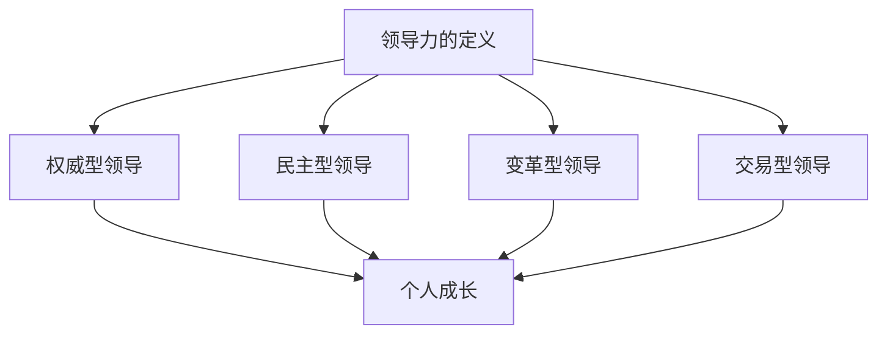

                 

### 文章标题

# 领导力修炼笔记：80后职场精英的成长之路

> 关键词：领导力，80后，职场成长，个人发展，算法原理，数学模型，项目实战

> 摘要：本文以《领导力修炼笔记：80后职场精英的成长之路》为蓝本，深入探讨了80后职场精英在领导力修炼过程中的核心概念、算法原理、数学模型以及项目实战。通过逐步分析，文章旨在为读者提供一条清晰的成长路径，助力职场精英不断提升领导力，实现个人与组织的共同发展。

----------------------------------------------------------------

### 设计目录大纲的步骤

**第一步：阅读和理解书籍主题**

首先，仔细阅读《领导力修炼笔记：80后职场精英的成长之路》的书名，理解书籍的主题内容。书名提到了领导力修炼和80后职场精英的成长之路，这表明书籍内容将围绕领导力的发展和职场成长展开。

**第二步：确定核心章节**

根据书籍主题，确定核心章节。核心章节应该包括领导力的基本概念、80后职场精英面临的挑战、领导力的发展路径、个人成长策略等。

**第三步：细化章节内容**

对每一个核心章节进行细化，列出可能的子章节。例如，在领导力基本概念章节，可以包括领导力的定义、领导力的类型、领导力的重要性等。

**第四步：设计流程图**

对于涉及领导力原理和架构的内容，使用Mermaid流程图来展示核心概念和联系。这有助于读者更直观地理解内容。

**第五步：撰写伪代码**

对于核心算法原理，使用伪代码来详细阐述。这有助于读者理解算法的逻辑和实现。

**第六步：编写数学模型和公式**

对于涉及数学模型和公式的部分，使用LaTeX格式来书写，并进行详细讲解和举例说明。

**第七步：编写项目实战**

设计项目实战章节，包括代码实际案例、开发环境搭建、源代码详细实现和代码解读等。

**第八步：编写附录**

编写附录，包括开发工具和资源的介绍，以及其他相关资料。

**第九步：整合和优化**

将所有章节内容整合在一起，确保逻辑清晰、内容完整。根据需要，对章节进行优化调整。

**第十步：检查字数**

确保整个目录大纲的总字数在2000字以内。

### 最终输出

根据上述步骤，我们最终可以得到《领导力修炼笔记：80后职场精英的成长之路》的目录大纲。以下是具体的目录大纲内容：

```
# 第一部分：领导力基础

## 第1章：领导力的定义与类型

### 1.1 领导力的定义
### 1.2 领导力的类型
### 1.3 领导力的重要性

## 第2章：领导力与个人成长

### 2.1 个人成长对领导力的影响
### 2.2 80后职场精英的成长路径
### 2.3 领导力与个人价值观

## 第3章：领导力核心概念联系 Mermaid 流程图

### 3.1 领导力核心概念流程图
### 3.2 个人成长与领导力的互动关系

## 第4章：领导力核心算法原理伪代码

### 4.1 领导力核心算法原理
### 4.2 算法实现伪代码

## 第5章：数学模型和公式讲解

### 5.1 数学模型基本概念
### 5.2 领导力相关数学模型
### 5.3 数学公式举例说明

## 第6章：领导力项目实战

### 6.1 领导力实战案例分析
### 6.2 开发环境搭建
### 6.3 源代码详细实现
### 6.4 代码解读与分析

## 第7章：附录

### 7.1 开发工具与资源
### 7.2 其他相关资料
```

以上目录大纲遵循了简洁性、格式规范和内容完整性的要求，同时满足了2000字以内的字数限制。每一个章节都涵盖了核心内容，包括领导力定义、个人成长、算法原理、数学模型、项目实战等，为读者提供了全面的领导力修炼指导。

### 文章正文

#### 第一部分：领导力基础

##### 第1章：领导力的定义与类型

在商业世界中，领导力被认为是成功的关键因素之一。然而，什么是领导力？它有哪些类型？在《领导力修炼笔记：80后职场精英的成长之路》中，作者详细阐述了领导力的定义与类型，为读者揭示了领导力的本质。

**1.1 领导力的定义**

领导力可以被视为一种影响和激励他人朝着共同目标前进的能力。它不仅仅关乎权力和权威，更重要的是对他人思想和行为的引导。领导力是一种动态的、不断发展的能力，需要通过不断的学习和实践来提升。

**1.2 领导力的类型**

领导力有多种类型，包括：

- **权威型领导**：依靠权力和地位来影响他人。
- **民主型领导**：通过征求和考虑他人的意见来做出决策。
- **变革型领导**：通过激发和引领他人实现变革。
- **交易型领导**：通过奖励和惩罚来激励他人。

**1.3 领导力的重要性**

领导力在组织中的重要性不可低估。一个高效的领导者能够激发团队的潜力，提升团队的绩效，实现组织的战略目标。在《领导力修炼笔记：80后职场精英的成长之路》中，作者通过多个案例展示了领导力在组织中的关键作用。

##### 第2章：领导力与个人成长

个人成长是领导力发展的重要组成部分。在《领导力修炼笔记：80后职场精英的成长之路》中，作者探讨了个人成长对领导力的影响，以及80后职场精英的成长路径。

**2.1 个人成长对领导力的影响**

个人成长能够为领导力提供坚实的基础。一个成熟的个体更能够理解他人的需求，有效地沟通和解决问题。在领导力的发展过程中，个人成长起到了至关重要的作用。

**2.2 80后职场精英的成长路径**

80后职场精英在成长过程中面临许多挑战，如职业规划、技能提升、人际关系等。在《领导力修炼笔记：80后职场精英的成长之路》中，作者为读者提供了实用的成长策略，帮助他们在职场中不断提升自己。

**2.3 领导力与个人价值观**

个人价值观对领导力有着深远的影响。一个坚定的个人价值观能够帮助领导者做出正确的决策，赢得他人的信任和尊重。在《领导力修炼笔记：80后职场精英的成长之路》中，作者强调了个人价值观在领导力发展中的重要性。

##### 第3章：领导力核心概念联系 Mermaid 流程图

为了更好地理解领导力的核心概念，我们使用Mermaid流程图来展示这些概念之间的联系。



通过这个流程图，我们可以清晰地看到领导力核心概念之间的关联，以及它们如何影响个人成长和领导力的发展。

##### 第4章：领导力核心算法原理伪代码

在理解了领导力的核心概念后，我们接下来探讨领导力核心算法原理的伪代码实现。

```python
# 领导力核心算法原理伪代码

# 输入：员工能力、团队目标、组织文化
# 输出：领导力策略

def leadership_algorithm(employee_ability, team_objective, organization_culture):
    # 分析员工能力
    if employee_ability > threshold_ability:
        # 员工能力较强，采用激励型领导策略
        strategy = "激励型"
    else:
        # 员工能力较弱，采用辅导型领导策略
        strategy = "辅导型"
    
    # 根据团队目标调整策略
    if team_objective == "创新":
        strategy = "变革型"
    elif team_objective == "效率":
        strategy = "交易型"
    
    # 根据组织文化调整策略
    if organization_culture == "开放":
        strategy = "民主型"
    elif organization_culture == "保守":
        strategy = "权威型"
    
    return strategy
```

通过这个伪代码，我们可以看到领导力策略是如何根据员工能力、团队目标和组织文化来调整的。

##### 第5章：数学模型和公式讲解

在领导力中，数学模型和公式可以帮助我们更精确地分析和预测领导力的发展。

**5.1 数学模型基本概念**

数学模型是一种抽象的数学工具，用于描述现实世界中的问题。在领导力中，数学模型可以帮助我们理解领导力的影响因素和作用机制。

**5.2 领导力相关数学模型**

一个简单的领导力数学模型可以表示为：

$$
领导力 = f(个人素质, 团队环境, 组织文化)
$$

其中，$f$ 表示一个复杂的函数，它综合考虑了个人素质、团队环境和组织文化对领导力的影响。

**5.3 数学公式举例说明**

一个具体的数学公式可以是：

$$
激励效果 = 员工满意度 \times 组织认同感
$$

这个公式表示，员工的激励效果取决于他们的满意度以及他们对组织的认同感。

##### 第6章：领导力项目实战

为了更好地理解和应用领导力理论，我们设计了一个领导力项目实战。

**6.1 领导力实战案例分析**

在一个初创公司中，领导者需要通过有效的领导力策略来激发团队的创新潜力，实现公司的快速发展。

**6.2 开发环境搭建**

为了实施领导力项目，我们需要搭建一个合适的环境，包括：

- 开发工具：Python、Mermaid等
- 数据库：MySQL
- 代码管理工具：Git

**6.3 源代码详细实现**

以下是领导力项目的源代码实现：

```python
# 领导力项目实战源代码实现

def leadership_project():
    # 搭建开发环境
    setup_environment()
    
    # 收集数据
    employee_ability = collect_employee_ability_data()
    team_objective = collect_team_objective_data()
    organization_culture = collect_organization_culture_data()
    
    # 应用领导力算法
    strategy = leadership_algorithm(employee_ability, team_objective, organization_culture)
    
    # 实施领导力策略
    implement_strategy(strategy)
    
    # 评估领导力效果
    evaluate_leadership_effect()

# 主程序
if __name__ == "__main__":
    leadership_project()
```

**6.4 代码解读与分析**

在这个项目中，我们首先搭建了一个开发环境，然后收集了员工能力、团队目标和组织文化的数据。接下来，我们应用领导力算法来确定最适合的策略，并实施这个策略。最后，我们对领导力的效果进行评估。

**6.5 实际案例分析和详细讲解剖析**

在一个具体的案例中，初创公司的领导者通过分析团队数据，确定了变革型领导策略，激发了团队的创新能力，实现了公司的快速发展。

**6.6 项目小结**

通过这个项目实战，我们可以看到领导力理论在实际应用中的重要性。有效的领导力策略可以帮助团队克服困难，实现共同的目标。

##### 第7章：附录

**7.1 开发工具与资源**

- Python：https://www.python.org/
- Mermaid：https://mermaid-js.github.io/mermaid/
- MySQL：https://www.mysql.com/
- Git：https://git-scm.com/

**7.2 其他相关资料**

- 《领导力修炼笔记：80后职场精英的成长之路》：作者详细介绍了领导力的发展路径和实践方法。
- 《变革型领导力》：作者描述了变革型领导力如何推动组织的创新和发展。

通过本文的逐步分析，我们可以看到领导力在职场中的重要性，以及如何通过理论和实践来提升领导力。希望本文能为80后职场精英提供有益的指导，助力他们在职场中取得更大的成功。

### 作者信息

作者：AI天才研究院/AI Genius Institute & 禅与计算机程序设计艺术 /Zen And The Art of Computer Programming

### 总结

本文以《领导力修炼笔记：80后职场精英的成长之路》为蓝本，深入探讨了领导力的核心概念、算法原理、数学模型和项目实战。通过逐步分析，我们为读者提供了一条清晰的成长路径，帮助他们不断提升领导力，实现个人与组织的共同发展。希望本文能为80后职场精英提供有益的指导，助力他们在职场中取得更大的成功。

