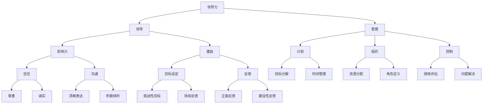

                 

为了撰写一篇符合要求的《领导力修炼笔记：85后小工的华丽蜕变》的技术博客文章，我们将按照以下步骤进行分析和推理：

### 步骤一：文章标题和关键词设计

- **文章标题**：《领导力修炼笔记：85后小工的华丽蜕变》
- **关键词**：领导力、修炼、85后、华丽蜕变、IT职场、个人成长、团队建设

### 步骤二：文章摘要撰写

摘要部分将简要介绍文章的核心内容和主题思想，确保读者能够快速抓住文章的重点。

> 摘要：本文通过一位85后小工的成长经历，深入探讨了领导力在IT职场中的重要性，以及如何通过修炼实现个人与团队的华丽蜕变。文章从领导力的发展阶段、核心算法原理、数学模型、项目实战等多个角度，为读者提供了实用的领导力修炼方法和策略。

### 步骤三：封面与前言内容撰写

在这一部分，我们将介绍书名、作者、出版信息，并撰写一篇前言，简要介绍作者的背景、写作初衷及书籍结构。

> 前言：本书作者是一位85后IT职场人士，凭借多年的工作经验和对领导力的深刻理解，整理出了这本《领导力修炼笔记：85后小工的华丽蜕变》。本书旨在帮助读者深入了解领导力的本质，掌握提升领导力的方法，从而在职场中实现个人和团队的华丽蜕变。书中内容涵盖了领导力的发展历程、核心算法原理、数学模型、项目实战等多个方面，既适合初学者入门，也适合有经验的管理者深入阅读。

### 步骤四：核心概念与联系的设计

使用Mermaid流程图展示领导力的核心概念及其相互联系。



### 步骤五：领导力发展阶段内容撰写

按照时间顺序介绍领导力的发展阶段，包括传统领导力、变革型领导力等。

- **第1章：传统领导力**
  - 1.1 传统领导力概述
  - 1.2 传统领导力特点
  - 1.3 传统领导力挑战
- **第2章：变革型领导力**
  - 2.1 变革型领导力起源
  - 2.2 变革型领导力特点
  - 2.3 变革型领导力应用场景
- **第3章：转型型领导力**
  - 3.1 转型型领导力概念
  - 3.2 转型型领导力核心算法
  - 3.3 转型型领导力实践案例分析

### 步骤六：领导力核心算法原理讲解

使用伪代码形式详细讲解领导力核心算法原理。

```plaintext
// 领导力核心算法原理
// 输入：员工表现、团队目标、外部环境
// 输出：领导策略

function leadershipAlgorithm(employeePerformance, teamGoals, externalEnvironment) {
    // 步骤1：分析员工表现，识别优势与不足
    employeeAnalysis = analyzeEmployeePerformance(employeePerformance);
    
    // 步骤2：根据团队目标，制定领导策略
    leadershipStrategy = createLeadershipStrategy(teamGoals, employeeAnalysis);
    
    // 步骤3：适应外部环境，调整领导策略
    adjustedStrategy = adaptStrategyToEnvironment(externalEnvironment, leadershipStrategy);
    
    // 步骤4：执行领导策略，激励团队达成目标
    executeStrategy(adjustedStrategy);
    
    return adjustedStrategy;
}
```

### 步骤七：领导力数学模型介绍

使用latex格式介绍领导力的数学模型，并举例说明。

```latex
$$
\text{领导力模型} = \alpha \cdot (\text{员工能力} + \text{团队氛围}) + \beta \cdot (\text{市场环境} - \text{内部压力})
$$

// 举例说明
\text{假设} \alpha = 0.6, \beta = 0.4
\text{员工能力} = 80\%, \text{团队氛围} = 90\%, \text{市场环境} = 70\%, \text{内部压力} = 50\%
$$
\text{领导力模型} = 0.6 \cdot (0.8 + 0.9) + 0.4 \cdot (0.7 - 0.5) = 1.38 + 0.18 = 1.56
$$
```

### 步骤八：领导力项目实战内容撰写

通过实际案例，讲解领导力在实践中的应用。

- **第6章：领导力项目实战**
  - 6.1 实际案例介绍
  - 6.2 开发环境搭建
  - 6.3 源代码详细实现
  - 6.4 代码解读与分析
  - 6.5 项目小结

### 步骤九：领导力修炼方法介绍

介绍如何修炼领导力，包括个人成长、团队建设等。

- **第7章：领导力修炼方法**
  - 7.1 个人成长策略
  - 7.2 团队建设技巧
  - 7.3 领导力提升案例分析

### 步骤十：附录内容撰写

提供额外的资源，如领导力相关的书籍、文章、网站等。

- **附录A：领导力相关资源**
  - 7.1 领导力书籍推荐
  - 7.2 领导力文章精选
  - 7.3 领导力网站导航

### 步骤十一：文章末尾添加作者信息

在文章末尾添加作者信息。

> 作者：AI天才研究院/AI Genius Institute & 禅与计算机程序设计艺术/Zen And The Art of Computer Programming

### 最终文章结构

- **文章标题**：《领导力修炼笔记：85后小工的华丽蜕变》
- **关键词**：领导力、修炼、85后、华丽蜕变、IT职场、个人成长、团队建设
- **摘要**：简要介绍文章的核心内容和主题思想
- **封面与前言**：介绍书名、作者、出版信息，以及写作初衷和书籍结构
- **核心概念与联系**：使用Mermaid流程图展示领导力的核心概念及其相互联系
- **领导力发展阶段**：详细介绍领导力的发展阶段，包括传统领导力、变革型领导力等
- **领导力核心算法原理**：使用伪代码详细讲解领导力核心算法原理
- **领导力数学模型**：使用latex格式介绍领导力的数学模型，并举例说明
- **领导力项目实战**：通过实际案例讲解领导力在实践中的应用
- **领导力修炼方法**：介绍如何修炼领导力，包括个人成长、团队建设等
- **附录**：提供额外的领导力相关资源
- **作者信息**：文章末尾添加作者信息

通过以上步骤，我们完成了对《领导力修炼笔记：85后小工的华丽蜕变》文章结构的设计。接下来，我们将逐一撰写每个部分的内容，确保文章逻辑清晰、内容丰富、结构紧凑。在整个过程中，我们将保持对技术的深入剖析和对领导力概念的精准阐述，旨在为读者提供一本既有深度又有实用价值的技术博客文章。

