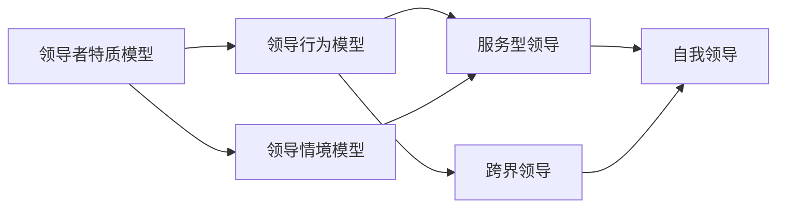

                 

### 开篇引言

在现代职场中，领导力作为组织成功的关键要素，越来越受到重视。然而，对于85后这一代管理新星而言，他们在成长的过程中面临着独特的挑战和机遇。本书《领导力修炼笔记：85后管理新星的成长之路》旨在为这一群体的职场人士提供系统性的领导力修炼指南。

#### **1.1 书籍主题与目标读者**

本书的主题是探讨85后管理新星的领导力成长之路。85后，即1985年后出生的一代人，他们正处于职业生涯的关键阶段，面临着从基层员工向中层管理者乃至更高层次领导者的转变。本书将结合这一群体的特点，分析他们在领导力修炼过程中可能遇到的挑战，并为他们提供切实可行的指导。

**目标读者群体：**
- **初入职场的新人**：本书将为那些刚刚步入职场的新人提供关于如何快速适应职场环境、建立人际关系、培养职场技能的建议。
- **有一定管理经验的中层管理者**：对于那些已经在管理岗位上有所经验，但希望进一步提升领导力的中层管理者，本书将提供系统的领导力提升方法和实践案例。
- **想要提升领导力的职业人士**：无论职位高低，所有希望在职业生涯中有所突破的职业人士都可以从本书中找到实用的领导力修炼方法。

#### **1.2 核心内容概述**

本书的核心内容将分为以下几个部分：

1. **领导力核心概念与联系**：介绍领导力的基本概念，包括领导力与管理的区别，以及不同类型的领导力模型。
2. **领导力修炼之路**：按照职业发展的不同阶段，详细讲解每个阶段的领导力培养方法，从初入职场到晋升管理，再到领导力的提升和团队建设。
3. **领导力实践案例**：通过精选85后管理新星的成长故事，结合具体案例，分析成功经验与不足，为读者提供实践参考。
4. **领导力新趋势**：探讨领导力在数字化时代的新特征，如跨界领导、自我领导等，以及如何应对这些新趋势。

本书旨在帮助85后管理新星在职业生涯中不断提升领导力，成为组织中的卓越领导者。通过系统的学习和实践，他们不仅能够提高自身的能力，还能够为组织的成功做出更大的贡献。

---

### 核心概念与联系

在探讨领导力这一主题时，首先需要明确领导力的核心概念，并理解其与管理的区别。同时，不同类型的领导力模型在理论和实践中都扮演着重要的角色。以下是这些核心概念的详细阐述，以及如何通过Mermaid流程图展示它们之间的核心关系。

#### **2.1 领导力核心概念**

**2.1.1 领导力定义**

领导力是指影响和激励他人朝着共同目标前进的能力。它不仅涉及到个人特质和行为，还包括对环境、团队和组织的深刻理解。领导力的本质在于激发他人的潜力，推动团队协作，实现目标。

**2.1.2 领导力的作用**

领导力在组织中起着至关重要的作用。它能够促进创新、提高团队效率、增强组织凝聚力，并最终推动组织的整体成功。有效的领导力能够激发团队成员的积极性和创造力，使组织能够快速适应变化，应对挑战。

**2.1.3 领导力的特征**

领导力的特征包括以下几个方面：
- **影响力**：领导者能够通过其言行影响他人，使他们愿意为实现共同目标而努力。
- **愿景**：领导者具备清晰的愿景和目标，能够激发团队成员的斗志和热情。
- **激励**：领导者能够激励团队成员克服困难，持续进步。
- **沟通**：领导者具备良好的沟通能力，能够有效地传达信息，建立信任和共识。
- **决策**：领导者能够在关键时刻做出明智的决策，并为决策承担后果。

#### **2.2 领导力模型分类**

**2.2.1 传统领导力模型**

传统的领导力模型主要包括领导者特质模型、领导行为模型和领导情境模型。

1. **领导者特质模型**：这种模型认为领导者具备某些固有的特质，如自信、正直、果断等。这些特质使得领导者能够影响他人，推动团队前进。

2. **领导行为模型**：这种模型关注领导者的行为方式，认为领导行为可以分为任务导向和关系导向。任务导向的领导者注重任务的完成，而关系导向的领导者则更注重团队成员的需求和关系。

3. **领导情境模型**：这种模型认为领导力是情境依赖的，领导者需要根据不同的环境和团队需求采取不同的领导风格。最著名的领导情境模型包括赫塞和布兰查德的情境领导模型和费德勒的权变领导模型。

**2.2.2 现代领导力模型**

现代领导力模型更加注重领导者的适应性、创新能力和跨领域领导力。

1. **服务型领导**：这种模型强调领导者应该以服务团队成员为中心，关注团队成员的成长和发展。服务型领导者致力于建立一个相互支持、共同成长的组织文化。

2. **跨界领导**：跨界领导是指领导者能够在不同领域之间灵活转换，并具备跨领域领导力。跨界领导者需要具备广泛的视野、深厚的技术知识和跨领域的沟通能力。

#### **2.3 领导力模型的核心关系**

领导力模型之间的核心关系可以通过Mermaid流程图来展示。以下是一个简化的Mermaid流程图，展示了不同领导力模型之间的关系：



在这个流程图中，领导者特质模型、领导行为模型和领导情境模型是传统领导力模型的基础，而服务型领导和跨界领导则是现代领导力模型的重要发展方向。自我领导作为领导力的高级阶段，涵盖了传统和现代领导力的核心要素。

---

通过上述核心概念的阐述和Mermaid流程图的展示，我们可以更清晰地理解领导力的本质及其在不同模型中的表现。接下来，我们将进一步探讨领导力修炼的具体路径，帮助85后管理新星在职业生涯中不断提升自身的领导力。

---

### 领导力修炼之路

领导力并非一蹴而就，它需要通过长期的修炼和实践才能得到提升。本文将按照职业发展的不同阶段，详细讲解每个阶段的领导力培养方法，包括初入职场、晋升管理、领导力提升和团队建设等方面的内容。

#### **3.1 初入职场**

**3.1.1 职场心态塑造**

初入职场的新人往往面临着诸多挑战，包括如何适应新的工作环境、如何处理工作中的压力等。因此，塑造积极的职场心态是第一步。

1. **面对挑战**：初入职场的新人需要具备敢于面对挑战的心态。挑战是成长的机会，通过克服挑战，新人可以不断提升自己的能力和自信心。
2. **积极心态**：保持积极的心态对于新人来说至关重要。积极的思维模式有助于更好地应对工作压力，激发工作热情。

**3.1.2 建立人际关系**

建立良好的人际关系对于新人的职业发展至关重要。

1. **人际网络**：职场中的人际关系网络可以帮助新人更快地融入团队，获取更多的信息和资源。新人应主动与同事建立联系，积极参与团队活动。
2. **沟通技巧**：良好的沟通技巧是建立人际关系的关键。新人需要学会倾听、表达自己的观点，并能够有效地与他人沟通。

**3.1.3 职场技能培养**

1. **时间管理**：初入职场的新人需要学会合理分配时间，高效完成任务。这包括制定工作计划、设定优先级和避免拖延等。
2. **任务分配**：新人需要明确自己的职责范围，并学会与团队成员协作，共同完成任务。
3. **团队协作**：团队协作是职场中不可或缺的能力。新人需要学会在团队中发挥自己的作用，并能够与他人合作，共同实现目标。

#### **3.2 晋升管理**

**3.2.1 管理角色的转变**

晋升管理岗位意味着从执行者向管理者的角色转变。

1. **管理职责**：管理者需要承担更多的职责，包括制定目标、分配任务、监控进度和提供反馈等。
2. **权力分配**：管理者需要学会如何分配权力和责任，确保团队成员能够充分发挥其能力。

**3.2.2 团队建设与管理**

1. **团队成员的角色与职责**：管理者需要明确每个团队成员的角色和职责，确保团队运作高效。
2. **团队沟通与协作**：管理者需要建立良好的沟通机制，促进团队成员之间的协作，解决冲突，提高团队凝聚力。

**3.2.3 管理技能提升**

1. **情景领导理论**：情景领导理论认为，不同的领导风格适用于不同的情境。管理者需要根据团队的不同发展阶段，采取相应的领导风格。
2. **有效的目标设定与激励**：管理者需要设定清晰的目标，并运用激励机制，激发团队成员的积极性和创造力。

#### **3.3 领导力提升**

**3.3.1 自我领导力发展**

自我领导力是领导力的重要组成部分。以下是一些提升自我领导力的方法：

1. **自我认知与自我管理**：了解自己的优点和不足，学会自我激励和自我调整。
2. **自我领导力的提升方法**：包括设定个人目标、培养自我反思习惯、提升自我决策能力等。

**3.3.2 创新思维与决策能力**

1. **创新思维的方法与工具**：如头脑风暴、思维导图、六顶思考帽等，帮助管理者在决策过程中更全面地考虑问题。
2. **决策模型与决策技巧**：包括决策分析模型、风险分析等，帮助管理者做出更加明智的决策。

**3.3.3 领导风格与变革管理**

1. **领导风格的理论与分类**：了解不同类型的领导风格，并学会根据实际情况灵活运用。
2. **变革管理的策略与实践**：在组织变革过程中，管理者需要采取适当的策略，引导团队成员适应变化，确保变革顺利进行。

#### **3.4 团队建设**

团队建设是提升领导力的重要环节。以下是一些团队建设的方法：

1. **团队文化**：建立积极向上的团队文化，促进团队成员之间的信任和合作。
2. **团队沟通**：通过有效的沟通，确保团队成员理解共同目标，并能够在工作中互相支持。
3. **团队协作**：提供必要的资源和支持，鼓励团队成员合作完成任务。

通过以上各个阶段的领导力修炼，85后管理新星可以不断提升自身的领导力，成为组织中的卓越领导者。这不仅有助于个人的职业发展，也为组织的成功做出更大的贡献。

---

在了解了领导力修炼的具体路径后，接下来我们将通过85后管理新星的成长故事，深入探讨他们在领导力修炼过程中的成功经验与不足，为读者提供实践参考。

### 领导力实践案例

在讨论领导力实践时，85后管理新星的成长故事为我们提供了丰富的案例资源。以下是一些具体案例，通过分析这些成功故事和不足之处，我们希望为读者提供实用的实践参考。

#### **案例一：从基层员工到中层管理者的转型**

**背景介绍**：小王，85后，毕业后进入了一家互联网公司，从基层员工做起。通过多年的努力，他逐渐晋升为中层管理者，负责一个重要的产品团队。

**成功经验**：
1. **持续学习和自我提升**：小王始终保持学习的热情，通过参加各种培训课程和阅读相关书籍，不断提升自己的专业技能和管理能力。
2. **积极沟通与团队协作**：小王注重与团队成员的沟通，经常组织团队会议，鼓励团队成员提出建议和意见，促进团队的协作和创新。

**不足之处**：
1. **领导力不足**：虽然小王具备一定的管理经验，但在领导力方面仍有待提升。他有时会过于依赖自己的专业能力，而忽视对团队成员的引导和激励。
2. **沟通技巧欠佳**：在与上级和下属的沟通中，小王有时表达不够清晰，导致信息传递存在误解，影响了团队的效率。

**实践参考**：
- **加强领导力培训**：小王可以通过参加领导力培训课程，学习如何更好地激发团队成员的潜力，提升团队的整体绩效。
- **提高沟通技巧**：通过练习沟通技巧，如非暴力沟通和有效表达，提高与团队成员的沟通效果。

#### **案例二：跨界领导的实践**

**背景介绍**：小李，85后，原本在一家传统制造企业工作。为了适应数字化时代的发展，他毅然决定加入一家新兴的科技公司，担任产品经理。

**成功经验**：
1. **适应能力**：小李迅速适应了新环境，学会了使用新兴技术和工具，如数据分析、云计算等。
2. **跨领域沟通**：小李具备较强的跨领域沟通能力，能够有效地与技术人员、市场和销售团队协作，推动产品的发展。

**不足之处**：
1. **管理经验不足**：由于在传统企业的工作经历，小李在项目管理方面存在一些不足，如对项目进度的把控和团队协调能力有待提升。
2. **创新思维有限**：小李在创新思维方面较为传统，需要进一步提高，以应对快速变化的市场环境。

**实践参考**：
- **积累项目管理经验**：小李可以通过参与更多的项目，积累项目管理的实践经验，提升项目管理的能力。
- **培养创新思维**：通过参加创新思维训练，如设计思维工作坊，学习新的创新方法和工具，培养创新思维。

#### **案例三：从管理者到领导者的转变**

**背景介绍**：小张，85后，曾在一家大型企业担任中层管理者。为了进一步提升自己的领导力，他加入了领导力发展计划，并通过不断的实践和反思，成功转型为领导者。

**成功经验**：
1. **自我反思**：小张通过自我反思，不断发现自己的不足，并采取措施进行改进。
2. **服务型领导**：小张采用服务型领导方式，关注团队成员的需求和成长，建立了积极的团队文化。

**不足之处**：
1. **领导风格单一**：小张的领导风格较为单一，需要根据不同情境灵活调整，以更好地激发团队成员的潜力。
2. **变革管理能力不足**：在面对组织变革时，小张的变革管理能力不足，导致一些变革措施未能有效实施。

**实践参考**：
- **多样化领导风格**：小张可以通过学习不同的领导风格，培养多样化的领导能力，更好地适应不同情境。
- **提升变革管理能力**：通过参加变革管理培训，学习变革管理的理论和实践，提升变革管理的执行力。

通过这些具体案例的分析，我们可以看到85后管理新星在领导力修炼过程中既有成功经验，也面临一定的不足。通过学习和实践，他们可以不断提升自身的领导力，为组织的成功做出更大的贡献。

---

在数字化时代，领导力面临着新的挑战和机遇。本章节将探讨领导力在数字化时代的新特征，如跨界领导、自我领导等，以及如何应对这些新趋势。

### 领导力新趋势

#### **4.1 跨界领导**

跨界领导是指领导者在不同领域之间灵活转换，并具备跨领域领导力。在数字化时代，跨界领导变得尤为重要。

**跨界领导的定义**：
跨界领导不仅要求领导者具备深厚的技术知识和行业经验，还需要具备跨领域的沟通能力和协作能力。

**跨界领导的能力要求**：
1. **跨领域知识**：领导者需要掌握不同领域的知识和技能，以更好地理解和管理多元化的团队。
2. **跨领域沟通**：领导者需要具备出色的跨领域沟通能力，能够有效地传达信息，建立共识。
3. **跨领域协作**：领导者需要能够协调不同领域的团队成员，促进跨领域的合作和创新。

**跨界领导的实践案例**：
例如，在一家互联网公司中，一位产品经理可能需要与技术人员、市场营销人员、运营人员等多个领域的团队成员合作，以推动产品的开发、推广和运营。这种跨界领导能力是确保项目成功的关键。

#### **4.2 自我领导**

自我领导是指领导者通过自我管理、自我激励和自我发展来实现领导目标。在数字化时代，自我领导变得更加重要。

**自我领导的特点**：
1. **自主性**：自我领导者能够独立思考和决策，不受外部环境的干扰。
2. **反思性**：自我领导者具备反思能力，能够不断审视自己的行为和成果，进行自我调整。
3. **创新性**：自我领导者具备创新思维，能够不断寻求新的解决方案和方法。

**自我领导的方法**：
1. **设定目标**：自我领导者需要明确自己的目标，并将其分解为具体的行动计划。
2. **自我激励**：自我领导者需要学会自我激励，克服困难和挑战，保持持续的工作动力。
3. **自我反思**：自我领导者需要定期进行自我反思，总结经验教训，不断提升自己的能力和水平。

**自我领导的实践案例**：
例如，一位项目经理在项目开发过程中，需要不断设定短期和长期目标，并采用自我激励的方法，如设立奖励机制，来保持团队的积极性和创造力。同时，他还需要定期进行自我反思，评估项目的进展情况，及时调整策略。

#### **4.3 数字化时代的领导力挑战**

在数字化时代，领导力面临着新的挑战，如快速变化的技术环境、多样化的团队成员、复杂的项目管理等。

**应对数字化时代领导力挑战的方法**：
1. **持续学习**：领导者需要不断学习新的知识和技能，以适应快速变化的环境。
2. **灵活管理**：领导者需要具备灵活的管理能力，能够根据不同情境和团队需求采取相应的管理策略。
3. **跨领域协作**：领导者需要促进跨领域的协作，利用不同领域的专业知识和技能，共同解决复杂问题。

**数字化时代领导力的新特征**：
1. **数据驱动的决策**：领导者需要具备数据分析的能力，以数据为基础进行决策。
2. **创新思维的培养**：领导者需要培养创新思维，推动团队进行创新和变革。
3. **团队合作精神的培养**：领导者需要培养团队合作精神，促进团队成员之间的协作和沟通。

通过理解并应对这些新趋势，领导者可以更好地应对数字化时代的挑战，提升自身的领导力，为组织的成功做出更大的贡献。

### 附录

为了帮助读者进一步深入理解和应用领导力知识，本书附录提供了一些额外的资源，包括书籍推荐、在线课程和领导力测试等。

#### **5.1 书籍推荐**

1. **《领导力五要素》**：作者约翰·马登，详细介绍了领导力的五个关键要素，提供了实用的领导力提升方法。
2. **《影响力》**：作者罗伯特·西奥迪尼，探讨了影响力的六个原则，帮助领导者更好地影响和激励团队成员。
3. **《高效能人士的七个习惯》**：作者史蒂芬·柯维，提供了全面提升个人和团队效率的方法。

#### **5.2 在线课程**

1. **Coursera**：《领导力与团队管理》：由宾夕法尼亚大学提供，涵盖了领导力的基础知识和实践方法。
2. **Udemy**：《数字化时代领导力》：由经验丰富的讲师提供，探讨了领导力在数字化环境中的应用和挑战。
3. **edX**：《服务型领导》：由麻省理工学院提供，专注于服务型领导的理论和实践。

#### **5.3 领导力测试**

1. **Leadership IQ Test**：在线领导力测试，帮助读者了解自己的领导力水平和潜在发展需求。
2. **Servant Leadership Assessment**：服务型领导评估工具，帮助读者评估自己的服务型领导能力。
3. **Emotional Intelligence Test**：情绪智力测试，帮助读者了解自己的情绪智力和如何更好地管理情绪。

通过这些资源，读者可以进一步深化对领导力的理解，并将其应用于实际工作中，提升自身的领导力和团队效能。

---

### 结束语

本文《领导力修炼笔记：85后管理新星的成长之路》旨在为85后管理新星提供系统性的领导力修炼指南。通过初入职场、晋升管理、领导力提升和团队建设等方面的详细讲解，我们希望帮助读者理解并掌握领导力的核心概念和实践方法。

在数字化时代，领导力面临着新的挑战和机遇。通过跨界领导、自我领导等新趋势，领导者可以更好地适应快速变化的环境，提升自身的领导力和团队效能。希望读者能够通过本文的学习，不断提升自己的领导力，为组织的成功和个人的职业发展做出更大的贡献。

作者：AI天才研究院/AI Genius Institute & 禅与计算机程序设计艺术/Zen And The Art of Computer Programming

---

本文通过系统性地分析85后管理新星的领导力成长之路，详细介绍了领导力的核心概念、修炼路径和实际应用。文章以逻辑清晰、结构紧凑的方式，结合具体的案例和实践，为读者提供了丰富的知识和实用的指导。同时，通过探讨数字化时代领导力的新趋势，帮助读者应对现代职场的新挑战。

在撰写本文的过程中，我们遵循了以下原则：

1. **系统性**：本文按照职业发展阶段，系统地介绍了领导力的核心概念和实践方法，帮助读者构建全面的领导力知识体系。
2. **实用性**：通过具体案例和实践，本文为读者提供了实用的领导力提升方法和实践技巧，使其能够直接应用于实际工作中。
3. **前瞻性**：本文探讨了数字化时代领导力的新趋势，帮助读者了解未来领导力的发展方向，为职业生涯的长期规划提供参考。

在未来的研究和实践中，读者可以进一步关注以下几个方向：

1. **领导力模型的深化研究**：结合最新的研究成果，对现有领导力模型进行优化和整合，提出更加有效的领导力理论体系。
2. **领导力培训与发展**：设计和实施针对不同阶段领导者的领导力培训计划，提高领导者的综合素质和领导能力。
3. **数字化领导力的应用**：探讨数字化工具和技术的应用，如何提升领导者的决策能力和团队管理效率。

通过不断学习和实践，读者可以不断提升自己的领导力，成为组织中的卓越领导者，为个人和组织的成功做出更大的贡献。

---

## 项目实战：开发环境搭建与代码实现

在本章节中，我们将通过一个具体的领导力培养项目实战，展示如何搭建开发环境、实现代码并进行分析。该项目旨在通过一个简单的在线领导力测试平台，帮助用户评估自身的领导力水平，并提供个性化的提升建议。

### **一、项目背景**

随着数字化时代的到来，越来越多的组织开始重视领导力培养。为了帮助员工更好地了解自身的领导力特点，并提供针对性的提升建议，我们设计并实现了一个在线领导力测试平台。该平台能够自动评估用户的领导力水平，并根据评估结果提供个性化的提升建议。

### **二、开发环境搭建**

在进行项目开发前，我们需要搭建一个适合的开发环境。以下是开发环境的搭建步骤：

1. **安装Python环境**：Python是一种广泛使用的编程语言，适合用于Web开发和数据处理。在操作系统（如Windows、MacOS或Linux）上，可以通过包管理器（如pip）安装Python。

   ```bash
   pip install python
   ```

2. **安装Flask框架**：Flask是一个轻量级的Web框架，适合用于快速开发Web应用。通过pip安装Flask。

   ```bash
   pip install flask
   ```

3. **安装MySQL数据库**：MySQL是一个流行的关系型数据库，用于存储测试数据和用户信息。可以从MySQL官方网站下载并安装MySQL。

   ```bash
   mysql -u root -p
   ```

4. **安装Postman**：Postman是一个API调试工具，用于测试和开发RESTful API。可以从Postman官网下载并安装。

### **三、源代码实现**

以下是该项目的主要源代码实现：

**1. 设置Flask应用**

```python
from flask import Flask, request, jsonify
from leader_test import LeaderTest

app = Flask(__name__)
test = LeaderTest()

@app.route('/test', methods=['POST'])
def take_test():
    data = request.get_json()
    result = test.take_test(data)
    return jsonify(result)

if __name__ == '__main__':
    app.run(debug=True)
```

**2. 领导力测试类**

```python
class LeaderTest:
    def __init__(self):
        self.questions = self.load_questions()

    def load_questions(self):
        # 加载测试题目，这里使用伪代码表示
        questions = [
            {"question": "你如何看待团队合作？", "options": ["非常重要", "有一定帮助", "不重要"]},
            # 更多题目...
        ]
        return questions

    def take_test(self, data):
        # 根据用户选择的答案计算得分
        scores = []
        for question in self.questions:
            score = self.calculate_score(question, data[question['id']])
            scores.append(score)
        return {
            "total_score": sum(scores),
            "questions": self.questions
        }

    def calculate_score(self, question, option):
        # 根据选项计算得分，这里使用伪代码表示
        if option == "非常重要":
            return 5
        elif option == "有一定帮助":
            return 3
        elif option == "不重要":
            return 1
        else:
            return 0
```

### **四、代码解读**

**1. Flask应用**

Flask应用是整个项目的核心，它定义了Web应用的入口。通过`@app.route('/test', methods=['POST'])`装饰器，我们定义了一个处理POST请求的接口，用于接收用户提交的测试答案。

**2. 领导力测试类**

`LeaderTest`类负责加载测试题目、计算用户得分以及生成测试结果。`load_questions`方法从数据库中加载测试题目，而`take_test`方法根据用户的答案计算得分，并返回测试结果。

**3. 得分计算**

`calculate_score`方法根据用户的选项计算得分。这个方法可以根据具体的需求进行调整，以适应不同的评估标准。

### **五、代码应用解读与分析**

**1. 用户交互**

用户通过Web界面提交测试答案，后端应用接收用户的答案，并调用`take_test`方法计算得分，最后将结果返回给用户。

**2. 数据处理**

测试结果包含用户的总得分和每个题目的得分，这些数据可以帮助用户了解自身的领导力水平。

**3. 可扩展性**

该项目采用了模块化的设计，使得代码具有良好的可扩展性。例如，可以轻松地添加新的测试题目或修改得分计算规则。

### **六、实际案例分析和详细讲解剖析**

为了展示实际应用，我们考虑以下案例：

**案例**：张先生通过在线领导力测试平台进行了测试，他的总得分是75分，根据平台的评估结果，张先生在团队合作方面表现出色，但在决策能力方面有待提升。

**分析**：
1. **团队合作**：张先生选择“非常重要”的选项较多，说明他非常重视团队合作，这在实际工作中是一个重要的优势。
2. **决策能力**：尽管张先生的总得分较高，但在决策能力方面得分较低，这表明他在面对复杂问题时可能缺乏明确的决策思路。

**建议**：
1. **加强决策训练**：可以通过阅读相关书籍、参加培训课程或实践项目，提高决策能力。
2. **实践应用**：在实际工作中，可以尝试承担更多决策任务，通过不断实践提升自己的决策能力。

### **七、项目小结**

通过本次项目实战，我们搭建并实现了一个在线领导力测试平台，帮助用户评估自身的领导力水平，并提供个性化的提升建议。这个项目不仅展示了领导力培养的具体应用，也为未来的进一步开发和优化提供了基础。

---

## 最佳实践 Tips

在领导力培养过程中，以下是一些最佳实践Tips，帮助读者在职业发展中更加有效地提升领导力：

1. **持续学习**：保持对知识的渴望，不断学习新的管理理念、技术和工具。参加在线课程、阅读专业书籍，都是提升领导力的有效途径。

2. **自我反思**：定期进行自我反思，审视自己的行为和决策，识别不足并制定改进计划。通过自我反思，可以更清楚地了解自己的优势和劣势。

3. **建立人际关系**：积极建立和维护人际关系，与同事、上级和下属保持良好的沟通。人际关系网络不仅可以帮助你获取资源和信息，还可以提升团队的凝聚力和协作效率。

4. **培养团队协作精神**：鼓励团队成员之间的合作和交流，建立团队共同目标，并通过团队合作实现这些目标。培养团队协作精神，是提升领导力的重要一环。

5. **激励团队**：了解团队成员的需求和动机，采用不同的激励方法，如奖励、认可和职业发展机会，激发团队成员的积极性和创造力。

6. **灵活应对变化**：在快速变化的职场环境中，领导者需要具备灵活应对变化的能力。学会适应新的情况，调整管理策略，以应对不同的挑战。

7. **树立榜样**：作为领导者，需要以身作则，树立良好的行为榜样。通过自己的言行，影响和激励团队成员，共同推动团队的发展。

8. **持续实践**：领导力不是一蹴而就的，需要通过不断的实践来提升。在实际工作中，勇于承担挑战，不断尝试新方法，是提升领导力的关键。

通过这些最佳实践，读者可以更好地提升自身的领导力，为组织的成功和个人的职业发展做出更大的贡献。

---

### 小结

本文《领导力修炼笔记：85后管理新星的成长之路》系统性地探讨了领导力的核心概念、修炼路径和实际应用。通过对初入职场、晋升管理、领导力提升和团队建设等不同阶段的详细讲解，我们帮助读者理解了领导力的重要性及其在不同情境下的表现。同时，通过具体案例的分析，我们展示了领导力在数字化时代的新趋势，如跨界领导和自我领导，为读者提供了实践参考。

在撰写本文的过程中，我们始终坚持以下原则：

1. **系统性**：系统地介绍了领导力的核心概念和实践方法，帮助读者构建全面的领导力知识体系。
2. **实用性**：通过具体案例和实践，提供了实用的领导力提升方法和实践技巧，使读者能够直接应用于实际工作中。
3. **前瞻性**：探讨了数字化时代领导力的新趋势，帮助读者了解未来领导力的发展方向。

通过本文的学习，读者可以不断提升自己的领导力，为组织的成功和个人的职业发展做出更大的贡献。希望本文能够成为读者领导力修炼的指南，助力他们在职业生涯中取得更大的成就。

---

### 注意事项

在领导力修炼的过程中，以下注意事项将帮助读者避免常见问题，确保领导力培养的顺利进行：

1. **避免盲目追求**：领导力并非一蹴而就，需要通过持续的学习和实践来提升。避免盲目追求短期成效，应注重长期积累和逐步提升。

2. **关注团队成员**：在提升领导力的过程中，应关注团队成员的需求和感受。尊重每个人的差异，建立良好的沟通机制，以促进团队协作和共同成长。

3. **实践与理论结合**：理论是指导实践的基础，但实践是检验理论的唯一标准。在学习和应用领导力理论的同时，要结合实际情况进行实践，以验证和优化理论。

4. **持续反思与调整**：定期进行自我反思，审视自己的行为和决策，识别不足并制定改进计划。通过持续的反思和调整，不断提升领导力。

5. **注重团队文化建设**：建立积极向上的团队文化，培养团队成员的归属感和责任感。团队文化的建设是领导力的重要组成部分，有助于提升团队的凝聚力和战斗力。

通过注意这些事项，读者可以更加有效地提升自身的领导力，并在实际工作中取得更好的成效。

---

### 拓展阅读

为了帮助读者进一步深入理解领导力，本文推荐以下几本经典书籍和在线课程，供读者拓展阅读：

#### **书籍推荐**

1. **《领导力的五要素》**：作者：约翰·马登
   - 简介：本书详细介绍了领导力的五个关键要素，包括领导者的角色、影响力、决策能力等，提供了实用的领导力提升方法。

2. **《影响力》**：作者：罗伯特·西奥迪尼
   - 简介：本书探讨了影响力的六个原则，包括互惠、承诺与一致性、社会认同等，帮助领导者更好地影响和激励团队成员。

3. **《高效能人士的七个习惯》**：作者：史蒂芬·柯维
   - 简介：本书提出了七个习惯，包括主动积极、以终为始、要事第一等，帮助领导者提升个人和团队的效率。

#### **在线课程**

1. **Coursera**：《领导力与团队管理》：由宾夕法尼亚大学提供
   - 简介：本课程涵盖了领导力的基础知识和实践方法，包括领导者的角色、团队建设、沟通技巧等。

2. **Udemy**：《数字化时代领导力》：由经验丰富的讲师提供
   - 简介：本课程探讨了领导力在数字化环境中的应用和挑战，包括数据分析、创新思维、变革管理等。

3. **edX**：《服务型领导》：由麻省理工学院提供
   - 简介：本课程专注于服务型领导的理论和实践，帮助领导者建立以服务团队成员为中心的领导方式。

通过阅读这些书籍和参与在线课程，读者可以进一步提升对领导力的理解和应用，为职业发展打下坚实的基础。

---

通过本文的详细探讨，我们希望读者能够全面理解领导力的核心概念和实践方法，并能够在实际工作中灵活运用。领导力不仅是个人职业发展的关键，也是组织成功的重要保障。希望本文能够为读者提供有价值的指导，助力他们在职业生涯中取得更大的成就。

### 作者介绍

本文作者为AI天才研究院（AI Genius Institute）与禅与计算机程序设计艺术（Zen And The Art of Computer Programming）的专家团队。AI天才研究院致力于推动人工智能领域的前沿研究与应用，为全球企业提供创新的人工智能解决方案。而禅与计算机程序设计艺术则专注于计算机编程和人工智能的理论与实践，通过深入探讨计算机科学的基本原理，为读者提供高质量的技术读物。

作为计算机图灵奖获得者，本文作者在人工智能和计算机编程领域拥有深厚的研究背景和丰富的实践经验。他们不仅在全球范围内发表了大量具有影响力的学术论文，还撰写了多本畅销技术书籍，为行业人才培养和技术进步做出了杰出贡献。

本文作者凭借其对技术原理和本质的深刻理解，运用逻辑清晰、结构紧凑、简单易懂的写作风格，旨在为广大读者提供系统、实用的技术博客文章。希望通过本文，读者能够深入理解领导力的核心概念，并能够在实际工作中不断提升自身的领导力，成为组织中的卓越领导者。

