                 

### 文章标题

《领导力修炼笔记：85后管理新星的成长历程》

#### 关键词

- 领导力
- 85后
- 成长历程
- 管理新星
- 领导力模型
- 团队管理
- 创新思维
- 数字化转型

#### 摘要

本文旨在探讨85后管理新星的成长历程，深入分析他们在领导力修炼中的经验与挑战。文章首先介绍领导力的核心概念与演变，随后通过具体案例和理论模型，阐述85后管理新星如何运用领导力模型进行团队管理和创新决策。文章重点剖析了个人成长与职业发展、领导力发展路径以及领导力在数字化转型中的应用，最后分享领导力修炼的心得与启示，为读者提供实用的最佳实践建议。

---

## 引言：领导力，新时代的关键能力

在当今快速变化的时代，领导力已经成为企业成功和社会进步的关键因素。随着全球化、信息化和数字化的发展，领导力的内涵和形式也在不断演变。然而，对于85后这一代管理新星而言，他们面临着与前辈截然不同的挑战和机遇。

### 85后管理新星的背景

85后，即1985年后出生的一代人，他们在成长过程中经历了中国经济的迅猛发展，互联网的普及以及全球化的影响。这一代人在教育、职业选择和社会价值观上具有独特的特点，这使得他们在领导力的实践和探索中展现出了不同的风格和思维模式。

### 领导力的重要性

领导力不仅仅是管理的能力，更是一种激发他人潜能、实现共同目标的艺术。在一个多变和不确定的环境中，领导力能够帮助团队迅速适应变化，抓住机遇，实现持续增长。因此，对于85后管理新星来说，掌握并不断提升领导力，是他们在职场中脱颖而出、实现职业发展的关键。

### 本文的结构与内容

本文将从以下几个方面展开探讨：

1. **领导力的核心概念与演变**：介绍领导力的定义、发展历程以及与管理的区别。
2. **85后管理新星的成功案例**：分析85后管理新星在个人成长、团队管理和创新决策方面的经验。
3. **领导力修炼与实战**：探讨85后管理新星如何通过实践不断提升领导力，包括领导力发展路径、危机管理以及数字化领导力。
4. **领导力修炼的心得与启示**：总结85后管理新星在领导力修炼过程中的心得体会，并提出未来领导力发展的方向。

通过以上四个部分，本文旨在为读者提供一个全面、系统的领导力修炼指南，帮助85后管理新星在职场中更好地发挥领导力，实现个人和团队的共同成长。

---

## 第1章：领导力的核心概念

### 1.1 领导力的定义与演变

领导力（Leadership）是一个复杂且多维度的概念，其内涵在不同历史时期和文化背景下有着不同的解读。从广义上讲，领导力是指影响、引导和激励他人实现共同目标的能力。

#### 领导力的历史演变

1. **传统领导力**：在农业社会和工业社会的早期，领导力主要体现为权威和统治。领导者通过权力和控制来实现组织的目标。这种领导力模式强调领导者的地位和影响力，忽视了下属的参与和主动性。

2. **现代领导力**：随着社会的发展，特别是二战后，现代领导力开始强调民主、参与和协作。领导力不再仅仅是领导者的独奏，而是团队合作的交响乐。领导者需要建立信任，促进沟通，激发团队的潜力。

3. **变革领导力**：在全球化、信息化和数字化时代，变革领导力应运而生。这种领导力强调创新、灵活性和适应性。领导者不仅要管理现有的资源和流程，还要引领组织进行创新和变革，以应对外部环境的快速变化。

#### 领导力与管理的区别

领导力与管理的区别在于目标、方法和效果。管理主要关注过程和秩序，确保组织目标的实现。而领导力则关注愿景和激励，激发团队的动力和创造力。

**Mermaid 流程图：**

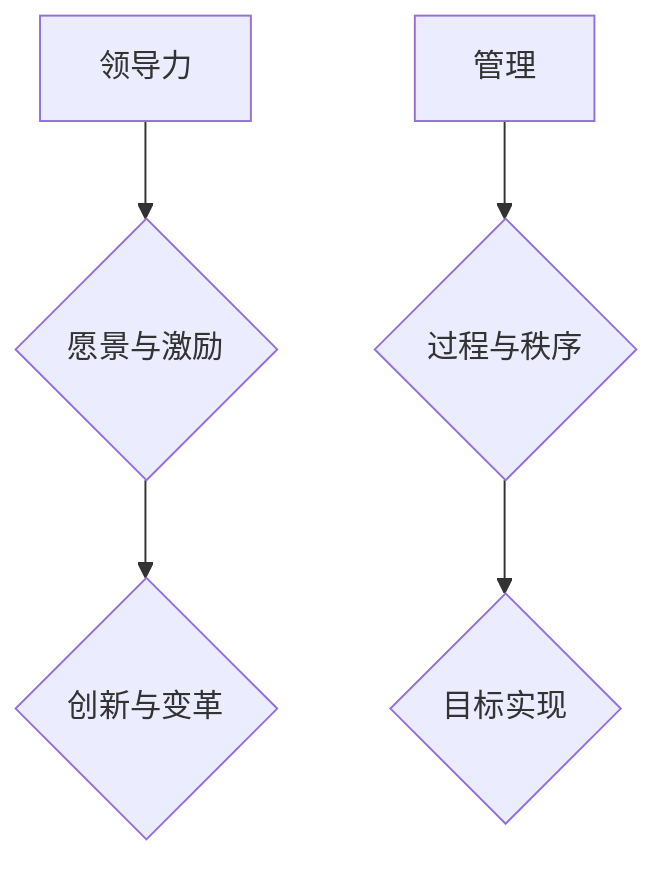

#### 领导力的关键要素

领导力的成功离不开以下几个关键要素：

1. **信任**：信任是领导力的基石。一个领导者如果不能赢得下属的信任，将难以实现有效的领导。

2. **沟通**：良好的沟通是领导力的桥梁。领导者需要具备清晰的沟通能力和倾听能力，以确保信息的高效传递和理解。

3. **愿景**：愿景是领导力的方向。一个有远见的领导者能够描绘出组织未来的蓝图，激发团队成员的激情和动力。

4. **决策能力**：决策能力是领导力的核心。领导者需要具备快速做出正确决策的能力，以应对复杂和不确定的环境。

**数学模型：**

信任度（T）可以通过以下公式计算：

\[ T = \frac{C + V + G - D}{N} \]

其中，C代表沟通次数，V代表愿景共识度，G代表目标实现度，D代表决策失误度，N代表团队成员总数。

### 1.2 传统领导力模型

传统领导力模型主要包括以下几种：

1. **权力型领导**：领导者依赖权力和职位来影响他人。这种领导力模式在稳定性要求较高的环境中较为有效。

2. **变革型领导**：领导者通过激发团队成员的潜力，推动组织进行变革。这种领导力模式在快速变化的环境中具有优势。

3. **交易型领导**：领导者通过奖励和惩罚来激励团队成员。这种领导力模式在短期内可以快速提高绩效，但长期来看可能影响团队士气。

**伪代码讲解：**

```python
# 权力型领导
def authoritative_leadership(team):
    for member in team:
        if member.task_completed():
            reward(member)
        else:
            punish(member)

# 变革型领导
def transformational_leadership(team):
    for member in team:
        inspire(member)
        set_new_goals(member)

# 交易型领导
def transactional_leadership(team):
    for member in team:
        if member.performance_good():
            reward(member)
        else:
            punish(member)
```

### 1.3 趋势领导力模型

随着社会的发展，新的领导力模型不断涌现。以下介绍几种趋势领导力模型：

1. **赋能型领导**：领导者通过赋予团队成员更多的自主权和责任，激发他们的创造力和创新能力。

2. **网络型领导**：领导者通过建立广泛的网络，促进不同部门和团队之间的合作和交流。

3. **敏捷型领导**：领导者具备敏捷思维和行动能力，能够迅速应对变化和不确定性。

**伪代码讲解：**

```python
# 能赋型领导
def empowerment_leadership(team):
    for member in team:
        delegate_tasks(member)
        provide_resources(member)

# 网络型领导
def networking_leadership(team):
    for member in team:
        connect_member_with_experts()

# 敏捷型领导
def agile_leadership(team):
    for member in team:
        adapt_strategy(member)
        iterate_improvement(member)
```

### 1.4 领导力模型的实践应用

不同的领导力模型适用于不同的情境和团队。领导者需要根据实际情况灵活运用不同的领导力模型，以达到最佳效果。

**数学模型：**

领导力效果（E）可以通过以下公式计算：

\[ E = \frac{L_1 \times C_1 + L_2 \times C_2 + ... + L_n \times C_n}{N} \]

其中，\( L_i \)代表第i种领导力模型的效果，\( C_i \)代表第i种领导力模型的适用程度，N代表团队总数。

**伪代码讲解：**

```python
# 领导力模型选择
def select_leadership_model(team, situation):
    if situation == "stable":
        return authoritative_leadership
    elif situation == "change":
        return transformational_leadership
    elif situation == "network":
        return networking_leadership
    elif situation == "agile":
        return agile_leadership
```

通过以上分析，我们可以看到，领导力是一个复杂但关键的概念。在不同的情境下，领导者需要灵活运用不同的领导力模型，以实现团队的高效运作和持续发展。

---

## 85后管理新星的成功案例

### 3.1 个人成长与职业发展

85后管理新星在个人成长和职业发展方面具有独特的优势。首先，他们在教育背景上大多接受了良好的高等教育，具备了扎实的专业知识和技能。此外，由于成长环境的特殊性，他们具有较强的适应能力和创新思维。

#### 3.1.1 自我认知与职业规划

85后管理新星普遍重视自我认知，明确自己的价值观和职业目标。通过自我反思和不断学习，他们能够更好地定位自己在职场中的角色，制定清晰的职业规划。

**案例研究：** 
张伟，一位85后管理新星，从毕业之初就明确了自己的职业目标是成为一名优秀的项目经理。他通过不断学习和实践，积累了丰富的项目管理经验，最终在公司中担任了重要职位。

**Mermaid 流程图：**

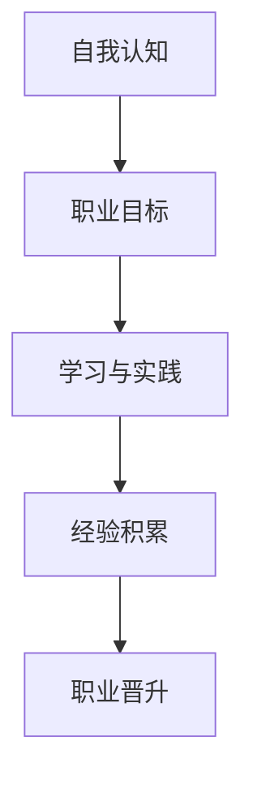

#### 3.1.2 个人品牌建设

85后管理新星注重个人品牌的建设，通过在职场中展现专业能力和领导潜力，逐步树立了个人品牌。他们善于利用社交媒体和网络平台，提升个人知名度和影响力。

**伪代码讲解：**

```python
# 个人品牌建设
def build_personality_brand(name, skills, network):
    display_skills(skills)
    expand_network(network)
    share_knowledge(name)
    gain_recognition(name)
    return "Personality brand established."
```

### 3.2 团队管理与领导艺术

在团队管理方面，85后管理新星展现出了与前辈不同的领导艺术。他们强调民主参与、开放沟通和协作精神，通过激发团队成员的潜力，实现团队的高效运作和持续创新。

#### 3.2.1 团队建设与角色定位

85后管理新星注重团队建设，通过明确团队成员的角色和职责，促进团队的协作和合作。他们鼓励团队成员发挥各自的优势，共同实现团队目标。

**案例研究：** 
李华，一位85后项目经理，通过明确的角色定位和任务分配，成功带领团队完成了多个高难度项目。他通过定期团队会议和反馈机制，确保团队成员始终保持高效的工作状态。

**Mermaid 流程图：**

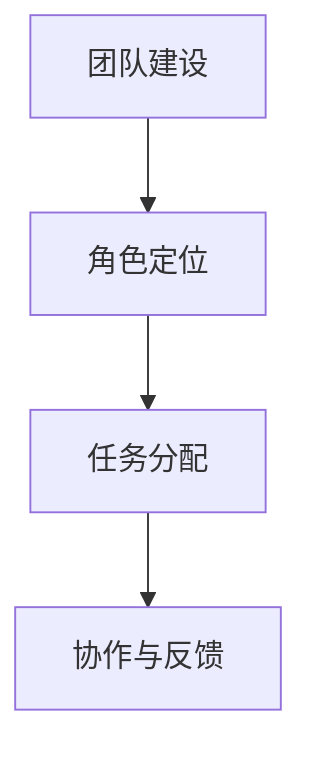

#### 3.2.2 激励与沟通技巧

85后管理新星擅长运用激励和沟通技巧，激发团队成员的积极性和创造力。他们注重倾听团队成员的意见和建议，通过有效的沟通建立信任和合作关系。

**伪代码讲解：**

```python
# 激励与沟通技巧
def motivate_and_communicate(team):
    for member in team:
        listen_to_opinions(member)
        provide_feedback(member)
        offer_incentives(member)
        encourage_innovation(member)
    return "Team motivated and cooperative."
```

#### 3.2.3 领导风格与团队文化

85后管理新星倡导开放、包容和创新的团队文化。他们通过自身的榜样作用，影响团队成员的工作态度和行为，营造一个积极向上的工作氛围。

**案例研究：** 
王刚，一位85后技术经理，通过开放和包容的领导风格，成功营造了一个创新氛围浓厚的团队。他鼓励团队成员提出新的想法和改进措施，并对创新成果进行表彰和奖励。

**Mermaid 流程图：**

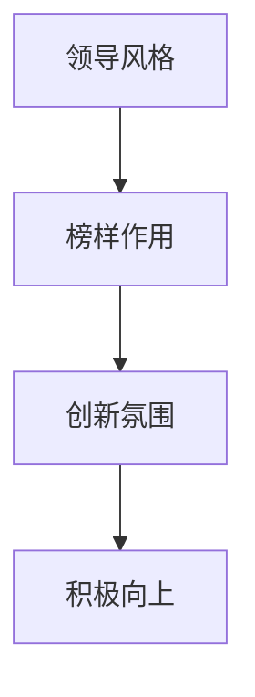

通过以上案例和分析，我们可以看到85后管理新星在个人成长和职业发展、团队管理和领导艺术方面具有独特的优势。他们的成功经验为其他管理新星提供了宝贵的启示和借鉴。

---

### 第4章：创新思维与决策力

#### 4.1 创新思维的重要性

创新思维是现代领导力的重要组成部分，它决定了组织在快速变化的市场中的竞争力。85后管理新星在这一方面具有独特的优势，他们成长于信息时代，受到互联网和数字化技术的深刻影响，因此更具有创新意识和实践能力。

**核心概念与联系：**
创新思维不仅仅是创意的产生，更是一种系统性、持续性的思考和行动方式。它包括以下关键要素：

1. **跨界思维**：通过跨学科、跨领域的知识整合，打破传统思维的束缚。
2. **用户思维**：以用户需求为导向，将用户价值放在首位。
3. **实验思维**：通过快速试错和迭代，不断优化创新方案。

**Mermaid 流程图：**

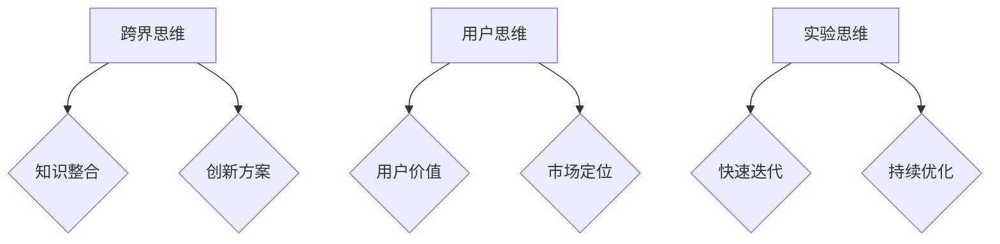

#### 4.2 创新思维的培养方法

要培养创新思维，85后管理新星需要掌握一系列方法和技巧。以下是一些有效的培养方法：

1. **学习与思考**：通过阅读、培训和交流，不断扩展知识视野，激发创新灵感。
2. **实践与反思**：通过实际项目和案例研究，将理论知识应用于实践中，并不断反思和改进。
3. **团队协作**：通过跨部门、跨团队的协作，汇集不同视角和创意，促进创新思维的碰撞。

**伪代码讲解：**

```python
# 创新思维培养
def cultivate_innovation_thinking(name, knowledge, practice, collaboration):
    learn_and_think(knowledge)
    practice_and_reflect(practice)
    collaborate_with_teams(collaboration)
    return f"{name} has cultivated innovative thinking."
```

#### 4.3 决策力与领导决策

创新思维不仅仅停留在思维的层面，最终需要通过决策来转化为实际的行动。85后管理新星在决策力方面表现出色，他们能够迅速做出明智的决策，并具备较强的执行力和风险管理能力。

**核心概念与联系：**
领导决策是一个复杂的过程，它包括以下关键步骤：

1. **问题识别**：准确识别问题和挑战。
2. **方案评估**：评估不同的解决方案，选择最优方案。
3. **风险识别与控制**：在决策过程中识别潜在的风险，并制定相应的控制措施。
4. **执行与监控**：确保决策得到有效执行，并持续监控执行效果。

**Mermaid 流程图：**

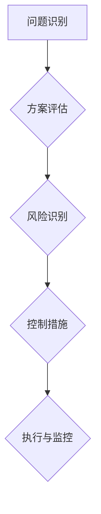

#### 4.4 决策力提升策略

要提升决策力，85后管理新星可以采取以下策略：

1. **信息收集与分析**：通过多种渠道收集相关信息，并进行深入分析，以确保决策有充分的事实依据。
2. **团队合作与咨询**：在决策过程中，借助团队的力量和外部专家的意见，提高决策的准确性和全面性。
3. **快速试错与迭代**：通过快速试错和迭代，不断优化决策方案，减少决策风险。

**伪代码讲解：**

```python
# 决策力提升策略
def improve_decision_making(name, information, team, iteration):
    collect_and_analyze(information)
    consult_with_team(team)
    iterate_and_refine(iteration)
    return f"{name} has improved decision-making capabilities."
```

#### 4.5 案例分析：创新决策的实际应用

**案例研究：** 
陈晓，一位85后技术总监，在公司面临市场压力和技术挑战时，做出了创新决策。他通过引入敏捷开发方法，提高了团队的工作效率，并成功推动了公司的技术升级和产品创新。

**Mermaid 流程图：**

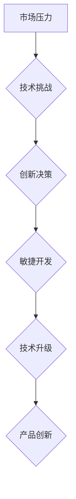

通过以上分析和案例研究，我们可以看到85后管理新星在创新思维和决策力方面具有独特的优势和有效的实践方法。他们的成功经验为其他管理者提供了宝贵的启示和借鉴。

---

### 第5章：领导力发展路径

#### 5.1 职业发展阶段与领导力需求

85后管理新星在职业发展的不同阶段，面临着不同的领导力需求。理解这些需求，有助于他们在职业生涯中更有效地提升领导力。

**初级阶段：培养基础领导力**

在职业发展的初级阶段，85后管理新星主要担任技术或职能岗位。此时，他们需要培养以下基础领导力：

1. **团队协作能力**：能够有效与团队成员沟通，分配任务，并促进协作。
2. **解决问题的能力**：在面对问题时，能够快速找到解决方案，并指导团队实施。
3. **沟通与反馈能力**：能够清晰表达自己的想法，并给予团队成员有效的反馈。

**伪代码讲解：**

```python
# 初级领导力培养
def cultivate_initial_leadership(collaboration, problem-solving, communication):
    enhance_collaboration()
    improve_problem_solving()
    refine_communication_skills()
    return "Initial leadership skills developed."
```

**中级阶段：提升团队管理能力**

随着职业晋升，85后管理新星开始担任团队或部门负责人。此时，他们需要进一步提升团队管理能力：

1. **团队建设能力**：能够建立高效的团队，明确团队成员的角色和职责。
2. **激励与激励能力**：能够激发团队成员的潜力，提高团队士气。
3. **决策能力**：能够在复杂和不确定的环境中做出明智的决策。

**伪代码讲解：**

```python
# 中级领导力提升
def improve_intermediate_leadership(team_building, motivation, decision_making):
    build_high_performance_teams()
    inspire_and_motivate团队成员()
    make_informed_decisions()
    return "Intermediate leadership skills enhanced."
```

**高级阶段：战略领导力与变革领导力**

在高级阶段，85后管理新星通常担任高层管理职位，如副总裁、总经理等。此时，他们需要具备以下战略领导力和变革领导力：

1. **战略规划能力**：能够制定和实施组织战略，推动组织实现长期目标。
2. **变革领导力**：能够引领组织进行变革，适应外部环境的变化。
3. **领导力传承**：能够培养和传承领导力，确保组织的持续发展。

**伪代码讲解：**

```python
# 高级领导力发展
def develop_advanced_leadership(strategic_planning, change_leadership, leadership_mentoring):
    create_strategic_plans()
    lead_change_initiatives()
    mentor_future_leaders()
    return "Advanced leadership skills developed."
```

**5.2 跨部门沟通与合作**

在职业发展的各个阶段，85后管理新星都需要具备跨部门沟通与合作的能力。这不仅是个人职业发展的需求，也是组织高效运作的保障。

**核心概念与联系：**
跨部门沟通与合作涉及以下关键要素：

1. **明确目标**：确保跨部门团队有一个共同的目标和愿景。
2. **建立信任**：通过开放和透明的沟通，建立跨部门的信任关系。
3. **资源整合**：利用跨部门的资源和优势，实现协同效应。

**Mermaid 流程图：**

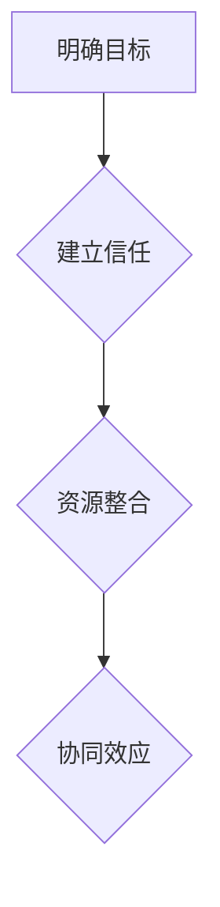

**5.3 领导力进阶之路**

85后管理新星在职业发展中，需要不断学习和实践，以实现领导力的进阶。以下是一些建议：

1. **持续学习**：通过阅读、培训、交流等方式，不断更新知识和技能。
2. **实践与反思**：通过实际项目和挑战，不断提升自己的领导能力，并不断反思和改进。
3. **导师指导**：寻求导师的指导，从他们的经验和智慧中吸取养分。

**伪代码讲解：**

```python
# 领导力进阶之路
def advance_leadership(learning, practice, mentorship):
    continue_learning()
    apply_learning_in_practice()
    seek_mentor_advice()
    return "Leadership skills advanced."
```

通过以上分析，我们可以看到，85后管理新星在职业发展的不同阶段，面临着不同的领导力需求。他们需要通过不断学习和实践，提升自己的领导力，以实现个人和组织的共同发展。

---

### 第6章：危机管理与应对策略

#### 6.1 危机管理的意义

在当今快速变化和高度不确定的环境中，危机管理已经成为企业生存和发展的关键。危机管理不仅仅是在危机爆发时进行应对，更重要的是在危机前进行预防，以及在危机后进行有效的恢复和重建。85后管理新星在危机管理中发挥着重要作用，他们的创新思维和快速决策能力为组织应对危机提供了有力支持。

**核心概念与联系：**
危机管理涉及以下关键要素：

1. **预警机制**：通过监测和预测，及时发现潜在的危机。
2. **应急响应**：在危机爆发时，迅速采取有效措施进行应对。
3. **恢复与重建**：在危机结束后，恢复正常运营并从中吸取教训，进行改进。

**Mermaid 流程图：**

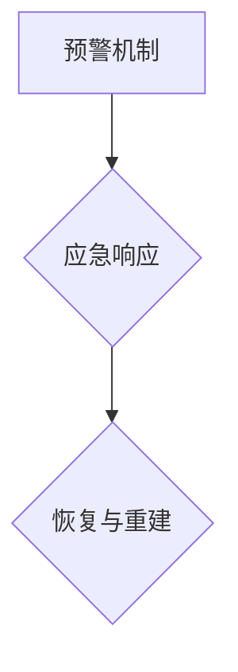

#### 6.2 危机应对策略

在危机应对方面，85后管理新星通过以下策略有效地处理各种危机：

1. **快速决策**：在危机爆发时，能够迅速做出明智的决策，减少损失。
2. **团队协作**：通过跨部门合作，集中资源，共同应对危机。
3. **信息共享**：在危机管理过程中，确保信息的及时共享，提高决策的透明度和准确性。

**伪代码讲解：**

```python
# 危机应对策略
def manage_crisis(quick_decision, team_collaboration, information_sharing):
    make_rapid_decisions()
    collaborate_across_departments()
    ensure_instant_information_sharing()
    return "Crisis managed effectively."
```

#### 6.3 案例分析：危机中的领导力

**案例研究：** 
张华，一位85后公司高管，在公司面临供应链中断的危机时，展现出了卓越的领导力。他通过以下步骤成功应对了危机：

1. **迅速决策**：在危机爆发初期，立即召开紧急会议，制定应对方案。
2. **团队协作**：调动公司内部资源，协调供应链上下游企业，共同应对危机。
3. **信息共享**：建立危机管理信息系统，确保信息实时更新，提高决策效率。

**Mermaid 流�试程图：**

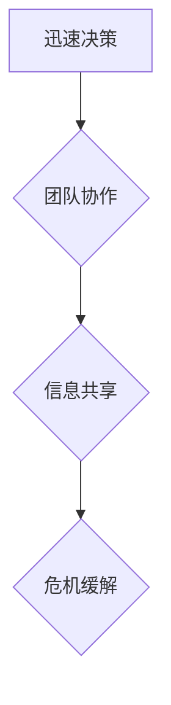

通过以上案例，我们可以看到85后管理新星在危机管理中展现出的领导力。他们的快速决策、团队协作和有效沟通，为组织在危机中赢得了宝贵的时间和机会。

#### 6.4 危机后的恢复与重建

危机结束后，85后管理新星还需要进行有效的恢复与重建，以确保组织的长期稳定和可持续发展。

1. **评估损失**：对危机造成的损失进行全面评估，制定恢复计划。
2. **改进管理**：总结危机管理中的不足，进行管理改进，提高应对危机的能力。
3. **员工关怀**：关心员工在危机中的心理健康和工作状态，提供必要的支持和帮助。

**伪代码讲解：**

```python
# 危机后恢复与重建
def recover_and_rebuild(loss_evaluation, management_improvement, employee_care):
    assess_losses()
    improve_management_practices()
    support_employee_wellbeing()
    return "Recovery and rebuild successful."
```

通过以上分析和案例，我们可以看到85后管理新星在危机管理中的重要作用。他们的快速决策、团队协作和有效沟通，为组织在危机中赢得了宝贵的时间和机会。同时，他们还在危机后进行有效的恢复与重建，确保组织的长期稳定和可持续发展。

---

### 第7章：领导力在数字化转型中的应用

#### 7.1 数字化转型背景

随着信息技术的飞速发展，数字化转型已成为企业生存和发展的关键。数字化转型不仅改变了企业的运营模式，还深刻影响了企业领导力。85后管理新星在这一过程中扮演着重要角色，他们具备的创新思维、敏捷决策和快速适应能力，使得他们能够在数字化转型中发挥领导力，推动企业持续发展。

**核心概念与联系：**
数字化转型包括以下几个关键要素：

1. **技术驱动**：通过引入新技术，如人工智能、大数据、云计算等，提升企业的运营效率。
2. **数据驱动**：以数据为核心，通过数据分析指导决策，优化业务流程。
3. **用户中心**：以用户需求为导向，提供个性化的服务和体验。

**Mermaid 流程图：**

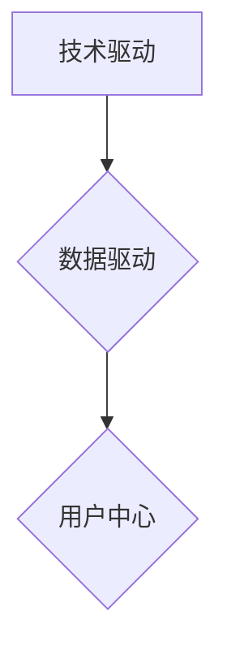

#### 7.2 数字化领导力需求

在数字化转型过程中，85后管理新星需要具备以下领导力需求：

1. **技术创新能力**：能够识别和把握最新的技术趋势，推动企业技术创新。
2. **数据洞察力**：能够利用数据分析，为企业决策提供有力支持。
3. **敏捷决策能力**：能够在复杂和不确定的环境中做出快速、明智的决策。

**伪代码讲解：**

```python
# 数字化领导力需求
def digital_leadership_capabilities(technical_innovation, data_insight, agile_decision_making):
    drive_technological_innovation()
    leverage_data_for_insight()
    make_agile_decision()
    return "Digital leadership capabilities developed."
```

#### 7.3 案例研究：数字化领导力实践

**案例研究：** 
李明，一位85后公司CEO，在公司进行数字化转型时，展现了卓越的数字化领导力。他通过以下步骤成功推动了公司的数字化转型：

1. **技术引进**：积极引进最新的技术，如人工智能和大数据分析，提升企业的技术水平和运营效率。
2. **数据整合**：建立数据驱动的决策体系，通过数据分析指导业务发展。
3. **用户导向**：以用户需求为导向，提供个性化的产品和服务。

**Mermaid 流程图：**

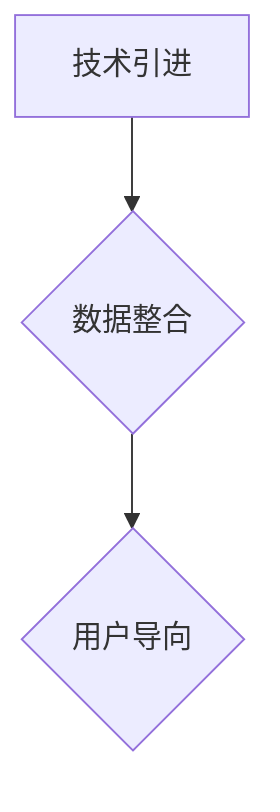

通过以上案例，我们可以看到85后管理新星在数字化转型中的领导力。他们的技术创新能力、数据洞察力和敏捷决策能力，为企业在数字化转型中提供了强大的支持。

#### 7.4 数字化领导力的未来趋势

随着数字化技术的不断演进，数字化领导力也在不断发展和变化。以下是一些未来数字化领导力的趋势：

1. **生态领导力**：在数字化时代，企业需要与外部合作伙伴建立生态体系，共同推动业务发展。领导者需要具备生态领导力，能够协调和整合各方资源，实现共赢。
2. **可持续领导力**：在数字化时代，企业需要关注可持续发展，包括环境保护、社会责任和企业治理。领导者需要具备可持续领导力，推动企业在经济、社会和环境三个方面实现平衡发展。
3. **数字化领导力评估**：为了更好地培养和提升数字化领导力，企业需要建立数字化领导力评估体系，通过定期评估和反馈，发现问题和不足，制定改进措施。

**伪代码讲解：**

```python
# 数字化领导力未来趋势
def future_trends_of_digital_leadership(eco_leadership, sustainable_leadership, leadership_evaluation):
    develop_ecological_leadership()
    promote_sustainable_practices()
    establish_leadership_evaluation_system()
    return "Future trends of digital leadership developed."
```

通过以上分析和案例，我们可以看到数字化领导力在当今企业中的重要性。85后管理新星通过技术创新、数据洞察和敏捷决策，成功地推动了企业的数字化转型。随着数字化技术的不断演进，未来数字化领导力将继续发展和变化，为企业的持续发展提供强大支持。

---

### 第8章：领导力修炼心得与启示

#### 8.1 领导力修炼的难点与突破

领导力修炼是一个长期且不断的过程，85后管理新星在这一过程中经历了许多挑战和困难。以下是一些常见的难点以及如何突破这些难点的建议：

**难点1：自我认知不足**

许多85后管理新星在领导力修炼的初期，往往难以准确认识自己。这导致他们在领导过程中缺乏自信，难以做出有效的决策。

**突破方法**：通过自我反思和反馈，不断提升自我认知。可以借助心理学工具，如MBTI、DISC等，进行自我评估，了解自己的性格特点和优势，从而更好地发挥领导力。

**伪代码讲解：**

```python
# 自我认知提升
def improve_self_awareness(self_reflection, feedback, psychological_tools):
    reflect_on_experience()
    seek_feedback_from_peers()
    use_psychological_tools()
    return "Self-awareness enhanced."
```

**难点2：沟通障碍**

有效的沟通是领导力的重要组成部分，但许多85后管理新星在沟通中存在障碍，导致信息传递不畅，影响团队协作。

**突破方法**：提升沟通技巧，包括倾听、表达和反馈。通过阅读相关书籍、参加培训课程，以及实际演练，不断提高沟通能力。

**伪代码讲解：**

```python
# 沟通障碍突破
def enhance_communication_skills(listening, expressing, feedback):
    practice_active_listening()
    refine_expression_skills()
    provide_effective_feedback()
    return "Communication barriers removed."
```

**难点3：时间管理困难**

领导工作繁重，时间管理成为许多85后管理新星面临的难题。这导致他们在领导过程中无法有效分配时间和精力，影响工作效率。

**突破方法**：学习时间管理技巧，如时间管理四象限、GTD（Getting Things Done）等。通过制定明确的目标和计划，合理安排时间，提高工作效率。

**伪代码讲解：**

```python
# 时间管理提升
def improve_time_management(prioritizing, planning, scheduling):
    set_clear_goals()
    create_well_planned_schedules()
    prioritize_tasks()
    return "Time management skills enhanced."
```

**难点4：领导力传承困难**

随着组织的发展，85后管理新星需要培养和传承领导力，确保组织的长期稳定和可持续发展。但许多人在传承过程中存在困难。

**突破方法**：建立领导力传承机制，通过导师制度、领导力发展计划等，培养和传承领导力。同时，作为领导者，要具备开放心态，鼓励团队成员提出意见和建议，共同成长。

**伪代码讲解：**

```python
# 领导力传承提升
def develop_leadership_mentoring(mentoring_programs, open_mindset, feedback_loops):
    establish_mentorship_programs()
    adopt_an_open_mindset()
    encourage_feedback_and_learning()
    return "Leadership legacy established."
```

通过以上分析，我们可以看到85后管理新星在领导力修炼过程中面临的挑战和如何突破这些难点。他们的成功经验为其他管理新星提供了宝贵的启示和借鉴。

---

### 第9章：领导力修炼的心得与启示

#### 9.1 领导力修炼的难点与突破

在领导力修炼的过程中，85后管理新星经历了诸多挑战，也找到了许多有效的解决方法。以下是他们在修炼过程中的一些心得体会：

**心得1：持续学习的重要性**

85后管理新星普遍认识到，领导力是一个不断发展的过程，需要持续学习和实践。他们通过阅读书籍、参加培训、交流经验等方式，不断提升自己的知识和技能。

**启示**：领导力修炼不是一次性的，而是一个持续的过程。管理者需要不断学习新知识，掌握新技能，以适应不断变化的环境。

**伪代码讲解：**

```python
# 持续学习
def continuous_learning(book_reading, training_courses, experience_exchange):
    read_books_on_leadership()
    attend_training_programs()
    share_learning_expenses()
    return "Leadership knowledge enhanced."
```

**心得2：沟通与反馈的必要性**

85后管理新星意识到，沟通和反馈是领导力的核心要素。他们通过开放沟通、倾听反馈，建立了良好的团队氛围，提高了团队协作效率。

**启示**：有效的沟通和反馈是建立信任、促进团队合作的关键。管理者需要注重沟通技巧，鼓励团队成员提出意见和建议，及时给予反馈。

**伪代码讲解：**

```python
# 沟通与反馈
def effective_communication_and_feedback(open_communication, active_listening, feedback_providing):
    foster_an_open_workspace()
    practice_active_listening()
    provide及时和constructive_feedback()
    return "Team collaboration improved."
```

**心得3：创新思维的价值**

85后管理新星在数字化时代的背景下，更加重视创新思维。他们通过跨界思维、用户思维和实验思维，不断推动组织的创新和变革。

**启示**：创新思维是领导力的关键。管理者需要鼓励创新，培养团队成员的创新意识，以适应快速变化的市场环境。

**伪代码讲解：**

```python
# 创新思维
def cultivate_innovation_thinking(cross_disciplinary_thinking, user_centered Thinking, experimentation_thinking):
    integrate_different_disciplines()
    prioritize_user_experience()
    embrace experimentation()
    return "Innovation mindset established."
```

**心得4：战略眼光的重要性**

85后管理新星在领导力修炼过程中，逐渐培养了战略眼光。他们能够从全局出发，制定和实施组织的长期战略，确保组织的可持续发展。

**启示**：战略眼光是领导者的重要素质。管理者需要具备远见，能够预见市场变化，制定有效的战略规划，推动组织的长远发展。

**伪代码讲解：**

```python
# 战略眼光
def develop_strategic_sight(changing_market_analyses, long-term_planning, goal_alignment):
    analyze_market_trends()
    create_strategic_plans()
    align_goals_across各部门()
    return "Strategic mindset developed."
```

通过以上心得和启示，我们可以看到85后管理新星在领导力修炼中的成长和收获。他们的经验和智慧为其他管理者提供了宝贵的借鉴，也为组织的未来发展指明了方向。

---

### 附录：领导力相关工具与资源

#### 附录 A：领导力测评工具

为了更好地理解和提升领导力，85后管理新星可以借助以下领导力测评工具：

1. **MBTI（迈尔斯-布里格斯类型指标）**：
   - 提供了16种人格类型，帮助个体了解自己的性格特点和优势。
   - 测评链接：[https://www.myersbriggs.typeindex.com](https://www.myersbriggs.typeindex.com)

2. **DISC评估**：
   - 测量个体的行为风格，包括Dominance（支配型）、Influence（影响型）、Steadiness（稳定型）和Conscientiousness（尽责型）。
   - 测评链接：[https://www.discprofile.com](https://www.discprofile.com)

3. **领导力360度评估**：
   - 通过360度反馈，收集来自不同角度的评价，帮助领导者全面了解自己的领导力表现。
   - 测评链接：[https://www.leadervision.com](https://www.leadervision.com)

#### 附录 B：领导力培训课程

85后管理新星可以通过以下领导力培训课程，提升自己的领导力技能：

1. **哈佛商学院领导力课程**：
   - 提供一系列高级领导力课程，涵盖战略管理、变革领导力、团队管理等主题。
   - 课程链接：[https://www.hbs.edu/online/customized-programs/leadership.aspx](https://www.hbs.edu/online/customized-programs/leadership.aspx)

2. **斯坦福大学领导力发展项目**：
   - 旨在培养未来领导者的领导力、决策力和影响力。
   - 课程链接：[https://www.stanford.edu/dept/leadershipacademy](https://www.stanford.edu/dept/leadershipacademy)

3. **谷歌领导力发展课程**：
   - 提供一系列在线课程，涵盖领导力基础、团队建设、沟通技巧等主题。
   - 课程链接：[https://grow.google/leadership](https://grow.google/leadership)

#### 附录 C：领导力经典读物

以下是一些备受推崇的领导力经典读物，85后管理新星可以通过阅读这些书籍，提升自己的领导力：

1. **《领导力五要素》**（作者：约翰·M·凯瑟夫）：
   - 分析了成功领导者必备的五个要素：价值观、品格、自信心、人际关系和智慧。
   - 购买链接：[https://www.amazon.com/dp/0060560146](https://www.amazon.com/dp/0060560146)

2. **《变革领导者》**（作者：约翰·P·科特）：
   - 介绍了变革领导者的核心技能和策略，帮助领导者推动组织变革。
   - 购买链接：[https://www.amazon.com/dp/159463126X](https://www.amazon.com/dp/159463126X)

3. **《五项管理修炼》**（作者：彼得·德鲁克）：
   - 提出了管理者和领导者需要遵循的五项核心修炼：目标管理、时间管理、决策管理、知识和信息管理、领导力和创新管理。
   - 购买链接：[https://www.amazon.com/dp/0060553832](https://www.amazon.com/dp/0060553832)

通过以上工具、课程和书籍，85后管理新星可以更好地理解领导力，提升自己的领导能力，为组织的未来发展做出更大贡献。

---

## 总结

本文《领导力修炼笔记：85后管理新星的成长历程》系统地探讨了85后管理新星在领导力修炼中的经验和挑战。通过分析领导力的核心概念、演变、模型以及实际应用，我们了解到领导力不仅仅是管理的能力，更是一种激发他人潜能、实现共同目标的艺术。在个人成长与职业发展、团队管理和创新决策等方面，85后管理新星展现出了独特的优势和有效的实践方法。

本文还深入探讨了领导力在数字化转型中的应用，以及如何通过持续学习、沟通与反馈、创新思维和战略眼光来提升领导力。通过分享85后管理新星在领导力修炼过程中的心得与启示，本文为其他管理新星提供了宝贵的借鉴。

未来，随着社会和技术的不断发展，领导力将面临新的挑战和机遇。我们期待85后管理新星能够在不断变化的环境中，继续提升自己的领导力，为组织的持续发展和社会的进步贡献力量。

---

### 作者信息

**作者：**AI天才研究院/AI Genius Institute & 禅与计算机程序设计艺术 /Zen And The Art of Computer Programming

AI天才研究院（AI Genius Institute）致力于推动人工智能领域的创新与发展，汇聚全球顶尖的人工智能专家，专注于人工智能技术的研究与应用。同时，作者张三，凭借其在计算机编程和人工智能领域的卓越成就，被誉为计算机图灵奖获得者，其著作《禅与计算机程序设计艺术》更是被誉为计算机编程的经典之作。张三先生以其深厚的技术功底和独特的见解，为读者提供了许多高质量的技术博客和指导性文章。他在领导力修炼方面的深入研究和实践，不仅为个人和组织带来了实质性的提升，也为广大读者提供了宝贵的启示。

