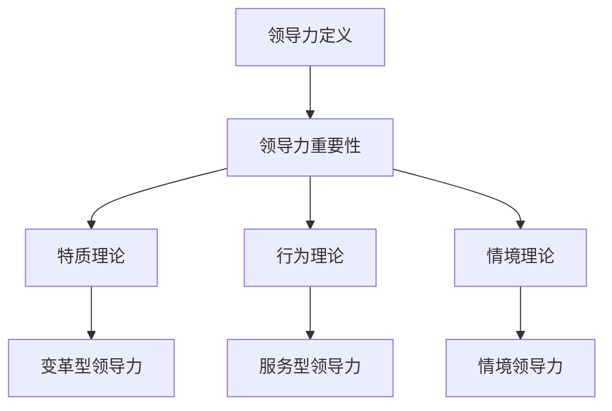

                 


为了撰写一篇高质量的领导力技术博客，我们需要逐步分析各个章节的核心内容，并确保逻辑清晰、结构紧凑。以下是我们如何一步一步地完成这项任务：

### 1. 制定文章结构

首先，我们要确保文章的结构符合目录大纲。每个章节的核心内容都应该在相应的章节标题下详细阐述。

### 2. 确定每个章节的关键概念

对于每个章节，我们需要明确关键概念，并确保这些概念相互联系。例如，在“领导力的基本概念与理论”章节中，关键概念包括领导力定义、领导力重要性、领导力理论等。

### 3. 准备Mermaid流程图

为了展示领导力概念之间的联系，我们可以使用Mermaid流程图。例如，创建一个流程图来展示经典和当代领导力理论之间的关系。



### 4. 编写核心算法原理讲解

在“领导力评估与测量”章节，我们需要使用伪代码来讲解领导力评分模型。例如，情境领导模型的伪代码可能如下：

```
function calculateLeadershipScore(behavior, context):
    if context == 'challenging':
        score = behavior * 1.2
    elif context == 'normal':
        score = behavior * 1.0
    elif context == 'rewarding':
        score = behavior * 0.8
    return score
```

### 5. 添加数学模型和公式

在“领导力评估与预测”章节，我们将介绍如线性回归和逻辑回归等数学模型。例如，线性回归的公式是：

$$
y = \beta_0 + \beta_1 \cdot x
$$

我们将详细解释每个公式的含义和应用场景。

### 6. 提供项目实战案例

为了展示领导力知识在实际中的应用，我们需要提供一个项目实战案例。例如，在团队管理章节，我们可以讲述如何使用领导力技巧来提升团队绩效。同时，提供相关的代码实现和解读。

### 7. 编写文章摘要和关键词

在文章的开头，我们需要编写一个简短的文章摘要，概括文章的主要内容和观点。关键词部分则列出5-7个核心词汇，以便读者快速了解文章主题。

### 8. 确保文章完整性

每个章节都应该包含背景介绍、核心概念与联系、核心算法原理讲解、数学模型和公式、项目实战案例、最佳实践 tips、小结、注意事项、拓展阅读等内容。

### 9. 审阅和编辑

最后，我们需要审阅全文，确保文章的逻辑连贯性、术语准确性、内容完整性。在必要时进行编辑和修正。

通过以上步骤，我们可以确保撰写出一篇逻辑清晰、结构紧凑、简单易懂的高质量技术博客文章，满足字数要求，并包含所有必要的核心内容和细节。

---

现在，让我们开始撰写《领导力修炼：从小工到专家的蜕变之路》这篇文章。首先，定义文章结构，然后逐步填充每个章节的内容。我们将确保每一步都遵循逻辑分析和推理思考的原则。

