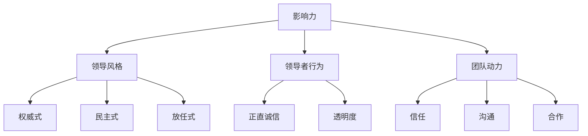
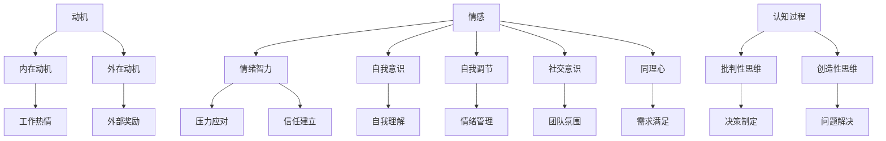
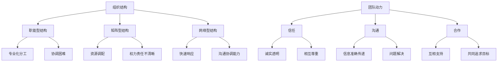

                 

### 引入领导力的概念

领导力，作为一种社会现象，早已在人类历史中占据重要地位。它不仅仅关乎领导者的个人魅力和权威，更是一种能够激发和引导团队共同达成目标的能力。从古至今，领导力的定义和内涵随着社会的发展不断演变，但其核心本质却始终不变：那就是通过影响他人，实现组织或团队的愿景。

在当代社会，领导力的重要性愈发凸显。企业竞争日益激烈，创新能力成为企业生存和发展的关键因素。而领导力正是推动创新、实现组织变革的核心动力。一个优秀的领导者，不仅能够清晰传达愿景，激发团队成员的潜能，还能有效应对变革带来的挑战。在科技迅速发展的背景下，领导者需要具备更加开放的心态、敏锐的洞察力和快速适应变化的能力。

然而，对于技术专家而言，从技术岗位转型为管理者并非易事。技术专家通常具有较强的专业知识和技能，但在领导力方面可能相对薄弱。这不仅是个人能力的挑战，也是心理上的转变。从专注于技术实现到关注团队协作和目标管理，技术专家需要克服自身的舒适区，学习新的技能和思维方式。

本篇文章旨在探讨领导力的概念、重要性以及技术专家转型为管理者的挑战和机遇。通过基础理论的介绍、技能提升的讨论、实际案例的分析和实践指南的提供，我们将帮助技术专家深入了解领导力的本质，逐步实现从技术专家到管理者的蜕变。

### 领导力的核心原则

领导力的核心原则是构建有效领导行为的基础，这些原则涵盖了影响领导者表现的关键因素。首先，影响力是领导力的核心。领导者通过多种方式影响团队成员，包括说服、激励和示范。影响力不仅取决于领导者的个人魅力，还与其沟通技巧和建立信任的能力密切相关。

其次，领导风格对领导力具有显著影响。不同的领导风格适用于不同的情境和团队。常见的领导风格包括权威式、民主式、放任式等。权威式领导风格强调命令和控制，适用于需要迅速决策和高效执行的情况；民主式领导风格注重团队成员的参与和决策，有助于提高团队凝聚力和创新力；放任式领导风格则给予团队成员高度自主权，适用于高度专业化和独立性较强的团队。

领导者行为也是领导力的重要组成部分。领导者不仅要设定愿景和目标，还要通过行动示范来激励团队。有效的领导者通常展现出正直、诚信和透明度，这些行为有助于建立团队的信任和尊重。此外，领导者还需要具备同理心和人际交往能力，能够理解并满足团队成员的需求和期望。

在领导力的核心原则中，还有一个重要因素是团队动力。团队动力指的是团队成员之间的相互作用和协作，包括团队成员的信任、沟通和合作。一个高绩效的团队往往拥有积极的团队动力，这需要领导者通过有效的团队建设和领导策略来培养。

为了更好地理解领导力的核心原则，我们可以通过以下Mermaid流程图来展示它们之间的关系：

在这个流程图中，我们可以清晰地看到影响力、领导风格、领导者行为和团队动力之间的相互关系。影响力是整个流程的起点，它决定了领导者的领导风格和领导行为，进而影响团队动力。有效的领导力需要这四个核心原则的协同作用，才能实现团队的高效运作和目标的达成。

### 心理学与领导力

心理学在领导力的研究中起着关键作用，它帮助我们理解领导者的行为、团队成员的反应以及团队的整体动力。首先，我们需要了解一些心理学基础概念，如动机、情感和认知过程。这些概念为理解领导力的心理根源提供了理论基础。

动机是驱动人们行为的内在力量，可以分为内在动机和外在动机。内在动机源于个人的兴趣、乐趣和自我实现的需要，而外在动机则来源于外部奖励或惩罚。在领导力中，领导者需要了解团队成员的动机，以激发他们的内在动机，从而提高工作热情和创造力。

情感在领导力中同样重要。情绪智力（Emotional Intelligence, EI）是指个体识别、理解、管理自己和他人情绪的能力。领导者具备高情绪智力，能够更好地应对压力和挑战，建立信任和积极的团队氛围。情绪智力包括自我意识、自我调节、社交意识和同理心等维度。

认知过程是人们获取、处理和应用信息的过程。在领导力中，认知过程体现在领导者的决策制定、问题解决和战略规划能力。领导者需要具备批判性思维和创造性思维，能够从不同角度分析问题，提出创新的解决方案。

为了更深入地理解心理学与领导力之间的关系，我们可以通过以下Mermaid流程图展示这些关键概念之间的联系：

在这个流程图中，我们可以看到动机、情感和认知过程如何相互关联并影响领导力。动机驱动行为，情感影响团队成员的反应和领导者的决策，而认知过程则提供了问题解决和战略规划的框架。领导者通过理解这些心理学概念，可以更好地激发团队成员的潜力，提升团队的整体绩效。

### 组织行为学

组织行为学是研究个体、群体以及结构如何在组织中互动的学科，它在领导力研究中同样具有重要意义。首先，我们需要了解组织结构与管理的基本概念。组织结构是指企业内部各部门、岗位以及它们之间关系的安排。常见的组织结构包括职能型结构、矩阵型结构和网络型结构等。每种结构都有其优缺点，适用于不同的业务场景和团队规模。

职能型结构按照职能划分部门，如市场部、研发部、人力资源部等，各部门相对独立运作。这种结构有助于专业化分工和高效管理，但可能导致部门间的协调困难。

矩阵型结构结合了职能型和项目型结构的优点，将项目任务和职能责任相结合，团队成员既属于某一职能部门，又参与跨部门的项目团队。这种结构有利于资源的灵活调配和跨部门协作，但可能导致权力和责任不清晰。

网络型结构则更加灵活，强调合作伙伴关系和项目导向，团队成员可以来自不同的部门和公司。这种结构有助于快速响应市场需求，但需要较强的沟通和协调能力。

在组织行为学中，团队动力也是一个关键概念。团队动力指的是团队成员之间的相互作用和协作，包括信任、沟通和合作。一个高绩效的团队通常拥有积极的团队动力，这需要领导者通过有效的团队建设和领导策略来培养。

信任是团队动力的基石。团队成员之间的信任建立在诚实、透明和相互尊重的基础上。领导者可以通过树立榜样、建立透明沟通机制和及时反馈来建立信任。

沟通是团队协作的重要手段。有效的沟通不仅包括信息的传递，还包括情感和态度的表达。领导者需要培养团队成员的沟通技巧，确保信息的准确传递和问题的及时解决。

合作是团队动力的关键。领导者需要鼓励团队成员互相支持、共同解决问题，并共同追求团队目标。这可以通过设定共同的目标、提供必要的资源和建立协作机制来实现。

为了更好地理解组织行为学与领导力之间的关系，我们可以通过以下Mermaid流程图展示这些关键概念之间的联系：

在这个流程图中，我们可以看到组织结构、团队动力和领导力之间的紧密联系。组织结构决定了团队的组织形式和运作方式，团队动力影响了团队的协作效率和绩效，而领导力则通过影响团队动力和组织结构来推动团队目标的实现。

### 领导力技能提升

在领导力的修炼过程中，技能的提升是关键的一环。这些技能不仅有助于领导者有效地管理团队，还能提高团队的整体绩效和创造力。以下将重点讨论沟通技巧、团队管理和决策制定这三个核心领域，并提供实用的提升策略。

#### 沟通技巧

沟通技巧是领导者必备的能力之一。有效的沟通不仅能确保信息的准确传递，还能增强团队成员之间的信任和协作。以下是一些提升沟通技巧的策略：

1. **主动倾听**：倾听是沟通的重要组成部分。领导者需要学会主动倾听，不仅仅是听到对方的话语，更要理解对方的情感和需求。可以通过保持眼神接触、不打断对方发言、点头表示理解和提出问题等方式来提高倾听效果。

2. **明确表达**：领导者需要能够清晰、明确地表达自己的想法和期望。这包括使用简洁明了的语言、逻辑清晰的表述方式，以及在必要时使用图表、演示文稿等辅助工具来增强表达效果。

3. **非言语沟通**：非言语沟通同样重要。领导者需要注意自己的肢体语言、面部表情和语调，这些因素都会影响沟通的效果。一个开放的姿态、友好的表情和积极的声音能够传递出积极的情绪和态度。

4. **反馈与确认**：在沟通过程中，及时给予反馈和确认是确保信息准确的重要环节。领导者需要鼓励团队成员提问和澄清，以确保双方对信息的理解一致。

#### 团队管理

团队管理是领导力的核心组成部分，有效的团队管理能够提升团队的凝聚力和工作效率。以下是一些提升团队管理的策略：

1. **明确目标和期望**：领导者需要为团队设定清晰的目标和期望，确保团队成员对目标有共同的理解和认同。这可以通过定期召开团队会议、制定详细的行动计划和明确的目标指标来实现。

2. **建立信任**：信任是团队协作的基础。领导者需要通过建立透明、诚信的沟通机制，以及公正、公平的决策过程来建立信任。此外，领导者还需要关注团队成员的情感需求，提供必要的支持和关怀。

3. **激励和认可**：领导者需要通过激励和认可来激发团队成员的积极性和创造力。这可以通过设立奖励机制、表扬团队成员的成就和提供职业发展机会等方式来实现。

4. **培养团队文化**：领导者需要积极培养团队文化，营造一个积极、开放和包容的工作环境。这包括鼓励创新思维、提倡协作和共享知识，以及尊重团队成员的个人差异和贡献。

#### 决策制定

决策制定是领导者的一项重要职责，高效的决策能力能够提升团队的竞争力和执行力。以下是一些提升决策制定能力的策略：

1. **信息收集与分析**：领导者需要收集和分析与决策相关的信息，确保决策基于充分的数据和事实。可以通过进行市场调研、分析历史数据和咨询专家意见等方式来获取信息。

2. **多角度思考**：在决策过程中，领导者需要从多个角度思考问题，考虑不同的解决方案和潜在风险。可以通过召开头脑风暴会议、邀请团队成员参与讨论和制定备选方案等方式来提高多角度思考的能力。

3. **决策模型与工具**：领导者可以使用各种决策模型和工具来辅助决策。例如，决策树、SWOT分析、成本效益分析等工具可以帮助领导者系统性地分析问题和制定决策。

4. **快速迭代与调整**：领导者需要具备快速调整和迭代决策的能力，以便在实施过程中及时应对变化和挑战。可以通过建立灵活的反馈机制和定期评估决策效果来提高决策的适应性。

总之，领导力的技能提升是一个持续的过程，需要领导者不断学习、实践和反思。通过提升沟通技巧、团队管理和决策制定能力，领导者能够更有效地管理团队，实现组织的目标。

### 案例研究一：技术专家到管理者的成功转型

#### 案例背景

李明是一位拥有15年软件开发经验的高级工程师，他在公司内部被誉为“技术达人”。然而，随着时间的推移，公司开始意识到仅靠技术实力难以推动业务的长远发展。为了更好地适应公司战略，李明决定转型为管理者，成为团队负责人。然而，这一转型过程并非一帆风顺。

#### 领导力挑战

1. **角色转变**：从专注于技术实现到关注团队协作和目标管理，李明需要克服角色转变的挑战。他发现，技术工作更多是个人能力展现，而管理工作则更多涉及人际互动和团队协作。

2. **沟通障碍**：作为技术专家，李明习惯于直接解决问题，而管理工作中需要与团队成员、其他部门经理和上级领导进行更多沟通。他发现自己在沟通表达和倾听方面存在不足，这影响了团队的协作效率。

3. **压力管理**：李明在转型初期承受了巨大的压力。他不仅要管理团队，还需要应对日常的技术问题，这导致他感到疲惫和焦虑。

#### 领导力实践

1. **强化沟通技巧**：李明意识到沟通技巧的重要性，开始主动学习沟通理论，并实践各种沟通策略。他通过参加培训课程和阅读相关书籍，提升了自己的沟通能力。同时，他在团队内部建立了定期的沟通机制，包括周会、项目汇报和一对一沟通，确保信息的畅通和问题的及时解决。

2. **建立信任**：李明认识到建立信任是团队管理的基础。他通过透明、诚信的沟通和公正、公平的决策过程来赢得团队成员的信任。他鼓励团队成员提出意见和建议，并尊重他们的意见，这增强了团队的凝聚力和归属感。

3. **角色定位**：李明逐步适应了管理者的角色，将更多时间用于团队管理和目标设定。他学会了委托任务和分配责任，确保团队成员充分发挥其专业技能。同时，他保持对技术问题的关注，但在必要时才介入，以避免影响团队的自主性和创造力。

4. **压力管理**：李明学会了如何管理压力，通过定期锻炼、调整工作和休息时间以及寻求同事和上级的支持来缓解压力。他还通过制定明确的工作目标和优先级，提高工作效率，减少不必要的焦虑。

#### 结果与影响

经过一段时间的努力，李明在团队管理和领导力方面取得了显著进步。团队的整体绩效和士气得到了提升，项目按时交付率提高了20%，团队成员对李明的满意度也显著增加。李明的成功转型不仅为团队带来了积极的变化，也为公司战略的实施提供了有力支持。

#### 案例启示

1. **角色转变**：技术专家转型为管理者需要时间适应，领导者应给予足够的支持和理解。

2. **沟通技巧**：有效的沟通是团队协作的关键，领导者应不断学习和实践沟通技巧。

3. **信任建立**：建立信任是团队管理的基础，领导者应通过透明和公正的行为来赢得团队成员的信任。

4. **压力管理**：领导者需要学会管理压力，确保身心健康和工作效率。

通过这个案例，我们可以看到技术专家转型为管理者需要克服多重挑战，但通过有效的领导力和管理技能，可以实现成功转型，为团队和组织带来积极的变化。

### 案例研究二：领导力在项目管理中的应用

#### 案例背景

张伟是一位在大型互联网公司担任项目经理的技术专家。由于公司项目越来越多，项目管理的复杂性和挑战也日益增加。张伟意识到，仅仅依靠技术能力已不足以应对项目中的各种挑战，他需要通过提升领导力来提高项目的成功率。

#### 领导力挑战

1. **团队协作**：张伟的项目团队由不同背景和专业技能的成员组成，如何有效地协调和调动团队资源成为一大挑战。

2. **风险管理**：项目过程中，张伟需要识别和应对各种潜在的风险，包括技术风险、资源短缺和市场变化等。

3. **沟通协调**：张伟需要与团队成员、客户和上级领导保持有效沟通，确保项目信息的畅通和问题的及时解决。

#### 领导力实践

1. **构建团队文化**：张伟重视团队文化建设，他通过定期团队建设活动和开放的沟通环境，培养团队成员的归属感和责任感。他提倡合作精神和共享知识，鼓励团队成员提出创新想法和解决方案。

2. **明确目标和期望**：张伟在项目启动阶段，与团队共同制定明确的目标和期望，确保所有成员对项目的目标和任务有共同的理解。他通过详细的规划和任务分解，确保每个成员都有清晰的工作职责和进度要求。

3. **风险管理**：张伟引入了风险管理的流程和工具，包括定期风险识别、评估和应对策略的制定。他通过头脑风暴和专家咨询，提前识别潜在风险，并制定相应的应对措施。在项目过程中，他定期评估风险，并根据实际情况进行调整。

4. **沟通协调**：张伟建立了多层次的沟通机制，包括每日站会、每周进度汇报和定期的项目评审会议。他鼓励团队成员在会议中积极表达意见和反馈，确保信息的透明和问题的高效解决。同时，他定期与客户和上级领导沟通，确保项目的方向和进度与他们的期望保持一致。

#### 结果与影响

通过提升领导力，张伟的项目管理效果显著提升。项目按时交付率从原来的70%提高到90%，客户满意度也显著提高。团队成员之间的协作更加顺畅，工作效率和创新能力也得到了提升。

#### 案例启示

1. **团队文化**：良好的团队文化能够提升团队的凝聚力和工作效率，领导者应积极构建和维护团队文化。

2. **明确目标和期望**：明确的目标和期望是项目成功的关键，领导者应确保团队成员对项目目标有共同的理解。

3. **风险管理**：有效的风险管理能够减少项目中的不确定性，提高项目的成功率。

4. **沟通协调**：有效的沟通是项目成功的关键，领导者应建立多层次、畅通的沟通机制。

通过这个案例，我们可以看到领导力在项目管理中的重要作用。领导者通过构建团队文化、明确目标和期望、实施风险管理和有效沟通协调，能够显著提升项目的成功率。

### 案例研究三：创新团队领导力的实践

#### 案例背景

赵强是一家科技创新公司的产品经理，他领导着一个由技术专家、设计师和市场专家组成的创新团队。随着市场竞争的加剧，公司需要不断创新以保持竞争力。赵强意识到，要推动团队创新，他需要通过提升领导力来激发团队的创造力和执行力。

#### 领导力挑战

1. **激发创新思维**：如何激发团队成员的创新思维，形成持续创新的动力是赵强面临的一大挑战。

2. **资源协调**：团队创新需要大量的资源支持，包括资金、技术和人力等，如何有效地协调和分配资源是另一个挑战。

3. **文化塑造**：创新团队需要一个鼓励创新、包容失败的文化环境，如何塑造这样的团队文化是赵强需要解决的问题。

#### 领导力实践

1. **激励创新**：赵强通过设立创新奖项和激励机制，鼓励团队成员提出创新想法。他定期组织创新研讨会，提供创意交流的平台，让团队成员分享各自的创新点子和实践经验。

2. **资源协调**：赵强与公司高层沟通，争取更多的创新资源支持。他通过项目管理工具，合理安排团队的资源和时间，确保创新项目能够顺利推进。

3. **文化塑造**：赵强重视团队文化的建设，他倡导“宽容失败、鼓励尝试”的文化。他通过组织团建活动，增强团队成员之间的信任和合作，营造一个开放、包容的工作环境。

#### 结果与影响

通过提升领导力，赵强成功推动了团队的创新。团队成员的创新热情大幅提升，公司新产品推出速度加快，市场反响良好。团队成员之间的协作更加紧密，工作效率和创新能力显著提升。

#### 案例启示

1. **激励创新**：有效的激励机制能够激发团队成员的创新热情，推动团队创新。

2. **资源协调**：合理协调和分配资源是创新项目成功的关键，领导者应具备资源管理和协调能力。

3. **文化塑造**：鼓励创新、包容失败的文化环境能够激发团队的创造力，推动持续创新。

通过这个案例，我们可以看到领导力在推动团队创新中的重要作用。领导者通过激励创新、资源协调和文化塑造，能够打造一个具有创新能力和执行力的团队，推动组织持续发展。

### 实践指南：领导力提升策略

#### 自我反思与成长

自我反思是提升领导力的第一步。领导者需要定期审视自己的行为、决策和领导风格，识别自身的优点和不足。以下是一些实用的自我反思策略：

1. **定期写反思日记**：每天或每周花时间记录自己的工作经历和感受，分析成功和失败的原因。这有助于领导者深入了解自己的行为模式，识别需要改进的方面。

2. **寻求反馈**：主动向团队成员、同事和上级领导寻求反馈，了解他们对自己的看法和期望。这有助于领导者从外部视角认识自己的领导风格和影响力。

3. **参加培训和学习**：参加领导力培训课程和工作坊，阅读相关书籍和文章，不断更新自己的知识和技能。这有助于领导者获得新的见解和策略，提升领导力。

#### 持续学习与实践

领导力是一个持续学习的过程。领导者需要保持开放的心态，不断学习和实践。以下是一些持续学习与实践的策略：

1. **角色扮演**：通过模拟不同的领导场景，练习应对各种挑战和问题的策略。这有助于领导者提升决策能力和应对能力。

2. **实践反馈循环**：在项目或任务执行过程中，定期进行评估和反馈，识别成功和失败的原因，并根据反馈进行改进。这有助于领导者不断提升领导力和项目管理能力。

3. **建立学习社区**：与其他领导者建立学习社区，分享经验和见解，互相学习和支持。这有助于领导者从多个角度看待问题，拓宽思路。

#### 沟通技巧提升计划

沟通技巧是领导者必备的能力之一。以下是一个具体的沟通技巧提升计划：

1. **设定目标**：明确提升沟通技巧的目标，例如提高倾听能力、改进表达方式等。

2. **学习理论**：学习相关的沟通理论，如非暴力沟通、沟通障碍识别与解决等。

3. **实践策略**：在日常工作中，应用学到的沟通策略，如主动倾听、积极反馈、明确表达等。

4. **定期练习**：定期进行沟通演练，模拟不同的沟通场景，提升实际沟通能力。

5. **寻求反馈**：定期向他人寻求反馈，了解自己的沟通效果，并根据反馈进行调整。

通过自我反思、持续学习和沟通技巧提升计划，领导者能够不断提升自己的领导力，为团队和组织的发展提供有力支持。

### 总结与反思

在本文中，我们系统地探讨了领导力的概念、重要性以及技术专家转型为管理者的挑战和机遇。从基础理论的介绍到技能提升的讨论，再到实际案例的分析和实践指南的提供，我们试图帮助读者全面理解领导力的本质，并掌握提升领导力的方法和策略。

首先，领导力作为一种影响和引导他人实现共同目标的能力，在现代社会中具有至关重要的作用。通过基础理论的探讨，我们明确了影响力、领导风格、领导者行为和团队动力等核心原则，并展示了它们之间的相互关系。心理学和组织行为学的相关理论则为领导力提供了更深入的理解基础。

其次，通过具体技能的提升策略，如沟通技巧、团队管理和决策制定，我们帮助读者了解到如何在实际工作中应用领导力，提高团队绩效和创造力。案例分析部分则通过实际案例展示了领导力在不同场景中的应用，为读者提供了生动的实践参考。

最后，实践指南部分提供了一系列实用的提升策略，包括自我反思、持续学习和沟通技巧提升计划，帮助读者在实际工作中不断提升领导力。

在反思领导力修炼之路时，我们应认识到领导力并非一蹴而就，而是一个持续学习和成长的过程。领导者需要不断自我反思、学习和实践，以适应不断变化的环境和挑战。同时，领导力的发展也离不开组织文化的支持和团队成员的共同努力。

展望未来，领导力的发展趋势将更加注重多样性、包容性和持续创新。领导者需要具备全球化视野、跨文化沟通能力和快速适应变化的能力。此外，科技的发展也将为领导力带来新的机遇和挑战，领导者需要积极拥抱科技，提升数字化领导力。

总之，领导力修炼是一条不断前行的道路，领导者需要不断学习、实践和反思，以提升自己的领导力，为团队和组织的发展贡献力量。

### 附录

#### 附录 A 领导力修炼资源推荐

1. **书籍**：
   - 《领导力五项修炼》 - 史蒂芬·柯维
   - 《领导力的五个层次》 - 史蒂芬·柯维
   - 《第五项修炼：学习型组织的艺术与实务》 - 彼得·圣吉

2. **在线课程**：
   - Coursera《领导力和团队管理》
   - edX《领导力和组织变革》
   - Udemy《如何提升领导力：有效的领导力技能》

3. **文章和博客**：
   - Harvard Business Review（哈佛商业评论）
   - LinkedIn Learning（领英学习）
   - Medium上的领导力专题文章

#### 附录 B 领导力相关术语与概念

1. **影响力**：领导者影响他人思想和行为的能力。
2. **领导风格**：领导者展现出的行为和态度，包括权威式、民主式和放任式等。
3. **情绪智力**：个体识别、理解、管理自己和他人情绪的能力。
4. **团队动力**：团队成员之间的相互作用和协作，包括信任、沟通和合作。
5. **动机**：驱动人们行为的内在力量，包括内在动机和外在动机。
6. **组织行为学**：研究个体、群体以及结构如何在组织中互动的学科。

这些资源和相关术语有助于读者进一步深入了解领导力的理论和实践，为领导力修炼提供有益的指导和参考。

