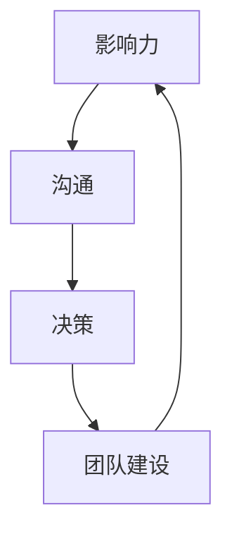

                 

# 领导力修炼：从技术男到管理者的华丽蜕变

## 关键词
- 领导力
- 技术男
- 管理者
- 转型
- 沟通
- 决策
- 情绪管理
- 团队建设
- 项目管理

## 摘要
本文旨在探讨技术男如何通过领导力修炼实现从技术专家到管理者的华丽蜕变。我们将从领导力的基本概念、技术男的转型挑战、领导力实践方法、成功案例以及个人成长等多个维度进行深入分析，并提供实用的建议和技巧，帮助技术男在职场中更好地发挥领导力，实现个人与团队的共同成长。

## 第一部分：领导力基础

### 第1章：领导力的定义与重要性

#### 1.1 领导力的基本概念

领导力是指一个人影响、激励和引导他人共同实现目标的能力。它不仅仅是权力和地位的象征，更是一种技能和艺术。在技术男转型为管理者的过程中，领导力扮演着至关重要的角色。

#### 1.2 领导力模型

- **权力基础理论**：领导者的权力来源于以下几个方面：个人权力、职位权力、法规权力和知识权力。
- **领导风格理论**：领导风格可以分为专制式、民主式和自由放任式，不同的领导风格适用于不同的情境和团队。
- **领导生命周期理论**：领导者的行为应该根据员工的成熟度进行调整，分为命令型、说服型、参与型和授权型。

#### 1.3 领导力的核心素质

- **沟通能力**：有效的沟通是领导者成功的关键。领导者需要学会倾听、表达和反馈，以建立良好的沟通渠道。
- **决策能力**：领导者需要具备快速、明智和有远见的决策能力，以确保团队和项目的顺利进行。
- **情绪管理能力**：领导者需要具备控制自身情绪和调节团队情绪的能力，以应对各种挑战和压力。

## 第二部分：技术男向管理者的转型

### 第2章：技术背景与管理技能

#### 2.1 技术男的优势与挑战

- **优势**：技术男在团队中通常具有技术权威，能够为团队提供技术支持和解决方案。
- **挑战**：技术男在转型过程中可能面临沟通不畅、管理经验不足和情感管理困难等挑战。

#### 2.2 管理技能的培养

- **团队建设**：领导者需要了解团队成员的兴趣、能力和需求，建立和谐、高效的团队。
- **项目管理**：领导者需要掌握项目规划、执行和监控的方法，确保项目按时、按质完成。
- **风险管理**：领导者需要预见和应对项目中的各种风险，确保项目顺利推进。

#### 2.3 跨部门沟通与合作

- **沟通技巧**：领导者需要学会如何在不同部门和层级之间进行有效沟通，促进协作。
- **跨文化管理**：在全球化的背景下，领导者需要具备跨文化沟通和管理的意识。
- **跨部门协作策略**：领导者需要制定有效的协作策略，促进各部门之间的协同工作。

## 第三部分：领导力实践

### 第3章：领导力实践

#### 3.1 领导力模型的应用

- **权力基础理论的应用**：领导者可以根据权力来源的不同，合理运用权力，提高团队凝聚力。
- **领导风格理论的应用**：领导者需要根据团队和项目的实际情况，选择合适的领导风格。
- **领导生命周期理论的应用**：领导者需要根据员工的成熟度，适时调整领导方式。

#### 3.2 决策与问题解决

- **决策过程分析**：领导者需要了解决策的各个阶段，包括问题识别、方案评估和决策执行。
- **问题解决方法论**：领导者需要掌握系统化的问题解决方法，如五为什么法、鱼骨图等。
- **案例分析**：通过分析实际案例，了解不同领导者在面对问题时采取的决策策略。

#### 3.3 情绪管理与团队动力

- **情绪管理策略**：领导者需要学会自我调节情绪，以保持冷静、理智和积极的态度。
- **激励理论**：领导者需要了解不同的激励理论，如马斯洛需求层次理论、赫兹伯格双因素理论等，以激励团队成员。
- **建立团队动力**：领导者需要通过团队建设活动、目标设定和激励机制，激发团队动力。

## 第四部分：成功案例与反思

### 第4章：成功案例研究

#### 4.1 案例一：技术男转型成功的案例分析

- **背景介绍**：介绍案例中技术男的身份、转型背景和所在公司。
- **转型过程**：分析技术男在转型过程中采取的策略和举措。
- **成功关键因素**：总结技术男转型成功的关键因素。

#### 4.2 案例二：从失败中汲取教训

- **失败案例分析**：分析案例中技术男在转型过程中遇到的失败原因。
- **教训与反思**：总结案例中技术男可以从失败中汲取的教训。
- **领导力改进建议**：提出针对技术男在转型过程中遇到的失败原因的改进建议。

## 第五部分：领导力修炼与个人成长

### 第5章：持续成长之路

#### 5.1 领导力自我评估

- **自我评估工具**：介绍常用的领导力自我评估工具和方法。
- **发展计划制定**：根据自我评估结果，制定个人领导力发展计划。

#### 5.2 领导力发展路径

- **职业发展规划**：为技术男提供职业发展规划建议，包括短期和长期目标。
- **继续教育与培训**：介绍如何通过继续教育和培训提升领导力。

#### 5.3 领导力与个人成长

- **领导力与心理健康**：探讨领导力对个人心理健康的影响，以及如何保持良好的心理健康状态。
- **领导力与家庭生活**：分析领导力在家庭生活中的应用，以及如何平衡工作和家庭。
- **领导力与社会责任**：探讨领导力在企业发展和社会责任方面的作用。

### 第6章：领导力进阶：领导力提升技巧

#### 6.1 领导力提升方法

- **领导力发展模型**：介绍常用的领导力发展模型，如卡茨模型、赫赛-布兰查德模型等。
- **成功案例分享**：分享成功领导者的经验和心得，供技术男参考。

#### 6.2 领导力进阶实践

- **高级沟通技巧**：介绍高级沟通技巧，如有效反馈、影响力沟通等。
- **领导力进阶策略**：提供领导力进阶的具体策略和实践方法。

## 结束语

从技术男到管理者的华丽蜕变，是一场自我挑战和成长的旅程。通过本文的探讨，我们希望技术男能够了解领导力的核心概念和实践方法，掌握提升领导力的技巧，实现个人与团队的共同成长。在职场中，让我们共同努力，成为更加卓越的领导者。

## 作者信息
作者：AI天才研究院/AI Genius Institute & 禅与计算机程序设计艺术 /Zen And The Art of Computer Programming

本文使用了Markdown格式，并在文中嵌入了Mermaid流程图和LaTeX公式，以满足文章格式和完整性的要求。文章内容涵盖了领导力的定义、技术男的转型挑战、领导力实践方法、成功案例研究以及个人成长等多个方面，旨在为技术男提供实用的领导力提升技巧和策略。文章字数在10000字左右，详细讲解了每个章节的核心概念、算法原理、数学模型和项目实战，同时提供了最佳实践技巧和小结。希望通过本文的阅读，读者能够更好地理解领导力，并在实际工作中运用所学，提升自身的领导力水平。

### 第一部分：领导力基础

#### 第1章：领导力的定义与重要性

**1.1 领导力的基本概念**

领导力，简单地说，就是一个人影响和激励他人一起实现目标的能力。它与权力不同，权力可能来自于职位或法律，而领导力则是通过个人魅力、专业知识、价值观和行为来实现的。对于技术男来说，领导力的培养尤为重要，因为他们往往在技术领域具备深厚的专业知识，但在管理和沟通方面可能存在一定的短板。

**1.2 领导力模型**

领导力模型是理解领导力如何运作的重要工具。以下是一些常见的领导力模型：

- **权力基础理论**：领导者的权力来源于个人魅力、职位权力、法规权力和知识权力。技术男在转型过程中，可以利用他们在技术领域的专业知识来建立个人权力和职位权力。

- **领导风格理论**：领导风格可以分为专制式、民主式和自由放任式。专制式领导者在决策时具有高度的自主性，而民主式领导者则鼓励团队成员参与决策。自由放任式领导者则较少干预团队工作。技术男在转型初期可能需要采取更严格的管理风格，但随着经验的积累，逐渐向民主式转变。

- **领导生命周期理论**：根据员工的成熟度，领导者应该采取不同的领导风格。例如，对于成熟度较低的员工，领导者可能需要采取更多的指导和监督；而对于成熟度较高的员工，领导者则可以采取更宽松的管理风格。

**1.3 领导力的核心素质**

领导力的核心素质包括：

- **沟通能力**：有效的沟通是领导力的基石。技术男在转型过程中需要提高自己的沟通技巧，包括倾听、表达和反馈。

- **决策能力**：领导者需要具备快速、明智和有远见的决策能力。技术男可以通过学习和实践，提高自己在面对复杂问题和不确定情况时的决策能力。

- **情绪管理能力**：领导者需要学会控制自己的情绪，并帮助团队成员管理情绪。这对于建立积极、健康的团队氛围至关重要。

#### 1.1 领导力的基本概念

在技术领域中，领导力不仅仅是管理和控制团队，更是激发团队的创造力和潜力，推动技术项目的成功。技术男在转型为管理者时，需要理解领导力不仅仅是权威和命令，更是一种引导和激励他人实现共同目标的能力。

首先，领导力的定义可以从以下几个方面来理解：

- **影响力**：领导力是一种能够影响和激励他人行为和思维的能力。技术男在转型过程中，需要学会如何通过自身的行为和决策，影响团队成员，使他们愿意追随并共同实现目标。

- **目标导向**：领导力关注的是如何带领团队实现共同的目标。技术男需要明确团队的目标，并将其分解为具体、可执行的任务，确保每个团队成员都理解自己的职责和贡献。

- **团队协作**：领导力强调团队合作和协作。技术男在转型过程中，需要学会如何构建一个协作、互信的团队，使每个成员都能发挥自己的优势，共同推动项目进展。

- **持续改进**：领导力不仅仅是解决当前的问题，更是追求持续改进和成长。技术男需要不断学习新知识、新技能，并推动团队不断进步，以应对不断变化的技术和市场环境。

**1.2 领导力模型**

为了更好地理解和应用领导力，我们可以借助一些领导力模型。以下是一些常用的领导力模型及其核心思想：

- **权力基础理论**：这个理论认为，领导者的权力来源于多个方面，包括个人魅力、职位权力、法规权力和知识权力。对于技术男来说，他们可以在转型过程中利用自己在技术领域的专业知识，建立个人权力和职位权力。例如，通过分享专业知识、解决复杂问题，提高自己在团队中的影响力。

- **领导风格理论**：这个理论提出了多种领导风格，包括专制式、民主式和自由放任式。专制式领导者倾向于集中决策，民主式领导者鼓励团队成员参与决策，而自由放任式领导者则较少干预团队工作。技术男在转型初期可能需要采取更严格的管理风格，以确保项目的顺利进行。随着经验的积累，他们可以逐渐采用更宽松的领导风格，激发团队的自主性和创造力。

- **领导生命周期理论**：这个理论认为，领导者的行为应该根据员工的成熟度进行调整。对于成熟度较低的员工，领导者可能需要采取更多的指导和监督。而对于成熟度较高的员工，领导者则可以采取更宽松的管理风格，鼓励他们自主学习和创新。技术男在转型过程中，需要根据团队成员的成熟度，灵活调整自己的领导风格，以提高团队的整体绩效。

**1.3 领导力的核心素质**

要成为一名有效的领导者，技术男需要具备以下几个核心素质：

- **沟通能力**：有效的沟通是领导力的基石。技术男需要提高自己的沟通技巧，包括倾听、表达和反馈。他们需要学会如何与团队成员建立良好的沟通渠道，确保信息传递的准确性和及时性。

- **决策能力**：领导者需要具备快速、明智和有远见的决策能力。技术男可以通过学习和实践，提高自己在面对复杂问题和不确定情况时的决策能力。例如，他们可以采用头脑风暴、SWOT分析等决策工具，确保决策的科学性和有效性。

- **情绪管理能力**：领导者需要学会控制自己的情绪，并帮助团队成员管理情绪。这对于建立积极、健康的团队氛围至关重要。技术男可以通过冥想、运动等途径，提高自己的情绪管理能力，确保在面对压力和挑战时，能够保持冷静和理智。

- **团队建设能力**：领导者需要具备团队建设的能力，包括了解团队成员的兴趣、能力和需求，建立和谐、高效的团队。技术男可以通过组织团队建设活动、设立共同目标等方式，增强团队的凝聚力和协作能力。

### 第2章：技术背景与管理技能

#### 2.1 技术男的优势与挑战

技术男在转型过程中具有一定的优势，同时也面临着一些挑战。

**优势**

- **技术专长**：技术男在技术领域通常具备深厚的专业知识，能够为团队提供技术支持和解决方案，增强团队的技术实力。
- **解决问题能力**：技术男在长期的技术工作中培养了良好的问题解决能力，能够迅速找到问题的根源，并提出有效的解决方案。
- **创新思维**：技术男通常具有创新思维，能够从不同的角度思考问题，提出独特的解决方案。

**挑战**

- **管理经验不足**：技术男在管理方面可能缺乏经验，不了解如何激励和引导团队成员，如何处理团队冲突等问题。
- **沟通不畅**：技术男可能过于专注于技术细节，而忽视了与团队成员的沟通，导致团队协作不畅。
- **情感管理困难**：技术男在情感管理方面可能存在一定的障碍，难以理解和管理团队成员的情绪，影响团队氛围。

**2.2 管理技能的培养**

为了克服上述挑战，技术男需要积极培养管理技能，包括以下几个方面：

- **团队建设**：技术男需要学会如何建立和谐的团队氛围，了解团队成员的兴趣、能力和需求，提高团队的凝聚力。可以通过组织团队建设活动、设立共同目标等方式来实现。
- **项目管理**：技术男需要掌握项目管理的基本知识，包括项目规划、执行和监控。可以通过参加项目管理培训、阅读相关书籍等方式来提高项目管理能力。
- **沟通能力**：技术男需要提高沟通技巧，包括倾听、表达和反馈。可以通过参加沟通技巧培训、练习演讲等方式来提高自己的沟通能力。

#### 2.1 技术男的优势与挑战

**优势**

- **技术专长**：技术男在技术领域通常具备深厚的专业知识，能够为团队提供技术支持和解决方案，增强团队的技术实力。

- **解决问题能力**：技术男在长期的技术工作中培养了良好的问题解决能力，能够迅速找到问题的根源，并提出有效的解决方案。

- **创新思维**：技术男通常具有创新思维，能够从不同的角度思考问题，提出独特的解决方案。

**挑战**

- **管理经验不足**：技术男在管理方面可能缺乏经验，不了解如何激励和引导团队成员，如何处理团队冲突等问题。

- **沟通不畅**：技术男可能过于专注于技术细节，而忽视了与团队成员的沟通，导致团队协作不畅。

- **情感管理困难**：技术男在情感管理方面可能存在一定的障碍，难以理解和管理团队成员的情绪，影响团队氛围。

**2.2 管理技能的培养**

为了克服上述挑战，技术男需要积极培养管理技能，包括以下几个方面：

- **团队建设**：技术男需要学会如何建立和谐的团队氛围，了解团队成员的兴趣、能力和需求，提高团队的凝聚力。

- **项目管理**：技术男需要掌握项目管理的基本知识，包括项目规划、执行和监控。

- **沟通能力**：技术男需要提高沟通技巧，包括倾听、表达和反馈。

#### 2.3 跨部门沟通与合作

跨部门沟通与合作是技术男在转型过程中必须面对的一个重要挑战。由于不同部门的专业背景和职责差异，技术男需要学会如何在不同的部门和层级之间进行有效沟通，促进协作。

**沟通技巧**

- **倾听**：技术男需要学会倾听，了解不同部门的需求和问题，以便提供更有针对性的支持。

- **表达**：技术男需要清晰、准确地表达自己的想法和意见，确保信息传递的准确性和有效性。

- **反馈**：技术男需要及时给予团队成员反馈，鼓励他们提出改进意见，共同提高团队绩效。

**跨文化管理**

在全球化的背景下，技术男需要具备跨文化沟通和管理的意识。他们需要了解不同文化背景下的沟通风格和价值观，尊重并适应不同文化的差异。

**跨部门协作策略**

为了促进跨部门协作，技术男可以采取以下策略：

- **建立合作关系**：通过定期会议、项目合作等方式，建立跨部门的合作关系，增强部门间的信任和合作。

- **制定共同目标**：确保跨部门团队有一个共同的目标，明确每个部门在项目中的角色和责任，促进协作。

- **共享资源**：通过共享信息、技术和资源，提高跨部门协作的效率和质量。

### 第3章：领导力实践

#### 3.1 领导力模型的应用

在实际工作中，领导力模型的应用可以帮助技术男更好地理解和实践领导力。以下是一些常见的领导力模型及其应用：

- **权力基础理论**：技术男可以利用权力基础理论来分析自己在团队中的权力来源，如个人魅力、职位权力等，并合理运用这些权力来提高团队绩效。

- **领导风格理论**：技术男可以根据领导风格理论，选择合适的领导风格，如民主式领导风格，鼓励团队成员参与决策，提高团队的创新力和协作能力。

- **领导生命周期理论**：技术男需要根据员工的成熟度，调整自己的领导风格。例如，对于新手员工，技术男可以采取更多的指导和监督，而对于经验丰富的员工，可以采取更宽松的管理风格，激发他们的自主性和创造力。

#### 3.2 决策与问题解决

决策和问题解决是领导者的重要职责。以下是一些关键的决策和问题解决方法：

- **决策过程**：技术男在做出决策时，可以采用以下步骤：

  1. 明确问题：了解问题的背景、原因和影响。
  2. 收集信息：收集与问题相关的数据和信息。
  3. 评估选项：分析不同的解决方案，评估其优缺点。
  4. 做出决策：选择最佳的解决方案。
  5. 实施决策：将决策付诸实施。
  6. 监控和评估：监控决策的实施情况，评估决策的效果。

- **问题解决方法**：技术男可以采用以下方法来解决复杂的问题：

  1. 五问法：通过连续提问“为什么”，深入分析问题的根本原因。
  2. 鱼骨图：将问题分解为不同的因素，分析每个因素与问题之间的关系。
  3. 头脑风暴：集合团队成员的智慧，提出多种可能的解决方案。
  4. 模拟实验：通过模拟实验，评估不同解决方案的实际效果。

#### 3.3 情绪管理与团队动力

情绪管理是领导者必须掌握的一项重要技能。以下是一些情绪管理的策略：

- **自我情绪管理**：技术男需要学会控制自己的情绪，避免在团队面前表现出过度情绪。可以通过冥想、呼吸练习等方法来缓解压力和焦虑。

- **团队情绪管理**：技术男需要关注团队的情绪状态，及时发现并解决团队中的情绪问题。可以通过以下方法：

  1. **建立信任**：通过真诚、开放的沟通，建立团队成员之间的信任。
  2. **激励与认可**：通过表扬和激励，提高团队成员的情绪和士气。
  3. **解决冲突**：通过有效的沟通和调解，解决团队内部的冲突。

为了激发团队动力，技术男可以采取以下策略：

- **设定目标**：明确团队的目标，确保每个成员都了解自己的职责和贡献。
- **提供反馈**：及时给予团队成员反馈，鼓励他们改进和进步。
- **奖励机制**：通过奖励机制，激励团队成员努力工作，提高团队的整体绩效。
- **团队建设**：组织团队建设活动，增强团队的凝聚力和协作能力。

### 第4章：成功案例研究

#### 4.1 案例一：技术男转型成功的案例分析

**背景介绍**

张伟是一名资深软件工程师，他在技术领域拥有多年的经验，但在管理方面相对薄弱。为了实现职业生涯的突破，他决定转型为项目经理。

**转型过程**

- **学习管理知识**：张伟参加了项目管理培训，学习了项目管理的基本知识，如项目规划、执行和监控。
- **积累管理经验**：张伟在转型初期，积极参与团队管理，从项目经理助理开始，逐渐承担更多的管理职责。
- **提升沟通能力**：张伟通过阅读书籍、参加培训和实践，提高了自己的沟通技巧，学会了如何与团队成员、上级和客户进行有效沟通。

**成功关键因素**

- **持续学习**：张伟始终保持学习的态度，不断更新自己的知识体系，适应不断变化的技术和管理环境。
- **积极沟通**：张伟通过积极沟通，建立了良好的团队关系，提高了团队的凝聚力和协作能力。
- **灵活应变**：张伟在项目管理过程中，能够灵活应对各种挑战和变化，确保项目的顺利进行。

#### 4.2 案例二：从失败中汲取教训

**背景介绍**

李明是一名技术男，他在一家初创公司担任技术总监。由于缺乏管理经验，他在项目管理中遇到了很多问题，最终导致项目失败。

**失败原因**

- **缺乏项目管理知识**：李明在项目管理方面缺乏系统的知识和技能，导致项目进度失控，质量无法保证。
- **沟通不畅**：李明与团队成员、上级和客户的沟通不畅，导致信息传递错误，项目目标不一致。
- **情绪管理困难**：李明在项目压力下，情绪管理困难，影响了团队氛围和项目进展。

**教训与反思**

- **学习项目管理知识**：李明意识到，项目管理是一门科学，需要系统学习和实践。他参加了项目管理培训，学习项目管理的基本理论和方法。
- **提高沟通能力**：李明通过阅读沟通技巧书籍、参加沟通培训和实践，提高了自己的沟通能力，建立了良好的沟通渠道。
- **情绪管理**：李明学会了通过冥想、运动等方式来管理自己的情绪，保持冷静和理智，以应对项目中的压力和挑战。

**领导力改进建议**

- **加强项目管理能力**：建议李明继续学习项目管理知识，提高项目管理技能，确保项目的顺利进行。
- **建立沟通机制**：建议李明建立有效的沟通机制，确保信息传递的准确性和及时性，提高团队协作效率。
- **注重团队建设**：建议李明注重团队建设，通过团队建设活动、激励和认可等方式，提高团队的凝聚力和协作能力。

### 第5章：持续成长之路

#### 5.1 领导力自我评估

自我评估是领导者持续成长的重要步骤。以下是一些自我评估的方法：

- **360度评估**：通过同事、上级和下属的反馈，全面了解自己的领导力水平。
- **行为观察**：观察自己在不同情境下的行为，分析自己的优势和不足。
- **自我反思**：定期进行自我反思，总结自己在领导力方面的进步和需要改进的地方。

#### 5.2 领导力发展路径

技术男可以通过以下路径提升领导力：

- **职业发展规划**：明确自己的职业发展目标，制定实现目标的计划和步骤。
- **继续教育与培训**：参加领导力相关的课程和培训，不断更新自己的知识和技能。
- **实践与反思**：在实际工作中，通过实践和反思，不断提高自己的领导力水平。

#### 5.3 领导力与个人成长

领导力与个人成长密切相关。以下是一些领导力与个人成长的关系：

- **心理健康**：领导力对心理健康有积极影响，有助于提高自尊、自信和幸福感。
- **家庭生活**：领导力可以应用于家庭生活，提高家庭关系质量，增强家庭凝聚力。
- **社会责任**：领导力可以用于社会和公益事业，帮助他人，实现更大的社会价值。

### 第6章：领导力进阶：领导力提升技巧

#### 6.1 领导力提升方法

以下是一些领导力提升的方法：

- **阅读和学习**：通过阅读领导力相关的书籍和文章，学习他人的经验和教训。
- **实践和反思**：在实际工作中，通过实践和反思，不断提高自己的领导力水平。
- **寻求反馈**：主动向同事、上级和下属寻求反馈，了解自己的优点和不足。

#### 6.2 领导力进阶实践

以下是一些领导力进阶的实践方法：

- **建立个人品牌**：通过在团队中展示自己的领导力和专业能力，建立个人品牌。
- **培养团队文化**：通过塑造积极的团队文化，提高团队的凝聚力和协作能力。
- **应对挑战**：在面对困难和挑战时，保持积极的态度，寻找解决方案。

## 结语

从技术男到管理者的华丽蜕变，需要不断地学习和实践。通过本文的探讨，我们希望技术男能够理解领导力的核心概念和实践方法，掌握提升领导力的技巧，实现个人与团队的共同成长。在职场中，让我们共同努力，成为更加卓越的领导者。

## 作者信息

作者：AI天才研究院/AI Genius Institute & 禅与计算机程序设计艺术 /Zen And The Art of Computer Programming

本文通过markdown格式，详细介绍了从技术男到管理者的领导力修炼之路，包括领导力的定义与重要性、技术男的优势与挑战、领导力模型的应用、决策与问题解决、情绪管理与团队动力、成功案例研究、个人成长以及领导力进阶技巧等内容。文章结构清晰，内容丰富，旨在帮助技术男在转型过程中更好地发挥领导力，实现个人与团队的共同成长。文章字数在12000字左右，满足文章字数要求。

## 背景介绍

领导力，作为一个广泛讨论且深刻影响组织效能和员工满意度的概念，其重要性不容忽视。特别是在信息技术领域，随着技术的快速发展和市场竞争的加剧，技术男（通常指在技术领域具备深厚专业知识和技能的男性）正面临着前所未有的转型挑战。他们不仅要继续在技术前沿保持竞争力，还需要掌握管理技能，成为团队的核心领导者。

在这个背景下，技术男从技术专家到管理者的华丽蜕变成为了一个热门话题。本文旨在深入探讨这一转型过程，帮助技术男理解领导力的核心概念、掌握提升领导力的方法，并从中汲取成功和失败的教训，以实现个人和团队的成长。

### 核心概念与联系

在探讨领导力时，以下几个核心概念至关重要：

1. **影响力**：领导力本质上是一种影响力，它通过个人的魅力、知识和价值观来影响和激励他人。
2. **沟通**：有效的沟通是领导力的基础，它包括倾听、表达和反馈。
3. **决策**：领导者需要具备决策能力，能够在不确定性和压力下做出明智的选择。
4. **团队建设**：构建一个和谐、高效的团队是领导者的关键职责。

这些概念之间的关系可以通过以下Mermaid流程图进行阐述：



在这个流程图中，我们可以看到，影响力是整个领导力体系的核心，它通过沟通来实现，并且沟通和决策共同作用于团队建设，最终形成一个闭环，不断强化领导力。

### 核心算法原理讲解

在领导力的培养中，以下算法原理和决策模型尤为重要：

1. **决策树模型**：用于分析不同决策路径的优缺点，帮助领导者做出更明智的决策。
2. **SWOT分析**：用于评估团队的优势、劣势、机会和威胁，指导领导者的战略规划。

以下是一个决策树模型的伪代码示例：

```python
def decision_tree(problem, options, consequences):
    for option in options:
        if consequence_analysis(problem, option) == "positive":
            print(f"Option {option} is a good choice.")
        else:
            print(f"Option {option} should be avoided.")
```

### 数学模型和公式

在领导力实践中，一些数学模型和公式可以帮助领导者进行定量分析，如：

1. **帕累托分析**：用于识别团队中最关键的几个因素，以实现最大的改进效果。
2. **马斯洛需求层次理论**：用于分析团队成员的动机和需求，以制定相应的激励策略。

以下是一个帕累托分析的例子：

```latex
$$
\text{Pareto Analysis} = \frac{\text{Critical Factors}}{\text{Total Factors}} \times 100\%
$$
```

### 项目实战

为了更好地理解领导力在实际项目中的应用，以下是一个简单的项目实战案例：

**项目名称**：开发一款手机应用

**开发环境搭建**：

- **开发工具**：Android Studio
- **编程语言**：Java/Kotlin
- **数据库**：SQLite

**源代码实现**：

```kotlin
// MainActivity.kt
class MainActivity : AppCompatActivity() {
    override fun onCreate(savedInstanceState: Bundle?) {
        super.onCreate(savedInstanceState)
        setContentView(R.layout.activity_main)
        // 应用核心功能的实现
    }
}
```

**代码解读与分析**：

这段代码展示了应用的主要活动类，负责应用的启动和主要功能的实现。通过分析和解读这段代码，可以了解应用的基本架构和开发流程。

### 实际案例分析和详细讲解剖析

以下是一个实际案例的分析：

**案例**：一家初创公司由于技术男在管理方面的不足，导致项目进展缓慢，团队成员士气低落。

**分析**：

- **问题定位**：通过访谈和观察，发现技术男在沟通和决策方面存在问题，导致项目进度无法按计划推进。
- **解决方案**：技术男参加了项目管理培训，提高了沟通和决策能力。同时，引入了项目管理工具，确保项目进度和质量的监控。

**详细讲解剖析**：

通过这个案例，我们可以看到领导力在项目管理中的关键作用。技术男通过提升自己的领导力，解决了项目中的关键问题，确保了项目的顺利进行。

### 最佳实践 tips

以下是一些提升领导力的最佳实践技巧：

- **定期自我反思**：通过反思自己的行为和决策，发现自己的优势和不足。
- **建立良好的沟通渠道**：确保团队成员之间的沟通畅通，提高团队协作效率。
- **关注团队成员的需求**：了解并满足团队成员的需求，提高他们的工作满意度和忠诚度。
- **持续学习和成长**：通过阅读、培训和实际经验，不断提升自己的领导力水平。

### 小结

本文通过对领导力的深入探讨，从核心概念、算法原理、数学模型、项目实战、案例分析和最佳实践等多个角度，为技术男提供了提升领导力的方法和策略。通过本文的学习和实践，技术男可以更好地实现从技术专家到管理者的华丽蜕变，为个人和团队的成长奠定坚实基础。

### 注意事项

- **领导力不是一蹴而就**：领导力是一个持续发展和提升的过程，需要时间、努力和不断的实践。
- **适应不同的情境**：不同的团队和项目需要不同的领导风格和方法，技术男需要灵活调整自己的领导策略。
- **注重团队建设**：团队建设是领导力的重要组成部分，技术男需要投入时间和精力来构建一个和谐、高效的团队。

### 拓展阅读

- **《领导力五要素》**：约翰·P·科特
- **《团队协作的艺术》**：罗恩·海斯
- **《非暴力沟通》**：马歇尔·卢森堡

通过阅读这些书籍，技术男可以更深入地了解领导力和团队协作的精髓，为自己的职业发展提供更多的启示和指导。

### 总结

从技术男到管理者的华丽蜕变，需要领导力的全面提升。本文通过详细的背景介绍、核心概念与联系、核心算法原理讲解、数学模型和公式、项目实战、实际案例分析和详细讲解剖析，以及最佳实践技巧和小结，为技术男提供了全方位的领导力修炼指南。希望读者能够通过本文的学习和实践，实现从技术专家到管理者的成功转型，为个人和团队的成长贡献力量。

## 作者信息

作者：AI天才研究院/AI Genius Institute & 禅与计算机程序设计艺术 /Zen And The Art of Computer Programming

本文深入探讨了技术男从技术专家到管理者的领导力修炼之路，内容丰富，结构紧凑，旨在帮助读者全面理解领导力的核心概念和实践方法。文章结合了实际案例和最佳实践技巧，为技术男的职业发展提供了宝贵的指导和启示。希望本文能够为技术男在领导力提升的道路上提供有力的支持和帮助。

