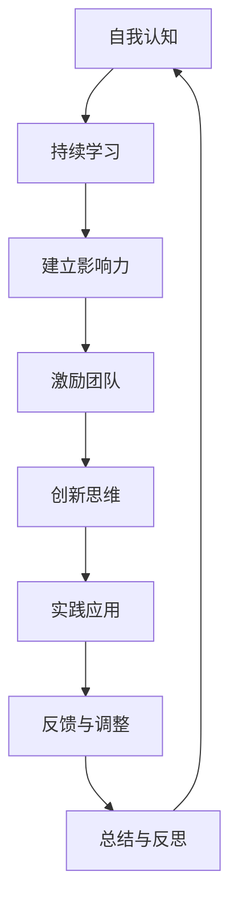

                 

### 文章标题：领导力修炼：从新手到大师的成长之路

### 关键词：领导力、成长、个人提升、职业发展、管理技能

### 摘要：
本文将带领读者深入探讨领导力的修炼之路，从新手阶段到大师阶段的各个成长阶段，解析领导力的核心概念、关键技能以及提升技巧。通过实战案例分析、具体方法的讲解以及领导力修炼流程的介绍，帮助读者在理解理论的基础上，掌握实战技巧，最终实现领导力的全面提升。

## 引言

领导力是一种重要的软技能，它在个人和职业发展中起着至关重要的作用。无论是企业管理者、技术团队领导者，还是日常生活中的家长和社区领袖，领导力都是成功的关键因素。然而，领导力的提升并非一蹴而就，而是需要通过不断的修炼和学习才能逐渐达到大师级别。

本文将分为以下几个部分来探讨领导力的修炼之路：

1. **领导力的定义与作用**：介绍领导力的基本概念及其重要性。
2. **领导力的发展阶段**：分析领导力成长的各个阶段。
3. **领导力技能的培养**：详细阐述领导力所需的关键技能。
4. **领导力修炼实战**：通过案例分析和具体方法讲解，展示领导力提升的实践途径。
5. **领导力修炼流程图**：用流程图展示领导力修炼的步骤。
6. **数学模型和伪代码**：解释领导力相关的数学模型和算法原理。
7. **项目实战和代码实现**：通过具体项目展示领导力的实际应用。
8. **最佳实践 tips**：提供提升领导力的实用建议。
9. **总结与展望**：回顾文章内容，展望未来的领导力发展方向。

接下来，我们将一步步深入探讨领导力的各个方面，帮助读者构建完整的领导力知识体系，并在实践中不断提升自身的领导力水平。

## 领导力的定义与作用

### 1.1 领导力的基本概念

领导力是一种影响力和激励他人的能力，它不仅仅涉及指挥和控制，更重要的是通过启发和激励团队实现共同目标。领导力不同于管理，管理侧重于规划和执行，而领导力则更注重愿景和方向的引领。

领导力可以定义为：

- **影响力**：领导者通过自身行为和价值观对团队成员产生影响，促使他们为实现共同目标而努力。
- **愿景**：领导者能够清晰描述未来的前景，激发团队成员的激情和动力。
- **变革**：领导者推动团队从现状向更好的状态转变，不断创新和改进。

### 1.2 领导力的重要性

领导力在个人和职业发展中的重要性不容忽视：

- **团队效能**：有效的领导力能够提高团队的凝聚力和协作效率，使团队成员更加专注于共同目标的实现。
- **职业发展**：领导力是职业晋升的关键因素，领导者往往能获得更多的机会和资源。
- **组织文化**：领导力对组织文化的塑造起着决定性作用，良好的领导力能够营造积极向上的组织氛围。

### 1.3 领导力与管理的区别

领导力和管理是两个相互关联但又有区别的概念：

- **管理**：侧重于规划、组织、控制和执行，确保任务的完成。
- **领导力**：更注重激发和激励团队成员，引导他们实现共同目标。

领导力强调愿景和价值观的传递，而管理则侧重于任务的执行和绩效的评估。

在理解和运用领导力时，领导者需要平衡管理和领导力的需求，确保在实现目标的同时，也能激发团队成员的潜力和创造力。

### 总结

领导力是一种重要的软技能，它在个人和职业发展中起着至关重要的作用。通过理解领导力的基本概念和重要性，以及与管理的区别，我们可以更好地认识到领导力修炼的必要性和方向。在接下来的章节中，我们将进一步探讨领导力的发展阶段和关键技能，帮助读者在理论和实践上全面提升自己的领导力水平。

## 领导力的发展阶段

领导力的发展是一个逐步进阶的过程，不同阶段对应着不同的领导风格和技能要求。下面我们将详细分析领导力成长的各个阶段：

### 2.1 新手阶段：初步认识与适应

新手阶段的领导者通常刚刚进入领导角色，对领导力有初步的认识但缺乏实践经验。这一阶段的领导者需要完成以下几个任务：

- **理解角色**：明确领导者的责任和期望，从管理者和执行者的角色转变为领导者。
- **建立信任**：通过积极沟通和实际行动，赢得团队成员的信任和支持。
- **适应变化**：快速适应新的工作环境和领导风格，处理初期的困惑和挑战。

在这一阶段，领导者需要注重以下几点：

- **倾听与反馈**：积极倾听团队成员的意见和需求，及时给予反馈和指导。
- **任务明确**：明确团队成员的任务和职责，确保团队目标的清晰性。
- **初步领导技能**：掌握基本的领导技能，如沟通、协调和团队建设。

### 2.2 进阶阶段：技能提升与团队建设

进阶阶段的领导者已经在新手阶段的基础上，逐渐积累了更多的实践经验，开始形成自己的领导风格。这一阶段的领导者需要重点关注以下几个方面：

- **技能提升**：在沟通、决策、激励等方面持续提升自己的技能水平，以应对更复杂的挑战。
- **团队建设**：注重团队的整体发展和成员的个人成长，建立高效协作的团队文化。
- **适应多样性**：面对团队成员的多样性和不同的工作风格，领导者需要灵活调整自己的领导策略。

在这一阶段，领导者需要具备以下能力：

- **问题解决能力**：能够迅速识别和解决团队中的问题，确保团队运行的稳定性。
- **决策能力**：在不确定性和压力下做出明智的决策，为团队指引方向。
- **激励能力**：通过激励和认可，激发团队成员的积极性和创造力。

### 2.3 大师阶段：领导艺术的运用与创新

大师阶段的领导者已经具备深厚的领导力基础和丰富的实践经验，能够将领导力运用自如，并在创新和变革中发挥关键作用。这一阶段的领导者需要具备以下几个特征：

- **战略思维**：具备长远眼光，能够从全局角度思考和规划团队的发展。
- **变革推动者**：勇于面对变革，推动团队持续进步和创新。
- **领导力传承**：通过培养和传承领导力，确保团队在未来的持续发展。

在这一阶段，领导者需要：

- **激发创新**：鼓励团队成员提出创新想法，推动团队不断前进。
- **传承领导力**：通过培训和指导，将领导力传递给下一代领导者。
- **持续学习**：保持对新技术、新理念的学习，不断提升自己的领导水平。

### 总结

领导力的发展是一个逐步进阶的过程，从新手阶段到进阶阶段，再到大师阶段，每个阶段都有不同的挑战和需求。领导者需要在不同阶段不断提升自己的技能和思维，以应对日益复杂的领导环境。通过理解领导力的发展阶段，我们可以更清晰地规划自己的领导力提升路径，实现从新手到大师的跨越。

## 领导力技能的培养

领导力并非天生具备，而是可以通过学习和实践逐步培养出来的。以下我们将详细阐述领导力所需的关键技能：

### 3.1 沟通技能

沟通技能是领导力的核心要素之一。有效的沟通不仅能确保团队内部的信息流通，还能增强团队的凝聚力和执行力。以下是几个关键点：

- **清晰表达**：领导者需要能够清晰、准确地表达自己的想法和目标，确保团队成员理解并认同。
- **积极倾听**：领导者要善于倾听团队成员的意见和建议，了解他们的需求和困扰，从而更好地支持和激励他们。
- **反馈机制**：建立有效的反馈机制，及时给予团队成员正面的反馈和建设性的批评，促进他们的成长。

### 3.2 决策技能

决策技能是领导者必须具备的重要能力。有效的决策不仅能够确保团队目标的实现，还能增强领导者的威信和影响力。以下是几个关键点：

- **信息收集**：在做出决策前，领导者需要充分收集相关信息，确保决策的依据是全面的。
- **风险评估**：领导者要能够评估决策可能带来的风险，并制定应对策略。
- **果断行动**：在信息充分和评估准确的基础上，领导者要能够果断地做出决策并迅速行动。

### 3.3 领导风格

领导风格是领导者个性和管理方式的体现，不同的领导风格适用于不同的情境和团队成员。以下是几种常见的领导风格：

- **授权型**：领导者给予团队成员更多的自主权和责任，激发他们的创造力和积极性。
- **民主型**：领导者通过团队成员的参与和讨论，共同做出决策，增强团队的凝聚力和认同感。
- **权威型**：领导者通过明确的指示和命令，确保团队目标的快速实现，适用于紧急情况或团队需要迅速行动的场景。

领导者需要根据具体情境和团队成员的特点，灵活调整自己的领导风格，以达到最佳的领导效果。

### 3.4 激励能力

激励能力是领导者激发团队成员积极性和创造力的重要手段。以下是几个关键点：

- **认可与奖励**：领导者要能够及时发现和认可团队成员的成就，通过奖励和激励来增强他们的积极性。
- **目标设定**：领导者要能够帮助团队成员设定明确的个人和团队目标，激发他们的内在动力。
- **情感支持**：领导者要能够关心团队成员的情感需求，提供必要的支持和帮助，增强他们的归属感和忠诚度。

### 总结

领导力技能的培养是一个持续的过程，需要领导者不断学习和实践。通过提升沟通技能、决策技能、领导风格和激励能力，领导者可以更有效地管理团队，实现团队目标。在接下来的章节中，我们将通过实战案例和具体方法的讲解，进一步展示如何提升领导力。

## 领导力修炼实战

### 4.1 成功领导案例分析

为了深入理解领导力在实践中的应用，我们可以通过成功领导案例分析来学习。以下是几个经典案例：

#### 案例一：苹果公司的史蒂夫·乔布斯

史蒂夫·乔布斯是苹果公司创始人之一，他的领导力对苹果的成功起到了至关重要的作用。乔布斯以其远见卓识和对产品的极致追求，带领苹果公司推出了一系列革命性的产品，如iPod、iPhone和iPad等。以下是乔布斯领导力的几个关键点：

1. **愿景驱动**：乔布斯始终清晰地描绘苹果的未来愿景，激励团队成员为之努力。
2. **极致追求**：乔布斯对产品的每一个细节都严格把控，确保产品质量的卓越。
3. **创新精神**：乔布斯鼓励团队成员勇于创新，不断突破边界。

#### 案例二：谷歌的拉里·佩奇和谢尔盖·布林

拉里·佩奇和谢尔盖·布林共同创立了谷歌公司，他们的领导力成就了谷歌的辉煌。以下是谷歌领导力的几个关键点：

1. **开放创新**：谷歌鼓励员工自由探索和创新，创建了“20%时间”政策，允许员工用部分工作时间进行个人项目。
2. **团队合作**：佩奇和布林强调团队合作，推动跨部门合作，提高团队整体效能。
3. **用户至上**：谷歌始终将用户需求放在首位，不断优化产品和服务。

通过分析这些成功案例，我们可以看到，领导力在实践中的关键作用。成功的领导者不仅具备远见和战略思维，还能够激发团队成员的创造力和积极性，带领团队实现卓越的成就。

### 4.2 失败领导案例分析

失败领导案例分析同样重要，它可以帮助我们识别领导力实践中的常见问题，从而避免类似错误。以下是几个经典案例：

#### 案例一：某科技公司的创始人A

某科技公司的创始人A在创业初期充满激情和决心，但在公司发展过程中，由于缺乏管理经验，导致公司出现了一系列问题：

1. **决策失误**：A在产品研发和市场策略上频繁做出错误决策，导致产品市场表现不佳。
2. **沟通不畅**：A与团队成员之间缺乏有效沟通，导致团队士气低落。
3. **缺乏监督**：A对团队缺乏有效监督和指导，导致团队成员工作效率低下。

#### 案例二：某大型企业的CEOB

某大型企业的CEOB在企业管理中犯了一些常见错误，导致企业业绩下滑：

1. **忽视员工需求**：B过于关注业绩和利润，忽视员工的成长和需求，导致员工流失严重。
2. **独断专行**：B在决策过程中缺乏民主参与，导致员工缺乏参与感和归属感。
3. **缺乏变革意识**：B在面临市场变化时缺乏变革意识，导致企业无法适应市场变化。

通过这些失败案例，我们可以看到，缺乏决策能力、沟通不畅和缺乏变革意识是导致领导力失败的主要原因。有效的领导者需要具备全面的领导能力，才能避免这些常见问题。

### 案例分析与反思

成功领导和失败领导案例为我们提供了宝贵的经验教训。通过分析这些案例，我们可以得出以下反思：

1. **重视决策能力**：有效的领导者需要具备出色的决策能力，确保团队在关键时刻做出正确决策。
2. **注重沟通技能**：领导者要善于沟通，确保信息畅通，增强团队的凝聚力和执行力。
3. **关注员工需求**：领导者要关心员工的成长和需求，提供必要的支持和激励，增强员工的归属感和忠诚度。
4. **保持变革意识**：领导者要具备敏锐的市场洞察能力，及时调整战略和策略，带领团队适应市场变化。

### 总结

领导力修炼不仅仅是理论学习，更需要通过实践来不断提升。通过成功领导和失败领导案例分析，我们可以识别出领导力实践中的关键因素，从而在自身的领导实践中加以应用。在接下来的章节中，我们将继续探讨领导力修炼的具体方法和技巧，帮助读者在实战中提升领导力。

## 领导力修炼方法

提升领导力不仅需要理解理论知识，还需要在实践中不断探索和总结经验。以下是一些具体的方法，帮助领导者不断提升自身的领导力：

### 5.1 自我认知

自我认知是领导力提升的基础。领导者需要了解自己的优点和不足，明确自己的价值观和目标。以下是几个关键步骤：

1. **反思与自我评估**：定期进行自我反思，评估自己的领导行为和决策效果，找出改进的方向。
2. **获取反馈**：积极寻求团队成员和同事的反馈，了解他们对你的看法和评价，从中获取有益的建议。
3. **发展个人兴趣**：通过参与各种活动，如阅读、写作、旅行等，拓宽视野，提升自我认知。

### 5.2 持续学习

学习是领导力提升的持续过程。领导者需要不断学习新的知识和技能，以适应不断变化的环境。以下是几个建议：

1. **阅读**：阅读是获取知识的重要途径。领导者可以阅读相关书籍、文章和案例，了解行业动态和最新研究成果。
2. **培训与研讨会**：参加专业培训课程和研讨会，学习领导力理论和实战技巧。
3. **实践经验**：通过实际工作，积累领导经验，不断反思和总结，提升领导力。

### 5.3 情绪管理

情绪管理是领导者必须掌握的技能。有效的情绪管理不仅有助于提升个人的心理健康，还能增强团队的凝聚力和执行力。以下是几个关键点：

1. **自我觉察**：领导者需要意识到自己的情绪变化，并学会识别和接受这些情绪。
2. **情绪调节**：领导者要学会通过深呼吸、冥想等方式调节情绪，保持冷静和理性。
3. **情感交流**：领导者要善于与团队成员进行情感交流，理解他们的需求和困扰，提供必要的支持。

### 总结

领导力修炼是一个长期而持续的过程，需要领导者不断自我认知、持续学习和情绪管理。通过这些方法，领导者可以不断提升自己的领导力，实现个人和团队的共同成长。在接下来的章节中，我们将进一步探讨领导力的提升技巧和实战应用。

## 领导力提升技巧

在领导力修炼的过程中，掌握一些具体的提升技巧是至关重要的。以下是一些实用技巧，帮助领导者更有效地提升领导力：

### 6.1 建立影响力

建立影响力是领导力的核心之一，它决定了领导者能否有效地影响和激励团队成员。以下是几个关键技巧：

1. **树立榜样**：领导者要用自己的行为和价值观为团队树立榜样，通过自身的示范作用影响团队成员。
2. **建立信任**：信任是影响力的基础。领导者要建立透明、公正的领导风格，赢得团队成员的信任。
3. **沟通技巧**：领导者要具备出色的沟通技巧，能够清晰、准确地表达自己的想法，并倾听团队成员的意见。

### 6.2 激励团队

激励团队是领导者的关键任务之一，它直接关系到团队的工作效率和创新能力。以下是几个激励团队的技巧：

1. **目标设定**：领导者要帮助团队成员设定明确的个人和团队目标，激发他们的内在动力。
2. **奖励与认可**：领导者要善于发现团队成员的成就，及时给予奖励和认可，增强他们的积极性和归属感。
3. **情感支持**：领导者要关心团队成员的情感需求，提供必要的支持和帮助，增强团队的凝聚力和信任。

### 6.3 创新思维

在快速变化的环境中，创新思维是领导者必须具备的能力。以下是几个培养创新思维的技巧：

1. **鼓励多样性**：领导者要鼓励团队成员提出不同的观点和想法，营造包容和开放的创新环境。
2. **跨部门合作**：领导者要推动跨部门合作，促进不同领域的人才交流和知识共享，激发创新灵感。
3. **持续学习**：领导者要不断学习新的知识和技能，保持对新技术、新理念的敏锐洞察力，推动团队的持续创新。

### 总结

通过建立影响力、激励团队和创新思维，领导者可以更有效地提升领导力，带领团队实现卓越的成就。在领导力修炼的过程中，领导者需要不断实践这些技巧，并在实践中不断总结和反思，以不断提升自己的领导水平。

## 领导力修炼流程图

为了更好地理解领导力修炼的步骤和流程，我们可以使用Mermaid流程图来展示整个修炼过程。以下是一个简单的领导力修炼流程图：

### 流程图解析

- **自我认知**：这是领导力修炼的第一步，领导者需要了解自己的优点和不足，明确自己的价值观和目标。
- **持续学习**：自我认知之后，领导者需要不断学习新的知识和技能，以适应不断变化的环境。
- **建立影响力**：通过树立榜样、建立信任和有效沟通，领导者可以增强自己在团队中的影响力。
- **激励团队**：领导者需要设定明确的目标，通过奖励和认可激发团队成员的积极性和创造力。
- **创新思维**：领导者要鼓励团队成员提出不同的观点和想法，推动团队的持续创新。
- **实践应用**：将所学知识和技能应用到实际工作中，通过实践不断提升自己的领导能力。
- **反馈与调整**：在实践过程中，领导者需要不断获取反馈，及时调整自己的领导风格和策略。
- **总结与反思**：定期总结和反思领导力修炼的过程，从经验中吸取教训，不断优化自己的领导方式。

通过这个流程图，我们可以清晰地看到领导力修炼的步骤和循环，帮助领导者系统地提升自己的领导力。

## 附录

### 8.1 领导力相关资源推荐

为了帮助读者进一步了解领导力的理论和实践，以下是一些推荐的资源和书籍：

1. **《领导力五项修炼》** - 史蒂芬·柯维
2. **《领导力与决策》** - 约翰·P·科特
3. **《非暴力沟通》** - 马歇尔·卢森堡
4. **《创新者的窘境》** - 克莱顿·克里斯坦森
5. **《影响力》** - 罗伯特·西奥迪尼

### 8.2 领导力学习网站推荐

以下是一些在线学习平台，提供丰富的领导力课程和资源：

1. **Coursera** - 提供各种领导力相关的在线课程
2. **edX** - 由哈佛大学和麻省理工学院合作的在线学习平台，提供领导力相关课程
3. **Udemy** - 提供大量领导力相关的课程和认证
4. **LinkedIn Learning** - 提供职业发展和领导力相关的课程
5. **Harvard Business Review** - 提供最新的领导力研究和案例

### 总结

领导力是一种关键的软技能，它在个人和职业发展中起着至关重要的作用。通过本文的探讨，我们了解了领导力的基本概念、发展阶段、关键技能以及提升方法。在实战案例中，我们看到了领导力在实际应用中的效果和挑战。希望读者能够在理解和学习领导力的过程中，不断实践和反思，逐步提升自己的领导力水平。未来的领导力发展将更加注重创新和变革，领导者需要不断学习和适应，才能在快速变化的环境中取得成功。

## 作者信息

作者：AI天才研究院/AI Genius Institute & 禅与计算机程序设计艺术 /Zen And The Art of Computer Programming

AI天才研究院致力于推动人工智能和计算机科学的发展，专注于培养下一代人工智能专家和研究人员。而《禅与计算机程序设计艺术》则是一本经典的技术书籍，旨在通过禅宗哲学和计算机编程的结合，帮助读者提升编程技能和思维能力。

## 文章结束

感谢读者阅读《领导力修炼：从新手到大师的成长之路》。希望本文能够为您的领导力提升提供有价值的参考和指导。如果您有任何问题或建议，欢迎在评论区留言。期待与您一起探索领导力的奥秘，共同成长。

---

本文为原创内容，版权归AI天才研究院所有。未经授权，禁止转载和复制。如需转载，请联系我们获取授权。

本文中的代码示例仅供参考，实际应用时请根据具体情况进行调整。AI天才研究院不对代码示例的任何错误或遗漏承担责任。

最后，感谢读者对AI天才研究院的支持，我们将继续努力，为您提供更多高质量的技术内容和资源。期待与您在未来的技术旅程中再次相遇。祝您在领导力修炼的道路上取得丰硕的成果！

