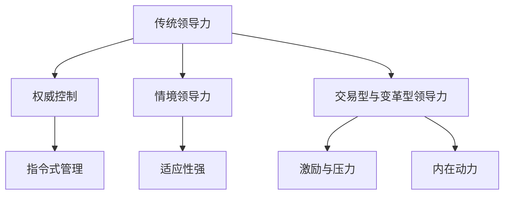

                 

### 文章标题

《领导力心法：成就一代企业家的领导力法则》

### 关键词

领导力、企业家、核心原则、个人成长、团队管理、实战案例

### 摘要

在快速变化的市场环境中，领导力成为企业成功的关键因素。本书《领导力心法：成就一代企业家的领导力法则》深入探讨了领导力的核心概念、实践方法和提升策略，旨在为企业家提供系统的领导力指导。本书通过详细解析领导力的核心原则，结合实际案例分析，旨在帮助读者理解并掌握如何在复杂商业环境中实现卓越领导。

### 目录

#### 第一部分：领导力基础

##### 第1章：领导力的定义与类型

###### 1.1 领导力的基本概念
- 领导力的定义
- 领导力与管理的区别
- 领导力在组织中的作用

###### 1.2 领导力的不同类型
- 传统领导力
- 情境领导力
- 交易型与变革型领导力

##### 第2章：领导力的核心原则

###### 2.1 领导力心法概述
- 领导力心法的基本原则
- 领导力心法的重要性

###### 2.2 人本领导
- 关注员工需求
- 提升员工参与度
- 建立信任关系

##### 第3章：领导力与个人成长

###### 3.1 自我意识
- 认识自我
- 自我反思

###### 3.2 持续学习
- 学习心态
- 学习方法

##### 第4章：领导力与团队管理

###### 4.1 团队建设
- 团队角色
- 团队文化

###### 4.2 激励团队
- 目标设定
- 赞赏与激励

##### 第5章：企业家领导力特质

###### 5.1 创业精神
- 风险管理
- 机会识别

###### 5.2 战略规划
- 长期规划
- 短期策略

##### 第6章：领导力心法应用案例

###### 6.1 案例分析
- 成功案例分析
- 失败案例分析

###### 6.2 案例解读
- 领导力心法在案例中的应用
- 领导力心法的调整与优化

### 第一部分：领导力基础

#### 第1章：领导力的定义与类型

领导力是现代社会和企业中不可或缺的关键能力。它不仅影响个人职业生涯的成功，也对企业的发展起着至关重要的作用。本章节将探讨领导力的基本概念、类型及其重要性。

##### 1.1 领导力的基本概念

领导力是指一个人在组织内引导和激励他人以实现共同目标的能力。它不仅仅是管理职责的一部分，更是一种影响力，能够激发团队成员的潜力，推动组织的持续发展。领导力不同于管理，管理侧重于规划、组织和控制资源，而领导力则侧重于激发和引导他人。

###### 1.1.1 领导力的定义

领导力可以理解为一种影响力，它不仅包括领导者的个人特质，还涉及与团队成员的互动和关系。在组织内，领导力的重要性体现在以下几个方面：

- **愿景和目标**：领导力帮助组织明确愿景和目标，使团队成员对组织的发展方向有清晰的认识。
- **激励和动员**：领导者通过激励和动员，能够激发团队成员的积极性和创造力。
- **决策和应对**：领导力在决策过程中起着关键作用，领导者需要能够应对复杂的环境变化。
- **团队合作**：领导力有助于建立高效的团队，促进团队成员之间的协作和沟通。

###### 1.1.2 领导力与管理的区别

虽然领导力和管理密切相关，但两者在性质和目标上有所不同。管理侧重于维持现有秩序和实现短期目标，而领导力则侧重于创新和实现长期愿景。

- **管理**：管理是组织运作的基础，它涉及规划、组织、领导和控制。管理者通过制定规章制度来确保组织目标的实现。
- **领导力**：领导力则是激发团队成员的潜力，推动组织不断创新和发展的动力。领导者通过影响力来引导团队成员，实现组织的愿景。

###### 1.1.3 领导力在组织中的作用

领导力在组织中的重要性体现在以下几个方面：

- **战略方向**：领导力帮助组织明确战略方向，确保组织资源得到有效利用。
- **文化塑造**：领导力在塑造组织文化方面起着关键作用，良好的领导力能够培养积极向上的组织氛围。
- **创新驱动**：领导力能够推动组织创新，适应市场变化，保持竞争力。
- **团队协作**：领导力有助于建立高效的团队，促进团队成员之间的协作和沟通。

##### 1.2 领导力的不同类型

领导力并非一成不变，不同的情境和需求可能需要不同的领导风格。以下是几种常见的领导力类型：

###### 1.2.1 传统领导力

传统领导力主要侧重于权威和控制。领导者通过明确指令和规章制度来确保团队成员按照既定的计划行事。传统领导力适用于组织结构稳定、任务明确的情境。

###### 1.2.2 情境领导力

情境领导力认为领导风格应该根据具体情况灵活调整。领导者需要根据团队成员的能力和需求，选择最适合的领导风格。情境领导力强调适应性，适用于复杂多变的环境。

###### 1.2.3 交易型与变革型领导力

交易型领导力强调奖励和惩罚机制，通过激励和压力来推动团队成员完成任务。变革型领导力则侧重于激发团队成员的内在动力，推动组织变革和发展。

##### Mermaid 流程图

以下是领导力类型的关系架构 Mermaid 流程图：



通过上述内容，我们可以对领导力的基本概念、类型及其重要性有一个初步了解。在下一章中，我们将深入探讨领导力的核心原则，帮助读者理解如何在实际工作中应用领导力，实现个人和组织的发展。

### 第1章：领导力的核心原则

领导力并非仅仅是职位赋予的权力，而是一种通过影响他人来实现共同目标的能力。有效的领导力需要具备一系列核心原则，这些原则不仅适用于企业家，也适用于各类组织的领导者。在本章节中，我们将详细探讨领导力的核心原则，并分析这些原则如何在实际工作中得到应用。

##### 2.1 领导力心法概述

领导力心法是指一系列关于领导力的核心原则和方法，它们是领导者成功的关键。这些原则涵盖了领导力中的各个方面，从个人成长到团队管理，再到战略规划。以下是领导力心法的基本原则：

- **人本领导**：关注员工需求，提升员工参与度，建立信任关系。
- **自我意识**：认识自我，自我反思，持续提升自我认知。
- **持续学习**：保持学习心态，运用有效学习方法，不断提升自身能力。
- **团队建设**：构建高效团队，培养团队文化，促进团队合作。
- **激励与动员**：设定明确目标，提供适当激励，激发团队潜力。

##### 2.2 人本领导

人本领导强调以人为中心，关注员工的成长和需求。人本领导的核心原则包括：

###### 2.2.1 关注员工需求

领导者需要了解员工的需求，包括职业发展、工作环境和生活平衡等方面。通过了解员工需求，领导者可以提供更有针对性的支持，提升员工满意度和忠诚度。

###### 2.2.2 提升员工参与度

员工参与度是组织成功的关键。领导者可以通过以下方法提升员工参与度：

- **授权**：给予员工更多的自主权和责任，让员工参与决策过程。
- **沟通**：建立开放的沟通渠道，鼓励员工表达意见和建议。
- **培训**：提供培训和职业发展机会，帮助员工提升技能和知识。

###### 2.2.3 建立信任关系

信任是领导者与员工之间的重要纽带。建立信任关系可以通过以下方式实现：

- **透明度**：保持信息的透明，让员工了解组织的实际情况。
- **公正**：公正地处理员工问题和冲突，维护组织的公平性。
- **尊重**：尊重员工的个人差异和意见，建立互相尊重的工作环境。

##### 2.3 自我意识

自我意识是领导者成长的重要基础。通过自我意识，领导者可以更好地了解自己的优势和不足，从而进行有针对性的提升。

###### 2.3.1 认识自我

认识自我包括了解自己的价值观、动机、能力和弱点。领导者可以通过自我反思和反馈来认识自我，从而更好地理解自己的行为和决策。

###### 2.3.2 自我反思

自我反思是领导者提升自我意识的重要方法。通过反思，领导者可以回顾自己的行为和决策，分析成功和失败的原因，从而不断改进。

##### 2.4 持续学习

在快速变化的时代，领导者需要不断学习，以适应新的环境和挑战。持续学习是领导者保持竞争力的关键。

###### 2.4.1 学习心态

保持学习心态是领导者持续学习的基础。领导者需要认识到学习是一种持续的过程，而不是一次性的事件。

###### 2.4.2 学习方法

有效的方法可以帮助领导者更好地进行学习。以下是一些常用的学习方法：

- **阅读**：阅读是获取知识和信息的重要途径。领导者可以选择阅读专业书籍、行业报告和学术论文。
- **培训**：参加培训课程和研讨会，可以帮助领导者学习新的技能和知识。
- **实践**：通过实践来验证和应用所学知识，是领导者提升能力的重要方式。

##### 2.5 团队建设

团队建设是领导者的重要职责之一。一个高效的团队可以极大地提升组织的绩效。

###### 2.5.1 团队角色

团队角色是指团队成员在团队中的职责和角色。领导者需要明确每个成员的角色，确保团队运作顺畅。

###### 2.5.2 团队文化

团队文化是团队的灵魂，它决定了团队成员的行为和态度。领导者需要积极塑造和推广团队文化，以提升团队凝聚力。

###### 2.5.3 促进团队合作

促进团队合作是领导者的重要任务之一。以下是一些方法可以促进团队合作：

- **目标一致**：确保团队成员对团队目标有清晰的理解，并努力实现。
- **沟通协调**：建立良好的沟通渠道，确保信息传递顺畅。
- **冲突解决**：及时解决团队中的冲突，避免影响团队运作。

##### 2.6 激励与动员

激励与动员是领导者推动团队完成任务的重要手段。以下是一些激励和动员团队的方法：

- **目标设定**：设定明确、具有挑战性的目标，激发团队成员的潜力。
- **赞赏与激励**：对团队成员的成就和努力给予赞赏和激励，提升团队士气。
- **参与感**：让团队成员感受到自己的重要性和参与感，提高工作积极性。

##### 2.7 领导力心法在实际工作中的应用

领导力心法不仅是一种理论，更需要在实际工作中得到应用。以下是领导力心法在实际工作中的几个应用案例：

- **初创公司**：在初创公司中，领导力心法可以帮助企业家建立团队，明确目标，激发员工的创造力。
- **跨国公司**：在跨国公司中，领导力心法可以帮助领导者建立跨文化团队，促进国际合作。
- **非营利组织**：在非营利组织中，领导力心法可以帮助领导者吸引和支持志愿者，推动公益事业的发展。

##### 伪代码与数学模型

以下是一个简单的伪代码示例，用于描述领导力心法的基本流程：

```
function 领导力心法（领导者，团队）：
    1. 了解员工需求
    2. 提升员工参与度
    3. 建立信任关系
    4. 认识自我
    5. 自我反思
    6. 持续学习
    7. 团队建设
    8. 激励与动员
    9. 实施行动
```

在领导力心法中，数学模型可以用于分析团队绩效和员工满意度。以下是一个简单的数学模型：

```
团队绩效 = f（员工满意度，领导力心法实施程度）
员工满意度 = f（需求满足程度，参与感，信任关系）
```

通过这个数学模型，我们可以分析领导力心法对团队绩效和员工满意度的影响。

##### 案例分析

以下是一个领导力心法在实际工作中的应用案例：

**案例：初创公司团队建设**

在一个初创公司中，领导者意识到团队建设对于公司成功至关重要。为了提升团队绩效，领导者采取了以下措施：

- **了解员工需求**：通过调查和面谈，了解员工的职业规划和生活需求。
- **提升员工参与度**：设立开放式会议，鼓励员工提出意见和建议。
- **建立信任关系**：通过透明度和公正处理问题，建立信任关系。
- **自我意识与反思**：鼓励员工进行自我反思，提升自我认知。
- **持续学习**：组织内部培训，提升员工的技能和知识。
- **团队建设**：举办团队建设活动，加强团队成员之间的协作。

通过这些措施，初创公司的团队绩效显著提升，员工满意度和凝聚力也得到增强。

##### 小结

领导力心法是一套系统的领导力原则和方法，它帮助领导者更好地理解和管理团队。在实际工作中，领导者需要灵活运用这些原则，结合具体情境进行调整。通过持续学习和实践，领导者可以不断提升自身的领导力，实现个人和组织的共同发展。

### 第2章：领导力与个人成长

个人成长是领导力发展的重要基础。一个优秀的领导者不仅需要具备卓越的领导能力，还需要持续地提升自我，以适应不断变化的环境。在本章节中，我们将探讨领导力与个人成长的关系，以及如何通过自我意识和持续学习来实现个人成长。

##### 2.1 自我意识

自我意识是领导者个人成长的第一步。它涉及对自我价值观、动机、能力和弱点的深入理解。自我意识有助于领导者更好地认识自己，从而进行有针对性的提升。

###### 2.1.1 认识自我

领导者需要反思自己的行为和决策，深入了解自己的价值观和动机。这可以通过以下方法实现：

- **自我反思日志**：定期记录自己的行为和思考，分析成功和失败的原因。
- **360度反馈**：收集来自同事、下属和上司的反馈，了解自己在他人眼中的形象。
- **心理测试**：通过心理测试，了解自己的性格特点和优势与不足。

###### 2.1.2 自我反思

自我反思是提升自我意识的重要方法。通过反思，领导者可以识别自己的盲点，并采取行动进行改进。以下是一些自我反思的方法：

- **回顾过去的决策**：分析过去的决策，思考哪些是成功的，哪些是失败的，并总结经验教训。
- **面对挑战**：在面临挑战时，反思自己的反应和应对策略，寻找改进的空间。
- **接受反馈**：勇于接受他人的批评和反馈，并从中找到提升的机会。

##### 2.2 持续学习

持续学习是领导者个人成长的关键。在快速变化的商业环境中，领导者需要不断更新知识和技能，以保持竞争力。

###### 2.2.1 学习心态

保持学习心态是持续学习的基础。领导者需要认识到学习是一种持续的过程，而不是一次性的事件。以下是一些培养学习心态的方法：

- **好奇心**：保持好奇心，对新知识和新技能保持开放和探索的态度。
- **主动性**：主动寻求学习机会，积极参加培训和学习活动。
- **反思**：在学习过程中，不断反思所学内容，将其应用到实际工作中。

###### 2.2.2 学习方法

有效的方法可以帮助领导者更好地进行学习。以下是一些常用的学习方法：

- **阅读**：阅读是获取知识和信息的重要途径。领导者可以选择阅读专业书籍、行业报告和学术论文。
- **培训**：参加培训课程和研讨会，可以帮助领导者学习新的技能和知识。
- **实践**：通过实践来验证和应用所学知识，是领导者提升能力的重要方式。
- **交流**：与同行交流，分享经验和观点，可以拓宽视野，提升学习能力。

##### 2.3 自我成长在领导力中的重要性

自我成长在领导力中具有重要意义。一个持续成长的领导者不仅能够不断提升自己的能力和素质，还能够激励团队成员，促进整个组织的成长。

- **提高领导能力**：通过自我成长，领导者可以提升自己的领导能力，更好地应对复杂的管理挑战。
- **增强团队凝聚力**：领导者通过自我成长，可以成为团队成员的榜样，增强团队的凝聚力。
- **提升组织绩效**：领导者的自我成长有助于推动组织的创新和发展，提升组织绩效。

##### 2.4 实际案例

以下是一个领导者通过自我成长提升领导力的实际案例：

**案例：从优秀到卓越的领导力转型**

张华是一家科技公司的首席执行官。在公司的早期阶段，张华凭借自己的技术能力和商业敏锐度，成功地带领团队取得了初步的成功。然而，随着公司规模的扩大和市场竞争的加剧，张华意识到自己需要进一步提升领导力，以应对新的挑战。

为了实现这一目标，张华采取了以下措施：

- **持续学习**：张华开始参加领导力培训课程，学习新的管理知识和技能。他还定期阅读行业报告和领导力书籍，保持对行业动态的敏感。
- **自我反思**：张华定期进行自我反思，分析自己在领导力方面的不足，并制定改进计划。
- **建立导师关系**：张华找到了一位经验丰富的领导力导师，通过与导师的交流，获得了宝贵的建议和指导。

通过这些努力，张华的领导力得到了显著提升。他不仅能够更好地管理公司，还能够激励团队成员，推动公司的持续发展。

##### 2.5 小结

自我成长是领导者不可或缺的一部分。通过自我意识和持续学习，领导者可以不断提升自己的能力和素质，成为更有效的领导者。在实际工作中，领导者需要积极培养自我成长的习惯，将其融入到日常工作中，以实现个人和组织的共同发展。

### 第3章：领导力与团队管理

团队管理是领导者的重要职责之一。一个高效的团队不仅能够提高组织绩效，还能够增强企业的竞争力。在本章节中，我们将探讨如何通过有效的团队建设、激励和沟通来提升团队绩效。

##### 3.1 团队建设

团队建设是团队管理的基础。一个高效的团队需要明确的角色分工、良好的团队文化和有效的沟通机制。

###### 3.1.1 明确角色分工

明确角色分工是团队建设的第一步。领导者需要确保每个团队成员都清楚自己的职责和任务。以下是一些方法可以帮助明确角色分工：

- **团队角色评估**：通过评估，确定每个团队成员的技能和优势，将他们分配到合适的角色。
- **明确职责范围**：为每个角色设定明确的职责范围，确保团队成员了解自己的工作内容。
- **定期沟通**：定期与团队成员沟通，确保他们对自己的角色和职责有清晰的理解。

###### 3.1.2 培养团队文化

团队文化是团队的灵魂，它决定了团队成员的行为和态度。领导者需要积极塑造和推广团队文化。以下是一些培养团队文化的建议：

- **共同价值观**：确立团队的共同价值观，确保所有成员都认同并遵循。
- **积极态度**：鼓励团队成员保持积极的态度，面对挑战时相互支持。
- **包容性**：培养包容性文化，尊重团队成员的个性和差异。

###### 3.1.3 有效沟通

沟通是团队管理的重要组成部分。领导者需要建立有效的沟通机制，确保信息传递畅通。以下是一些有效沟通的建议：

- **透明沟通**：保持沟通的透明度，让团队成员了解组织的实际情况。
- **双向沟通**：鼓励团队成员提出意见和建议，建立双向沟通渠道。
- **定期会议**：定期召开团队会议，讨论团队目标和进展，解决存在的问题。

##### 3.2 激励团队

激励是提升团队绩效的关键。领导者需要了解团队成员的需求，并采取适当的激励措施，以激发他们的工作热情和创造力。

###### 3.2.1 设定明确目标

设定明确的目标是激励团队的重要手段。领导者需要确保团队目标具体、可行，并与组织的整体目标保持一致。以下是一些设定明确目标的方法：

- **SMART原则**：目标应具备具体性（Specific）、可衡量性（Measurable）、可实现性（Achievable）、相关性（Relevant）和时限性（Time-bound）。
- **参与式目标设定**：鼓励团队成员参与目标设定过程，提高他们的责任感和参与度。

###### 3.2.2 提供奖励与认可

提供奖励与认可是激励团队的有效方法。领导者可以通过以下方式提供奖励与认可：

- **物质奖励**：提供奖金、股票期权等物质奖励。
- **精神奖励**：通过表扬、表彰等精神奖励，增强团队成员的荣誉感和成就感。
- **公开认可**：在团队会议上公开表扬优秀成员，提高他们的知名度。

###### 3.2.3 关注个人发展

关注个人发展是长期激励团队的重要手段。领导者可以通过以下方式关注个人发展：

- **培训与学习**：为团队成员提供培训和学习机会，帮助他们提升技能和知识。
- **职业规划**：帮助团队成员制定职业规划，明确他们的职业发展路径。
- **灵活的工作安排**：提供灵活的工作安排，帮助团队成员平衡工作与生活。

##### 3.3 沟通技巧

有效的沟通技巧是领导者管理团队的重要能力。以下是一些沟通技巧的建议：

- **倾听**：积极倾听团队成员的意见和建议，理解他们的需求和担忧。
- **清晰表达**：用简洁明了的语言表达自己的想法和意见，避免产生误解。
- **非语言沟通**：注意身体语言和面部表情，以增强沟通的效果。
- **冲突管理**：学会处理冲突，避免冲突升级，确保团队的和谐。

##### 3.4 实际案例

以下是一个领导者通过团队建设、激励和沟通提升团队绩效的实际案例：

**案例：一家初创公司的团队管理**

李华是一家初创公司的创始人兼首席执行官。在公司成立初期，李华面临着如何有效管理团队的重要挑战。为了提升团队绩效，李华采取了以下措施：

- **团队建设**：李华首先明确了团队成员的角色和职责，确保每个成员都清楚自己的工作内容。他还组织了团队建设活动，增强团队成员之间的信任和协作。
- **激励与认可**：李华制定了具体的团队目标，并定期检查进展。对于达到目标的团队成员，他提供奖金和精神奖励，以激励他们保持高水平的工作表现。
- **沟通技巧**：李华建立了开放的沟通渠道，定期召开团队会议，讨论公司目标和团队进展。他还鼓励团队成员提出意见和建议，确保信息传递畅通。

通过这些措施，李华成功地提升了团队绩效，公司的业务也得到了快速发展。

##### 3.5 小结

团队管理是领导者的重要职责之一。通过有效的团队建设、激励和沟通，领导者可以提升团队绩效，推动组织的发展。在实际工作中，领导者需要不断学习和实践，以提高自己的团队管理能力。

### 第4章：企业家领导力特质

企业家领导力是企业家的核心竞争力之一，它不仅决定了企业的生存和发展，也影响了企业家个人的职业生涯。企业家领导力具有独特的特质，这些特质帮助企业家在复杂多变的市场环境中脱颖而出。在本章节中，我们将探讨企业家领导力的核心特质，以及如何培养和发展这些特质。

##### 4.1 创业精神

创业精神是企业家领导力的核心特质之一。它包括冒险精神、创新意识和市场敏感性。以下是对这些特质的具体解释：

###### 4.1.1 风险管理

企业家需要具备承担风险的能力。创业过程中充满了不确定性，企业家需要敢于冒险，勇于面对失败。以下是一些有效的风险管理方法：

- **多元化策略**：通过多元化策略来分散风险，避免将所有资源集中在一个项目上。
- **风险管理计划**：制定详细的风险管理计划，提前识别和应对潜在风险。
- **学习和适应**：在面临风险时，保持学习和适应能力，迅速调整策略以应对变化。

###### 4.1.2 机会识别

企业家需要具备敏锐的市场洞察力和机会识别能力。在市场中，时刻保持警觉，寻找新的商业机会是成功的关键。以下是一些识别机会的方法：

- **市场研究**：通过市场研究，了解市场需求和趋势，发现潜在的商业机会。
- **跨界思考**：从不同行业和领域寻找灵感，将创新思维应用到自己的业务中。
- **持续关注**：关注行业动态，与同行和专家保持联系，了解最新的市场信息。

###### 4.1.3 创新意识

创新是企业家成功的关键。企业家需要具备持续创新的能力，以适应市场的变化和挑战。以下是一些培养创新意识的方法：

- **鼓励创新文化**：在企业内部营造鼓励创新的文化氛围，让员工敢于提出新的想法。
- **创新培训**：提供创新培训，帮助员工掌握创新方法和工具。
- **持续实践**：通过实践来验证和创新想法，不断改进和优化。

##### 4.2 战略规划

战略规划是企业家的核心能力之一。企业家需要具备制定长期和短期战略的能力，以确保企业的可持续发展。以下是一些战略规划的关键要素：

###### 4.2.1 长期规划

长期规划是企业家战略规划的重要组成部分。它包括确定企业的愿景、使命和目标，以及制定实现这些目标的策略。以下是一些长期规划的方法：

- **愿景和使命**：明确企业的愿景和使命，确保团队成员对企业的未来发展有清晰的认识。
- **目标设定**：制定具体的长期目标，确保目标具有可行性和可衡量性。
- **资源分配**：合理分配资源，确保实现长期目标所需的资金、人力和技术。

###### 4.2.2 短期策略

短期策略是实现长期规划的关键。企业家需要根据市场变化和业务需求，制定具体的短期策略。以下是一些短期策略的方法：

- **市场调研**：定期进行市场调研，了解市场动态和竞争对手的动向。
- **灵活调整**：根据市场变化，灵活调整战略和策略，确保企业的适应能力。
- **执行力**：确保战略和策略的执行，通过有效的管理机制和流程来保证目标的实现。

##### 4.3 企业家领导力特质的发展

企业家领导力特质不是与生俱来的，而是可以通过学习和实践来培养和发展。以下是一些培养和发展企业家领导力特质的方法：

- **持续学习**：通过阅读、培训和实践，不断学习和提升自己的知识和技能。
- **导师指导**：找到一位经验丰富的导师，从他们身上学习领导力和管理经验。
- **实践经验**：通过创业实践，积累实际经验，不断提升自己的领导能力。
- **反思与改进**：定期反思自己的行为和决策，总结经验教训，不断改进。

##### 4.4 实际案例

以下是一个企业家通过创业实践培养和发展企业家领导力特质的具体案例：

**案例：从创业新手到成功企业家的转变**

张强是一位年轻的创业者，他在创业初期面临着诸多挑战。为了提升自己的企业家领导力，张强采取了以下措施：

- **持续学习**：张强通过阅读创业书籍和参加创业课程，学习管理知识和创业技巧。
- **导师指导**：张强找到了一位成功企业家作为导师，从导师那里学习到许多宝贵的经验和建议。
- **实践经验**：张强通过多次创业尝试，不断积累实际经验，并从中吸取教训。
- **反思与改进**：张强定期反思自己的创业过程，总结成功和失败的原因，并不断改进自己的策略和行动。

通过这些努力，张强逐渐培养和发展了自己的企业家领导力特质，最终成功创办了一家知名企业。

##### 4.5 小结

企业家领导力是企业家的核心竞争力之一，它决定了企业的生存和发展。通过培养和发展创业精神、战略规划能力以及其他领导力特质，企业家可以不断提升自己的领导能力，实现企业的长期可持续发展。

### 第5章：领导力心法应用案例

在上一章中，我们详细探讨了领导力的核心原则和企业家领导力特质。为了使读者更好地理解这些原则在实际工作中的应用，本章将通过具体案例，展示如何将领导力心法应用于不同情境中，实现个人和组织的成功。

##### 5.1 案例分析

**案例背景**：某创业公司A成立于2018年，专注于人工智能领域的研发和应用。公司初创时只有10名员工，但凭借着卓越的技术和创新的商业模式，A公司迅速在市场上获得了认可。然而，随着公司的快速发展，管理层开始面临一系列领导力挑战。

**问题一**：员工流失率高

**问题二**：团队协作不力

**问题三**：战略方向不明确

**解决方案一**：关注员工需求

为了解决员工流失率高的问题，公司领导者决定实施人本领导，关注员工的需求。以下措施被采取：

- **员工调查**：通过问卷调查和一对一访谈，了解员工的工作需求和个人发展目标。
- **职业规划**：与每位员工讨论职业发展路径，制定个人发展计划。
- **灵活工作安排**：提供灵活的工作时间和远程工作的选项，以平衡员工的工作与生活。

**解决方案二**：提升团队协作

团队协作不力是影响公司效率的关键问题。领导者采取了以下措施来提升团队协作：

- **团队建设活动**：定期组织团队建设活动，增强团队成员之间的信任和默契。
- **明确角色分工**：重新审视团队角色，确保每个成员都清楚自己的职责和任务。
- **沟通渠道**：建立开放的沟通渠道，鼓励团队成员提出意见和建议。

**解决方案三**：战略方向明确

为了解决战略方向不明确的问题，公司领导者决定制定清晰的长期和短期战略：

- **愿景和使命**：明确公司的愿景和使命，确保团队成员对公司的未来发展有清晰的认识。
- **目标设定**：制定具体的长期和短期目标，并确保目标具有可行性和可衡量性。
- **资源分配**：合理分配资源，确保实现战略目标所需的资金、人力和技术。

##### 5.2 案例解读

**领导力心法在案例中的应用**

- **人本领导**：通过关注员工需求，提升员工参与度，建立信任关系，公司领导者成功地减少了员工流失率，并提升了团队的凝聚力和工作效率。
- **自我意识**：通过自我反思和持续学习，领导者不断提升自己的管理能力和战略规划能力，从而更好地应对公司的挑战。
- **团队建设**：通过明确的角色分工和定期的团队建设活动，领导者增强了团队协作，提高了团队的执行力。
- **激励与动员**：通过设定明确的目标和提供奖励与认可，领导者激发了员工的工作热情和创造力。

**领导力心法的调整与优化**

- **灵活调整**：在实施领导力心法的过程中，领导者根据实际情况灵活调整策略。例如，在应对员工流失率问题时，领导者不仅采取了职业规划和灵活工作安排，还加强了员工培训，提升了员工的专业技能。
- **持续改进**：领导者不断反思和总结领导力心法的实施效果，根据反馈进行调整和优化。例如，在团队建设方面，领导者发现定期团队建设活动效果不佳，于是调整了活动形式，增加了更多互动性和参与感。

##### 5.3 案例解读

**领导力心法在案例中的应用**

- **人本领导**：通过关注员工需求，提升员工参与度，建立信任关系，公司领导者成功地减少了员工流失率，并提升了团队的凝聚力和工作效率。
- **自我意识**：通过自我反思和持续学习，领导者不断提升自己的管理能力和战略规划能力，从而更好地应对公司的挑战。
- **团队建设**：通过明确的角色分工和定期的团队建设活动，领导者增强了团队协作，提高了团队的执行力。
- **激励与动员**：通过设定明确的目标和提供奖励与认可，领导者激发了员工的工作热情和创造力。

**领导力心法的调整与优化**

- **灵活调整**：在实施领导力心法的过程中，领导者根据实际情况灵活调整策略。例如，在应对员工流失率问题时，领导者不仅采取了职业规划和灵活工作安排，还加强了员工培训，提升了员工的专业技能。
- **持续改进**：领导者不断反思和总结领导力心法的实施效果，根据反馈进行调整和优化。例如，在团队建设方面，领导者发现定期团队建设活动效果不佳，于是调整了活动形式，增加了更多互动性和参与感。

##### 5.4 案例小结

通过以上案例分析，我们可以看到，领导力心法在解决实际问题时具有重要的作用。无论是关注员工需求、提升团队协作，还是制定明确战略，领导力心法都为领导者提供了一套系统的方法和策略。同时，领导力心法需要根据实际情况进行调整和优化，以实现最佳效果。通过不断实践和改进，领导者可以不断提升自身的领导能力，推动企业实现长期可持续发展。

### 附录

#### 附录A：领导力心法应用工具

在实施领导力心法时，一些工具和方法可以帮助领导者更有效地管理和提升团队。以下是一些常用的工具：

1. **360度反馈工具**：用于收集团队成员对领导者的反馈，帮助领导者了解自己在团队中的表现。
2. **员工满意度调查工具**：用于定期评估员工的工作满意度，发现潜在的问题和改进点。
3. **团队建设活动工具**：如团队角色评估、团队沟通训练等，用于增强团队协作和沟通能力。
4. **目标管理工具**：如SMART目标设定工具，帮助领导者明确和实现团队目标。

#### 附录B：参考文献

1. **《领导力：理论与实践》**，作者：彼得·德鲁克（Peter Drucker）
   出版社：机械工业出版社
   简介：这是一本经典的管理学著作，详细介绍了领导力的概念、原则和实践方法。
2. **《领导力：影响与变革》**，作者：约翰·柯特（John P. Kotter）
   出版社：机械工业出版社
   简介：本书探讨如何通过变革型领导力推动组织发展，实现长期成功。
3. **《人本领导：创造积极工作环境的方法》**，作者：达赖喇嘛与史蒂芬·C·霍夫曼（His Holiness the Dalai Lama & Steven C. Hoffman）
   出版社：华文出版社
   简介：本书结合禅宗智慧，探讨了如何通过人本领导方法创造积极的工作环境。
4. **《团队协作：如何建立高效的团队》**，作者：保罗·海斯（Paul H. Hebert）
   出版社：中国人民大学出版社
   简介：本书提供了一系列团队协作的方法和技巧，帮助领导者建立高效的团队。

### 结束语

《领导力心法：成就一代企业家的领导力法则》旨在为读者提供一套系统的领导力指导，帮助企业家和领导者提升个人和组织的绩效。通过深入探讨领导力的核心原则和实际应用，本书为读者提供了一系列实用的方法和策略。希望读者能够将这些原则和策略应用到实际工作中，不断实践和改进，最终实现个人和组织的共同发展。作者：AI天才研究院/AI Genius Institute & 禅与计算机程序设计艺术/Zen And The Art of Computer Programming。

