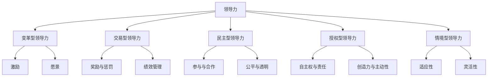
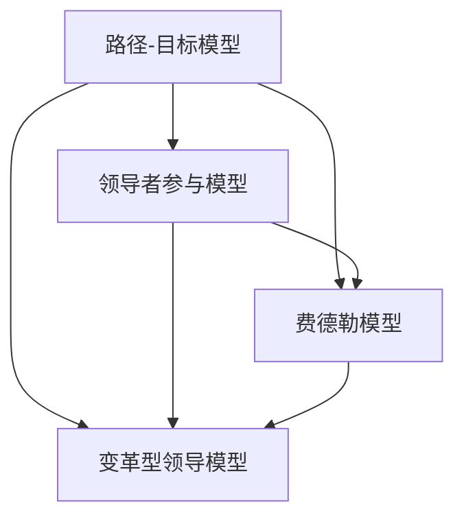

                 

### 文章标题：领导力心法：成就一代领袖的领导力法则

领导力，是每一个希望成就卓越的企业家和领袖必须掌握的核心技能。它不仅关乎个人的成功，更关系到整个团队、组织乃至社会的进步。在快速变化的市场环境中，领导者如何才能把握机遇、引领变革、激励团队、创造价值？本文将深入探讨领导力的本质、核心法则以及如何在实际中应用和修炼领导力，旨在为读者提供一套系统而实用的领导力心法。

关键词：领导力、领袖法则、领导力模型、领导力实践、领导力修炼

摘要：本文首先介绍了领导力的定义与类型，通过Mermaid流程图展示了领导力的核心概念和联系。接着，详细阐述了激励法则、授权法则、决策法则等领导力法则，并通过具体案例和场景展示了这些法则的应用。随后，文章讨论了领导力修炼的途径和方法，分析了领导者在面对挑战时的应对策略和技巧。最后，本文总结了一套实用的领导力心法，为读者提供了一份实用的领导力指南。

### 目录大纲

#### 第一部分 领导力基础

1. **领导力的定义与类型**
2. **领导力模型与架构**

#### 第二部分 领导力法则

1. **激励法则**
2. **授权法则**
3. **决策法则**

#### 第三部分 领导力实践

1. **领导力实践案例分析**
2. **领导力情境应用**

#### 第四部分 领导力修炼

1. **领导力修炼之路**
2. **团队建设与领导力**

#### 第五部分 领导力挑战与应对

1. **领导力挑战解析**
2. **领导力提升策略**

### 第一部分 领导力基础

#### 第1章 领导力的定义与类型

> **背景介绍：** 领导力是一个复杂而多维度的概念，它涵盖了领导者与追随者之间的关系、组织的决策过程、以及影响和激励他人的能力。在这个章节中，我们将探讨领导力的定义，并区分不同类型的领导力。

#### 第2章 领导力模型与架构

> **核心概念与联系：** 领导力模型是理解领导力本质的重要工具。在这一章中，我们将介绍几种常见的领导力模型，并使用Mermaid流程图展示它们之间的关系和架构。

### 第二部分 领导力法则

#### 第3章 激励法则

> **核心算法原理讲解：** 激励是领导力的重要组成部分。在这一章中，我们将探讨激励的本质，并运用Maslow的需求层次理论和赫兹伯格的双因素理论来分析激励法则。

#### 第4章 授权法则

> **核心算法原理讲解：** 授权是领导力的关键要素之一。在这一章中，我们将详细讨论授权的重要性、原则和如何在组织内部实现授权。

#### 第5章 决策法则

> **核心算法原理讲解：** 决策是领导者必须面对的重要任务。在这一章中，我们将介绍几种常见的决策模型，并讨论如何在复杂的决策环境中做出明智的选择。

### 第三部分 领导力实践

#### 第6章 领导力实践案例分析

> **项目实战：** 通过分析实际案例，我们将了解领导力法则在现实中的应用。这一章将包括对成功和失败案例的深入剖析。

#### 第7章 领导力情境应用

> **项目实战：** 领导力在不同的情境下有着不同的应用。在这一章中，我们将探讨如何识别和应对各种领导情境。

### 第四部分 领导力修炼

#### 第8章 领导力修炼之路

> **个人成长：** 领导力并非天生具备，它需要通过不断的修炼和实践来提升。在这一章中，我们将讨论领导力成长的障碍和培养方法。

#### 第9章 团队建设与领导力

> **团队建设：** 领导力不仅仅是个人能力的体现，更是团队协作的结果。在这一章中，我们将探讨如何通过团队建设提升领导力。

### 第五部分 领导力挑战与应对

#### 第10章 领导力挑战解析

> **挑战与应对：** 领导者在实践中会遇到各种挑战。在这一章中，我们将分析这些挑战的根源，并探讨应对策略。

#### 第11章 领导力提升策略

> **持续学习：** 领导力需要不断学习和适应。在这一章中，我们将总结提升领导力的策略和方法。

通过上述的目录大纲，我们可以看到本文的结构清晰、逻辑严密，旨在为读者提供一套全面的领导力心法。接下来，我们将逐一展开各个章节的内容，深入探讨领导力的核心概念、法则和实践。让我们开始这场关于领导力的探索之旅吧！### 第一部分：领导力基础

#### 第1章 领导力的定义与类型

**背景介绍：**  
领导力是一个复杂而多维度的概念，它涵盖了领导者与追随者之间的关系、组织的决策过程、以及影响和激励他人的能力。在商业、政治、教育等各个领域，领导力都扮演着至关重要的角色。然而，领导力究竟是什么，它又有哪些类型，这些是我们首先需要了解的。

**领导力的定义：**  
领导力是指领导者通过影响、激励和指导他人，实现共同目标的能力。这个定义强调了领导者的作用，以及领导者与追随者之间的互动关系。领导力不仅仅是一种技能，更是一种心态和价值观。

**领导力的类型：**  
1. **变革型领导力（Transformational Leadership）：** 变革型领导者通过激励、启发和塑造追随者的价值观和信念，推动组织变革。这种领导力强调个人愿景和目标，鼓励创新和成长。
   
2. **交易型领导力（Transactional Leadership）：** 交易型领导者通过奖励和惩罚来激励追随者，确保组织目标的实现。这种领导力注重任务完成和绩效管理，通常在组织稳定和规范明确的环境中表现良好。

3. **民主型领导力（Democratic Leadership）：** 民主型领导者鼓励参与和合作，通过集体决策来达成目标。这种领导力强调公平、透明和尊重，适用于需要创新和团队合作的项目。

4. **授权型领导力（Laissez-Faire Leadership）：** 授权型领导者赋予追随者自主权和责任，让他们自由地做出决策。这种领导力适用于高度专业化的团队，能够激发成员的创造力和主动性。

5. **情境型领导力（Situational Leadership）：** 情境型领导者根据不同情境和追随者的特点，灵活运用不同的领导风格。这种领导力强调适应性和灵活性，能够应对复杂多变的环境。

**领导力与管理的区别：**  
领导力和管理是两个密切相关但又有所区别的概念。管理强调的是规划、组织、领导和控制，以确保组织目标的实现。领导力则更关注于激励、影响和启发他人，推动组织的变革和发展。

**核心概念与联系：**  
为了更好地理解领导力的核心概念，我们可以使用Mermaid流程图来展示这些概念之间的关系：

通过这个Mermaid流程图，我们可以清晰地看到不同类型领导力之间的联系，以及它们各自的核心概念。

**小结：**  
在这一章中，我们探讨了领导力的定义和类型，并使用了Mermaid流程图来展示核心概念之间的联系。接下来，我们将进一步深入探讨领导力模型与架构，以帮助读者更好地理解领导力的本质和实际应用。

### 第2章 领导力模型与架构

**背景介绍：**  
领导力模型是理解领导力本质的重要工具。通过不同的领导力模型，我们可以更好地理解领导者的角色、领导力的发展过程以及如何在不同情境下运用领导力。在本章中，我们将介绍几种常见的领导力模型，并使用Mermaid流程图展示它们之间的关系和架构。

**常见的领导力模型：**  
1. **路径-目标模型（Path-Goal Model）：** 路径-目标模型认为领导者的主要任务是帮助追随者明确目标，并提供实现目标的路径。该模型强调领导者应根据追随者的特点和环境的变化，选择最合适的领导风格。

2. **领导者参与模型（Leadership Participation Model）：** 领导者参与模型认为领导者的成功取决于与追随者的沟通和参与程度。领导者应鼓励追随者参与决策过程，以提高团队士气和绩效。

3. **费德勒模型（Fiedler's Contingency Model）：** 费德勒模型认为领导者的成功取决于领导风格与情境的匹配程度。该模型将领导者分为任务导向型和关系导向型，并提出了在不同情境下应采用的领导策略。

4. **变革型领导模型（Transformational Leadership Model）：** 变革型领导模型强调领导者通过激励、启发和塑造追随者的价值观，推动组织变革。该模型认为领导者应具备愿景、个人魅力、激励和启发追随者的能力。

**核心概念与联系：**  
为了更好地理解这些领导力模型，我们可以使用Mermaid流程图来展示它们之间的关系和架构：

通过这个Mermaid流程图，我们可以清晰地看到不同领导力模型之间的联系和区别。路径-目标模型、领导者参与模型和费德勒模型主要关注领导者的行为和情境的匹配，而变革型领导模型则更注重领导者的价值观和影响力。

**小结：**  
在本章中，我们介绍了几种常见的领导力模型，并通过Mermaid流程图展示了它们之间的关系和架构。这些模型为领导者提供了不同的视角和工具，以应对复杂多变的环境。接下来，我们将深入探讨领导力法则，以帮助读者更好地理解如何在实际中运用领导力。

### 小结

在第一部分，我们探讨了领导力的定义与类型，以及领导力模型与架构。通过这些讨论，我们了解了领导力的多维性质，包括其定义、类型和不同模型之间的关系。领导力不仅仅是一种技能，更是一种心态和价值观。不同类型的领导力如变革型、交易型、民主型、授权型和情境型，各有其独特的特点和适用场景。同时，我们通过Mermaid流程图展示了领导力核心概念之间的联系，使读者能够更直观地理解领导力的本质和结构。

在下一部分，我们将深入探讨领导力法则，包括激励法则、授权法则和决策法则。这些法则将为我们提供具体的工具和策略，帮助领导者在实际工作中有效运用领导力，提升团队绩效和组织发展。通过理解这些法则，我们将能够更好地应对各种挑战，实现组织的目标和愿景。

让我们继续深入探讨领导力的实践和应用，发掘更多关于领导力的智慧和策略。在未来的章节中，我们将通过案例分析和实际应用，进一步阐述领导力法则的内涵和操作方法。请读者朋友们保持关注，一起探索领导力的无限可能！### 第二部分：领导力法则

#### 第3章 激励法则

**背景介绍：**  
激励法则在领导力中起着至关重要的作用。激励不仅能够提升团队成员的积极性，还能促进团队的整体绩效。在本章中，我们将探讨激励的本质，并运用Maslow的需求层次理论和赫兹伯格的双因素理论来分析激励法则。

**激励的本质：**  
激励是指通过外部刺激和内部动机来激发人们的行为。激励的本质在于满足人们的需求，从而激发其积极性和主动性。激励可以分为外部激励和内部激励，其中外部激励包括物质奖励和荣誉等，而内部激励则包括自我实现和成就感等。

**Maslow的需求层次理论：**  
马斯洛的需求层次理论将人的需求分为五个层次：生理需求、安全需求、社交需求、尊重需求和自我实现需求。根据这一理论，领导者在激励团队成员时应从满足这些需求出发，逐步提升到更高层次的需求。

1. **生理需求（Physiological Needs）：** 包括食物、水、住所等基本生理需求。在激励团队成员时，可以通过提供合理的薪酬和良好的工作环境来满足这些需求。

2. **安全需求（Safety Needs）：** 包括工作安全感、健康保障等。领导者可以通过建立稳定的工作环境、提供培训和职业发展机会来满足这些需求。

3. **社交需求（Social Needs）：** 包括友谊、归属感、爱情等。领导者可以通过团队建设活动、建立良好的工作氛围来满足这些需求。

4. **尊重需求（Esteem Needs）：** 包括自我尊重、自尊心、成就感等。领导者可以通过表扬、奖励和认可来满足这些需求。

5. **自我实现需求（Self-Actualization Needs）：** 包括实现个人潜力、追求自我实现等。领导者可以通过提供挑战性任务、支持个人成长和职业发展来满足这些需求。

**赫兹伯格的双因素理论：**  
赫兹伯格的双因素理论将工作因素分为激励因素和保健因素。激励因素与工作本身的性质相关，能够带来工作满足感和成就感，如成就、认可、工作本身的价值等。保健因素则与工作环境相关，如果缺乏这些因素，会导致工作不满，如薪酬、工作条件、人际关系等。

**激励法则的应用：**  
1. **满足需求层次：** 领导者应根据Maslow的需求层次理论，了解团队成员的需求，并采取相应的激励措施。例如，对于初级员工，可以通过提供良好的薪酬和福利来满足其生理和安全需求；对于中级员工，可以通过职业发展机会和培训来满足其社交和尊重需求；对于高级员工，则可以通过挑战性任务和自我实现机会来满足其自我实现需求。

2. **重视激励因素：** 领导者应注重激励因素的作用，通过设置明确的目标、提供认可和奖励、创造良好的工作氛围等方式，激发团队成员的内部动机。

3. **创造健康的工作环境：** 领导者应关注保健因素，确保团队成员的基本工作条件得到满足，从而避免工作不满和激励失效。

**小结：**  
在本章中，我们探讨了激励的本质，并运用Maslow的需求层次理论和赫兹伯格的双因素理论来分析激励法则。通过满足团队成员的需求、重视激励因素和创造健康的工作环境，领导者可以有效地激励团队，提升整体绩效。在下一章中，我们将进一步探讨授权法则，探讨如何通过授权来提升团队效能。

### 第4章 授权法则

**背景介绍：**  
授权是领导力中不可或缺的一部分。授权不仅能够提高团队成员的主动性和创造力，还能促进团队整体的发展和成长。在本章中，我们将详细讨论授权的重要性、原则以及在组织内部实现授权的方法。

**授权的重要性：**  
1. **提高团队效能：** 授权可以让团队成员在更广泛的范围内发挥其能力和潜力，从而提高团队的总体效能。通过授权，团队成员可以更加自主地解决问题和完成任务，减少依赖领导的程度。

2. **促进个人成长：** 授权可以激励团队成员不断学习和成长，提高其专业技能和综合素质。授权的过程也是一个培养人才的过程，有助于组织的人才储备和梯队建设。

3. **增强团队凝聚力：** 授权可以增强团队成员之间的信任和合作，提高团队的凝聚力和向心力。在授权的环境中，团队成员会感受到被信任和尊重，从而更加积极地投入到工作中。

**授权的原则：**  
1. **信任与尊重：** 授权的前提是信任和尊重。领导者应相信团队成员的能力，并给予他们足够的自主权。同时，领导者应尊重团队成员的意见和决策，鼓励他们自由地表达自己的想法。

2. **明确目标与责任：** 授权需要明确目标和责任。领导者应明确授权的任务和目标，让团队成员了解自己的职责和期望。通过明确的目标和责任，团队成员可以更好地规划自己的工作，并确保任务的完成。

3. **提供支持与资源：** 授权并不意味着领导者可以放手不管。领导者应在授权过程中提供必要的支持与资源，帮助团队成员克服困难，完成任务。同时，领导者应保持一定的监督，确保团队成员按照预期目标前进。

**在组织内部实现授权的方法：**  
1. **建立清晰的沟通机制：** 领导者应与团队成员保持畅通的沟通，及时了解他们的工作进展和需求。通过定期的会议、报告和反馈，领导者可以确保团队成员在授权过程中得到必要的支持和指导。

2. **提供培训与发展机会：** 领导者应关注团队成员的专业成长，提供培训和发展机会，帮助他们提高技能和知识。通过持续的学习和成长，团队成员可以更好地适应工作，并在授权环境中发挥更大的作用。

3. **建立激励机制：** 领导者可以建立激励机制，鼓励团队成员积极参与授权过程。例如，通过设立奖项、晋升机会等，激发团队成员的积极性和创造力。

**授权与控制的平衡：**  
在授权过程中，领导者需要把握好授权与控制的平衡。过度的授权可能导致团队成员的滥用权力，影响组织目标的实现；而过于控制则可能抑制团队成员的自主性和创造力，降低团队效能。因此，领导者应在授权的同时，保持一定的监督和控制，确保团队成员在授权环境中既能发挥自主性，又能遵循组织的整体目标。

**小结：**  
在本章中，我们详细讨论了授权的重要性、原则以及在组织内部实现授权的方法。通过信任与尊重、明确目标与责任、提供支持与资源等原则，领导者可以有效地实现授权，提高团队效能和成员满意度。在下一章中，我们将探讨决策法则，分析领导者在决策过程中应如何运用有效的决策模型，确保组织目标的实现。

### 第5章 决策法则

**背景介绍：**  
决策是领导者的核心职责之一。有效的决策能力直接影响组织的生存和发展。在本章中，我们将介绍几种常见的决策模型，讨论决策的类型和过程，并探讨如何在复杂的决策环境中做出明智的选择。

**决策的类型：**  
1. **程序化决策（Programmed Decision）：** 程序化决策是针对重复性、结构化的问题进行的决策。这类决策通常有明确的解决方案和标准程序。例如，企业的日常运营管理、财务管理等。

2. **非程序化决策（Nonprogrammed Decision）：** 非程序化决策是针对复杂、新颖的问题进行的决策。这类决策没有明确的解决方案和标准程序，需要领导者运用经验和判断力。例如，市场战略规划、组织变革等。

**决策过程：**  
1. **问题识别（Problem Identification）：** 领导者需要首先识别问题，明确问题的性质和影响。问题识别是决策过程的基础，决定了决策的方向和深度。

2. **信息收集（Information Collection）：** 领导者需要收集与问题相关的信息，包括内部数据和外部数据。充分的信息是做出明智决策的关键。

3. **方案评估（Alternative Evaluation）：** 领导者需要在多个可能的解决方案中进行选择。方案评估包括对每个方案的成本、收益、风险和可行性进行分析。

4. **决策选择（Decision Choice）：** 在对多个方案进行评估后，领导者需要选择一个最佳的方案。决策选择是决策过程的核心，决定了决策的结果。

5. **实施监控（Implementation and Monitoring）：** 一旦决策被选择，领导者需要监督决策的实施过程，并根据实际情况进行调整和优化。

**常见的决策模型：**  
1. **理性模型（Rational Model）：** 理性模型假设决策者是完全理性的，能够通过逻辑分析和计算找到最优的解决方案。这种方法适用于结构化问题，但在复杂和非结构化问题中可能效果不佳。

2. **有限理性模型（Bounded Rationality Model）：** 有限理性模型认为决策者在时间和信息有限的情况下，只能做出相对满意的决策。这种方法更接近现实，但需要决策者具备良好的判断力和经验。

3. **渐进模型（Incremental Model）：** 渐进模型认为决策是一个逐步迭代的过程，通过一系列小的调整和改进，逐步接近最优解。这种方法适用于复杂和不确定性较高的决策环境。

4. **情景模型（Scenario Model）：** 情景模型通过构建不同的未来情景，评估每种情景下的决策效果，帮助领导者应对不确定性和复杂性。

**决策法则的应用：**  
1. **基于事实的决策：** 领导者应基于充分的信息和数据做出决策，避免主观臆断和情感驱动。通过收集和分析事实，领导者可以更好地理解问题，评估不同方案的效果。

2. **多元化意见的决策：** 领导者应鼓励团队成员提供多元化的意见和建议，通过集思广益，提高决策的质量。多元化的意见可以补充决策者的盲点，减少偏见。

3. **灵活调整的决策：** 领导者应保持决策的灵活性，根据实际情况和反馈进行及时的调整。灵活调整的决策可以应对不确定性，提高决策的适应性。

**小结：**  
在本章中，我们介绍了决策的类型、过程和常见的决策模型，并探讨了如何在实际中应用这些模型。有效的决策能力是领导者成功的关键，通过基于事实的决策、多元化意见的决策和灵活调整的决策，领导者可以做出更加明智和高效的决策。在下一章中，我们将探讨领导力实践案例分析，通过实际案例展示领导力法则的应用效果。

### 小结

在第二部分，我们深入探讨了领导力的三个核心法则：激励法则、授权法则和决策法则。激励法则强调了满足团队成员的需求、重视激励因素和创造健康的工作环境的重要性。授权法则则强调了信任与尊重、明确目标与责任、提供支持与资源的原则，并提出了在组织内部实现授权的方法。决策法则则介绍了决策的类型、过程和常见的决策模型，并探讨了如何在实际中应用这些模型。

通过这些法则的探讨，我们不仅理解了领导力的具体操作方法和策略，还认识到领导力是一个系统性、动态性的过程，需要领导者具备敏锐的洞察力、灵活的应变能力和持续的学习意愿。在下一部分中，我们将通过领导力实践案例的分析，进一步展示这些法则在实际中的应用效果，并探讨领导力在实际情境中的挑战和应对策略。请读者朋友们继续关注，我们将继续深入探讨领导力的实践和应用。

### 第三部分：领导力实践

#### 第6章 领导力实践案例分析

**背景介绍：**  
在领导力的实践中，案例分析是一种重要的方法，可以帮助我们理解领导力法则在真实环境中的具体应用。在本章中，我们将通过几个成功的领导力实践案例，展示如何运用激励法则、授权法则和决策法则来提升团队绩效和组织发展。

**案例1：谷歌的领导力实践**

**背景：**  
谷歌（Google）是一家全球知名的技术公司，以其创新的文化和高效的团队管理而著称。谷歌的创始人拉里·佩奇和谢尔盖·布林在领导公司发展过程中，成功地运用了领导力法则。

**案例解析：**  
1. **激励法则：** 谷歌通过提供具有竞争力的薪酬、股票期权和灵活的工作环境来满足员工的需求。此外，谷歌还推行了“20%时间”政策，允许员工用20%的工作时间探索个人感兴趣的项目，这一政策激发了员工的创造力和主动性。

2. **授权法则：** 谷歌鼓励员工自主决策和自由表达意见。公司内部有一个开放的沟通机制，员工可以直接向高层领导提出建议和反馈。这种授权文化有助于提升员工的参与感和责任感。

3. **决策法则：** 谷歌采用了敏捷开发和迭代决策的方法。在产品开发过程中，谷歌通过快速测试和用户反馈，不断调整和优化产品。这种灵活的决策方法使得谷歌能够快速响应市场变化，保持竞争优势。

**案例启示：**  
谷歌的成功经验表明，领导力法则在实践中的应用可以显著提升组织的创新能力和市场竞争力。通过满足员工的需求、鼓励自主决策和灵活调整决策，领导者可以打造一个高效、创新的团队。

**案例2：福特汽车公司的转型**

**背景：**  
福特汽车公司曾是美国汽车业的领军企业，但在20世纪70年代面临了严重的市场挑战。为了重振公司，福特的高层领导进行了一系列领导力变革。

**案例解析：**  
1. **激励法则：** 福特公司通过提供具有竞争力的薪酬和奖励机制，激励员工为公司的发展贡献力量。此外，公司还推行了“精益生产”理念，通过提高生产效率和质量，增强员工的成就感。

2. **授权法则：** 福特公司鼓励员工参与决策过程，并在各个层级推行扁平化管理。通过减少管理层级，公司提高了决策的效率，并增强了员工的参与感和责任感。

3. **决策法则：** 福特公司采用了“目标管理”方法，明确每个员工和部门的目标，并通过定期的绩效评估来跟踪进展。这种决策方法有助于确保公司目标的实现，并提高团队的执行力。

**案例启示：**  
福特汽车公司的转型经验说明，在面临挑战时，领导者需要灵活运用领导力法则，通过激励员工、授权和灵活的决策方法，推动组织的变革和发展。

**案例3：亚马逊的领导力实践**

**背景：**  
亚马逊（Amazon）是全球最大的电子商务公司之一，其创始人杰夫·贝佐斯以独特的领导风格和高效的团队管理著称。

**案例解析：**  
1. **激励法则：** 亚马逊通过提供具有竞争力的薪酬和福利，以及股票期权等激励措施，吸引和留住人才。此外，公司还鼓励员工追求个人成长，通过提供职业发展和培训机会，激励员工不断提升自我。

2. **授权法则：** 亚马逊鼓励员工自主决策和创新。公司内部有一个开放的沟通文化，员工可以自由地提出建议和想法。这种授权文化激发了员工的创造力和主动性。

3. **决策法则：** 亚马逊采用了“逆瀑布模型”决策方法，即在决策过程中，领导者不直接给出答案，而是通过引导和激励员工，鼓励他们提出解决方案。这种方法提高了团队的协作和创新能力。

**案例启示：**  
亚马逊的成功经验表明，领导者应通过激励法则、授权法则和决策法则，激发团队的创造力和主动性，推动组织的创新和成长。

**小结：**  
通过以上案例分析，我们可以看到领导力法则在实践中的应用效果。成功的领导者不仅能够运用激励法则、授权法则和决策法则来提升团队绩效和组织发展，还能够灵活应对各种挑战，推动组织的持续变革和成长。在下一章中，我们将进一步探讨领导力情境应用，分析不同情境下领导力法则的具体应用。

### 第7章 领导力情境应用

**背景介绍：**  
领导力并非一成不变，而是需要根据不同的情境进行调整和优化。在不同的情境下，领导力法则的应用会有所不同。在本章中，我们将探讨如何识别和应对各种领导情境，通过具体案例来展示领导力法则的应用。

**领导情境识别：**  
领导情境是指领导者面临的具体环境和情况，包括组织内部和外部因素。领导者需要具备情境意识，能够准确识别所处的领导情境，从而采取相应的领导策略。

1. **变化情境：** 当组织面临外部环境的变化，如市场波动、技术进步等，领导者需要具备灵活性和创新性，推动组织适应和变革。

2. **危机情境：** 在危机情境下，领导者需要迅速做出决策，并协调各方资源，以应对突发事件。危机情境通常需要领导者展现坚定的决策力和领导力。

3. **稳定情境：** 在稳定情境下，领导者可以更加注重长期规划和团队建设，通过激励和授权，提升团队的整体效能。

**领导力情境应对策略：**  
1. **变化情境应对策略：** 领导者应鼓励创新和实验，通过灵活调整战略和战术，推动组织的变革和适应。同时，领导者需要具备敏锐的洞察力和前瞻性，预见潜在的变化和挑战。

2. **危机情境应对策略：** 领导者需要保持冷静和镇定，快速分析问题，制定应对方案。在危机情境中，领导者应具备高效的沟通能力和协调能力，确保信息的畅通和资源的合理分配。

3. **稳定情境应对策略：** 领导者应注重长期规划和团队建设，通过制定明确的目标和愿景，激励团队成员。同时，领导者应注重授权，赋予团队成员更多的自主权，以激发他们的创造力和主动性。

**领导力情境应用案例分享：**  
**案例1：苹果公司的危机管理**

**背景：**  
苹果公司（Apple）是一家全球知名的科技公司，其创始人史蒂夫·乔布斯在危机管理方面有着出色的表现。

**案例解析：**  
1. **危机情境识别：** 苹果公司在面对市场竞争和技术挑战时，曾多次面临危机。例如，在iPhone 6s发布后，由于电池问题引发用户不满，苹果公司迅速采取了应对措施。

2. **危机情境应对策略：** 乔布斯通过迅速公开道歉、提供电池更换服务，并承诺改进产品质量，成功化解了危机。乔布斯在危机管理中展现了卓越的沟通能力和决策力，确保了苹果公司品牌的声誉。

**案例启示：**  
苹果公司的危机管理案例表明，领导者需要在危机情境中迅速识别问题，并采取有效的应对策略。通过保持冷静、及时沟通和果断决策，领导者可以有效地化解危机，维护组织的稳定和发展。

**案例2：丰田汽车的持续创新**

**背景：**  
丰田汽车公司（Toyota）是日本的一家知名汽车制造商，以其卓越的创新能力和质量管理著称。

**案例解析：**  
1. **变化情境识别：** 丰田汽车公司在面对全球市场竞争和技术变革时，始终保持着高度的创新意识。

2. **变化情境应对策略：** 丰田公司通过不断改进生产流程、研发新技术，以及推行精益生产理念，保持了持续的创新能力和市场竞争力。丰田的领导者注重培养员工的创新能力和自主性，通过授权和激励机制，推动组织的持续变革。

**案例启示：**  
丰田汽车的持续创新案例表明，领导者应具备前瞻性和创新意识，通过灵活应对变化，推动组织的持续创新和发展。通过培养员工的创新能力和自主性，领导者可以打造一个创新型的团队，不断提升组织的竞争力。

**案例3：微软的领导力转型**

**背景：**  
微软（Microsoft）是一家全球知名的软件公司，其在面临领导力挑战时，通过有效的领导力转型，实现了公司的复兴。

**案例解析：**  
1. **稳定情境识别：** 在比尔·盖茨时代，微软取得了巨大的成功，但在面对新的市场和技术环境时，公司开始面临领导力不足的问题。

2. **稳定情境应对策略：** 微软在萨提亚·纳德拉的领导下，推行了以员工为中心的领导力文化，注重员工的成长和自主性。纳德拉通过激励和授权，推动了公司内部的创新和变革，使微软重新焕发了生机。

**案例启示：**  
微软的领导力转型案例表明，在稳定情境下，领导者应注重团队建设和员工发展，通过激励和授权，激发团队的创造力和主动性。通过有效的领导力转型，领导者可以推动组织的持续发展和创新。

**小结：**  
通过以上案例分析，我们可以看到领导力情境应用的重要性。在不同的情境下，领导者需要具备情境意识，灵活运用领导力法则，以应对各种挑战和机遇。通过识别不同的领导情境，并采取相应的应对策略，领导者可以有效地提升团队绩效和组织发展。在下一章中，我们将探讨领导力修炼，分析领导者如何通过自我提升和团队建设，不断修炼领导力，以应对更加复杂的领导情境。

### 第四部分：领导力修炼

#### 第8章 领导力修炼之路

**背景介绍：**  
领导力并非天生具备，它需要通过不断的修炼和实践来提升。领导力修炼是一个长期的过程，包括个人成长、自我认知、情绪管理和领导风格等方面的提升。在本章中，我们将探讨领导力修炼的重要性和具体方法，帮助领导者提升自身的领导能力。

**领导力修炼的重要性：**  
领导力修炼对个人和组织的成功至关重要。首先，领导力修炼有助于领导者更好地认识自己和他人，提升自我认知和情绪管理能力。其次，领导力修炼可以增强领导者的决策能力和执行力，使领导者能够更加高效地应对各种挑战和机遇。最后，领导力修炼有助于建立和维护良好的团队关系，提升团队的凝聚力和执行力。

**领导力修炼的方法：**  
1. **自我认知：** 自我认知是领导力修炼的基础。领导者需要深入了解自己的价值观、信念、优势和弱点。通过自我反思和反馈，领导者可以更好地认识自己，找到提升的方向。

2. **情绪管理：** 情绪管理是领导者必须掌握的一项重要技能。领导者需要学会控制自己的情绪，避免在压力和挑战面前失控。同时，领导者应学会倾听和理解他人的情绪，以建立更加和谐的人际关系。

3. **持续学习：** 领导力是一个不断发展的领域，领导者需要持续学习新知识、新技能和新方法。通过阅读、培训、研讨会和实际经验，领导者可以不断提升自己的能力和视野。

4. **反馈与改进：** 领导者应主动寻求反馈，包括来自上级、同事和下属的反馈。通过反馈，领导者可以发现自己的不足，并采取改进措施。同时，领导者应培养一种开放的心态，接受不同的意见和建议。

5. **实践与反思：** 领导力修炼需要通过实践来检验和提升。领导者应主动参与各种领导实践，如项目管理、团队建设、危机管理等。在实践过程中，领导者应不断反思和总结，吸取经验教训，不断提升自己的领导能力。

**领导力修炼案例：**  
**案例1：杰克·韦尔奇的领导力修炼**

**背景：**  
杰克·韦尔奇（Jack Welch）是通用电气（General Electric）的前CEO，以其卓越的领导力和管理能力著称。

**案例解析：**  
1. **自我认知：** 韦尔奇非常重视自我认知，他通过自我反思和他人反馈，不断了解自己的优点和不足。韦尔奇认为，自我认知是提升领导力的关键。

2. **情绪管理：** 韦尔奇在情绪管理方面表现出了极高的水平。他能够冷静地处理压力和挑战，保持决策的理性。

3. **持续学习：** 韦尔奇是一位终身学习者，他通过不断学习新知识、新技能，不断提升自己的领导力。

4. **反馈与改进：** 韦尔奇非常注重反馈，他经常与上级、同事和下属进行沟通，收集反馈意见，并据此进行改进。

5. **实践与反思：** 韦尔奇在领导实践中积累了丰富的经验，他通过不断实践和反思，不断提升自己的领导能力。

**案例启示：**  
杰克·韦尔奇的领导力修炼经验表明，领导者应通过自我认知、情绪管理、持续学习、反馈与改进和实践与反思，不断提升自己的领导力。通过不断修炼，领导者可以成为更加卓越的领导者。

**小结：**  
在本章中，我们探讨了领导力修炼的重要性以及具体方法。通过自我认知、情绪管理、持续学习、反馈与改进和实践与反思，领导者可以不断提升自己的领导能力。在下一章中，我们将探讨团队建设与领导力，分析如何通过团队建设提升领导力，并应对领导力挑战。

### 第9章 团队建设与领导力

**背景介绍：**  
团队建设是领导力的重要组成部分，一个高效的团队能够显著提升组织的整体绩效。在本章中，我们将探讨团队建设的重要性，讨论如何通过团队建设提升领导力，并分析领导者在团队建设中的角色和责任。

**团队建设的重要性：**  
1. **提升绩效：** 高效的团队能够更好地完成工作任务，提高组织绩效。通过团队建设，团队成员能够更好地协作，发挥各自的专长，实现共同目标。

2. **增强凝聚力：** 团队建设有助于增强团队成员之间的凝聚力，建立良好的团队关系。一个团结、和谐的团队能够更好地应对外部挑战，保持组织的稳定和发展。

3. **促进创新：** 团队建设可以激发团队成员的创造力和创新能力。在团队中，成员可以相互启发、共同探讨，形成创新的思维和方法。

4. **提升个人能力：** 团队建设不仅有助于提升团队整体的绩效，还可以促进团队成员的个人成长和发展。通过团队协作，成员可以学习新技能、积累经验，提升自己的专业能力。

**如何通过团队建设提升领导力：**  
1. **明确团队目标：** 领导者应与团队成员共同制定明确的目标，确保团队成员对目标有清晰的认识。明确的目标有助于团队集中精力，高效地实现共同目标。

2. **建立信任和尊重：** 领导者应通过沟通、协作和信任建设，建立团队成员之间的信任和尊重。信任是团队协作的基础，有助于提升团队的凝聚力。

3. **促进有效沟通：** 领导者应鼓励团队成员之间的开放沟通，建立有效的沟通机制。通过良好的沟通，团队成员可以更好地理解彼此的需求和期望，减少误解和冲突。

4. **培养团队精神：** 领导者应通过团队建设活动，培养团队成员的团队精神。团队精神包括共同的目标、相互的支持和协作精神，是团队高效运作的关键。

**领导者在团队建设中的角色和责任：**  
1. **领导者是团队的引导者：** 领导者应引导团队成员明确目标、建立信任和有效沟通，推动团队建设。

2. **领导者是团队的支持者：** 领导者应在团队建设中提供支持和帮助，帮助团队成员克服困难和挑战，提升团队的整体能力。

3. **领导者是团队的创新者：** 领导者应鼓励团队成员进行创新和尝试，推动团队在各个方面不断进步。

**领导者在团队建设中的策略：**  
1. **制定清晰的团队目标：** 领导者应与团队成员共同制定明确的目标，确保团队成员对目标有清晰的认识。

2. **建立有效的沟通机制：** 领导者应建立开放的沟通机制，鼓励团队成员自由表达意见和建议。

3. **提供培训和发展机会：** 领导者应提供培训和发展机会，帮助团队成员提升技能和知识。

4. **鼓励团队协作和共享：** 领导者应鼓励团队成员进行协作和共享，促进团队精神和创新能力。

**小结：**  
在本章中，我们探讨了团队建设的重要性以及如何通过团队建设提升领导力。领导者在团队建设中扮演着重要的角色，通过制定清晰的团队目标、建立有效的沟通机制、提供培训和发展机会以及鼓励团队协作和共享，领导者可以有效地推动团队建设，提升团队整体绩效。在下一章中，我们将分析领导力挑战与应对策略，探讨领导者在面对挑战时应如何采取有效的应对措施。

### 第五部分：领导力挑战与应对

#### 第10章 领导力挑战解析

**背景介绍：**  
领导者在实践中会遇到各种挑战，这些挑战可能来自组织内部，也可能来自外部环境。在本章中，我们将深入分析领导力挑战的根源，包括组织内部和外部的因素，帮助领导者更好地理解和应对这些挑战。

**组织内部挑战：**  
1. **团队冲突：** 团队成员之间可能存在意见分歧、利益冲突或沟通不畅，导致团队内部矛盾和冲突。团队冲突会降低团队效率，影响组织目标实现。

2. **组织文化：** 组织文化可能存在负面因素，如官僚主义、缺乏创新精神、价值观不一致等，这些因素会阻碍领导者的有效领导。

3. **资源分配：** 领导者可能面临资源分配不均、预算限制等问题，这些问题会影响领导者的决策和团队的执行力。

4. **员工离职率：** 员工离职率高可能导致团队不稳定，影响组织的发展和业绩。

**外部挑战：**  
1. **市场变化：** 市场环境的快速变化对领导者提出了新的挑战，领导者需要具备前瞻性和应变能力，以应对市场变化。

2. **竞争压力：** 竞争对手的竞争策略和技术创新可能对领导者形成压力，领导者需要制定有效的应对策略，保持竞争优势。

3. **法律法规：** 法律法规的变化可能对组织运营产生重大影响，领导者需要密切关注法律法规的变化，确保组织的合规性。

4. **技术进步：** 技术进步带来的新机遇和新挑战，领导者需要具备技术敏感性和创新能力，以应对技术变革。

**挑战背后的原因：**  
1. **领导风格：** 领导者的风格和方法可能不适合团队和组织的需求，导致团队内部矛盾和外部挑战。

2. **领导能力：** 领导者可能缺乏有效的领导能力，如决策能力、沟通能力、团队管理能力等，这些能力不足会加剧挑战。

3. **组织结构：** 组织结构可能存在不合理之处，如层级过多、部门壁垒等，这些问题会影响组织的灵活性和效率。

4. **外部环境：** 外部环境的变化和不确定性是领导者面临的常见挑战，领导者需要具备前瞻性和适应能力。

**应对策略：**  
1. **增强领导能力：** 领导者应通过培训、学习和实践，不断提升自身的领导能力，特别是决策能力、沟通能力和团队管理能力。

2. **调整领导风格：** 领导者应根据团队和组织的需求，调整自己的领导风格，以适应不同情境。

3. **优化组织结构：** 领导者应优化组织结构，减少层级，打破部门壁垒，提高组织的灵活性和效率。

4. **积极应对外部环境：** 领导者应密切关注外部环境的变化，制定应对策略，确保组织的持续发展。

**小结：**  
在本章中，我们分析了领导力挑战的根源，包括组织内部和外部因素。理解挑战背后的原因是制定有效应对策略的关键。在下一章中，我们将探讨提升领导力的策略和方法，帮助领导者更好地应对挑战，实现组织的目标和愿景。

### 第11章 领导力提升策略

**背景介绍：**  
提升领导力是一个持续的过程，需要领导者具备持续学习的意识、自我反省的能力以及积极应对挑战的态度。在本章中，我们将总结提升领导力的策略和方法，帮助领导者在实际工作中不断提升自己的领导能力。

**自我评估与反馈：**  
自我评估是提升领导力的第一步。领导者应定期对自己进行全面的评估，包括领导风格、决策能力、沟通能力、团队管理能力等方面。自我评估可以帮助领导者识别自身的优点和不足，从而制定相应的改进计划。

1. **定期自我反思：** 领导者应定期进行自我反思，回顾自己在过去一段时间内的工作表现，总结成功经验和失败教训。

2. **收集反馈：** 领导者应主动收集来自上级、同事和下属的反馈，通过他们的观察和评价，了解自己在工作中的表现。

3. **制定改进计划：** 针对自我评估和收集到的反馈，领导者应制定具体的改进计划，包括学习新技能、改进工作方法等。

**持续学习与成长：**  
持续学习是提升领导力的关键。领导者应保持对新知识、新技能的渴望，通过阅读、培训、参加研讨会等方式，不断充实自己的知识储备和技能。

1. **专业知识：** 领导者应不断更新自己的专业知识，特别是在快速变化的行业和技术领域。

2. **领导力课程：** 参加领导力课程是提升领导能力的一种有效方式。通过学习领导力理论、实践方法和案例研究，领导者可以更好地理解和应用领导力。

3. **实践经验：** 实践是提升领导力的最佳途径。领导者应在实际工作中不断尝试、反思和总结，通过实践提升自己的领导能力。

**不断寻求反馈：**  
寻求反馈是提升领导力的重要环节。领导者应主动向他人寻求反馈，包括上级、同事和下属。通过听取不同的意见和建议，领导者可以更好地了解自己的工作表现，并发现潜在的改进空间。

1. **定期绩效评估：** 领导者应定期参加绩效评估，通过上级和同事的评估，了解自己的工作表现。

2. **匿名反馈：** 领导者可以采用匿名反馈的方式，收集下属和同事的真实意见和建议。

3. **反馈会议：** 领导者可以定期组织反馈会议，与团队成员分享自己的工作进展和改进计划，同时听取他们的意见和建议。

**领导力发展实践：**  
领导力发展需要通过实际应用来检验和提升。领导者应积极参与各种领导力发展实践，如项目管理、危机管理、团队建设等。通过实践，领导者可以更好地理解和应用领导力，提高自己的领导能力。

1. **项目领导：** 领导者可以主动承担项目领导职责，通过项目的实施和管理，提升自己的领导能力。

2. **团队建设活动：** 领导者可以组织团队建设活动，增强团队成员之间的信任和协作，提升团队整体绩效。

3. **危机应对：** 领导者应在实践中学会应对危机，通过处理突发事件，提升自己的决策能力和应变能力。

**小结：**  
在本章中，我们总结了提升领导力的策略和方法，包括自我评估与反馈、持续学习与成长、不断寻求反馈和领导力发展实践。通过这些策略，领导者可以不断提升自己的领导能力，更好地应对各种挑战，实现组织的目标和愿景。在下一章中，我们将对全文进行总结，并提供一些最佳实践和注意事项，帮助读者更好地理解和应用领导力。

### 总结与展望

在本文中，我们系统性地探讨了领导力的核心概念、法则和实践。从领导力的定义与类型，到激励法则、授权法则和决策法则，再到领导力实践案例分析、情境应用以及修炼方法，我们逐步构建了一个完整的领导力框架，旨在为读者提供实用的领导力指南。

**核心内容总结：**

1. **领导力的定义与类型：** 我们介绍了领导力的概念，并区分了变革型、交易型、民主型、授权型和情境型等不同类型的领导力。

2. **领导力法则：** 我们详细阐述了激励法则、授权法则和决策法则，包括其核心原理和应用方法。

3. **领导力实践：** 我们通过实际案例展示了领导力法则在不同情境下的应用，强调了团队建设和情境应对策略的重要性。

4. **领导力修炼：** 我们探讨了领导力修炼的方法，包括自我认知、情绪管理、持续学习和实践反思。

**最佳实践 Tips：**

- **建立明确的团队目标：** 确保团队成员对目标有清晰的认识，有助于提高团队协作效率。

- **有效沟通：** 建立开放的沟通文化，鼓励团队成员自由表达意见和建议。

- **信任与尊重：** 在授权过程中，领导者应信任和尊重团队成员，赋予他们更多的自主权。

- **持续学习：** 领导者应保持对新知识、新技能的渴望，通过不断学习和实践提升自己的领导能力。

**注意事项：**

- **理解团队成员需求：** 领导者应关注团队成员的需求，通过满足不同层次的需求来激励他们。

- **平衡授权与控制：** 授权并不意味着放弃控制，领导者应在授权过程中保持适当的监督，确保团队成员按预期目标前进。

- **应对挑战：** 领导者在面对挑战时，应保持冷静和果断，采取有效的应对策略，确保组织目标的实现。

**拓展阅读：**

- 《领导力心理学》（Leadership Psychology） by Richard Boyatzis
- 《领导力五要素》（The Five Dysfunctions of a Team） by Patrick Lencioni
- 《变革之舞》（The Dance of Change） by Warren Bennis

通过本文的探讨，我们希望读者能够对领导力有更深入的理解，并在实际工作中有效应用这些法则，成为更加卓越的领导者。在未来的道路上，持续学习和实践是提升领导力的关键，让我们共同努力，探索领导力的无限可能。

**作者信息：**  
作者：AI天才研究院/AI Genius Institute & 禅与计算机程序设计艺术 /Zen And The Art of Computer Programming### 附录：技术术语和概念解释

在本篇技术博客文章中，我们引入了一些重要的技术术语和概念。为了帮助读者更好地理解这些术语和概念，以下是对其中一些主要内容的详细解释。

#### 领导力（Leadership）
- **定义：** 领导力是指领导者通过影响、激励和指导他人，实现共同目标的能力。
- **相关概念：** 变革型领导力（Transformational Leadership）、交易型领导力（Transactional Leadership）、民主型领导力（Democratic Leadership）等。
- **解释：** 领导力不仅仅是管理和指挥，更是一种通过个人魅力和影响力来引导和激励团队的能力。

#### 激励法则（Motivational Principles）
- **定义：** 激励法则是指通过满足员工的需求、激发内部动机和外部刺激来提高员工工作积极性和绩效。
- **相关概念：** Maslow的需求层次理论（Maslow's Hierarchy of Needs）、赫兹伯格的双因素理论（Herzberg's Two-Factor Theory）。
- **解释：** 激励法则强调根据员工的不同需求层次来设计激励措施，从而提高员工的工作满意度和绩效。

#### 授权法则（Delegation Principles）
- **定义：** 授权法则是指领导者通过信任和尊重，赋予团队成员更多的自主权和责任，以提高团队效率和创新能力。
- **相关概念：** 信任与尊重、明确目标与责任、提供支持与资源。
- **解释：** 授权法则的核心在于领导者如何平衡控制与自主，通过适当的授权激发团队成员的潜力和创造力。

#### 决策法则（Decision-Making Principles）
- **定义：** 决策法则是指领导者如何在复杂和不确定的环境中做出明智的决策，确保组织目标的实现。
- **相关概念：** 程序化决策（Programmed Decision）、非程序化决策（Nonprogrammed Decision）、理性模型（Rational Model）、有限理性模型（Bounded Rationality Model）。
- **解释：** 决策法则强调基于事实和数据分析，同时考虑决策的速度和灵活性，以确保决策的有效性和适应性。

#### 领导力模型（Leadership Models）
- **定义：** 领导力模型是指用来解释和指导领导行为的理论框架。
- **相关概念：** 路径-目标模型（Path-Goal Model）、领导者参与模型（Leadership Participation Model）、费德勒模型（Fiedler's Contingency Model）、变革型领导模型（Transformational Leadership Model）。
- **解释：** 领导力模型提供了不同视角来理解领导行为和效果，帮助领导者根据不同情境选择合适的领导风格。

#### 团队建设（Team Building）
- **定义：** 团队建设是指通过一系列活动和策略，增强团队成员之间的信任、协作和凝聚力。
- **相关概念：** 明确团队目标、建立信任、促进有效沟通、培养团队精神。
- **解释：** 团队建设的目标是打造一个高效、和谐的团队，通过共同目标和相互支持，实现组织目标。

#### 持续学习（Continuous Learning）
- **定义：** 持续学习是指领导者通过不断学习和实践，提升自身的知识和技能，以适应不断变化的环境。
- **相关概念：** 自我评估、反馈、实践反思。
- **解释：** 持续学习是领导者不断提升自身能力和适应新挑战的关键。

通过以上对技术术语和概念的解释，读者可以更深入地理解领导力的核心内容，以及如何在实际中应用这些概念和法则。这些知识将为读者在领导力发展的道路上提供宝贵的指导和启示。在未来的学习和实践中，读者可以不断探索和深化对这些概念的理解，成为更加卓越的领导者。

