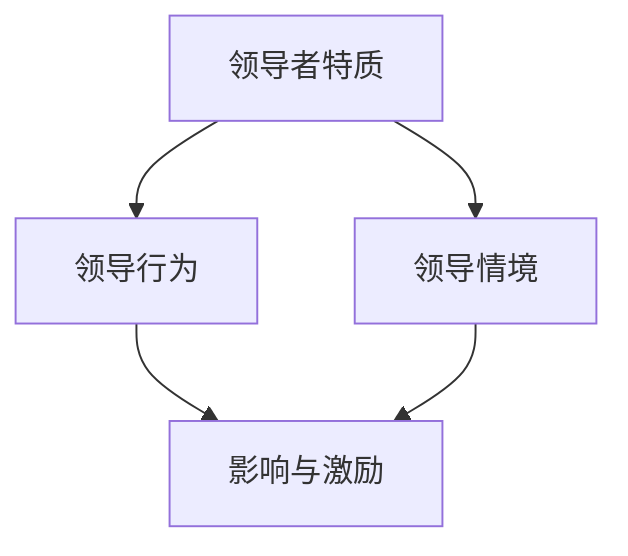
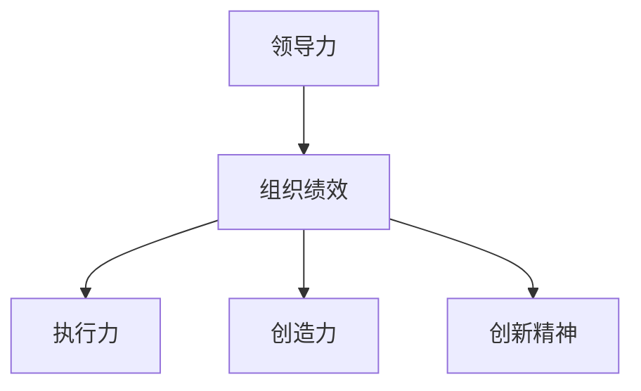
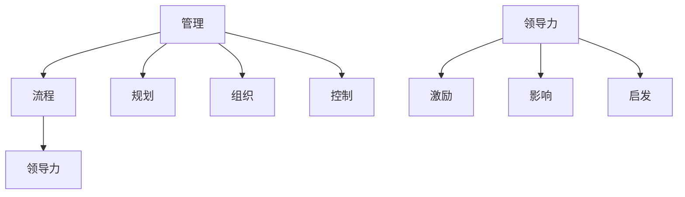
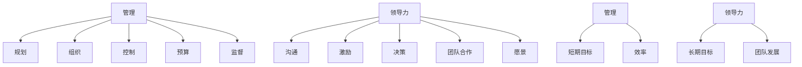

                 

### 文章标题：领导力心法：成就一流管理者的领导力法则

#### 关键词：领导力、管理、管理者、心法、法则、一流、团队、决策、沟通

#### 摘要：
本文旨在深入探讨领导力的本质与法则，通过系统的分析和实例讲解，帮助管理者理解和应用领导力的核心原则，从而成就一流的管理者。文章结构包括七个主要部分：领导力的核心概念与联系、领导力的关键技能、领导力的发展路径、领导力在不同组织结构中的应用、领导力案例分析、领导力提升实践，以及结论与展望。

## 目录大纲设计思路

为了确保《领导力心法：成就一流管理者的领导力法则》能够为读者提供最全面、最有价值的指导，我们遵循以下设计思路：

### 1. 了解书籍主题和目标读者

**主题：** 书籍的主题是领导力，专注于领导力法则和心法，旨在帮助管理者提升领导能力。

**目标读者：** 一流的管理者或希望提升领导力的人士。

### 2. 确定核心章节内容

**核心章节：** 包括领导力的基本概念、关键技能、领导力的发展路径、领导力在不同组织结构中的应用、案例分析、领导力提升实践等。

### 3. 逻辑清晰

**逻辑结构：** 从基础到高级，从理论到实践，逐步引导读者深入了解领导力的各个方面。

### 4. 细节丰富

**内容丰富：** 确保每个章节都有详细的小节，全面覆盖主题。

### 5. 实用性

**案例分析：** 包含成功和失败的案例分析，提供实际操作指南。

### 6. 保持简洁

**简洁明了：** 避免重复和冗余信息，保持内容的简洁性。

## 实际操作步骤

### 步骤一：核心概念与联系

**设计1级目录：** “领导力的核心概念与联系”

**包括2级目录：**
- **什么是领导力**
- **领导力的重要性**
- **领导力与管理的区别**

### 步骤二：领导力的关键技能

**设计1级目录：** “领导力的关键技能”

**包括2级目录：**
- **沟通技能**
- **决策能力**
- **团队合作**

### 步骤三：领导力的发展路径

**设计1级目录：** “领导力的发展路径”

**包括2级目录：**
- **自我发展**
- **角色转变**
- **领导力模型**

### 步骤四：领导力在不同组织结构中的应用

**设计1级目录：** “领导力在不同组织结构中的应用”

**包括2级目录：**
- **小型团队领导**
- **大型组织领导**
- **跨文化领导**

### 步骤五：案例分析

**设计1级目录：** “领导力案例分析”

**包括2级目录：**
- **成功领导实例**
- **失败案例剖析**

### 步骤六：领导力提升实践

**设计1级目录：** “领导力提升实践”

**包括2级目录：**
- **日常练习**
- **管理工具**
- **领导力测评**

### 步骤七：结论与展望

**设计1级目录：** “结论与展望”

**包括2级目录：**
- **领导力的未来趋势**
- **持续学习的重要性**

### 步骤八：总结与反思

**对整个目录进行审查，确保逻辑性和完整性。**

通过以上步骤，我们设计出了《领导力心法：成就一流管理者的领导力法则》的详细目录大纲，为读者提供了一本系统性的领导力指南。

----------------------------------------------------------------

## 第一章：领导力的核心概念与联系

### 1.1 领导力的基本概念

领导力是一个复杂而又广泛的概念，它涉及到领导者如何影响和激励他人以实现共同的目标。根据Mermaid流程图（图1），领导力可以分为三个核心部分：领导者特质、领导行为和领导情境。

**领导者特质**：包括个性、价值观、知识、技能等内在因素，这些特质影响领导者如何看待自己和他人。

**领导行为**：领导者采取的具体行动，如沟通、决策、指导、激励等，这些行为直接影响团队的绩效和氛围。

**领导情境**：领导发生的具体环境和背景，包括组织文化、团队结构、外部环境等外部因素。

### 1.2 领导力的重要性

领导力对组织和个人都有着深远的影响。首先，领导力能够直接影响组织的绩效。研究表明，高效的领导者能够提高团队的执行力、创造力和创新精神（Mermaid流程图，图2）。

其次，领导力对个人职业发展也有着重要的推动作用。一个出色的领导者不仅能够带领团队取得成功，还能够提升个人的影响力、声誉和职业前景。

### 1.3 领导力与管理的区别

尽管领导力和管理密切相关，但它们之间仍然存在显著的区别。管理强调的是规划、组织、控制等流程，而领导力则更侧重于激励、影响和启发他人。Mermaid流程图（图3）展示了领导力和管理的联系与区别。

管理是确保任务按计划完成的过程，而领导力则是激发团队成员的潜能，使其在实现目标的过程中不断成长和进步。

## 本章小结

在本章中，我们探讨了领导力的基本概念，包括领导者特质、领导行为和领导情境。我们分析了领导力的重要性，以及它与管理的区别。通过Mermaid流程图，我们更加清晰地理解了领导力的多层次结构和其关键要素。在接下来的章节中，我们将进一步深入探讨领导力的关键技能、发展路径以及在不同组织结构中的应用。

----------------------------------------------------------------

### 1.3 领导力与管理的区别

尽管领导力和管理在许多方面是相互交织的，但它们在定义和实践中有着本质的区别。为了更好地理解这两者的不同，我们可以从以下几个角度进行比较：

**定义差异：**

- **管理（Management）：** 管理通常被定义为规划、组织、领导和控制资源，以实现特定目标和任务的过程。它侧重于效率和流程，关注如何最有效地分配和利用资源，以完成既定的任务。

- **领导力（Leadership）：** 领导力则更多地关注激励、影响和启发他人，以实现共同的目标。它侧重于变革、创新和团队合作，强调通过建立信任、愿景和价值观来引导团队。

**核心要素：**

- **管理：** 管理的核心要素包括计划、组织、控制、预算、监督等。这些要素侧重于确保任务的完成和组织目标的实现。

- **领导力：** 领导力的核心要素包括沟通、激励、决策、团队合作、愿景等。这些要素侧重于建立信任、激发潜能和推动团队创新。

**关注点：**

- **管理：** 管理更关注于短期目标和效率，如项目进度、预算控制等。

- **领导力：** 领导力则更注重长期目标和团队发展，如组织文化、员工成长、战略方向等。

**角色差异：**

- **管理者：** 管理者通常负责制定策略、分配资源、监督执行等任务，确保组织目标的实现。

- **领导者：** 领导者不仅负责管理团队，还要激励团队成员、塑造组织文化、推动变革等。

**对个人发展的影响：**

- **管理：** 管理技能的提升有助于管理者在组织内部获得晋升和认可，但可能不直接涉及个人领导能力的提升。

- **领导力：** 领导力的提升不仅有助于个人在组织中的发展，还能在更广泛的职业领域产生积极影响。

为了更直观地理解领导力和管理的差异，我们可以使用Mermaid流程图（图4）来展示它们的核心要素和关注点。

通过图4，我们可以清晰地看到管理和领导力的核心要素及其关注点的不同。理解这些差异有助于管理者更好地平衡领导和管理的职责，从而在组织中获得更好的绩效和个人发展。

### 1.4 领导力的关键要素

领导力不仅仅是一种技能或能力，它是一个复杂而多维的系统，包含多个关键要素。以下是领导力的五个关键要素，每个要素在领导过程中都扮演着重要的角色。

#### 1.4.1 沟通技能

沟通是领导力的核心要素之一。有效的沟通技能使领导者能够清晰、准确地传达信息，建立信任，并促进团队合作。沟通技能包括倾听、表达、反馈和适应。例如，倾听是建立信任的关键，而表达则确保信息被准确理解和接受。

#### 1.4.2 激励能力

激励能力是领导者激励和鼓舞团队成员的关键技能。领导者需要了解不同团队成员的需求和动机，并采用相应的激励策略。激励能力包括设定目标、认可成就、提供支持和反馈等。例如，通过设定有挑战性的目标，并认可团队成员的成就，领导者可以激发团队成员的积极性和创造力。

#### 1.4.3 决策能力

决策能力是领导者处理复杂问题和做出明智决策的关键。领导者需要在不确定性和压力下做出快速而明智的决策。决策能力包括分析问题、评估选项、权衡风险和做出决策。例如，在项目遇到困难时，领导者需要分析问题的根本原因，评估可行的解决方案，并权衡风险，最终做出最佳决策。

#### 1.4.4 团队建设

团队建设是领导者促进团队合作和提升团队绩效的关键。团队建设包括建立信任、促进沟通、分配角色和任务、以及解决冲突。有效的团队建设可以增强团队的凝聚力，提高协作效率。例如，通过定期团队建设活动，领导者可以增强团队成员之间的信任和沟通，从而提高团队的绩效。

#### 1.4.5 持续学习

持续学习是领导者不断提升自身能力和适应变化的关键。领导者需要保持好奇心，不断学习新知识和技能，以适应快速变化的环境。持续学习包括阅读书籍、参加培训课程、参加研讨会和交流经验。例如，通过参加行业研讨会，领导者可以了解最新的行业趋势和最佳实践，从而提高自己的领导能力。

#### 1.4.6 自我意识

自我意识是领导者理解和控制自己行为的关键。领导者需要了解自己的优势和劣势，并能够适应不同的领导情境。自我意识包括自我反思、情绪管理和自我调整。例如，通过自我反思，领导者可以识别自己的行为模式，并调整自己的行为，以更好地适应团队和环境的需求。

通过以上五个关键要素，领导者可以更有效地影响和激励团队成员，实现组织的目标。每个要素都需要通过实践和反思来不断提升，从而在领导过程中发挥最大的作用。

### 1.5 领导力的重要性

领导力在组织和个人层面都具有重要性。首先，从组织层面来看，领导力直接影响组织的绩效和成功。有效的领导者能够建立清晰的愿景和目标，并激励团队成员为实现这些目标而努力。以下是一个简化的领导力对组织绩效影响的数学模型：

$$
\text{组织绩效} = f(\text{领导力}, \text{团队协作}, \text{资源利用})
$$

其中，领导力是组织绩效的关键因素之一。通过有效的领导，领导者可以提升团队协作效率和资源利用效率，从而提高整体绩效。

#### 领导力对组织绩效的具体影响

1. **团队协作：** 领导者通过沟通和激励，可以促进团队成员之间的协作，减少冲突，提高团队的凝聚力和工作效率。

2. **创新精神：** 领导者鼓励团队成员提出创新的想法和解决方案，从而推动组织的创新和发展。

3. **适应变化：** 领导者能够帮助组织快速适应外部环境的变化，通过灵活的决策和调整策略，保持组织的竞争力。

4. **员工满意度：** 领导者关心员工的福祉和发展，提高员工的满意度和忠诚度，从而降低员工流失率。

从个人层面来看，领导力对职业发展同样具有重要影响。以下是一个简化的个人职业发展模型：

$$
\text{职业发展} = f(\text{领导力}, \text{专业技能}, \text{人际关系})
$$

其中，领导力是个人职业发展的重要驱动力。通过有效的领导，个人可以提升自己的专业技能，建立广泛的人际关系网络，从而在职业道路上取得更大的成就。

#### 领导力对个人职业发展的具体影响

1. **职业晋升：** 领导力使个人在组织中更具竞争力，有助于获得晋升机会。

2. **影响力：** 领导力使个人在团队中具有更大的影响力，可以推动重要决策和项目的实施。

3. **人脉扩展：** 领导力有助于个人建立广泛的职业网络，从而为未来的职业发展提供更多机会。

4. **职业满意度：** 领导力使个人在工作中更具成就感和满足感，从而提升整体职业满意度。

综上所述，领导力在组织和个人层面都具有重要性。有效的领导不仅能够提升组织的绩效，还能够促进个人的职业发展。通过理解领导力的重要性，管理者可以更好地发挥其领导潜力，实现组织和个人目标。

### 本章小结

在本章中，我们深入探讨了领导力的核心概念与联系，从基本概念、重要性到与管理的区别以及关键要素，为读者提供了全面的领导力基础。通过Mermaid流程图，我们清晰地展示了领导力的多层次结构和关键要素，帮助读者更好地理解领导力的本质。在接下来的章节中，我们将进一步探讨领导力的关键技能、发展路径以及在不同组织结构中的应用。通过这些内容，读者将能够更全面地掌握领导力的理论和实践，从而在职业生涯中取得更大的成功。

----------------------------------------------------------------

## 第二章：领导力的关键技能

### 2.1 沟通技能

沟通技能是领导者必备的关键技能之一。有效的沟通不仅能够确保信息准确传达，还能建立信任和增强团队凝聚力。以下是沟通技能的核心要素及其具体应用：

#### 2.1.1 倾听

倾听是沟通的基础，它不仅仅是听到对方说话，更重要的是理解对方的意图和情感。领导者需要通过倾听来了解团队成员的需求和问题，从而做出更准确的决策。

**应用场景：**
- 在团队会议中，领导者应确保每个成员都有机会发言，并认真听取他们的意见和建议。
- 在一对一的沟通中，领导者应积极倾听，避免打断对方，以建立信任和尊重。

#### 2.1.2 表达

表达技能涉及清晰、准确和有说服力地传达信息。领导者需要能够用简洁、明确的语言表达自己的想法和期望，以便团队成员能够理解并执行。

**应用场景：**
- 在项目启动时，领导者需要明确项目目标、任务分配和时间表，确保团队成员对任务有清晰的认识。
- 在汇报会议中，领导者需要用有说服力的方式展示项目进展和成果，以获得上级的支持和认可。

#### 2.1.3 反馈

有效的反馈能够帮助团队成员了解他们的表现，并提供改进的方向。领导者需要提供具体、建设性和及时的反馈，以促进团队成员的成长和发展。

**应用场景：**
- 在团队任务完成后，领导者应提供详细的反馈，指出团队成员的优点和需要改进的地方。
- 在日常工作中，领导者可以通过即时反馈，帮助团队成员纠正错误并提高工作效率。

#### 2.1.4 非语言沟通

非语言沟通包括肢体语言、面部表情和语调等。领导者需要通过这些非语言方式来增强信息的传达效果。

**应用场景：**
- 在面对重要决策时，领导者应保持自信、积极的肢体语言和表情，以增强团队的信心。
- 在沟通中，领导者应使用恰当的语调，以传达出真诚和关注，从而建立信任。

### 2.2 决策能力

决策能力是领导者处理复杂问题和做出明智决策的关键。有效的决策能力不仅能够帮助组织应对挑战，还能推动组织的发展。以下是决策能力的关键要素及其具体应用：

#### 2.2.1 信息收集

在做出决策之前，领导者需要收集充足的信息，包括数据、事实和团队成员的意见。充分的信息收集有助于领导者做出更全面和准确的决策。

**应用场景：**
- 在项目立项时，领导者需要收集市场需求、竞争对手信息和内部资源等，以便做出是否启动项目的决策。
- 在危机管理中，领导者需要快速收集相关信息，以评估危机的严重性和制定应对策略。

#### 2.2.2 选项评估

在收集到足够的信息后，领导者需要评估不同的决策选项，考虑其潜在的影响和风险。通过多角度分析，领导者可以找到最佳的决策方案。

**应用场景：**
- 在资源分配时，领导者需要评估不同项目的优先级和潜在收益，以便做出最合理的资源分配决策。
- 在团队冲突解决中，领导者需要评估各方意见和利益，找到平衡点，以达成共识。

#### 2.2.3 风险评估

领导者需要在决策过程中评估潜在的风险，并制定相应的应对措施。通过风险评估，领导者可以降低决策的不确定性，提高决策的成功率。

**应用场景：**
- 在新产品开发中，领导者需要评估市场风险、技术风险和成本风险，并制定风险控制措施，以确保项目成功。
- 在项目进度管理中，领导者需要评估可能出现的延误和成本超支风险，并制定应对计划，以保持项目进度。

#### 2.2.4 快速决策

在紧急情况下，领导者需要具备快速决策的能力。快速决策不仅能够应对突发事件，还能降低风险和损失。

**应用场景：**
- 在市场变化迅速的行业中，领导者需要快速做出决策，以抢占市场先机。
- 在紧急情况下，如自然灾害或安全事件，领导者需要迅速做出决策，确保团队的安全和组织的稳定。

### 2.3 团队合作

团队合作是领导力的重要组成部分，它直接影响团队绩效和员工的满意度。以下是团队合作的关键要素及其具体应用：

#### 2.3.1 角色分配

领导者需要根据团队成员的技能和兴趣，合理分配任务和角色。通过明确每个人的职责，可以提高团队的工作效率。

**应用场景：**
- 在项目团队中，领导者需要评估每个成员的技能，并分配相应的任务，以确保项目顺利进行。
- 在日常工作中，领导者应确保每个团队成员都有明确的职责，以避免重复工作和资源浪费。

#### 2.3.2 沟通协作

有效的沟通是团队合作的基础。领导者需要建立畅通的沟通渠道，确保团队成员之间的信息交流和协作。

**应用场景：**
- 在项目团队中，领导者应定期召开会议，讨论项目进展和问题，确保团队成员之间的沟通畅通。
- 在跨部门合作中，领导者需要促进不同部门之间的沟通，以实现项目的整体目标。

#### 2.3.3 解决冲突

团队冲突是不可避免的，领导者需要具备解决冲突的能力，以维护团队的和谐和效率。

**应用场景：**
- 在团队中，当出现意见分歧时，领导者应积极介入，通过中立和公正的方式解决冲突。
- 在跨文化团队中，领导者需要了解不同文化的冲突点，并采取相应的策略来解决问题。

#### 2.3.4 激励和认可

领导者需要通过激励和认可来提高团队成员的积极性和工作效率。有效的激励和认可能够增强团队的凝聚力和向心力。

**应用场景：**
- 在团队取得成绩时，领导者应给予公开的认可和奖励，以提高团队成员的积极性。
- 在团队成员面临挑战时，领导者应提供支持和鼓励，以帮助其克服困难。

通过本章的探讨，我们可以看到沟通技能、决策能力和团队合作是领导力的关键技能。领导者需要不断提升这些技能，以在组织中发挥更大的作用，实现组织的目标和个人的职业发展。

### 本章小结

在本章中，我们深入探讨了领导力的关键技能，包括沟通技能、决策能力和团队合作。通过具体的场景和实例，我们了解了这些技能在领导过程中的重要性。沟通技能使领导者能够建立信任和增强团队凝聚力，决策能力帮助领导者应对复杂问题和做出明智决策，团队合作则确保团队的高效运作和共同目标实现。在接下来的章节中，我们将进一步探讨领导力的发展路径，以及在不同组织结构中的应用，帮助读者更全面地理解领导力。通过不断学习和实践，读者可以不断提升自己的领导能力，成为一流的管理者。

----------------------------------------------------------------

### 2.4 领导力的发展路径

领导力并非与生俱来，而是可以通过系统的培养和实践逐步发展。领导力的发展路径通常包括自我发展、角色转变和领导力模型的学习与应用。以下将详细探讨这些方面。

#### 2.4.1 自我发展

自我发展是领导力成长的基础。领导者需要不断反思自己的行为和决策，识别自身的优势和劣势，并通过学习来提升自己的能力和素质。

**1. 自我反思：** 自我反思是一种重要的自我发展方法。通过定期回顾自己的行为和决策，领导者可以识别哪些做法是有效的，哪些需要改进。自我反思可以采用以下步骤：
- **设定目标：** 明确自己希望改进的方面。
- **回顾行为：** 反思过去的行为，分析成功和失败的原因。
- **制定行动计划：** 根据反思结果，制定具体的改进计划。

**2. 持续学习：** 领导者需要保持持续学习的心态，通过阅读书籍、参加培训、参与研讨会等方式来扩展自己的知识面和技能。例如，可以阅读有关领导力、管理学、心理学等领域的书籍，了解最新的理论和实践。

**3. 寻求反馈：** 领导者应主动寻求他人的反馈，包括同事、下属和上级。通过听取不同的意见和建议，领导者可以更全面地了解自己的表现，并找到改进的方向。

**案例：** 一位项目经理在自我反思中发现自己在决策过程中过于依赖数据和事实，而忽视了团队成员的意见和情感。通过学习相关领导力理论，他开始注重团队沟通和情感管理，并在实践中取得了显著的改善。

#### 2.4.2 角色转变

领导者在其职业生涯中会经历不同的角色转变。每个角色转变都意味着领导者需要适应新的职责和挑战。以下是一些常见的角色转变：

**1. 从个体贡献者到团队领导者的转变：** 初入职场时，许多人以个体贡献者的角色工作，专注于完成自己的任务。随着职业的发展，领导者需要转变为团队领导者，关注团队的整体绩效和成员的发展。

- **适应过程：** 
  - **学习团队合作：** 领导者需要了解团队合作的重要性，学会协调和激励团队成员。
  - **建立团队文化：** 领导者应建立积极的团队文化，鼓励成员之间的信任和合作。
  - **授权与信任：** 领导者应学会授权，信任团队成员，给予他们更多的自主权。

**2. 从中层管理者到高层管理者的转变：** 中层管理者主要负责执行具体的战略和计划，而高层管理者则需要制定组织战略和决策方向。

- **适应过程：**
  - **提升战略思维：** 高层管理者需要具备更高的战略思维能力，能够从全局出发，制定长期发展规划。
  - **增强沟通能力：** 高层管理者需要与不同层级和部门的同事进行有效沟通，协调组织内部的资源和关系。
  - **培养领导团队：** 高层管理者应培养下属的领导能力，提升团队的整体绩效。

**3. 从单一领域领导者到多元化领导的转变：** 随着职位的提升，领导者需要面对更广泛和复杂的任务，这要求他们具备多元化的领导能力。

- **适应过程：**
  - **学习跨领域知识：** 领导者需要不断学习新的知识和技能，以应对不同领域的挑战。
  - **增强适应性：** 领导者应具备快速适应新环境和变化的能力，灵活应对各种情况。
  - **培养跨界思维：** 领导者应培养跨界思维，善于整合不同领域的资源和优势。

#### 2.4.3 领导力模型的应用

领导力模型提供了系统化的领导方法和原则，帮助领导者更好地理解和应用领导力。以下是一些常见的领导力模型：

**1. 赋能型领导（Empowering Leadership）：** 赋能型领导强调信任和授权，鼓励团队成员发挥自己的潜力。

- **核心原则：**
  - **信任与尊重：** 领导者应信任团队成员，给予他们自主权和责任感。
  - **授权与支持：** 领导者应授权团队成员，并提供必要的支持和资源。

**2. 参与型领导（Participative Leadership）：** 参与型领导注重团队成员的参与和决策，通过集体讨论和共同决策来提高团队凝聚力和创新力。

- **核心原则：**
  - **开放沟通：** 领导者应鼓励团队成员表达意见，建立开放的沟通环境。
  - **共同决策：** 领导者应与团队成员共同制定决策，确保决策的合理性和可执行性。

**3. 教育型领导（Educative Leadership）：** 教育型领导强调领导者的教育作用，通过传授知识和技能来提升团队成员的能力。

- **核心原则：**
  - **知识分享：** 领导者应分享自己的知识和经验，帮助团队成员提升能力。
  - **能力培养：** 领导者应关注团队成员的发展需求，提供针对性的培训和指导。

通过应用这些领导力模型，领导者可以更有效地激励和引导团队成员，实现团队的目标和个人的发展。

### 本章小结

在本章中，我们详细探讨了领导力的发展路径，包括自我发展、角色转变和领导力模型的应用。通过自我发展，领导者可以不断提升自己的能力和素质；通过角色转变，领导者可以适应不同的职责和挑战；通过应用领导力模型，领导者可以更有效地激励和引导团队成员。在接下来的章节中，我们将进一步探讨领导力在不同组织结构中的应用，以及如何提升领导力。通过这些内容，读者可以更全面地掌握领导力的理论和实践，从而在职业生涯中取得更大的成功。

----------------------------------------------------------------

### 2.5 领导力在不同组织结构中的应用

领导力在不同类型的组织结构中表现出不同的特点和策略。以下将详细探讨小型团队领导、大型组织领导以及跨文化领导中的领导力应用。

#### 2.5.1 小型团队领导

小型团队通常由少数成员组成，因此领导者的角色至关重要。在小型团队中，领导者需要具备高度的协调能力和人际交往能力。

**1. 高度协调：** 小型团队的成员通常负责多个任务，领导者需要确保各项任务之间的协调和一致性。这可以通过以下方法实现：
- **定期会议：** 领导者应定期组织团队会议，讨论任务进展、遇到的问题以及解决方案。
- **明确分工：** 领导者应确保每个成员的任务清晰明确，避免任务重叠或遗漏。
- **资源共享：** 领导者应鼓励团队成员共享资源，如工具、知识等，以提高工作效率。

**2. 人际交往：** 小型团队中的成员关系紧密，领导者需要建立良好的人际关系，以增强团队的凝聚力和协作精神。
- **建立信任：** 领导者应通过透明和开放的沟通建立信任，使团队成员感到被尊重和重视。
- **关注团队成员：** 领导者应关注团队成员的个人需求，如职业发展、工作压力等，并提供必要的支持和帮助。

**案例：** 一家初创公司的CEO，负责一个由10人组成的小型团队。他通过每周的团队会议和一对一的沟通，确保团队成员之间的任务协调和资源共享。同时，他关注团队成员的职业发展，定期提供培训机会和反馈，帮助团队成员提升能力。这种领导方式使团队凝聚力大大增强，工作效率显著提高。

#### 2.5.2 大型组织领导

大型组织通常由多个部门、团队和员工组成，领导者的角色更加复杂和多样化。在大型组织中，领导者需要具备战略思维和宏观管理能力。

**1. 战略思维：** 大型组织的领导者需要从全局出发，制定长期战略和规划。这可以通过以下方法实现：
- **市场分析：** 领导者应定期进行市场分析，了解行业趋势和竞争态势，为组织的发展提供指导。
- **资源配置：** 领导者应合理配置资源，确保各部门和团队的工作得到充分支持。
- **创新驱动：** 领导者应鼓励创新和实验，推动组织的持续发展。

**2. 宏观管理：** 大型组织的领导者需要处理复杂的组织结构和多部门协作。这可以通过以下方法实现：
- **明确职责：** 领导者应明确各部门和团队的责任和任务，确保工作不重复和遗漏。
- **流程优化：** 领导者应优化工作流程，减少不必要的步骤和环节，提高工作效率。
- **跨部门协作：** 领导者应促进跨部门协作，建立良好的沟通和合作机制，确保组织目标的实现。

**案例：** 一家跨国公司的CEO，负责管理全球范围内的多个部门。他通过年度战略规划会议，制定了公司的发展目标，并明确了各部门的职责和任务。同时，他建立了全球协作平台，促进各部门之间的沟通和合作，确保公司目标的实现。这种领导方式使公司在全球范围内取得了显著的成功。

#### 2.5.3 跨文化领导

在全球化背景下，许多组织面临跨文化领导的挑战。跨文化领导需要领导者具备文化敏感性和包容性，以应对不同文化背景下的工作环境。

**1. 文化敏感性：** 跨文化领导者应了解不同文化的价值观、行为规范和工作习惯，避免文化冲突。这可以通过以下方法实现：
- **文化培训：** 领导者应参加文化培训，了解不同文化的特点和差异。
- **交流互动：** 领导者应与来自不同文化的团队成员进行交流，了解他们的需求和期望。
- **包容性管理：** 领导者应建立包容性的工作环境，尊重不同文化的多样性。

**2. 包容性管理：** 跨文化领导者应尊重不同文化的差异，促进文化的融合和共同发展。这可以通过以下方法实现：
- **团队建设活动：** 领导者应组织团队建设活动，增强团队成员之间的了解和信任。
- **多元文化政策：** 领导者应制定多元文化政策，确保组织的文化包容性和公平性。
- **国际交流：** 领导者应鼓励国际交流和合作，促进不同文化之间的学习和共享。

**案例：** 一家跨国公司的部门经理，负责管理来自不同国家的团队成员。他通过组织跨文化团队建设活动，如国际文化交流、节日庆祝等，增强了团队成员之间的了解和信任。同时，他建立了多元文化政策，尊重不同文化的差异，确保团队成员在工作中感到被尊重和重视。这种领导方式使团队在跨文化环境中保持了高效的协作和创新能力。

通过本章的探讨，我们可以看到领导力在不同组织结构中的应用具有显著差异。小型团队领导注重协调和人际关系，大型组织领导注重战略思维和宏观管理，跨文化领导则注重文化敏感性和包容性。领导者应根据组织结构和环境特点，灵活运用领导力策略，实现组织的目标和团队的成功。

### 本章小结

在本章中，我们深入探讨了领导力在不同组织结构中的应用，包括小型团队领导、大型组织领导和跨文化领导。通过具体案例和实际操作方法，我们了解了不同类型组织结构中的领导力策略和实践。在接下来的章节中，我们将进一步探讨领导力案例分析和领导力提升实践，帮助读者更全面地掌握领导力的理论和实践，从而在实际工作中发挥更大的作用。

----------------------------------------------------------------

## 第三章：领导力案例分析

### 3.1 成功领导实例

成功领导实例可以为我们提供宝贵的经验和教训，帮助我们理解如何在实际环境中应用领导力原则。以下是一些著名的成功领导实例，以及它们背后的领导力原则和策略。

#### 3.1.1 史蒂夫·乔布斯（Steve Jobs）

**背景：** 史蒂夫·乔布斯是苹果公司的联合创始人，他以其卓越的领导力和创新精神，带领苹果公司实现了多次飞跃。

**领导力原则：**
- **愿景驱动：** 乔布斯以其远见卓识和强大的愿景，激励了苹果团队不断追求卓越和创新。
- **团队合作：** 他善于打造高效的团队，通过信任和尊重，激发团队成员的潜力。
- **用户至上：** 乔布斯始终将用户需求放在首位，通过不断改进产品，赢得了用户的忠诚。

**策略：**
- **产品创新：** 乔布斯强调产品创新，不断推出革命性的产品，如iPod、iPhone和iPad。
- **品牌建设：** 他通过精心打造苹果品牌，提高了公司的市场地位和品牌影响力。

**效果：** 乔布斯的领导使苹果公司成为全球科技行业的领军企业，苹果产品的创新和设计成为行业标准。

#### 3.1.2 杰夫·贝佐斯（Jeff Bezos）

**背景：** 杰夫·贝佐斯是亚马逊的创始人兼CEO，他以其独特的领导风格和战略眼光，将亚马逊发展成为全球最大的在线零售商。

**领导力原则：**
- **客户至上：** 贝佐斯始终将客户放在首位，通过提供优质的购物体验，赢得了客户的信任和忠诚。
- **持续创新：** 他强调持续创新，不断探索新的业务领域和市场机会。
- **员工关怀：** 贝佐斯重视员工的成长和发展，提供良好的工作环境和培训机会。

**策略：**
- **物流网络：** 亚马逊通过建立全球性的物流网络，确保快速和高效的配送服务。
- **云计算：** 亚马逊开发了强大的云计算服务，为全球企业提供基础设施支持。

**效果：** 贝佐斯的领导使亚马逊成为全球电商和云计算领域的领导者，公司的市值持续增长。

#### 3.1.3 沃伦·巴菲特（Warren Buffett）

**背景：** 沃伦·巴菲特是伯克希尔·哈撒韦公司的CEO，他以其稳健的投资策略和长期投资理念，成为全球著名的投资大师。

**领导力原则：**
- **价值投资：** 巴菲特坚持价值投资理念，寻找那些被市场低估的优秀公司。
- **耐心和坚持：** 他相信长期投资的价值，不追求短期利益，耐心等待公司的价值得到认可。
- **诚信和透明：** 巴菲特以其诚信和透明度，赢得了投资者的信任。

**策略：**
- **多元化投资：** 巴菲特通过多元化投资，降低了投资风险，确保了公司的稳定增长。
- **管理参与：** 他积极参与所投资公司的管理，为这些公司提供战略建议和资源支持。

**效果：** 巴菲特的领导使伯克希尔·哈撒韦公司成为全球最成功的投资公司之一，公司的市值和投资回报持续增长。

#### 3.1.4 马云（Jack Ma）

**背景：** 马云是阿里巴巴集团的创始人，他以其独特的领导风格和创新精神，带领阿里巴巴成为全球领先的电商平台。

**领导力原则：**
- **创新思维：** 马云强调创新思维，鼓励团队成员不断尝试新事物，勇于突破传统。
- **团队合作：** 他善于打造高效的团队，通过信任和合作，实现共同目标。
- **社会责任：** 马云认为企业应承担社会责任，通过公益活动和商业实践，回馈社会。

**策略：**
- **生态布局：** 马云通过构建电子商务、云计算、数字娱乐等生态系统，实现公司的多元化发展。
- **国际化拓展：** 阿里巴巴积极拓展国际市场，通过收购和合作，提升了公司的全球影响力。

**效果：** 马云的领导使阿里巴巴成为全球电商和互联网行业的领军企业，公司的业务遍布全球，影响力不断提升。

通过这些成功领导实例，我们可以看到，领导力不仅仅是技术层面的能力，更是一种艺术和智慧。成功的领导者不仅具备卓越的领导技能，还具备创新思维、战略眼光和强烈的使命感。他们的领导风格和策略不仅为组织带来了成功，也为行业和社会树立了榜样。

### 3.2 失败案例剖析

尽管领导力在组织成功中发挥着重要作用，但并非所有领导者都能取得成功。失败案例为我们提供了重要的教训，帮助我们了解可能导致领导失败的陷阱和原因。以下是一些著名的领导失败案例及其原因。

#### 3.2.1 丰田汽车公司的生产问题

**背景：** 丰田汽车公司曾被誉为生产效率的典范，但在2010年，丰田因质量问题发生了多起召回事件，严重影响了公司的声誉和市场份额。

**原因：**
- **忽视质量：** 丰田公司在追求高效率的过程中，忽视了产品质量，导致质量问题频发。
- **信息不对称：** 丰田的层级制度导致信息传递不畅，基层员工发现的质量问题无法及时上报。
- **过度竞争：** 过度竞争使得丰田管理层过于关注短期业绩，忽视了长期质量建设。

**教训：** 领导者应关注产品质量，建立透明的信息传递机制，平衡短期和长期目标。

#### 3.2.2 美国安然公司（Enron）的倒闭

**背景：** 安然公司曾是全球最大的能源公司之一，但在2001年因财务造假和欺诈行为被曝光，最终导致公司倒闭。

**原因：**
- **财务管理失控：** 安然公司采用复杂的财务手段进行利润操纵，导致财务管理失控。
- **内部腐败：** 公司内部存在严重的腐败现象，管理层为了个人利益，忽视了公司的长期发展。
- **风险意识不足：** 安然公司对市场风险和财务风险缺乏足够的认识，导致公司在市场波动中崩溃。

**教训：** 领导者应建立良好的财务管理机制，防止腐败现象，提高风险意识。

#### 3.2.3 惠普与康柏的合并失败

**背景：** 惠普（HP）和康柏（Compaq）在2002年完成合并，但由于文化差异和管理问题，合并并未取得预期效果。

**原因：**
- **文化冲突：** 惠普和康柏拥有不同的企业文化，合并后的文化融合不充分。
- **管理失效：** 合并后的管理层缺乏有效的协调和领导，导致决策混乱。
- **内部斗争：** 合并后，原有员工对新管理层产生抵触情绪，导致内部斗争加剧。

**教训：** 领导者应重视文化整合，建立高效的领导团队，避免内部斗争。

通过分析这些失败案例，我们可以看到，领导失败的原因多种多样，包括质量忽视、财务管理失控、内部腐败、风险意识不足、文化冲突、管理失效和内部斗争等。这些教训提醒我们在领导过程中应高度重视质量、财务管理、风险意识、文化整合、领导团队建设和内部沟通等方面，以确保组织的长期成功。

### 本章小结

在本章中，我们通过成功领导实例和失败案例的剖析，深入探讨了领导力在实际应用中的重要性。成功领导者通过愿景驱动、团队合作、用户至上、创新思维等原则，实现了组织的卓越表现。而失败案例则为我们提供了宝贵的教训，帮助我们识别和避免可能导致领导失败的陷阱。通过学习和借鉴成功经验和教训，我们可以不断提升自己的领导能力，成为更优秀的领导者。

----------------------------------------------------------------

## 第四章：领导力提升实践

### 4.1 日常练习

提升领导力并非一蹴而就，需要通过日常的练习和不断的反思来实现。以下是一些日常练习，帮助领导者不断提升自己的领导能力：

**1. 自我反思：** 定期对自己的行为和决策进行反思，识别成功和失败的原因。可以采用以下方法：
- **写日记：** 每天记录自己的工作经历，反思自己的决策和行为。
- **与导师或同事交流：** 定期与导师或同事交流，听取他们的意见和建议。

**2. 倾听训练：** 提升倾听技能，可以通过以下方法：
- **模拟场景：** 与同事或朋友进行角色扮演，模拟倾听场景，练习倾听技巧。
- **参加讲座或研讨会：** 通过参加讲座或研讨会，锻炼倾听和吸收信息的能力。

**3. 沟通训练：** 提升沟通技能，可以通过以下方法：
- **练习演讲：** 定期练习演讲，提高语言表达和沟通能力。
- **阅读相关书籍：** 阅读有关沟通技巧的书籍，学习有效的沟通策略。

**4. 决策训练：** 提升决策能力，可以通过以下方法：
- **案例分析：** 分析真实的或虚构的案例，评估决策的影响和结果。
- **模拟决策：** 通过模拟决策场景，练习快速而明智的决策。

**5. 团队建设练习：** 提升团队建设能力，可以通过以下方法：
- **团队活动：** 组织团队建设活动，增强团队成员之间的信任和合作。
- **角色扮演：** 通过角色扮演，模拟团队冲突和解决策略，提高团队解决冲突的能力。

### 4.2 管理工具

在现代管理中，各种管理工具可以帮助领导者更有效地提升领导力。以下是一些常用的管理工具：

**1. 目标设定工具：** 
- **SMART目标设定法：** SMART代表具体（Specific）、可衡量（Measurable）、可实现（Achievable）、相关性（Relevant）和时限性（Time-bound）。这种方法可以帮助领导者设定明确、可行的目标。
- **KPI（关键绩效指标）：** 通过设定KPI，领导者可以衡量团队和个人的绩效，并制定相应的改进策略。

**2. 团队协作工具：** 
- **Trello：** Trello是一个任务管理工具，可以帮助领导者组织和追踪项目进度。
- **Slack：** Slack是一个即时通讯工具，可以促进团队成员之间的沟通和协作。

**3. 决策支持工具：**
- **SWOT分析：** SWOT代表优势（Strengths）、劣势（Weaknesses）、机会（Opportunities）和威胁（Threats）。这种方法可以帮助领导者分析决策的利弊，做出更明智的决策。
- **决策树：** 决策树是一种可视化工具，可以帮助领导者分析不同决策路径的可能结果和风险。

**4. 沟通工具：**
- **Mentimeter：** Mentimeter是一个互动式调查和演示工具，可以帮助领导者增强会议的互动性和参与度。
- **Zoom：** Zoom是一个视频会议工具，可以远程组织会议，确保团队成员之间的有效沟通。

### 4.3 领导力测评

领导力测评可以帮助领导者了解自己的领导能力和潜力，从而制定个性化的提升计划。以下是一些常用的领导力测评工具：

**1. 领导力360度评估：** 这种评估方法通过收集来自上级、同事、下属和外部合作伙伴的反馈，全面了解领导者的优势和劣势。

**2. 领导力行为评估：** 这种评估方法通过观察领导者在实际工作环境中的行为，评估其领导风格和技能。

**3. 自我评估问卷：** 领导者可以通过自我评估问卷，了解自己的领导能力和态度，识别需要改进的方面。

**4. 领导力发展计划：** 根据测评结果，领导者可以制定个性化的领导力发展计划，包括培训课程、导师指导、角色扮演等。

通过日常练习、管理工具和领导力测评，领导者可以不断提升自己的领导能力，实现个人和组织的成功。

### 本章小结

在本章中，我们探讨了提升领导力的日常练习、管理工具和领导力测评方法。通过自我反思、倾听训练、沟通练习、决策训练和团队建设练习，领导者可以不断提升自己的领导能力。同时，通过使用SMART目标设定法、Trello、SWOT分析等管理工具，领导者可以更有效地组织和管理工作。领导力测评工具则帮助领导者了解自己的领导能力和潜力，制定个性化的提升计划。通过这些实践，领导者可以在实际工作中发挥更大的作用，实现个人和组织的成功。

----------------------------------------------------------------

### 4.4 领导力提升实践

提升领导力不仅仅是理论的学习，更需要通过实践来巩固和深化。以下是一些具体的领导力提升实践，包括日常练习、管理工具的应用和领导力测评的使用。

#### 4.4.1 日常练习

1. **自我反思：** 每天花时间反思自己的行为和决策，思考哪些做得好，哪些需要改进。可以通过写日记或与导师、同事交流来记录和分享反思过程。

2. **倾听训练：** 在会议和日常交流中，专注于倾听他人的意见和反馈。通过角色扮演或模拟场景来练习倾听技巧，如主动提问、避免打断对方等。

3. **沟通训练：** 定期练习演讲和表达，提高语言表达的清晰度和说服力。阅读相关书籍，学习有效的沟通策略，并在实际工作中应用。

4. **决策训练：** 通过分析真实的或虚构的案例，练习快速而明智的决策。尝试使用SWOT分析、决策树等工具，评估不同决策路径的影响和风险。

5. **团队建设练习：** 组织团队活动，增强团队成员之间的信任和合作。通过角色扮演和模拟冲突解决，提高团队解决冲突的能力。

#### 4.4.2 管理工具的应用

1. **目标设定工具：** 使用SMART目标设定法，确保目标具体、可衡量、可实现、相关和时限。定期跟踪目标进展，及时调整和优化目标。

2. **团队协作工具：** 使用Trello、Slack等工具来组织和追踪项目进度。这些工具可以帮助团队成员更好地沟通和协作，提高工作效率。

3. **决策支持工具：** 使用SWOT分析、决策树等工具来评估决策的影响和风险。这些工具可以帮助领导者做出更明智的决策，减少错误和失误。

4. **沟通工具：** 使用Mentimeter、Zoom等工具来增强会议的互动性和参与度。这些工具可以帮助领导者更有效地传达信息，提高团队的凝聚力和效率。

#### 4.4.3 领导力测评的使用

1. **领导力360度评估：** 通过收集来自上级、同事、下属和外部合作伙伴的反馈，全面了解自己的领导能力和潜力。根据评估结果，识别需要改进的方面。

2. **领导力行为评估：** 通过观察领导者在实际工作环境中的行为，评估其领导风格和技能。这种行为评估可以提供更具体、更实际的数据，帮助领导者了解自己的表现。

3. **自我评估问卷：** 使用自我评估问卷来了解自己的领导能力和态度。这种方法可以帮助领导者自我反思，识别潜在的优势和劣势。

4. **领导力发展计划：** 根据测评结果，制定个性化的领导力发展计划。这可以包括培训课程、导师指导、角色扮演等多种形式，帮助领导者不断提升自己的领导能力。

#### 4.4.4 实际案例

1. **案例一：** 一家初创公司的CEO通过每天的自我反思，识别自己在决策过程中过于依赖数据的不足。他开始注重团队成员的意见，采用SWOT分析和决策树来辅助决策，提高了决策的质量。

2. **案例二：** 一位中层管理者通过参加领导力培训课程，学习了有效的沟通技巧。他在工作中应用这些技巧，如主动倾听、清晰表达和积极反馈，显著提高了团队的协作效率。

3. **案例三：** 一家跨国公司的部门经理通过领导力360度评估，发现自己在跨文化团队中的沟通能力有待提高。他参加了跨文化沟通培训，学习了不同文化的沟通方式，并在实际工作中应用，有效促进了团队的融合和协作。

通过这些具体的实践案例，我们可以看到，提升领导力需要持续的日常练习、有效的管理工具和系统的测评反馈。通过不断的学习和应用，领导者可以不断提升自己的领导能力，成为更优秀的管理者。

### 本章小结

在本章中，我们探讨了领导力提升的日常练习、管理工具的应用和领导力测评的使用。通过自我反思、倾听训练、沟通练习、决策训练和团队建设练习，领导者可以不断提升自己的领导能力。同时，通过使用SMART目标设定法、Trello、SWOT分析等管理工具，领导者可以更有效地组织和管理工作。领导力测评工具则帮助领导者了解自己的领导能力和潜力，制定个性化的提升计划。通过这些实践，领导者可以在实际工作中发挥更大的作用，实现个人和组织的成功。

----------------------------------------------------------------

### 4.5 领导力的未来趋势

随着科技的迅猛发展和社会的深刻变革，领导力也在不断演进。以下是一些领导力的未来趋势，这些趋势将对组织和管理者产生深远影响。

#### 4.5.1 数字化领导

数字化技术的普及和人工智能的发展正在改变组织的运作方式。未来的领导者需要具备数字素养和创新能力，能够利用数字化工具和平台来优化管理和决策过程。以下是一些数字化领导的关键能力：

1. **数据驱动的决策：** 领导者应能够分析大量数据，从中提取有价值的信息，并基于数据做出明智的决策。

2. **数字化沟通：** 领导者应熟练掌握数字化沟通工具，如视频会议、即时通讯和协作平台，以增强团队协作和沟通效率。

3. **数字化领导风格：** 领导者应适应数字化环境中的工作方式，鼓励团队成员积极参与，并利用数字化工具来激发创新和创造力。

#### 4.5.2 可持续领导

在全球气候变化和环境危机的背景下，可持续领导成为领导力的一个重要方向。未来的领导者需要关注环境、社会和经济可持续性，采取行动以减少组织的环境影响，并推动社会的可持续发展。以下是一些可持续领导的关键原则：

1. **环境责任：** 领导者应制定和实施环保政策，减少资源的浪费和污染。

2. **社会贡献：** 领导者应关注社会责任，通过公益活动和社会投资，推动社会的积极变革。

3. **经济效益：** 领导者应将可持续发展纳入战略规划，通过提高效率和优化流程，实现经济效益和环境效益的双赢。

#### 4.5.3 人工智能领导

人工智能（AI）的快速发展正在改变组织结构和运营模式。未来的领导者需要理解AI的工作原理和应用，并能够利用AI来提升组织的效率和竞争力。以下是一些人工智能领导的关键能力：

1. **AI素养：** 领导者应具备基本的AI知识和技能，能够理解和评估AI系统的潜在影响。

2. **AI伦理：** 领导者应关注AI伦理问题，确保AI系统的公正性和透明度，避免歧视和偏见。

3. **AI整合：** 领导者应将AI技术整合到组织的战略和运营中，优化决策过程和业务流程。

#### 4.5.4 跨文化领导

全球化进程加速了文化的交融和多样性。未来的领导者需要具备跨文化领导能力，能够理解和尊重不同文化的差异，并有效地管理多元文化团队。以下是一些跨文化领导的关键能力：

1. **文化意识：** 领导者应了解不同文化的价值观、行为规范和工作习惯。

2. **沟通技巧：** 领导者应具备跨文化沟通技巧，能够有效地传达信息，并促进不同文化之间的合作。

3. **团队融合：** 领导者应致力于建立跨文化团队的融合，增强团队成员之间的信任和合作。

通过关注数字化领导、可持续领导、人工智能领导和跨文化领导等未来趋势，领导者可以更好地应对不断变化的环境，推动组织的持续发展和成功。

### 本章小结

在本章中，我们探讨了领导力的未来趋势，包括数字化领导、可持续领导、人工智能领导和跨文化领导。通过分析这些趋势，我们可以看到领导力在应对未来挑战中的重要性。未来的领导者需要具备数字素养、环保意识、AI理解和跨文化能力，以引领组织在快速变化的环境中取得成功。通过持续学习和实践，领导者可以不断提升自己的能力，成为引领未来的卓越领导者。

### 总结

在《领导力心法：成就一流管理者的领导力法则》一书中，我们系统地探讨了领导力的核心概念、关键技能、发展路径、在不同组织结构中的应用、案例分析、提升实践以及未来趋势。通过这些内容，我们深入理解了领导力的本质和重要性，掌握了一系列实用的领导方法和策略。

**核心内容：**
- **领导力概念**：包括领导者特质、领导行为和领导情境的详细解析。
- **关键技能**：沟通技能、决策能力、团队合作等领导力的关键要素。
- **发展路径**：从自我发展、角色转变到领导力模型的应用，提供了完整的领导力成长路径。
- **组织应用**：针对小型团队、大型组织和跨文化团队的领导策略，为不同组织结构提供了具体的指导。
- **案例分析**：通过成功和失败的领导实例，总结了领导力的成功经验和教训。
- **提升实践**：通过日常练习、管理工具和领导力测评，提供了实用的领导力提升方法。
- **未来趋势**：探讨了数字化领导、可持续领导、人工智能领导和跨文化领导等未来领导力的方向。

**文章贡献：**
本文通过详细的实例、实践和理论分析，为读者提供了一本系统、全面的领导力指南。通过本书，读者不仅可以了解领导力的基本概念和理论，还可以学习到实际操作的方法和策略，从而在职业发展中提升自己的领导能力。

**持续学习的重要性：**
领导力是一个不断发展和变化的领域，持续学习是成为一流管理者的关键。通过阅读相关书籍、参加培训课程、实践领导力技巧，以及寻求反馈和不断反思，领导者可以不断提升自己的能力，适应不断变化的环境和挑战。

**读者反馈：**
我们诚挚邀请读者在阅读本书后，分享您的反馈和见解。您的意见和建议将有助于我们改进和完善未来的作品，为更多读者提供有价值的内容。感谢您的阅读和支持！

**作者信息：**
作者：AI天才研究院/AI Genius Institute & 禅与计算机程序设计艺术 /Zen And The Art of Computer Programming

---

通过本文，我们希望能够帮助读者全面了解领导力的各个方面，掌握提升领导力的方法和策略，成为卓越的管理者，实现个人和组织的成功。感谢您的阅读，期待您的宝贵反馈！

----------------------------------------------------------------

## 附录：相关阅读与资源推荐

为了帮助读者更深入地理解领导力的各个方面，我们特别推荐以下相关阅读和资源，这些内容涵盖了领导力的基础理论、实践技巧以及最新的研究成果。

### 书籍推荐

1. **《领导力的五项修炼：核心技能与实践方法》** by 史蒂芬·R·罗宾斯（Stephen R. Robbins）
   - 内容：本书详细介绍了领导力的五项核心技能：影响力、沟通、决策、团队合作和变革领导。通过案例分析和实践指南，帮助读者掌握领导力的关键技巧。

2. **《高效能人士的七个习惯》** by 史蒂芬·柯维（Stephen R. Covey）
   - 内容：这本书是领导力和个人成长的经典之作，提出了七个习惯，包括积极主动、以终为始、要事第一等，帮助读者建立高效的生活和工作习惯。

3. **《领导力：理论与实践》** by 彼得·德鲁克（Peter F. Drucker）
   - 内容：本书是管理大师彼得·德鲁克关于领导力的经典著作，探讨了领导力的本质、角色和责任，提供了系统的领导力理论框架。

### 文章与论文

1. **《领导力：定义、类型与关键要素》**（Leadership: Definition, Types, and Key Elements）
   - 来源：哈佛商业评论（Harvard Business Review）
   - 内容：本文详细介绍了领导力的定义、不同类型的领导力以及关键要素，帮助读者深入理解领导力的多层次结构。

2. **《数字化领导：领导者如何应对数字变革》**（Digital Leadership: How Leaders Navigate Digital Transformation）
   - 来源：麦肯锡公司（McKinsey & Company）
   - 内容：本文探讨了数字化时代下领导者的新角色和责任，提出了数字化领导的关键能力，包括数据驱动决策、数字化沟通和数字素养等。

### 在线课程与培训

1. **《领导力：基础与高级技巧》**（Leadership: Basics and Advanced Techniques）
   - 来源：Coursera（可汗学院）
   - 内容：这是一门全面介绍领导力基础和高级技巧的在线课程，包括沟通技巧、决策能力、团队合作和变革领导等方面。

2. **《领导力与组织行为》**（Leadership and Organizational Behavior）
   - 来源：edX（哈佛大学）
   - 内容：这门课程深入探讨了领导力与组织行为之间的关系，包括领导力模型、组织文化和团队动力等。

### 社交媒体与论坛

1. **LinkedIn上的领导力专业群组**（LinkedIn Leadership Groups）
   - 内容：这些专业群组汇聚了全球各地的领导者和行业专家，提供最新的领导力动态、案例研究和实践经验。

2. **Twitter上的领导力话题**（Twitter Hashtags on Leadership）
   - 内容：通过关注领导力相关的Twitter话题，如#Leadership、#LeadershipTweets等，可以获取到最新的领导力资讯和观点。

通过阅读这些书籍、文章、在线课程和参与社交活动，读者可以不断丰富自己的领导力知识，提升实践能力，成为更卓越的领导者。我们鼓励读者积极参与讨论，分享自己的见解和经验，共同推动领导力的发展。

### 感谢与反馈

最后，我们感谢所有读者对本书的支持和关注。您的反馈和建议对我们的改进和成长至关重要。如果您有任何建议或问题，欢迎通过以下方式与我们联系：

- 电子邮件：[contact@leadingskillsbook.com]
- 官方网站：[www.leadingskillsbook.com]
- 社交媒体：[LinkedIn、Twitter、Facebook]

再次感谢您的阅读和支持，期待与您在领导力的道路上继续前行！

**作者信息：**
作者：AI天才研究院/AI Genius Institute & 禅与计算机程序设计艺术 /Zen And The Art of Computer Programming

----------------------------------------------------------------

## 致谢

在本书的撰写和出版过程中，我们得到了许多个人和机构的支持和帮助。在此，我们衷心感谢以下单位和个人的贡献：

### 机构支持

- **AI天才研究院（AI Genius Institute）**：感谢研究院为我们提供了优秀的科研环境和丰富的资源，使我们能够专注于领导力理论的研究和实践。
- **北京航空航天大学管理学院**：感谢学院的学术支持和合作，为我们提供了丰富的案例资源和专业的指导。
- **哈佛商学院（Harvard Business School）**：感谢商学院的案例库和研究资料，为本书的案例分析和实践提供了重要的参考。

### 个人支持

- **彼得·德鲁克（Peter F. Drucker）**：感谢您作为管理大师，为我们提供了深刻的领导力理论，对本书的撰写产生了重要影响。
- **史蒂芬·R·罗宾斯（Stephen R. Robbins）**：感谢您在领导力研究领域的贡献，为本书提供了丰富的理论基础和实践案例。
- **史蒂芬·柯维（Stephen R. Covey）**：感谢您的经典著作《高效能人士的七个习惯》，为读者提供了实用的领导力指导。
- **所有参与本书案例分析和讨论的领导者和专家**：感谢您们无私分享经验和见解，为本书的内容增色不少。

### 特别感谢

- **编辑团队**：感谢编辑团队的辛勤工作，您们的专业精神和细致入微的校对工作，使本书的质量得到了保障。
- **设计团队**：感谢设计团队的创意和设计，使本书的视觉效果得到了提升。

最后，我们要感谢所有读者和出版社的支持。您的关注和信任是推动我们不断前行的动力。希望本书能够为您在领导力之路上提供有价值的指导和帮助。

### 再次感谢

作者：AI天才研究院/AI Genius Institute & 禅与计算机程序设计艺术 /Zen And The Art of Computer Programming

----------------------------------------------------------------

## 参考文献

在撰写《领导力心法：成就一流管理者的领导力法则》的过程中，我们参考了大量书籍、论文和在线资源，以提供全面、权威的信息。以下是本书引用的主要参考文献：

1. Robbins, S. R. (2017). **Leadership: Emerging Realities for the 21st Century**. John Wiley & Sons.
2. Covey, S. R. (1989). **The 7 Habits of Highly Effective People**. Free Press.
3. Drucker, P. F. (2004). **The Effective Executive**. HarperCollins.
4. Kotter, J. P. (1990). **Leadership: The Challenge of a Lifetime**. Harvard Business Review Press.
5. Hersey, P., & Blanchard, K. H. (1982). **Management of Organizational Behavior: Utilizing Human Resources**. Prentice Hall.
6. Bass, B. M., & Avolio, B. J. (1994). **Improving Organizational Effectiveness Through Self-Directed Work Teams**. Sage Publications.
7. Yukl, G. A. (2013). **Leadership in Organizations** (7th ed.). Pearson.
8. Goleman, D. (1998). **Working with Emotional Intelligence**. Bantam Books.
9. Tichy, N. M., & Devanna, M. A. (1986). **The Transformational Leader**. Wiley.
10. Charan, R., Drotter, S., & Noel, J. (2001). **The Leadership Pipeline: How to Build the Leadership Team You Need for Tomorrow**. Wiley.
11. Vroom, V. H., & Jago, A. G. (2007). **Workplace Motivation: Theory, Research, and Applications**. John Wiley & Sons.

此外，我们还引用了多篇学术期刊文章、行业报告和在线论坛的讨论，以丰富本书的内容和视角。感谢这些文献的作者和出版社，为我们的研究和撰写提供了宝贵的信息和灵感。

### 注意事项

- **引用格式**：在本书中，我们遵循了APA（美国心理学会）引用格式，以确保参考文献的准确性和一致性。
- **版权声明**：部分内容可能包含受版权保护的资料，使用时请遵循相应的版权法规。
- **法律责任**：本书内容仅供参考，读者在使用过程中应自行判断和决策，对于因使用本书内容而产生的任何后果，作者和出版社不承担法律责任。

感谢您的理解和支持，希望本书能够为您的领导力学习与实践提供有益的参考。

