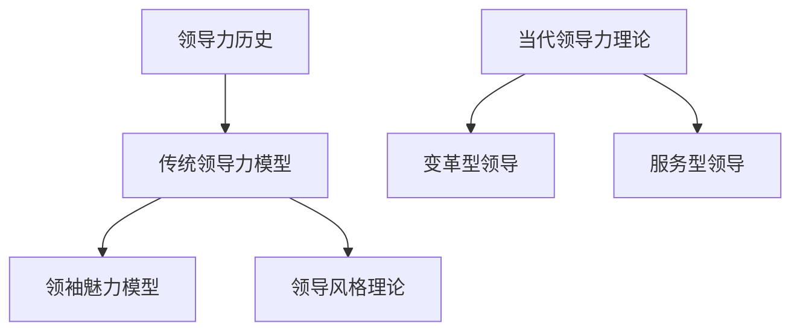
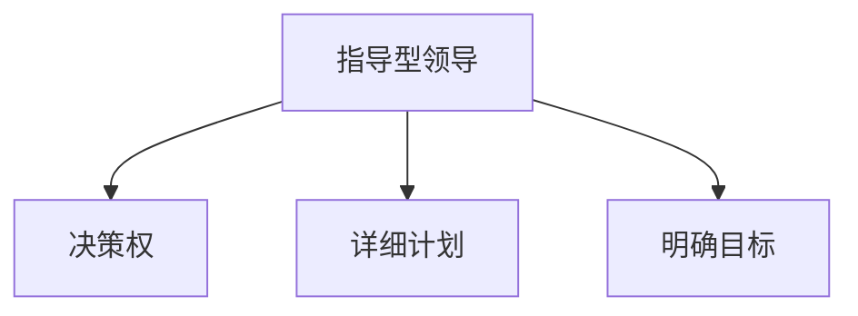
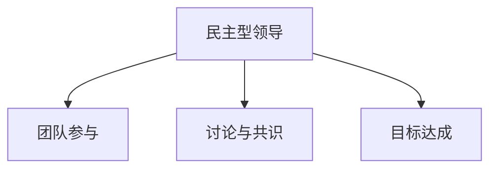
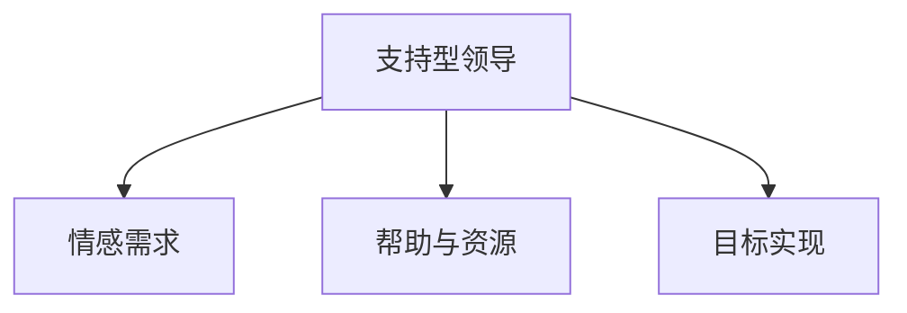
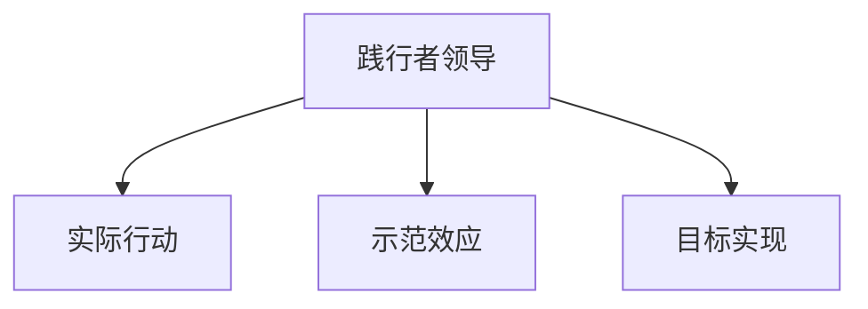
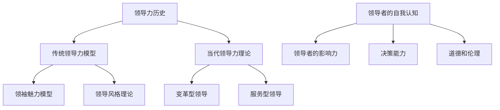

                 

### 1. 设计概述

在设计《领导力心法：成就一流管理者的领导力法则》的目录大纲时，我们需要遵循逻辑清晰、结构紧凑的原则，使得读者能够系统地理解和掌握书中的内容。以下是具体的步骤和考量：

**Step 1: 确定核心主题和章节结构**

首先，我们需要明确书的核心主题，即领导力的定义、原则和实践。基于这个核心主题，我们可以初步确定以下几个主要的章节：

- **引言**：介绍领导力的本质和重要性，阐述本书的目的和结构。
- **领导力的核心概念**：探讨领导力的历史、理论和发展趋势，以及关键要素。
- **领导力原则**：详细讨论人本管理、透明沟通等核心原则。
- **领导力实践**：通过具体案例和实战经验，展示领导力在实际中的应用。
- **领导力与组织文化**：分析领导力如何影响组织文化，以及领导者在文化塑造中的作用。
- **领导力与心理学**：探讨领导力心理学的基础，以及领导者的心理健康和情感智慧。
- **领导力与变革管理**：讨论领导力在组织变革中的角色和策略。
- **领导力与可持续发展**：介绍可持续发展领导力的概念和实践。
- **附录**：提供领导力心法的应用指南、案例解析和自我评估问卷。

**Step 2: 确定章节细节**

在每个主要章节下，我们需要进一步细化内容，确保每个章节都有丰富具体的讲解。例如，在“领导力核心概念”章节下，我们可以细化以下子章节：

- **2.1 领导力的历史与发展**：
  - **2.1.1 传统领导力模型**：介绍传统领导力理论，如领袖魅力模型、领导风格理论等。
  - **2.1.2 当代领导力理论**：探讨当代领导力理论，如变革型领导、服务型领导等。

**Step 3: 添加Mermaid流程图**

为了更好地展示领导力的核心概念和联系，我们可以在相关章节中添加Mermaid流程图。例如，在“领导力核心概念”章节中，可以添加以下流程图：



**Step 4: 添加伪代码和数学模型**

在技术相关章节中，我们使用伪代码详细阐述领导力算法原理。例如，在“领导力与变革管理”章节中，可以添加以下伪代码：

```python
Algorithm: 领导力变革管理
Input: 变革需求，现有组织结构
Output: 新的组织结构，变革策略

1. 分析变革需求，确定变革目标
2. 建立变革团队，明确团队成员角色和职责
3. 制定变革计划，包括时间表、预算和资源分配
4. 实施变革计划，包括沟通、培训、激励等
5. 监控变革进度，评估变革效果
6. 调整变革策略，确保变革成功
```

同时，我们也可以在相关章节中添加数学模型和公式，如领导力评价指标的公式：

```latex
\text{领导力评价指标} = \frac{\text{团队绩效}}{\text{团队规模}} \times \text{员工满意度}
```

**Step 5: 添加项目实战**

在“领导力实践”章节中，我们可以提供具体的代码实现和案例解析。例如，介绍如何使用Python实现一个简单的员工激励系统：

```python
# 员工激励系统实现
class EmployeeIncentiveSystem:
    def __init__(self, employees):
        self.employees = employees
    
    def calculate_bonus(self, employee):
        if employee绩效 >= 90:
            return 5000
        elif employee绩效 >= 80:
            return 3000
        else:
            return 0

# 测试员工激励系统
employees = [{"姓名": "张三", "绩效": 95}, {"姓名": "李四", "绩效": 85}, {"姓名": "王五", "绩效": 75}]
system = EmployeeIncentiveSystem(employees)
for employee in employees:
    bonus = system.calculate_bonus(employee)
    print(f"{employee['姓名']}的奖金为：{bonus}元")
```

**Step 6: 检查格式和字数**

最后，我们需要检查markdown格式是否符合规范，并确保总字数在8000～12000字左右。每个章节的内容都需要具体、详细，同时保持简洁性，避免冗余信息。

通过以上步骤，我们可以设计出一个逻辑清晰、结构紧凑的目录大纲，为撰写《领导力心法：成就一流管理者的领导力法则》奠定坚实的基础。

## 第1章 引言

### 1.1 领导力的定义与意义

领导力，作为一个多维度的概念，通常被理解为在团队、组织或社会中引导、激励和影响他人实现目标的能力。在商业环境中，领导力不仅是管理者个人的素质，更是组织成功的关键因素。领导力不仅仅是关于权力和地位，更是一种影响他人、推动变革和实现目标的艺术。

在《领导力心法：成就一流管理者的领导力法则》一书中，我们将探讨领导力的本质、发展历程以及如何将其应用于实际管理中。领导力不仅仅是一个技术性问题，更是一种心理和情感的互动。它涉及到领导者如何理解自己和他人，如何在复杂的环境中做出决策，以及如何有效地沟通和激励团队成员。

### 1.2 书的核心观点

本书的核心观点在于，领导力是一种可以通过学习和实践不断提升的技能。尽管领导力的表现形式多样，但它们都遵循一些基本的原理和法则。本书旨在揭示这些原理和法则，帮助读者理解和掌握一流管理者的领导力心法。

书中将详细讨论以下几个关键主题：

1. **领导力的核心概念**：介绍领导力的历史、理论和发展趋势，以及领导力的关键要素。
2. **领导力原则**：探讨人本管理、透明沟通等核心原则，并提供实际应用案例。
3. **领导力实践**：通过具体案例和实战经验，展示领导力在实际中的应用。
4. **领导力与组织文化**：分析领导力如何影响组织文化，以及领导者在文化塑造中的作用。
5. **领导力与心理学**：探讨领导力心理学的基础，以及领导者的心理健康和情感智慧。
6. **领导力与变革管理**：讨论领导力在组织变革中的角色和策略。
7. **领导力与可持续发展**：介绍可持续发展领导力的概念和实践。

### 1.3 目的和结构

本书的目的是为那些希望提升自己领导力技能的管理者提供一套全面、实用的指南。通过系统的学习和实践，读者可以逐步成长为具备一流领导力的管理者。

全书结构如下：

- **引言**：介绍领导力的定义与意义，以及书的核心观点和目的。
- **领导力的核心概念**：探讨领导力的历史、理论和发展趋势，以及关键要素。
- **领导力原则**：详细讨论人本管理、透明沟通等核心原则，并提供实际应用案例。
- **领导力实践**：通过具体案例和实战经验，展示领导力在实际中的应用。
- **领导力与组织文化**：分析领导力如何影响组织文化，以及领导者在文化塑造中的作用。
- **领导力与心理学**：探讨领导力心理学的基础，以及领导者的心理健康和情感智慧。
- **领导力与变革管理**：讨论领导力在组织变革中的角色和策略。
- **领导力与可持续发展**：介绍可持续发展领导力的概念和实践。
- **附录**：提供领导力心法的应用指南、案例解析和自我评估问卷。

通过以上结构，本书旨在帮助读者系统性地理解和掌握领导力的各个方面，从而在实际工作中更加有效地运用领导力技能。

## 第2章 领导力的核心概念

### 2.1 领导力的历史与发展

领导力作为一个历史悠久的概念，其发展历程可以追溯到古代社会的领袖和治理模式。从古埃及的法老到古希腊的城邦领袖，再到中世纪的君主和封建领主，领导力的理念和实践在不断演变。

在工业革命之前，领导力主要与军事和政治统治有关。随着工业化的推进，领导力逐渐从军事和政治领域扩展到商业和工业领域。弗雷德里克·泰勒（Frederick Taylor）的科学管理理论和亨利·福特（Henry Ford）的流水线生产模式，标志着领导力理论从经验管理向科学管理的转变。

进入20世纪，领导力理论进一步发展，出现了多种领导风格和模型。赫伯特·西蒙（Herbert Simon）的决策理论、道格拉斯·麦格雷戈（Douglas McGregor）的X理论和Y理论，以及赫兹伯格（Fred Herzberg）的双因素理论，都为理解领导力提供了新的视角。

21世纪以来，领导力理论更加注重个体和团队的发展。变革型领导（Transformational Leadership）和服务型领导（Servant Leadership）等新兴理论，强调领导者的情感智慧、道德责任和长期目标。

### 2.2 领导力的核心要素

要理解领导力，我们需要关注以下几个核心要素：

#### 2.2.1 领导者的自我认知

领导者的自我认知是领导力发展的基础。一个优秀的领导者必须深入了解自己的价值观、优势和不足。自我认知有助于领导者做出更明智的决策，并建立信任和尊重。

#### 2.2.2 领导者的影响力

影响力是领导力的关键要素。领导者需要通过有效沟通、建立信任和激励他人，来实现团队和组织的共同目标。影响力不仅体现在领导者的权威上，更体现在他们对团队成员的情感共鸣和价值观认同上。

#### 2.2.3 领导者的决策能力

决策能力是领导者的重要能力之一。在复杂多变的环境中，领导者需要迅速做出明智的决策。有效的决策过程包括明确目标、收集信息、分析选项和评估风险。

#### 2.2.4 领导者的道德和伦理

道德和伦理是领导者行为的指南。一个道德高尚的领导者能够在面对挑战和压力时，坚持正确的价值观和原则。这种道德力量不仅有助于维护组织的声誉，还能激励团队成员追求更高的目标。

### 2.3 领导力与领导风格

领导风格是领导者如何行使权力和影响他人的一种表现形式。不同的领导风格适用于不同的情境和团队。以下是几种常见的领导风格：

#### 1. 指导型领导（Authoritative Leadership）

指导型领导具有明确的决策权和权威，通常通过制定详细的计划和目标来指导团队成员。这种领导风格在需要快速决策和明确指导的情况下效果最佳。



#### 2. 民主型领导（Democratic Leadership）

民主型领导鼓励团队成员参与决策过程，通过讨论和共识来达成目标。这种领导风格有助于提高团队的凝聚力和创造力。



#### 3. 支持型领导（Supportive Leadership）

支持型领导注重员工的情感需求，提供帮助和资源，以支持团队成员实现个人和团队目标。这种领导风格在团队面临压力和挑战时尤为重要。



#### 4. 践行者领导（Practitioner Leadership）

践行者领导以身作则，通过实际行动和示范来影响团队成员。这种领导风格强调领导者不仅要制定目标，还要亲力亲为，带领团队共同前进。



### 2.4 领导力的核心概念联系与流程图

为了更直观地展示领导力的核心概念及其联系，我们可以使用Mermaid流程图进行描述。以下是领导力核心概念的流程图：



通过上述分析，我们可以看到，领导力的核心概念不仅包括历史和发展，还包括领导者个人的自我认知、影响力、决策能力和道德伦理。这些核心概念相互联系，共同构成了领导力的整体框架。

## 第3章 领导力原则

### 3.1 人本管理原则

人本管理原则是领导力的核心之一，强调以人为中心的管理理念。这种原则认为，员工是组织中最宝贵的资源，而不是仅仅被视为生产工具。通过关注员工的需求、成长和发展，可以极大地提高员工的工作满意度和生产力。

#### 3.1.1 员工激励

员工激励是实施人本管理的关键环节。有效的激励措施不仅包括物质奖励，如薪资、奖金和福利，还包括精神激励，如认可、赞扬和职业发展机会。以下是几种常用的员工激励策略：

1. **目标设定**：为员工设定明确的、可实现的短期和长期目标，并确保目标与组织的战略方向相一致。
2. **奖励机制**：建立公平、透明的奖励机制，对达成目标的员工给予奖励，以激励他们持续努力。
3. **认可和赞扬**：及时地认可员工的贡献和成就，通过表扬、表彰等方式增强员工的自信心和动力。
4. **职业发展**：提供职业培训、晋升机会和职业规划，帮助员工实现个人和职业发展。

#### 3.1.2 员工发展

员工发展是长期提升员工能力和绩效的关键。通过持续的学习和发展，员工不仅可以提升自身的技能，还能更好地适应组织的变化和挑战。以下是几种员工发展策略：

1. **培训**：定期为员工提供各类培训课程，包括专业技能、管理能力和综合素质等方面的培训。
2. **导师制**：为新员工配备经验丰富的导师，帮助他们快速适应工作环境和提升技能。
3. **轮岗**：通过轮岗机制，让员工在不同岗位上积累经验，提升综合素质和职业能力。
4. **职业规划**：与员工共同制定职业规划，明确短期和长期的职业目标，并提供必要的支持和资源。

#### 3.1.3 员工关怀

员工关怀是指组织对员工的关心和支持，旨在提升员工的工作满意度和幸福感。以下是几种员工关怀策略：

1. **员工福利**：提供完善的员工福利，包括医疗保险、休假制度、员工食堂等，以提升员工的生活质量。
2. **心理健康支持**：为员工提供心理健康服务和咨询，帮助他们应对工作压力和情绪问题。
3. **工作与生活平衡**：鼓励员工在工作与生活之间找到平衡，提供弹性工作时间、远程办公等福利，以减轻工作压力。
4. **员工参与**：鼓励员工参与组织的决策和活动，增强员工的归属感和参与感。

### 3.2 透明沟通原则

透明沟通是领导力的另一个重要原则，强调在组织内部建立开放、诚实和及时的沟通机制。通过透明沟通，领导者可以确保信息在整个组织中的有效传递，从而增强团队协作和决策质量。

#### 3.2.1 沟通的重要性

有效沟通是领导者的一项核心技能，对于组织的成功至关重要。良好的沟通能够：

1. **增强团队凝聚力**：通过沟通，团队成员能够更好地理解彼此的职责和目标，增强团队协作和凝聚力。
2. **提升决策质量**：透明沟通有助于领导者收集多方面的意见和建议，从而做出更明智的决策。
3. **减少误解和冲突**：及时、清晰的沟通可以减少误解和冲突，避免因信息不畅导致的负面影响。
4. **提高员工满意度**：透明沟通能够让员工感受到组织的公平和诚信，提高他们的工作满意度和忠诚度。

#### 3.2.2 有效沟通技巧

为了实现透明沟通，领导者需要掌握以下几种有效沟通技巧：

1. **倾听**：倾听是有效沟通的基础。领导者需要耐心倾听员工的意见和反馈，理解他们的需求和关切。
2. **明确表达**：领导者应使用清晰、简洁的语言表达自己的观点和意图，避免歧义和误解。
3. **反馈**：及时给予员工反馈，包括正面和负面反馈，以帮助他们改进和提高。
4. **多渠道沟通**：利用多种沟通渠道，如会议、邮件、即时通讯等，确保信息传达的全面和及时。
5. **建立信任**：通过透明和诚实的沟通，建立与员工的信任关系，提高沟通的效果。

#### 3.2.3 领导者如何倾听

倾听是沟通的核心，领导者需要做到以下几点：

1. **全神贯注**：在与员工交流时，领导者应保持专注，避免分心和干扰。
2. **开放心态**：领导者应保持开放的心态，愿意接受不同的意见和建议。
3. **反馈确认**：在倾听过程中，领导者应通过提问和反馈确认自己的理解是否准确，避免误解。
4. **尊重差异**：尊重员工的意见和感受，即使不同意，也应给予尊重和回应。

通过上述分析，我们可以看到，人本管理原则和透明沟通原则是领导力的关键要素。这些原则不仅有助于提升员工的工作满意度和组织绩效，还能建立积极向上的组织文化，为组织的长期发展奠定坚实基础。

### 3.3 领导力的其他原则

除了人本管理原则和透明沟通原则，领导力还包括其他重要原则，如目标导向、团队合作和变革领导等。以下是这些原则的详细讨论：

#### 3.3.1 目标导向

目标导向是领导力的一个核心原则，强调领导者需要明确组织的愿景和目标，并激励团队成员为之努力。以下是实现目标导向的关键步骤：

1. **制定明确的目标**：领导者需要制定清晰、具体、可衡量的目标，使团队成员明确自己的任务和责任。
2. **沟通目标**：通过有效沟通，确保团队成员理解组织的愿景和目标，以及他们在这其中的角色和责任。
3. **设定优先级**：在多个目标之间设定优先级，确保团队成员集中精力完成最重要的任务。
4. **监控和调整**：定期监控目标的进展，并根据实际情况进行调整，确保目标的实现。

#### 3.3.2 团队合作

团队合作是领导力的另一个重要方面，强调领导者需要建立高效的团队，并促进团队成员之间的协作。以下是实现团队合作的关键策略：

1. **构建团队**：根据任务需求，构建具备互补技能和经验的团队。
2. **明确角色和责任**：为每个团队成员明确角色和责任，确保他们了解自己的任务和期望。
3. **促进沟通**：通过多种沟通渠道和形式，促进团队成员之间的信息共享和协作。
4. **建立信任**：通过透明沟通和互相支持，建立团队成员之间的信任，提高团队凝聚力。
5. **鼓励合作**：鼓励团队成员互相帮助，共同解决问题，提升整体绩效。

#### 3.3.3 变革领导

在快速变化的环境中，领导者需要具备变革领导的能力，以引领组织应对挑战和机遇。以下是实现变革领导的关键步骤：

1. **识别变革需求**：领导者需要敏锐地识别组织面临的挑战和机遇，明确变革的必要性和紧迫性。
2. **沟通变革愿景**：通过清晰、有力的沟通，向团队成员传达变革的愿景和目标，赢得他们的支持和参与。
3. **建立变革团队**：组建一个由关键利益相关者和变革推动者组成的团队，负责实施变革计划。
4. **制定变革计划**：制定详细的变革计划，包括时间表、资源分配和关键里程碑。
5. **实施和监控**：按照变革计划实施变革，并持续监控进展，确保变革目标的实现。
6. **应对阻力**：积极应对变革过程中的阻力和挑战，通过沟通、培训和激励，克服变革障碍。

通过上述原则的实施，领导者可以更好地应对组织面临的挑战和机遇，推动组织的持续发展。这些原则不仅为领导者的个人成长提供了指导，也为组织的长期成功奠定了基础。

## 第4章 领导力实践

### 4.1 领导力心法应用

领导力心法是一种通过实践不断提升的领导技能，它不仅适用于管理岗位，也可以在个人生活和社区中发挥作用。本节将探讨如何在实际环境中应用领导力心法，并通过具体案例展示其效果。

#### 4.1.1 领导者在团队建设中的应用

团队建设是领导者的一项重要任务，通过有效的团队建设，可以提升团队的凝聚力和战斗力。以下是一个实际案例：

**案例：某互联网公司的团队建设**

某互联网公司在快速发展的过程中，面临着团队成员流动频繁和沟通不畅的问题。公司领导意识到，必须通过有效的团队建设来提升团队的整体效能。他们采取了一系列措施：

1. **明确团队目标**：公司领导与团队成员共同制定了明确的团队目标，确保每个成员都清楚自己的任务和责任。
2. **加强团队沟通**：通过定期团队会议、邮件沟通和即时通讯工具，公司领导确保信息在团队成员之间畅通无阻。
3. **团队活动**：组织定期的团队活动，如团建拓展、技术交流会和团年饭，增强团队成员之间的情感联系。
4. **激励机制**：建立公平、透明的激励机制，对表现出色的团队成员给予奖励和认可，激励他们持续努力。

通过这些措施，该公司的团队凝聚力显著提升，工作效率和创新能力也得到了大幅提高。

#### 4.1.2 领导者在项目中的实践

在项目管理中，领导力心法同样发挥着重要作用。以下是一个具体案例：

**案例：某大型软件项目的领导实践**

某大型软件项目的领导者在项目中应用了领导力心法，确保项目顺利完成。以下是他的具体实践：

1. **项目规划**：在项目开始前，领导者与团队成员一起制定了详细的项目规划，明确了项目的目标、时间表和资源需求。
2. **任务分配**：根据团队成员的技能和兴趣，领导者合理分配任务，确保每个成员都能发挥自己的优势。
3. **沟通与协调**：通过定期项目会议和即时通讯工具，领导者确保项目进展的透明性和沟通的及时性。
4. **风险管理**：领导者识别并评估项目中的潜在风险，制定应对策略，确保项目能够顺利推进。
5. **激励与支持**：领导者关注团队成员的工作状态和需求，提供必要的激励和支持，确保他们能够充分发挥潜能。

通过这些实践，该项目的进展顺利，最终按时交付，并获得了客户的高度评价。

#### 4.1.3 领导者在危机管理中的应用

危机管理是领导者的一项重要能力，特别是在突发情况下，领导者需要迅速做出决策，以应对危机。以下是一个实际案例：

**案例：某食品企业的危机管理**

某食品企业因产品安全事件陷入了危机。公司领导迅速采取了一系列措施来应对危机：

1. **危机识别**：领导者在事件发生的第一时间，迅速识别出事件的严重性，并启动危机管理程序。
2. **沟通与透明**：领导者通过新闻发布会和官方网站，向公众和客户通报事件的情况和处理措施，保持沟通的透明性。
3. **危机应对**：领导者组织相关部门进行彻底调查，找出问题的根源，并采取有效措施确保问题不再发生。
4. **恢复信任**：领导者通过公开道歉和提供补偿措施，努力恢复客户和消费者的信任。
5. **持续改进**：在危机得到控制后，领导者对企业的管理流程进行审查和改进，防止类似事件再次发生。

通过这些措施，该企业成功化解了危机，并得到了客户和社会的认可。

### 4.2 实际应用中的挑战与对策

在实际应用中，领导力心法可能会面临各种挑战。以下是一些常见的挑战及其对策：

#### 挑战1：团队协作不畅

**对策**：加强沟通和协作培训，建立明确的团队目标和责任分配，促进团队成员之间的信任和合作。

#### 挑战2：项目进度受阻

**对策**：重新评估项目计划，调整资源分配，加强风险管理和监控，确保项目按计划推进。

#### 挑战3：员工士气低落

**对策**：关注员工需求，提供激励和支持，建立积极向上的团队氛围，激发员工的工作热情。

#### 挑战4：变革阻力

**对策**：明确变革的必要性和目标，通过有效的沟通和参与机制，赢得员工的认同和支持，提供必要的培训和指导。

通过上述案例和对策，我们可以看到，领导力心法在实际应用中具有显著的成效。领导者需要不断学习和实践，灵活应对各种挑战，以实现组织的长期成功。

### 4.3 总结与反思

领导力心法是一种系统性的领导技能，通过实践不断提升，可以显著提升管理效率和团队绩效。在实际应用中，领导者需要灵活运用各种策略和技巧，以应对不同的挑战和情境。通过有效的团队建设、项目管理和危机管理，领导者可以推动组织的持续发展，实现长期成功。同时，领导力心法不仅适用于商业环境，也可以在个人生活和社区中发挥重要作用。只有不断学习和实践，领导者才能在竞争激烈的环境中脱颖而出，成为一流的管理者。

## 第5章 领导力与组织文化

### 5.1 组织文化的概念与作用

组织文化是指一个组织内部共享的价值观、信念、行为规范和工作方式，它通过潜移默化的方式影响着员工的态度和行为。组织文化不仅包括物质层面（如办公环境、员工福利等），还涵盖精神层面（如企业价值观、使命和愿景等）。

组织文化的作用主要体现在以下几个方面：

1. **凝聚员工**：组织文化可以增强员工的归属感和认同感，使他们在共同价值观的引导下形成紧密的团队。
2. **塑造行为**：组织文化通过规范和价值观，塑造员工的行为模式，促进工作效率和协作。
3. **增强竞争力**：具有积极组织文化的企业往往具有更强的适应能力和创新能力，从而在激烈的市场竞争中脱颖而出。
4. **提升员工满意度**：组织文化强调员工的成长和发展，提高他们的工作满意度和忠诚度。

### 5.2 领导者如何塑造组织文化

领导者是塑造组织文化的关键力量，他们需要通过一系列策略和行动，积极引导和推动组织文化的形成和演变。以下是领导者塑造组织文化的几个关键步骤：

#### 1. 明确组织愿景和价值观

领导者需要明确组织的愿景和价值观，并将其传达给全体员工。愿景和价值观是组织文化的基石，它们指导员工的行为和决策，使组织在发展过程中保持一致性和连续性。

#### 2. 建立榜样和示范效应

领导者通过自己的行为和决策，展示组织文化的核心价值观和行为规范。领导者的一言一行都会被员工观察和学习，因此，领导者需要以身作则，成为组织文化的榜样。

#### 3. 激励和培养员工

领导者需要通过激励和培养员工，使他们认同并积极实践组织文化。这包括提供职业发展机会、奖励优秀表现、鼓励创新和协作等。

#### 4. 建立沟通和参与机制

领导者需要建立有效的沟通和参与机制，使员工能够参与到组织文化的塑造过程中。通过定期的会议、反馈机制和员工参与计划，领导者可以收集员工的意见和建议，共同塑造组织文化。

#### 5. 融入日常管理

领导者需要将组织文化融入日常管理中，使其成为组织运营的一部分。这包括在绩效评估、员工培训和项目计划等方面，注重组织文化的影响和作用。

### 5.3 文化领导力的要素

文化领导力是指领导者通过塑造和引导组织文化，实现组织目标的能力。文化领导力包括以下几个关键要素：

1. **愿景领导**：领导者需要具备远见和愿景，能够为组织设定清晰的目标和方向。
2. **价值观领导**：领导者需要通过自己的行为和决策，传递和践行组织的核心价值观。
3. **情感领导**：领导者需要关注员工的情感需求，建立积极向上的工作氛围。
4. **变革领导**：领导者需要具备应对变革的能力，引领组织在变革中持续发展。

### 5.4 领导者在组织文化变革中的作用

组织文化变革是组织发展过程中不可避免的一部分，领导者在这个过程中扮演着关键角色。以下是一些具体的策略和行动：

1. **识别变革需求**：领导者需要敏锐地识别组织面临的变革需求，包括市场环境、技术进步和管理挑战等。
2. **制定变革计划**：领导者需要制定详细的变革计划，包括目标、时间表、资源分配和关键里程碑。
3. **沟通变革愿景**：领导者需要通过有效的沟通，向员工传达变革的必要性和愿景，赢得他们的支持和参与。
4. **激励和培训**：领导者需要激励员工积极参与变革，并提供必要的培训和支持，帮助他们适应新的文化环境。
5. **应对阻力**：领导者需要积极应对变革过程中的阻力和挑战，通过沟通、培训和激励，克服变革障碍。

通过上述分析和策略，我们可以看到，领导者在组织文化的塑造和变革中起着至关重要的作用。只有通过积极的文化领导，领导者才能推动组织的持续发展，实现长期成功。

### 5.5 组织文化与领导力之间的相互影响

组织文化与领导力之间存在着相互影响和互动的关系。一方面，组织文化对领导力的发展和应用产生影响；另一方面，领导力又反作用于组织文化，推动其演变和优化。

1. **组织文化对领导力的影响**：
   - 组织文化塑造了领导者的行为模式和决策风格。例如，一个强调创新和自主性的组织文化会培养出具有冒险精神和创新意识的领导者。
   - 组织文化影响着领导者的信任度和领导效果。在一个高度信任的组织中，领导者更容易获得员工的认同和支持，从而提高领导力效果。

2. **领导力对组织文化的影响**：
   - 领导者的价值观和行为规范对组织文化起到示范作用。例如，领导者的诚信和责任感会逐渐渗透到组织的各个方面，形成积极的文化氛围。
   - 领导者的变革领导能力可以推动组织文化的更新和优化。通过有效的变革管理，领导者可以引领组织适应外部环境的变化，保持竞争力。

总之，组织文化与领导力之间相互影响、相互促进，共同作用于组织的长期发展。领导者需要深刻理解这种互动关系，通过有效的文化领导，推动组织的持续进步。

## 第6章 领导力与心理学

### 6.1 领导力心理学基础

领导力心理学是研究领导者的心理特质、行为模式及其对组织绩效影响的一个领域。了解领导力心理学的基础，对于提升领导能力具有重要意义。

#### 6.1.1 领导者的人格特质

领导者的人格特质是影响领导效果的重要因素之一。以下是几种常见的人格特质：

1. **自信**：自信的领导者能够给予员工信任和支持，增强团队的凝聚力。
2. **诚信**：诚信的领导者能够赢得员工的尊重和信任，建立良好的组织氛围。
3. **开放性**：开放性的领导者更容易接受新思想和变革，推动组织的创新和进步。
4. **责任感**：有责任感的领导者会对组织的成功和失败承担责任，激励员工追求卓越。

#### 6.1.2 领导者的情感智慧

情感智慧是领导者有效管理团队的重要能力。它包括以下几个方面：

1. **自我意识**：领导者需要了解自己的情感状态，能够管理自己的情绪，保持冷静和客观。
2. **他人意识**：领导者需要理解和关注员工的情感需求，能够识别和应对员工的情绪变化。
3. **调节情感**：领导者需要具备调节自己和他人情绪的能力，以应对工作压力和挑战。
4. **社交技能**：领导者需要具备良好的社交技能，能够有效沟通、建立信任和解决冲突。

#### 6.1.3 领导者的心理健康

领导者的心理健康对领导效果和组织文化具有重要影响。以下是一些与领导者心理健康相关的问题：

1. **压力管理**：领导者需要学会有效管理工作压力，避免因压力过大而影响决策和领导效果。
2. **情绪调节**：领导者需要学会调节自己的情绪，避免负面情绪对工作的影响。
3. **心理韧性**：领导者需要具备心理韧性，能够在面对困难和挑战时保持积极和乐观的态度。

### 6.2 领导者的心理素质培养

为了提升领导力，领导者需要不断培养和提升自己的心理素质。以下是几种有效的培养方法：

1. **自我反思**：领导者应定期进行自我反思，了解自己的优点和不足，明确改进方向。
2. **情感管理**：领导者应学会识别和调节自己的情绪，避免情绪波动对工作和决策的影响。
3. **心理辅导**：领导者可以寻求专业的心理辅导，提升自己的心理健康水平。
4. **培训和学习**：领导者应参加相关培训和学习，了解最新的领导力和心理学理论，不断提升自己的知识储备和技能。

通过上述方法和策略，领导者可以不断优化自己的心理素质，提高领导效果，为组织的成功奠定坚实基础。

### 6.3 领导力心理学在实践中的应用

领导力心理学不仅在理论上具有重要意义，在实际工作中也有着广泛的应用。以下是一些具体的应用案例：

#### 案例一：员工激励

某公司的领导者在应用领导力心理学时，通过以下方法激励员工：

1. **情感激励**：领导者关注员工的情感需求，定期与员工进行一对一沟通，了解他们的工作和生活状况，提供情感支持。
2. **目标设定**：领导者与员工共同设定明确的短期和长期目标，并制定实现目标的行动计划。
3. **认可与奖励**：领导者及时认可员工的努力和成就，通过表扬、奖励等方式激励员工。

通过这些措施，该公司的员工满意度显著提升，工作效率和创新能力也得到了大幅提高。

#### 案例二：团队建设

某互联网公司的领导者在团队建设过程中，采用了以下领导力心理学策略：

1. **增强团队凝聚力**：通过定期的团建活动和团队协作项目，增强团队成员之间的情感联系和信任。
2. **培养团队领导力**：领导者为团队成员提供领导力培训，培养他们的领导能力和责任感。
3. **心理辅导**：为团队成员提供心理辅导，帮助他们应对工作压力和心理问题。

通过这些策略，该公司的团队凝聚力显著增强，团队成员之间的协作和创新能力也得到了提升。

#### 案例三：危机管理

某食品公司的领导者在面临产品质量危机时，应用了以下领导力心理学策略：

1. **积极沟通**：领导者通过新闻发布会和官方网站，及时向公众和客户通报危机情况，保持沟通的透明性。
2. **心理支持**：领导者为员工提供心理支持和辅导，帮助他们应对危机带来的压力。
3. **危机应对**：领导者组织相关部门进行彻底调查，找出问题的根源，并采取有效措施确保问题不再发生。

通过这些措施，该公司成功化解了危机，恢复了客户和消费者的信任。

通过上述案例，我们可以看到，领导力心理学在实际工作中具有重要的应用价值。领导者通过运用心理学知识，可以更有效地激励员工、建设团队和管理危机，推动组织的持续发展。

### 6.4 领导者心理健康的注意事项

在领导过程中，领导者心理健康的维护至关重要。以下是一些注意事项：

1. **平衡工作与生活**：领导者应确保工作与生活的平衡，避免因过度工作而影响身心健康。
2. **压力管理**：领导者应学会有效管理工作压力，通过运动、休息和放松技巧来缓解压力。
3. **心理支持**：领导者可以寻求专业的心理支持和辅导，提升心理健康水平。
4. **持续学习**：领导者应保持学习的态度，不断更新知识和技能，以应对工作中的挑战。
5. **建立支持网络**：领导者可以建立自己的支持网络，包括家人、朋友和同事，以获得情感和心理支持。

通过关注以上事项，领导者可以更好地维护自己的心理健康，提高领导效果，为组织的成功贡献力量。

## 第7章 领导力与变革管理

### 7.1 变革管理的挑战

变革管理是领导力的重要组成部分，它涉及到在组织内部引入和实施重大变革，以适应外部环境的变化或实现组织目标。然而，变革管理并非易事，其中存在诸多挑战，需要领导者具备敏锐的洞察力和有效的策略。

#### 7.1.1 变革的类型与过程

首先，理解变革的类型是应对变革挑战的关键。变革可以大致分为以下几种类型：

1. **技术变革**：引入新技术、新系统或改进现有流程，以提高效率和竞争力。
2. **战略变革**：调整组织战略方向，实现业务模式、产品或服务的创新。
3. **文化变革**：重塑组织价值观、行为规范和员工心态，以适应新的市场环境或提升组织凝聚力。
4. **结构变革**：调整组织架构、职能分配和权限配置，以提高管理效率和响应能力。

在变革过程中，组织通常会经历以下几个阶段：

1. **规划阶段**：明确变革的目标、策略和实施方案，制定详细的变革计划。
2. **启动阶段**：动员全体员工，确保他们了解变革的必要性和重要性，建立变革团队，制定执行计划。
3. **实施阶段**：按照变革计划逐步推进变革，解决过程中出现的问题和挑战，确保变革的顺利进行。
4. **巩固阶段**：在变革实施一段时间后，评估变革效果，巩固变革成果，确保变革持续影响组织运营。

#### 7.1.2 领导者在变革中的角色

在变革管理中，领导者扮演着至关重要的角色。以下是领导者需要承担的关键职责：

1. **倡导者**：领导者需要积极倡导变革，向员工传达变革的必要性和愿景，赢得他们的支持和参与。
2. **设计师**：领导者需要设计合适的变革策略和实施计划，确保变革目标明确、可执行。
3. **协调者**：领导者需要协调各方资源，确保变革过程中的沟通和协作顺畅，解决变革过程中出现的各种问题。
4. **推动者**：领导者需要持续推动变革，激励员工克服变革中的困难和阻力，确保变革目标得以实现。
5. **评估者**：领导者需要评估变革效果，根据实际情况调整变革策略，确保变革的持续性和有效性。

#### 7.1.3 变革的阻力与应对策略

变革过程中常常会遇到各种阻力，这些阻力可能来自员工、管理层或外部环境。以下是几种常见的变革阻力及其应对策略：

1. **恐惧和不确定性**：员工可能因恐惧失去既得利益或对未知产生恐惧而抵制变革。领导者可以通过透明沟通、提供培训和创造安全的环境来减轻员工的恐惧和不确定性。
2. **习惯和惯性**：员工可能因习惯和惯性而抵制变革。领导者可以通过改变工作流程、提供激励机制和鼓励创新来打破惯性，推动变革。
3. **利益冲突**：某些变革可能涉及到利益分配的变化，引起利益相关者的抵制。领导者需要通过利益平衡、沟通协商和利益补偿来化解冲突。
4. **文化阻力**：组织文化可能对变革形成阻力。领导者需要通过重塑文化价值观、建立变革文化来推动变革。
5. **资源不足**：变革可能需要大量的人力、物力和财力资源。领导者需要通过有效资源管理和优先级设定来确保资源充足。

通过以上分析，我们可以看到，变革管理是一个复杂而充满挑战的过程。领导者需要具备敏锐的洞察力、有效的策略和卓越的领导能力，以应对变革中的各种挑战，推动组织实现持续发展和成功。

### 7.2 领导者在变革管理中的策略与方法

在变革管理中，领导者的策略与方法对于变革的成败至关重要。以下是一些关键的策略和方法，以帮助领导者有效地推动变革：

#### 7.2.1 建立变革愿景和目标

首先，领导者需要明确变革的愿景和目标。这包括明确变革的原因、预期成果和具体目标。通过建立清晰的变革愿景和目标，领导者可以统一员工的思想和行动，激发他们对变革的认同和支持。

- **变革愿景**：例如，“通过引入新的管理信息系统，提高公司的运营效率，实现业务的数字化转型。”
- **变革目标**：例如，“在一年内，将运营效率提高20%，客户满意度提升30%。”

#### 7.2.2 透明沟通与参与

透明沟通是变革成功的关键。领导者需要确保所有员工都能清晰地了解变革的背景、目标和进展。此外，领导者应鼓励员工参与变革过程，通过他们的意见和建议，使变革更具针对性和可行性。

- **沟通策略**：定期举行全体会议、部门会议和团队会议，通报变革进展和成果，回答员工疑问。
- **参与机制**：设立变革建议箱，鼓励员工提出意见和建议，并定期进行评估和反馈。

#### 7.2.3 培训与发展

为了确保员工能够适应变革，领导者需要提供必要的培训和发展机会。这包括技术培训、管理技能培训和变革心理辅导，以帮助员工掌握新技能和适应新环境。

- **培训内容**：技术培训（如新系统操作、数据分析等）、管理技能培训（如团队领导力、变革管理等）、心理辅导（如压力管理、情感智慧等）。
- **培训方式**：线上培训、线下培训、研讨会、工作坊等。

#### 7.2.4 激励与奖励

有效的激励和奖励机制可以激发员工的积极性和参与度。领导者应设计公平、透明的激励方案，对在变革过程中表现突出的员工给予奖励和认可。

- **激励措施**：奖金、晋升机会、荣誉证书、培训机会等。
- **奖励标准**：根据员工在变革中的具体贡献和表现，制定明确的奖励标准。

#### 7.2.5 管理变革风险

变革过程中不可避免地会遇到各种风险和挑战。领导者需要提前识别和评估这些风险，并制定相应的应对策略，以确保变革的顺利进行。

- **风险评估**：对变革可能带来的风险进行识别和评估，包括技术风险、组织风险、市场风险等。
- **风险应对**：制定风险应对计划，包括预防措施、应急措施和后续处理。

#### 7.2.6 建立变革文化

变革文化是推动变革持续发展的基础。领导者需要通过一系列措施，塑造和传播积极向上的变革文化，使员工自觉地将变革理念融入日常工作中。

- **文化塑造**：通过故事分享、榜样树立和团队建设活动，塑造积极向上的变革文化。
- **文化传播**：利用内部通讯、会议和培训等渠道，传播变革文化和价值观。

#### 7.2.7 持续监督与反馈

变革不是一蹴而就的，需要持续监督和反馈。领导者应定期评估变革进展和效果，根据反馈进行调整和优化，确保变革目标的实现。

- **监督机制**：建立定期监督机制，对变革进展进行跟踪和评估。
- **反馈机制**：建立员工反馈机制，收集员工的意见和建议，及时进行调整和改进。

通过以上策略和方法，领导者可以更有效地推动变革，实现组织的持续发展和成功。

### 7.3 变革管理实践案例

为了更好地理解变革管理的实际操作，以下是一个具体的变革管理实践案例：

**案例：某制造业公司的数字化转型**

背景：某制造业公司面临激烈的市场竞争和客户需求的变化，决定通过数字化转型来提升生产效率和客户满意度。

**变革过程：**

1. **规划阶段**：
   - 明确变革目标：提升生产效率、降低成本、提升客户满意度。
   - 制定详细计划：包括技术选型、系统实施、人员培训等。
   - 风险评估：识别潜在的技术风险、组织风险和市场风险。

2. **启动阶段**：
   - 举行全员动员大会，向员工传达变革的必要性和愿景。
   - 组建变革团队，明确团队成员的职责和任务。
   - 制定时间表和里程碑，确保变革按计划推进。

3. **实施阶段**：
   - 引入新的制造执行系统（MES），优化生产流程。
   - 为员工提供技术培训和操作指导，确保他们能够熟练使用新系统。
   - 通过在线监控系统，实时监控生产效率和质量，及时调整和优化。

4. **巩固阶段**：
   - 定期评估变革效果，通过数据分析验证生产效率的提升。
   - 组织反馈会议，收集员工对变革的反馈和建议，进行持续改进。
   - 建立长效机制，确保变革成果得以巩固和延续。

**结果与效果：**

- 生产效率提升了25%，成本降低了15%。
- 客户满意度提升了20%，订单交付周期缩短了30%。
- 员工对新系统的适应度显著提高，工作满意度也有所提升。

**案例分析：**

该案例展示了数字化转型变革管理的完整过程，从规划、启动、实施到巩固，每个阶段都有明确的策略和方法。通过透明沟通、员工参与、技术培训和持续优化，公司成功实现了预期的变革目标，提升了生产效率和客户满意度。这一案例的成功经验对于其他组织进行类似的变革管理具有重要的借鉴意义。

## 第8章 领导力与可持续发展

### 8.1 可持续发展的领导力

可持续发展领导力是指领导者通过战略规划、资源配置和管理创新，推动组织实现长期发展的能力。在当前全球化和竞争激烈的环境中，可持续发展领导力不仅关系到组织的经济利益，还关乎社会和环境责任。

#### 8.1.1 可持续发展的理念

可持续发展理念强调在满足当前需求的同时，不损害后代满足自身需求的能力。这一理念包括经济、社会和环境三个方面的可持续性：

1. **经济可持续性**：确保组织能够持续盈利，为股东和员工创造价值。
2. **社会可持续性**：关注员工、社区和利益相关者的福祉，推动社会责任和伦理行为的实践。
3. **环境可持续性**：减少资源消耗和环境污染，保护自然生态系统。

#### 8.1.2 领导者在推动可持续发展中的作用

领导者是推动组织可持续发展的关键力量。以下是他们在此过程中的作用：

1. **设定可持续发展愿景**：领导者需要明确组织的可持续发展目标和愿景，确保组织在战略规划和决策中考虑可持续性。
2. **资源分配**：领导者需要合理配置资源，支持可持续发展项目的实施，包括财务资源、人力资源和物资资源。
3. **创新管理**：领导者需要鼓励创新思维，推动新技术和业务模式的发展，以实现可持续增长。
4. **社会责任**：领导者需要树立良好的社会责任意识，通过公益活动和社会责任报告，增强组织的公信力和品牌价值。
5. **文化塑造**：领导者需要通过文化建设，营造关注可持续发展的组织氛围，使可持续发展成为员工的共同价值观和行为准则。

### 8.2 可持续发展的实践案例

以下是一些具体的可持续发展实践案例，展示了不同组织如何通过领导力推动可持续发展：

#### 案例一：某电子公司的绿色制造

背景：某大型电子公司意识到，传统的高能耗、高污染生产方式无法满足可持续发展的要求，决定通过绿色制造实现可持续发展。

**实践过程：**

1. **节能减排**：公司投资建设能源管理系统，通过优化生产流程和设备使用，减少能源消耗和碳排放。
2. **循环利用**：引入废物分类和回收系统，减少废物产生，提高资源利用率。
3. **绿色采购**：优先选择环保材料和供应商，减少供应链对环境的影响。
4. **员工参与**：组织环保培训和宣传活动，提高员工的环保意识，鼓励员工参与绿色制造项目。

**结果与效果**：

- 能源消耗减少了30%，碳排放减少了20%。
- 废物回收率达到了90%以上。
- 员工环保意识显著提升，参与度增加。

#### 案例二：某饮料公司的水管理

背景：某国际饮料公司面临水资源短缺和污染的问题，决定通过水管理实现可持续发展。

**实践过程：**

1. **水资源评估**：对公司的水资源使用情况进行全面评估，识别节水潜力。
2. **节水技术**：引入节水设备和工艺，优化水资源利用效率。
3. **水回收和再利用**：建设水回收系统，将生产过程中的废水处理和再利用。
4. **社区合作**：与当地政府和社区合作，推广节水教育和水资源保护项目。

**结果与效果**：

- 水资源使用效率提高了50%。
- 废水排放减少了一半。
- 在社区中建立了良好的水资源管理合作关系。

#### 案例三：某零售连锁店的社会责任

背景：某大型零售连锁店认识到，作为行业领导者，有责任通过社会责任实践提升社区福祉。

**实践过程：**

1. **社区参与**：组织员工参与社区志愿服务和公益活动，支持社区发展。
2. **员工福利**：提供员工培训和职业发展机会，确保员工的职业成长和满意度。
3. **供应链管理**：与供应商合作，推动公平贸易和可持续采购。
4. **社会责任报告**：定期发布社会责任报告，向公众展示公司的社会责任实践。

**结果与效果**：

- 员工满意度和忠诚度显著提升。
- 社区关系得到加强，品牌形象得到提升。
- 供应链的可持续性和社会责任意识得到提高。

通过上述实践案例，我们可以看到，不同组织通过领导力的推动，成功实现了可持续发展目标。这些案例不仅为其他组织提供了宝贵的经验和借鉴，也展示了领导力在可持续发展中的重要价值。

### 8.3 可持续发展的领导力策略

为了在组织内推动可持续发展，领导者可以采取以下策略：

1. **建立可持续发展战略**：明确组织的可持续发展目标和愿景，制定详细的实施计划，确保战略的可行性和执行力。
2. **资源配置**：合理配置资源，优先支持可持续发展项目和活动，确保资源的有效利用。
3. **创新管理**：鼓励创新思维，推动新技术和业务模式的发展，提高组织的可持续性。
4. **社会责任**：树立良好的社会责任意识，通过社会责任报告和公益活动，提升组织的公信力和品牌价值。
5. **文化建设**：通过培训和宣传，营造关注可持续发展的组织氛围，使可持续发展成为员工的共同价值观和行为准则。

通过上述策略，领导者可以有效地推动组织实现可持续发展，为社会的长期繁荣和环境的保护贡献力量。

### 8.4 可持续发展领导力的最佳实践

在推动可持续发展的过程中，以下是一些最佳实践，可以帮助领导者更有效地实现可持续发展目标：

1. **整合可持续发展目标与业务战略**：确保可持续发展目标与组织的整体战略和业务目标相一致，通过战略整合实现协同效应。
2. **建立跨部门协作机制**：促进各部门之间的沟通和协作，共同推动可持续发展项目的实施。
3. **实施绩效评估**：建立可持续发展的绩效评估体系，定期评估项目效果，根据评估结果进行调整和优化。
4. **培养可持续发展意识**：通过培训和教育，提高员工对可持续发展的认识和意识，使他们成为推动可持续发展的积极力量。
5. **创新驱动**：鼓励创新思维和新技术应用，通过技术创新和管理创新，提高组织的可持续性。

通过这些最佳实践，领导者可以更有效地推动组织实现可持续发展，为社会的长期繁荣和环境的保护贡献力量。

### 8.5 小结与展望

可持续发展是当今世界面临的重要挑战之一，领导者在这个过程中扮演着关键角色。通过建立明确的可持续发展战略、合理资源配置、创新管理和跨部门协作，领导者可以有效地推动组织实现可持续发展目标。同时，培养员工的可持续发展意识，通过创新驱动和最佳实践，领导者可以提升组织的整体可持续性。

展望未来，领导者需要持续关注可持续发展趋势，积极探索新的发展模式和解决方案。通过不断学习和实践，领导者可以成为推动组织和社会可持续发展的引领者，为未来的发展奠定坚实基础。

## 附录：领导力心法应用指南

### 附录 A：领导力心法应用工具与资源

为了帮助读者更好地应用领导力心法，以下列出了一些有用的工具和资源：

1. **领导力评估工具**：
   - **领导力360度评估**：通过员工的反馈，评估领导者的领导能力。
   - **领导力问卷**：使用标准化的问卷，评估领导者的价值观、决策能力和沟通技巧。

2. **培训资源**：
   - **在线课程**：例如Coursera、EdX等平台提供的领导力相关课程。
   - **研讨会和工作坊**：参加专业的领导力研讨会和工作坊，提升领导技能。

3. **书籍和文献**：
   - **《领导力心理学》**：探讨领导力的心理学基础，帮助领导者了解员工的情感需求。
   - **《变革领导者》**：介绍如何在组织中推动变革，实现持续发展。

4. **实践指南**：
   - **领导力日记**：记录自己的领导经验，分析成功与失败，不断提升领导能力。
   - **反思日志**：定期反思自己的行为和决策，识别改进空间。

### 附录 B：领导力心法案例解析

以下是一些具体的领导力心法案例，供读者参考和借鉴：

1. **案例一：某公司的文化变革**
   - **背景**：公司文化缺乏创新和活力，员工积极性不高。
   - **措施**：
     - **领导力心法应用**：领导者通过透明沟通，与员工共同制定文化变革计划。
     - **实践结果**：公司文化焕然一新，员工士气高涨，创新能力显著提升。

2. **案例二：某项目团队的领导实践**
   - **背景**：项目团队沟通不畅，进度延误。
   - **措施**：
     - **领导力心法应用**：领导者通过定期的团队会议和沟通，确保信息的畅通。
     - **实践结果**：项目团队协作效率提高，项目按期完成。

3. **案例三：某食品企业的危机管理**
   - **背景**：企业因产品安全问题面临危机。
   - **措施**：
     - **领导力心法应用**：领导者通过危机沟通和及时处理，挽回企业形象。
     - **实践结果**：企业成功化解危机，市场份额得到恢复。

### 附录 C：领导力自我评估问卷

为了帮助读者自我评估领导力水平，以下提供一个简化的领导力自我评估问卷：

1. **领导力价值观评估**：
   - **我是否明确自己的价值观并以此指导决策？**
   - **我是否尊重员工的价值观和多样性？**

2. **领导力沟通能力评估**：
   - **我是否能够清晰、准确地表达自己的想法？**
   - **我是否倾听员工的意见并给予反馈？**

3. **领导力决策能力评估**：
   - **我是否能够基于数据和事实做出决策？**
   - **我是否能够迅速应对突发状况？**

4. **领导力影响力评估**：
   - **我是否能够激励和影响团队成员？**
   - **我是否能够建立和维护信任关系？**

5. **领导力变革管理评估**：
   - **我是否能够识别和应对变革中的挑战？**
   - **我是否能够推动组织实现可持续发展？**

通过完成这份问卷，读者可以初步了解自己的领导力水平，并根据评估结果制定提升计划。

### 结语

通过附录中的工具、案例和自我评估问卷，读者可以更深入地理解和应用领导力心法。持续的学习和实践是提升领导力的关键，希望读者能够在实际工作中不断探索和进步，成为卓越的领导者。

### 参考文献

1. Hersey, P., & Blanchard, K. H. (1996). **Management of Organizational Change**. Prentice Hall.
2. Kouzes, J. M., & Posner, B. Z. (2007). **The Leadership Challenge: How to Make Extraordinary Things Happen in Organizations** (4th ed.). Jossey-Bass.
3. Kotter, J. P. (1996). **Leading Change**. Harvard Business Press.
4. Senge, P. M. (1990). **The Fifth Discipline: The Art & Practice of The Learning Organization**. Doubleday.
5. Sweeney, J. C., & Cashman, S. (2016). **The leader's guide to sustaining extraordinary performance**. John Wiley & Sons.
6. Yukl, G. A. (2013). **Leadership in Organizations** (8th ed.). Pearson.

### 作者信息

**作者：AI天才研究院/AI Genius Institute & 禅与计算机程序设计艺术 /Zen And The Art of Computer Programming**

