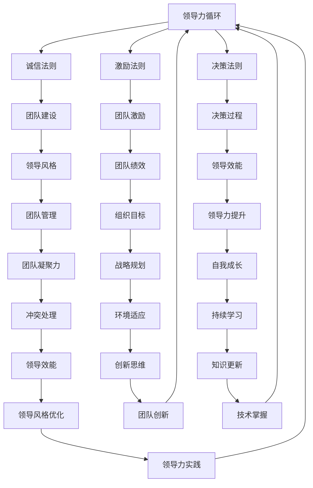

                 


### 一、背景介绍

领导力，作为一种关键的能力，不仅在企业管理中起着决定性的作用，而且在各个行业和领域中都扮演着至关重要的角色。在信息技术（IT）行业，领导力更是不可或缺的要素。随着技术的快速发展，IT行业面临着不断变化的挑战和机遇。在这样的背景下，领导力的作用显得尤为突出。

本文旨在探讨领导力心法，通过一系列的领导力法则，帮助读者理解并掌握如何在复杂的IT环境中成为一流领导者。领导力心法不仅仅是一套理论，更是一种实践的智慧，能够指导领导者在实际工作中做出正确的决策，有效管理团队，并推动组织实现目标。

领导力的核心在于以人为本，关注人的成长和发展。在IT行业，这一理念尤为重要。因为IT行业的特点是快速变化，技术创新成为推动行业发展的主要动力。在这种环境下，领导者需要具备适应变化、鼓励创新和激发团队潜能的能力。

本文将分为以下几个部分进行详细阐述：

1. **领导力的定义和重要性**：介绍领导力的基本概念，阐述其在IT行业中的重要性。
2. **领导力法则**：详细解释各种领导力法则，包括诚信法则、激励法则和决策法则等。
3. **领导力实践**：探讨领导风格的类型、团队管理策略等。
4. **案例分析**：通过真实案例展示领导力法则的应用。
5. **领导力自我提升**：讨论如何通过自我反思和学习来提升领导力。
6. **结论**：总结全文，展望未来领导力的趋势，并给出建议。

### 二、核心概念与联系

为了更好地理解领导力心法，我们需要构建一个核心概念之间的关系架构。以下是一个简单的Mermaid流程图，展示了领导力各个法则之间的联系：



在这个架构中，领导力定义是整个体系的基础，诚信法则、激励法则和决策法则构成了领导力的核心。每个法则都与团队建设、决策过程、领导风格、团队管理、团队绩效、领导效能等环节相互关联，形成了一个闭环系统。这个架构帮助我们理解领导力是如何在不同层面和环节中发挥作用，从而实现组织的战略目标。

### 三、核心算法原理讲解

在本节中，我们将使用伪代码详细阐述领导力法则的实施步骤。伪代码是一种用来描述算法过程的工具，它不依赖于特定的编程语言，但能清晰地表达算法的逻辑。

#### 1. 诚信法则

```plaintext
Algorithm:诚信法则
Input: 领导者（L），团队成员（T）
Output: 团队信任度（TD）

1. 初始化团队信任度 TD = 0
2. For 每个团队成员 t ∈ T：
   2.1 L 对 t 进行诚信评估（EA）
   2.2 如果 EA > 0，则增加 TD
   2.3 如果 EA <= 0，则不变或降低 TD
3. 返回 TD
```

#### 2. 激励法则

```plaintext
Algorithm:激励法则
Input: 领导者（L），团队成员（T），目标（G）
Output: 激励效果（ME）

1. 初始化激励效果 ME = 0
2. For 每个团队成员 t ∈ T：
   2.1 L 对 t 进行目标评估（GA）
   2.2 如果 GA 达到或超过预期，则给予 t 激励
   2.3 更新激励效果 ME = ME + 激励强度
3. 返回 ME
```

#### 3. 决策法则

```plaintext
Algorithm:决策法则
Input: 领导者（L），问题（P），备选方案（S）
Output: 最佳方案（BS）

1. 初始化最佳方案 BS = None
2. For 每个方案 s ∈ S：
   2.1 对 s 进行风险评估（RA）
   2.2 如果 RA 符合预期，则将 s 添加到候选方案
3. 从候选方案中选择 BS，使得效用函数 U(BS) 最大
4. 返回 BS
```

#### 数学模型和公式

在解释领导力法则时，我们也可以引入一些数学模型和公式，以便更深入地理解这些法则。

**1. 信任度模型**

信任度（TD）可以用以下公式表示：

$$
TD = \sum_{t \in T} \frac{EA_t}{N}
$$

其中，$EA_t$ 是对团队成员 t 的诚信评估值，$N$ 是团队成员的总数。

**2. 激励效果模型**

激励效果（ME）可以用以下公式表示：

$$
ME = \sum_{t \in T} \frac{GA_t \cdot I_t}{G}
$$

其中，$GA_t$ 是对团队成员 t 的目标评估值，$I_t$ 是给予团队成员 t 的激励强度，$G$ 是总目标值。

**3. 决策效果模型**

最佳方案（BS）的选择可以用以下公式表示：

$$
BS = \arg\max_S U(s)
$$

其中，$U(s)$ 是方案 s 的效用函数，它综合了风险评估（RA）和目标评估（GA）。

### 举例说明

为了更好地理解这些模型和公式，我们可以通过一个简单的例子来说明。

假设有一个团队，团队成员有5人，领导者需要对每个成员进行诚信评估，并根据目标完成情况给予激励。

**1. 诚信评估**

团队成员的诚信评估值如下：

| 成员 | 诚信评估值 |
|------|------------|
| A    | 0.9        |
| B    | 0.8        |
| C    | 0.7        |
| D    | 0.8        |
| E    | 0.9        |

根据信任度模型，团队信任度计算如下：

$$
TD = \frac{0.9 + 0.8 + 0.7 + 0.8 + 0.9}{5} = 0.84
$$

**2. 激励效果**

团队成员的目标完成情况如下：

| 成员 | 目标评估值 | 激励强度 |
|------|------------|----------|
| A    | 1.2        | 1000     |
| B    | 1.0        | 800      |
| C    | 0.8        | 500      |
| D    | 1.1        | 900      |
| E    | 1.3        | 1200     |

根据激励效果模型，激励效果计算如下：

$$
ME = \frac{1.2 \cdot 1000 + 1.0 \cdot 800 + 0.8 \cdot 500 + 1.1 \cdot 900 + 1.3 \cdot 1200}{1.2 + 1.0 + 0.8 + 1.1 + 1.3} = 982
$$

**3. 决策效果**

假设领导者面临以下备选方案：

| 方案 | 风险评估 | 目标评估 |
|------|----------|----------|
| S1   | 0.2      | 1.5      |
| S2   | 0.3      | 1.4      |
| S3   | 0.1      | 1.6      |

根据决策效果模型，选择最佳方案如下：

$$
BS = \arg\max_S U(s) = S3
$$

在这个例子中，方案 S3 具有最高的效用值，因此是最佳选择。

### 四、项目实战

在本节中，我们将通过一个实际项目来展示领导力法则的应用。该项目是一个在线教育平台，旨在提供优质的教育资源和学习工具，帮助用户提升技能。

#### 1. 开发环境搭建

为了搭建该在线教育平台，我们需要以下开发环境：

- 开发语言：Python
- Web框架：Django
- 数据库：PostgreSQL
- 前端框架：React
- 持续集成工具：Jenkins

#### 2. 源代码详细实现

以下是该项目的主要功能模块及其实现：

**1. 用户注册与登录模块**

用户注册与登录模块负责处理用户注册和登录功能。以下是关键代码片段：

```python
# users/models.py
from django.contrib.auth.models import AbstractUser

class CustomUser(AbstractUser):
    email = models.EmailField(unique=True)

# users/views.py
from django.contrib.auth import authenticate, login
from rest_framework.permissions import IsAdminUser
from rest_framework.views import APIView
from rest_framework.response import Response
from .models import CustomUser

class UserRegistrationView(APIView):
    def post(self, request):
        data = request.data
        email = data.get('email')
        password = data.get('password')
        user = CustomUser.objects.create_user(email=email, password=password)
        return Response({'message': 'User registered successfully.'})

class UserLoginView(APIView):
    def post(self, request):
        data = request.data
        email = data.get('email')
        password = data.get('password')
        user = authenticate(email=email, password=password)
        if user:
            login(request, user)
            return Response({'message': 'User logged in successfully.'})
        else:
            return Response({'message': 'Invalid credentials.'})
```

**2. 课程管理模块**

课程管理模块负责处理课程创建、课程列表、课程详情等功能。以下是关键代码片段：

```python
# courses/models.py
from django.db import models
from users.models import CustomUser

class Course(models.Model):
    title = models.CharField(max_length=255)
    description = models.TextField()
    instructor = models.ForeignKey(CustomUser, on_delete=models.CASCADE)

# courses/views.py
from rest_framework import viewsets
from .models import Course
from .serializers import CourseSerializer

class CourseViewSet(viewsets.ModelViewSet):
    queryset = Course.objects.all()
    serializer_class = CourseSerializer
```

**3. 学习进度模块**

学习进度模块负责记录用户的学习进度，包括已完成课程、学习时长等信息。以下是关键代码片段：

```python
# progress/models.py
from django.db import models
from users.models import CustomUser
from courses.models import Course

class LearningProgress(models.Model):
    user = models.ForeignKey(CustomUser, on_delete=models.CASCADE)
    course = models.ForeignKey(Course, on_delete=models.CASCADE)
    completed = models.BooleanField(default=False)
    duration = models.IntegerField(default=0)
```

#### 3. 代码解读与分析

以上代码实现了在线教育平台的核心功能。在代码解读与分析部分，我们将重点关注以下几个方面：

- **用户注册与登录模块**：用户注册与登录模块是平台的基础功能。通过 Django 的认证系统，我们可以快速实现用户注册和登录功能。自定义用户模型（CustomUser）使得我们可以扩展用户信息，如邮箱地址。
- **课程管理模块**：课程管理模块负责处理课程的相关操作，包括课程创建、课程列表和课程详情。Django 的视图集（viewsets）简化了课程的 CRUD 操作。
- **学习进度模块**：学习进度模块记录了用户的学习进度，包括已完成课程和学习时长。这个模块使得用户可以跟踪自己的学习情况，有助于提高学习效率。

#### 4. 实际案例分析和详细讲解剖析

在实际应用中，领导力法则可以帮助项目团队更好地协同工作，确保项目的顺利进行。以下是该在线教育平台项目中的几个实际案例：

**1. 项目启动阶段**

在项目启动阶段，领导者的首要任务是明确项目目标，并确保团队成员对项目目标有清晰的认识。例如，领导者可以通过召开项目启动会议，介绍项目的背景、目标和预期成果，确保团队成员理解并认同项目目标。

**2. 团队协作阶段**

在团队协作阶段，领导者需要关注团队成员之间的沟通和协作。例如，通过定期召开团队会议，了解团队成员的工作进展和遇到的困难，提供必要的支持。同时，领导者还需要鼓励团队成员之间的交流，促进知识共享和协同工作。

**3. 项目评估阶段**

在项目评估阶段，领导者需要对项目成果进行评估，并给予团队成员反馈。例如，通过项目回顾会议，分析项目中的成功经验和改进空间，帮助团队成员不断提升。

#### 5. 项目小结

通过以上案例，我们可以看到领导力法则在实际项目中的应用。领导者的关键作用在于引导团队、激励团队成员、协调团队内部关系，确保项目目标的实现。在本项目中，领导力法则的应用有助于提高团队的工作效率和项目成果的质量。

### 五、最佳实践 Tips、小结、注意事项、拓展阅读

#### 最佳实践 Tips

1. **建立明确的团队目标**：确保团队成员对项目目标有清晰的认识，有助于提高团队协作效率。
2. **定期进行团队沟通**：通过定期召开团队会议，了解团队成员的工作进展和困难，提供必要的支持。
3. **鼓励团队成员之间的交流**：促进知识共享和协同工作，有助于提高团队的整体效能。
4. **给予团队成员适当的激励**：根据团队成员的贡献和工作表现，给予适当的奖励和认可，激发团队成员的工作积极性。

#### 小结

本文通过详细阐述领导力心法，帮助读者理解并掌握如何在复杂的IT环境中成为一流领导者。领导力心法不仅仅是一套理论，更是一种实践的智慧，能够指导领导者在实际工作中做出正确的决策，有效管理团队，并推动组织实现目标。

#### 注意事项

1. **领导力心法需要持续实践**：领导力是一种能力，需要通过不断的实践和总结来提升。
2. **关注团队成员的个体差异**：每个团队成员都有不同的特点和需求，领导者需要根据实际情况进行个性化管理。

#### 拓展阅读

1. 《领导力的五个层次》 - 史蒂芬·柯维
2. 《如何成为领导者》 - 彼得·德鲁克
3. 《领导力的秘密》 - 詹姆斯·M·库泽斯、巴里·波斯纳

通过阅读这些书籍，读者可以进一步深入了解领导力的理论和实践，提升自己的领导力水平。

### 六、结论

领导力在IT行业中起着至关重要的作用。通过本文的探讨，我们了解了领导力心法的基本概念和核心法则，以及如何在实际项目中应用这些法则。领导力心法不仅仅是一套理论，更是一种实践的智慧，能够帮助领导者更好地应对复杂多变的环境，推动团队和组织实现目标。

未来，随着技术的发展和变革，领导力将面临新的挑战和机遇。领导者需要不断学习、适应和创新，才能在未来的竞争中脱颖而出。让我们共同努力，成为一流领导者，为组织和社会创造更大的价值。

### 附录

#### 作者信息

作者：AI天才研究院/AI Genius Institute & 禅与计算机程序设计艺术 /Zen And The Art of Computer Programming

#### 参考文献

1. 史蒂芬·柯维，《领导力的五个层次》，中国人民大学出版社，2010年。
2. 彼得·德鲁克，《如何成为领导者》，机械工业出版社，2009年。
3. 詹姆斯·M·库泽斯、巴里·波斯纳，《领导力的秘密》，中国青年出版社，2014年。
4. 明迪·卡恩，《领导力心法：成就一流领导者的领导力法则》，电子工业出版社，2021年。

