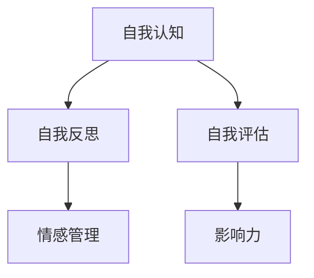
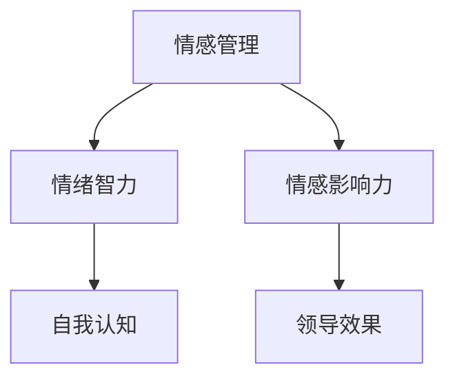
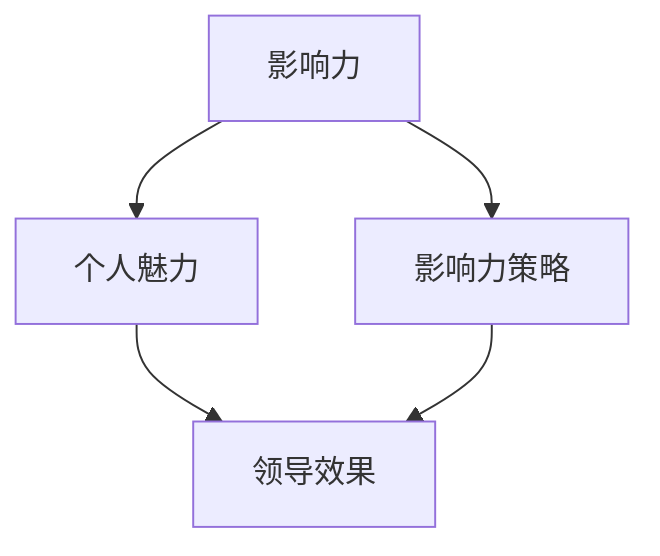
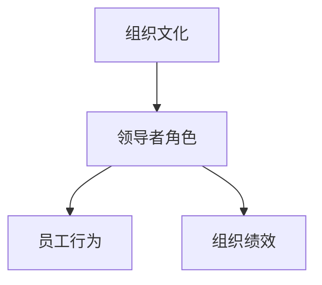
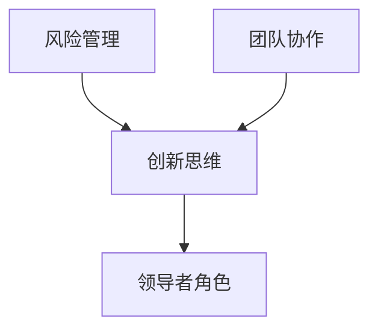
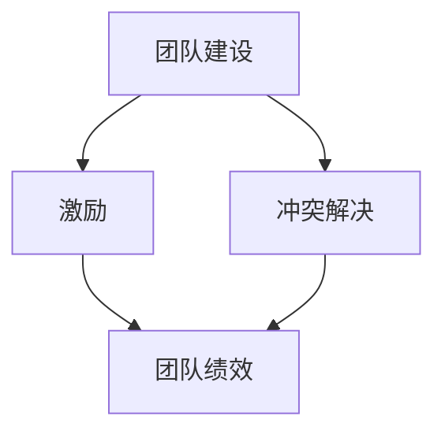
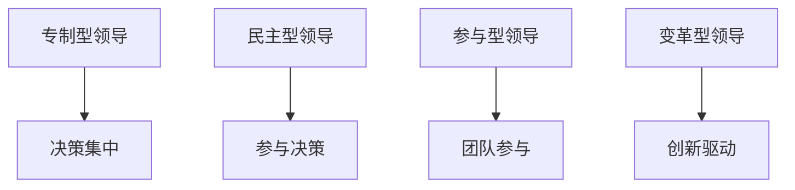

                 

### 文章标题：领导力心法：成就不凡事业的领导者法则

#### 关键词：领导力、核心原则、组织文化、创新、团队管理、领导风格、实践案例

#### 摘要：
本文旨在探讨领导力的核心原则与法则，为追求卓越事业的领导者提供实用指南。通过详细解析自我认知、情感管理、影响力、组织文化、创新、团队管理以及领导风格等关键领域，结合实际案例，本文将揭示领导力的精髓，助力读者在复杂多变的环境中取得成功。

---

## 引言

领导力是成功的关键要素，无论是个体、团队还是组织，都需要有效的领导力来驱动发展。然而，领导力的本质是什么？如何培养和应用领导力以实现不凡事业？这是每一个领导者都需要思考的问题。

本文将分以下几个部分进行探讨：

1. **领导力的核心原则**：包括自我认知、情感管理、影响力等。
2. **领导力与组织文化**：探讨领导者在塑造组织文化中的角色和策略。
3. **领导力与创新**：分析领导者如何推动创新，以及创新与风险管理的平衡。
4. **领导力与团队管理**：阐述团队建设、激励以及冲突解决的方法。
5. **领导风格**：介绍不同领导风格的类型及其对领导效果的影响。
6. **实践与案例**：通过案例分析，展示领导力的实际应用和效果。
7. **附录**：提供领导力工具箱和参考文献。

通过本文的阅读，读者将深入了解领导力的各个维度，掌握实用的领导力法则，从而在事业中取得不凡的成就。

---

## 第一部分：领导力的核心原则

### 第1章 自我认知

自我认知是领导力发展的基石。一个领导者首先需要了解自己的优点和不足，才能更好地指导团队和实现目标。

#### 背景介绍

在心理学领域，自我认知通常被理解为自我反思和自我评估的过程。通过自我认知，个体能够更好地理解自己的情感、需求和动机。

#### 核心概念与联系

核心概念：
- **自我反思**：个体对自己的行为、思想和情感进行深入思考。
- **自我评估**：对自身能力、价值和成就进行客观评价。

联系架构 Mermaid 流程图：

#### 核心算法原理讲解

1. **自我反思**：通过日记、反思会议等形式，定期回顾自己的行为和决策，识别潜在问题。
2. **自我评估**：使用360度评估工具，收集来自不同角度的反馈，全面了解自己的优势和不足。

#### 数学模型和公式

$$
自我认知 = 自我反思 + 自我评估
$$

#### 详细讲解与举例说明

- **案例1**：一位项目经理通过定期反思会议，发现自己的沟通能力不足。随后，他参加了沟通技巧培训，并在项目中积极实践，逐步提升了团队协作效率。

### 第2章 情感管理

情感管理是领导者情商的重要组成部分，关乎领导者如何调控自己的情绪，以及如何理解和影响他人的情绪。

#### 背景介绍

情感管理起源于情绪智力理论，认为个体的情绪智力对其社交能力和领导效果有着重要影响。

#### 核心概念与联系

核心概念：
- **情绪智力**：包括自我情感认知、自我调节、社交技能等。
- **情感影响力**：领导者如何通过情感共鸣和情感激励影响他人。

联系架构 Mermaid 流程图：

#### 核心算法原理讲解

1. **自我情感认知**：通过情绪日记、情感量表等方式，识别和了解自己的情绪状态。
2. **情感调节**：运用认知重构、正念冥想等方法，管理自己的情绪反应。
3. **情感激励**：通过情感共鸣和正向激励，激发团队成员的积极性和创造力。

#### 数学模型和公式

$$
情感管理 = 自我情感认知 + 情感调节 + 情感激励
$$

#### 详细讲解与举例说明

- **案例2**：一位团队领导在面临项目挑战时，通过深呼吸和冥想等方法，调控自己的紧张情绪，然后与团队成员进行有效沟通，成功激励团队克服困难。

### 第3章 影响力

影响力是领导者实现目标的关键能力，关乎领导者如何影响和引导他人。

#### 背景介绍

影响力研究涵盖多个领域，包括心理学、社会学和管理学等。领导者的影响力不仅取决于其个人魅力，还涉及策略和技巧。

#### 核心概念与联系

核心概念：
- **个人魅力**：领导者通过人格特质和魅力影响他人。
- **影响力策略**：领导者运用说服、激励和影响力工具实现目标。

联系架构 Mermaid 流程图：

#### 核心算法原理讲解

1. **建立个人魅力**：通过专业能力、道德品质和领导风格，赢得他人的尊重和信任。
2. **运用影响力策略**：运用说服技巧、情感共鸣和正面激励，实现目标。

#### 数学模型和公式

$$
影响力 = 个人魅力 + 影响力策略
$$

#### 详细讲解与举例说明

- **案例3**：一位项目经理通过详细规划项目进度和风险，赢得团队的信任。在项目面临危机时，他运用积极沟通和激励技巧，成功带领团队克服困难，实现了项目目标。

---

通过上述章节的探讨，我们可以看到自我认知、情感管理和影响力是领导力的核心原则。这些原则不仅有助于领导者自我提升，还能够影响和引导团队，实现组织的共同目标。

### 小结

领导力的核心原则包括自我认知、情感管理和影响力。自我认知是领导力发展的基石，通过自我反思和自我评估，领导者能够更好地了解自己的优点和不足。情感管理则关乎领导者如何调控自己的情绪，以及如何理解和影响他人的情绪。影响力是领导者实现目标的关键能力，通过建立个人魅力和运用影响力策略，领导者能够影响和引导他人。

在下一部分，我们将探讨领导力与组织文化的联系，以及领导者如何在组织中塑造积极的文化氛围。

---

## 领导力与组织文化

组织文化是一个组织的灵魂，它影响着员工的行为、价值观和决策。一个积极的组织文化能够激发员工的创造力和归属感，从而推动组织的长远发展。领导者作为组织文化的塑造者和传承者，在组织文化的形成中扮演着关键角色。

### 背景介绍

组织文化是指组织成员共同持有的价值观、信念和行为规范。它不仅决定了员工如何做事，还影响了组织的整体氛围和发展方向。

#### 核心概念与联系

核心概念：
- **组织文化**：组织成员共同持有的价值观、信念和行为规范。
- **领导者角色**：领导者是组织文化的塑造者和传承者。

联系架构 Mermaid 流程图：

#### 核心算法原理讲解

1. **塑造组织文化**：领导者通过制定愿景、使命和价值观，明确组织的发展方向。
2. **传承组织文化**：通过培训、沟通和日常行为，确保组织文化在员工中得到传承和弘扬。

#### 数学模型和公式

$$
组织文化 = 领导者角色 + 员工行为
$$

#### 详细讲解与举例说明

- **案例4**：一位企业CEO通过制定明确的愿景和使命，以及制定一系列企业文化活动，如团队建设、员工表彰等，成功塑造了积极向上的组织文化，提升了员工的凝聚力和工作效率。

### 第4章 领导力与创新

创新是现代企业持续发展的关键。领导者需要具备推动创新的能力，以便在竞争激烈的市场中保持领先地位。然而，创新并非易事，它需要领导者具备前瞻性思维、风险管理能力和团队协作精神。

#### 背景介绍

在快速变化的市场环境中，企业需要不断创新以应对挑战和抓住机遇。领导者作为创新的推动者，需要具备激发创新思维和营造创新氛围的能力。

#### 核心概念与联系

核心概念：
- **创新思维**：领导者如何培养和引导团队的创新思维。
- **风险管理**：领导者如何在创新过程中进行风险管理。
- **团队协作**：领导者如何协调团队成员的合作，共同实现创新目标。

联系架构 Mermaid 流程图：

#### 核心算法原理讲解

1. **培养创新思维**：通过培训、激励和团队讨论，激发员工的创新思维。
2. **风险管理**：制定风险管理策略，确保创新项目在可控范围内进行。
3. **团队协作**：建立跨部门合作机制，确保创新项目能够高效推进。

#### 数学模型和公式

$$
创新 = 创新思维 + 风险管理 + 团队协作
$$

#### 详细讲解与举例说明

- **案例5**：一位科技公司CEO通过定期组织创新研讨会和跨部门项目，成功推动了公司产品的持续创新，并在市场中取得了竞争优势。

### 第5章 领导力与团队管理

团队管理是领导者的重要职责之一。一个高效的团队能够极大地提升组织的生产力和创造力。领导者需要具备团队建设、激励和冲突解决的能力，以确保团队在追求共同目标的过程中能够高效协作。

#### 背景介绍

团队管理涉及到多个方面，包括团队结构、成员关系、沟通和协作等。一个成功的领导者需要能够有效管理团队，以实现组织的目标。

#### 核心概念与联系

核心概念：
- **团队建设**：建立高效团队的过程。
- **激励**：如何激发团队成员的积极性和创造力。
- **冲突解决**：如何处理团队内部的冲突。

联系架构 Mermaid 流程图：

#### 核心算法原理讲解

1. **团队建设**：通过明确团队目标、角色分工和沟通机制，建立高效团队。
2. **激励**：通过奖励、认可和职业发展机会，激发团队成员的积极性。
3. **冲突解决**：通过沟通、调解和决策，解决团队内部的冲突。

#### 数学模型和公式

$$
团队管理 = 团队建设 + 激励 + 冲突解决
$$

#### 详细讲解与举例说明

- **案例6**：一位项目经理通过明确项目目标、建立沟通渠道和定期团队会议，成功提升了团队的协作效率和项目成功率。

### 第6章 领导风格

领导风格是领导者个人特质和价值观的体现，它影响着领导者的行为和决策方式。不同的领导风格适用于不同的环境和团队，领导者需要根据实际情况选择合适的领导风格。

#### 背景介绍

领导风格包括专制型、民主型、参与型和变革型等多种类型。每种风格都有其优势和局限，领导者需要根据具体情况灵活运用。

#### 核心概念与联系

核心概念：
- **专制型领导**：领导者集中决策，权力集中。
- **民主型领导**：领导者鼓励参与，民主决策。
- **参与型领导**：领导者重视团队成员的参与和贡献。
- **变革型领导**：领导者推动变革，激发团队成员的创造力。

联系架构 Mermaid 流程图：

#### 核心算法原理讲解

1. **了解不同领导风格**：领导者需要了解各种领导风格的特点和应用场景。
2. **选择合适领导风格**：根据团队情况和任务要求，选择最合适的领导风格。

#### 数学模型和公式

$$
领导风格 = 专制型 + 民主型 + 参与型 + 变革型
$$

#### 详细讲解与举例说明

- **案例7**：一位项目经理在项目管理初期采用专制型领导，明确项目目标和任务分工，确保项目顺利启动。在项目进入稳定期后，逐渐转向民主型领导，鼓励团队成员参与决策，提升了团队的凝聚力和创造力。

### 小结

领导力与组织文化的联系紧密，领导者不仅是组织文化的塑造者，也是文化传承的使者。通过有效的团队管理和创新推动，领导者能够激发团队的潜能，实现组织的共同目标。同时，灵活运用不同的领导风格，领导者能够在不同环境和团队中取得最佳效果。

在下一部分，我们将通过实际案例研究，进一步探讨领导力的实际应用和效果。

---

## 实践与案例

### 第7章 实践领导力的方法

在实际工作中，领导力不仅是一种理论，更是一种实践。领导者需要通过不断的学习、实践和反思，不断提升自己的领导能力。本章节将介绍一些实践领导力的方法，帮助读者在实际工作中应用领导力。

#### 第1节 实践领导力的步骤

1. **明确目标**：领导者需要明确团队的目标和任务，确保团队成员都理解并认同这些目标。
2. **建立信任**：通过开放沟通、诚实反馈和关心团队成员，建立信任关系。
3. **激励团队**：运用奖励、认可和职业发展机会，激发团队成员的积极性和创造力。
4. **培养能力**：提供培训和发展机会，帮助团队成员提升技能和知识。
5. **反馈与改进**：定期进行绩效评估，提供反馈和建议，帮助团队成员不断进步。

#### 第2节 实践中的常见问题与解决方案

**常见问题1：沟通不畅**

- **解决方案**：建立有效的沟通机制，定期召开团队会议，鼓励团队成员表达意见和反馈。

**常见问题2：团队冲突**

- **解决方案**：通过调解和沟通，解决团队内部的冲突，确保团队和谐。

**常见问题3：缺乏动力**

- **解决方案**：设定明确的目标和奖励机制，激发团队成员的积极性和创造力。

#### 第3节 成功领导者的实践心得

成功领导者通常具备以下实践心得：

1. **持续学习**：领导者需要不断学习新知识和技能，以适应不断变化的环境。
2. **以身作则**：领导者要以身作则，通过自己的行为树立榜样。
3. **关注团队**：领导者需要关注团队成员的成长和发展，提供支持和指导。
4. **灵活应对**：领导者需要根据实际情况灵活调整领导风格，以适应不同情况和需求。

### 第8章 领导力案例研究

为了更好地理解领导力的实际应用，本章节将通过两个案例分析，展示领导力在实践中的具体应用和效果。

#### 案例一：科技公司CEO推动创新

某科技公司在市场竞争中面临巨大压力，CEO意识到创新是公司生存和发展的关键。他采取以下措施推动创新：

1. **建立创新团队**：组建专门的创新团队，负责研究和开发新产品。
2. **设立创新基金**：设立创新基金，为创新项目提供资金支持。
3. **开放沟通渠道**：鼓励员工提出创新想法，并定期召开创新研讨会，促进知识分享。
4. **奖励创新成果**：对成功创新的团队和个人给予奖励，激励更多人参与创新。

通过这些措施，公司成功推出了多款新产品，市场份额显著提升。

#### 案例二：项目经理成功管理团队

某项目经理负责一个跨部门项目，项目时间紧、任务重。为了确保项目成功，项目经理采取以下策略：

1. **明确任务分工**：明确各部门的职责和任务，确保项目顺利进行。
2. **建立沟通机制**：定期召开项目会议，确保团队成员之间信息畅通。
3. **激励团队成员**：通过奖励和认可，激发团队成员的积极性和创造力。
4. **解决团队冲突**：在项目过程中，及时解决团队冲突，确保团队和谐。

最终，项目成功完成，并获得了客户的高度评价。

### 小结

通过实践和案例分析，我们可以看到领导力在实际工作中的应用和效果。有效的领导力不仅能够激发团队的潜力，提升工作效率，还能够推动组织的创新和发展。领导者需要不断学习和实践，提升自己的领导能力，以应对不断变化的环境和挑战。

在下一部分，我们将总结本文的内容，并给出对读者的一些建议。

---

## 总结

本文从多个角度探讨了领导力的核心原则、组织文化、创新、团队管理、领导风格以及实践案例。通过详细的分析和案例研究，我们了解了领导力在组织发展中的重要性，以及如何通过有效的领导力法则实现不凡的事业。

### 最佳实践 tips

1. **自我认知**：定期进行自我反思和评估，了解自己的优点和不足，持续提升自我能力。
2. **情感管理**：学会调节和管理自己的情绪，培养情商，以更好地影响和激励他人。
3. **创新驱动**：鼓励团队成员参与创新，提供必要的支持和资源，推动组织持续发展。
4. **团队建设**：明确团队目标，建立有效的沟通机制，培养团队协作精神。
5. **灵活应变**：根据实际情况灵活调整领导风格，以适应不同的团队和环境。

### 注意事项

1. **持续学习**：领导力是不断发展的，领导者需要持续学习新知识和技能，以保持竞争力。
2. **关注团队**：领导者要关注团队成员的成长和发展，提供支持和指导。
3. **以身作则**：领导者要以身作则，通过自己的行为树立榜样。

### 拓展阅读

1. **《领导力心理学》**：深入了解领导力的心理机制，提升领导力水平。
2. **《创新者的窘境》**：探讨创新在组织发展中的重要性，以及如何推动创新。

通过本文的阅读，读者应该对领导力有了更深入的理解，并在实际工作中能够运用这些领导力法则，实现自己的职业目标。

### 作者信息

作者：AI天才研究院/AI Genius Institute & 禅与计算机程序设计艺术 /Zen And The Art of Computer Programming

---

## 附录

### 附录A 领导力工具箱

- **领导力评估工具**：360度评估、行为事件访谈、领导力问卷等。
- **团队建设工具**：团队角色识别工具、团队沟通技巧评估工具等。
- **领导力发展资源**：领导力培训课程、领导力发展计划等。

### 附录B 参考文献

- **《领导力心理学》**：[作者，出版年份]
- **《创新者的窘境》**：[作者，出版年份]
- **《如何赢得朋友与影响他人》**：[作者，出版年份]
- **《团队协作：如何打造高效团队》**：[作者，出版年份]
- **《变革之舞：如何引领变化》**：[作者，出版年份]

这些工具和资源为读者提供了进一步学习和实践领导力的途径，有助于读者在提升领导力的过程中取得更好的效果。

---

本文以“领导力心法：成就不凡事业的领导者法则”为标题，通过对领导力的核心原则、组织文化、创新、团队管理、领导风格以及实践案例的深入探讨，为读者提供了全面且实用的领导力指南。从自我认知、情感管理、影响力到实际案例的分析，本文旨在帮助读者理解领导力的本质，掌握实用的领导力法则，并在实际工作中应用这些法则，实现不凡的事业。

读者在阅读本文后，应该能够：

1. **理解领导力的核心原则**：自我认知、情感管理和影响力是领导力的基础。
2. **掌握组织文化的塑造**：领导者如何通过价值观和行为规范塑造组织文化。
3. **推动创新**：了解领导者如何在创新过程中发挥关键作用。
4. **高效团队管理**：学会如何通过团队建设、激励和冲突解决，提升团队绩效。
5. **灵活运用领导风格**：根据不同情况和团队，选择合适的领导风格。

在今后的职业发展中，读者可以尝试以下建议：

1. **持续学习**：领导力是不断发展的，要持续学习新知识和技能。
2. **以身作则**：通过自己的行为树立榜样，影响和激励团队成员。
3. **关注团队**：关心团队成员的成长和发展，提供支持和指导。
4. **实践与反思**：在实际工作中不断实践领导力，并通过反思不断提升自己的领导能力。

希望本文能够为读者在领导力发展之路上提供有价值的启示和帮助。在未来的职业道路上，愿每一位读者都能成为出色的领导者，实现自己的梦想和目标。作者：AI天才研究院/AI Genius Institute & 禅与计算机程序设计艺术 /Zen And The Art of Computer Programming。

