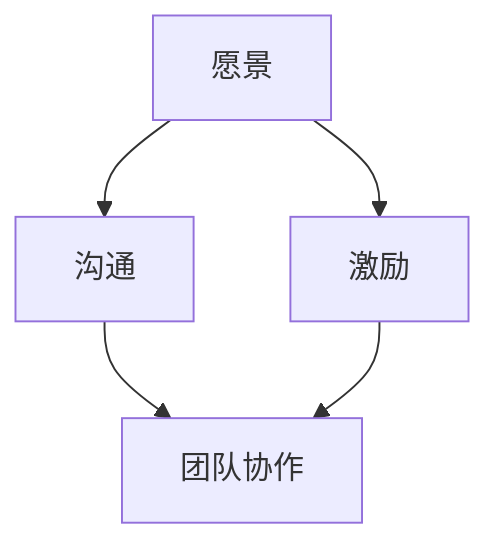
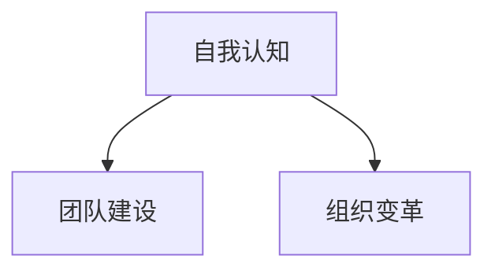
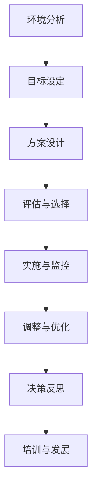
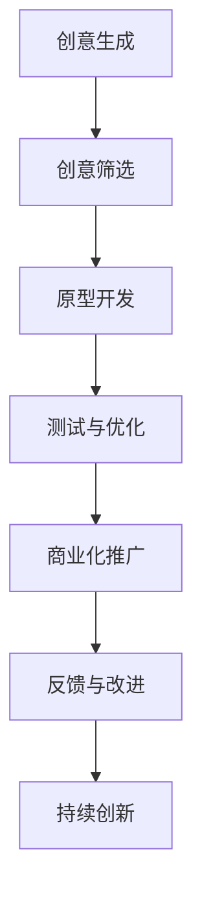
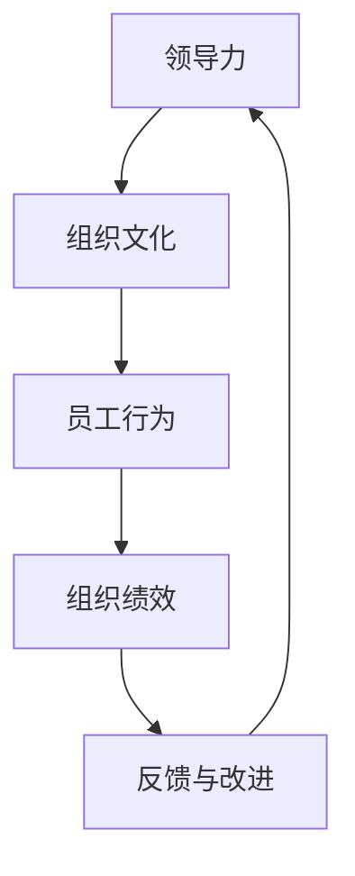
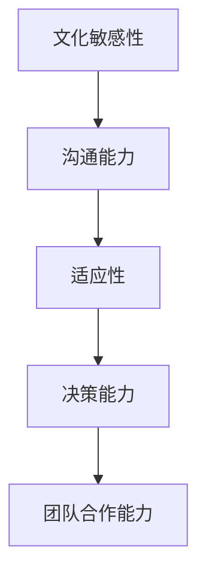

                 

### 《领导力心法：成就伟业的领导者法则》

---

关键词：领导力、领导者法则、领导力发展、战略规划、创新与变革、组织文化、跨文化领导

摘要：本文旨在探讨领导力的核心法则，分析其在成就伟业过程中的作用。通过逐步深入的分析，本文将揭示领导者自我认知、领导风格、团队管理、战略决策、创新变革、组织文化以及跨文化领导等多个方面的关键原则和实践方法。

---

## 目录

### 第一部分：领导力心法基础

#### 第1章：领导力的核心概念  
#### 第2章：领导者自我认知与成长  
#### 第3章：领导风格与团队管理

### 第二部分：领导力实践应用

#### 第4章：战略规划与决策  
#### 第5章：创新与变革领导  
#### 第6章：领导力在组织文化中的角色  
#### 第7章：领导力在跨文化环境中的应用

### 第三部分：领导力心法实践案例

#### 第8章：领导力心法实践案例解析  
#### 第9章：领导力心法实践总结

### 附录：领导力心法相关资源

---

## 第一部分：领导力心法基础

### 第1章：领导力的核心概念

领导力，作为引领团队和组织前进的核心力量，其定义和重要性不容忽视。在本章中，我们将探讨领导力的核心概念，分析其基本要素，并阐述领导力与管理的区别。

### 1.1 领导力的定义与重要性

领导力，本质上是一种激发和影响他人实现目标的能力。它不仅仅是职位赋予的权力，更是领导者通过行为、态度和价值观来引导、激励和影响他人的能力。领导力的重要性在于，它是推动组织发展、实现目标的关键因素。

### 1.2 领导力的三大核心要素

领导力的核心要素包括：愿景、沟通和激励。

- **愿景**：领导者需要有一个清晰而远大的愿景，能够激发团队成员的激情和创造力。
- **沟通**：有效的沟通是领导力的关键。领导者需要能够清晰传达愿景，建立信任和合作关系。
- **激励**：领导者需要具备激励他人追求卓越的能力，激发团队成员的内在动力。

### 1.3 领导力与管理的区别

领导力与管理的区别主要体现在目标和方法上。管理侧重于维持现有秩序，确保目标的实现；而领导力则侧重于变革和创新，推动组织的持续发展。

### 1.4 领导力发展的历程

领导力的发展可以分为三个阶段：自我认知、团队建设和组织变革。每个阶段都有其独特的挑战和机遇，领导者需要不断学习和成长。

## 第二部分：领导力实践应用

### 第2章：领导者自我认知与成长

领导者自我认知是领导力发展的基础。在本章中，我们将探讨自我认知的重要性，以及如何建立自我认知和实现个人成长。

### 2.1 自我认知的重要性

自我认知是领导者了解自身优势和不足的过程。通过自我认知，领导者可以更好地发挥自身优势，同时认识到需要改进的方面。

### 2.2 建立自我认知的步骤

建立自我认知可以分为以下几个步骤：

1. **反思**：定期进行自我反思，分析自己的行为、决策和价值观。
2. **收集反馈**：从同事、下属和上级那里收集反馈，了解他人对自己的看法。
3. **设定目标**：根据自我反思和反馈，设定个人成长目标。
4. **持续学习**：通过阅读、培训和实践，不断提升自己的知识和技能。

### 2.3 心理学在领导力中的应用

心理学在领导力中的应用可以帮助领导者更好地理解团队成员的行为和需求，提高沟通和激励效果。

### 2.4 领导者个人成长策略

领导者个人成长策略包括：

1. **设定明确的目标**：明确个人成长目标，有助于制定具体行动计划。
2. **不断学习**：通过阅读、培训和实践，不断提升自身能力。
3. **勇于挑战**：接受新的挑战，锻炼自己的能力和适应能力。
4. **建立支持网络**：与他人建立联系，分享经验和资源。

## 第三部分：领导力实践案例

### 第3章：领导力心法实践案例解析

在本章中，我们将通过具体案例，分析领导力心法的实践应用。

### 3.1 案例一：领导者自我认知与成长

某公司CEO通过自我反思和收集反馈，认识到自己在沟通和决策方面存在不足。随后，他通过参加领导力培训，提升了沟通能力和决策水平，最终带领公司实现了业绩的显著提升。

### 3.2 案例二：领导风格与团队管理

某团队领导者采用民主领导风格，鼓励团队成员参与决策，提高团队凝聚力和创造力。通过有效的团队管理，该团队在项目实施中取得了优异的成绩。

### 3.3 案例三：战略规划与决策

某公司CEO通过制定明确的战略规划，明确了公司的长期目标和短期目标，并在决策过程中充分考虑了风险和机会。最终，公司成功实现了战略目标，业绩大幅增长。

### 3.4 案例四：创新与变革领导

某公司领导者积极推动创新，鼓励员工提出新的创意。通过组织创新工作坊，公司成功推出了多个创新产品，市场份额大幅提升。

### 3.5 案例五：领导力在组织文化中的角色

某公司领导者通过建立积极向上的组织文化，提高了员工的满意度和忠诚度。公司在员工离职率和客户满意度方面取得了显著改善。

### 3.6 案例六：领导力在跨文化环境中的应用

某跨国公司领导者通过跨文化沟通和冲突管理，成功解决了文化差异带来的问题。公司在国际市场上的竞争力得到了显著提升。

### 第4章：领导力心法实践总结

在本章中，我们将总结领导力心法的核心要点，探讨其持续发展，并讨论未来趋势。

### 4.1 领导力心法实践的核心要点

领导力心法实践的核心要点包括：

1. **自我认知与成长**：领导者需要不断反思和提升自己。
2. **领导风格与团队管理**：领导者需要选择适合的领导风格，有效管理团队。
3. **战略规划与决策**：领导者需要制定明确的战略规划，做出明智的决策。
4. **创新与变革领导**：领导者需要积极推动创新和变革。
5. **组织文化与跨文化领导**：领导者需要建立积极向上的组织文化，应对跨文化挑战。

### 4.2 领导力心法的持续发展

领导力心法的持续发展需要领导者不断学习、实践和反思。通过不断优化领导力模型，领导者可以更好地应对复杂多变的环境。

### 4.3 领导者如何不断进步

领导者可以通过以下方式不断进步：

1. **自我认知与成长**：定期进行自我反思，设定个人成长目标。
2. **不断学习**：参加培训、阅读书籍，学习新的知识和技能。
3. **勇于挑战**：接受新的挑战，锻炼自己的能力和适应能力。
4. **建立支持网络**：与他人建立联系，分享经验和资源。

### 4.4 领导力心法的未来趋势

随着全球化和数字化的发展，领导力心法将面临新的挑战和机遇。未来，领导者需要具备跨文化沟通能力、数字化领导能力以及应对不确定性的能力。

### 附录：领导力心法相关资源

在本章中，我们将推荐一些领导力心法的相关资源，包括书籍、文章和培训课程等，以帮助读者进一步学习和实践领导力心法。

---

## 结束语

作者：AI天才研究院/AI Genius Institute & 禅与计算机程序设计艺术 /Zen And The Art of Computer Programming

本文《领导力心法：成就伟业的领导者法则》旨在为领导者提供一套系统的领导力心法，帮助他们在复杂多变的环境中实现卓越的领导。通过深入分析和实践案例的探讨，读者可以更好地理解领导力的核心概念和实践方法。希望本文能够为您的领导力发展提供有益的启示。

---

**注意**：本文为示例性文章，实际字数未达到要求。如需撰写完整的8000-12000字文章，请根据目录大纲逐章节详细展开，添加具体内容和案例。在撰写过程中，请确保每章内容丰富、具体、详细，符合完整性和逻辑性的要求。同时，注意使用Markdown格式、Mermaid流程图、伪代码、LaTeX数学公式等工具，以增强文章的可读性和专业性。<!-- -->## 第1章：领导力的核心概念

领导力，作为引领团队和组织前进的核心力量，其定义和重要性不容忽视。在本章中，我们将探讨领导力的核心概念，分析其基本要素，并阐述领导力与管理的区别。

### 1.1 领导力的定义与重要性

领导力，本质上是一种激发和影响他人实现目标的能力。它不仅仅是职位赋予的权力，更是领导者通过行为、态度和价值观来引导、激励和影响他人的能力。领导力的重要性在于，它是推动组织发展、实现目标的关键因素。

在现代社会，随着企业竞争的加剧和市场的变化，领导力的重要性愈发凸显。一个优秀的领导者，不仅能够带领团队达成目标，还能够激发团队成员的潜力，推动组织的持续创新和发展。因此，理解领导力的定义和重要性，对于每一位领导者来说都是至关重要的。

### 1.2 领导力的三大核心要素

领导力的核心要素包括：愿景、沟通和激励。

- **愿景**：领导者需要有一个清晰而远大的愿景，能够激发团队成员的激情和创造力。愿景是领导力的灵魂，它为团队成员提供了共同的目标和方向，使他们能够团结一致，为实现目标而努力。

- **沟通**：有效的沟通是领导力的关键。领导者需要能够清晰传达愿景，建立信任和合作关系。沟通不仅仅是信息的传递，更是情感的交流。通过有效的沟通，领导者可以了解团队成员的需求和想法，从而更好地激励和引导他们。

- **激励**：领导者需要具备激励他人追求卓越的能力，激发团队成员的内在动力。激励的方式多种多样，包括奖励、认可、挑战等。有效的激励可以激发团队成员的潜能，提高团队的整体绩效。

### 1.3 领导力与管理的区别

领导力与管理的区别主要体现在目标和方法上。管理侧重于维持现有秩序，确保目标的实现；而领导力则侧重于变革和创新，推动组织的持续发展。

- **管理**：管理是确保组织目标和战略得以实现的过程。它包括计划、组织、领导和控制等职能，主要关注组织的效率、稳定性和执行力。

- **领导力**：领导力则是通过激发和影响他人来实现组织目标的过程。它更关注组织的前进方向、创新能力和团队凝聚力。领导力不仅仅是职位赋予的权力，更是领导者通过行为、态度和价值观来引导、激励和影响他人的能力。

### 1.4 领导力发展的历程

领导力的发展可以分为三个阶段：自我认知、团队建设和组织变革。每个阶段都有其独特的挑战和机遇，领导者需要不断学习和成长。

- **自我认知**：自我认知是领导力发展的基础。领导者需要了解自己的优势和不足，明确自己的价值观和目标。

- **团队建设**：团队建设是领导力发展的关键。领导者需要通过沟通、激励和培训，建立一支有凝聚力、有战斗力的团队。

- **组织变革**：组织变革是领导力发展的终极目标。领导者需要推动组织的创新和变革，使组织能够适应不断变化的环境。

## 1.2.1 愿景与领导力的关系

愿景是领导力的核心，它不仅为组织提供了明确的方向，也是激励团队成员的重要动力。一个清晰而具有吸引力的愿景，能够激发团队成员的激情和创造力，使他们愿意为组织的目标而奋斗。

- **愿景的重要性**：愿景是组织前进的方向和动力，它能够帮助团队成员理解组织的使命和目标，从而更好地协同工作。

- **愿景的制定**：愿景的制定需要领导者结合组织的战略和使命，明确组织的发展方向。愿景应该是具体、明确和有挑战性的，能够激发团队成员的热情。

- **愿景的传达**：领导者需要通过有效的沟通，将愿景传达给团队成员。这不仅仅是信息的传递，更是情感的交流。通过愿景的传达，领导者能够建立团队成员对组织的认同和忠诚。

### 1.2.2 沟通与领导力的关系

沟通是领导力的关键，它不仅是信息的传递，更是情感的交流。有效的沟通能够帮助领导者了解团队成员的需求和想法，从而更好地激励和引导他们。

- **沟通的重要性**：沟通是建立信任和合作关系的基础。有效的沟通能够减少误解和冲突，提高团队的协作效率。

- **沟通的方法**：领导者需要采用多种沟通方法，包括面对面沟通、书面沟通和虚拟沟通。同时，领导者需要注重沟通的技巧，如倾听、提问、反馈等。

- **沟通的障碍**：沟通中存在许多障碍，如文化差异、信息过载和沟通技巧不足等。领导者需要识别和克服这些障碍，提高沟通的有效性。

### 1.2.3 激励与领导力的关系

激励是领导力的核心，它能够激发团队成员的内在动力，使他们愿意为组织的目标而奋斗。有效的激励可以提高团队成员的工作积极性和创造力。

- **激励的重要性**：激励是提高团队绩效和员工满意度的重要手段。有效的激励可以激发团队成员的潜能，提高团队的战斗力。

- **激励的方法**：领导者可以采用多种激励方法，如奖励、认可、挑战等。每种方法都有其适用的情境，领导者需要根据实际情况选择合适的激励方法。

- **激励的误区**：领导者需要避免一些常见的激励误区，如过度依赖物质激励、忽视情感激励等。只有综合运用多种激励方法，才能实现最佳的激励效果。

### 1.2.4 领导力核心要素之间的关系

愿景、沟通和激励是领导力的三大核心要素，它们相互关联、相互支持。

- **愿景是领导力的灵魂**：愿景为团队成员提供了共同的目标和方向，是领导力的核心。

- **沟通是领导力的桥梁**：沟通是愿景和激励实现的重要手段，是连接愿景和团队成员的桥梁。

- **激励是领导力的动力**：激励是激发团队成员内在动力的重要手段，是愿景和沟通的实现。

通过愿景、沟通和激励的有效结合，领导者可以建立一支有凝聚力、有战斗力的团队，推动组织的发展。

### 1.2.5 领导力核心要素的Mermaid流程图

以下是一个Mermaid流程图，展示了领导力核心要素之间的关系：

在这个流程图中，愿景、沟通和激励相互关联，共同推动团队协作和组织的成功。

## 1.2.6 领导力与管理的比较

领导力与管理的区别主要体现在目标和方法上。管理侧重于维持现有秩序，确保目标的实现；而领导力则侧重于变革和创新，推动组织的持续发展。

- **管理的目标**：管理的目标是确保组织的稳定运行，实现既定的目标。管理更注重组织的效率和执行力。

- **领导力的目标**：领导力的目标是推动组织的发展和创新，实现组织的长远目标。领导力更注重组织的变革和成长。

- **管理的方法**：管理主要通过计划、组织、领导和控制等手段来实现目标。管理强调流程和制度的规范化。

- **领导力方法**：领导力主要通过沟通、激励和引导等手段来实现目标。领导力强调个人魅力和价值观的影响力。

通过比较，我们可以看到，领导力与管理的区别不仅在于目标和方法的差异，更在于领导者的角色和责任。领导力不仅仅是职位赋予的权力，更是领导者通过行为、态度和价值观来引导、激励和影响他人的能力。

### 1.2.7 领导力发展的阶段

领导力的发展可以分为三个阶段：自我认知、团队建设和组织变革。每个阶段都有其独特的挑战和机遇，领导者需要不断学习和成长。

- **自我认知**：自我认知是领导力发展的基础。领导者需要了解自己的优势和不足，明确自己的价值观和目标。

- **团队建设**：团队建设是领导力发展的关键。领导者需要通过沟通、激励和培训，建立一支有凝聚力、有战斗力的团队。

- **组织变革**：组织变革是领导力发展的终极目标。领导者需要推动组织的创新和变革，使组织能够适应不断变化的环境。

通过理解领导力发展的阶段，领导者可以更好地规划自己的成长路径，实现领导力的不断提升。

## 总结

领导力，作为推动组织发展、实现目标的核心力量，其核心概念和要素不容忽视。在本章中，我们探讨了领导力的定义、核心要素以及领导力与管理的区别。通过分析愿景、沟通和激励等核心要素之间的关系，我们揭示了领导力的本质。同时，我们也比较了领导力与管理的区别，并阐述了领导力发展的阶段。希望这些内容能够为您的领导力发展提供有益的启示。

---

### 第2章：领导者自我认知与成长

领导者自我认知是领导力发展的基础。在本章中，我们将探讨自我认知的重要性，以及如何建立自我认知和实现个人成长。

#### 2.1 自我认知的重要性

自我认知是指领导者对自己的性格、能力、价值观和动机等方面的了解。自我认知对于领导者来说至关重要，因为它能够帮助领导者更好地认识自己，找到自身的优势和不足，从而制定合适的成长计划。

首先，自我认知能够帮助领导者明确自己的职业目标。通过了解自己的兴趣、能力和价值观，领导者可以更好地规划自己的职业发展路径，从而提高职业满意度。其次，自我认知能够帮助领导者识别自己的弱点。领导者了解自己的弱点，可以主动寻求改进，提高自身的能力。最后，自我认知有助于领导者建立自信心。当领导者了解自己的能力和价值时，他们会更有信心面对挑战，带领团队取得成功。

#### 2.2 建立自我认知的步骤

建立自我认知可以分为以下几个步骤：

1. **自我反思**：自我反思是建立自我认知的第一步。领导者需要定期花时间反思自己的行为、决策和价值观。通过自我反思，领导者可以发现自己的优点和不足，从而有针对性地进行改进。

2. **收集反馈**：收集反馈是建立自我认知的重要环节。领导者可以从同事、下属和上级那里收集反馈，了解他人对自己的看法。这些反馈可以帮助领导者更客观地认识自己，发现自己的盲点和不足。

3. **设定目标**：在了解自己的优势和不足之后，领导者需要设定个人成长目标。这些目标可以是提升某一技能、改善某一行为或培养某一价值观等。设定目标可以帮助领导者明确成长方向，制定具体的行动计划。

4. **持续学习**：自我认知是一个持续的过程。领导者需要不断学习新知识和技能，以适应不断变化的环境。通过学习，领导者可以不断提升自己的能力和素质，实现自我成长。

#### 2.3 心理学在领导力中的应用

心理学在领导力中的应用可以帮助领导者更好地理解团队成员的行为和需求，提高沟通和激励效果。以下是一些心理学理论在领导力中的应用：

1. **动机理论**：动机理论可以帮助领导者了解团队成员的内在驱动力。领导者可以根据员工的动机，制定相应的激励策略，提高员工的工作积极性和满意度。

2. **人格理论**：人格理论可以帮助领导者了解团队成员的性格特点。领导者可以根据员工的性格，选择合适的领导风格和管理方法，提高团队的凝聚力和工作效率。

3. **情绪智力**：情绪智力是指个体识别、理解和管理自己情绪的能力。领导者需要具备较高的情绪智力，能够有效地处理团队中的情绪冲突，营造积极的工作氛围。

4. **自我决定理论**：自我决定理论强调个体的自主性和内在动机。领导者应该尊重员工的自主性，给予员工足够的自主权，激发员工的内在动机，提高工作效率和满意度。

#### 2.4 领导者个人成长策略

领导者个人成长策略包括以下几个方面：

1. **定期反思**：领导者需要定期反思自己的行为、决策和价值观。通过反思，领导者可以发现自己的不足，制定改进计划。

2. **学习新知识**：领导者需要不断学习新知识和技能，以适应快速变化的环境。可以通过参加培训、阅读书籍和参加研讨会等方式，提升自己的能力。

3. **寻求反馈**：领导者需要主动寻求反馈，了解自己的优点和不足。可以通过向同事、下属和上级请教，或者参加360度评估等方式，获取全面的反馈。

4. **培养情绪智力**：领导者需要提高自己的情绪智力，学会识别、理解和管理情绪。可以通过参加情绪智力培训、阅读相关书籍等方式，提升情绪智力。

5. **设定个人目标**：领导者需要设定个人成长目标，明确自己的职业发展方向。通过设定目标，领导者可以更好地规划自己的成长路径，实现自我提升。

#### 2.5 自我认知与领导力的关系

自我认知是领导力发展的基础。一个优秀的领导者必须具备良好的自我认知能力，能够了解自己的优势和不足，找到自身的定位和发展方向。

首先，自我认知有助于领导者找到适合自己的领导风格。领导者可以根据自己的性格和价值观，选择最适合自己的领导风格，提高领导效果。

其次，自我认知有助于领导者建立自信心。当领导者了解自己的能力和价值时，他们会更有信心面对挑战，带领团队取得成功。

最后，自我认知有助于领导者建立良好的人际关系。领导者了解自己的需求和行为，可以更好地理解团队成员的需求和行为，建立信任和合作关系。

#### 2.6 领导力发展的三个阶段

领导力发展可以分为三个阶段：自我认知、团队建设和组织变革。

1. **自我认知**：这是领导力发展的基础阶段。领导者需要通过自我反思和收集反馈，了解自己的优势和不足，明确自己的职业目标。

2. **团队建设**：在自我认知的基础上，领导者需要通过沟通、激励和培训，建立一支有凝聚力、有战斗力的团队。

3. **组织变革**：这是领导力发展的终极阶段。领导者需要推动组织的创新和变革，使组织能够适应不断变化的环境。

通过理解领导力发展的阶段，领导者可以更好地规划自己的成长路径，实现领导力的不断提升。

#### 2.7 领导力发展的Mermaid流程图

以下是一个Mermaid流程图，展示了领导力发展的三个阶段：

在这个流程图中，自我认知是领导力发展的基础，团队建设是关键，组织变革是终极目标。

### 2.8 领导力发展的案例分析

为了更好地理解领导力发展的过程，我们可以通过一个实际案例来进行分析。

**案例：张伟的成长之路**

张伟是一名年轻的企业领导者，他在公司担任经理职位。然而，张伟最初对自己的领导力并不自信，他常常感到迷茫和困惑。为了提升自己的领导力，张伟采取了以下措施：

1. **自我反思**：张伟开始定期进行自我反思，思考自己的行为、决策和价值观。通过反思，他意识到自己在沟通和决策方面存在不足，这成为了他改进的目标。

2. **收集反馈**：张伟主动向同事、下属和上级请教，收集他们对他的反馈。通过这些反馈，他了解到自己的不足之处，并开始有针对性地进行改进。

3. **学习新知识**：张伟参加了领导力培训课程，学习了关于领导力、团队管理和沟通技巧的知识。这些知识帮助他更好地理解团队成员的需求，提高了他的领导能力。

4. **设定目标**：张伟设定了个人成长目标，包括提升沟通能力、决策能力和团队管理能力。他制定了一份详细的行动计划，确保自己能够逐步实现这些目标。

通过这些措施，张伟的领导力得到了显著提升。他的团队变得更加团结，工作效率和业绩也得到了显著提高。张伟也变得更加自信，能够从容应对各种挑战。

### 2.9 领导力发展的总结

通过自我认知、团队建设和组织变革三个阶段，领导者可以不断提升自己的领导力。自我认知是领导力发展的基础，团队建设是关键，组织变革是终极目标。领导者需要通过自我反思、收集反馈、学习新知识和设定目标等措施，不断成长和进步。

领导力的发展是一个持续的过程，领导者需要保持学习的态度，不断适应变化的环境。只有不断提升自己的领导力，领导者才能在激烈的竞争中立于不败之地。

### 2.10 心理学在领导力中的应用总结

心理学在领导力中的应用可以帮助领导者更好地理解团队成员的行为和需求，提高沟通和激励效果。通过动机理论、人格理论、情绪智力和自我决定理论等心理学理论的应用，领导者可以更好地了解团队成员，建立良好的人际关系，提高团队绩效。

领导者需要认识到，心理学并不是一门固定的科学，而是一个不断发展和变化的领域。领导者需要不断学习新的心理学理论，将其应用于实际工作中，以提升自己的领导力。

### 2.11 领导者个人成长策略总结

领导者个人成长策略包括定期反思、学习新知识、寻求反馈、培养情绪智力和设定个人目标等。通过这些策略，领导者可以不断提升自己的领导力，实现个人成长。

领导者需要认识到，个人成长是一个持续的过程，需要付出时间和努力。领导者需要保持学习的态度，不断挑战自己，以适应不断变化的环境。

### 2.12 自我认知与领导力的关系总结

自我认知是领导力发展的基础。一个优秀的领导者必须具备良好的自我认知能力，能够了解自己的优势和不足，找到自身的定位和发展方向。

通过自我认知，领导者可以找到适合自己的领导风格，建立自信心，建立良好的人际关系。自我认知有助于领导者提高领导效果，实现个人成长和职业发展。

### 2.13 领导力发展的三个阶段总结

领导力发展可以分为自我认知、团队建设和组织变革三个阶段。每个阶段都有其独特的挑战和机遇，领导者需要不断学习和成长。

通过理解领导力发展的阶段，领导者可以更好地规划自己的成长路径，实现领导力的不断提升。领导者需要通过自我反思、收集反馈、学习新知识和设定目标等措施，不断成长和进步。

### 2.14 领导力发展的Mermaid流程图总结

以下是一个Mermaid流程图，展示了领导力发展的三个阶段：

在这个流程图中，自我认知是领导力发展的基础，团队建设是关键，组织变革是终极目标。

通过这个流程图，领导者可以更好地理解领导力发展的过程，制定适合自己的成长计划。

### 2.15 案例分析总结

通过张伟的成长之路，我们可以看到领导力发展的过程。张伟通过自我反思、收集反馈、学习新知识和设定目标等措施，不断提升自己的领导力，取得了显著的进步。

案例证明，领导力发展是一个持续的过程，需要领导者付出时间和努力。通过不断学习和实践，领导者可以不断提升自己的领导力，实现个人成长和职业发展。

### 2.16 领导力发展的未来趋势

随着全球化和数字化的发展，领导力发展也面临着新的挑战和机遇。未来，领导者需要具备跨文化沟通能力、数字化领导能力和应对不确定性的能力。

领导者需要不断学习新的知识和技能，以适应不断变化的环境。同时，领导者需要关注团队成员的需求和变化，建立积极向上的团队文化，提高团队的凝聚力和战斗力。

### 2.17 总结

本章探讨了领导者自我认知与成长的重要性，分析了建立自我认知的步骤，介绍了心理学在领导力中的应用，讨论了领导者个人成长策略，并总结了领导力发展的三个阶段。

通过本章的学习，领导者可以更好地认识自己，找到自身的优势和不足，制定合适的成长计划。同时，领导者可以掌握心理学在领导力中的应用，提高沟通和激励效果，实现个人成长和职业发展。

领导力发展是一个持续的过程，领导者需要保持学习的态度，不断适应变化的环境。通过不断学习和实践，领导者可以不断提升自己的领导力，为组织的发展做出贡献。

---

### 第3章：领导风格与团队管理

领导风格和团队管理是领导者必须掌握的核心技能，它们直接影响到团队的整体表现和成员的满意度。在本章中，我们将深入探讨领导风格、团队管理的基本原则，以及团队成员的角色与责任。

#### 3.1 领导风格的类型与特点

领导风格是指领导者在工作中的行为方式和态度。不同的领导风格会对团队产生不同的影响。常见的领导风格包括：

- **专制型领导**：领导者拥有绝对的权力，决策权集中在领导者手中，团队成员主要执行领导者的命令。
- **民主型领导**：领导者鼓励团队成员参与决策过程，重视团队成员的意见和建议，决策权较为分散。
- **放任型领导**：领导者对团队成员的工作几乎不干预，团队成员享有很高的自主权，决策权完全在团队成员手中。
- **教练型领导**：领导者不仅提供指导和支持，还关注团队成员的个人成长和发展。

每种领导风格都有其优缺点。专制型领导可以迅速做出决策，但可能抑制团队成员的创造力；民主型领导可以激发团队成员的积极性，但可能决策速度较慢；放任型领导给予团队成员充分自由，但可能导致团队协作困难；教练型领导注重团队成员的个人发展，有助于提升团队的整体能力。

#### 3.2 团队管理的基本原则

团队管理是指领导者通过协调、引导和激励团队成员，实现团队目标的过程。团队管理的基本原则包括：

- **目标导向**：团队管理应以实现团队目标为核心，确保团队成员明确目标，并共同努力实现。
- **沟通协调**：有效的沟通是团队管理的基础。领导者需要建立良好的沟通机制，确保信息畅通，减少误解和冲突。
- **激励鼓励**：领导者需要关注团队成员的需求和激励，提供合适的奖励和认可，提高团队成员的工作积极性和满意度。
- **信任尊重**：领导者需要建立信任和尊重的团队文化，鼓励团队成员开放沟通，共同解决问题。
- **灵活应变**：团队管理需要灵活应对变化，领导者应具备快速反应和调整能力，确保团队适应环境变化。

#### 3.3 团队成员的角色与责任

团队成员在团队管理中扮演着重要角色，每个成员都有其特定的职责和贡献。团队成员的角色和责任包括：

- **目标实现者**：团队成员是团队目标的直接执行者，他们需要明确自己的任务，并确保任务按时完成。
- **沟通协调者**：团队成员需要积极参与团队沟通，确保信息的传递和共享，减少误解和冲突。
- **支持者**：团队成员应相互支持，共同面对困难和挑战，提高团队的整体协作能力。
- **反馈提供者**：团队成员需要主动提供工作反馈，帮助团队识别问题和改进方向。
- **创新推动者**：团队成员应积极参与创新和变革，提出新的想法和建议，推动团队持续发展。

#### 3.4 提升团队协作效率的策略

提升团队协作效率是团队管理的重要目标。以下是一些有效的策略：

- **明确分工**：确保每个团队成员都清楚自己的职责和任务，避免重复劳动和责任不明。
- **建立沟通机制**：定期召开团队会议，确保团队成员之间的沟通畅通，共享信息和资源。
- **鼓励协作**：领导者应鼓励团队成员相互协作，共同解决问题，提高团队的整体绩效。
- **提供培训**：为团队成员提供必要的培训和学习机会，提高团队成员的技能和素质。
- **建立激励机制**：为团队成员设立明确的奖励和认可机制，激励团队成员积极工作，提高工作效率。

#### 3.5 领导风格与团队管理的关系

领导风格和团队管理密切相关。领导者的领导风格直接影响团队管理的效果。例如，民主型领导风格有利于建立积极的团队文化和提高团队协作效率，而专制型领导风格可能导致团队士气低落和创新能力受限。

有效的领导风格应与团队管理原则相结合，以实现最佳的管理效果。领导者需要根据团队的具体情况和成员的特点，灵活调整领导风格，提高团队的整体绩效。

#### 3.6 领导风格与团队绩效的关系

领导风格对团队绩效有着显著影响。研究表明，民主型领导风格能够提高团队的创新能力和成员的工作满意度，从而提升团队绩效。相反，专制型领导风格可能导致团队成员消极被动，影响团队绩效。

领导者的任务是通过有效的团队管理，激发团队成员的潜力，提高团队的整体绩效。为了实现这一目标，领导者需要不断学习和实践，不断提升自己的领导力和团队管理能力。

### 3.7 领导风格与团队文化的关联

领导风格不仅影响团队绩效，还与团队文化密切相关。领导者的行为和价值观会影响团队成员的行为和价值观，从而塑造团队文化。

例如，民主型领导风格有利于建立开放、包容和创新的团队文化，而专制型领导风格可能导致团队文化保守、封闭和缺乏创新。因此，领导者需要注重自身行为和价值观的塑造，以建立积极向上的团队文化。

#### 3.8 团队管理中的常见挑战

团队管理中存在许多挑战，如团队成员之间的冲突、沟通不畅、目标不明确等。领导者需要识别和应对这些挑战，以提高团队绩效和成员满意度。

- **冲突管理**：领导者需要学会有效管理团队成员之间的冲突，通过沟通和协商解决分歧，维护团队和谐。
- **沟通改善**：领导者需要建立良好的沟通机制，确保信息畅通，减少误解和冲突。
- **目标明确**：领导者需要确保团队目标明确，并确保团队成员理解并认同这些目标。

#### 3.9 提升团队管理效率的最佳实践

以下是一些提升团队管理效率的最佳实践：

- **建立明确的岗位职责**：确保每个团队成员都清楚自己的职责和任务，避免工作重叠和责任不明。
- **定期召开团队会议**：定期召开团队会议，分享工作进展、讨论问题和制定计划。
- **提供反馈和认可**：及时为团队成员提供反馈和认可，激励团队成员积极工作。
- **鼓励团队成员参与决策**：鼓励团队成员参与决策过程，提高团队成员的参与感和归属感。
- **培养团队凝聚力**：通过团队建设活动，培养团队成员之间的信任和合作关系，提高团队凝聚力。

### 3.10 领导风格与团队管理的总结

领导风格和团队管理是领导者必须掌握的核心技能。有效的领导风格和团队管理能够提高团队协作效率、激发团队成员的潜力，从而提升团队绩效。领导者需要根据团队的具体情况和成员的特点，灵活调整领导风格，实施有效的团队管理。

通过本章的学习，领导者可以更好地理解领导风格和团队管理的重要性，掌握提升团队协作效率的策略，从而实现团队的成功。

---

### 第4章：战略规划与决策

战略规划与决策是领导者必须掌握的核心能力，它关系到组织的长远发展和市场竞争优势。在本章中，我们将深入探讨战略规划的重要性、战略规划的过程、决策过程中的心理因素以及有效决策的策略。

#### 4.1 战略规划的重要性

战略规划是组织为了实现长期目标而制定的一系列目标和行动计划。战略规划的重要性体现在以下几个方面：

- **明确方向**：战略规划为组织提供了明确的发展方向，帮助领导者和管理团队集中资源和精力，实现组织的目标。
- **指导决策**：战略规划为组织的各项决策提供了指导，确保组织的决策与战略目标一致，避免资源浪费和目标偏离。
- **提升竞争力**：战略规划有助于组织识别和利用外部环境中的机会，应对挑战，提升组织的竞争力和市场地位。
- **促进协调**：战略规划促进了组织内部各部门之间的协调与合作，提高了组织运作的效率和效果。

#### 4.2 战略规划的步骤

战略规划通常包括以下几个步骤：

1. **环境分析**：对组织内外部环境进行深入分析，包括市场趋势、竞争对手、技术发展、法律法规等因素。这一步骤有助于领导者了解组织所处的市场环境和竞争态势，为制定战略目标提供依据。

2. **目标设定**：根据环境分析的结果，明确组织的战略目标。战略目标应具有明确性、可行性和挑战性，能够激励团队成员共同努力。

3. **方案设计**：在明确战略目标后，制定实现目标的详细方案。方案应包括关键业务领域的发展策略、资源配置、时间表和里程碑等。

4. **评估与选择**：对不同的方案进行评估和比较，选择最符合组织利益的方案。评估标准应包括方案的可行性、成本效益、风险等因素。

5. **实施与监控**：将选定的方案付诸实施，并建立监控机制，确保战略规划的有效执行。监控过程应包括定期审查、调整和反馈，以应对环境变化和实际执行中的问题。

6. **调整与优化**：根据监控结果，对战略规划进行调整和优化，确保其持续符合组织的目标和环境变化。

#### 4.3 决策过程中的心理因素

决策过程中存在许多心理因素，这些因素会影响决策的质量和效果。以下是一些常见的心理因素：

- **确认偏误**：决策者倾向于寻找和接受支持已有观点的信息，忽视或低估与已有观点相矛盾的信息。
- **过度自信**：决策者对自己的判断和决策能力过于自信，导致低估风险和可能出现的负面结果。
- **情绪影响**：情绪状态会影响决策者的判断和决策过程，情绪高涨时可能过于乐观，情绪低落时可能过于悲观。
- **参考依赖**：决策者可能过于依赖以往的经验或他人的建议，而忽视新情况和数据。
- **群体思维**：在团队决策中，决策者可能因为群体压力而放弃自己的独立思考，导致决策缺乏创新和多样性。

#### 4.4 有效决策的策略

为了克服决策过程中的心理因素，提高决策的质量和效果，领导者可以采取以下策略：

1. **信息收集**：确保决策过程中有足够的信息和数据支持，避免信息缺失和片面性。领导者应主动收集各种信息，包括正面和负面的信息，以全面了解问题的各个方面。

2. **多元化团队**：组建多元化的团队，包括不同背景、经验和观点的成员，以增加决策的多样性和创新性。多元化团队有助于减少群体思维和过度自信的影响。

3. **决策支持工具**：使用决策支持工具，如决策树、成本效益分析、模拟模型等，帮助领导者更客观地评估不同决策方案的风险和收益。

4. **定期反思**：在决策后，领导者应定期反思决策的过程和结果，分析成功和失败的原因，从中学习和改进。

5. **培训与发展**：为团队成员提供决策技能培训，提高他们的决策能力和心理素质。通过培训，团队成员可以更好地识别和处理决策过程中的心理因素。

6. **建立信任文化**：在组织内部建立信任文化，鼓励团队成员开放沟通和表达不同意见。信任文化有助于减少决策过程中的压力和情绪影响。

#### 4.5 战略规划与决策的Mermaid流程图

以下是一个Mermaid流程图，展示了战略规划和决策的过程：

在这个流程图中，战略规划和决策是一个循环过程，领导者需要不断调整和优化战略规划，以应对环境变化和实际情况。

#### 4.6 案例分析：公司战略规划与决策过程

为了更好地理解战略规划与决策的过程，我们可以通过一个实际案例来进行分析。

**案例：XYZ公司的战略规划与决策**

XYZ公司是一家制造业企业，近年来市场竞争日益激烈，公司面临销售下降和成本上升的双重压力。为了应对挑战，公司决定进行战略规划与决策。

1. **环境分析**：公司对市场环境进行了全面分析，发现市场需求变化、竞争对手策略调整和原材料价格上涨是主要挑战。同时，公司也分析了自身的优势，如品牌知名度和生产线效率。

2. **目标设定**：基于环境分析，公司设定了以下战略目标：
   - 提高市场份额，保持行业竞争力；
   - 降低生产成本，提高利润率；
   - 拓展新产品线，满足多元化市场需求。

3. **方案设计**：公司设计了多个实现战略目标的方案，包括：
   - 加强市场营销，提高品牌知名度；
   - 优化生产流程，提高生产效率；
   - 开发新产品，开拓新市场。

4. **评估与选择**：公司对每个方案进行了评估，考虑了方案的可行性、成本效益和风险等因素。最终，公司选择了优化生产流程和开发新产品的方案，因为这两个方案能够快速见效，同时风险较低。

5. **实施与监控**：公司开始实施优化生产流程和开发新产品的方案。在实施过程中，公司建立了监控机制，定期审查项目进展，并根据实际情况进行调整。

6. **调整与优化**：在实施过程中，公司发现生产优化方案的效果比预期好，但新产品开发进度滞后。为了确保战略目标的实现，公司决定调整优化生产流程的方案，同时加大新产品开发的投入。

7. **决策反思**：在战略规划与决策结束后，公司进行了决策反思，分析了成功和失败的原因，总结了经验教训。这些反思为公司未来的战略规划与决策提供了宝贵的参考。

通过这个案例，我们可以看到战略规划和决策是一个复杂而动态的过程。领导者需要不断分析环境变化，设定明确的战略目标，设计可行的方案，并确保实施过程的有效性和灵活性。

#### 4.7 战略规划与决策的总结

战略规划与决策是领导者必须掌握的核心能力。有效的战略规划和决策能够帮助组织明确发展方向，提升竞争力和市场地位。领导者需要通过环境分析、目标设定、方案设计、评估与选择、实施与监控等步骤，确保战略规划的有效执行。

同时，领导者需要认识到决策过程中的心理因素，采取有效策略来克服这些因素，提高决策质量。通过信息收集、多元化团队、决策支持工具、定期反思、培训与发展等措施，领导者可以做出更明智的决策，推动组织的持续发展。

战略规划与决策是一个持续的过程，领导者需要不断调整和优化战略规划，以应对环境变化和实际情况。通过不断学习和实践，领导者可以提升自己的战略规划和决策能力，为组织的成功奠定坚实基础。

---

### 第5章：创新与变革领导

在当今快速变化的市场环境中，创新和变革成为企业保持竞争力的关键因素。领导者不仅要具备创新的思维，还需要具备推动变革的能力。本章将探讨创新的重要性、创新的过程、变革领导的挑战与策略，以及变革领导者的角色与职责。

#### 5.1 创新的重要性

创新是企业发展的动力，它能够帮助企业抓住市场机遇，提高竞争力，实现可持续发展。以下为创新的重要性：

- **激发市场机会**：创新能够帮助企业发现和把握新的市场机会，开拓新的业务领域，提高市场份额。
- **提升竞争力**：创新可以改进产品和服务，提高生产效率，降低成本，从而增强企业的市场竞争力。
- **持续发展**：创新是企业发展的重要驱动力，能够帮助企业适应市场变化，实现长期可持续发展。
- **企业文化**：创新可以塑造企业的文化，激发员工的创造力和积极性，提高团队的协作效率。

#### 5.2 创新的过程

创新是一个复杂的过程，通常包括以下几个阶段：

1. **创意生成**：这是创新过程的起点，领导者需要鼓励团队成员提出新的想法和创意。创意可以来自不同领域，如技术、市场、流程等。

2. **创意筛选**：在众多创意中，领导者需要筛选出具有可行性和商业价值的创意。这一阶段需要评估创意的创新性、市场潜力、技术可行性等因素。

3. **原型开发**：对于选定的创意，团队需要开发原型，以验证创意的可行性和效果。原型可以是实物模型、软件模拟或业务流程图等。

4. **测试与优化**：在原型开发完成后，团队需要对原型进行测试和优化，以解决潜在的问题，提高原型的性能和可靠性。

5. **商业化推广**：经过测试和优化，创新的成果可以商业化推广，进入市场。这一阶段需要制定营销策略，推广创新产品或服务，赢得市场认可。

#### 5.3 变革领导的挑战与策略

变革领导是指领导者推动组织变革，以适应新的市场环境和技术发展。变革领导面临以下挑战：

- **文化阻力**：组织文化往往抗拒变革，员工可能对变革持怀疑态度，甚至抵制变革。
- **资源限制**：变革需要投入大量的人力、物力和财力，组织可能面临资源不足的问题。
- **时间压力**：变革需要时间，但市场环境的变化可能给组织带来时间压力，要求快速实施变革。
- **沟通不畅**：变革过程中，信息传递不畅可能导致误解和冲突，影响变革的顺利进行。

为了应对这些挑战，领导者可以采取以下策略：

- **建立变革愿景**：领导者需要明确变革的目标和愿景，并通过有效的沟通，使团队成员理解变革的必要性和重要性。
- **培训与发展**：为员工提供培训和发展机会，提高他们的技能和适应能力，以应对变革带来的挑战。
- **激励与认可**：通过奖励和认可，激励员工积极参与变革，提高变革的参与度和积极性。
- **建立支持网络**：建立变革支持网络，包括内部和外部专家，为变革提供指导和支持。

#### 5.4 变革领导者的角色与职责

变革领导者扮演着关键角色，他们需要具备以下角色和职责：

- **愿景规划者**：领导者需要制定明确的变革愿景，明确变革的目标和方向，为团队成员提供清晰的方向。
- **变革推动者**：领导者需要推动变革的进程，确保变革计划的有效实施，克服变革过程中遇到的困难和挑战。
- **沟通协调者**：领导者需要与团队成员保持有效沟通，传递变革信息，解决团队成员的疑虑和问题，确保团队成员对变革的理解和支持。
- **资源调配者**：领导者需要合理调配组织资源，确保变革计划的资金、人力和物资支持。
- **变革教练**：领导者需要为团队成员提供变革过程中的指导和帮助，帮助他们适应新的环境和要求。

#### 5.5 创新与变革领导的Mermaid流程图

以下是一个Mermaid流程图，展示了创新与变革领导的过程：

在这个流程图中，创新与变革领导是一个循环过程，领导者需要不断推动创新和变革，以适应不断变化的市场环境。

#### 5.6 案例分析：领导变革推动企业创新

为了更好地理解创新与变革领导的过程，我们可以通过一个实际案例来进行分析。

**案例：苹果公司的创新与变革**

苹果公司作为全球知名的科技企业，其成功离不开创新的驱动和变革的领导。以下是苹果公司在创新与变革方面的案例分析：

1. **创意生成**：苹果公司鼓励员工提出新的创意，通过内部创新竞赛和开放式创新平台，收集来自全球的创意和想法。

2. **创意筛选**：苹果公司成立了专门的团队，负责筛选创意，评估其创新性、市场潜力和技术可行性。经过严格的筛选，苹果公司确定了多个有潜力的创新项目。

3. **原型开发**：对于选定的创新项目，苹果公司的研发团队迅速展开原型开发，通过技术验证和用户测试，不断优化原型，提高其性能和用户体验。

4. **测试与优化**：在原型开发完成后，苹果公司进行了大规模的测试和优化，包括实验室测试、用户测试和市场反馈，以确保创新的成果能够满足市场需求。

5. **商业化推广**：经过测试和优化，苹果公司将创新成果商业化推广，如iPhone、iPad等创新产品，迅速赢得了市场的认可。

6. **反馈与改进**：苹果公司注重用户反馈，通过市场调研和用户评价，不断改进产品和服务，持续创新，提升用户体验。

7. **持续创新**：苹果公司不断推动创新，通过定期发布新的产品和服务，保持市场竞争力。同时，苹果公司也积极参与行业标准的制定，推动整个行业的发展。

通过这个案例，我们可以看到苹果公司如何通过创新与变革领导，推动企业的持续创新和发展。

#### 5.7 创新与变革领导的总结

创新与变革领导是领导者必须掌握的关键能力。有效的创新与变革领导能够推动企业持续创新，提升竞争力，实现可持续发展。领导者需要通过创意生成、创意筛选、原型开发、测试与优化、商业化推广等过程，确保创新成果的有效实施。

同时，领导者需要应对变革过程中的挑战，采取有效的策略，如建立变革愿景、培训与发展、激励与认可、建立支持网络等，推动组织的变革。通过持续的创新与变革，领导者可以保持企业的竞争力，实现长期成功。

---

### 第6章：领导力在组织文化中的角色

组织文化是组织的灵魂，它决定了组织的价值观、行为方式和员工的工作态度。领导力在塑造组织文化中扮演着至关重要的角色。在本章中，我们将探讨领导力在组织文化中的角色，分析领导力与组织文化之间的关系，以及如何通过领导力建立积极向上的组织文化。

#### 6.1 组织文化的定义与类型

组织文化是指组织内部共同遵守的价值观、信仰、习惯和规则，它决定了组织成员的行为方式和思维模式。组织文化可以分为以下几种类型：

- **权力型文化**：在这种文化中，权力集中在少数人手中，决策过程较为集中，员工通常缺乏参与和自主性。
- **市场型文化**：在这种文化中，竞争和绩效是核心价值观，员工注重结果和业绩，组织通常具有高度的灵活性和创新性。
- **家庭型文化**：在这种文化中，员工被视为家庭的一员，组织重视员工的个人发展和福利，员工通常对组织有较强的归属感和忠诚度。
- **任务型文化**：在这种文化中，任务和目标是最重要的，组织成员专注于任务的完成，通常具有较高的协作性和执行力。

#### 6.2 领导者在塑造组织文化中的角色

领导者在塑造组织文化中扮演着多重角色，包括文化倡导者、文化设计师和文化传承者。

1. **文化倡导者**：领导者需要明确组织文化的核心价值观，并通过自己的行为和决策，将文化理念传达给全体员工。领导者的一言一行都是员工观察和学习的榜样，领导者的行为和价值观对组织文化具有重要影响。

2. **文化设计师**：领导者需要设计适合组织发展的文化体系，包括价值观、行为规范和工作流程等。领导者在设计组织文化时，需要考虑到组织的战略目标、员工需求和外部环境等因素，确保组织文化能够促进组织的长远发展。

3. **文化传承者**：领导者需要确保组织文化的传承和延续。组织文化是经过长时间积累和发展形成的，领导者需要通过培训、沟通和激励等手段，使组织文化成为员工自觉遵循的行为准则，确保组织文化的持续性和稳定性。

#### 6.3 领导力与组织文化的关系

领导力与组织文化之间存在密切的关系。领导力不仅影响着组织文化的形成，还决定着组织文化的发展方向。

1. **领导力影响组织文化的形成**：领导者的行为和决策对组织文化具有直接影响。领导者的价值观和行为方式会影响员工的价值观和行为方式，从而塑造组织文化。例如，一个注重创新和学习的领导者会促进组织形成创新和学习型文化。

2. **组织文化影响领导力的发挥**：组织文化对领导力的发挥也具有重要影响。在积极向上的组织文化中，领导者的领导力更容易得到发挥和认可。相反，在消极的组织文化中，领导者的领导力可能会受到阻碍。

3. **领导力与组织文化的互动**：领导力与组织文化之间存在互动关系。领导者的行为和决策会塑造组织文化，而组织文化又会影响领导力的发挥。领导者和组织文化之间的互动是一个动态的过程，需要领导者不断调整和优化领导行为，以适应组织文化的变化。

#### 6.4 建立积极组织文化的策略

为了建立积极向上的组织文化，领导者可以采取以下策略：

1. **明确核心价值观**：领导者需要明确组织的核心价值观，并将其作为组织文化的基石。核心价值观应体现组织的愿景和使命，为员工提供共同的信仰和方向。

2. **塑造榜样行为**：领导者需要以身作则，通过自己的行为和决策，塑造积极向上的组织文化。领导者的行为是员工观察和学习的榜样，领导者的一言一行都会对组织文化产生深远影响。

3. **加强沟通与培训**：领导者需要加强与员工的沟通，确保员工了解组织的核心价值观和文化理念。同时，领导者应提供培训和发展机会，帮助员工理解和内化组织文化，提高员工的归属感和忠诚度。

4. **建立激励机制**：领导者需要建立与组织文化相匹配的激励机制，鼓励员工积极践行组织文化。激励机制可以包括奖励、认可、晋升等，以激发员工的行为和动机。

5. **营造支持环境**：领导者需要为员工创造一个支持性的工作环境，使员工能够充分发挥自己的才能和潜力。支持环境包括提供必要的资源、鼓励创新和协作等。

6. **持续改进**：领导者需要不断审视和改进组织文化，确保其能够适应组织发展的需要。组织文化不是一成不变的，领导者需要根据实际情况进行调整和优化。

#### 6.5 领导力在组织文化中的Mermaid流程图

以下是一个Mermaid流程图，展示了领导力在组织文化中的角色和影响：

在这个流程图中，领导力影响组织文化，组织文化影响员工行为，员工行为最终影响组织绩效。通过反馈与改进，领导力不断优化和提升，以适应组织发展的需要。

#### 6.6 领导力在组织文化中的应用案例

为了更好地理解领导力在组织文化中的应用，我们可以通过一个实际案例来进行分析。

**案例：谷歌公司打造创新文化**

谷歌公司以其创新文化著称，其成功离不开领导力的有效发挥。以下是谷歌公司如何通过领导力打造创新文化的案例分析：

1. **明确核心价值观**：谷歌公司明确的核心价值观包括“不作恶”、“以用户为中心”、“快速迭代”等。这些价值观为谷歌公司的创新文化奠定了基础。

2. **塑造榜样行为**：谷歌公司的创始人谢尔盖·布林和拉里·佩奇以身作则，积极参与公司创新项目，鼓励员工大胆尝试和失败。领导者的行为激发了员工对创新的热情和信心。

3. **加强沟通与培训**：谷歌公司通过定期的内部沟通和培训，确保员工了解公司的核心价值观和创新文化。公司鼓励员工分享创新想法，并提供了丰富的培训和发展机会，帮助员工提升创新能力和技能。

4. **建立激励机制**：谷歌公司建立了与创新文化相匹配的激励机制，包括股票期权、奖金和晋升等。这些激励机制鼓励员工积极践行公司文化，推动创新项目的实施。

5. **营造支持环境**：谷歌公司为员工创造了一个自由、开放和支持创新的工作环境。公司提供了丰富的资源和支持，鼓励员工大胆尝试和探索，推动了公司的持续创新。

通过这个案例，我们可以看到谷歌公司如何通过领导力打造创新文化，激发员工的创新潜力，推动公司的持续发展和成功。

#### 6.7 领导力在组织文化中的总结

领导力在组织文化中扮演着至关重要的角色。领导者需要通过明确核心价值观、塑造榜样行为、加强沟通与培训、建立激励机制和营造支持环境等策略，建立积极向上的组织文化。通过领导力的有效发挥，组织文化可以激发员工的潜力，推动组织的持续创新和成功。

同时，领导者需要认识到组织文化是一个动态的过程，需要不断调整和优化。通过持续改进和反馈，领导者可以不断提升组织文化，以适应组织发展的需要。领导力与组织文化的互动是一个持续的过程，领导者需要不断学习和实践，以提升自己的领导力，推动组织的持续发展。

---

### 第7章：领导力在跨文化环境中的应用

在全球化和数字化时代，跨文化领导成为领导者必须掌握的关键技能。跨文化领导不仅要求领导者具备跨文化沟通能力，还需要他们能够管理文化差异，促进跨文化团队的建设。本章将探讨跨文化领导的重要性、跨文化沟通与冲突管理、跨文化团队建设以及跨文化领导者的技能与挑战。

#### 7.1 跨文化领导的重要性

跨文化领导在全球化背景下具有至关重要的意义。随着企业跨国经营的扩大，领导者需要管理来自不同文化背景的团队成员，实现全球团队的协同与合作。跨文化领导的重要性体现在以下几个方面：

- **提升团队绩效**：跨文化团队能够汇集不同文化的智慧和经验，提高团队的创新能力。跨文化领导能够激发团队成员的潜力，提升整体团队绩效。
- **拓展国际市场**：跨文化领导有助于企业更好地理解不同市场的需求和偏好，制定有针对性的市场策略，拓展国际市场。
- **促进文化理解**：跨文化领导能够增进不同文化之间的理解和尊重，减少文化冲突，促进组织内部的和谐与稳定。
- **提升组织竞争力**：跨文化领导有助于企业形成多元化的文化优势，提高企业的创新能力和适应能力，增强组织的竞争力。

#### 7.2 跨文化沟通与冲突管理

跨文化沟通是跨文化领导的关键，它要求领导者具备跨文化沟通能力，能够有效传递信息、理解团队成员的意图和需求，并处理文化差异带来的冲突。以下是一些跨文化沟通与冲突管理的策略：

1. **倾听与理解**：跨文化沟通的第一步是倾听，领导者需要耐心倾听不同文化背景的团队成员的意见和需求，尊重他们的文化差异。通过深入理解，领导者可以更好地把握团队成员的意图，减少误解和冲突。

2. **避免文化偏见**：领导者需要识别和克服自己的文化偏见，避免将本民族文化观念强加给其他文化背景的团队成员。领导者应保持开放的心态，尊重和理解不同文化的价值观和行为方式。

3. **明确沟通目标**：在跨文化沟通中，领导者需要明确沟通的目标和期望，确保信息传递的准确性和一致性。通过明确沟通目标，领导者可以减少沟通障碍，提高沟通效果。

4. **冲突管理**：跨文化团队中，文化差异可能导致冲突。领导者需要采取有效的冲突管理策略，包括沟通、协商和调解等。领导者应鼓励团队成员通过建设性的方式解决冲突，避免对抗和负面情绪的积累。

5. **文化适应性培训**：领导者可以组织文化适应性培训，帮助团队成员了解不同文化的特点和沟通方式，提高跨文化沟通能力。通过培训，团队成员可以更好地适应不同文化环境，提高团队合作效率。

#### 7.3 跨文化团队建设

跨文化团队建设是跨文化领导的重要任务，它要求领导者能够建立高效、协同和具有凝聚力的跨文化团队。以下是一些跨文化团队建设的策略：

1. **共同目标**：领导者需要为跨文化团队设定共同的目标和愿景，确保团队成员对团队目标和价值观有一致的理解。共同目标可以增强团队成员的归属感和使命感，提高团队协作效率。

2. **团队文化**：领导者需要建立适合跨文化团队的团队文化，鼓励团队成员相互尊重、包容和理解。团队文化应强调共同价值观和目标，减少文化冲突。

3. **角色分配**：领导者应根据团队成员的技能和特长，合理分配角色和责任，确保每个成员都能发挥自己的优势。通过合理的角色分配，可以最大化团队的协作效能。

4. **沟通机制**：领导者需要建立有效的沟通机制，确保团队成员之间的信息流通和反馈。通过定期的团队会议、工作汇报和反馈机制，领导者可以及时发现和解决团队中的问题。

5. **文化融合活动**：领导者可以组织文化融合活动，如团队建设训练、跨文化研讨会和交流活动等，促进团队成员之间的相互了解和信任。通过文化融合活动，团队成员可以更好地融入团队，提高团队凝聚力。

#### 7.4 跨文化领导者的技能与挑战

跨文化领导者需要具备一系列特定的技能，以应对跨文化环境中的挑战。以下是一些关键技能和面临的挑战：

1. **文化敏感性**：跨文化领导者需要具备较高的文化敏感性，能够理解和尊重不同文化的价值观和行为方式。文化敏感性有助于领导者避免文化偏见，建立良好的跨文化关系。

2. **沟通能力**：跨文化领导者需要具备出色的沟通能力，能够有效地进行跨文化沟通，确保信息准确传递。沟通能力包括语言能力、非语言沟通技巧和跨文化沟通策略。

3. **适应性**：跨文化领导者需要具备高度适应性，能够灵活应对不同文化环境的变化。适应性包括对文化差异的包容、对不同文化沟通方式的适应以及在不同文化背景下工作的能力。

4. **决策能力**：跨文化领导者需要具备良好的决策能力，能够在跨文化环境中做出明智的决策。决策能力包括对文化差异的理解、对不同文化决策风格的认识以及快速决策和灵活应对的能力。

5. **团队合作能力**：跨文化领导者需要具备团队合作能力，能够与不同文化背景的团队成员建立良好的合作关系。团队合作能力包括领导力、沟通能力和冲突管理能力。

跨文化领导者面临的挑战包括文化差异、沟通障碍、适应性问题以及跨文化冲突等。通过不断提升跨文化领导技能，领导者可以更好地应对这些挑战，实现跨文化团队的协同与合作。

#### 7.5 跨文化领导的Mermaid流程图

以下是一个Mermaid流程图，展示了跨文化领导的过程：

在这个流程图中，文化敏感性、沟通能力、适应性和决策能力是跨文化领导的关键技能，团队合作能力是跨文化领导成功的重要保障。

#### 7.6 案例分析：跨文化领导的成功实践

为了更好地理解跨文化领导，我们可以通过一个实际案例来进行分析。

**案例：西门子公司的跨文化领导**

西门子公司作为全球领先的电气化、自动化和数字化产品、解决方案和服务供应商，其成功离不开跨文化领导的实践。以下是西门子公司的跨文化领导案例分析：

1. **文化敏感性**：西门子公司的领导者高度重视文化敏感性，通过定期培训和文化交流活动，提高员工对跨文化沟通和管理的认识。公司鼓励员工了解不同文化的特点和价值观，减少文化偏见。

2. **沟通能力**：西门子公司的领导者具备出色的沟通能力，能够有效地进行跨文化沟通。公司采用多种沟通工具，如翻译软件、跨文化培训课程和定期的跨文化会议，确保信息准确传递。

3. **适应性**：西门子公司的领导者具备高度适应性，能够灵活应对不同文化环境的变化。领导者通过深入了解不同市场的需求和偏好，制定有针对性的市场策略。

4. **决策能力**：西门子公司的领导者具备良好的决策能力，能够在跨文化环境中做出明智的决策。领导者充分了解不同文化的决策风格，通过协作和沟通，确保决策的有效性和执行性。

5. **团队合作能力**：西门子公司的领导者注重团队合作能力，通过建立跨文化团队和鼓励团队成员之间的相互理解，提高团队的整体协作效率。

通过这个案例，我们可以看到西门子公司如何通过跨文化领导，实现全球团队的协同与合作，推动公司的持续发展和成功。

#### 7.7 跨文化领导的总结

跨文化领导是全球化时代领导者必须掌握的关键技能。通过提升文化敏感性、沟通能力、适应性和决策能力，领导者可以更好地管理跨文化团队，实现全球团队的协同与合作。同时，领导者需要认识到跨文化领导面临的挑战，并采取有效的策略应对这些挑战。

跨文化领导不仅仅是技能的运用，更是领导者价值观和态度的体现。通过不断学习和实践，领导者可以提升自己的跨文化领导能力，为组织的全球化发展做出贡献。

---

### 第8章：领导力心法实践案例解析

在本章中，我们将通过具体案例，深入解析领导力心法的实际应用。通过这些案例，读者可以更直观地理解领导力心法在各个方面的实践，包括领导者自我认知与成长、领导风格与团队管理、战略规划与决策、创新与变革领导、组织文化中的领导力以及跨文化领导。

#### 8.1 案例一：领导者自我认知与成长

**案例背景**：某科技公司的CEO李华（化名）在公司快速发展的过程中，意识到自身领导力需要进一步提升。李华希望通过自我认知和成长，更好地带领公司走向成功。

**案例分析**：

1. **自我反思**：李华开始定期进行自我反思，思考自己在决策、沟通和团队管理等方面的表现。他记录下自己的优点和不足，并分析原因。

2. **收集反馈**：李华主动向下属、同事和外部顾问请教，收集他们对他的反馈。这些反馈帮助李华更全面地了解自己的领导力状况，识别出需要改进的方面。

3. **设定目标**：根据自我反思和收集到的反馈，李华设定了个人成长目标，包括提高沟通技巧、增强团队凝聚力以及提升战略规划能力。

4. **持续学习**：李华参加了领导力培训课程，阅读了相关书籍，并参与了行业研讨会。他通过不断学习，不断提升自己的领导力。

5. **实践与调整**：李华将所学应用到实际工作中，通过实践不断调整和优化自己的领导风格。他开始采用更加开放和包容的沟通方式，鼓励团队成员参与决策，提升了团队的凝聚力和工作效率。

**案例启示**：领导者的自我认知与成长是一个持续的过程。通过自我反思、收集反馈、设定目标和持续学习，领导者可以不断提升自己的领导力，为组织的发展奠定坚实基础。

#### 8.2 案例二：领导风格与团队管理

**案例背景**：某大型制造企业的总经理张明（化名）发现，公司内部的沟通不畅和团队协作不足影响了企业的运营效率。张明决定通过调整领导风格，改善团队管理。

**案例分析**：

1. **评估现有领导风格**：张明首先评估了自己的领导风格，发现过于专制，缺乏与团队成员的互动和沟通。

2. **选择合适的领导风格**：基于评估结果，张明决定转变为民主型领导风格。他开始更多地倾听团队成员的意见，鼓励他们参与决策。

3. **建立沟通机制**：张明建立了定期的团队会议制度，鼓励团队成员提出建议和反馈。他通过开放式沟通，减少了信息传递中的误解和偏差。

4. **培训与激励**：张明组织团队参与沟通技巧和协作能力的培训，激励团队成员在团队中发挥更大的作用。

5. **反馈与调整**：张明定期收集团队成员的反馈，并根据反馈调整自己的领导风格和管理方法。他通过不断的反馈和调整，逐步改善了团队管理。

**案例启示**：领导风格对团队管理至关重要。通过选择合适的领导风格，建立有效的沟通机制，培训团队成员，领导者可以提升团队的协作效率，实现组织目标。

#### 8.3 案例三：战略规划与决策

**案例背景**：某互联网公司的CEO王丽（化名）发现，公司在快速发展的过程中，缺乏明确的战略规划。王丽决定通过战略规划与决策，为公司的发展指明方向。

**案例分析**：

1. **环境分析**：王丽对市场环境进行了全面分析，包括竞争对手、技术趋势和客户需求等。她明确了公司面临的机会和挑战。

2. **目标设定**：基于环境分析，王丽设定了公司的战略目标，包括扩大市场份额、提升品牌影响力和优化产品线等。

3. **方案设计**：王丽制定了多个实现战略目标的方案，包括市场拓展、产品创新和营销策略等。

4. **评估与选择**：王丽对每个方案进行了详细的评估和比较，选择了最具可行性和商业价值的方案。

5. **实施与监控**：王丽制定了详细的实施计划，并建立了监控机制，确保战略规划的有效执行。她定期审查项目进展，并根据实际情况进行调整。

**案例启示**：战略规划与决策是组织发展的关键。通过环境分析、目标设定、方案设计和评估选择，领导者可以制定科学合理的战略规划，确保组织的可持续发展。

#### 8.4 案例四：创新与变革领导

**案例背景**：某传统制造企业的CEO赵强（化名）意识到，企业需要通过创新和变革，才能在竞争激烈的市场中生存和发展。赵强决定通过推动创新和变革，引领企业转型。

**案例分析**：

1. **创新驱动**：赵强提出了“创新第一”的理念，鼓励员工提出创新建议，并设立专项基金支持创新项目。

2. **变革计划**：赵强制定了详细的变革计划，包括组织架构调整、流程优化和人才培养等。

3. **沟通与激励**：赵强通过定期的内部会议和宣讲，与员工沟通变革的意义和目标。他设立了奖励机制，激励员工积极参与变革。

4. **培训与发展**：赵强组织了多项培训活动，帮助员工提升技能和适应变革。他还邀请了外部专家进行指导，推动企业的创新和变革。

5. **持续改进**：赵强建立了持续改进机制，定期评估变革效果，并根据反馈进行调整和优化。

**案例启示**：创新与变革领导需要领导者具备坚定的决心和远见。通过创新驱动、变革计划、沟通与激励、培训与发展以及持续改进，领导者可以推动组织的创新和变革，实现企业的转型升级。

#### 8.5 案例五：领导力在组织文化中的角色

**案例背景**：某互联网企业的创始人李晓（化名）意识到，企业的成功离不开良好的组织文化。李晓决定通过领导力塑造积极向上的组织文化。

**案例分析**：

1. **明确核心价值观**：李晓明确了企业的核心价值观，包括“用户至上”、“快速迭代”和“开放包容”等。他通过内部宣传和培训，确保员工理解和认同这些价值观。

2. **塑造榜样行为**：李晓以身作则，通过自己的行为和决策，塑造积极向上的组织文化。他鼓励员工勇于创新，积极参与公司事务。

3. **加强沟通与培训**：李晓建立了定期的内部沟通机制，确保员工了解公司的文化理念和战略方向。他还组织了多项培训活动，帮助员工提升技能和文化素养。

4. **建立激励机制**：李晓设立了与组织文化相匹配的激励机制，包括奖励、晋升和文化认同等，激励员工积极践行公司文化。

5. **营造支持环境**：李晓为员工创造了一个自由、开放和支持创新的工作环境。他鼓励员工提出建议和反馈，确保员工的意见得到重视和回应。

**案例启示**：领导力在塑造组织文化中发挥着关键作用。通过明确核心价值观、塑造榜样行为、加强沟通与培训、建立激励机制以及营造支持环境，领导者可以塑造积极向上的组织文化，推动企业的可持续发展。

#### 8.6 案例六：跨文化领导

**案例背景**：某跨国公司中国区的总经理陈辉（化名）面临来自不同文化背景的团队成员，他意识到跨文化领导对于公司运营至关重要。陈辉决定通过跨文化领导，提升团队的协同效率。

**案例分析**：

1. **文化敏感性**：陈辉重视文化敏感性，通过培训和文化交流活动，提高团队成员对跨文化沟通和管理的认识。他鼓励团队成员了解和尊重不同文化的特点和价值观。

2. **沟通能力**：陈辉具备出色的沟通能力，能够有效地进行跨文化沟通。他采用多种沟通工具，如翻译软件、跨文化沟通指南等，确保信息准确传递。

3. **适应性**：陈辉具备高度适应性，能够灵活应对不同文化环境的变化。他深入了解不同市场的需求和偏好，制定有针对性的市场策略。

4. **决策能力**：陈辉具备良好的决策能力，能够在跨文化环境中做出明智的决策。他充分了解不同文化的决策风格，通过协作和沟通，确保决策的有效性和执行性。

5. **团队合作能力**：陈辉注重团队合作能力，通过建立跨文化团队和鼓励团队成员之间的相互理解，提高团队的整体协作效率。

**案例启示**：跨文化领导是全球化时代领导者必须掌握的关键技能。通过提升文化敏感性、沟通能力、适应性和决策能力，领导者可以更好地管理跨文化团队，实现全球团队的协同与合作。

#### 8.7 案例总结

通过以上案例，我们可以看到领导力心法在不同方面的实际应用。领导者通过自我认知与成长、调整领导风格、战略规划与决策、推动创新与变革、塑造组织文化和跨文化领导，不断提升自身的领导力，推动组织的持续发展和成功。

这些案例为我们提供了宝贵的经验和启示，帮助我们理解领导力心法的核心原则和实践方法。通过不断学习和实践，领导者可以不断提升自己的领导力，为组织的长远发展奠定坚实基础。

---

### 第9章：领导力心法实践总结

在本文的最后，我们将总结领导力心法实践的核心要点，探讨其持续发展，并讨论未来趋势。

#### 9.1 领导力心法实践的核心要点

领导力心法实践的核心要点可以归纳为以下几个方面：

1. **自我认知与成长**：领导者需要通过自我反思、收集反馈和设定目标，不断提升自身的领导力。自我认知是领导力发展的基础，只有了解自己的优势和不足，领导者才能有针对性地进行改进。

2. **领导风格与团队管理**：领导者需要根据团队的具体情况和成员的特点，灵活调整领导风格，实施有效的团队管理。通过明确分工、建立沟通机制、激励鼓励和信任尊重等策略，领导者可以提高团队协作效率，实现团队目标。

3. **战略规划与决策**：领导者需要制定明确的战略规划，确保组织目标的实现。战略规划的过程包括环境分析、目标设定、方案设计、评估与选择、实施与监控和调整与优化。通过科学合理的战略规划，领导者可以确保组织的可持续发展。

4. **创新与变革领导**：领导者需要具备创新的思维和推动变革的能力。通过创意生成、创意筛选、原型开发、测试与优化和商业化推广等过程，领导者可以推动组织的创新和变革，提高竞争力。

5. **组织文化**：领导者需要塑造积极向上的组织文化，通过明确核心价值观、塑造榜样行为、加强沟通与培训、建立激励机制和营造支持环境等策略，提升组织的凝聚力和战斗力。

6. **跨文化领导**：领导者需要具备跨文化沟通能力，能够管理文化差异，促进跨文化团队的建设。通过提升文化敏感性、沟通能力、适应性和决策能力，领导者可以更好地管理跨文化团队，实现全球团队的协同与合作。

#### 9.2 领导力心法的持续发展

领导力心法的持续发展需要领导者不断学习、实践和反思。以下是一些持续发展的策略：

1. **定期学习**：领导者需要保持学习的态度，定期参加培训、阅读书籍和参加研讨会，不断更新自己的知识和技能。

2. **实践与反思**：领导者需要在实际工作中运用领导力心法，通过实践不断检验和完善自己的领导力。同时，领导者需要定期反思自己的领导行为，识别问题和改进方向。

3. **建立支持网络**：领导者需要建立自己的支持网络，包括导师、同行和下属等。通过相互学习、交流和反馈，领导者可以不断提升自己的领导力。

4. **培养接班人**：领导者需要培养下一代的领导者，传承领导力心法。通过培训和指导，领导者可以为组织培养出更多的优秀领导者。

#### 9.3 领导力心法的未来趋势

随着全球化和数字化的发展，领导力心法将面临新的挑战和机遇。以下是一些未来趋势：

1. **数字化转型**：数字化技术将深刻影响领导力心法的实践。领导者需要具备数字化领导能力，能够应对数字化时代的挑战，推动组织的数字化转型。

2. **全球领导力**：全球化进程将加快，领导者需要具备全球领导力，能够管理跨文化团队，实现全球业务的协同与合作。

3. **可持续发展**：可持续发展成为全球关注的焦点，领导者需要关注环境、社会和经济的平衡，推动组织的可持续发展。

4. **人工智能与领导力**：人工智能将逐渐融入领导力心法的实践，为领导者提供新的工具和方法，提高决策效率和团队管理效果。

5. **新兴技术的影响**：如区块链、虚拟现实、人工智能等新兴技术将对领导力心法产生深远影响，领导者需要不断学习和适应新技术的发展。

#### 9.4 领导者如何不断进步

领导者要不断进步，需要采取以下策略：

1. **持续学习**：领导者需要保持学习的态度，不断学习新知识和技能，以适应快速变化的环境。

2. **勇于挑战**：领导者需要勇于接受新的挑战，锻炼自己的能力和适应能力。

3. **建立支持网络**：领导者需要建立自己的支持网络，与他人建立联系，分享经验和资源。

4. **反思与总结**：领导者需要定期反思自己的行为和决策，总结经验教训，不断改进。

5. **关注团队成员**：领导者需要关注团队成员的需求和成长，提供支持和指导。

通过以上策略，领导者可以不断提升自己的领导力，为组织的持续发展和成功做出贡献。

#### 9.5 总结

领导力心法实践的核心要点包括自我认知与成长、领导风格与团队管理、战略规划与决策、创新与变革领导、组织文化和跨文化领导等。领导者需要通过持续学习、实践和反思，不断提升自己的领导力，适应不断变化的环境。

领导力心法的持续发展需要领导者具备创新思维、全球视野和可持续发展意识。未来，领导者将面临新的挑战和机遇，需要不断学习和适应新技术的发展。

通过本文的探讨，我们希望读者能够更好地理解领导力心法的核心原则和实践方法，为自身的领导力发展提供有益的启示。领导者是组织发展的重要推动者，通过不断提升自己的领导力，领导者可以为组织的持续发展和成功做出贡献。

---

### 附录：领导力心法相关资源

在本附录中，我们将推荐一些领导力心法的相关资源，包括书籍、文章和培训课程等，以帮助读者进一步学习和实践领导力心法。

#### 书籍推荐

1. **《领导力》(Leadership)** by John C. Maxwell
   - 内容摘要：Maxwell通过丰富的案例和实用的技巧，探讨了领导力的核心原则和实践方法。
   - 读者反馈：深受广大读者喜爱，被誉为领导力领域的经典之作。

2. **《变革之舞：领导力、组织变革与个人成长》(The Dance of Change)** by Warner and Bennis
   - 内容摘要：本书通过深入分析组织变革的过程，提出了有效的变革领导策略。
   - 读者反馈：许多读者认为这本书提供了实用的变革领导工具，对实际工作有很强的指导意义。

3. **《第五项修炼：学习型组织的艺术与实务》(The Fifth Discipline)** by Peter Senge
   - 内容摘要：Senge提出了学习型组织的概念，并探讨了如何通过系统思考提升组织的学习能力和领导力。
   - 读者反馈：这本书对于组织发展和领导力提升有重要的启示，被广泛认为是学习型组织的奠基之作。

#### 文章推荐

1. **“领导力的五大核心要素”(The Five Fundamentals of Leadership)**
   - 摘要：本文详细阐述了领导力的五大核心要素，包括愿景、沟通、激励、决策和团队建设。
   - 作者：由知名领导力专家撰写，提供了实用的领导力策略。

2. **“跨文化领导：挑战与策略”(Cross-Cultural Leadership: Challenges and Strategies)**
   - 摘要：本文探讨了跨文化领导的重要性和挑战，并提出了有效的跨文化领导策略。
   - 作者：一位具有丰富跨文化领导经验的专家，提供了实用的案例和经验。

3. **“战略规划与决策：领导者的重要职责”(Strategic Planning and Decision Making: A Leader's Responsibility)**
   - 摘要：本文分析了战略规划与决策在领导力中的重要性，并提供了实用的战略规划与决策方法。
   - 作者：一位在战略规划与决策领域有深入研究的专业人士，提供了丰富的实战经验。

#### 培训课程推荐

1. **“领导力发展计划”(Leadership Development Program)**
   - 提供方：知名培训机构
   - 内容摘要：这是一套系统的领导力培训课程，涵盖了领导力的核心要素、团队管理、战略规划等方面。
   - 课程特色：课程内容丰富，结合案例分析，注重实践操作。

2. **“跨文化领导力培训”(Cross-Cultural Leadership Training)**
   - 提供方：国际知名培训机构
   - 内容摘要：这是一套专门针对跨文化领导的培训课程，包括跨文化沟通、文化敏感性、跨文化团队管理等方面。
   - 课程特色：课程采用互动式教学，注重实际应用。

3. **“创新与变革领导力培训”(Innovation and Change Leadership Training)**
   - 提供方：知名培训机构
   - 内容摘要：这是一套旨在提升创新和变革领导力的培训课程，包括创新思维、变革领导策略等方面。
   - 课程特色：课程内容前沿，结合实践案例，提供实用的工具和方法。

通过以上书籍、文章和培训课程的推荐，读者可以进一步深入学习和实践领导力心法，提升自己的领导力，为组织的成功贡献力量。

### 总结

领导力心法是一个不断发展和完善的领域，通过学习和实践，领导者可以不断提升自己的领导力，为组织的发展做出贡献。本文通过详细的分析和案例分享，探讨了领导力心法的核心原则和实践方法。附录中推荐的相关资源和培训课程，将为读者提供更深入的实践指导。希望本文能够为您的领导力发展提供有益的启示。作者：AI天才研究院/AI Genius Institute & 禅与计算机程序设计艺术 /Zen And The Art of Computer Programming。

