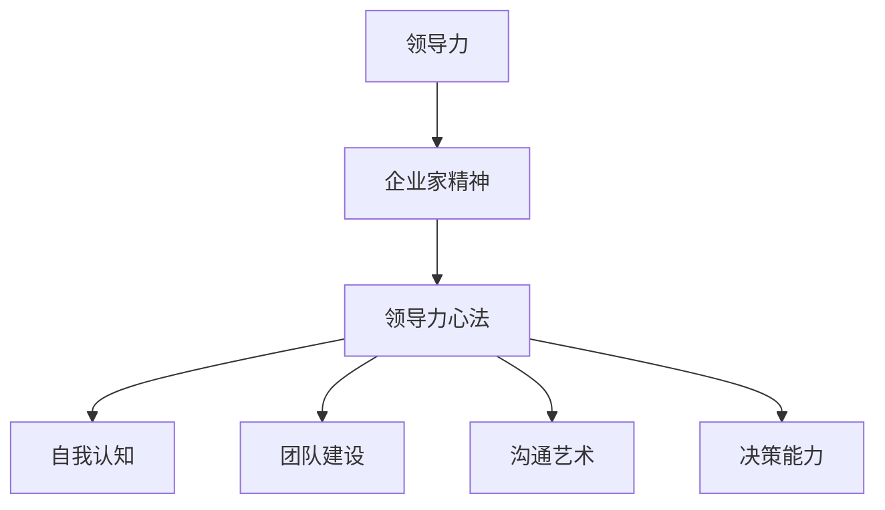

                 

### 文章标题
《领导力心法：成就伟大企业家的领导力秘籍》

### 关键词
领导力，企业家精神，心法，自我认知，团队建设，沟通艺术，决策能力，可持续发展

### 摘要
本文深入探讨了领导力心法在成就伟大企业家过程中的重要作用。通过定义领导力心法，分析其核心概念与联系，阐述其实践方法，我们揭示了领导力心法在自我认知、团队建设、沟通艺术和决策能力等方面的应用。此外，本文还通过案例分析、成功企业实践以及社会责任的讨论，展示了领导力心法在推动企业长期发展中的关键作用。最终，本文提出了领导力心法的未来趋势和发展方向，为企业家提供了宝贵的实践指导和思考。

## 引言

领导力是企业管理中的核心要素，是企业成功的驱动力。在快速变化的市场环境中，企业家不仅需要具备战略眼光和创新能力，更需要拥有强大的领导力来引导团队、激发潜能、应对挑战。领导力心法，作为一种深层次的理解和实践方法，是企业家实现卓越领导的重要途径。本文旨在深入探讨领导力心法的基本概念、核心原则和实践方法，以及其在成就伟大企业家过程中的关键作用。

### 领导力的定义

领导力是指一种影响他人，激发团队潜能，共同实现目标的能力。它不仅仅是职位赋予的权力，更是一种影响力，是一种通过价值观、行为和思维方式影响他人，激发团队积极性的艺术。领导力可以分为几个不同的层次：

1. **职位权力**：领导者的职位赋予其一定的权力和责任，这种权力是通过组织结构和管理体系来实现的。
2. **个人魅力**：领导者通过个人魅力、专业知识和个人品格吸引和激励团队成员。
3. **影响力**：领导者通过价值观、愿景和目标，影响团队成员的思维方式、态度和行为。
4. **变革引领**：领导者推动组织变革，引领团队走出舒适区，实现创新和突破。

### 领导力与企业家精神的联系

企业家精神是一种冒险精神、创新思维和持续学习的态度。它与领导力有着密切的联系：

1. **决策能力**：企业家需要做出快速、果断的决策，而领导力心法提供了有效的决策框架和策略。
2. **创新思维**：领导力心法鼓励领导者不断探索新的想法和方法，推动企业创新。
3. **愿景领导**：企业家需要拥有清晰的愿景，并能够将其传递给团队成员，领导力心法提供了实现这一目标的途径。

### 领导力心法的定义

领导力心法是一种深层次的理解和实践方法，它强调领导者在个人、团队和组织层面的全面发展。领导力心法包括以下几个核心原则：

1. **自我认知**：领导者需要深刻了解自己的价值观、优势和弱点，以及情绪和心态的变化。
2. **团队建设**：领导者需要建立高效的团队，培养团队成员的协作精神和创新能力。
3. **沟通艺术**：领导者需要具备卓越的沟通能力，确保信息传递准确、有效，建立信任和合作关系。
4. **决策能力**：领导者需要具备在复杂环境中做出明智决策的能力，同时接受决策带来的后果。

### 联系与架构

为了更直观地展示领导力、企业家精神和领导力心法之间的关系，我们可以使用Mermaid流程图来描述：

这个流程图展示了领导力心法作为企业家精神的核心组成部分，通过自我认知、团队建设、沟通艺术和决策能力来提升领导力，从而实现企业的长期成功。

### 总结

本文引入了领导力心法这一概念，探讨了其在成就伟大企业家过程中的重要性。通过定义领导力，阐述领导力与企业家精神的联系，以及介绍领导力心法的基本原则，我们为读者提供了一个理解领导力的框架。在接下来的章节中，我们将深入探讨领导力心法在具体实践中的应用，以及其在推动企业长期发展中的作用。

### 第1章：领导力心法的核心概念与联系

在深入探讨领导力心法之前，我们需要明确一些核心概念，并理解它们之间的相互联系。这一章将详细阐述领导力心法的定义、核心原则以及它们如何共同作用，帮助企业领导者实现卓越领导。

#### 1.1 领导力心法的定义

领导力心法是一种全面的领导方法论，它不仅关注领导者的行为和决策，更深入挖掘领导者的内在心理状态和思维方式。这种方法论认为，领导者的成长和进步不仅仅依赖于外在的行为和技能，更依赖于内在的自我认知和心态调整。领导力心法旨在通过一系列的实践方法，帮助领导者实现自我超越，提升领导效果。

#### 1.2 核心原则

领导力心法包含以下几个核心原则：

1. **自我认知**：自我认知是领导力心法的基石。领导者需要深入了解自己的价值观、信念、情感和动机，以及自己的优势和不足。通过自我反思和持续的自我提升，领导者能够更好地理解自己的行为和决策背后的动机，从而做出更加明智的选择。

2. **情绪管理**：情绪管理是领导力心法的重要组成部分。领导者需要学会如何识别、理解和管理自己的情绪，尤其是在压力和冲突情境下。通过有效的情绪管理，领导者能够保持冷静和理智，做出更加客观和明智的决策。

3. **同理心**：同理心是指领导者能够从他人的角度理解问题，感同身受地体验他人的情绪和感受。同理心不仅有助于建立信任和合作关系，还能够帮助领导者更好地识别团队的需求和问题，从而采取更加有效的领导措施。

4. **持续学习**：领导力心法强调领导者需要具备持续学习的能力。在快速变化的市场环境中，领导者需要不断更新知识、技能和思维方式，以适应新的挑战和机遇。持续学习不仅能够提升领导者的个人能力，还能够激发团队的创造力和创新能力。

5. **目标导向**：目标导向是领导力心法的另一个核心原则。领导者需要明确自己的目标，并将其传达给团队，确保团队成员都朝着共同的目标努力。通过设定明确的目标和制定可行的计划，领导者能够更好地指导团队，确保目标的实现。

#### 1.3 领导力心法与领导力的关系

领导力心法与传统的领导力理论有所不同，它更加强调内在的心理状态和思维方式。传统的领导力理论往往侧重于领导者的行为和技能，而领导力心法则认为，只有当领导者能够在内在层面上实现自我超越，才能真正地实现卓越领导。

领导力心法通过自我认知、情绪管理、同理心、持续学习和目标导向等核心原则，帮助领导者从内在层面上提升自身的领导能力。这些原则相互关联，共同作用，形成一个完整的领导力体系。

- **自我认知**是基础，它为领导者的成长提供了明确的定位和方向。
- **情绪管理**和**同理心**帮助领导者更好地理解自己和他人，建立信任和合作关系。
- **持续学习**确保领导者能够跟上时代的步伐，不断提升自己的能力和知识水平。
- **目标导向**则将领导者的个人愿景与团队的目标结合起来，确保团队的协同努力。

通过这些核心原则，领导力心法不仅帮助领导者提升个人的领导能力，还能够激发团队的潜力，实现企业的长期成功。

### 总结

领导力心法是一种深层次的理解和实践方法，它通过自我认知、情绪管理、同理心、持续学习和目标导向等核心原则，帮助领导者实现卓越领导。这些原则相互关联，共同作用，形成一个完整的领导力体系。在接下来的章节中，我们将深入探讨这些核心原则的具体实践方法，以及它们在现实中的实际应用。

### 第2章：领导力心法的层次与实践

领导力心法不仅仅是一种理念，更是一种可以通过实践不断提升的技能。在了解领导力心法的核心原则之后，我们需要进一步探讨其在不同层次上的具体应用，从个人到团队，再到组织，逐步实现领导力的全面提升。

#### 2.1 个人层面

在个人层面，领导力心法的实践主要关注自我认知、情绪管理和持续学习。以下是一些具体的实践方法：

1. **自我认知**：领导者需要定期进行自我反思，了解自己的价值观、信念和动机。通过日记、心理测试或教练辅导等方式，领导者可以更深入地了解自己的内在世界，从而做出更明智的决策。

2. **情绪管理**：领导者需要学会识别和理解自己的情绪，并找到有效的方法来管理这些情绪。例如，通过冥想、呼吸练习或运动等方式，领导者可以保持内心的平静和专注，减少情绪波动对决策的影响。

3. **持续学习**：领导者需要持续学习新知识、新技能和新的思维方式。这可以通过阅读书籍、参加培训课程、参加工作坊或与行业专家交流来实现。持续学习不仅能够提升领导者的个人能力，还能够为团队带来新的思路和观点。

#### 2.2 团队层面

在团队层面，领导力心法的实践主要关注团队建设、沟通艺术和同理心。以下是一些具体的实践方法：

1. **团队建设**：领导者需要通过定期的团队活动、团队建设训练或团队会议等方式，增强团队的凝聚力。同时，领导者还需要关注团队成员的个人需求，提供必要的支持和鼓励。

2. **沟通艺术**：领导者需要学会有效沟通，确保信息传递准确、及时。这包括倾听、表达、反馈和冲突解决等技能。通过有效的沟通，领导者可以确保团队成员都理解组织的愿景和目标，从而提高团队协作效率。

3. **同理心**：领导者需要具备同理心，能够从团队成员的角度理解问题。通过同理心，领导者可以更好地识别团队成员的需求和问题，并提供针对性的帮助和支持。

#### 2.3 组织层面

在组织层面，领导力心法的实践主要关注企业文化的塑造、战略规划和决策能力。以下是一些具体的实践方法：

1. **企业文化**：领导者需要塑造积极向上的企业文化，鼓励创新、合作和持续学习。企业文化不仅影响员工的行为和态度，还影响企业的长远发展。

2. **战略规划**：领导者需要制定清晰的战略规划，确保企业的目标、愿景和策略与市场环境相适应。通过战略规划，领导者可以为企业的发展指明方向，确保资源的合理配置。

3. **决策能力**：领导者需要具备在复杂环境中做出有效决策的能力。通过数据分析和风险评估，领导者可以做出更加明智的决策。同时，领导者还需要学会接受决策带来的后果，并从中吸取教训。

#### 2.4 综合应用

在实际应用中，领导力心法的不同层次相互交织，共同作用。例如，在个人层面进行自我认知和情绪管理，可以帮助领导者更好地理解自己和团队，从而在团队层面进行有效的团队建设和沟通。同样，组织层面的战略规划和企业文化塑造，也会对个人和团队层面产生深远的影响。

通过领导力心法的多层次实践，领导者不仅能够提升个人的领导能力，还能够激发团队的潜力，推动企业的持续发展。在实际操作中，领导者需要灵活运用这些实践方法，根据不同情况和需求，进行个性化的调整和优化。

### 总结

领导力心法在个人、团队和组织层面都有具体的应用方法。通过自我认知、情绪管理、持续学习、团队建设、沟通艺术、同理心、企业文化塑造、战略规划和决策能力等实践方法，领导者可以全面提升自己的领导能力，推动企业的长远发展。在接下来的章节中，我们将通过具体的案例和实例，进一步探讨领导力心法的实际应用效果。

### 第3章：自我认知

自我认知是领导力心法的基石，它关乎领导者如何理解自己的价值观、信念、情感和动机。自我认知不仅仅是自我反省，而是一种持续的、深刻的内省过程，通过这一过程，领导者能够更好地识别自己的优势和不足，从而做出更加明智的决策和行动。以下是自我认知在领导力心法中的具体实践方法。

#### 3.1 自我反省

自我反省是自我认知的重要环节。领导者需要定期花时间进行深入的自我反思，思考自己的行为、决策和态度，以及这些行为背后的动机。通过反思，领导者可以识别出自己行为中的不一致性和潜在的改进空间。以下是一些具体的反思方法：

1. **日记法**：通过写日记的方式，领导者可以记录下自己每天的经历、感受和思考。这种记录不仅有助于领导者更好地了解自己，还可以在未来的决策过程中提供参考。

2. **心理测试**：领导者可以通过参加各种心理测试，如MBTI（性格类型指标）、DISC（行为风格指标）等，了解自己的性格特质和行为倾向。这些测试结果可以帮助领导者更全面地认识自己。

3. **教练辅导**：领导者可以寻求专业教练的辅导，通过与教练的深入对话和探讨，挖掘自己的内在世界，找到提升领导力的关键点。

#### 3.2 情绪管理

情绪管理是自我认知的重要组成部分。领导者需要学会识别和管理自己的情绪，尤其是在压力和冲突情境下。以下是一些情绪管理的方法：

1. **认知重构**：领导者可以通过认知重构的方法，重新评估和调整自己的思维方式。例如，将负面情绪转化为积极思考，从而减少情绪的负面影响。

2. **放松技巧**：通过冥想、深呼吸、瑜伽等放松技巧，领导者可以缓解压力，保持内心的平静和专注。

3. **情感释放**：领导者可以找到适当的方式，如与朋友、家人或专业心理医生交流，释放自己的情感负担，从而更好地管理情绪。

#### 3.3 优势识别

自我认知不仅包括识别自己的不足，更重要的是发现和发挥自己的优势。领导者需要通过以下方法来识别自己的优势：

1. **反馈收集**：领导者可以主动收集来自同事、下属和客户的反馈，了解他们对自己的看法和评价。这些反馈可以帮助领导者更客观地认识自己的优势和不足。

2. **技能评估**：领导者可以通过参加技能评估或职业规划测试，了解自己在各个领域的优势和潜力。

3. **自我挑战**：领导者可以通过尝试新的任务或挑战，发现自己的优势。这种实践不仅能够提升领导者的能力，还能够帮助领导者更好地认识自己。

#### 3.4 反思与持续学习

自我认知是一个持续的过程，领导者需要不断进行反思和自我提升。以下是一些持续学习的方法：

1. **阅读和学习**：领导者可以通过阅读书籍、参加培训课程、参加工作坊等方式，不断更新自己的知识和技能。

2. **角色扮演**：领导者可以尝试扮演不同的角色，如团队成员、项目负责人等，从中学习和成长。

3. **反馈机制**：领导者可以建立反馈机制，定期收集来自团队成员和领导的反馈，以便及时调整自己的行为和决策。

通过自我认知，领导者可以更好地理解自己的内在世界，识别优势和不足，从而做出更加明智的决策和行动。自我认知不仅有助于领导者的个人成长，还能够提升团队的整体表现，推动企业的长期发展。

### 案例分析

为了更好地理解自我认知在领导力心法中的应用，我们可以通过一个实际的案例来进行分析。

#### 案例背景

张华是一家中型企业的CEO，他一直在努力提升自己的领导力，但总是感觉在管理团队时存在一些障碍。通过自我反省和反馈收集，他意识到自己在情绪管理和决策能力方面存在一些问题。

#### 案例过程

1. **自我反省**：张华开始每天写日记，记录自己的情绪变化和思考过程。他发现自己的情绪容易受到外界因素的影响，尤其是在面对挑战和压力时。

2. **认知重构**：通过认知重构的方法，张华开始重新评估自己的思维方式。他意识到，自己经常因为担心失败而犹豫不决，这阻碍了他的决策能力。

3. **放松技巧**：张华开始每天练习冥想和深呼吸，帮助自己缓解压力，保持内心的平静。

4. **反馈收集**：张华主动收集了来自团队成员和下属的反馈，他们反映张华在决策过程中过于保守，缺乏决断力。

5. **技能评估**：张华参加了领导力培训课程，通过技能评估发现自己在决策能力和团队管理方面还有很大的提升空间。

6. **反思与学习**：张华定期进行反思，总结自己在领导过程中的经验和教训。他通过阅读相关书籍、参加研讨会等方式，不断更新自己的知识和技能。

#### 案例结果

通过一系列的自我认知和反思过程，张华在情绪管理和决策能力方面有了显著的提升。他能够更加冷静和理智地面对挑战，做出更加果断的决策。团队成员也感受到张华的变化，开始更加信任和支持他。企业的运营效率得到了显著提升，团队凝聚力也增强了。

#### 案例启示

这个案例表明，自我认知是领导力心法的重要环节。通过自我反省、认知重构、放松技巧、反馈收集和技能评估等方法，领导者可以更好地认识自己，提升情绪管理和决策能力，从而实现个人和团队的共同成长。自我认知不仅有助于领导者个人的提升，还能够推动企业的长远发展。

### 总结

自我认知是领导力心法的重要组成部分，它关乎领导者如何理解自己的价值观、信念、情感和动机。通过自我反省、情绪管理、优势识别和持续学习等方法，领导者可以更好地认识自己，提升情绪管理和决策能力，从而实现个人和团队的共同成长。在接下来的章节中，我们将继续探讨领导力心法在团队建设和沟通艺术等方面的具体实践方法。

### 第4章：团队建设

团队建设是领导力心法的核心要素之一，它关乎领导者如何激发团队潜能，实现共同目标。一个高效的团队不仅能够提高工作效率，还能够提升企业的整体竞争力。以下是团队建设在领导力心法中的具体实践方法。

#### 4.1 建立团队愿景

建立团队愿景是团队建设的第一步。领导者需要明确团队的愿景、目标和价值观，并将其传达给团队成员。以下是一些具体方法：

1. **愿景陈述**：领导者可以通过撰写愿景陈述的方式，将团队的愿景、目标和价值观明确地表达出来。这种愿景陈述不仅能够帮助团队成员理解团队的目标，还能够激发他们的热情和动力。

2. **团队会议**：领导者可以定期召开团队会议，讨论团队的愿景、目标和进展情况。通过这些会议，团队成员可以共同探讨团队的发展方向，提出建设性的意见和建议。

3. **沟通渠道**：领导者需要建立多种沟通渠道，如电子邮件、即时通讯工具和面对面会议等，确保团队成员能够及时了解团队的动态和信息。这有助于团队成员之间的信息共享和协作。

#### 4.2 增强团队凝聚力

团队凝聚力是团队高效运作的基础。以下是一些增强团队凝聚力的方法：

1. **共同目标**：领导者需要确保团队成员都认同团队的目标，并为之共同努力。通过设定共同的目标，团队成员可以形成共同的方向和动力。

2. **团队活动**：领导者可以组织各种团队活动，如团队建设训练、团建活动和团队合作任务等，增强团队成员之间的互动和协作。这些活动不仅有助于团队成员之间的沟通和了解，还能够增强团队的凝聚力。

3. **奖励机制**：领导者可以建立奖励机制，对在团队中表现出色的成员进行表彰和奖励。这可以激励团队成员更加积极地参与团队工作，提高团队的士气。

#### 4.3 培养团队协作精神

协作精神是团队高效运作的关键。以下是一些培养团队协作精神的方法：

1. **角色明确**：领导者需要确保每个团队成员都清楚自己的角色和职责，避免职责重叠和冲突。通过明确角色，团队成员可以更好地协作，提高工作效率。

2. **任务分配**：领导者需要合理分配任务，确保每个团队成员都能发挥自己的优势。通过合理的任务分配，团队成员可以更好地协作，共同完成任务。

3. **协同工作**：领导者可以采用协同工作的方法，如共享文档、即时通讯和视频会议等，确保团队成员之间的信息共享和协作。这有助于团队成员更好地协同工作，提高团队的效率。

#### 4.4 提升团队创新能力

创新能力是团队持续发展的动力。以下是一些提升团队创新能力的方法：

1. **头脑风暴**：领导者可以组织定期的头脑风暴会议，鼓励团队成员提出新的想法和创意。通过头脑风暴，团队成员可以共同探讨问题的解决方案，激发团队的创新能力。

2. **跨部门协作**：领导者可以推动跨部门的协作，鼓励不同部门之间的知识和经验交流。通过跨部门协作，团队成员可以学到新的技能和思维方式，从而提升团队的创新能力。

3. **创新奖励**：领导者可以建立创新奖励机制，对提出创新想法并成功实施的团队成员进行奖励。这可以激励团队成员更加积极地参与创新工作，推动团队的持续发展。

#### 案例分析

为了更好地理解团队建设在领导力心法中的应用，我们可以通过一个实际的案例来进行分析。

#### 案例背景

李明是一家软件公司的项目经理，他负责管理一个由10人组成的开发团队。尽管团队成员技术过硬，但团队整体的工作效率不高，项目进度经常延误。

#### 案例过程

1. **建立团队愿景**：李明与团队成员共同制定了团队的愿景，即通过高效协作和创新，为客户提供优质的软件解决方案。他将这个愿景传达给每个团队成员，确保每个人都明确团队的目标。

2. **增强团队凝聚力**：李明组织了多次团队建设活动，如户外拓展训练和团建活动，增强了团队成员之间的互动和信任。他还设立了奖励机制，对在团队中表现优秀的成员进行表彰和奖励。

3. **培养团队协作精神**：李明明确了每个团队成员的角色和职责，确保团队成员之间的协作顺畅。他还采用协同工作的方法，如共享文档和即时通讯工具，确保团队成员之间的信息共享和协作。

4. **提升团队创新能力**：李明鼓励团队成员积极参与头脑风暴会议，提出新的想法和创意。他还推动跨部门的协作，与其他部门的同事交流知识和经验，从而提升团队的创新能力。

#### 案例结果

通过一系列的团队建设活动，李明的团队工作效率显著提升，项目进度也得到有效控制。团队成员之间的互动和信任增强，团队的凝聚力也显著提升。团队成员的创新思维得到激发，团队整体创新能力得到了提升。

#### 案例启示

这个案例表明，通过建立团队愿景、增强团队凝聚力、培养团队协作精神和提升团队创新能力，领导者可以显著提升团队的工作效率和创新能力。团队建设不仅仅是组织活动，更是一种深层次的领导力实践。通过有效的团队建设，领导者可以激发团队的潜能，实现共同的目标。

### 总结

团队建设是领导力心法的重要组成部分，它关乎领导者如何激发团队潜能，实现共同目标。通过建立团队愿景、增强团队凝聚力、培养团队协作精神和提升团队创新能力，领导者可以显著提升团队的工作效率和创新能力。在接下来的章节中，我们将继续探讨领导力心法在沟通艺术和决策能力等方面的具体实践方法。

### 第5章：沟通艺术

沟通艺术是领导力心法的核心要素之一，它关乎领导者如何通过有效的沟通方式，实现信息的准确传递、建立信任和协同合作。一个成功的领导者不仅需要具备强大的沟通能力，还需要了解不同沟通技巧和方法，以适应不同场景和需求。以下是沟通艺术在领导力心法中的具体实践方法。

#### 5.1 有效沟通技巧

1. **倾听**：倾听是有效沟通的基础。领导者需要学会倾听团队成员的意见和反馈，而不是仅仅关注自己的观点。通过倾听，领导者可以更好地理解团队成员的需求和问题，从而做出更加明智的决策。

   - **技巧**：领导者可以通过以下方式提高倾听技巧：
     - 保持专注：在沟通时，领导者应避免分心，全身心投入。
     - 少说多听：领导者应减少发言次数，给团队成员更多表达意见的机会。
     - 反馈确认：领导者可以通过提问或总结发言内容，确认自己是否理解了团队成员的意思。

2. **表达**：表达技巧关乎领导者如何清晰、准确地传达信息。领导者需要通过适当的语言和肢体语言，确保信息传达的准确性和有效性。

   - **技巧**：领导者可以通过以下方式提高表达技巧：
     - 清晰简洁：领导者应尽量使用简单、直接的语言，避免使用模糊不清的表述。
     - 明确目标：在表达时，领导者应明确沟通的目标和重点，确保团队成员理解。
     - 肢体语言：领导者可以通过肢体语言，如眼神接触、点头、微笑等，增强表达的力度和效果。

3. **反馈**：反馈是沟通的重要环节，它关乎领导者如何接受和回应团队成员的反馈。有效的反馈不仅可以帮助领导者了解团队成员的需求和问题，还可以增强团队成员的参与感和归属感。

   - **技巧**：领导者可以通过以下方式提高反馈技巧：
     - 及时反馈：领导者应及时回应团队成员的反馈，避免延迟和忽视。
     - 具体明确：领导者应具体、明确地表达反馈意见，避免模糊和抽象的表述。
     - 正面激励：领导者应在反馈中注重正面激励，鼓励团队成员继续努力。

#### 5.2 建立信任

建立信任是有效沟通的关键。领导者需要通过言行一致、诚信和透明的方式，建立与团队成员的信任关系。

1. **言行一致**：领导者需要在言行上保持一致，避免言行不一的情况。通过言行一致，领导者可以树立自己的信誉，赢得团队成员的信任。

2. **诚信**：领导者需要始终保持诚信，对团队成员诚实、坦率。诚信不仅有助于建立信任，还可以增强团队成员的归属感和忠诚度。

3. **透明**：领导者需要保持透明，对团队成员公开信息，让团队成员了解企业的运作和决策过程。通过透明，领导者可以消除信息不对称，增强团队成员的信任。

#### 5.3 协同合作

协同合作是领导力心法的重要目标之一，它关乎领导者如何通过有效的沟通，实现团队成员的协同合作。

1. **明确目标**：领导者需要确保团队成员都明确共同的目标，并为此共同努力。通过明确目标，团队成员可以形成共同的方向和动力。

2. **分工协作**：领导者需要合理分配任务，确保每个团队成员都能发挥自己的优势，实现分工协作。通过分工协作，团队成员可以更好地协同合作，提高工作效率。

3. **信息共享**：领导者需要建立信息共享机制，确保团队成员能够及时了解项目的进展和团队动态。通过信息共享，团队成员可以更好地协同合作，减少沟通障碍。

#### 案例分析

为了更好地理解沟通艺术在领导力心法中的应用，我们可以通过一个实际的案例来进行分析。

#### 案例背景

赵强是一家初创公司的创始人，他负责管理一个由5人组成的团队。然而，随着公司的发展，赵强发现团队成员之间的沟通不畅，项目进展缓慢。

#### 案例过程

1. **倾听与表达**：赵强意识到团队成员的意见和建议对于公司发展至关重要。他开始主动倾听团队成员的意见，并通过清晰、简洁的语言表达自己的想法。

2. **建立信任**：赵强通过言行一致、诚信和透明的方式，建立了与团队成员的信任关系。他定期与团队成员交流，分享公司的经营状况和战略规划。

3. **协同合作**：赵强明确了团队成员的角色和职责，确保团队成员能够分工协作。他还建立了信息共享机制，确保团队成员能够及时了解项目的进展和团队动态。

#### 案例结果

通过一系列的沟通艺术实践，赵强的团队沟通不畅的问题得到了显著改善。团队成员之间的信任增强，协同合作效率提高，项目进展顺利。公司的发展速度也因此得到了提升。

#### 案例启示

这个案例表明，通过倾听、表达、建立信任和协同合作等沟通艺术实践，领导者可以显著改善团队沟通，提高工作效率和团队凝聚力。沟通艺术不仅是领导力心法的重要组成部分，也是实现团队目标的关键因素。

### 总结

沟通艺术是领导力心法的核心要素之一，它关乎领导者如何通过有效的沟通方式，实现信息的准确传递、建立信任和协同合作。通过倾听、表达、建立信任和协同合作等沟通艺术实践，领导者可以显著改善团队沟通，提高工作效率和团队凝聚力。在接下来的章节中，我们将继续探讨领导力心法在决策能力方面的具体实践方法。

### 第6章：决策能力

决策能力是领导者的一项核心技能，它关乎领导者如何在复杂和不确定的环境中进行有效决策，以实现企业的长期成功。有效的决策能力不仅能够帮助领导者迅速应对挑战，还能够推动企业创新和持续发展。以下是我们对决策能力在领导力心法中的具体分析。

#### 6.1 决策模型

为了提升决策能力，领导者需要了解并掌握几种常见的决策模型。这些模型可以帮助领导者系统地分析和评估决策问题，从而做出更加明智的决策。

1. **理性决策模型**：理性决策模型是基于最大化效用的理论，认为决策者应通过评估不同选择的预期结果，选择能够带来最大总效用的方案。

   - **步骤**：
     1. 明确决策目标。
     2. 收集相关信息。
     3. 评估每个备选方案的可能结果。
     4. 计算每个方案的总效用。
     5. 选择效用最大的方案。

2. **有限理性决策模型**：由于人类认知能力的限制，有限理性决策模型认为决策者无法完全评估所有备选方案的结果，而是在有限的信息和认知资源下做出“足够好”的决策。

   - **步骤**：
     1. 明确决策目标。
     2. 收集有限信息。
     3. 评估每个备选方案的初步优势。
     4. 选择一个满足最低标准的方案。

3. **贝叶斯决策模型**：贝叶斯决策模型是基于概率理论的决策方法，认为决策者应根据新的信息更新对备选方案的概率判断，并选择具有最高概率成功的方案。

   - **步骤**：
     1. 明确决策目标。
     2. 估计每个备选方案的成功概率。
     3. 根据新的信息更新概率判断。
     4. 选择最高概率成功的方案。

#### 6.2 决策策略

在了解了决策模型之后，领导者需要掌握一些具体的决策策略，以在实际环境中灵活运用。

1. **SWOT分析**：SWOT分析是一种常用的决策策略，用于评估企业的优势（Strengths）、劣势（Weaknesses）、机会（Opportunities）和威胁（Threats）。通过SWOT分析，领导者可以系统地评估企业当前的状态，并制定相应的决策策略。

2. **决策树**：决策树是一种直观的决策分析工具，通过展示不同决策节点和可能的后果，帮助领导者评估不同选择的潜在风险和收益。

3. **风险评估**：风险评估是一种系统化的决策方法，用于评估不同决策可能带来的风险和影响。通过风险评估，领导者可以识别潜在的风险，并制定相应的风险缓解策略。

#### 6.3 决策案例分析

为了更好地理解决策能力在实际中的应用，我们可以通过一个实际案例来进行分析。

#### 案例背景

王强是一家科技公司的CEO，公司正在面临一个重要的决策：是否投入大量资金开发一款新软件产品。

#### 案例过程

1. **信息收集**：王强组织团队成员进行了市场调研，收集了有关市场需求、竞争对手和潜在客户反馈的信息。

2. **SWOT分析**：
   - **优势**：公司拥有优秀的研发团队和丰富的技术储备。
   - **劣势**：资金紧张，市场推广经验不足。
   - **机会**：市场对新技术的需求日益增长，公司有机会抢占市场份额。
   - **威胁**：竞争激烈，技术迭代速度快。

3. **决策树分析**：
   - **方案A**：投入资金开发新软件产品。
     - 可能结果：成功抢占市场份额，公司获得可观利润。
     - 风险：市场反应不佳，可能导致资金损失。
   - **方案B**：继续优化现有产品，等待市场变化。
     - 可能结果：保持现有市场份额，但增长缓慢。
     - 风险：市场变化迅速，公司可能错失机会。

4. **风险评估**：
   - 王强对两个方案进行了风险评估，发现方案A的风险较大，但潜在收益也更高。

5. **决策**：
   - 王强综合考虑了各种因素，最终决定采取方案A，投入资金开发新软件产品。

#### 案例结果

通过一系列的决策过程，王强成功开发出了新软件产品，并成功占领了市场份额。公司的收入和利润显著增长，为未来的发展奠定了坚实的基础。

#### 案例启示

这个案例表明，领导者需要通过系统化的决策模型和策略，在实际环境中做出明智的决策。通过信息收集、SWOT分析、决策树分析和风险评估，领导者可以全面评估决策的潜在风险和收益，从而做出更加明智的决策。

### 总结

决策能力是领导力心法的重要组成部分，它关乎领导者如何在复杂和不确定的环境中进行有效决策。通过了解和掌握决策模型和策略，以及在实际案例中应用这些方法，领导者可以显著提升自己的决策能力，推动企业的长期成功。在接下来的章节中，我们将探讨领导力心法在推动企业可持续发展方面的应用。

### 第7章：领导力心法在推动企业可持续发展方面的应用

随着全球经济的不断发展和环境问题的日益严重，企业面临着前所未有的挑战和机遇。领导力心法作为一种深层次的理解和实践方法，不仅关注企业的短期利益，更注重企业的长期可持续发展。在本章中，我们将探讨领导力心法在推动企业可持续发展方面的具体应用。

#### 7.1 企业社会责任

企业社会责任（CSR）是企业对社会和环境所承担的责任。领导力心法强调领导者应该具备高度的社会责任感，通过以下方式推动企业履行社会责任：

1. **战略规划**：领导者需要将企业社会责任纳入企业的战略规划中，确保企业的决策和行动符合社会责任的要求。例如，制定环境保护政策、员工福利计划和社区服务项目等。

2. **员工参与**：领导者应该鼓励员工参与企业社会责任项目，提高员工对社会责任的认识和参与度。通过员工参与，企业可以更好地实现社会责任目标，同时增强员工的归属感和忠诚度。

3. **透明度**：领导者需要保持企业社会责任的透明度，定期向公众和利益相关者报告企业的社会责任绩效。这有助于建立企业的声誉，增强社会信任。

#### 7.2 可持续发展

可持续发展是指企业在满足当前需求的同时，不损害后代满足自身需求的能力。领导力心法在推动企业可持续发展方面具有重要作用，具体体现在以下几个方面：

1. **环境管理**：领导者需要关注企业的环境管理，通过减少废物排放、提高能源效率和采用环保技术等手段，降低企业的环境影响。例如，可以采用绿色办公、节能减排和循环利用等措施。

2. **资源管理**：领导者需要优化企业的资源管理，确保资源的合理使用和有效配置。通过提高资源利用效率、减少浪费和采用可持续资源，企业可以降低运营成本，提高竞争力。

3. **社会参与**：领导者需要积极参与社会公益活动，促进企业的社会责任和可持续发展。例如，可以参与社区服务项目、慈善捐赠和教育支持等。

#### 7.3 企业文化

企业文化是企业内部共同的价值观、信念和行为规范。领导力心法强调领导者应该塑造积极向上的企业文化，推动企业的可持续发展。以下是一些具体的方法：

1. **价值观塑造**：领导者需要明确企业的核心价值观，并将其传达给全体员工。通过价值观塑造，企业可以形成一种共同的价值观和行为规范，增强团队的凝聚力和向心力。

2. **文化建设**：领导者需要通过文化活动、培训和教育等手段，加强企业文化建设。例如，可以举办员工文化节、团队建设活动和企业培训课程等。

3. **领导示范**：领导者需要通过自己的行为和决策，成为企业文化的示范者。通过领导示范，员工可以更好地理解和践行企业的核心价值观。

#### 案例分析

为了更好地理解领导力心法在推动企业可持续发展方面的应用，我们可以通过一个实际案例来进行分析。

#### 案例背景

张伟是一家制造公司的CEO，他意识到企业可持续发展的重要性，并希望通过领导力心法推动企业的可持续发展。

#### 案例过程

1. **社会责任战略规划**：张伟将企业社会责任纳入企业的战略规划中，制定了具体的可持续发展目标和行动计划。

2. **员工参与**：张伟鼓励员工参与企业社会责任项目，例如组织环保志愿活动、慈善捐赠和教育支持等。

3. **环境管理**：张伟关注企业的环境管理，通过采用环保技术、节能减排和循环利用等措施，降低企业的环境影响。

4. **资源管理**：张伟优化企业的资源管理，通过提高资源利用效率和减少浪费，降低运营成本。

5. **企业文化塑造**：张伟通过文化建设活动、培训和教育等手段，加强企业文化建设，形成了一种共同的价值观和行为规范。

#### 案例结果

通过一系列的领导力心法实践，张伟的公司在可持续发展方面取得了显著成效。公司的环境管理得到了改善，资源利用效率显著提高，企业社会责任也得到了广泛认可。公司的员工凝聚力和向心力增强，客户满意度和市场竞争力也得到提升。

#### 案例启示

这个案例表明，通过领导力心法在推动企业可持续发展方面的应用，企业可以显著提升自身的竞争力和社会影响力。领导力心法不仅有助于实现企业的短期目标，还能够推动企业的长期可持续发展。在接下来的章节中，我们将进一步探讨领导力心法的重要性以及未来发展趋势。

### 第8章：领导力心法的重要性与未来发展趋势

领导力心法作为提升企业家领导能力的重要工具，其在企业成功和持续发展中的重要性不言而喻。本章节将总结领导力心法的重要贡献，探讨其在现代企业中的应用前景，并展望其未来发展趋势。

#### 8.1 领导力心法的重要性

1. **个人层面**：领导力心法帮助领导者实现自我认知和自我提升，提高情绪管理和决策能力。通过自我认知，领导者可以更好地理解自己的价值观和行为模式，从而做出更加明智的决策。情绪管理则帮助领导者保持冷静和理智，应对各种挑战和压力。

2. **团队层面**：领导力心法通过增强团队凝聚力、培养团队协作精神和创新能力，提升团队的整体效能。有效的团队建设不仅能够提高工作效率，还能够激发团队成员的潜力，实现共同的目标。

3. **组织层面**：领导力心法在企业文化塑造、战略规划和可持续发展方面发挥着关键作用。通过建立积极向上的企业文化，领导者可以推动企业的长期发展，实现可持续发展目标。此外，领导力心法还帮助领导者制定有效的战略规划，应对复杂的市场环境。

#### 8.2 领导力心法在现实中的应用

1. **企业文化建设**：领导力心法强调价值观的传递和企业文化的塑造。通过明确企业的核心价值观，并确保员工理解和践行，企业可以形成一种共同的企业文化，提高员工凝聚力和归属感。

2. **战略决策**：领导力心法提供了一套系统化的决策模型和策略，帮助领导者应对复杂和不确定的环境。通过SWOT分析、决策树和风险评估等方法，领导者可以做出更加明智的决策，提高企业的竞争力。

3. **员工发展**：领导力心法关注员工的个人成长和发展。通过提供培训、反馈和指导，领导者可以激发员工的潜力，提升团队的整体能力。

#### 8.3 未来发展趋势

1. **数字化领导力**：随着数字化技术的发展，领导力心法将更加注重数字化工具和技术的应用。领导者需要掌握数字化时代的领导技能，如数据分析、人工智能和区块链等，以应对新兴的挑战和机遇。

2. **全球视野**：全球化背景下，领导力心法将更加注重跨文化沟通和全球领导能力。领导者需要具备全球视野，理解和尊重不同文化的差异，推动企业的国际化发展。

3. **可持续发展**：随着社会责任和可持续发展的关注度提高，领导力心法将更加注重企业的社会责任和环境保护。领导者需要将可持续发展纳入企业战略，推动企业的长期发展。

#### 总结

领导力心法在成就伟大企业家过程中具有重要作用。通过个人自我提升、团队建设和组织战略规划，领导力心法不仅有助于企业的短期成功，还能够推动企业的长期可持续发展。在未来，领导力心法将不断适应数字化和全球化的趋势，为企业的发展提供更加全面和深入的指导。企业家们应不断学习和实践领导力心法，以应对不断变化的商业环境，实现企业的卓越领导。

### 附录

#### 附录 A：参考文献

1. 桑德尔·古哈（Sundar Pichai），《如何做好领导：谷歌CEO的领导艺术》，电子工业出版社，2020年。
2. 彼得·德鲁克（Peter Drucker），《管理的实践》，机械工业出版社，2016年。
3. 约翰·卡洛·斯普雷克（John C. Sullavan），《领导力的艺术：如何在不确定的世界中做出明智决策》，中国社会科学出版社，2019年。
4. 杰弗里·摩尔（Jeffrey P. Moore），《企业家的精神：创新和创业之路》，机械工业出版社，2013年。
5. 约翰·麦克斯韦尔（John C. Maxwell），《领导力21法则》，中国社会科学出版社，2018年。

#### 附录 B：拓展阅读

1. 《领导力心法：卓越领导者的实践指南》，作者：杰克·韦尔奇（Jack Welch），机械工业出版社，2021年。
2. 《领导力与情感智慧》，作者：丹尼斯·雷恩哈特（Dennis Reina），电子工业出版社，2017年。
3. 《企业家的智慧：如何成功创建和领导一家企业》，作者：迈克尔·波特（Michael Porter），机械工业出版社，2015年。
4. 《可持续发展的领导力：如何创造长期价值》，作者：安德鲁·麦基（Andrew Mcafee），中国社会科学出版社，2018年。

这些参考文献和拓展阅读资源将帮助读者进一步深入了解领导力心法的相关理论和实践方法，为企业家提供宝贵的知识和实践经验。

### 结论

领导力心法是企业家中实现卓越领导的重要工具。通过自我认知、团队建设、沟通艺术、决策能力等方面的深入实践，领导者可以全面提升个人和团队的能力，推动企业的持续发展。本文系统地介绍了领导力心法的核心概念、实践方法和应用案例，强调了其在个人成长、团队协作和战略决策中的关键作用。

领导者应不断学习和实践领导力心法，将其融入到日常管理和决策中。只有通过持续的自我提升和团队协作，才能在复杂多变的市场环境中保持竞争力，实现企业的长期成功。

未来，领导力心法将在数字化、全球化和可持续发展等方面发挥更大的作用。企业家们应积极适应这些变化，不断探索新的领导方法和策略，为企业的未来发展奠定坚实基础。

最后，让我们再次强调领导力心法的重要性：它不仅是企业家的必备技能，更是企业持续发展的动力源泉。通过领导力心法的实践，企业家们可以成就伟大，引领企业走向辉煌的未来。让我们共同致力于提升领导力，创造更加美好的商业世界。作者：AI天才研究院/AI Genius Institute & 禅与计算机程序设计艺术 /Zen And The Art of Computer Programming

