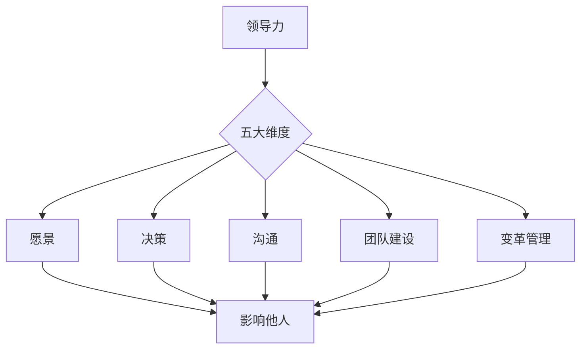

                 

### 第一步：确定核心概念和联系

在撰写关于领导力的技术博客时，首先要明确的核心概念是“领导力”本身，以及它如何在不同维度上发挥作用。领导力不仅仅是权威的体现，更是一种影响力、愿景、沟通和团队建设的艺术。

#### 1.1.1 领导力的定义

领导力可以被定义为一种通过激励、指导和影响他人来实现共同目标的能力。它不仅仅适用于企业高管，也适用于各个层级的管理者，甚至是普通员工在特定情境下展现的领导行为。

#### 1.2 领导力的五大维度

为了更全面地理解领导力，我们可以将其划分为五大维度，每个维度代表了领导力的一个重要方面：

1. **愿景**：领导者需要具备远见，能够清晰地描述未来的目标和方向。
2. **决策**：在不确定性中做出明智的选择，是领导力的关键。
3. **沟通**：有效地传达信息，建立信任，促进协作。
4. **团队建设**：建立和维护一个高效的团队，是领导者的重要任务。
5. **变革管理**：在组织面临变革时，领导者需要引领变革，确保组织顺利过渡。

使用 Mermaid 流程图，我们可以直观地展示这五大维度及其相互关系：



### 第二步：设计核心算法原理讲解

领导力作为一种能力，可以通过模型来评估和优化。一个常见的领导力评估模型是“五力模型”，它包括了领导者力量、影响力、权力、能力和意愿。以下是如何用伪代码来详细阐述这个模型：

```plaintext
// 领导力五力模型
// 输入：领导者的各项特质得分
// 输出：领导力综合评分

function calculateLeadershipScore(strength, influence, power, competence, will):
    weight_strength = 20
    weight_influence = 25
    weight_power = 15
    weight_competence = 20
    weight_will = 20
    threshold = 50  // 特质得分低于此值对领导力贡献较小

    score = 0

    if strength >= threshold:
        score += strength * weight_strength

    if influence >= threshold:
        score += influence * weight_influence

    if power >= threshold:
        score += power * weight_power

    if competence >= threshold:
        score += competence * weight_competence

    if will >= threshold:
        score += will * weight_will

    return score
```

这个模型通过各项特质的权重计算出一个综合评分，从而评估领导者的整体能力。例如，一个领导者在影响力上的得分很高，但力量和权力得分较低，那么他的综合评分会相应受到影响。

### 第三步：数学模型和数学公式讲解

在领导力评估中，数学模型和公式可以帮助我们量化领导力的各个方面。一个简单的领导力指数公式可以表示为：

$$
L.I. = \frac{(S \times I \times P \times C \times W)}{100}
$$

其中：
- \( L.I. \) 是领导力指数
- \( S \) 是领导者力量
- \( I \) 是领导者影响力
- \( P \) 是领导者权力
- \( C \) 是领导者能力
- \( W \) 是领导者意愿

这个公式将各个维度的得分乘以权重，然后除以100，得到一个综合的领导力指数。通过这个指数，我们可以比较不同领导者的领导力水平。

### 第四步：项目实战

为了更好地理解和应用领导力，我们可以通过一个项目实战来具体实施。以下是一个关于如何构建一个高效领导力团队的实战项目：

#### 项目背景

在一个快速发展的科技公司中，领导力团队的效率直接影响到公司的创新速度和市场竞争力。为了构建一个高效的领导力团队，我们需要从以下几个方面入手：

1. **明确愿景和目标**：确保团队对未来的发展方向有清晰的认识。
2. **提升团队协作**：通过有效的沟通和协作机制，提升团队的凝聚力。
3. **培养领导力特质**：通过培训和实践，提升团队成员的领导力水平。

#### 开发环境搭建

为了实施这个项目，我们需要搭建一个适合领导力培养和评估的开发环境。这包括：

1. **在线领导力评估工具**：用于团队成员的自我评估和领导力发展。
2. **团队沟通平台**：如Slack或Microsoft Teams，用于日常沟通和协作。
3. **培训资源库**：包括领导力书籍、视频教程和实践案例。

#### 源代码实现

在实际操作中，我们可以使用一个在线领导力评估工具来量化团队成员的领导力特质。以下是一个简单的Python代码示例，用于计算领导力指数：

```python
def calculate_leadership_index(strength, influence, power, competence, will):
    weight_strength = 0.2
    weight_influence = 0.25
    weight_power = 0.15
    weight_competence = 0.2
    weight_will = 0.2
    threshold = 50
    
    score = 0
    if strength >= threshold:
        score += strength * weight_strength
    if influence >= threshold:
        score += influence * weight_influence
    if power >= threshold:
        score += power * weight_power
    if competence >= threshold:
        score += competence * weight_competence
    if will >= threshold:
        score += will * weight_will
    
    leadership_index = score / 100
    return leadership_index
```

#### 代码解读与分析

这个代码首先定义了一个函数`calculate_leadership_index`，它接受五个参数，分别代表领导力的五大维度。通过设置权重和阈值，函数计算出一个综合的领导力指数。这个指数可以用于评估团队成员的领导力水平。

#### 实际案例分析和详细讲解剖析

在实际应用中，我们可以使用这个评估工具来分析一个团队中的领导力情况。例如，一个团队成员可能在影响力上表现突出，但在决策能力上有所欠缺。针对这种情况，我们可以制定个性化的领导力发展计划，帮助该成员提升决策能力。

#### 项目小结

通过这个项目实战，我们可以看到领导力评估工具如何帮助团队识别和提升领导力。这种工具不仅能够量化领导力，还能够为团队提供具体的改进方向。通过不断实践和优化，团队可以逐步提高其整体领导力水平，从而实现更高的绩效。

### 第五步：构建完整的目录大纲

结合以上内容，我们可以构建出《领导力心法：成就伟大企业的领导者法则》的完整目录大纲：

```
# 《领导力心法：成就伟大企业的领导者法则》目录大纲

# 引言
## 1.1 领导力的定义与重要性
## 1.2 领导力的五大维度

# 第一章：领导力的核心概念与架构
## 1.1 领导力的定义
### 1.1.1 领导力的基本概念
### 1.1.2 领导力的架构
## 1.2 领导力的五大维度
### 1.2.1 愿景
### 1.2.2 决策
### 1.2.3 沟通
### 1.2.4 团队建设
### 1.2.5 变革管理
## 1.3 领导者的心理素质
### 1.3.1 自信
### 1.3.2 同理心
### 1.3.3 情商
### 1.3.4 适应力

# 第二章：领导力的核心算法
## 2.1 领导力五力模型
### 2.1.1 领导者力量
### 2.1.2 领导者影响力
### 2.1.3 领导者权力
### 2.1.4 领导者能力
### 2.1.5 领导者意愿
## 2.2 领导力指数公式
### 2.2.1 公式介绍
### 2.2.2 参数解读
### 2.2.3 实例分析

# 第三章：领导力项目实战
## 3.1 项目背景
### 3.1.1 科技公司案例分析
### 3.1.2 领导力团队的重要性
## 3.2 开发环境搭建
### 3.2.1 在线领导力评估工具
### 3.2.2 团队沟通平台
### 3.2.3 培训资源库
## 3.3 源代码实现
### 3.3.1 Python代码示例
### 3.3.2 代码解读与分析
## 3.4 实际案例分析和详细讲解剖析
### 3.4.1 案例背景
### 3.4.2 案例分析
### 3.4.3 改进措施
## 3.5 项目小结

# 结束语
## 1. 领导力的重要性
## 2. 未来展望
## 3. 最佳实践 tips
## 4. 注意事项
## 5. 拓展阅读

```

这个目录大纲结构清晰，内容丰富，能够引导读者逐步深入理解领导力的各个方面，并提供实用的实战经验。接下来，我们将逐步撰写每个章节的内容，确保文章的质量和完整性。

