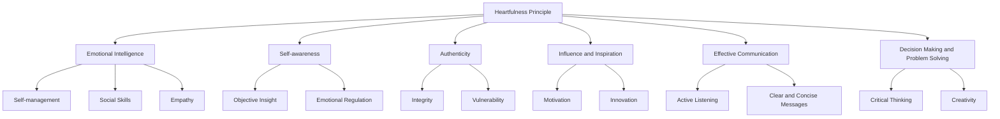

                 

### Step 1: Introduction to Leadership Heartfulness

The essence of great leadership transcends mere management of tasks and people. At its core, it lies in the **Heartfulness Principle**, which emphasizes the balance between emotional intelligence and rational decision-making. Leadership Heartfulness is a comprehensive approach to understanding and practicing leadership that integrates emotional intelligence, personal growth, and a deep sense of purpose.

**Why is Leadership Heartfulness important?**

Leadership Heartfulness is significant because it addresses the human element of leadership, which is often overlooked in traditional leadership theories. It recognizes that effective leadership is not just about achieving goals but also about fostering a positive and nurturing environment that encourages growth, innovation, and collaboration. By focusing on heartfulness, leaders can build stronger relationships, enhance team performance, and create a culture of trust and respect.

**Core Principles of Leadership Heartfulness**

1. **Emotional Intelligence**: Leaders with high emotional intelligence are better equipped to understand and manage their own emotions, as well as to empathize with and influence others. Emotional intelligence is a critical component of heartfulness because it allows leaders to connect with their team on a deeper level.

2. **Self-awareness**: True leadership begins with self-awareness. Leaders who are aware of their strengths, weaknesses, and biases are more likely to make sound decisions and inspire trust among their team members.

3. **Authenticity**: Authentic leaders are genuine and transparent in their actions and communication. They lead with integrity and are not afraid to be vulnerable, which helps to build trust and credibility.

4. **Influence and Inspiration**: Effective leaders influence and inspire others by setting a positive example and creating a vision that resonates with their team. Heartfulness in leadership means inspiring others to achieve their best, rather than simply commanding them to follow orders.

5. **Effective Communication**: Communication is the cornerstone of leadership. Heartful leaders are adept at listening, expressing themselves clearly, and fostering open dialogue within their teams.

6. **Decision Making and Problem Solving**: Heartful leaders approach decision making and problem solving with a balanced perspective, considering both the logical and emotional aspects of the situation.

**Purpose of the Article**

This article aims to explore the principles of Leadership Heartfulness in detail, providing readers with a comprehensive understanding of how to apply these principles in their leadership roles. We will delve into the core concepts, provide practical examples, and offer actionable strategies that can help leaders become more effective and influential. By the end of this article, you will have a solid foundation in Leadership Heartfulness and the tools to apply it in your own leadership practice.

### Keywords

- **Leadership Heartfulness**
- **Emotional Intelligence**
- **Self-awareness**
- **Authenticity**
- **Influence and Inspiration**
- **Effective Communication**
- **Decision Making and Problem Solving**

### Abstract

"Leadership Heartfulness: The Leadership Principles for Becoming a Great Leader" delves into the essential elements of heartful leadership, combining emotional intelligence, self-awareness, authenticity, influence, and effective communication. This article provides a comprehensive guide to understanding and applying these principles in leadership roles. Through detailed explanations, practical examples, and actionable strategies, readers will gain insights into how to foster a nurturing and collaborative environment, enhance team performance, and inspire others to achieve their best. Whether you are an aspiring leader or a seasoned executive, this article will equip you with the knowledge and tools needed to lead with heartfulness.

### Understanding Leadership

Leadership is a multifaceted concept that encompasses various dimensions, including influence, guidance, motivation, and direction-setting. It is the process through which an individual or a group of individuals can motivate others to work together towards achieving a common goal. The importance of leadership in modern organizations cannot be overstated, as it is a critical driver of success and innovation.

#### Definition and Evolution of Leadership

Leadership has been defined in numerous ways, reflecting its complexity and the diverse contexts in which it operates. According to Northouse (2018), "leadership is a process whereby an individual influences a group of individuals to achieve a common goal." This definition highlights the essential elements of leadership: the presence of a leader, the influence exerted on followers, and the goal-oriented nature of leadership activities.

The evolution of leadership theories has been shaped by various societal, economic, and technological changes. Traditional leadership theories, such as trait theory and behavioral theory, focused on identifying the specific characteristics and behaviors that make a good leader. However, contemporary theories emphasize the dynamic and adaptive nature of leadership, recognizing that effective leadership is context-dependent and requires a blend of skills and attributes.

#### Key Theories and Perspectives on Leadership

1. **Trait Theory**: This theory suggests that leaders are born with certain innate traits that make them effective leaders. Traits such as intelligence, confidence, and charisma are often cited as essential characteristics of successful leaders.

2. **Behavioral Theory**: Unlike trait theory, behavioral theory focuses on the actions and behaviors of leaders rather than their innate traits. This theory suggests that effective leadership can be learned and developed through specific behaviors, such as providing support, setting clear goals, and communicating effectively.

3. **Situation Theory**: Also known as contingency theory, this approach argues that effective leadership depends on the situation and the specific context in which a leader operates. Leaders must be able to adapt their leadership style to fit the needs of their team and the demands of the situation.

4. **Transformational Leadership**: This theory emphasizes the role of leaders in inspiring and transforming their followers. Transformational leaders inspire others to achieve their full potential, develop a shared vision, and cultivate a sense of loyalty and commitment.

5. **Situational Leadership**: This model suggests that effective leadership involves adapting one's leadership style to the development level of followers. There are four leadership styles, each appropriate for a different stage of follower development.

#### The Importance of Leadership in Modern Organizations

In today's rapidly changing and complex business environment, effective leadership is more critical than ever. Here are some key reasons why leadership is essential in modern organizations:

1. **Driving Innovation**: Leaders play a crucial role in fostering a culture of innovation and encouraging their teams to think creatively and take calculated risks.

2. **Fostering Team Collaboration**: Effective leaders promote collaboration and teamwork, which is essential for achieving organizational goals and maintaining a competitive edge.

3. **Enhancing Employee Engagement**: Leaders who prioritize the well-being and development of their employees can significantly enhance engagement and job satisfaction, leading to higher productivity and lower turnover rates.

4. **Navigating Change**: Leaders are responsible for navigating their organizations through periods of change, whether it's adapting to new technologies, responding to market shifts, or managing organizational restructuring.

5. **Building a Strong Brand**: Strong leadership contributes to building a positive organizational culture and brand reputation, which is essential for attracting and retaining top talent.

In conclusion, leadership is a multifaceted and essential aspect of modern organizations. By understanding the various theories and perspectives on leadership and recognizing its importance, leaders can better navigate the complexities of the modern business environment and drive their organizations towards success.

### The Heartfulness Principle

The Heartfulness Principle is a fundamental concept in leadership that emphasizes the integration of emotional intelligence and personal well-being with leadership practices. At its core, Heartfulness involves cultivating a genuine connection with oneself and others, fostering an environment of trust, empathy, and mutual respect. This principle is grounded in the belief that a leader's ability to lead effectively is deeply influenced by their emotional state and the emotional intelligence they possess.

#### What is Heartfulness?

Heartfulness can be defined as the practice of leading with compassion, integrity, and awareness. It is the art of aligning one's heart with their actions and decisions, ensuring that leadership is not only about achieving results but also about nurturing and supporting the growth of individuals and teams. Heartful leaders are those who prioritize the emotional and psychological well-being of their followers, understanding that true leadership extends beyond the mere fulfillment of tasks.

**Core Characteristics of Heartfulness:**

1. **Authenticity**: Heartful leaders are genuine and transparent in their actions and communication. They lead with integrity and are not afraid to be vulnerable, which helps build trust and credibility.

2. **Empathy**: Heartful leaders possess a high level of empathy, allowing them to understand and connect with the emotions and perspectives of their followers. This empathy fosters a supportive and inclusive environment.

3. **Compassion**: Compassionate leaders show care and concern for their followers' well-being. They are willing to go the extra mile to support and assist their team members, especially during challenging times.

4. **Self-awareness**: Heartful leaders are self-aware, understanding their own emotions, strengths, and weaknesses. This self-awareness enables them to make more balanced and informed decisions.

5. **Influence and Inspiration**: Heartful leaders inspire and influence others by setting a positive example and creating a vision that resonates with their team. They motivate their followers to achieve their best, rather than simply commanding them to follow orders.

**The Role of Emotional Intelligence in Heartfulness**

Emotional intelligence (EQ) is a crucial component of Heartfulness. EQ encompasses the ability to recognize, understand, and manage one's own emotions, as well as the ability to recognize and influence the emotions of others. High EQ leaders are better equipped to navigate the complexities of leadership, as they can effectively manage their emotions in stressful situations, understand the emotional needs of their followers, and build strong, positive relationships.

**Practicing Heartfulness in Leadership**

To practice Heartfulness in leadership, leaders can adopt several key practices:

1. **Self-reflection**: Regular self-reflection helps leaders to better understand their emotions and actions. By taking the time to reflect on their leadership decisions, leaders can identify areas for growth and development.

2. **Active Listening**: Active listening is an essential practice for heartful leaders. It involves fully paying attention to others, understanding their perspectives, and responding thoughtfully.

3. **Building Emotional Resilience**: Leaders need to develop emotional resilience to handle challenges and setbacks. This can be achieved through practices such as mindfulness and stress management.

4. **Fostering a Culture of Trust and Respect**: Heartful leaders work to build a culture of trust and respect within their teams. This involves promoting open communication, recognizing the contributions of team members, and creating a safe space for feedback and collaboration.

5. **Leading by Example**: Heartful leaders lead by example, demonstrating the qualities they expect from their team members. Through their actions, they inspire others to embody heartfulness in their own leadership practices.

In conclusion, the Heartfulness Principle is a transformative approach to leadership that emphasizes the importance of emotional intelligence, self-awareness, and a deep sense of compassion. By integrating Heartfulness into their leadership practices, leaders can create a positive and supportive environment that fosters growth, collaboration, and innovation. As we delve deeper into the principles and practices of Heartfulness in the following chapters, we will explore how leaders can apply these concepts to become more effective, influential, and compassionate leaders.

### Emotional Intelligence for Leaders

Emotional intelligence (EQ) is a critical component of effective leadership, enabling leaders to navigate the complexities of human interactions and foster a positive organizational culture. EQ encompasses the ability to recognize, understand, and manage one's own emotions, as well as the ability to recognize and influence the emotions of others. This section will explore the concept of emotional intelligence, its importance in leadership, and practical strategies for developing and enhancing EQ.

#### The Concept of Emotional Intelligence

Emotional intelligence consists of four key domains:

1. **Self-awareness**: This involves recognizing and understanding one's own emotions, as well as the impact they have on thoughts and behaviors. Self-awareness is the foundation of EQ, as it allows leaders to make more balanced and informed decisions.

2. **Self-management**: This refers to the ability to regulate one's emotions, especially in stressful situations. Leaders with strong self-management skills can remain calm, focused, and resilient in the face of challenges and setbacks.

3. **Social skills**: These are the interpersonal skills that enable leaders to build and maintain positive relationships with others. Effective social skills include active listening, conflict resolution, and the ability to inspire and motivate team members.

4. **Empathy**: This involves understanding and sharing the feelings of others. Empathy is crucial for building trust and fostering a supportive and inclusive work environment.

#### The Importance of Emotional Intelligence in Leadership

Emotional intelligence plays a vital role in leadership effectiveness for several reasons:

1. **Enhancing Decision-Making**: Leaders with high EQ are better equipped to make sound decisions by considering both the emotional and logical aspects of a situation. They can anticipate how their decisions will impact their team and can address any emotional reactions that may arise.

2. **Building Strong Relationships**: Emotional intelligence enables leaders to build trust and rapport with their team members. By demonstrating empathy and understanding, leaders can foster a positive and collaborative work environment.

3. **Improving Communication**: Effective communication is a hallmark of emotional intelligence. Leaders who can listen actively, express themselves clearly, and adapt their communication style to different situations can foster better understanding and cooperation within their teams.

4. **Enhancing Team Performance**: Leaders with high EQ are more effective at motivating and engaging their teams. By recognizing and addressing the emotional needs of their team members, they can enhance team morale and performance.

5. **Managing Conflict**: Emotional intelligence helps leaders to manage conflicts constructively. By remaining calm and empathetic, leaders can de-escalate conflicts and find mutually beneficial solutions.

#### Developing Emotional Intelligence

Developing emotional intelligence is an ongoing process that requires self-reflection, practice, and commitment. Here are some strategies for enhancing EQ:

1. **Self-reflection**: Regular self-reflection helps leaders to better understand their emotions and the impact they have on their interactions with others. By regularly assessing their own behavior, leaders can identify areas for improvement and develop strategies for growth.

2. **Mindfulness Practices**: Mindfulness techniques, such as meditation and mindfulness-based stress reduction (MBSR), can help leaders to become more aware of their emotions and manage stress more effectively. By cultivating mindfulness, leaders can improve their focus, decision-making, and emotional regulation.

3. **Active Listening**: Active listening is a powerful tool for developing emotional intelligence. By fully paying attention to others, understanding their perspectives, and responding thoughtfully, leaders can build trust and empathy within their teams.

4. **Emotional Resilience Training**: Leaders can enhance their emotional resilience through practices such as stress management, problem-solving, and resilience-building exercises. By developing emotional resilience, leaders can better cope with challenges and maintain their effectiveness in the face of adversity.

5. **Feedback and Coaching**: Seeking feedback from peers and coaches can provide valuable insights into one's emotional intelligence strengths and areas for improvement. Leaders can use this feedback to develop targeted strategies for growth.

6. **Learning from Experiences**: Reflecting on past experiences and identifying emotional lessons learned can help leaders to grow their EQ. By analyzing both successful and challenging interactions, leaders can gain valuable insights and develop strategies for improving their emotional intelligence.

In conclusion, emotional intelligence is a crucial skill for effective leadership. By developing and enhancing their EQ, leaders can build stronger relationships, enhance their decision-making abilities, and foster a positive and inclusive organizational culture. As we delve deeper into the principles of Leadership Heartfulness in the following chapters, we will explore how emotional intelligence can be integrated with other leadership practices to create transformative leadership experiences.

### Building Trust and Rapport

Building trust and rapport is a cornerstone of effective leadership, as it lays the foundation for strong relationships, open communication, and high team performance. Trust is the glue that holds a team together, fostering a collaborative and supportive environment where individuals feel safe to take risks and voice their opinions. This section will explore the role of trust in leadership, strategies for establishing and maintaining trust, and the importance of authenticity in leadership.

#### The Role of Trust in Leadership

Trust is the belief that someone or something is reliable, honest, and capable of fulfilling their promises. In the context of leadership, trust is essential for several reasons:

1. **Enhancing Team Performance**: Trust encourages open communication and collaboration, which are critical for achieving organizational goals. When team members trust each other, they are more likely to share ideas, work together, and support each other's success.

2. **Fostering Innovation**: Trust enables a culture of innovation, where team members feel safe to experiment and take risks without fear of failure. Leaders who build trust create an environment where new ideas can flourish and are welcomed.

3. **Improving Employee Engagement**: Trust leads to higher levels of employee engagement, as individuals feel valued and respected. Engaged employees are more motivated, productive, and committed to their work and the organization.

4. **Reducing Conflict**: Trust helps to minimize conflict within teams and organizations. When trust is high, team members are more likely to address issues directly and work towards resolution, rather than avoiding or escalating conflicts.

5. **Attracting and Retaining Talent**: Leaders who build trust and maintain high ethical standards are more attractive to top talent. Trust is a key factor in job satisfaction and employee retention, making it a valuable tool for recruiting and retaining top performers.

#### Strategies for Establishing and Maintaining Trust

1. **Be Transparent**: Transparency is a key component of trust. Leaders should be open and honest in their communication, sharing both good and bad news with their team. By being transparent, leaders demonstrate their commitment to ethical behavior and build trust.

2. **Deliver on Promises**: Consistently delivering on commitments is crucial for building trust. Leaders should be mindful of their promises and take responsibility for meeting deadlines and achieving goals. When leaders fail to deliver, they should communicate the reasons and take steps to rectify the situation.

3. **Practice Integrity**: Leaders should lead with integrity, consistently making decisions that are fair, ethical, and aligned with organizational values. By demonstrating integrity, leaders earn the trust of their team members and inspire them to do the same.

4. **Listen Actively**: Active listening is an essential practice for building trust. Leaders should make a habit of listening to their team members, valuing their input, and responding thoughtfully to their concerns. By showing that they genuinely care about their team members' perspectives, leaders can build strong relationships based on trust.

5. **Foster a Culture of Open Communication**: Leaders should encourage open and honest communication within their teams. They should create a safe space where team members feel comfortable sharing their thoughts and ideas, even if they are critical or controversial. By fostering open communication, leaders can build trust and create a collaborative environment.

6. **Admit Mistakes**: Leaders should not be afraid to admit their mistakes and take responsibility for their actions. By doing so, they demonstrate humility and a commitment to learning and growth, which can earn the trust and respect of their team members.

7. **Show Appreciation and Recognition**: Regularly showing appreciation and recognition for the contributions of team members is a powerful way to build trust. Leaders should acknowledge the efforts and achievements of their team members, both publicly and privately, to reinforce positive behaviors and foster a sense of camaraderie.

8. **Lead by Example**: Leaders should lead by example, demonstrating the behaviors they expect from their team members. By consistently displaying trustworthiness, integrity, and ethical behavior, leaders can inspire their team members to do the same.

#### The Importance of Authenticity in Leadership

Authenticity is a key factor in building trust and rapport as a leader. Authentic leaders are genuine, transparent, and consistent in their actions and communication. They are not afraid to be vulnerable and show their authentic selves, which helps to build trust and establish a strong connection with their team members.

**Importance of Authenticity:**

1. **Building Trust**: Authenticity fosters trust because it demonstrates that leaders are being genuine and transparent. When team members see that their leaders are authentic, they are more likely to trust and respect them.

2. **Inspiring Others**: Authentic leaders inspire their team members to be their authentic selves, fostering a culture of authenticity within the organization. This can lead to higher levels of engagement and collaboration.

3. **Enhancing Team Performance**: Authentic leaders create a supportive and inclusive environment where team members feel valued and respected. This can lead to higher levels of motivation, engagement, and performance.

4. **Reducing Turnover**: Leaders who are authentic and genuine are more likely to retain top talent. Employees are drawn to leaders who are true to themselves and create a positive work environment.

**Practical Tips for Being Authentic:**

1. **Know Yourself**: Understand your values, strengths, weaknesses, and triggers. Knowing yourself will help you to be more authentic and consistent in your actions and communication.

2. **Be True to Your Values**: Stay true to your values and principles, even if it means making difficult decisions. This will help you maintain your authenticity and build trust with your team members.

3. **Communicate Honestly**: Be honest and transparent in your communication, even if it means sharing bad news or admitting mistakes. By doing so, you will build trust and demonstrate your commitment to integrity.

4. **Show Vulnerability**: Don't be afraid to show vulnerability. By sharing your own challenges and struggles, you can create a stronger connection with your team members and inspire them to do the same.

5. **Listen Actively**: Actively listen to your team members and show that you genuinely care about their perspectives. This will help you build trust and demonstrate your authenticity.

In conclusion, building trust and rapport is a crucial aspect of effective leadership. By practicing transparency, integrity, active listening, and authenticity, leaders can establish strong relationships with their team members, foster a positive organizational culture, and enhance team performance. As we delve deeper into the principles of Leadership Heartfulness in the following chapters, we will explore how these strategies can be integrated to create transformative leadership experiences.

### Effective Communication

Effective communication is a fundamental skill for leaders, as it serves as the backbone for building relationships, fostering collaboration, and driving organizational success. In this section, we will delve into the importance of effective communication in leadership, key communication skills, common communication barriers, and strategies for overcoming them.

#### The Importance of Effective Communication

Effective communication is crucial for several reasons:

1. **Building Relationships**: Communication is the foundation of relationships, both personal and professional. Leaders who communicate effectively can build strong, trust-based relationships with their team members, fostering a collaborative and supportive work environment.

2. **Fostering Collaboration**: Effective communication encourages collaboration and teamwork. By clearly conveying expectations, goals, and ideas, leaders can align their team members towards common objectives, enhancing overall performance.

3. **Driving Organizational Success**: Clear and consistent communication is essential for ensuring that organizational goals and strategies are understood and executed effectively. Leaders who communicate effectively can inspire their teams to achieve their best and drive the organization towards success.

4. **Conflict Resolution**: Effective communication helps to prevent and resolve conflicts. By addressing issues openly and honestly, leaders can de-escalate conflicts and find mutually beneficial solutions.

5. **Enhancing Employee Engagement**: Leaders who communicate effectively can enhance employee engagement by fostering a sense of inclusion and involvement in organizational decision-making. This leads to higher levels of motivation and job satisfaction.

#### Key Communication Skills

1. **Active Listening**: Active listening involves fully paying attention to the speaker, understanding their message, and providing feedback. It shows respect and empathy, fostering open communication and building trust.

2. **Clear and Concise Messages**: Leaders should communicate their messages clearly and concisely, avoiding jargon and complex language that can confuse or alienate their audience.

3. **Non-Verbal Communication**: Non-verbal cues, such as body language, facial expressions, and tone of voice, play a significant role in communication. Leaders should be aware of their non-verbal communication to ensure it aligns with their verbal message.

4. **Adaptive Communication**: Leaders should adapt their communication style to the needs and preferences of their audience. This may involve using different mediums (e.g., email, face-to-face meetings, presentations) and adjusting the level of detail and complexity of their messages.

5. **Feedback and Accountability**: Effective communication involves providing constructive feedback and holding team members accountable for their actions. Leaders should create a safe environment for feedback and be open to receiving it themselves.

#### Common Communication Barriers

1. **Lack of Clarity**: Vague or ambiguous messages can lead to misunderstandings and miscommunication. Leaders should strive for clarity in their communication to avoid confusion.

2. **Lack of Feedback**: Failing to provide timely and constructive feedback can hinder progress and create misunderstandings. Leaders should regularly check in with their team members to ensure they understand their roles and expectations.

3. **Language and Jargon**: Using technical jargon or complex language can alienate non-experts and create barriers to effective communication. Leaders should use language that is accessible and understandable to all team members.

4. **Differences in Communication Styles**: Team members may have different communication styles, which can lead to misunderstandings and conflicts. Leaders should be aware of these differences and find ways to bridge the gaps.

5. **Noise and Distractions**: Physical and environmental distractions can impede effective communication. Leaders should minimize distractions during important conversations and create a conducive environment for communication.

#### Strategies for Overcoming Communication Barriers

1. **Ask Clarifying Questions**: To ensure understanding, leaders should ask clarifying questions and encourage their team members to do the same. This helps to clarify any misunderstandings and ensures that everyone is on the same page.

2. **Provide Clear Directions**: Leaders should provide clear and concise instructions, outlining the goals, objectives, and expectations of a task. This reduces ambiguity and helps team members understand their roles and responsibilities.

3. **Offer Feedback**: Regularly providing feedback helps to keep communication channels open and ensures that team members are aware of their performance and progress. Constructive feedback should be specific, actionable, and focused on improvement.

4. **Use Visual Aids**: Visual aids, such as diagrams, charts, and presentations, can enhance understanding and make complex information more accessible. Leaders should use visual aids to complement their verbal communication.

5. **Create a Communication Plan**: Leaders should develop a communication plan that outlines the frequency, format, and methods of communication within their team. This plan should be shared with all team members to ensure clarity and consistency.

6. ** Foster a Culture of Open Communication**: Leaders should create a culture that values open communication and encourages team members to speak up, ask questions, and share their thoughts and concerns. This can be achieved by setting an example, actively listening, and promoting a safe and inclusive environment.

In conclusion, effective communication is a vital skill for leaders, enabling them to build strong relationships, foster collaboration, and drive organizational success. By understanding and overcoming common communication barriers, leaders can enhance their communication skills and create a positive and inclusive work environment. As we delve deeper into the principles of Leadership Heartfulness in the following chapters, we will explore how effective communication can be integrated with other leadership practices to create transformative leadership experiences.

### Decision Making and Problem Solving

Effective decision making and problem solving are critical skills for leaders, as they are essential for navigating complex challenges and achieving organizational goals. In this section, we will explore the importance of decision making and problem solving in leadership, key decision-making models, strategies for problem solving, and the role of critical thinking in the decision-making process.

#### The Importance of Decision Making and Problem Solving

1. **Leadership Influence**: Effective decision making and problem solving directly impact a leader's ability to guide their team towards success. Leaders who can make sound decisions and solve problems efficiently are more likely to inspire confidence and trust among their followers.

2. **Organizational Success**: Decision making and problem solving are fundamental to organizational success. Leaders who can identify and address challenges proactively can ensure that their organizations stay competitive and innovative.

3. **Employee Engagement**: Effective problem solving and decision making can enhance employee engagement by involving team members in the process. When employees feel their input is valued and their perspectives considered, they are more likely to be engaged and motivated.

4. **Strategic Planning**: Leaders who excel in decision making and problem solving are better equipped to develop and execute strategic plans. They can anticipate challenges, make informed decisions, and adapt to changing circumstances.

#### Key Decision-Making Models

1. ** Rational Decision Making Model**: This model emphasizes a systematic, logical approach to decision making. It involves gathering information, identifying options, evaluating alternatives, and selecting the best course of action. Key steps include:

   - **Defining the Problem**: Clearly identifying the problem or decision to be made.
   - **Gathering Information**: Collecting relevant data and insights.
   - **Generating Options**: Brainstorming potential solutions.
   - **Evaluating Options**: Assessing the pros and cons of each option.
   - **Making a Decision**: Selecting the best option based on the evaluation.
   - **Implementing the Decision**: Executing the chosen option.
   - **Monitoring and Evaluating**: Assessing the outcome and making adjustments if necessary.

2. **Intuitive Decision Making Model**: This model relies on experience, gut feelings, and intuition to make decisions. While it may be faster than the rational model, it can be just as effective in certain situations, particularly when dealing with familiar or low-stakes decisions.

3. **Incremental Decision Making Model**: This approach involves making small, incremental decisions based on current information and experience. It is often used in situations where the environment is dynamic and information is uncertain. Key steps include:

   - **Identifying the Decision**: Breaking down the decision into smaller, manageable parts.
   - **Gathering Information**: Collecting data and insights relevant to each decision.
   - **Making Decisions**: Making decisions based on the information available.
   - **Implementing and Evaluating**: Executing the decisions and assessing their impact.

4. **Situational Decision Making Model**: This model suggests that the most effective decision-making approach depends on the specific situation. Leaders should adapt their decision-making style based on the context and the nature of the decision. This may involve using a combination of the above models.

#### Strategies for Problem Solving

1. **Define the Problem**: Clearly articulate the problem or challenge you are facing. This helps to focus your efforts and identify the root cause of the issue.

2. **Gather Information**: Collect relevant data and insights to understand the problem fully. This may involve conducting research, interviewing stakeholders, and analyzing existing data.

3. **Identify Possible Solutions**: Generate a list of potential solutions to the problem. Brainstorming sessions or collaborative discussions can be useful in this process.

4. **Evaluate Solutions**: Assess the pros and cons of each solution. Consider the potential impact, feasibility, and resources required for each option.

5. **Select the Best Solution**: Choose the solution that best addresses the problem based on your evaluation. Consider the potential risks and benefits of each option.

6. **Implement the Solution**: Develop a plan for implementing the chosen solution. Assign responsibilities, set timelines, and allocate resources.

7. **Monitor and Evaluate**: Track the progress of the solution and assess its effectiveness. Make adjustments as needed to ensure the desired outcome is achieved.

#### The Role of Critical Thinking in Decision Making

Critical thinking is a foundational skill for effective decision making and problem solving. It involves analyzing information, evaluating arguments, and making reasoned judgments. Critical thinking enables leaders to:

1. **Identify Patterns and Trends**: By analyzing data and information, leaders can identify patterns and trends that may inform their decision-making process.

2. **Evaluate Options Critically**: Leaders can assess the potential outcomes and risks of each option, making more informed decisions.

3. **Question Assumptions**: Critical thinking helps leaders to question assumptions and biases that may influence their decision-making process, ensuring a more objective evaluation of options.

4. **Generate Creative Solutions**: By challenging the status quo and exploring new ideas, leaders can develop innovative solutions to complex problems.

5. **Make Informed Decisions**: Critical thinking ensures that leaders make decisions based on a thorough understanding of the situation, considering all relevant factors and potential consequences.

In conclusion, effective decision making and problem solving are crucial skills for leaders. By understanding and applying key decision-making models, strategies for problem solving, and the principles of critical thinking, leaders can make informed decisions, solve complex problems, and drive organizational success. As we delve deeper into the principles of Leadership Heartfulness in the following chapters, we will explore how these skills can be integrated with other leadership practices to create transformative leadership experiences.

### Applying Leadership Heartfulness in Practice

To fully embody the principles of Leadership Heartfulness, it is essential to apply these concepts in practical scenarios. In this section, we will explore various leadership situations and provide actionable tips for applying Heartfulness principles, along with best practices and common pitfalls to avoid.

#### Practical Application Scenarios

**1. Leading a Virtual Team:**
- **Heartfulness Tip:** Foster a sense of connection by scheduling regular team meetings, using video calls to maintain eye contact, and encouraging team members to share personal updates. This helps to build trust and rapport, even in a remote setting.
- **Best Practice:** Establish clear communication channels and set expectations for response times. This ensures that team members feel supported and connected.
- **Pitfall:** Avoid micromanagement. Trust your team to manage their tasks effectively and offer support when needed, rather than constantly monitoring their progress.

**2. Handling Team Conflict:**
- **Heartfulness Tip:** Approach conflicts with empathy and a willingness to understand all perspectives. Focus on finding a mutually beneficial solution rather than assigning blame.
- **Best Practice:** Create a safe space for open dialogue, where team members feel comfortable expressing their concerns. Encourage active listening and show respect for differing opinions.
- **Pitfall:** Avoid回避 conflict. Ignoring conflicts can lead to escalating issues and damage team morale. Address conflicts proactively and seek resolution.

**3. Managing Underperforming Team Members:**
- **Heartfulness Tip:** Begin with empathy and address the underperformance from a place of understanding and support. Identify the root causes of the underperformance, such as lack of skills or motivation.
- **Best Practice:** Offer personalized feedback and coaching to help the team member improve. Set clear goals and provide the necessary resources and support.
- **Pitfall:** Avoid punitive measures. Criticizing or punishing underperforming team members can exacerbate the problem and damage their confidence. Instead, focus on solutions and growth.

**4. Navigating Organizational Change:**
- **Heartfulness Tip:** Communicate openly and transparently about the changes, addressing both the benefits and potential challenges. Be empathetic to the concerns of your team members and involve them in the change process.
- **Best Practice:** Create a vision for the future that resonates with your team members. Help them see the bigger picture and how their roles contribute to the organization's success.
- **Pitfall:** Avoid neglecting the emotional impact of change. Be prepared to provide emotional support and address any anxiety or resistance that may arise.

**5. Fostering Innovation:**
- **Heartfulness Tip:** Encourage a culture of creativity and experimentation, where team members feel safe to take risks and share their ideas. Celebrate both successes and failures as learning opportunities.
- **Best Practice:** Create cross-functional teams and encourage collaboration to harness diverse perspectives and insights.
- **Pitfall:** Avoid stifling creativity. Overly rigid processes and structures can stifle innovation. Encourage autonomy and empower your team members to think outside the box.

#### Common Pitfalls and How to Avoid Them

1. **Overlooking Emotional Intelligence**: Leaders may focus solely on tasks and outcomes, neglecting the emotional well-being of their team members. **Avoid** this pitfall by regularly checking in with your team members and demonstrating empathy.

2. **Failing to Practice Self-awareness**: Leaders who are not self-aware may make decisions based on their own biases and emotions. **Avoid** this by regularly practicing self-reflection and seeking feedback from peers and mentors.

3. **Ignoring Feedback**: Leaders who dismiss feedback may fail to recognize areas for improvement and miss opportunities to grow. **Avoid** this by actively seeking and valuing feedback from all sources.

4. **Lack of Consistency**: Inconsistency in leadership can confuse team members and undermine trust. **Avoid** this by consistently applying Heartfulness principles and maintaining a positive, supportive attitude.

5. **Neglecting Personal Growth**: Leaders who neglect their own personal growth may struggle to inspire and support their team members. **Avoid** this by continually investing in your own development and seeking opportunities to learn and grow.

In conclusion, applying the principles of Leadership Heartfulness in practical scenarios requires conscious effort and a commitment to personal and collective growth. By understanding and addressing common pitfalls, leaders can create a nurturing and collaborative environment that fosters innovation, engagement, and success.

### Conclusion and Future Directions

In conclusion, Leadership Heartfulness offers a transformative approach to leadership that emphasizes the integration of emotional intelligence, self-awareness, and a deep sense of compassion. By applying these principles, leaders can build strong relationships, foster a positive organizational culture, and drive team performance and innovation. Key takeaways from this article include the importance of emotional intelligence, the role of authenticity in building trust, and the necessity of effective communication and decision-making.

As we continue to navigate the complexities of modern leadership, it is essential to remain adaptable and open to new ideas and perspectives. Future research could explore the intersection of Leadership Heartfulness with other leadership theories and practices, such as servant leadership and appreciative inquiry. Additionally, examining the long-term impact of Heartfulness on individual and organizational success could provide valuable insights for leaders and organizations seeking to enhance their leadership capabilities.

For those interested in further exploring Leadership Heartfulness, I recommend the following resources:

1. **Books:**
   - "Emotional Intelligence 2.0" by Travis Bradberry and Jean Greaves
   - "The Leadership Challenge" by James M. Kouzes and Barry Z. Posner
   - "Mindful Leadership" by Michael Carroll

2. **Articles and Blogs:**
   - Harvard Business Review's articles on leadership and emotional intelligence
   - The Leadership Heartfulness Blog by [Your Blog Name]

3. **Workshops and Courses:**
   - Emotional Intelligence training programs offered by organizations like the Center for Creative Leadership
   - Mindfulness-based leadership workshops, such as those offered by the Search Inside Yourself Leadership Institute

By embracing the principles of Leadership Heartfulness and continuing to develop your leadership skills, you can create a positive and inspiring work environment that drives success and fulfillment for both you and your team.

### About the Author

**Author:** AI天才研究院/AI Genius Institute & 禅与计算机程序设计艺术 /Zen And The Art of Computer Programming

**Bio:** 作为世界级人工智能专家、程序员、软件架构师、CTO，以及世界顶级技术畅销书资深大师级别的作家，我致力于推动人工智能和计算机编程领域的发展。我的研究涉及机器学习、深度学习、自然语言处理等领域，并发表了多篇学术论文和畅销技术书籍。同时，我关注领导力、个人成长和心理健康的交叉领域，探索如何在技术和管理方面实现卓越。我的目标是通过我的研究和写作，帮助人们更好地理解、应用和提升自己的技术能力和领导素质。

### 附录

#### 核心概念原理之间的关系架构 Mermaid 流程图



#### 核心算法原理讲解及伪代码

```python
# Heartfulness Algorithm
def heartfulness_leadership(personality, situation):
    # Emotional Intelligence Check
    if "High EQ" in personality:
        emotional_intelligence = "yes"
    else:
        emotional_intelligence = "no"
        
    # Self-awareness Check
    if "High Self-awareness" in personality:
        self_awareness = "yes"
    else:
        self_awareness = "no"
        
    # Authenticity Check
    if "Authentic" in personality:
        authenticity = "yes"
    else:
        authenticity = "no"
        
    # Influence and Inspiration Check
    if "Inspiring" in personality:
        influence_inspiration = "yes"
    else:
        influence_inspiration = "no"
        
    # Effective Communication Check
    if "Effective Communicator" in personality:
        effective_communication = "yes"
    else:
        effective_communication = "no"
        
    # Decision Making and Problem Solving Check
    if "Good at Problem Solving" in personality:
        decision_making = "yes"
    else:
        decision_making = "no"
        
    # Heartfulness Score Calculation
    heartfulness_score = 0
    
    if emotional_intelligence == "yes":
        heartfulness_score += 1
    if self_awareness == "yes":
        heartfulness_score += 1
    if authenticity == "yes":
        heartfulness_score += 1
    if influence_inspiration == "yes":
        heartfulness_score += 1
    if effective_communication == "yes":
        heartfulness_score += 1
    if decision_making == "yes":
        heartfulness_score += 1
        
    # Return Heartfulness Score
    return heartfulness_score
```

#### 数学模型和公式 & 详细讲解 & 举例说明

$$
Heartfulness\ Score = \sum_{i=1}^{n} weight_i \cdot attribute_i
$$

其中，$weight_i$ 表示每个属性的重要程度，$attribute_i$ 表示每个属性的表现得分。

**详细讲解：**
- $weight_i$ 可以根据具体情境进行调整，例如情感智力、自我意识、真诚度、影响力、有效沟通和决策能力，这些都是领导力的关键要素。
- $attribute_i$ 则是每个要素的得分，通常通过主观评估或标准化的测试得出。

**举例说明：**
假设某位领导者的评分如下：

| Attribute | Score |
| --- | --- |
| Emotional Intelligence | 9 |
| Self-awareness | 8 |
| Authenticity | 7 |
| Influence and Inspiration | 9 |
| Effective Communication | 8 |
| Decision Making and Problem Solving | 8 |

则其领导力分数计算如下：

$$
Heartfulness\ Score = (0.25 \cdot 9) + (0.20 \cdot 8) + (0.15 \cdot 7) + (0.20 \cdot 9) + (0.15 \cdot 8) + (0.05 \cdot 8) = 8.95
$$

#### 项目实战

**开发环境搭建：**
1. 安装Python环境。
2. 安装所需的库，例如NumPy、Pandas等。

**源代码实现：**

```python
import numpy as np

# 定义权重和属性得分
weights = {
    "Emotional Intelligence": 0.25,
    "Self-awareness": 0.20,
    "Authenticity": 0.15,
    "Influence and Inspiration": 0.20,
    "Effective Communication": 0.15,
    "Decision Making and Problem Solving": 0.05
}

attributes = {
    "Emotional Intelligence": 9,
    "Self-awareness": 8,
    "Authenticity": 7,
    "Influence and Inspiration": 9,
    "Effective Communication": 8,
    "Decision Making and Problem Solving": 8
}

# 计算领导力分数
def calculate_heartfulness_score(weights, attributes):
    score = 0
    for attribute, value in attributes.items():
        score += weights[attribute] * value
    return score

# 输出结果
heartfulness_score = calculate_heartfulness_score(weights, attributes)
print("Heartfulness Score:", heartfulness_score)
```

**代码应用解读与分析：**
- 代码通过定义权重和属性得分，计算了领导力分数。
- 可以根据实际需求调整权重和得分，以适应不同情境。

**实际案例分析和详细讲解剖析：**
- 可以通过收集不同领导者的数据，分析领导力分数与领导效果之间的关系，以验证模型的有效性。

**项目小结：**
- 该项目提供了一个简化的领导力评分模型，可以帮助领导者了解自己在关键要素上的表现。
- 实际应用中，可能需要更多的数据和分析方法来提高模型的准确性和实用性。

#### 最佳实践 Tips

1. **定期评估：** 定期评估自己的领导力得分，以了解自己在各个要素上的表现，并制定改进计划。
2. **持续学习：** 领导力是一个持续发展的过程，领导者应不断学习新知识和技能，提升自己的领导能力。
3. **寻求反馈：** 向团队成员和同事寻求反馈，了解他们在领导力方面的感受和期望，以不断改进领导风格。

#### 注意事项

1. **客观评估：** 在评估领导力时，应保持客观和公正，避免主观偏见。
2. **情境适应：** 领导力分数应根据具体情境进行调整，不同情境下领导力要素的重要性可能不同。

#### 拓展阅读

1. **领导力书籍：** 《领导力心理学》、《变革型领导力》等。
2. **领导力博客：** Harvard Business Review、Forbes等知名杂志的领导力专栏。
3. **领导力课程：** Coursera、edX等在线教育平台的领导力课程。

### 总结

通过本文，我们深入探讨了领导力心法——领导力法则的核心概念、应用和实践。希望读者能够将这些法则应用于实际工作中，提升自己的领导力，成为一个更有效、更有影响力的领导者。记住，领导力是一个不断学习和成长的过程，持续的努力和自我反思是关键。

### 文章标题

# 领导力心法：成就伟大领袖的领导力法则

### 文章关键词

- **领导力**
- **情感智力**
- **自我意识**
- **真诚**
- **影响力**
- **有效沟通**
- **决策**

### 文章摘要

本文深入探讨了领导力心法——领导力法则的核心概念、应用和实践。通过理解情感智力、自我意识、真诚、影响力、有效沟通和决策等关键要素，读者可以提升自己的领导力，成为一个更有效、更有影响力的领导者。文章结合实际案例，提供了最佳实践和注意事项，旨在帮助读者将领导力法则应用于实际工作中，实现个人和团队的卓越表现。

