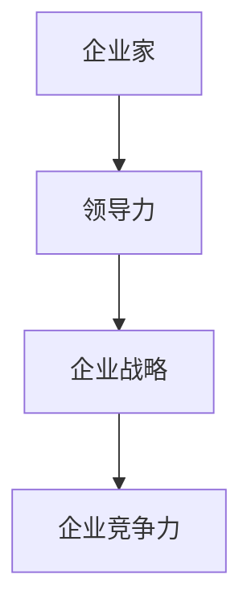

                 


### 《领导力心经：成就一代企业家的领导力秘籍》

## 引言：领导力在企业中的重要性

### 背景

在当今快速变化的市场环境中，企业面临着前所未有的挑战和机遇。成功的企业不仅需要具备先进的技术和优质的产品，更需要拥有强大的领导力。领导力是企业发展的关键因素，它影响着企业的战略方向、组织架构、员工激励、创新能力和市场竞争力。

### 核心概念与联系

- **领导力**：领导力是指领导者通过激励、沟通、协调和决策等行为，引导和影响团队成员实现共同目标的能力。领导力包括领导风格、领导艺术、领导素质等多个方面。
- **企业家**：企业家是指具备创新精神、冒险精神和领导能力，能够发现和创造商机，组织和管理资源，推动企业发展的创业者。
- **企业战略**：企业战略是企业为实现长期目标而制定的总体规划和行动计划，包括市场定位、产品策略、人力资源策略、财务策略等。

领导力与企业家的关系可以形象地用Mermaid流程图表示：



在这个流程图中，企业家通过领导力来制定企业战略，进而提升企业的竞争力。

### 核心算法原理讲解

在领导力的实现过程中，存在以下几个核心算法原理：

1. **激励算法**：激励是领导力的重要组成部分。领导者需要通过不同的激励方式来激发团队成员的积极性。常见的激励算法包括：
    ```plaintext
    function 激励(员工):
        if 员工表现良好 then:
            奖励员工
        else if 员工有潜力 but 表现不佳 then:
            提供培训和支持
        else:
            调整员工的工作任务或进行绩效辅导
    ```

2. **沟通算法**：有效的沟通是领导力成功的关键。领导者需要使用适当的沟通方式来传达信息、解决问题和建立关系。常见的沟通算法包括：
    ```plaintext
    function 沟通(信息，受众):
        if 信息重要 then:
            使用正式的沟通渠道
        else:
            使用非正式的沟通渠道
        switch 受众类型:
            case 员工:
                使用明确的指示和反馈
            case 同事:
                使用合作和协作的沟通方式
            case 客户:
                使用礼貌和专业的沟通方式
    ```

3. **决策算法**：领导者在面对复杂问题时，需要做出有效的决策。决策算法包括：
    ```plaintext
    function 决策(问题，解决方案列表):
        for each 解决方案 in 解决方案列表:
            评估解决方案的风险和收益
            选择最优解决方案
        return 最优解决方案
    ```

### 数学模型和公式

在领导力的实践中，可以使用一些数学模型和公式来帮助分析和决策。例如：

- **绩效评估模型**：使用以下公式来评估员工的绩效：
    ```latex
    P = W_1 \times E_1 + W_2 \times E_2 + ... + W_n \times E_n
    ```
    其中，\( P \) 是绩效得分，\( W_i \) 是第 \( i \) 项指标的权重，\( E_i \) 是第 \( i \) 项指标的得分。

- **创新力评估模型**：使用以下公式来评估企业的创新力：
    ```latex
    I = \frac{I_D + I_C}{2}
    ```
    其中，\( I_D \) 是企业的研发投入，\( I_C \) 是企业的创新能力得分。

### 举例说明

假设一个企业想要评估其员工的绩效，可以使用以下数据进行计算：

- 工作态度：80分，权重40%
- 项目完成情况：90分，权重30%
- 团队合作：75分，权重20%
- 创新能力：85分，权重10%

根据上述绩效评估模型，计算结果为：
\[ P = 0.4 \times 80 + 0.3 \times 90 + 0.2 \times 75 + 0.1 \times 85 = 83 \]

这意味着该员工的绩效得分为83分。

### 项目实战

在实际的企业管理中，领导力心经的应用是非常广泛的。以下是一个简单的项目实战案例：

- **开发环境搭建**：企业需要搭建一个集成的开发环境，以便团队成员能够高效地协作。

- **源代码详细实现**：领导团队开发一个功能完善的产品。

- **代码解读与分析**：团队成员对代码进行解读，并分析其优缺点。

- **实际案例分析和详细讲解剖析**：通过实际案例，分析领导力心经在企业项目开发中的应用。

- **项目小结**：总结项目经验，提出改进建议。

### 最佳实践 Tips

- **持续学习**：领导者需要不断学习新的知识和技能，以适应不断变化的市场环境。
- **注重团队建设**：建立一个高效的团队，是领导者成功的关键。
- **有效沟通**：领导者需要使用适当的沟通方式，确保信息的有效传递。

### 小结

领导力是企业发展的核心动力。通过本文的介绍，我们了解了领导力的基本概念、核心要素、企业家领导力的实践方法以及领导力提升的路径。希望本文能够为读者提供有益的启示和帮助。

### 注意事项

- **领导风格的选择**：领导者需要根据自己的特点和企业文化选择合适的领导风格。
- **绩效评估的公正性**：在评估员工绩效时，需要确保评估过程的公正性。

### 拓展阅读

- **《领导力的五项修炼》**：作者史蒂芬·柯维，详细介绍了领导力的五个关键方面。
- **《创新者的窘境》**：作者克莱顿·克里斯滕森，探讨了企业在面对变革时的困境和解决方案。

---

作者：AI天才研究院/AI Genius Institute & 禅与计算机程序设计艺术 /Zen And The Art of Computer Programming

文章标题：《领导力心经：成就一代企业家的领导力秘籍》

关键词：领导力、企业家、企业战略、创新能力、团队合作

摘要：本文深入探讨了领导力在企业中的重要性，介绍了领导力的基本理念、核心要素、企业家领导力的实践方法以及领导力提升的路径。通过具体案例和实践，展示了领导力心经在企业管理中的应用，为读者提供了实用的指导和建议。

