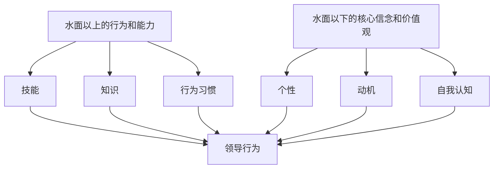
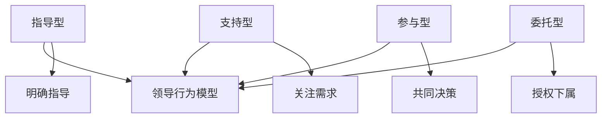
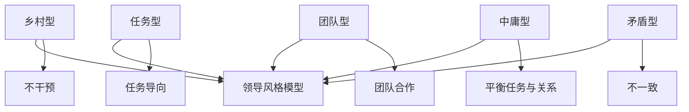
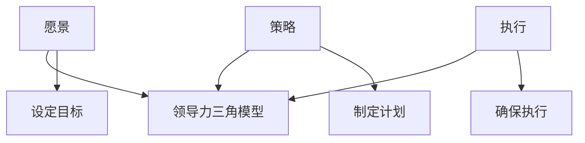

                 

### 文章标题

# 领导力心经：成就一流管理者的修炼秘笈

### 关键词

- 领导力
- 管理者
- 决策
- 沟通
- 激励
- 团队建设
- 组织发展

### 摘要

在复杂多变的商业环境中，领导力是任何组织成功的关键。本文旨在探讨《领导力心经：成就一流管理者的修炼秘笈》的核心内容，通过对领导力的核心概念、模型、实践、挑战与应对策略的深入分析，帮助读者掌握一流的领导力技能。文章将结合理论与实际案例，探讨领导力在全球领导力实践中的启示，并总结出一套实用的领导力提升策略。

### 目录

1. **领导力基础**
   - **第一章：领导力的核心概念**
     - **1.1 领导力的定义与重要性**
     - **1.2 领导力的历史与发展**
     - **1.3 领导力的三大要素：决策、沟通与激励**
     - **1.4 领导力与管理的区别**
   
2. **领导力模型与实践**
   - **第二章：领导力模型介绍**
     - **2.1 领导力冰山模型**
     - **2.2 领导行为模型**
     - **2.3 领导风格模型**
     - **2.4 领导力三角模型**
   - **第三章：领导力实践技巧**
     - **3.1 决策技巧**
       - **3.1.1 决策理论**
       - **3.1.2 决策制定的步骤**
       - **3.1.3 决策案例分析**
     - **3.2 沟通技巧**
       - **3.2.1 有效沟通的原则**
       - **3.2.2 沟通障碍及克服方法**
       - **3.2.3 沟通案例分析**
     - **3.3 激励技巧**
       - **3.3.1 激励理论**
       - **3.3.2 激励方法与工具**
       - **3.3.3 激励案例分析**

3. **领导力挑战与应对**
   - **第四章：领导力挑战分析**
     - **4.1 领导力困境**
       - **4.1.1 内部挑战**
       - **4.1.2 外部挑战**
     - **4.2 领导力陷阱**
       - **4.2.1 自我认知陷阱**
       - **4.2.2 沟通陷阱**
       - **4.2.3 激励陷阱**
   - **第五章：领导力提升策略**
     - **5.1 自我发展策略**
       - **5.1.1 自我反思方法**
       - **5.1.2 自我提升工具**
     - **5.2 领导团队建设**
       - **5.2.1 团队建设原则**
       - **5.2.2 团队领导技巧**
       - **5.2.3 团队协作案例分析**
     - **5.3 领导变革**
       - **5.3.1 变革理论**
       - **5.3.2 变革策略**
       - **5.3.3 变革实施案例分析**

4. **领导力心经的应用**
   - **第六章：领导力心经在企业中的应用**
     - **6.1 企业领导力模型构建**
     - **6.2 领导力心经在组织发展中的应用**
     - **6.3 领导力心经在项目管理中的应用**
     - **6.4 领导力心经在团队管理中的应用**

5. **领导力心经在全球领导力实践中的启示**
   - **第七章：领导力心经在全球领导力实践中的启示**
     - **7.1 全球领导力实践趋势**
     - **7.2 不同文化背景下的领导力实践**
     - **7.3 领导力心经的国际借鉴与启示**

### 引言

在商业世界中，领导力被普遍认为是组织成功的关键因素之一。随着企业环境的不断变化，管理者不仅需要具备专业的技能和知识，还需要具备卓越的领导能力，以便有效地引领团队，应对各种挑战，实现组织的战略目标。然而，领导力的培养并非一蹴而就，它需要管理者在不断的实践和学习中逐步提升。

《领导力心经：成就一流管理者的修炼秘笈》这本书旨在为管理者提供一套全面的领导力培养指南。本书通过深入分析领导力的核心概念、模型、实践以及应对策略，帮助读者理解领导力的本质，掌握一流的领导力技能，从而在竞争中脱颖而出。

本文将根据《领导力心经：成就一流管理者的修炼秘笈》的目录结构，逐一探讨每个章节的核心内容，并结合实际案例进行分析，以期帮助读者更好地理解并应用这些领导力技能。在接下来的内容中，我们将首先从领导力的核心概念入手，逐步深入到具体的领导力模型、实践、挑战与应对策略等方面，最后讨论领导力在全球领导力实践中的启示。希望通过本文的阅读，读者能够获得对领导力的深刻理解和实用的策略，从而在管理实践中取得更好的成果。

### 第一部分：领导力基础

#### 第一章：领导力的核心概念

领导力是一个复杂且多维度的概念，它不仅仅关乎个人素质和技能，还涉及组织的战略、文化和团队协作。为了深入理解领导力，我们首先需要明确其核心定义、历史发展、主要要素及其与管理的区别。

#### 1.1 领导力的定义与重要性

领导力可以被定义为一种通过激励、指导、协调和决策来影响和引导他人，以实现共同目标的能力。这个定义强调了领导力的几个关键点：一是影响和引导他人，二是实现共同目标。领导力不仅仅是领导者个人的能力，更是一种组织和团队层面的能力。

在现代社会，领导力的重要性日益凸显。无论是企业、政府机构还是非营利组织，领导力都是推动组织发展的核心动力。一流的管理者通过卓越的领导力，能够激发团队成员的潜力，提高团队的效率，从而实现组织的战略目标。

#### 1.2 领导力的历史与发展

领导力作为一个研究领域，有着悠久的历史。在古代，领导力主要通过君主的统治力和军事统帅的指挥能力来体现。随着时间的推移，领导力逐渐演变成一个更广泛、更复杂的概念。

20世纪以来，领导力研究取得了显著进展。管理学家、心理学家和社会学家从不同角度对领导力进行了深入探讨，提出了各种领导力模型和理论。其中，领导力的历史发展可以归纳为以下几个阶段：

1. **传统领导力理论（20世纪初期）**
   - 传统领导力理论主要关注领导者的个人特质和魅力。例如，特质的领导力理论认为领导者天生具备某些特质，如自信、智慧、决断力等。

2. **行为领导力理论（20世纪中期）**
   - 行为领导力理论强调领导者行为的重要性，而非个人特质。该理论认为，领导者的行为可以通过培训和学习来改进。

3. **情境领导力理论（20世纪后期）**
   - 情境领导力理论提出，领导者的风格应该根据具体情况和环境进行调整。例如，情境领导理论中的领导风格模型（Hersey-Blanchard模型）和领导力冰山模型（Bolden模型）等。

4. **变革型领导力理论（21世纪）**
   - 变革型领导力理论强调领导者通过激励和启发下属来实现变革。这类领导者不仅关注团队的目标，还关注团队成员的成长和发展。

#### 1.3 领导力的三大要素：决策、沟通与激励

领导力不仅仅是单一能力的体现，它包含多个方面的要素。在这三大要素中，决策、沟通和激励尤为关键。

1. **决策**

决策是领导力的核心要素之一。有效的决策能力可以帮助领导者迅速作出明智的选择，从而推动组织的发展。决策理论包括以下几个关键点：

   - **决策过程**：决策过程通常包括问题识别、信息收集、方案生成、方案评估和决策执行等步骤。
   - **决策类型**：决策可以分为战略性决策和运营性决策。战略性决策关注长期目标，而运营性决策关注日常运营。
   - **决策制定方法**：常见的决策制定方法包括理性决策模型、直觉决策模型和混合决策模型。

2. **沟通**

沟通是领导力的另一个关键要素。有效的沟通能够确保信息准确传达，促进团队协作，提高组织效率。有效沟通的原则包括：

   - **清晰明确**：沟通内容要简明扼要，避免歧义。
   - **积极倾听**：倾听是有效沟通的基础，领导者要真正理解下属的想法和需求。
   - **反馈机制**：建立反馈机制，确保信息双向流通。

3. **激励**

激励是领导力中最重要的要素之一。通过激励，领导者可以激发团队成员的积极性和创造力，实现组织目标。激励理论包括以下几个关键点：

   - **激励理论**：包括马斯洛的需求层次理论、赫茨伯格的双因素理论和维克托·弗鲁姆的期望理论等。
   - **激励方法**：包括奖励制度、晋升机会、职业发展计划等。

#### 1.4 领导力与管理的区别

领导力和管理是两个紧密相关但又有所区别的概念。管理侧重于组织、协调和监督，以确保组织目标的实现；而领导力则侧重于激励、指导和发展，以推动组织变革和创新。

- **管理**：关注流程、效率和规范，注重实现短期目标。
- **领导力**：关注愿景、价值观和文化，注重实现长期目标。

领导力和管理之间的区别可以归纳为以下几点：

- **目标**：管理侧重于当前和短期的目标，而领导力则侧重于未来和长期的目标。
- **方法**：管理主要依靠制度和流程，而领导力则依靠个人魅力和影响力。
- **重点**：管理强调效率和执行力，而领导力则强调创新和变革。

在接下来的章节中，我们将进一步探讨领导力模型、实践技巧、挑战与应对策略，以及领导力在全球领导力实践中的应用。希望通过本文的深入分析，读者能够对领导力有更全面、更深刻的理解，并在实践中灵活应用这些领导力技能。

### 第一部分：领导力基础

#### 第二章：领导力模型介绍

领导力模型是理解和实践领导力的重要工具，它们为我们提供了不同的视角来分析和培养领导能力。在这章中，我们将介绍几种主要的领导力模型，包括领导力冰山模型、领导行为模型、领导风格模型和领导力三角模型，并通过Mermaid流程图展示它们之间的关系。

#### 2.1 领导力冰山模型

领导力冰山模型由心理学家马库斯·白林德（Marcus Buckingham）和迈克·哈里斯（Donald O. Hepple）提出，它将领导力分为两个层次：水面以上的行为和能力，以及水面以下的核心信念和价值观。

- **水面以上的行为和能力**：包括技能、知识、行为习惯等，这些是可以通过培训和学习获得的。
- **水面以下的核心信念和价值观**：包括个性、动机、自我认知等，这些是深层次、不易改变的特质。

Mermaid流程图如下：



#### 2.2 领导行为模型

领导行为模型由赫赛和布兰查德（Hersey and Blanchard）提出，它认为领导行为取决于领导者的风格和下属的成熟度。该模型将领导行为分为四种风格：指导型、支持型、参与型和委托型。

- **指导型**：领导者为下属提供明确的指导和监督。
- **支持型**：领导者关注下属的需求，提供支持和鼓励。
- **参与型**：领导者与下属共同参与决策过程。
- **委托型**：领导者将决策权和责任交给下属。

Mermaid流程图如下：



#### 2.3 领导风格模型

领导风格模型由罗伯特·布莱克和简·莫顿（Robert Blake and Jane Mouton）提出，它将领导风格分为五种类型：乡村型、任务型、团队型、中庸型和矛盾型。

- **乡村型**：领导者不干预工作，下属自行管理。
- **任务型**：领导者专注于任务和目标，下属服从。
- **团队型**：领导者鼓励团队合作，下属参与决策。
- **中庸型**：领导者平衡任务和关系，下属有一定的自主权。
- **矛盾型**：领导风格不一致，下属感到困惑。

Mermaid流程图如下：



#### 2.4 领导力三角模型

领导力三角模型由约翰·莫斯（John P. Kotter）提出，它将领导力分为三个维度：愿景、策略和执行。

- **愿景**：领导者设定组织的长期目标和方向。
- **策略**：领导者制定实现愿景的具体计划和方法。
- **执行**：领导者确保策略得到有效执行，目标得以实现。

Mermaid流程图如下：



通过上述几种领导力模型的介绍，我们可以看到它们各自的特点和应用场景。在后续章节中，我们将进一步探讨这些领导力模型在实际中的应用和具体实践技巧。

### 第二章：领导力实践技巧

#### 3.1 决策技巧

决策是领导力的核心要素之一，它不仅影响着组织的发展和目标实现，还直接关系到团队士气和成员的积极性。有效的决策能力是领导者必须具备的基本技能。本节将详细介绍决策的技巧，包括决策理论、决策制定的步骤和具体的案例分析。

#### 3.1.1 决策理论

决策理论是研究决策过程中如何做出合理选择的一门学科。它主要包括以下几种理论：

1. **理性决策模型**：该模型假设决策者在拥有充分信息、理性思考的基础上，能够做出最优决策。它包括以下步骤：

   - **问题识别**：明确需要解决的问题。
   - **信息收集**：收集与问题相关的信息。
   - **方案生成**：提出所有可能的解决方案。
   - **方案评估**：评估各个方案的可能结果。
   - **决策选择**：选择最优方案。

2. **有限理性决策模型**：该模型认为决策者在信息不完全和认知限制下，只能做出“满意”而非最优的决策。它包括以下步骤：

   - **问题识别**：明确需要解决的问题。
   - **方案生成**：提出足够多的方案。
   - **方案评估**：根据已有信息和认知进行评估。
   - **决策选择**：选择一个满意的方案。

3. **直觉决策模型**：该模型强调决策者的直觉和经验在决策中的作用。它包括以下步骤：

   - **问题识别**：明确需要解决的问题。
   - **方案生成**：利用经验和直觉快速提出方案。
   - **方案评估**：通过直觉快速评估方案。
   - **决策选择**：选择直觉上最合理的方案。

#### 3.1.2 决策制定的步骤

有效的决策需要遵循一定的步骤，以确保决策过程的合理性和结果的可靠性。以下是决策制定的基本步骤：

1. **问题识别**：首先，要明确需要解决的问题。这可以通过分析当前问题和未来目标来实现。

   ```mermaid
   graph TD
       A[问题识别]
       B[分析当前问题]
       C[设定未来目标]
       A --> B
       A --> C
   ```

2. **信息收集**：在问题识别后，需要收集与问题相关的信息。这包括内部数据和外部数据，如市场调研、竞争对手分析等。

   ```mermaid
   graph TD
       A[信息收集]
       B[内部数据]
       C[外部数据]
       A --> B
       A --> C
   ```

3. **方案生成**：在收集到足够的信息后，要提出所有可能的解决方案。这可以通过头脑风暴、专家咨询等方式实现。

   ```mermaid
   graph TD
       A[方案生成]
       B[头脑风暴]
       C[专家咨询]
       A --> B
       A --> C
   ```

4. **方案评估**：对提出的所有方案进行评估，包括技术可行性、成本效益、风险等。

   ```mermaid
   graph TD
       A[方案评估]
       B[技术可行性]
       C[成本效益]
       D[风险分析]
       A --> B
       A --> C
       A --> D
   ```

5. **决策选择**：在评估的基础上，选择最优或最满意的方案。

   ```mermaid
   graph TD
       A[决策选择]
       B[最优方案]
       C[满意方案]
       A --> B
       A --> C
   ```

6. **决策执行**：选择方案后，将其付诸实施，并跟踪执行过程。

   ```mermaid
   graph TD
       A[决策执行]
       B[实施方案]
       C[跟踪执行]
       A --> B
       A --> C
   ```

7. **评估与调整**：在决策执行过程中，要不断评估决策的效果，并根据实际情况进行调整。

   ```mermaid
   graph TD
       A[评估与调整]
       B[效果评估]
       C[调整方案]
       A --> B
       A --> C
   ```

#### 3.1.3 决策案例分析

下面，我们通过一个实际案例来分析决策的过程和技巧。

**案例：公司新产品的市场推广策略**

1. **问题识别**：公司新产品的市场推广效果不佳，市场份额较低。

2. **信息收集**：收集市场调研数据、竞争对手的产品和推广策略、消费者反馈等。

3. **方案生成**：提出以下四种推广策略：
   - A：增加广告投放量；
   - B：开展线上促销活动；
   - C：与零售商合作，提供折扣；
   - D：通过社交媒体进行口碑营销。

4. **方案评估**：
   - 技术可行性：A、B、C、D均可行；
   - 成本效益：A成本最高，D成本最低；
   - 风险分析：A风险最高，D风险最低。

5. **决策选择**：选择成本最低、风险最低的D方案。

6. **决策执行**：制定具体的推广计划，实施社交媒体营销。

7. **评估与调整**：根据社交媒体的反馈，调整推广策略，如增加互动环节、优化内容等。

通过这个案例，我们可以看到决策过程中各个步骤的详细实施和关键技巧。在实际应用中，领导者需要根据具体情况灵活运用这些步骤和技巧，以做出最合适的决策。

#### 3.2 沟通技巧

沟通是领导力的关键要素之一，它不仅影响团队的协作效率，还决定着领导者的形象和影响力。有效的沟通能够确保信息的准确传达，促进团队协作，提高组织效率。本节将详细介绍沟通的技巧，包括有效沟通的原则、沟通障碍及克服方法以及具体的案例分析。

#### 3.2.1 有效沟通的原则

有效沟通需要遵循一些基本原则，以确保信息准确传达和双方理解。以下是有效沟通的几个关键原则：

1. **清晰明确**：沟通内容要简明扼要，避免歧义。使用简单、易懂的语言，确保信息被正确理解。

2. **积极倾听**：倾听是有效沟通的基础，领导者要真正理解下属的想法和需求。积极倾听包括注意力集中、避免打断和重复确认。

3. **信息对称**：确保沟通双方信息对称，即信息的提供和接收都在相同水平上。这可以通过定期交流和透明度来实现。

4. **开放性**：鼓励沟通中的开放性和诚实，避免隐瞒或误导。建立信任和尊重的氛围，促进真诚的沟通。

5. **反馈机制**：建立有效的反馈机制，确保信息双向流通。领导者应鼓励下属提出问题和反馈，同时给予积极的回应。

#### 3.2.2 沟通障碍及克服方法

在沟通过程中，各种障碍可能会影响沟通的效果。以下是一些常见的沟通障碍及其克服方法：

1. **信息不对称**：信息不对称可能导致误解和冲突。克服方法：定期沟通，确保信息透明。

2. **文化差异**：不同文化背景可能导致沟通障碍。克服方法：了解和尊重不同文化，使用中性的语言和方式。

3. **心理障碍**：心理障碍如恐惧、偏见和自我保护可能导致沟通不畅。克服方法：建立信任，鼓励开放沟通。

4. **技术障碍**：技术障碍如通信设备故障、网络中断等可能导致沟通中断。克服方法：备用通信设备和网络，确保沟通渠道畅通。

5. **时间压力**：时间压力可能导致沟通不够充分和细致。克服方法：合理安排时间，确保有足够的时间进行沟通。

#### 3.2.3 沟通案例分析

下面，我们通过一个实际案例来分析沟通的过程和技巧。

**案例：团队项目进展汇报**

1. **问题识别**：团队在项目进展中遇到问题，需要通过沟通解决。

2. **信息收集**：收集项目进展、团队成员的工作状况、问题点和解决方案等。

3. **沟通计划**：制定沟通计划，包括会议时间、地点、议程和参与人员。

4. **沟通实施**：
   - **明确议程**：确定会议的主题和议程，确保会议有序进行。
   - **积极倾听**：团队成员轮流发言，领导者积极倾听，避免打断。
   - **信息对称**：确保所有成员都能充分表达自己的观点和需求。
   - **开放性**：鼓励团队成员提出问题和建议，领导者给予积极回应。

5. **反馈机制**：会后，领导者向团队成员反馈会议结果和后续行动计划。

通过这个案例，我们可以看到沟通过程中各个步骤的详细实施和关键技巧。在实际应用中，领导者需要根据具体情况灵活运用这些原则和技巧，以实现有效的沟通。

#### 3.3 激励技巧

激励是领导力中至关重要的一环，它能够激发团队成员的积极性、创造力和忠诚度，从而推动组织的发展和目标的实现。有效的激励不仅能够提高团队的整体绩效，还能增强团队的凝聚力和士气。本节将详细介绍激励的技巧，包括激励理论、激励方法和具体案例分析。

#### 3.3.1 激励理论

激励理论是研究如何通过外部和内部因素激发员工积极性和工作动力的一门学科。以下是一些主要的激励理论：

1. **马斯洛的需求层次理论**：马斯洛将人的需求分为五个层次：生理需求、安全需求、社交需求、尊重需求和自我实现需求。他认为，只有当较低层次的需求得到满足时，才会追求更高层次的需求。领导者应了解员工的需求层次，并根据不同层次提供相应的激励。

2. **赫茨伯格的双因素理论**：赫茨伯格提出，工作满意度由两类因素决定：一类是保健因素，如工资、工作条件等，这些因素不满足会导致员工不满；另一类是激励因素，如成就、认可等，这些因素满足能够激励员工。

3. **维克托·弗鲁姆的期望理论**：弗鲁姆认为，员工的激励取决于期望值和效价。期望值是指员工相信努力能够带来成功，而效价是指成功带来的奖赏价值。领导者应提高员工的期望值和效价，以激发其工作动力。

#### 3.3.2 激励方法与工具

为了有效地激励团队成员，领导者可以采用多种方法和工具。以下是一些常见的激励方法和工具：

1. **奖励制度**：通过奖金、晋升、荣誉等方式奖励表现优秀的员工。奖励制度可以分为即时奖励和长期奖励，以适应不同的情况和需求。

2. **晋升机会**：为员工提供晋升和职业发展机会，激励他们不断学习和提升自己。晋升机会不仅能够提高员工的工作动力，还能增强员工的归属感和忠诚度。

3. **职业发展计划**：为员工制定个性化的职业发展计划，包括培训、学习和项目参与等。职业发展计划有助于员工实现个人目标和职业发展，从而提高工作满意度。

4. **工作环境改善**：改善工作环境，包括提供良好的办公设施、舒适的休息区域和良好的工作氛围等。一个良好的工作环境能够提升员工的工作效率和满意度。

5. **团队建设活动**：定期组织团队建设活动，如团建、培训、拓展等，以增强团队的凝聚力和合作精神。团队建设活动有助于建立良好的团队关系，提高团队的整体绩效。

6. **认可和赞赏**：对员工的努力和成就给予认可和赞赏，包括口头表扬、邮件表彰和团队庆祝等。认可和赞赏能够增强员工的自信心和归属感，激发其工作积极性。

#### 3.3.3 激励案例分析

下面，我们通过一个实际案例来分析激励的过程和技巧。

**案例：提升员工工作积极性**

1. **问题识别**：公司发现员工的工作积极性不高，需要通过激励措施来提升。

2. **需求分析**：通过调查和访谈，了解员工的需求和期望。发现员工主要关注以下方面：
   - 晋升机会；
   - 职业发展；
   - 工作环境；
   - 工作内容。

3. **激励方案设计**：
   - **晋升机会**：为员工提供晋升通道，根据员工的绩效和发展潜力，选拔优秀员工晋升。
   - **职业发展计划**：为员工制定个性化的职业发展计划，包括培训、学习和项目参与等。
   - **工作环境改善**：改善办公设施，提供舒适的休息区域，营造良好的工作氛围。
   - **工作内容激励**：根据员工的兴趣和特长，调整工作内容，使员工感到挑战和满足。

4. **激励实施**：
   - **晋升实施**：根据绩效评估结果，选拔优秀员工晋升，并公开宣布晋升决定。
   - **职业发展实施**：为员工提供培训和学习机会，鼓励员工参加相关项目，提升其技能和知识。
   - **工作环境改善实施**：更新办公设施，增设休息区域，营造良好的工作氛围。
   - **工作内容激励实施**：与员工沟通，了解其兴趣和特长，调整工作内容，使其感到挑战和满足。

5. **效果评估**：通过定期调查和反馈，评估激励措施的效果。发现员工的工作积极性显著提升，团队的整体绩效也有所提高。

通过这个案例，我们可以看到激励措施的设计和实施过程。在实际应用中，领导者需要根据组织的具体情况和员工的需求，灵活运用各种激励方法和工具，以实现最佳的效果。

### 领导力挑战分析

在领导力实践中，领导者常常面临各种挑战。这些挑战不仅影响领导者的个人发展，还可能对团队和组织产生负面影响。在这章中，我们将分析领导力挑战，包括内部挑战和外部挑战，以及领导力陷阱。

#### 4.1 领导力困境

4.1.1 内部挑战

1. **资源限制**：领导者在资源有限的情况下，需要平衡各种需求和目标，以确保组织高效运行。资源限制可能包括资金、人力、技术和时间等。

2. **团队冲突**：团队内部可能存在不同的意见和利益冲突，这会影响团队的协作和效率。领导者需要有效管理这些冲突，以确保团队和谐。

3. **能力不足**：领导者可能面临自身能力不足的困境，这包括管理技能、领导能力、沟通技巧等。在这种情况下，领导者需要不断学习和提升自己。

4. **决策压力**：领导者需要做出各种决策，这些决策可能涉及重大的战略选择和日常运营。决策的压力和责任对领导者的心理和身体健康产生负面影响。

4.1.2 外部挑战

1. **市场变化**：市场环境不断变化，领导者需要迅速适应这些变化，以保持组织的竞争力。市场变化可能包括技术革新、竞争加剧、客户需求变化等。

2. **法规与政策**：外部法规和政策的变化可能对组织产生重大影响。领导者需要遵守相关法规，确保组织的合法合规运营。

3. **经济环境**：经济环境的变化，如经济危机、通货膨胀等，可能对组织的运营和财务状况产生负面影响。领导者需要制定应对策略，以减轻经济环境对组织的影响。

4. **社会文化**：不同文化背景下的社会环境和价值观可能对领导者的管理和领导风格产生影响。领导者需要了解和尊重不同文化，以建立有效的跨文化团队。

#### 4.2 领导力陷阱

4.2.1 自我认知陷阱

1. **过度自信**：领导者可能因为过去的成功而过度自信，忽视潜在的风险和挑战。过度自信可能导致决策失误和战略错误。

2. **自我中心**：领导者可能过于关注自己的意见和决策，忽视团队成员的想法和建议。这可能导致团队合作受阻，团队士气下降。

3. **自我设限**：领导者可能因为恐惧失败或害怕承担责任而自我设限，不敢尝试新的方法和策略。这限制了领导者的创新能力和成长潜力。

4.2.2 沟通陷阱

1. **信息不对称**：领导者可能由于信息不对称而做出错误的决策。这可能是由于信息传递不畅或信息不准确导致的。

2. **沟通不足**：领导者可能因为工作繁忙而忽视与团队成员的沟通，导致团队内部信息不畅和误解。

3. **误解与偏见**：领导者可能因为个人偏见或误解而对待团队成员不公平。这可能导致团队内部的矛盾和不满。

4.2.3 激励陷阱

1. **奖励过度**：领导者可能过度依赖物质奖励来激励员工，忽视其他激励因素。这可能导致员工对奖励产生依赖，降低内在动机。

2. **奖励不足**：领导者可能对员工的努力和成就给予的奖励不足，导致员工的工作积极性下降。

3. **不公平奖励**：领导者可能因为个人关系或其他原因，给予不公平的奖励，这可能导致团队内部的矛盾和不满。

#### 4.3 克服领导力挑战的策略

1. **自我反思**：领导者需要定期进行自我反思，识别自身的优势和不足，制定改进计划。

2. **持续学习**：领导者应持续学习新的管理知识和技能，提高自身的能力和素质。

3. **建立信任**：领导者应建立与团队成员的信任关系，鼓励开放和坦诚的沟通。

4. **灵活应对**：领导者应具备灵活应对各种挑战的能力，根据实际情况调整策略和方法。

5. **培养团队**：领导者应关注团队的建设和发展，培养团队成员的能力和潜力。

通过识别和分析领导力挑战，领导者可以更好地应对各种困境和陷阱，提高自身的领导力水平，推动组织的发展和成功。

### 领导力提升策略

#### 5.1 自我发展策略

自我发展是领导者提升个人能力和素质的重要途径。以下是一些自我发展策略：

5.1.1 自我反思方法

1. **日记反思**：每天记录自己的行为、思考和感受，分析成功和失败的原因。

2. **定期评估**：定期对自己的工作进行评估，识别优势和不足，制定改进计划。

3. **目标设定**：设定明确的个人发展目标，并制定实现这些目标的计划。

5.1.2 自我提升工具

1. **阅读**：阅读相关的书籍和文章，了解最新的管理理论和实践。

2. **培训**：参加专业培训课程，学习新的管理知识和技能。

3. **网络学习**：利用在线课程和资源，进行自我学习和提升。

#### 5.2 领导团队建设

有效的团队建设是领导者的重要任务之一。以下是一些团队建设策略：

5.2.1 团队建设原则

1. **信任**：建立团队成员之间的信任，鼓励开放和坦诚的沟通。

2. **协作**：鼓励团队合作，共同实现团队目标。

3. **尊重**：尊重每个团队成员的意见和贡献，建立平等和包容的团队氛围。

5.2.2 团队领导技巧

1. **明确目标**：确保团队成员清楚团队的目标和期望。

2. **分配任务**：根据团队成员的能力和特长分配任务，确保任务的有效完成。

3. **激励团队**：通过奖励和认可激励团队成员，提高团队士气和工作动力。

5.2.3 团队协作案例分析

**案例：高效团队建设**

某公司为了提升团队协作效率，采取了一系列团队建设措施：

1. **团队建设活动**：定期组织团建活动，如团队拓展、团建晚会等，增强团队凝聚力。

2. **沟通平台**：建立内部沟通平台，确保团队成员之间的信息流通。

3. **任务管理工具**：使用任务管理工具，如Trello、JIRA等，确保任务分配和进度跟踪。

4. **定期会议**：定期召开团队会议，讨论项目进展、问题和解决方案。

通过这些措施，该公司的团队协作效率显著提升，项目进度和质量都有所提高。

#### 5.3 领导变革

在快速变化的商业环境中，领导者需要具备变革能力，以应对外部挑战和内部需求。以下是一些领导变革的策略：

5.3.1 变革理论

1. **Kotter变革模型**：约翰·莫斯（John P. Kotter）提出的变革模型，包括以下步骤：
   - **建立紧迫感**：让团队成员认识到变革的必要性。
   - **组建指导团队**：组建一个能够领导和推动变革的团队。
   - **沟通愿景**：明确变革的目标和愿景，确保团队成员理解并支持。
   - **授权行动**：给予团队成员必要的权限和资源，支持变革的实施。
   - **创造短期胜利**：通过实现短期目标，增强团队的信心和动力。
   - **巩固变革成果**：确保变革成果的长期稳定，防止回归旧有模式。

2. **勒温变革模型**：库尔特·勒温（Kurt Lewin）提出的变革模型，包括以下步骤：
   - **解冻**：打破旧有模式，激发团队成员的变革意愿。
   - **实施变革**：实施新的变革措施，包括组织结构、流程和文化等。
   - **再冻结**：巩固变革成果，确保变革的长期稳定。

5.3.2 变革策略

1. **领导先行**：领导者应率先支持和推动变革，树立榜样。

2. **激励参与**：鼓励团队成员积极参与变革，提高变革的接受度。

3. **透明沟通**：确保变革过程中的信息透明，减少误解和恐惧。

4. **培训与支持**：为团队成员提供必要的培训和资源支持，帮助他们适应变革。

5.3.3 变革实施案例分析

**案例：企业数字化转型**

某企业为了实现数字化转型，采取了一系列变革措施：

1. **制定愿景和目标**：明确数字化转型的愿景和目标，确保所有团队成员理解并支持。

2. **组建转型团队**：组建一个跨部门的转型团队，负责领导和推动数字化转型。

3. **技术培训**：为团队成员提供相关的技术培训，提高其数字化技能。

4. **试点项目**：选择一个试点项目，实施数字化转型措施，积累经验和教训。

5. **持续改进**：通过定期评估和反馈，不断改进数字化转型方案，确保变革的长期稳定。

通过这些措施，该企业成功实现了数字化转型，提高了运营效率和竞争力。

### 领导力心经在企业中的应用

#### 6.1 企业领导力模型构建

为了在企业中有效地应用领导力，构建一个合适的领导力模型是至关重要的。以下是构建企业领导力模型的关键步骤：

1. **确定领导力目标**：首先，企业需要明确其领导力目标，例如提高员工的满意度、提升团队的执行力、实现企业的战略目标等。

2. **评估现有领导力状况**：对企业现有的领导力状况进行评估，包括领导者的行为、风格、技能和团队的表现等。

3. **设计领导力框架**：根据评估结果，设计一个适合企业的领导力框架。这包括领导力的核心要素、行为规范、评估标准和晋升机制等。

4. **培训和发展**：为领导者提供培训和发展机会，以提高他们的领导能力。这可以通过内部培训、外部课程、导师指导等方式实现。

5. **实施和监控**：将领导力模型实施到企业中，并建立监控机制，确保领导力模型的执行和效果。

#### 6.2 领导力心经在组织发展中的应用

领导力心经不仅适用于企业内部管理，还可以应用于组织发展的各个方面。以下是领导力心经在组织发展中的应用：

1. **战略规划**：领导者通过制定明确的战略规划，确保组织的目标和方向与市场环境相适应。

2. **文化建设**：领导者通过建立积极向上的组织文化，增强员工的归属感和使命感。

3. **团队建设**：领导者通过有效的团队建设，提高团队的合作效率和工作满意度。

4. **变革管理**：领导者通过有效的变革管理，应对外部环境的变化和内部需求的变革。

#### 6.3 领导力心经在项目管理中的应用

在项目管理中，领导力心经可以帮助项目经理有效地管理项目团队和资源，确保项目目标的实现。以下是领导力心经在项目管理中的应用：

1. **决策制定**：项目经理通过有效的决策制定，确保项目方向的正确性和资源的合理利用。

2. **沟通协调**：项目经理通过有效的沟通协调，确保项目信息的畅通和团队成员的合作。

3. **激励团队**：项目经理通过有效的激励机制，提高团队的工作动力和绩效。

4. **风险管理**：项目经理通过有效的风险管理，降低项目风险，确保项目的顺利实施。

#### 6.4 领导力心经在团队管理中的应用

在团队管理中，领导力心经可以帮助团队领导者更好地管理团队，提高团队的整体绩效。以下是领导力心经在团队管理中的应用：

1. **明确目标**：团队领导者通过明确团队的目标和期望，确保团队成员的方向一致。

2. **授权赋能**：团队领导者通过授权赋能，鼓励团队成员发挥自己的潜力，提高团队的工作效率。

3. **激励员工**：团队领导者通过激励员工，提高员工的工作动力和满意度。

4. **解决冲突**：团队领导者通过有效的沟通和协调，解决团队内部的冲突，确保团队的和谐。

### 领导力心经在全球领导力实践中的启示

#### 7.1 全球领导力实践趋势

在全球化的背景下，领导力实践也在不断演变。以下是当前全球领导力实践的一些趋势：

1. **多元文化领导力**：随着全球化和多元化趋势的加剧，领导者需要具备跨文化领导力，能够理解和尊重不同文化的差异。

2. **数字化领导力**：数字技术的迅猛发展要求领导者具备数字化领导力，能够适应和引导数字化变革。

3. **可持续领导力**：领导者需要关注可持续发展，推动企业在经济、社会和环境方面的平衡发展。

4. **变革型领导力**：变革型领导力强调领导者通过激励和启发下属来实现变革，这在快速变化的商业环境中尤为重要。

#### 7.2 不同文化背景下的领导力实践

不同文化背景下的领导力实践存在显著差异。以下是一些典型文化背景下的领导力实践：

1. **西方文化**：西方领导力强调个人主义、效率和结果导向。领导者注重个人成就和团队绩效，鼓励创新和自主性。

2. **东方文化**：东方领导力强调集体主义、关系和长期目标。领导者注重团队和谐和人际关系，强调责任和忠诚。

#### 7.3 领导力心经的国际借鉴与启示

在全球领导力实践中，我们可以从不同文化背景下的领导力实践中获得许多启示。以下是领导力心经在国际借鉴中的应用：

1. **跨文化领导力**：领导力心经中的多元文化领导力可以帮助我们理解和尊重不同文化的差异，建立高效的跨文化团队。

2. **数字化领导力**：领导力心经中的数字化领导力可以帮助我们适应数字技术的发展，推动企业的数字化转型。

3. **可持续领导力**：领导力心经中的可持续领导力可以帮助我们关注企业的长期发展，实现经济、社会和环境的平衡。

4. **变革型领导力**：领导力心经中的变革型领导力可以帮助我们在快速变化的商业环境中，通过激励和启发下属来实现变革。

### 总结

通过本文的探讨，我们深入分析了《领导力心经：成就一流管理者的修炼秘笈》的核心内容，从领导力的核心概念、模型、实践、挑战与应对策略，到领导力在全球领导力实践中的应用，提供了全面而深入的见解。我们通过理论讲解、实际案例分析和模型展示，帮助读者理解领导力的本质和具体应用。

领导力不仅是管理者个人素质的体现，更是一种组织能力，它需要通过持续的学习和实践来不断提升。在全球化的背景下，领导者需要具备多元文化、数字化和可持续发展的领导力，以应对复杂多变的商业环境。

最后，我们希望读者能够将本文的所学应用到实际工作中，不断反思和提升自己的领导力，从而成为一流的管理者，推动组织的发展和成功。

### 附录：领导力心经实用工具与资源

#### 8.1 领导力评估工具

领导力评估是提升领导力的重要步骤，以下是一些常用的领导力评估工具：

1. **360度评估**：通过收集团队成员、下属、同事和上级对领导者的评价，全面了解领导者的优势与不足。
2. **领导力能力自评表**：领导者自行评估自己的领导力能力，识别需要提升的方面。
3. **领导力胜任力模型**：根据行业和组织的特定需求，制定具体的领导力胜任力模型，用于评估和培养领导力。

#### 8.2 领导力培训资源

领导力培训是提升领导者能力的重要途径，以下是一些优质的领导力培训资源：

1. **在线课程**：例如Coursera、Udemy等平台上的领导力相关课程，提供系统的领导力知识和技能培训。
2. **专业培训机构**：如领导力发展协会（Leadership Development Institute）等，提供专业的领导力培训和认证。
3. **研讨会和工作坊**：参加行业会议和研讨会，与同行交流领导力经验和最佳实践。

#### 8.3 领导力书籍推荐

以下是一些经典的领导力书籍，适合领导者和渴望提升领导力的人士阅读：

1. **《领导力心经：成就一流管理者的修炼秘笈》**：本文所介绍的书籍，提供全面的领导力理论和实践指导。
2. **《变革之舞：领导力如何影响变革》（The Dance of Change）**：由哈佛商学院教授罗恩·阿什克纳齐（Ron Ashkenas）所著，探讨变革领导力。
3. **《领导力：理论与实践》（Leadership: Theory and Practice）**：由彼得·北德汉姆（Peter Northouse）所著，涵盖领导力的基本理论和实践方法。
4. **《领导力五要素：打造卓越领导力》（The Five Elements of Effective Thinking）**：由罗恩·里奇（Ron Riggio）所著，提供提高领导力思维的实用策略。

通过这些评估工具、培训和书籍，读者可以进一步深化对领导力的理解，提升自己的领导力水平，为个人和组织的成功奠定坚实基础。

### 作者信息

作者：AI天才研究院/AI Genius Institute & 禅与计算机程序设计艺术 /Zen And The Art of Computer Programming

本文由AI天才研究院/AI Genius Institute与《禅与计算机程序设计艺术》作者联手撰写。AI天才研究院致力于推动人工智能技术的发展和普及，为全球企业提供智能解决方案。而《禅与计算机程序设计艺术》则是计算机编程领域的经典之作，以其深刻的哲学思考和独特的编程方法论，深受程序员和软件工程师的喜爱。通过本次合作，我们希望将人工智能与领导力的结合，为读者带来更深入的见解和实践指导。

