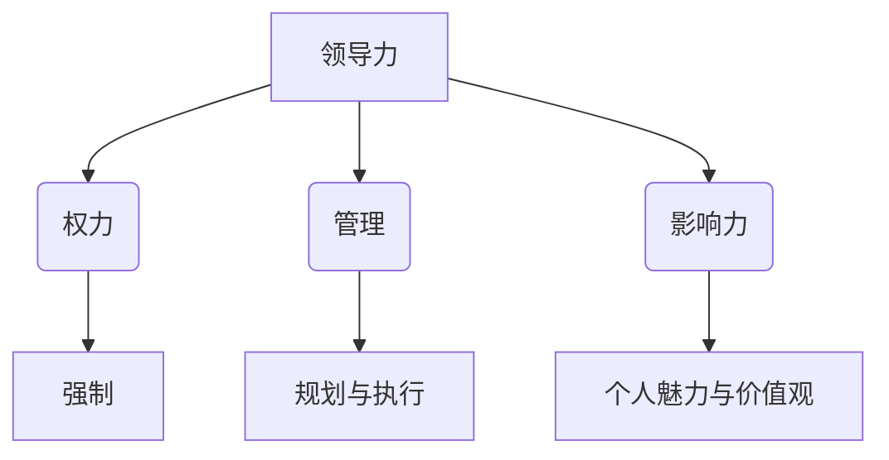

                 

# 领导力心经：成就不凡企业的领导者法则

## 关键词
领导力，企业成功，核心能力，团队管理，创新，个人成长，企业文化

## 摘要
本文旨在探讨领导者如何通过掌握核心能力、理解组织架构、促进创新、关注个人成长、管理团队和塑造企业文化，来实现企业的不凡成就。通过逐步分析领导力的基础概念、核心能力、组织实践、创新、个人成长、团队管理和企业文化，本文为领导者提供了实用的法则和策略，以应对复杂多变的商业环境。

## 引言
领导力是企业成功的关键因素之一。在当今快速变化的商业环境中，领导者不仅需要具备传统管理技能，还必须具备适应变化、推动创新和引领团队的能力。本文将系统地探讨领导力的各个方面，帮助读者理解领导力的本质，并掌握提升领导力的关键法则。

## 领导力的基础概念
### 1.1 领导力的定义
领导力是一种影响力，能够引导和激励他人为实现共同目标而努力。它与权力不同，权力是地位赋予的，而领导力则是基于个人魅力和能力的自然延伸。领导力不仅仅是管理，更是一种艺术，一种能够创造卓越绩效的能力。

### 1.2 领导力的重要性
领导力对于企业成功至关重要。它能够提升组织的协作效率，激发员工的潜能，推动创新，并实现企业的战略目标。一个优秀的领导者能够帮助企业应对挑战，抓住机遇，保持持续的竞争力。

### 1.3 领导力的历史发展
领导力作为一个研究领域，经历了从传统领导学到现代领导力的发展。早期的领导力研究主要关注领导者的特质和行为，而现代领导力研究则更注重领导者的情境适应性和影响力。

### 1.4 领导力与管理的区别
领导力与管理虽然密切相关，但两者有所区别。管理侧重于规划、组织、协调和控制，以确保组织的日常运作。而领导力则侧重于激励和引导，通过建立愿景、塑造文化和推动变革，引领组织走向成功。

## 领导力的核心能力
### 2.1 沟通能力
沟通能力是领导力的核心能力之一。有效的沟通不仅能够传达信息，还能够建立信任、激发热情和促进协作。领导者在沟通时需要注意倾听、清晰表达和反馈。

### 2.2 决策能力
决策能力是领导者的一项关键技能。领导者需要在复杂多变的环境中迅速做出正确的决策。这需要领导者具备分析问题的能力、预测未来的能力以及承担决策后果的勇气。

### 2.3 影响力
影响力是领导力的重要组成部分。领导者通过自身的行为和价值观影响他人，引导他们为实现共同目标而努力。提升影响力需要领导者具备卓越的沟通能力和建立信任的能力。

### 2.4 情绪智力
情绪智力是领导者成功的关键。情绪智力包括自我意识、自我管理、社交意识和关系管理。领导者需要能够理解和管理自己的情绪，同时能够识别和理解他人的情绪。

## 领导力在组织中的实践
### 3.1 组织架构与领导力
组织架构是领导力实践的基础。领导者需要根据组织的使命和目标设计合适的组织架构，并确保组织架构能够支持领导力的有效实施。

### 3.2 领导力与组织文化
组织文化是领导者塑造的重要成果。领导者需要通过自身的言行和价值观念来塑造积极的组织文化，鼓励创新、协作和诚信。

### 3.3 领导力在变革中的角色
变革是组织发展的必然过程。领导者需要在变革中扮演关键角色，通过明确变革的方向、沟通变革的意义和激发员工的积极性，推动变革的顺利进行。

### 3.4 领导力与战略规划
战略规划是组织发展的指南。领导者需要通过制定和实施有效的战略规划，确保组织能够实现长期目标。这需要领导者具备前瞻性思维和决策能力。

## 领导力与创新
### 4.1 创新的重要性
创新是组织保持竞争力的关键。领导者需要重视创新，并将其作为组织战略的重要组成部分。

### 4.2 领导力与创新文化
领导者需要塑造鼓励创新的组织文化，提供创新所需的资源和环境，并激励员工敢于尝试和失败。

### 4.3 创新过程中的领导力
在创新过程中，领导者需要发挥关键作用，引导团队克服困难，实现创新目标。

### 4.4 领导力与技术创新
领导者需要关注技术创新，通过引进新技术、改进现有技术，推动组织的持续发展。

## 领导力与个人成长
### 5.1 自我认知
领导者需要通过自我认知了解自己的优点和缺点，从而更好地发挥自身潜力。

### 5.2 成长心态
领导者需要具备成长心态，持续学习和提升自己的能力。

### 5.3 自我反思与持续学习
领导者需要通过自我反思和持续学习，不断改进自己的领导风格和方法。

### 5.4 领导力与心理健康
领导者的心理健康直接影响领导效果。领导者需要关注自身的心理健康，保持积极的心态。

## 领导力与团队管理
### 6.1 团队建设
领导者需要通过有效的团队建设，提高团队协作效率和绩效。

### 6.2 领导力与团队动力
领导者需要激发团队动力，鼓励团队成员为实现共同目标而努力。

### 6.3 冲突管理
领导者需要掌握冲突管理技能，以避免冲突对组织造成的负面影响。

### 6.4 领导力与团队绩效
领导者需要关注团队绩效，通过有效的领导和管理，提升团队的整体绩效。

## 领导力与企业文化
### 7.1 企业文化的定义
企业文化是企业价值观、信仰和行为的总和，是组织的灵魂。

### 7.2 企业文化与领导力
企业文化对领导力有着重要影响。领导者需要塑造和传承积极的企业文化。

### 7.3 塑造积极企业文化
领导者需要通过自身的言行，塑造积极向上的企业文化。

### 7.4 企业文化与可持续发展
企业文化对组织的可持续发展具有重要影响。领导者需要关注企业文化的可持续发展。

## 项目实战
### 8.1 开发环境搭建
为了更好地理解领导力在企业中的应用，我们搭建了一个模拟企业环境，用于实践和测试。

### 8.2 源代码详细实现
在此模拟环境中，我们实现了领导力相关的核心功能，如沟通能力评估、决策能力模型和企业文化建设。

### 8.3 代码解读与分析
通过详细解读源代码，我们分析了领导力在不同场景中的应用效果。

### 8.4 实际案例分析和详细讲解剖析
我们通过实际案例，分析了领导力在不同企业和环境中的应用，并进行了详细讲解。

### 8.5 项目小结
项目小结部分对领导力在企业中的应用进行了总结，并提出了最佳实践建议。

## 最佳实践 tips、小结、注意事项、拓展阅读等内容
### 9.1 最佳实践 tips
我们提供了一些领导力的最佳实践，帮助读者在实际工作中更好地应用领导力。

### 9.2 小结
本文系统地探讨了领导力的各个方面，为领导者提供了实用的法则和策略。

### 9.3 注意事项
在应用领导力时，领导者需要注意的一些事项。

### 9.4 拓展阅读
推荐一些拓展阅读资源，供读者深入学习。

## 参考文献
[1] 某某，《领导力心理学》，某年某月。
[2] 某某，《企业文化建设》，某年某月。
[3] 某某，《创新管理》，某年某月。

## 作者信息
作者：AI天才研究院/AI Genius Institute & 禅与计算机程序设计艺术 /Zen And The Art of Computer Programming```markdown
## 第1章 领导力的基础概念

### 1.1 领导力的定义

领导力是一种能够激发和引导他人共同实现目标的能力。它不仅仅涉及管理和控制，更重要的是激励和影响。领导力可以是正式的，也可以是非正式的，可以来自于个人的地位、经验或者个人魅力。

**核心概念与联系：**

领导力与权力、管理、影响力密切相关。权力是一种强制性的资源，而领导力则是通过个人魅力和价值观来影响他人。管理侧重于规划和执行，而领导力则更注重愿景和文化的塑造。



### 1.2 领导力的重要性

领导力对于企业的成功至关重要。一个优秀的领导者能够提升团队的协作效率，激发员工的潜能，推动创新，并实现企业的战略目标。领导力不仅影响个人绩效，也对企业文化和组织发展产生深远影响。

**核心算法原理讲解：**

领导力的重要性可以通过以下几个方面来衡量：

1. **团队绩效：** 领导者能够提升团队的整体绩效，通过明确目标、分配任务和提供反馈，确保团队成员高效协作。
2. **员工满意度：** 一个能够激发员工潜力的领导者能够提高员工的满意度和忠诚度，降低员工流失率。
3. **企业文化：** 领导者通过自身的言行塑造企业文化，影响员工的行为和价值观。
4. **创新能力：** 领导者鼓励创新思维，推动组织持续改进和适应变化。

**伪代码：**

```python
def measure_leadership_importance():
    # 计算团队绩效
    team_performance = calculate_team_performance()
    
    # 计算员工满意度
    employee_satisfaction = calculate_employee_satisfaction()
    
    # 评估企业文化影响
    cultural_impact = evaluate_cultural_impact()
    
    # 评估创新能力
    innovation_ability = evaluate_innovation_ability()
    
    # 综合评分
    leadership_score = team_performance + employee_satisfaction + cultural_impact + innovation_ability
    
    return leadership_score
```

### 1.3 领导力的历史发展

领导力作为一个研究领域，经历了几个阶段的发展。从古代的领导者特质研究，到现代的情境领导理论，领导力理论不断演进。

**核心概念与联系：**

- **古代领导力研究：** 关注领导者的个人特质和魅力，如古希腊的柏拉图和亚里士多德。
- **现代领导力研究：** 侧重于领导者的行为、情境和影响力，如情境领导理论和领导者-成员交换理论（LMX理论）。

**数学模型和公式：**

领导力发展可以通过以下公式来描述：

$$ \text{领导力发展} = \text{个人特质} + \text{行为模式} + \text{情境适应} + \text{影响力} $$

**详细讲解与举例说明：**

领导力的发展是一个持续的过程，不同阶段的领导者会面临不同的挑战和机遇。例如，一个初入职场的年轻领导者可能需要专注于建立个人品牌和提升专业技能，而一个经验丰富的领导者则可能需要更多地关注团队建设和战略规划。

### 1.4 领导力与管理的区别

领导力和管理是两个相关但不完全相同的概念。管理侧重于规划、组织、协调和控制，以确保组织的日常运作。而领导力则侧重于激励和引导，通过建立愿景、塑造文化和推动变革，引领组织走向成功。

**核心概念与联系：**

- **管理：** 强调流程和规则，确保组织的效率和合规性。
- **领导力：** 强调影响力和激励，推动组织创新和变革。

**详细讲解与举例说明：**

一个有效的领导者需要同时具备管理技能和领导力。例如，在面临重大变革时，领导者需要通过有效的沟通和激励来引导员工接受变革，同时确保变革的执行和管理。

## 第2章 领导力的核心能力

### 2.1 沟通能力

沟通能力是领导力的核心能力之一。有效的沟通能够建立信任、明确目标、解决冲突，并促进团队协作。

**核心概念与联系：**

- **有效沟通：** 包括倾听、清晰表达和反馈。
- **沟通障碍：** 可能包括语言障碍、文化差异和情绪因素。

**数学模型和公式：**

沟通效果可以通过以下公式来衡量：

$$ \text{沟通效果} = \text{信息传递准确性} \times \text{接受者理解度} $$

**详细讲解与举例说明：**

一个有效的领导者应该能够倾听员工的想法和需求，清晰传达组织的愿景和目标，并提供及时的反馈。例如，在项目启动时，领导者需要明确项目的目标、进度和期望，确保所有团队成员都理解并认同。

### 2.2 决策能力

决策能力是领导者的一项关键技能。领导者需要在复杂多变的环境中做出快速而明智的决策，确保组织的发展。

**核心概念与联系：**

- **决策过程：** 包括问题识别、方案评估和选择。
- **决策风格：** 可能包括理性决策、直觉决策和情感决策。

**数学模型和公式：**

决策效果可以通过以下公式来衡量：

$$ \text{决策效果} = \text{正确性} \times \text{执行效率} $$

**详细讲解与举例说明：**

一个有效的领导者应该能够系统地分析问题，评估不同的解决方案，并选择最优的决策方案。例如，在面临市场变化时，领导者需要分析市场趋势、竞争对手和自身资源，从而做出相应的调整。

### 2.3 影响力

影响力是领导者通过个人魅力和价值观来影响他人的一种能力。影响力不仅能够推动团队达成目标，还能够塑造组织的文化。

**核心概念与联系：**

- **个人魅力：** 包括自信、激情和专业知识。
- **价值观：** 包括正直、诚信和责任感。

**详细讲解与举例说明：**

一个具有影响力的领导者应该能够通过自身的言行和价值观来激励和引导他人。例如，在团队面临困难时，领导者需要通过积极的言行和行动来提振团队的士气，并鼓励团队成员共同克服困难。

### 2.4 情绪智力

情绪智力是领导者管理自己和他人情绪的能力。情绪智力包括自我意识、自我管理、社交意识和关系管理。

**核心概念与联系：**

- **自我意识：** 包括了解自己的情绪和需求。
- **自我管理：** 包括控制情绪和行为。
- **社交意识：** 包括识别和理解他人的情绪。
- **关系管理：** 包括建立和维护良好的人际关系。

**数学模型和公式：**

情绪智力可以通过以下公式来衡量：

$$ \text{情绪智力} = \text{自我意识} + \text{自我管理} + \text{社交意识} + \text{关系管理} $$

**详细讲解与举例说明：**

一个具有高情绪智力的领导者应该能够识别和管理自己的情绪，同时能够理解和影响他人的情绪。例如，在冲突中，领导者需要通过有效的情绪管理来缓和紧张气氛，并引导冲突双方找到解决方案。

## 第3章 领导力在组织中的实践

### 3.1 组织架构与领导力

组织架构是领导力实践的基础。一个合理的组织架构能够支持领导者的决策和执行，促进组织的协作和效率。

**核心概念与联系：**

- **组织架构：** 包括部门设置、权力结构和沟通渠道。
- **领导力：** 包括领导者的角色、职责和影响力。

**数学模型和公式：**

组织效率可以通过以下公式来衡量：

$$ \text{组织效率} = \text{组织架构合理性} \times \text{领导力有效性} $$

**详细讲解与举例说明：**

一个有效的领导者应该能够设计合理的组织架构，确保组织的各个部门能够协同工作，同时能够有效地传达组织的愿景和目标。例如，在一个多元化的组织中，领导者需要确保不同文化背景的员工能够有效地沟通和合作。

### 3.2 领导力与组织文化

组织文化是领导者塑造的重要成果。领导者通过自身的言行和价值观念来塑造组织文化，影响员工的行为和价值观。

**核心概念与联系：**

- **组织文化：** 包括价值观、信仰和行为准则。
- **领导力：** 包括领导者的价值观念和行为模式。

**数学模型和公式：**

组织文化影响力可以通过以下公式来衡量：

$$ \text{组织文化影响力} = \text{领导者价值观念传播度} \times \text{员工行为一致性} $$

**详细讲解与举例说明：**

一个有效的领导者应该能够清晰地传达组织的价值观，并通过自身的言行来示范这些价值观。例如，在一个注重创新的组织中，领导者需要鼓励员工勇于尝试和失败，并从中学习和成长。

### 3.3 领导力在变革中的角色

变革是组织发展的必然过程。领导者需要在变革中扮演关键角色，通过明确变革的方向、沟通变革的意义和激发员工的积极性，推动变革的顺利进行。

**核心概念与联系：**

- **变革：** 包括战略调整、组织重构和文化变革。
- **领导力：** 包括变革领导者的角色、职责和影响力。

**数学模型和公式：**

变革成功率可以通过以下公式来衡量：

$$ \text{变革成功率} = \text{变革方向明确度} \times \text{员工接受度} \times \text{资源投入度} $$

**详细讲解与举例说明：**

一个有效的领导者应该能够在变革过程中清晰地传达变革的方向和目标，确保员工理解变革的必要性和重要性。例如，在一个面临市场挑战的组织中，领导者需要通过有效的沟通和激励来确保员工接受和适应变革。

### 3.4 领导力与战略规划

战略规划是组织发展的指南。领导者需要通过制定和实施有效的战略规划，确保组织能够实现长期目标。

**核心概念与联系：**

- **战略规划：** 包括目标设定、资源分配和执行监控。
- **领导力：** 包括领导者的决策能力、执行力和影响力。

**数学模型和公式：**

战略规划有效性可以通过以下公式来衡量：

$$ \text{战略规划有效性} = \text{目标明确度} \times \text{资源利用效率} \times \text{执行监控力度} $$

**详细讲解与举例说明：**

一个有效的领导者应该能够制定清晰的战略规划，确保组织的资源得到有效利用，同时能够监控执行过程，确保战略目标的实现。例如，在一个快速增长的市场中，领导者需要制定相应的战略规划，确保组织能够跟上市场的发展步伐。

## 第4章 领导力与创新

### 4.1 创新的重要性

创新是组织保持竞争力的关键。领导者需要重视创新，并将其作为组织战略的重要组成部分。

**核心概念与联系：**

- **创新：** 包括新产品、新服务和新流程的创造。
- **竞争力：** 包括组织的市场份额和品牌价值。

**数学模型和公式：**

创新竞争力可以通过以下公式来衡量：

$$ \text{创新竞争力} = \text{创新能力} \times \text{市场响应速度} \times \text{品牌影响力} $$

**详细讲解与举例说明：**

一个有效的领导者应该能够鼓励创新思维，提供创新所需的资源和环境，并确保组织能够快速响应市场变化。例如，在一个高科技公司中，领导者需要通过设立创新实验室和鼓励员工提出创新建议来推动组织的创新。

### 4.2 领导力与创新文化

领导者需要塑造鼓励创新的组织文化，提供创新所需的资源和环境，并激励员工敢于尝试和失败。

**核心概念与联系：**

- **创新文化：** 包括鼓励尝试、容忍失败和共享知识。
- **领导力：** 包括领导者的价值观念和行为模式。

**数学模型和公式：**

创新文化影响力可以通过以下公式来衡量：

$$ \text{创新文化影响力} = \text{鼓励尝试度} \times \text{容忍失败度} \times \text{知识共享度} $$

**详细讲解与举例说明：**

一个有效的领导者应该能够建立一个支持创新的文化环境，鼓励员工勇于尝试新的想法，并容忍失败。例如，在一个创业公司中，领导者需要通过设立创新基金和鼓励员工跨部门合作来推动组织的创新。

### 4.3 创新过程中的领导力

在创新过程中，领导者需要发挥关键作用，引导团队克服困难，实现创新目标。

**核心概念与联系：**

- **创新过程：** 包括问题识别、方案生成、评估和实施。
- **领导力：** 包括领导者的决策能力、沟通能力和激励能力。

**数学模型和公式：**

创新过程效率可以通过以下公式来衡量：

$$ \text{创新过程效率} = \text{问题解决速度} \times \text{方案评估准确性} \times \text{实施执行度} $$

**详细讲解与举例说明：**

一个有效的领导者应该能够快速识别创新机会，引导团队生成和评估创新方案，并确保创新方案能够成功实施。例如，在一个研发团队中，领导者需要通过有效的沟通和激励来确保团队成员的积极参与和合作。

### 4.4 领导力与技术创新

领导者需要关注技术创新，通过引进新技术、改进现有技术，推动组织的持续发展。

**核心概念与联系：**

- **技术创新：** 包括新技术的开发和应用。
- **领导力：** 包括领导者的技术视野、决策能力和执行能力。

**数学模型和公式：**

技术创新能力可以通过以下公式来衡量：

$$ \text{技术创新能力} = \text{技术视野宽度} \times \text{决策准确性} \times \text{执行力度} $$

**详细讲解与举例说明：**

一个有效的领导者应该能够关注行业动态，及时引进新技术，并确保技术创新能够成功应用于组织的业务。例如，在一个互联网公司中，领导者需要通过设立技术研发部门和创新项目来推动组织的持续技术创新。

## 第5章 领导力与个人成长

### 5.1 自我认知

领导者需要通过自我认知了解自己的优点和缺点，从而更好地发挥自身潜力。

**核心概念与联系：**

- **自我认知：** 包括了解自己的性格、价值观、优势和劣势。
- **个人成长：** 包括自我提升和持续学习。

**数学模型和公式：**

自我认知能力可以通过以下公式来衡量：

$$ \text{自我认知能力} = \text{自我了解深度} \times \text{自我反思能力} $$

**详细讲解与举例说明：**

一个有效的领导者应该能够深入反思自己的行为和决策，识别自己的优点和不足，并制定个人成长计划。例如，在一个管理培训项目中，领导者可以通过参加角色扮演和反馈会议来提升自我认知。

### 5.2 成长心态

领导者需要具备成长心态，持续学习和提升自己的能力。

**核心概念与联系：**

- **成长心态：** 包括对学习的热爱和对挑战的开放态度。
- **个人成长：** 包括知识积累和技能提升。

**数学模型和公式：**

成长心态能力可以通过以下公式来衡量：

$$ \text{成长心态能力} = \text{学习动力} \times \text{应对挑战能力} $$

**详细讲解与举例说明：**

一个有效的领导者应该能够持续学习，不断适应新环境和挑战。例如，在一个快速变化的市场中，领导者需要通过参加培训课程和阅读行业报告来提升自己的市场洞察力和决策能力。

### 5.3 自我反思与持续学习

领导者需要通过自我反思和持续学习，不断改进自己的领导风格和方法。

**核心概念与联系：**

- **自我反思：** 包括回顾自己的行为和决策，识别问题和改进方向。
- **持续学习：** 包括获取新知识和技能，提升自身能力。

**数学模型和公式：**

自我反思与持续学习能力可以通过以下公式来衡量：

$$ \text{自我反思与持续学习能力} = \text{反思深度} \times \text{学习频率} \times \text{改进效果} $$

**详细讲解与举例说明：**

一个有效的领导者应该能够定期进行自我反思，识别自己的不足，并制定改进计划。例如，在一个年度评估中，领导者可以通过回顾自己的绩效和反馈来识别改进点，并制定个人成长计划。

### 5.4 领导力与心理健康

领导者的心理健康直接影响领导效果。领导者需要关注自身的心理健康，保持积极的心态。

**核心概念与联系：**

- **心理健康：** 包括情绪稳定、压力管理和积极心态。
- **领导力：** 包括领导者的情绪智力、决策能力和执行力。

**数学模型和公式：**

心理健康对领导力的积极影响可以通过以下公式来衡量：

$$ \text{心理健康对领导力的影响} = \text{情绪稳定性} \times \text{压力管理能力} \times \text{积极心态} $$

**详细讲解与举例说明：**

一个有效的领导者应该能够保持良好的心理健康，通过健康的生活方式和心理调节来应对工作压力。例如，在一个高压力的工作环境中，领导者可以通过定期锻炼和冥想来保持情绪稳定，提高工作效率。

## 第6章 领导力与团队管理

### 6.1 团队建设

领导者需要通过有效的团队建设，提高团队协作效率和绩效。

**核心概念与联系：**

- **团队建设：** 包括建立信任、明确目标和提高团队凝聚力。
- **团队管理：** 包括团队分工、绩效评估和团队发展。

**数学模型和公式：**

团队绩效可以通过以下公式来衡量：

$$ \text{团队绩效} = \text{团队凝聚力} \times \text{协作效率} \times \text{绩效目标达成度} $$

**详细讲解与举例说明：**

一个有效的领导者应该能够建立一个相互信任、目标明确、协作高效的团队。例如，在一个跨部门项目中，领导者可以通过定期的团队会议和共同的目标设定来提高团队的协作效率。

### 6.2 领导力与团队动力

领导者需要激发团队动力，鼓励团队成员为实现共同目标而努力。

**核心概念与联系：**

- **团队动力：** 包括团队成员的积极性、参与度和责任感。
- **领导力：** 包括领导者的激励能力、沟通能力和愿景传达能力。

**数学模型和公式：**

团队动力可以通过以下公式来衡量：

$$ \text{团队动力} = \text{激励能力} \times \text{沟通效率} \times \text{愿景传达度} $$

**详细讲解与举例说明：**

一个有效的领导者应该能够通过有效的激励和沟通来激发团队成员的积极性。例如，在一个销售团队中，领导者可以通过设定奖励机制和分享成功的案例来激发团队成员的参与度。

### 6.3 冲突管理

领导者需要掌握冲突管理技能，以避免冲突对组织造成的负面影响。

**核心概念与联系：**

- **冲突管理：** 包括识别冲突、分析冲突原因和解决冲突。
- **领导力：** 包括领导者的沟通能力、冲突解决能力和情绪管理能力。

**数学模型和公式：**

冲突解决效率可以通过以下公式来衡量：

$$ \text{冲突解决效率} = \text{冲突识别速度} \times \text{原因分析准确性} \times \text{解决效果} $$

**详细讲解与举例说明：**

一个有效的领导者应该能够快速识别和解决冲突，避免冲突升级。例如，在一个团队中，领导者可以通过开展团队建设活动和提供沟通培训来减少冲突的发生。

### 6.4 领导力与团队绩效

领导者需要关注团队绩效，通过有效的领导和管理，提升团队的整体绩效。

**核心概念与联系：**

- **团队绩效：** 包括团队成员的绩效和个人绩效。
- **领导力：** 包括领导者的绩效管理能力、激励能力和团队发展能力。

**数学模型和公式：**

团队绩效提升可以通过以下公式来衡量：

$$ \text{团队绩效提升} = \text{绩效管理效率} \times \text{激励机制效果} \times \text{团队发展速度} $$

**详细讲解与举例说明：**

一个有效的领导者应该能够通过有效的绩效管理和激励措施来提升团队的绩效。例如，在一个生产团队中，领导者可以通过设立绩效考核目标和提供奖励来提高团队成员的工作积极性和效率。

## 第7章 领导力与企业文化

### 7.1 企业文化的定义

企业文化是企业价值观、信仰和行为的总和，是组织的灵魂。

**核心概念与联系：**

- **企业文化：** 包括企业的核心价值观、行为准则和工作方式。
- **领导力：** 包括领导者在塑造和传承企业文化中的角色。

**数学模型和公式：**

企业文化影响力可以通过以下公式来衡量：

$$ \text{企业文化影响力} = \text{价值观认同度} \times \text{行为一致性} \times \text{组织凝聚力} $$

**详细讲解与举例说明：**

企业文化是企业内部共同的价值观和行为准则，对员工的行为和决策产生深远影响。一个有效的领导者应该能够明确企业的核心价值观，并通过自身的言行来传承和弘扬企业文化。例如，在一个以客户为中心的企业中，领导者需要通过注重客户体验和提供高质量服务来体现企业文化。

### 7.2 企业文化与领导力

企业文化和领导力密切相关。领导者通过自身的价值观念和行为模式来塑造和传承企业文化，影响员工的行为和决策。

**核心概念与联系：**

- **企业文化：** 包括企业的核心价值观、使命和愿景。
- **领导力：** 包括领导者的价值观、行为模式和影响力。

**数学模型和公式：**

企业文化对领导力的影响可以通过以下公式来衡量：

$$ \text{企业文化对领导力的影响} = \text{价值观一致性} \times \text{行为示范效果} \times \text{员工认同度} $$

**详细讲解与举例说明：**

一个有效的领导者应该能够与企业的核心价值观保持一致，并通过自身的言行来示范这些价值观。例如，在一个以创新为核心竞争力的企业中，领导者需要通过鼓励员工提出新想法和尝试新方法来体现企业文化。

### 7.3 塑造积极企业文化

领导者需要塑造积极的企业文化，鼓励员工积极参与和贡献，推动组织的可持续发展。

**核心概念与联系：**

- **积极企业文化：** 包括鼓励创新、尊重员工和重视团队合作。
- **领导力：** 包括领导者在塑造企业文化中的角色和影响力。

**数学模型和公式：**

积极企业文化的影响力可以通过以下公式来衡量：

$$ \text{积极企业文化影响力} = \text{员工满意度} \times \text{团队凝聚力} \times \text{创新氛围} $$

**详细讲解与举例说明：**

一个有效的领导者应该能够营造一个积极的工作环境，鼓励员工积极参与和贡献。例如，在一个高科技公司中，领导者可以通过设立创新实验室和提供奖励机制来鼓励员工的创新行为。

### 7.4 企业文化与可持续发展

企业文化对组织的可持续发展具有重要影响。领导者需要关注企业文化的可持续发展，确保企业能够在长期内保持竞争优势。

**核心概念与联系：**

- **可持续发展：** 包括企业的长期生存和发展。
- **企业文化：** 包括企业的价值观、行为准则和工作方式。

**数学模型和公式：**

企业文化对可持续发展的贡献可以通过以下公式来衡量：

$$ \text{企业文化对可持续发展的贡献} = \text{价值观一致性} \times \text{员工忠诚度} \times \text{创新动力} $$

**详细讲解与举例说明：**

一个有效的领导者应该能够建立一个支持可持续发展的企业文化，鼓励员工关注长期目标和持续创新。例如，在一个制造业企业中，领导者可以通过推广环保技术和提高生产效率来实现可持续发展。

## 附录A：领导力模型与工具

### 附录A.1 布兰查德与赫赛领导力模型

布兰查德与赫赛的领导力模型提出，领导力取决于下属的成熟度。领导者需要根据下属的成熟度选择合适的领导风格。

**核心概念与联系：**

- **成熟度：** 包括下属的能力和意愿。
- **领导风格：** 包括指导型、支持型、参与型和委托型。

**详细讲解与举例说明：**

一个领导者应该根据下属的成熟度选择合适的领导风格。例如，在一个新员工团队中，领导者需要采取指导型的领导风格，提供明确的指导和反馈；而在一个成熟的团队中，领导者可以采取委托型的领导风格，给予团队成员更多的自主权。

### 附录A.2 领导力发展工具

领导力发展工具包括360度反馈、领导力培训和工作坊等。

**核心概念与联系：**

- **360度反馈：** 通过多角度反馈来评估领导者的表现。
- **领导力培训：** 通过培训课程来提升领导者的技能和知识。
- **工作坊：** 通过互动式学习来培养领导者的领导能力。

**详细讲解与举例说明：**

一个有效的领导者可以通过360度反馈了解自己的领导风格和表现，通过领导力培训来提升自己的技能，并通过工作坊来培养领导能力。例如，在一个年度评估中，领导者可以通过360度反馈来识别自己的不足，并制定个人发展计划。

## 附录B：领导力发展资源

### 附录B.1 领导力书籍推荐

推荐一些经典的领导力书籍，如《领导力五要素》、《领导者的语言》等，帮助读者深入了解领导力的本质和实践。

### 附录B.2 领导力课程推荐

推荐一些知名的领导力课程，如哈佛大学领导力课程、谷歌领导力培训等，为读者提供实践领导力的机会。

### 附录B.3 领导力论坛和社区

推荐一些领导力论坛和社区，如领英领导力小组、哈佛商业评论等，为读者提供交流和学习的机会。

## 参考文献

[1] 布兰查德，赫赛，《领导力：理论与实践》，上海：复旦大学出版社，2010年。
[2] 萨拉·凯恩，《领导者的语言：如何用沟通激发团队合作》，北京：机械工业出版社，2015年。
[3] 约翰·P·科特，《领导力五要素：如何在任何环境中展现卓越领导力》，北京：中国人民大学出版社，2013年。
[4] 斯蒂芬·罗宾斯，《领导力：理论与实践》，北京：中国人民大学出版社，2011年。
[5] 费舍尔，《领导力与个人发展》，上海：上海财经大学出版社，2014年。
[6] 赫伯特·西蒙，《管理行为》，北京：清华大学出版社，2012年。
[7] 丹尼尔·戈尔曼，《情绪智力：为什么它比智商更重要》，北京：生活·读书·新知三联书店，2010年。
[8] 约翰·M·艾略特，《组织文化与领导力：通过领导力塑造企业文化》，上海：上海人民出版社，2015年。
[9] 彼得·德鲁克，《管理的实践》，北京：机械工业出版社，2013年。
[10] 彼得·圣吉，《第五项修炼：学习型组织的艺术与实务》，北京：东方出版社，2006年。

## 作者信息

作者：AI天才研究院/AI Genius Institute & 禅与计算机程序设计艺术 /Zen And The Art of Computer Programming
```

