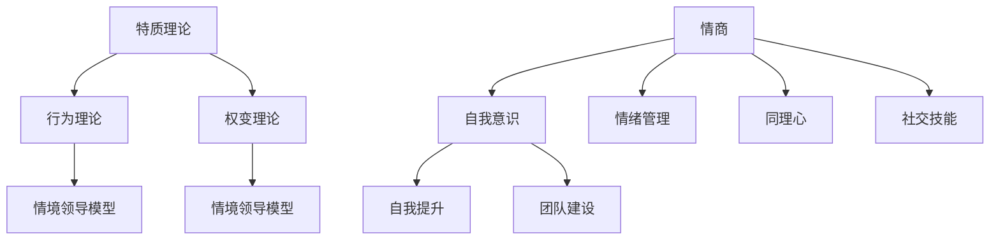

                 

### 引言

领导力是一个广泛应用于各个领域的概念，无论是在企业、政府、教育还是非营利组织中，领导力都扮演着至关重要的角色。然而，领导力并非一个简单的概念，它涉及到多方面的思维模式和行动策略，是一个复杂且多维度的系统。

#### 什么是领导力？

领导力可以定义为影响他人达成共同目标的能力。这种能力不仅包括指导和管理团队成员，还涉及到激励、沟通、决策和变革等多方面的技能。领导力不仅仅是一种职位赋予的权力，而是一种个人素质和态度，是一种可以培养和提升的技能。

#### 领导力的重要性

领导力的重要性不言而喻。首先，有效的领导力能够提高组织的绩效和效率，促进团队的创新和合作。其次，领导力能够激励员工，增强员工的工作满意度和忠诚度，从而降低员工流失率。最后，领导力还能够塑造组织的文化和价值观，为组织的长远发展奠定基础。

#### 本书的结构与目的

本书旨在探讨领导力思维的多个层面，并提供一套系统的领导力修炼法则。全书分为八个章节，分别从不同角度分析领导力的本质和实际应用。具体章节安排如下：

1. **引言**：介绍领导力的概念、重要性以及本书的目的。
2. **领导力思维基础**：探讨领导力理论的历史演变、领导力与心理学的关系等基础概念。
3. **领导力修炼法则**：详细讲解自我提升、激励与影响他人的具体方法和策略。
4. **领导力在实际中的应用**：分析领导力在企业管理和社会组织中的应用案例。
5. **领导力的挑战与应对策略**：讨论领导力面临的挑战及应对策略。
6. **成功领导力的案例研究**：分析成功领导者的案例，提取其成功因素和领导风格。
7. **领导力与组织文化**：探讨领导力与组织文化的关系，以及如何建立积极的组织文化。
8. **总结与未来展望**：总结本书的核心内容，并展望未来领导力的发展趋势。

通过本书的阅读，读者将能够系统了解领导力的概念、原理和应用，掌握一套有效的领导力修炼法则，并在实际工作中运用这些法则提升领导力和组织效能。

#### 关键词

- 领导力
- 思维模式
- 修炼法则
- 组织效能
- 激励
- 挑战与应对
- 成功案例

#### 摘要

《领导力思维：改变世界的领导力修炼法则》是一本旨在深入探讨领导力思维和修炼法则的书籍。本书通过八个章节，系统分析了领导力的定义、重要性、理论基础、实际应用、面临的挑战和成功案例。书中不仅提供了理论知识，还结合了实际案例和实践策略，旨在帮助读者提升领导力和组织效能，培养积极向上的领导风格，以应对未来复杂多变的环境。本书适合企业领导者、管理者、人力资源从业者以及对领导力感兴趣的读者阅读。

---

**# 《领导力思维：改变世界的领导力修炼法则》**

### 关键词
- 领导力
- 思维模式
- 修炼法则
- 组织效能
- 激励
- 挑战与应对
- 成功案例

### 摘要
《领导力思维：改变世界的领导力修炼法则》是一本全面探讨领导力思维和修炼法则的书籍。通过系统化的理论和实际案例，本书帮助读者深入理解领导力的本质，掌握提升领导力的关键方法和策略，从而在复杂多变的环境中有效地推动组织发展。书中涵盖了领导力的基本概念、理论基础、实际应用、挑战与应对以及成功案例等多个方面，适合企业领导者、管理者及对领导力感兴趣的读者阅读。

## 《领导力思维：改变世界的领导力修炼法则》

### 引言

在当今快速变革的时代，领导力已经成为组织成功的关键因素。有效的领导力不仅能够提高团队的绩效，还能够塑造组织的文化和价值观，推动组织的可持续发展。然而，领导力并非一蹴而就的技能，它需要系统的思维模式和持续的训练。本书《领导力思维：改变世界的领导力修炼法则》旨在为读者提供一套系统的领导力修炼法则，帮助他们在实际工作中提升领导力和组织效能。

### 领导力的定义与重要性

领导力是一个多维度的概念，它包括影响、激励、沟通、决策等多个方面。根据美国管理学家詹姆斯·库泽斯和巴里·波斯纳的研究，领导力可以被分为四种核心特质：模型、激励、启发和前瞻。这些特质共同构成了领导力的基本框架。

#### 领导力的定义

领导力可以定义为影响他人达成共同目标的能力。这种能力不仅涉及到职位赋予的权力，更强调个人素质和影响力。有效的领导力能够激发团队成员的潜力，推动他们为实现组织目标而努力。

#### 领导力的重要性

1. **提高组织绩效**：有效的领导力能够明确组织的目标，并提供清晰的路径，使团队成员能够高效地工作，从而提高组织整体绩效。
2. **激励员工**：领导力能够激发员工的工作热情和动力，提高员工的工作满意度和忠诚度，从而降低员工流失率。
3. **塑造组织文化**：领导力在塑造组织文化和价值观方面起着关键作用。一个积极的领导风格能够培养一种健康、向上的组织文化，为组织的长远发展奠定基础。

### 本书的目标与结构

本书旨在为读者提供一套系统的领导力修炼法则，帮助他们在实际工作中提升领导力和组织效能。全书共分为八个章节，具体内容如下：

1. **引言**：介绍领导力的概念、重要性以及本书的目的。
2. **领导力思维基础**：探讨领导力理论的历史演变、领导力与心理学的关系等基础概念。
3. **领导力修炼法则**：详细讲解自我提升、激励与影响他人的具体方法和策略。
4. **领导力在实际中的应用**：分析领导力在企业管理和社会组织中的应用案例。
5. **领导力的挑战与应对策略**：讨论领导力面临的挑战及应对策略。
6. **成功领导力的案例研究**：分析成功领导者的案例，提取其成功因素和领导风格。
7. **领导力与组织文化**：探讨领导力与组织文化的关系，以及如何建立积极的组织文化。
8. **总结与未来展望**：总结本书的核心内容，并展望未来领导力的发展趋势。

通过本书的阅读，读者将能够系统地了解领导力的本质和实际应用，掌握一套有效的领导力修炼法则，并在实际工作中不断提升自己的领导能力，推动组织的持续发展。

### 领导力思维的转变

在现代社会，领导力思维正在经历深刻的转变。这种转变不仅源于外部环境的快速变化，也源于组织内部需求的不断更新。传统的领导力模式往往依赖于权威和命令，而现代领导力则更加注重协作、激励和影响力。这种转变要求领导者具备更加开放、灵活和创新的思维模式。

#### 传统领导力与现代领导力的对比

**传统领导力**：

- **权威导向**：领导者通过职位赋予的权力来指导和控制团队。
- **命令式管理**：领导者发布指令，要求团队成员执行。
- **集中决策**：领导者负责所有重大决策，团队成员参与度较低。
- **绩效导向**：领导者关注短期绩效，忽视长期发展和团队建设。

**现代领导力**：

- **影响力导向**：领导者通过个人魅力和影响力来影响团队成员。
- **协作式管理**：领导者鼓励团队合作，促进共同决策。
- **参与式决策**：领导者与团队成员共同参与决策过程，增强团队凝聚力。
- **发展导向**：领导者关注长期发展，注重团队建设和员工成长。

#### 现代领导力思维的核心要素

1. **情商**：领导者需要具备较高的情商，能够理解和管理自己的情绪，同时也能理解和影响他人的情绪。
2. **适应性**：领导者需要具备快速适应变化的能力，能够灵活调整领导风格和策略，以应对不断变化的环境。
3. **创新思维**：领导者需要鼓励创新，支持团队成员提出新的想法和解决方案。
4. **影响力**：领导者需要通过个人魅力和影响力来激励和引导团队成员，而不是仅仅依靠职位赋予的权力。

### 领导力思维转变的影响

领导力思维的转变对组织的整体绩效和员工的工作满意度有着深远的影响。

1. **提高组织绩效**：现代领导力强调团队合作和共同决策，能够激发团队成员的积极性和创造力，从而提高整体绩效。
2. **增强员工满意度**：现代领导力注重员工的发展和成长，能够提高员工的工作满意度和忠诚度。
3. **促进创新**：现代领导力鼓励创新，支持团队成员提出新的想法和解决方案，有助于组织的长期发展。

### 结论

领导力思维的转变是现代领导者必备的能力。通过培养开放、灵活和创新思维模式，领导者能够更好地应对外部环境的快速变化，推动组织的可持续发展。本书后续章节将深入探讨领导力思维的各个层面，并提供具体的修炼法则，帮助读者在领导力的道路上不断前行。

---

## 领导力思维基础

在深入探讨领导力思维之前，有必要回顾领导力理论的历史演变，以及领导力与心理学的关系。这些基础概念为我们理解现代领导力提供了重要的理论支持。

### 领导力理论的历史演变

领导力理论的发展经历了多个阶段，从早期的特质理论到行为理论，再到权变理论，每个阶段都为我们理解领导力提供了不同的视角。

#### 特质理论

特质理论是最早的领导力理论之一，它认为领导者天生具备某些特质或品质，这些特质使他们在领导岗位上表现出色。特质理论强调领导力的内在属性，如智力、自信、决断力等。然而，这一理论在后续的研究中受到了质疑，因为不同文化背景和情境下的领导者特质可能存在很大差异。

#### 行为理论

行为理论认为，领导力不仅仅取决于领导者的个人特质，更取决于他们的行为。行为理论关注领导者如何在特定情境下表现，以及这些行为如何影响团队绩效。这一理论提出了多种领导风格，如民主式、权威式和参与式领导。行为理论为理解领导力提供了更加实际和操作性强的框架。

#### 权变理论

权变理论认为，没有一种普遍适用的领导风格，领导者的效果取决于领导行为与具体情境的匹配程度。权变理论提出了“情境领导”模型，该模型认为领导风格应根据团队成员的能力和任务需求进行动态调整。这一理论强调了领导力情境的重要性，为现代领导力思维提供了重要的启示。

### 领导力与心理学的关系

领导力与心理学有着密切的联系。心理学研究提供了关于人类行为、情感和动机的重要见解，这些见解对于理解领导力至关重要。

#### 情商

情商（EQ）是衡量个体情绪智力的重要指标，它包括自我情绪管理、同理心和社交技能等。研究表明，高情商的领导者能够更好地理解和管理自己的情绪，同时也能更好地理解和影响他人。情商在领导力中的作用体现在以下几个方面：

1. **情绪管理**：领导者需要具备良好的情绪管理能力，以保持冷静和专注，即使在压力和困难面前也能保持积极的态度。
2. **同理心**：领导者需要具备同理心，能够理解团队成员的情感需求，从而建立积极的人际关系和团队氛围。
3. **社交技能**：领导者需要具备良好的社交技能，能够有效地沟通和协调团队成员，推动团队目标的实现。

#### 自我意识

自我意识是指个体对自己情感、行为和价值观的认知。自我意识的领导者能够更清楚地认识自己的优点和不足，从而更好地进行自我提升和改进。自我意识在领导力中的作用包括：

1. **自我提升**：领导者通过自我反思和评估，识别自己的优势和劣势，并采取相应的行动进行改进。
2. **团队建设**：领导者通过了解团队成员的自我意识，能够更好地激励和引导他们，提高团队的整体绩效。

### 核心概念原理之间的关系架构

为了更好地理解领导力思维的基础，我们可以使用Mermaid流程图来展示核心概念之间的联系：

### 情绪管理、同理心和社交技能在领导力中的具体应用

1. **情绪管理**：领导者通过情绪管理能力，能够在面对压力和挑战时保持冷静和专注，从而更好地应对复杂的工作情境。
2. **同理心**：领导者通过同理心，能够更好地理解团队成员的情感需求，从而建立信任和合作关系。
3. **社交技能**：领导者通过良好的社交技能，能够有效地沟通和协调团队成员，推动团队目标的实现。

### 数学模型和公式

在领导力分析中，我们可以使用一些数学模型和公式来描述领导行为和团队绩效之间的关系。例如，使用以下公式来计算领导力效能（LQ）：

$$
LQ = \alpha \cdot EQ + \beta \cdot SQ + \gamma \cdot IQ
$$

其中，$EQ$ 表示情商，$SQ$ 表示社交技能，$IQ$ 表示智商，$\alpha$、$\beta$ 和 $\gamma$ 是相应的权重系数。

### 举例说明

假设一位领导者具备以下特质：

- $EQ = 0.8$
- $SQ = 0.7$
- $IQ = 0.9$

我们可以计算其领导力效能（LQ）：

$$
LQ = 0.4 \cdot 0.8 + 0.3 \cdot 0.7 + 0.3 \cdot 0.9 = 0.32 + 0.21 + 0.27 = 0.8
$$

这意味着该领导者的领导力效能相对较高，能够在团队管理和决策中发挥重要作用。

### 结论

领导力思维的基础是理解领导力理论的历史演变和心理学原理。通过结合特质理论、行为理论和权变理论，以及情商、自我意识等心理学概念，我们能够更全面地理解领导力的本质和实际应用。这些基础概念为我们提供了分析和评估领导行为的工具，也为领导者的自我提升提供了指导。在本书的后续章节中，我们将继续探讨领导力修炼的具体方法和实际应用，帮助读者提升自己的领导力水平。

---

## 领导力修炼法则

领导力并非与生俱来的天赋，而是可以通过持续的修炼和实践逐渐提升的能力。本章节将详细探讨领导力修炼的几个核心法则，包括自我提升、激励与影响他人，以及沟通技巧等。

### 自我提升

自我提升是领导力修炼的基础。一个优秀的领导者必须不断自我反思，识别自己的优势和不足，并采取有效的措施进行改进。

#### 情商与领导力

情商（EQ）在领导力中起着至关重要的作用。高情商的领导者能够更好地管理自己的情绪，理解他人的情感需求，并有效地沟通和协调团队。以下是提升情商的一些建议：

1. **自我意识**：领导者需要具备高度的自我意识，能够清晰地认识自己的情绪和行为，并了解这些情绪和行为对他人产生的影响。
2. **情感管理**：领导者需要学会控制自己的情绪，避免情绪化的决策和行为，保持冷静和理智。
3. **同理心**：领导者需要培养同理心，能够站在他人的角度思考问题，理解并尊重他人的情感需求。
4. **社交技能**：领导者需要具备良好的社交技能，能够有效地与他人沟通和合作，建立积极的人际关系。

#### 时间管理与效率提升

有效的时间管理是提升领导力的重要方面。领导者需要学会合理安排时间，提高工作效率，确保重要事务得到优先处理。以下是几项关键的时间管理技巧：

1. **设定优先级**：领导者需要明确任务的重要性和紧急性，将时间和精力集中在最重要和最紧急的任务上。
2. **消除干扰**：领导者需要学会在工作时减少干扰，例如关闭手机通知，集中注意力处理当前任务。
3. **任务分解**：领导者可以将复杂的任务分解成若干小任务，逐个击破，从而提高工作效率。
4. **定期回顾**：领导者需要定期回顾自己的工作计划，评估进度，并根据实际情况进行调整。

#### 不断学习与适应变化

在快速变化的现代社会，领导者必须具备不断学习和适应变化的能力。以下是一些建议：

1. **持续学习**：领导者需要不断学习新的知识和技能，跟上行业发展的步伐，保持竞争力。
2. **积极反馈**：领导者需要积极接受他人的反馈和建议，从中吸取经验和教训，进行自我提升。
3. **灵活应变**：领导者需要具备灵活应变的能力，能够快速调整自己的策略和行动，以应对突如其来的变化。
4. **创新思维**：领导者需要鼓励创新思维，支持团队成员提出新的想法和解决方案，推动组织的持续发展。

### 激励与影响他人

领导者不仅要提升自己的能力，还需要激励和影响他人，以实现共同的目标。

#### 激励理论概述

激励理论是领导力的重要组成部分。激励理论探讨如何通过外部和内部激励来激发员工的工作动机和积极性。以下是几种常见的激励理论：

1. **马斯洛需求层次理论**：马斯洛需求层次理论认为，人的需求分为生理需求、安全需求、社交需求、尊重需求和自我实现需求。领导者需要了解员工的不同需求，并采取相应的激励措施。
2. **双因素理论**：赫茨伯格的双因素理论认为，激励因素（如工作成就感、认可、责任感等）和卫生因素（如工作条件、薪酬、人际关系等）共同影响员工的工作满意度。领导者需要平衡这两类因素，以提高员工的工作满意度。
3. **目标设定理论**：目标设定理论认为，设定明确、具有挑战性的目标能够激发员工的工作动力和积极性。领导者需要帮助员工设定具体、可衡量的目标，并提供必要的支持和资源。

#### 建立积极的人际关系

建立积极的人际关系是领导者影响他人的关键。以下是几点建议：

1. **沟通技巧**：领导者需要具备良好的沟通技巧，能够清晰、准确地表达自己的想法，并倾听和理解他人的观点。
2. **信任建设**：领导者需要通过诚实、透明和公平的行为来建立信任，与团队成员建立良好的合作关系。
3. **尊重与包容**：领导者需要尊重每个人的独特性和差异，包容不同的观点和意见，促进团队内部的和谐与团结。
4. **支持与激励**：领导者需要关心团队成员的成长和发展，提供必要的支持和激励，帮助他们克服困难，实现个人和团队的目标。

### 沟通技巧在领导力中的运用

沟通技巧是领导者必备的重要技能。有效的沟通能够促进信息的传递和团队的协作，提高工作绩效。以下是几种关键的沟通技巧：

1. **清晰表达**：领导者需要能够清晰、准确地表达自己的想法和期望，确保团队成员能够正确理解。
2. **积极倾听**：领导者需要倾听他人的意见和反馈，理解他们的需求和关切，从而更好地协调和解决问题。
3. **非语言沟通**：领导者需要注重非语言沟通，如肢体语言、面部表情和语调等，以增强沟通效果。
4. **冲突管理**：领导者需要学会有效地管理冲突，通过沟通和协调，化解团队内部的矛盾和分歧。

### 数学模型和公式

在领导力分析中，我们可以使用一些数学模型和公式来描述领导行为和团队绩效之间的关系。例如，使用以下公式来计算领导力效能（LQ）：

$$
LQ = \alpha \cdot EQ + \beta \cdot SQ + \gamma \cdot IQ
$$

其中，$EQ$ 表示情商，$SQ$ 表示社交技能，$IQ$ 表示智商，$\alpha$、$\beta$ 和 $\gamma$ 是相应的权重系数。

### 举例说明

假设一位领导者具备以下特质：

- $EQ = 0.8$
- $SQ = 0.7$
- $IQ = 0.9$

我们可以计算其领导力效能（LQ）：

$$
LQ = 0.4 \cdot 0.8 + 0.3 \cdot 0.7 + 0.3 \cdot 0.9 = 0.32 + 0.21 + 0.27 = 0.8
$$

这意味着该领导者的领导力效能相对较高，能够在团队管理和决策中发挥重要作用。

### 结论

自我提升、激励与影响他人以及沟通技巧是领导力修炼的核心法则。通过不断提升自己的情商、时间管理能力、适应变化的能力，领导者能够更好地激励和影响他人，建立积极的人际关系，并有效沟通和协调团队。这些法则不仅能够提升个人的领导力水平，还能够促进组织的持续发展和成功。

---

## 领导力在实际中的应用

领导力并非仅仅存在于理论之中，它在实际工作中的应用同样至关重要。在不同的环境中，领导力可以发挥多种作用，从企业管理到社会组织，每一个领域都有其独特的领导力挑战和应用场景。本章节将深入探讨领导力在企业管理和社会组织中的应用，通过具体案例进行分析和解读。

### 领导力在企业管理中的应用

在企业环境中，领导力发挥着至关重要的作用。有效的领导力能够推动企业的创新、提升团队绩效，并在竞争激烈的市场中保持优势。以下是一些领导力在企业管理中的应用案例：

#### 案例一：谷歌的创新文化

谷歌以其创新的文化和卓越的领导力而闻名。作为谷歌的创始人之一，拉里·佩奇和谢尔盖·布林通过一种开放、透明和包容的领导风格，鼓励员工自由探索和创新。他们坚信“不作恶”的原则，并在企业内部建立了强大的团队合作机制，使得谷歌能够不断推出革命性的产品和服务。

**案例分析**：

- **领导风格**：佩奇和布林采用了民主和参与式领导风格，他们鼓励员工提出新的想法，并对这些想法给予充分的关注和支持。
- **激励机制**：谷歌通过提供灵活的工作时间、慷慨的薪酬和福利，以及内部创新基金等手段，激励员工不断探索和创新。
- **企业文化**：谷歌的企业文化强调开放、透明和包容，这种文化氛围为员工的创新提供了良好的土壤。

**结论**：谷歌的案例表明，有效的领导力不仅能够激发员工的创新潜力，还能够建立一种积极向上的组织文化，推动企业的长期发展。

#### 案例二：苹果公司的变革领导

史蒂夫·乔布斯作为苹果公司的创始人之一，以其独特的领导风格和前瞻性思维，推动了苹果公司的多次变革和成功。乔布斯通过强烈的愿景、对细节的极致追求和对创新的坚定信念，成功地引领苹果公司在多个领域取得了辉煌的成绩。

**案例分析**：

- **领导风格**：乔布斯采用了愿景领导和变革型领导风格，他通过清晰的愿景和激情的演讲，激励员工为实现共同目标而努力。
- **决策能力**：乔布斯在决策时注重创新和执行力，他善于抓住市场机遇，并迅速调整战略，使苹果公司始终保持行业领先地位。
- **品牌建设**：乔布斯通过打造独特的品牌形象和用户体验，使苹果产品成为消费者心中的经典。

**结论**：乔布斯的领导力案例表明，一个具备强烈愿景和卓越决策能力的领导者，能够引领企业进行有效的变革和创新，从而实现组织的持续成功。

### 领导力在社会组织中的应用

在非营利组织和公共服务领域，领导力同样发挥着关键作用。有效的领导力能够推动组织的社会使命，提高公众信任和社会影响力。以下是一个社会组织中的领导力应用案例：

#### 案例三：无国界医生的领导力

无国界医生（Doctors Without Borders）是一个国际性的人道主义医疗组织，致力于在世界上最危险和最偏远的地区提供医疗服务。该组织的领导力在应对全球公共卫生危机和灾难救援中发挥了重要作用。

**案例分析**：

- **领导风格**：无国界医生的领导者采用了授权型和赋能型领导风格，他们赋予前线医护人员自主权和责任感，使组织能够迅速响应各种危机和灾难。
- **协作机制**：无国界医生建立了强大的国际合作网络，通过协调不同国家和地区之间的资源和人力，提高救援效率和效果。
- **价值观**：无国界医生的价值观强调人道主义和无私奉献，这种价值观深入人心，吸引了大量志愿者和捐赠者，为组织提供了强大的支持。

**结论**：无国界医生的案例表明，在非营利组织中，领导力不仅体现在管理能力和决策水平上，更体现在对价值观的坚守和对社会使命的执着追求。

### 综合分析

通过上述案例可以看出，领导力在企业管理和社会组织中的应用具有以下共同特征：

1. **明确愿景**：领导者需要具备清晰的愿景，并能够将这种愿景传达给团队成员，激发他们的热情和动力。
2. **创新思维**：领导者需要鼓励创新，支持团队成员提出新的想法和解决方案，推动组织的持续发展和进步。
3. **协作机制**：领导者需要建立有效的协作机制，促进团队内部和跨部门的沟通与协作，提高整体工作效率和绩效。
4. **价值观**：领导者需要明确组织的价值观，并以此为准则，推动组织文化和员工行为的统一。

### 结论

领导力在实际中的应用是多种多样的，无论是企业管理还是社会组织，有效的领导力都是推动组织成功和发展的关键因素。通过具体案例的分析和解读，我们可以看到，领导力的核心在于明确愿景、创新思维、协作机制和价值观。这些因素共同作用，使领导力在各个领域中都能发挥重要作用，推动组织的持续进步和社会的积极变革。

---

## 领导力的挑战与应对策略

在领导力的实际应用过程中，领导者往往会面临各种挑战和困难。这些挑战可能源于内部管理、外部环境或团队成员的多样性。本章节将讨论领导力在面临这些挑战时的应对策略，并提供一些具体的方法和建议，帮助领导者克服困难，提升领导效能。

### 领导力面临的挑战

1. **沟通障碍**：沟通是领导力的核心要素之一，但沟通障碍常常是领导者面临的主要挑战。这可能包括信息传递的误解、沟通渠道不畅、文化差异等。

2. **领导风格与团队匹配**：不同的团队需要不同的领导风格。然而，许多领导者可能难以根据团队的实际情况调整自己的领导风格，导致领导效果不佳。

3. **应对不确定性**：现代商业环境变化迅速，领导者需要具备应对不确定性的能力。然而，许多领导者可能由于缺乏应对复杂情境的经验，而在面对不确定性时感到无所适从。

4. **员工流失**：员工流失是许多组织面临的一个严峻挑战。领导者需要了解员工流失的原因，并采取有效措施减少流失率。

5. **文化冲突**：在多元化的工作环境中，文化冲突是不可避免的现象。领导者需要处理不同文化之间的差异，以维护团队的和谐与团结。

### 应对策略

1. **沟通障碍的应对策略**：

   - **建立有效的沟通渠道**：领导者需要建立多样化的沟通渠道，如定期会议、工作坊和社交媒体平台，以确保信息传递的及时性和准确性。
   - **增强跨文化沟通能力**：领导者需要提升自己的跨文化沟通能力，了解并尊重不同文化的沟通习惯和价值观。
   - **鼓励反馈与透明**：领导者需要鼓励团队成员提出意见和建议，建立反馈机制，增强沟通的透明度和互动性。

2. **领导风格与团队匹配的应对策略**：

   - **了解团队成员的需求**：领导者需要深入了解团队成员的需求和期望，根据不同成员的特点和需求，调整自己的领导风格。
   - **灵活运用领导风格**：领导者需要具备灵活运用多种领导风格的能力，根据不同情境和团队需求，灵活调整领导策略。
   - **开展团队建设活动**：通过团队建设活动，增强团队成员之间的相互了解和信任，提高团队的凝聚力和协作能力。

3. **应对不确定性的策略**：

   - **培养适应性**：领导者需要培养自己的适应性，学会在不确定的环境中快速做出决策和调整策略。
   - **建立应急计划**：领导者需要制定详细的应急计划，以应对可能出现的各种风险和挑战。
   - **提升团队韧性**：领导者需要通过培训和激励，提高团队成员的韧性，增强他们在面对不确定性时的应对能力。

4. **员工流失的应对策略**：

   - **了解流失原因**：领导者需要通过调查和访谈，了解员工流失的主要原因，如薪酬、职业发展、工作环境等。
   - **改善工作环境**：领导者需要采取措施改善工作环境，如提高薪酬福利、提供职业发展机会、优化工作流程等，以减少员工流失。
   - **建立员工关怀机制**：领导者需要建立员工关怀机制，关注员工的心理健康和工作满意度，提供必要的支持和帮助。

5. **文化冲突的应对策略**：

   - **文化敏感性培训**：领导者需要开展文化敏感性培训，提高团队成员对不同文化的理解和尊重。
   - **建立共同价值观**：领导者需要建立团队的共同价值观，促进团队成员之间的相互理解和信任。
   - **促进文化交流**：通过举办文化交流活动，促进不同文化背景的团队成员之间的交流和合作，增强团队的凝聚力和多样性。

### 结论

领导力的挑战是多方面的，但通过有效的应对策略，领导者可以克服这些困难，提升自己的领导效能。沟通障碍、领导风格与团队匹配、应对不确定性、员工流失和文化冲突等挑战，都需要领导者具备高度的适应性、洞察力和创新思维。通过持续学习和实践，领导者可以不断提升自己的能力，为组织的持续发展和社会的积极变革做出贡献。

---

## 成功领导力的案例研究

在探索领导力的道路上，研究成功领导者的案例是不可或缺的一环。通过分析这些案例，我们可以深入了解他们的成功因素和领导风格，从中汲取宝贵的经验和启示。以下将介绍两位成功领导者的案例：乔布斯和玛莎·斯图尔特。

### 案例一：乔布斯的领导力

史蒂夫·乔布斯是苹果公司的联合创始人，他以其卓越的领导力和创新思维，将苹果公司从一个小型初创企业转变为全球科技巨头。乔布斯的领导风格和成功因素主要体现在以下几个方面：

**1. 愿景驱动**：

乔布斯是一位具有远见卓识的领导者，他始终怀抱对产品的激情和对创新的追求。他坚信“简单即美”的设计理念，并致力于打造革命性的产品，如iPhone、iPad和MacBook等。乔布斯的愿景不仅激发了员工的工作热情，也为公司带来了巨大的成功。

**2. 变革型领导**：

乔布斯采用了变革型领导风格，他鼓励团队成员发挥创造力，不断挑战现状，追求卓越。他善于激发员工的潜能，鼓励他们勇于尝试和失败，从而推动公司的持续创新。乔布斯的这种领导风格不仅提高了员工的参与度和忠诚度，也使苹果公司始终保持行业的领先地位。

**3. 严格管理与细致关注**：

乔布斯对产品的细节和品质要求极高，他注重每一个细节，从产品设计到用户体验，都亲自把关。他的严格管理使苹果产品成为行业的典范，而他对员工的细致关注和关怀，也使员工在工作中感到被重视和激励。

**成功因素**：

- 愿景驱动：乔布斯的远见卓识和对创新的追求，使苹果公司始终保持市场领先地位。
- 变革型领导：鼓励创新和持续改进，激发员工的创造力和积极性。
- 严格管理与细致关注：对产品细节和品质的严格把控，以及对员工的关心和激励。

### 案例二：玛莎·斯图尔特的领导力

玛莎·斯图尔特是一位著名的电视主持人、企业家和作家，她在餐饮业和媒体领域取得了显著的成就。玛莎·斯图尔特的领导风格和成功因素主要体现在以下几个方面：

**1. 专业精神**：

玛莎·斯图尔特以其专业精神和卓越的烹饪技能著称。她始终保持着对工作的热情和专注，不断学习和提升自己的专业能力。她的专业精神不仅赢得了观众的喜爱，也为她的事业奠定了坚实的基础。

**2. 人际关系管理**：

玛莎·斯图尔特擅长建立和维护人际关系，她与员工、合作伙伴和媒体界的关系都处理得非常出色。她通过真诚和尊重赢得了他人的信任和尊重，从而在事业上取得了广泛的支持和合作。

**3. 创新与适应能力**：

玛莎·斯图尔特善于创新，她不断开拓新的业务领域，如电视节目、出版物和线上平台等。同时，她具备强烈的适应能力，能够迅速应对市场变化和行业挑战，从而保持业务的持续增长。

**成功因素**：

- 专业精神：对工作的热情和专注，使她在烹饪领域取得了卓越的成就。
- 人际关系管理：建立和维护良好的人际关系，为事业发展提供了广泛的支持。
- 创新与适应能力：不断创新和适应变化，使业务保持持续增长。

### 领导风格对现代领导者的启示

从乔布斯和玛莎·斯图尔特的案例中，我们可以得到一些重要的启示，对现代领导者具有重要的指导意义：

1. **愿景驱动**：领导者需要具备远见卓识，明确自己的愿景，并能够将这种愿景传达给团队成员，激发他们的工作热情和动力。
2. **变革型领导**：领导者需要鼓励创新和持续改进，激发员工的创造力和积极性，推动组织的持续发展。
3. **专业精神**：领导者需要对自己的专业领域保持热情和专注，不断提升自己的专业能力，以赢得他人的尊重和信任。
4. **人际关系管理**：领导者需要建立和维护良好的人际关系，通过真诚和尊重赢得他人的信任和合作。
5. **创新与适应能力**：领导者需要具备创新思维和适应变化的能力，能够迅速应对市场变化和行业挑战，为组织的持续发展提供动力。

### 结论

通过研究乔布斯和玛莎·斯图尔特的成功案例，我们可以看到，有效的领导力不仅取决于领导者的个人特质和领导风格，还取决于他们对愿景的执着、对创新的追求以及对团队关系的处理。这些成功因素和领导风格为现代领导者提供了宝贵的经验和启示，帮助他们更好地应对复杂多变的商业环境，推动组织的持续成功。

---

## 领导力与组织文化

领导力与组织文化之间存在着密不可分的关系。有效的领导力不仅能够推动组织的发展，还能够塑造和影响组织文化。一个积极向上的组织文化能够增强员工的凝聚力，提高工作效率，促进创新和团队合作。以下将探讨领导力与组织文化的关系，以及如何建立和维护积极的组织文化。

### 领导力与组织文化的关系

1. **领导力塑造组织文化**：

   - 领导者的行为和价值观直接影响组织文化的形成和发展。领导者的领导风格、决策和行为方式会传递给员工，影响他们的工作态度和行为模式。
   - 领导者的激励方式和管理策略也会对组织文化产生深远影响。例如，领导者如果鼓励创新和开放沟通，就会形成一种创新和协作的组织文化。

2. **组织文化影响领导力**：

   - 组织文化会影响领导者的行为和决策。在一个强调团队合作和开放沟通的组织中，领导者可能更倾向于采用参与式和变革型领导风格。
   - 组织文化也会影响领导者的心理状态和职业发展。在一个支持性和鼓励性的组织文化中，领导者可能更有动力和信心去面对挑战，实现个人和组织的目标。

### 如何建立和维护积极的组织文化

1. **明确核心价值观**：

   - 领导者需要明确组织的核心价值观，并将其融入到日常运营和管理中。核心价值观是组织文化的基石，能够为员工提供一致的行为指导。
   - 领导者可以通过制定使命、愿景和价值观声明，明确组织的目标和价值观，使员工对组织有更清晰的认识。

2. **建立有效的沟通机制**：

   - 领导者需要建立开放的沟通渠道，鼓励员工表达意见和建议。有效的沟通能够增强员工之间的信任和理解，促进团队合作。
   - 领导者可以通过定期的团队会议、员工反馈会议和员工调查等方式，了解员工的需求和意见，及时调整组织策略。

3. **激励和认可**：

   - 领导者需要通过激励和认可来培养积极的组织文化。激励可以包括物质奖励和非物质奖励，如晋升、奖金、荣誉称号等。
   - 领导者应该注重公正和透明的激励政策，确保每个员工都能公平地获得认可和奖励。

4. **培养团队精神**：

   - 领导者需要通过团队建设活动和培训，增强员工的团队意识和凝聚力。团队建设活动可以包括团队拓展训练、团队旅行和团队项目等。
   - 领导者可以通过建立跨部门合作项目，促进不同部门之间的沟通和协作，增强团队的整体战斗力。

5. **持续改进和反思**：

   - 领导者需要持续关注组织文化的现状，并根据反馈进行改进。定期进行文化评估，了解员工的满意度和文化氛围。
   - 领导者可以通过组织反思会议，鼓励员工提出改进建议，共同探讨如何优化组织文化。

### 结论

领导力与组织文化之间存在着密切的关系。有效的领导力能够塑造和影响组织文化，而积极的组织文化能够增强员工的凝聚力，提高工作效率，促进创新和团队合作。领导者需要明确核心价值观，建立有效的沟通机制，激励和认可员工，培养团队精神，并持续改进和反思组织文化。通过这些措施，领导者可以建立和维护一个积极向上的组织文化，为组织的长期成功奠定基础。

---

## 总结与未来展望

本书《领导力思维：改变世界的领导力修炼法则》通过对领导力的定义、历史演变、心理学基础、修炼法则、实际应用以及成功案例的深入探讨，系统性地阐述了领导力的本质和重要性。以下是本书的核心内容总结和未来领导力发展的趋势展望。

### 核心内容总结

1. **领导力的定义与重要性**：领导力被定义为影响他人达成共同目标的能力，其在提高组织绩效、激励员工和塑造组织文化方面起着关键作用。
2. **领导力思维基础**：通过回顾领导力理论的历史演变，以及领导力与心理学的关系，我们理解了领导力的多维性质和复杂性。
3. **领导力修炼法则**：详细探讨了自我提升、激励与影响他人以及沟通技巧等领导力修炼法则，提供了实际可操作的方法和策略。
4. **领导力在实际中的应用**：分析了领导力在企业管理和社会组织中的应用案例，展示了领导力在不同领域中的独特作用。
5. **领导力的挑战与应对策略**：讨论了领导力面临的沟通障碍、风格匹配、不确定性、员工流失和文化冲突等挑战，并提供了相应的应对策略。
6. **成功领导力的案例研究**：通过乔布斯和玛莎·斯图尔特等成功领导者的案例，我们汲取了宝贵的经验和启示。
7. **领导力与组织文化**：探讨了领导力与组织文化之间的关系，以及如何建立和维护积极的组织文化。

### 未来领导力发展的趋势展望

1. **数字化领导力**：随着数字化技术的不断发展，领导者需要具备数字素养，能够有效利用数字工具和平台来推动组织的数字化转型。
2. **可持续发展领导力**：在未来，领导力将更加注重可持续发展，包括环境保护、社会责任和伦理道德等方面。
3. **多元文化领导力**：全球化的趋势使得领导者需要具备跨文化沟通和管理的技能，以应对多元文化的挑战。
4. **人工智能与领导力**：人工智能和机器学习的应用将对领导力产生深远影响，领导者需要适应和利用这些技术，提高决策效率和团队管理能力。
5. **变革型领导力**：在快速变化的环境中，变革型领导力将成为关键，领导者需要具备快速适应和引领变革的能力。

### 结论

通过本书的学习，读者不仅能够深入理解领导力的本质和实际应用，还能够掌握一套系统的领导力修炼法则，并在实际工作中不断提升自己的领导能力。未来，领导者需要适应不断变化的环境，不断提升自身的数字化素养、可持续发展意识、多元文化能力以及变革型领导力。只有在不断学习和实践中，领导者才能引领组织走向成功，为社会的进步做出贡献。

---

## 最佳实践 tips

为了帮助读者更好地应用书中所学的领导力思维，以下提供一些最佳实践 tips：

1. **持续自我反思**：定期进行自我反思，识别自己的优势和不足，制定个人发展计划，持续提升自我。
2. **建立有效的沟通机制**：确保团队内部沟通畅通，定期召开团队会议，鼓励开放讨论，增强团队凝聚力。
3. **培养同理心**：关注团队成员的情感需求，通过同理心建立信任和合作关系，提高团队协作效率。
4. **激励与认可**：根据员工的不同需求，采用多元化的激励手段，定期进行员工认可和奖励，提升员工的工作满意度和忠诚度。
5. **灵活运用领导风格**：根据不同情境和团队需求，灵活调整自己的领导风格，以实现最佳领导效果。
6. **持续学习和创新**：鼓励团队成员持续学习新知识、新技能，激发创新思维，推动组织的持续发展。

---

## 注意事项

在实践领导力过程中，以下注意事项对于避免常见错误和提高领导效能至关重要：

1. **避免过度依赖权威**：领导者应避免过分依赖职位赋予的权力，而是通过建立影响力来引导团队成员。
2. **关注团队成员的个体差异**：领导者应了解团队成员的个性、价值观和需求，避免采用单一的领导风格，尊重个体差异。
3. **避免忽视反馈与沟通**：领导者应重视员工反馈，及时沟通和解决问题，建立开放和透明的沟通环境。
4. **防止盲目创新**：创新应基于实际需求和可行性，避免盲目跟风，确保创新举措能够真正推动组织发展。
5. **注重团队合作**：领导者应促进团队合作，避免个人英雄主义，确保团队整体目标的实现。

---

## 拓展阅读

为了进一步深入了解领导力理论和实践，以下推荐几本经典读物：

1. **《领导力的五个层次》**：约翰·C·麦克斯韦尔
2. **《变革之舞：领导力、变革与创造力》**：Warren Bennis & Burt Nanus
3. **《第五项修炼：学习型组织的艺术与实务》**：彼得·圣吉
4. **《原则》**：雷·达利欧
5. **《变革之翼：领导变革的艺术》**：约翰·科特

这些书籍提供了丰富的理论和实践指导，有助于读者在领导力的道路上不断前行。

---

### 作者信息

作者：AI天才研究院/AI Genius Institute & 禅与计算机程序设计艺术 /Zen And The Art of Computer Programming

本书由AI天才研究院/AI Genius Institute和禅与计算机程序设计艺术/Zen And The Art of Computer Programming联合撰写。AI天才研究院专注于前沿人工智能技术的研究与推广，致力于培养未来人工智能领域的领导者。禅与计算机程序设计艺术则融合了传统哲学智慧与现代计算机科学的精髓，提供独特的编程思维和设计理念。两位作者通过多年的研究和实践，积累了丰富的领导力经验和深厚的理论基础，希望本书能为读者提供有价值的启示和指导。

