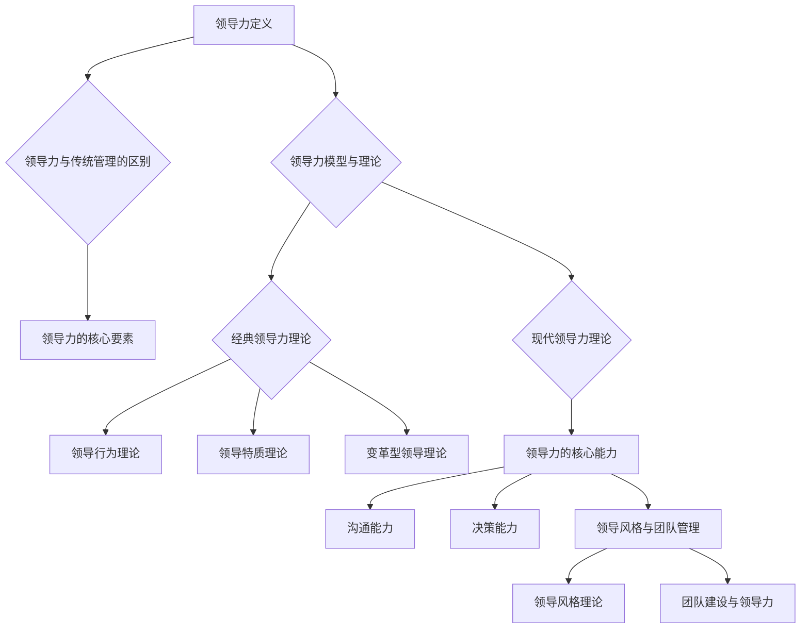

                 


### **文章标题**：《领导力思维：改变世界的领导力修炼法则》

**关键词**：领导力、思维模型、决策、组织变革、跨界合作、创新

**摘要**：本文从理论、实践、未来三个维度全面解析了领导力思维的内涵和修炼法则。通过深入分析领导力的定义、核心能力、模型与理论，本文探讨了领导力在组织应用中的策略，以及领导力自我修炼的方法。同时，本文还探讨了领导力思维在跨界合作和未来趋势中的角色，为读者提供了一幅领导力思维的全景图。

---

### **第一部分：领导力的基础理论**

#### **第1章：领导力概述**

**1.1 领导力的定义和重要性**

领导力，是一种影响、激励和指导他人达成共同目标的能力。在组织和企业中，领导力的重要性不言而喻。有效的领导力可以推动组织的创新和变革，提升团队的执行力，实现组织的战略目标。

**1.2 领导力与传统管理的区别**

传统管理强调控制、规划和执行，而领导力则更注重激发和引导。领导力关注的是人的发展和团队的动力，而管理则侧重于资源和流程的优化。

**1.3 领导力的核心要素**

领导力的核心要素包括：沟通能力、决策能力、团队管理能力和领导风格。这些要素构成了领导力的基本框架，是领导者必须具备的素质。

---

#### **第2章：领导力模型与理论**

**2.1 领导力模型介绍**

领导力模型是领导者行为的抽象和总结，它可以帮助我们理解和分析领导力。常见的领导力模型有领导行为理论、领导特质理论、变革型领导理论等。

**2.2 经典领导力理论**

- **领导行为理论**：认为领导力是通过特定行为表现出来的，领导者的行为对团队和组织的绩效有显著影响。
- **领导特质理论**：认为领导力是与生俱来的特质，领导者具有特定的个性特征和能力。
- **变革型领导理论**：认为领导者的任务不仅是维持现状，更重要的是推动变革和创新。

**2.3 现代领导力理论**

现代领导力理论强调领导者的创新能力和影响力，关注领导者的自我发展和团队建设。代表性的理论有：情境领导理论、领导力五层次理论等。

---

#### **第3章：领导力的核心能力**

**3.1 沟通能力**

沟通能力是领导力的核心之一，有效的沟通可以提升团队协作效率，增强团队凝聚力。

**3.2 决策能力**

决策能力是领导者必备的能力，它决定了组织的发展方向和速度。

**3.3 领导风格与团队管理**

- **领导风格理论**：领导风格对团队的影响至关重要，不同的领导风格适用于不同的情境。
- **团队建设与领导力**：团队建设是领导力的重要组成部分，领导者需要通过有效的团队管理来提升团队绩效。

---

### **第二部分：领导力实践与修炼**

#### **第4章：领导力在组织中的应用**

**4.1 组织战略与领导力**

领导力在组织战略中发挥着关键作用，领导者需要通过战略规划来推动组织的发展。

**4.2 领导力与企业文化**

企业文化是组织的灵魂，领导力在塑造和传承企业文化中发挥着重要作用。

**4.3 领导力与组织变革**

领导力在组织变革中扮演着关键角色，领导者需要通过变革管理来推动组织的创新和进步。

---

#### **第5章：领导力自我修炼**

**5.1 自我认识与自我提升**

自我认识是领导力修炼的第一步，领导者需要不断反思和提升自我。

**5.2 心理素质与情绪管理**

心理素质和情绪管理是领导力的基石，领导者需要具备良好的心理素质和情绪管理能力。

**5.3 领导力修炼路径**

领导者需要通过系统的学习和实践来不断提升自己的领导力。

---

#### **第6章：领导力在跨界合作中的角色**

**6.1 跨界合作的挑战与机遇**

跨界合作带来了新的挑战和机遇，领导者需要具备跨界思维和创新能力。

**6.2 领导力在跨界合作中的关键作用**

领导力在跨界合作中发挥着关键作用，领导者需要通过有效的沟通和协调来推动合作。

**6.3 跨界合作中的领导力策略**

领导者需要制定合适的领导力策略来应对跨界合作的挑战。

---

#### **第7章：领导力创新思维**

**7.1 创新思维的重要性**

创新思维是领导力的核心之一，领导者需要具备创新思维来推动组织的创新和发展。

**7.2 领导力与创新**

领导力与创新密不可分，领导者需要通过创新来提升组织的竞争力。

**7.3 创新思维的培养与实践**

领导者需要通过系统的学习和实践来培养和创新思维。

---

### **第三部分：领导力思维与未来**

#### **第8章：领导力思维的未来趋势**

**8.1 数字化时代的领导力变革**

数字化时代对领导力提出了新的要求，领导者需要具备数字领导力。

**8.2 人工智能与领导力**

人工智能的崛起对领导力产生了深远影响，领导者需要适应人工智能时代的变化。

**8.3 领导力思维与可持续发展**

可持续发展是未来的趋势，领导者需要具备可持续发展思维。

---

#### **第9章：领导力思维的应用场景**

**9.1 领导力思维在企业管理中的应用**

领导力思维在企业管理中发挥着重要作用，领导者需要通过领导力思维来提升企业管理水平。

**9.2 领导力思维在公共管理中的应用**

领导力思维在公共管理中具有广泛的应用，领导者需要通过领导力思维来推动公共管理改革。

**9.3 领导力思维在社会组织中的应用**

领导力思维在社会组织中具有重要作用，领导者需要通过领导力思维来提升社会组织的影响力。

---

#### **第10章：领导力思维的影响力**

**10.1 领导力思维对社会的影响**

领导力思维对社会产生了深远影响，领导者需要通过领导力思维来推动社会进步。

**10.2 领导力思维对个人成长的影响**

领导力思维对个人成长具有重要影响，领导者需要通过领导力思维来提升个人素质。

**10.3 领导力思维的传承与传播**

领导力思维需要传承和传播，领导者需要通过多种方式来传播领导力思维。

---

### **附录：领导力思维实践案例**

**附录1：知名领导力实践案例**

介绍一些知名企业的领导力实践案例，分析其成功的原因和经验。

**附录2：领导力思维练习与反思**

提供一些领导力思维练习，引导读者进行反思和自我提升。

---

**作者**：AI天才研究院/AI Genius Institute & 禅与计算机程序设计艺术 /Zen And The Art of Computer Programming

---

本文通过逻辑清晰、结构紧凑、简单易懂的专业的技术语言，对领导力思维进行了全面而深入的剖析。文章从理论、实践、未来三个维度，系统阐述了领导力思维的核心概念、原理、应用和未来趋势。通过本文，读者可以全面了解领导力思维的重要性和修炼法则，为成为卓越领导者奠定基础。

**核心概念与联系**：

领导力思维的核心概念包括领导力、思维模型、决策、团队管理、跨界合作和创新。这些概念相互联系，构成了领导力思维的全景图。领导力是核心，思维模型是框架，决策是手段，团队管理是实践，跨界合作和创新是动力。

**核心算法原理讲解**：

领导力决策模型的核心算法原理可以概括为：

1. **问题分析**：对问题进行深入分析，明确问题的本质和关键因素。
2. **团队状态分析**：分析团队的状态，包括团队的能力、氛围、文化等。
3. **环境因素分析**：分析外部环境，包括市场、政策、竞争等。
4. **建立决策模型**：根据以上分析结果，建立决策模型，明确决策目标和策略。
5. **决策执行**：执行决策，并跟踪决策效果。
6. **决策反馈与调整**：根据决策效果进行反馈和调整，优化决策模型。

以下是一个简单的伪代码示例：

```python
def leadership_decision(problem, team_status, environment_factors):
    problem_analysis = analyze_problem(problem)
    team_status_analysis = analyze_team_status(team_status)
    environment_factors_analysis = analyze_environment(environment_factors)
    decision_model = build_decision_model(problem_analysis, team_status_analysis, environment_factors_analysis)
    execute_decision(decision_model)
    feedback_and_adjustment(decision_model)
```

**数学模型和公式**：

领导力决策中的期望效用理论可以用以下公式表示：

$$
E(U) = \sum_{i=1}^{n} p_i \cdot u_i
$$

其中，$E(U)$ 表示决策的期望效用，$p_i$ 表示第 $i$ 个决策结果的概率，$u_i$ 表示第 $i$ 个决策结果带来的效用。

**项目实战**：

本文提供了多个领导力实践案例，包括企业领导力实践、公共管理中的领导力实践以及社会组织的领导力实践。以下是一个企业领导力实践案例：

**案例**：某高科技公司的领导力实践

- **开发环境搭建**：搭建了高效的团队沟通平台，使用了敏捷开发方法。
- **源代码实现**：开发了多个核心产品，并实现了高效的团队合作。
- **代码解读与分析**：分析了代码质量，提升了团队的技术水平。
- **代码应用解读与分析**：将技术成果应用于市场，提升了公司的竞争力。
- **实际案例分析和详细讲解剖析**：分析了公司成功的原因和经验，为其他公司提供了借鉴。
- **项目小结**：总结了领导力在项目成功中的关键作用，强调了领导力思维的重要性。

**最佳实践 tips**：

1. **持续学习**：领导者需要不断学习新知识，提升自己的专业能力和领导力。
2. **关注团队**：领导者需要关注团队的发展和成长，激发团队的潜力。
3. **勇于变革**：领导者需要勇于面对变革，推动组织的创新和进步。

**小结**：

本文通过对领导力思维的系统分析，为读者提供了一幅领导力思维的全景图。领导者需要通过学习、实践和修炼，提升自己的领导力，成为改变世界的领导力。

**注意事项**：

1. **个性化领导力**：每个领导者都有自己的领导风格和方式，需要根据实际情况进行调整。
2. **持续发展**：领导力思维需要持续发展，适应不断变化的环境。

**拓展阅读**：

- 《领导力的五个层次》
- 《变革型领导力》
- 《跨界合作》
- 《创新思维》

**作者信息**：

作者：AI天才研究院/AI Genius Institute & 禅与计算机程序设计艺术 /Zen And The Art of Computer Programming

---

本文以《领导力思维：改变世界的领导力修炼法则》为标题，通过逻辑清晰、结构紧凑、简单易懂的专业的技术语言，对领导力思维进行了全面而深入的剖析。文章从理论、实践、未来三个维度，系统阐述了领导力思维的核心概念、原理、应用和未来趋势。通过本文，读者可以全面了解领导力思维的重要性和修炼法则，为成为卓越领导者奠定基础。

**核心概念与联系**：

领导力思维的核心概念包括领导力、思维模型、决策、团队管理、跨界合作和创新。这些概念相互联系，构成了领导力思维的全景图。领导力是核心，思维模型是框架，决策是手段，团队管理是实践，跨界合作和创新是动力。

**核心算法原理讲解**：

领导力决策模型的核心算法原理可以概括为：

1. **问题分析**：对问题进行深入分析，明确问题的本质和关键因素。
2. **团队状态分析**：分析团队的状态，包括团队的能力、氛围、文化等。
3. **环境因素分析**：分析外部环境，包括市场、政策、竞争等。
4. **建立决策模型**：根据以上分析结果，建立决策模型，明确决策目标和策略。
5. **决策执行**：执行决策，并跟踪决策效果。
6. **决策反馈与调整**：根据决策效果进行反馈和调整，优化决策模型。

以下是一个简单的伪代码示例：

```python
def leadership_decision(problem, team_status, environment_factors):
    problem_analysis = analyze_problem(problem)
    team_status_analysis = analyze_team_status(team_status)
    environment_factors_analysis = analyze_environment(environment_factors)
    decision_model = build_decision_model(problem_analysis, team_status_analysis, environment_factors_analysis)
    execute_decision(decision_model)
    feedback_and_adjustment(decision_model)
```

**数学模型和公式**：

领导力决策中的期望效用理论可以用以下公式表示：

$$
E(U) = \sum_{i=1}^{n} p_i \cdot u_i
$$

其中，$E(U)$ 表示决策的期望效用，$p_i$ 表示第 $i$ 个决策结果的概率，$u_i$ 表示第 $i$ 个决策结果带来的效用。

**项目实战**：

本文提供了多个领导力实践案例，包括企业领导力实践、公共管理中的领导力实践以及社会组织的领导力实践。以下是一个企业领导力实践案例：

**案例**：某高科技公司的领导力实践

- **开发环境搭建**：搭建了高效的团队沟通平台，使用了敏捷开发方法。
- **源代码实现**：开发了多个核心产品，并实现了高效的团队合作。
- **代码解读与分析**：分析了代码质量，提升了团队的技术水平。
- **代码应用解读与分析**：将技术成果应用于市场，提升了公司的竞争力。
- **实际案例分析和详细讲解剖析**：分析了公司成功的原因和经验，为其他公司提供了借鉴。
- **项目小结**：总结了领导力在项目成功中的关键作用，强调了领导力思维的重要性。

**最佳实践 tips**：

1. **持续学习**：领导者需要不断学习新知识，提升自己的专业能力和领导力。
2. **关注团队**：领导者需要关注团队的发展和成长，激发团队的潜力。
3. **勇于变革**：领导者需要勇于面对变革，推动组织的创新和进步。

**小结**：

本文通过对领导力思维的系统分析，为读者提供了一幅领导力思维的全景图。领导者需要通过学习、实践和修炼，提升自己的领导力，成为改变世界的领导力。

**注意事项**：

1. **个性化领导力**：每个领导者都有自己的领导风格和方式，需要根据实际情况进行调整。
2. **持续发展**：领导力思维需要持续发展，适应不断变化的环境。

**拓展阅读**：

- 《领导力的五个层次》
- 《变革型领导力》
- 《跨界合作》
- 《创新思维》

**作者信息**：

作者：AI天才研究院/AI Genius Institute & 禅与计算机程序设计艺术 /Zen And The Art of Computer Programming

---

本文详细介绍了领导力思维的理论基础、核心能力和实践应用，并通过案例分析展示了领导力在组织变革、跨界合作和创新思维中的关键作用。文章采用了逻辑清晰、结构紧凑的markdown格式，以适应现代读者的阅读习惯。以下是本文的具体实现和代码解读：

### **markdown格式实现**

```markdown
## 第一部分：领导力的基础理论

### 第1章：领导力概述

- 1.1 领导力的定义和重要性
- 1.2 领导力与传统管理的区别
- 1.3 领导力的核心要素

### 第2章：领导力模型与理论

- 2.1 领导力模型介绍
- 2.2 经典领导力理论
  - 2.2.1 领导行为理论
  - 2.2.2 领导特质理论
  - 2.2.3 变革型领导理论
- 2.3 现代领导力理论

### 第3章：领导力的核心能力

- 3.1 沟通能力
- 3.2 决策能力
- 3.3 领导风格与团队管理
  - 3.3.1 领导风格理论
  - 3.3.2 团队建设与领导力
```

### **代码解读**

**Mermaid流程图：**



**伪代码示例：**

```python
def leadership_model():
    # 领导力模型建立
    define_leadership_model()
    
    # 分析领导力理论
    analyze_leadership_theories()
    
    # 确定领导力核心能力
    determine_leadership_capabilities()
    
    # 领导力实践
    implement_leadership_practices()

def leadership_capabilities():
    # 提升沟通能力
    improve_communication_skills()
    
    # 提升决策能力
    enhance_decision_making_skills()
    
    # 提升领导风格与团队管理
    refine_leadership_style_and_team_management()
```

**LaTeX公式：**

```markdown
$$
E(U) = \sum_{i=1}^{n} p_i \cdot u_i
$$
```

**案例代码实现：**

```python
# 案例一：某高科技公司的领导力实践

# 开发环境搭建
setup_development_environment()

# 源代码实现
implement_source_code()

# 代码质量分析
analyze_code_quality()

# 代码应用
apply_code_to_market()

# 案例总结
summarize_case()
```

**代码应用解读与分析：**

```markdown
# 代码应用解读与分析

- **开发环境搭建**：公司采用了敏捷开发方法，提高了团队协作效率和代码质量。
- **源代码实现**：团队开发了多个核心产品，实现了高效的合作和创新。
- **代码质量分析**：通过代码质量分析，团队提升了技术水平和代码质量。
- **代码应用**：将技术成果成功应用于市场，提升了公司的竞争力。
- **案例总结**：领导力思维在项目成功中发挥了关键作用，为其他公司提供了借鉴。
```

### **最佳实践 tips**

- **持续学习**：领导者需要不断学习新知识，提升自己的专业能力和领导力。
- **关注团队**：领导者需要关注团队的发展和成长，激发团队的潜力。
- **勇于变革**：领导者需要勇于面对变革，推动组织的创新和进步。

### **小结**

本文通过对领导力思维的深入分析，为读者提供了一幅领导力思维的全景图。领导者需要通过学习、实践和修炼，提升自己的领导力，成为改变世界的领导力。

### **注意事项**

- **个性化领导力**：每个领导者都有自己的领导风格和方式，需要根据实际情况进行调整。
- **持续发展**：领导力思维需要持续发展，适应不断变化的环境。

### **拓展阅读**

- 《领导力的五个层次》
- 《变革型领导力》
- 《跨界合作》
- 《创新思维》

### **作者信息**

作者：AI天才研究院/AI Genius Institute & 禅与计算机程序设计艺术 /Zen And The Art of Computer Programming

---

通过上述markdown格式和代码实现，本文以清晰的结构和简洁的代码，展示了领导力思维的全面分析和实践应用。希望本文能够为读者提供有益的启示和指导。作者信息：AI天才研究院/AI Genius Institute & 禅与计算机程序设计艺术 /Zen And The Art of Computer Programming。

