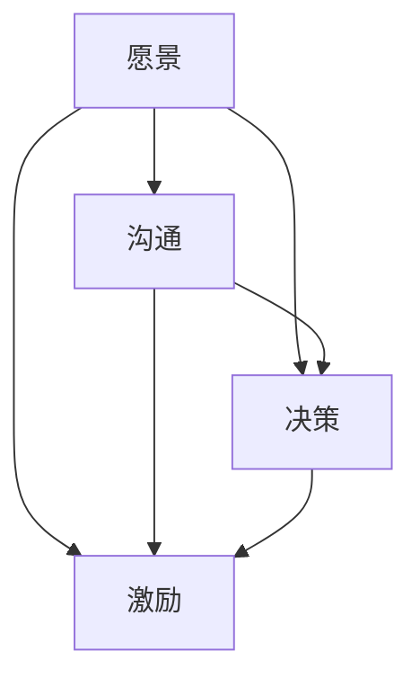
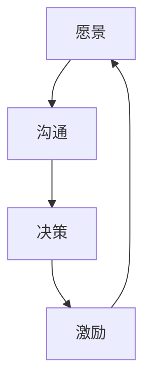

                 

### 引言

在现代企业中，领导力不仅是企业持续发展的关键，更是决定企业命运的核心因素。随着商业环境的不断变化和竞争的加剧，企业需要具备快速适应和创新的能力。而这种能力很大程度上依赖于领导者的高效领导和决策。因此，提升领导力，特别是领导者思维方式的优化，成为企业获得竞争优势的重要手段。

本文以《领导力思维：改变企业命运的领导力修炼》为标题，旨在探讨领导力的本质、核心概念及其在实际应用中的重要性。我们将分步骤地分析领导力思维模式，探讨如何在组织变革、危机管理和团队管理中有效运用领导力，并介绍一些自我提升的方法。此外，我们还将通过案例分析，展示优秀企业的领导力实践，为读者提供实际操作的经验和启示。

文章的核心关键词包括：领导力、思维模式、企业命运、组织变革、危机管理、团队管理、自我提升。这些关键词将贯穿全文，帮助读者更好地理解和掌握领导力的精髓。

文章将按照以下结构展开：

1. **领导力基础**：介绍领导力的定义、历史和发展，探讨领导力的四大核心要素。
2. **领导力思维模式**：深入分析情境领导理论、赋能型领导、跨文化领导和领导力与创新。
3. **领导力实践**：讨论领导力在组织变革、危机管理和团队管理中的应用。
4. **领导力自我提升**：提供自我意识、沟通技巧、决策技巧和时间管理的提升方法。
5. **领导力案例研究**：分析阿里巴巴、谷歌和微软等企业的领导力实践。
6. **总结与拓展**：总结全文内容，提出最佳实践和注意事项。

通过本文的深入探讨，我们希望读者能够理解领导力的重要性，掌握提升领导力的方法和技巧，从而在各自的职业生涯中发挥更大的作用，为企业的发展做出贡献。

### 关键词

- 领导力
- 思维模式
- 企业命运
- 组织变革
- 危机管理
- 团队管理
- 自我提升

这些关键词不仅概括了文章的核心内容，也为读者提供了导航，帮助他们更好地理解文章的主题和结构。

### 摘要

本文《领导力思维：改变企业命运的领导力修炼》旨在深入探讨领导力在企业成功中的关键作用。文章首先定义了领导力的基本概念，并回顾了其历史发展。接着，我们详细分析了领导力的四大核心要素，即愿景、沟通、决策和激励。随后，文章探讨了不同类型的领导力思维模式，包括情境领导理论、赋能型领导、跨文化领导和领导力与创新。这些思维模式不仅提供了理论指导，也为实际应用提供了策略。在实践部分，文章讨论了领导力在组织变革、危机管理和团队管理中的应用，并提供了具体的案例。最后，文章提出了自我提升的方法，包括自我意识、沟通技巧、决策技巧和时间管理。通过这些探讨，本文希望帮助读者理解和掌握领导力的本质，提升自身的领导力水平，为企业的发展做出贡献。

## 领导力基础

领导力是一个广泛且多层次的概念，涉及到从个人素质到组织文化的各个方面。在理解领导力之前，我们首先需要明确其定义。领导力可以被描述为一种影响他人实现共同目标的能力。这种能力不仅仅依赖于职位和权力，更在于领导者如何通过愿景、沟通、决策和激励等手段，引导团队朝着目标前进。

### 领导力的定义

领导力不仅仅是一个职位或角色的名称，而是一种动态的过程。它包括领导者如何与团队成员互动、如何设定目标并激励他们去实现这些目标。有效的领导力需要具备多方面的能力，包括但不限于战略思维、决策能力、沟通技巧和团队建设等。领导力不仅存在于企业高管中，任何在某个领域或团队中具有影响力的人都可以被视为领导者。

### 领导力的发展历程

领导力的发展历程可以追溯到古代的军事和政治领袖。在早期，领导力主要依赖于权威和强制，领导者通过武力和命令来维持秩序和实现目标。然而，随着社会的进步和商业环境的变化，领导力也逐渐从传统的权威型转向更为现代的民主型和参与型。

在20世纪早期，科学管理理论的兴起标志着领导力发展的一个重要阶段。科学管理强调通过数据和效率来优化组织运作，领导者的角色逐渐从“指挥者”转变为“协调者”。20世纪中期，行为科学理论的引入进一步推动了领导力的发展，强调领导者与团队成员之间的互动和关系。这个时期，领导力开始注重人文因素，如信任、尊重和激励。

进入21世纪，领导力的发展进入了多元化阶段。随着全球化、信息化和知识经济的兴起，领导者需要具备跨文化沟通能力、创新思维和快速应变能力。现代领导力不仅关注内部管理，还关注外部环境的变化，强调企业的社会责任和可持续发展。

### 领导力的四大核心要素

领导力是一个多维度的概念，包含多个核心要素。以下是领导力的四大核心要素：

#### 愿景

愿景是领导力的灵魂，它为团队提供了明确的方向和目标。一个优秀的领导者能够清晰地描述愿景，并让团队成员理解和认同这一愿景。愿景不仅激励团队成员追求卓越，还能凝聚团队力量，共同面对挑战。

#### 沟通

沟通是领导力的基础，是领导者与团队成员之间建立信任和合作的桥梁。有效的沟通不仅仅是信息的传递，更包括情感的交流和反馈的机制。领导者需要善于倾听，理解团队成员的需求和期望，并通过有效的表达和沟通，确保信息的准确传递。

#### 决策

决策是领导力的关键，领导者需要通过决策来应对各种复杂的情况和挑战。有效的决策要求领导者具备战略思维和快速判断能力。领导者需要在压力和不确定性中保持冷静，做出明智的决策，并为团队指明方向。

#### 激励

激励是领导力的核心，领导者需要通过激励来激发团队成员的潜力，实现个人和团队的目标。激励不仅仅包括物质奖励，还涵盖精神激励和职业发展机会。领导者需要理解团队成员的不同激励需求，并制定个性化的激励策略，以最大限度地激发团队活力。

#### 愿景、沟通、决策和激励之间的关系

愿景、沟通、决策和激励这四个要素相互关联，共同构成了领导力的核心。愿景为团队提供了方向，沟通为愿景的传递和实现提供了渠道，决策为团队的发展提供了战略指导，激励则为团队的持续动力提供了保障。

通过这四个要素的有机结合，领导者能够有效地引导团队，实现共同的目标。愿景、沟通、决策和激励之间的关系可以用以下Mermaid流程图来表示：



在这个流程图中，愿景是整个流程的起点，通过沟通、决策和激励，最终实现团队的共同目标。这个流程图不仅帮助我们理解了领导力的四大核心要素，也展示了它们之间的相互关系。

通过深入探讨领导力的定义、历史和发展，以及四大核心要素，我们为理解领导力的本质和应用奠定了基础。在接下来的部分，我们将进一步探讨不同类型的领导力思维模式，为读者提供更多的实践指导和策略。

### 领导力的四大核心要素

领导力的四大核心要素——愿景、沟通、决策和激励——是领导者成功的关键。这些要素不仅相互独立，而且在实践中相辅相成，共同推动团队的发展和目标的实现。

#### 愿景

愿景是领导力的灵魂，它为团队提供了明确的方向和目标。一个有远见的领导者能够清晰地描述愿景，并让团队成员理解和认同这一愿景。愿景不仅能够激励团队成员追求卓越，还能凝聚团队力量，共同面对挑战。以下是愿景在领导力中的具体作用：

1. **明确方向**：愿景为团队指明了前进的方向，避免了团队在发展过程中迷失自我。团队成员知道他们的努力是为了实现什么目标，这有助于提高工作效率和团队凝聚力。
   
2. **激励团队**：愿景激励团队成员为实现共同目标而努力。一个鼓舞人心的愿景能够激发团队成员的潜能，使他们在面对困难和挑战时保持积极的态度。

3. **塑造文化**：愿景塑造了团队的文化和价值观，使团队成员在共同的愿景下工作，形成了一种团结协作的氛围。

4. **吸引人才**：一个明确的愿景能够吸引更多优秀人才加入团队，因为他们看到了团队未来的发展方向和机遇。

#### 沟通

沟通是领导力的基础，是领导者与团队成员之间建立信任和合作的桥梁。有效的沟通不仅仅是信息的传递，更包括情感的交流和反馈的机制。以下是沟通在领导力中的具体作用：

1. **传递信息**：沟通是信息传递的渠道，确保团队成员了解公司的目标、策略和计划。信息的准确性对于团队工作的顺利开展至关重要。

2. **建立信任**：通过沟通，领导者能够了解团队成员的需求和期望，并给予及时的反馈和关心。这种双向沟通有助于建立信任，增强团队的凝聚力。

3. **反馈机制**：有效的沟通包括及时反馈，使团队成员能够了解自己的工作表现，并据此进行调整和改进。这有助于提高团队的整体绩效。

4. **解决冲突**：沟通有助于解决团队内部的冲突和误解，确保团队成员能够在共同的目标下和谐合作。

#### 决策

决策是领导力的关键，领导者需要通过决策来应对各种复杂的情况和挑战。有效的决策要求领导者具备战略思维和快速判断能力。以下是决策在领导力中的具体作用：

1. **指导行动**：决策为团队提供了明确的行动指南，使团队成员知道应该做什么、怎么做。这有助于提高团队的工作效率。

2. **应对挑战**：领导者通过决策应对各种突发事件和挑战，保持团队的稳定和持续发展。

3. **展现领导力**：决策是领导者展现领导力的重要方式，通过决策，领导者展示了其远见和判断力，赢得了团队成员的尊重和信任。

4. **优化资源**：有效的决策有助于合理分配和利用资源，避免浪费，提高团队的绩效。

#### 激励

激励是领导力的核心，领导者需要通过激励来激发团队成员的潜力，实现个人和团队的目标。以下是激励在领导力中的具体作用：

1. **激发潜能**：激励能够激发团队成员的潜能，使其在高压和挑战下保持高效率和创造力。

2. **增强凝聚力**：通过激励，领导者能够增强团队的凝聚力，使团队成员在面对困难时能够互相支持和鼓励。

3. **提高满意度**：合理的激励措施能够提高团队成员的工作满意度和忠诚度，减少人才流失。

4. **促进创新**：激励鼓励团队成员提出新的想法和改进措施，促进团队的创新和发展。

#### 四大要素之间的关系

愿景、沟通、决策和激励这四个要素相互关联，共同构成了领导力的核心。以下是一个简化的Mermaid流程图，展示了这四大要素之间的关系：



在这个流程图中，愿景是整个流程的起点，通过沟通、决策和激励，最终实现团队的共同目标。沟通是愿景和决策之间的桥梁，决策为团队提供了行动指南，激励则确保团队成员能够积极、高效地实现目标。

通过深入理解领导力的四大核心要素及其相互关系，领导者能够更有效地引导团队，实现企业的长期发展目标。

### 领导力思维模式

在理解了领导力的基础之后，我们接下来探讨不同的领导力思维模式。这些思维模式不仅提供了理论指导，还为实际应用提供了丰富的策略和方法。以下是几种重要的领导力思维模式：

#### 情境领导理论

情境领导理论是一种基于领导情境和团队成员成熟度进行领导的方法。该理论由赫赛和布兰查德提出，认为领导者的行为应该根据团队成员的成熟度（能力、意愿）来调整。情境领导理论将领导行为分为四个象限，每个象限代表不同的领导风格。

1. **命令型领导**（低成熟度）：在这种情境下，团队成员能力不足、意愿不高，领导者需要通过明确的指示和监督来指导团队成员。

   ```mermaid
   graph TD
   A[命令型] --> B[监督工作流程]
   A --> C[明确任务]
   ```

2. **说服型领导**（较不成熟）：在这种情境下，团队成员能力不足，但意愿较高，领导者需要通过沟通和激励来提高团队成员的信心和动力。

   ```mermaid
   graph TD
   A[说服型] --> B[沟通解释]
   A --> C[激励成员]
   ```

3. **参与型领导**（较成熟）：在这种情境下，团队成员能力较高，但意愿较低，领导者需要通过参与和授权来激发团队成员的积极性。

   ```mermaid
   graph TD
   A[参与型] --> B[授权任务]
   A --> C[团队决策]
   ```

4. **授权型领导**（成熟度最高）：在这种情境下，团队成员能力高、意愿强，领导者只需提供支持和资源，让团队成员自主决策和执行。

   ```mermaid
   graph TD
   A[授权型] --> B[提供资源]
   A --> C[自主决策]
   ```

#### 赋能型领导

赋能型领导是一种强调赋权给团队成员的领导风格，旨在提高团队成员的自主性和责任感。赋能型领导者认为，通过赋权，团队成员不仅能够发挥自己的潜力，还能更有效地实现团队目标。

1. **赋权**：赋能型领导者通过赋权，给予团队成员决策权和资源，使团队成员能够自主解决问题和制定计划。

   ```mermaid
   graph TD
   A[赋权] --> B[决策权]
   A --> C[资源支持]
   ```

2. **信任**：赋能型领导者建立信任，相信团队成员能够做出正确的决策，并在需要时提供支持和指导。

   ```mermaid
   graph TD
   A[信任] --> B[支持]
   A --> C[指导]
   ```

3. **激励**：赋能型领导者通过激励，鼓励团队成员发挥自己的潜力，提高工作效率和团队士气。

   ```mermaid
   graph TD
   A[激励] --> B[奖励]
   A --> C[认可]
   ```

#### 跨文化领导

随着全球化的发展，跨文化领导变得越来越重要。跨文化领导者需要具备跨文化沟通能力和文化敏感度，以有效地管理多元文化团队。

1. **文化理解**：跨文化领导者需要深入了解不同文化的价值观、习俗和行为方式，避免文化冲突。

   ```mermaid
   graph TD
   A[文化理解] --> B[文化差异]
   A --> C[文化适应]
   ```

2. **跨文化沟通**：跨文化领导者需要掌握有效的跨文化沟通技巧，确保信息的准确传递和团队的和谐合作。

   ```mermaid
   graph TD
   A[沟通] --> B[语言能力]
   A --> C[非语言沟通]
   ```

3. **文化敏感度**：跨文化领导者需要具备文化敏感度，能够理解和尊重团队成员的不同文化和背景。

   ```mermaid
   graph TD
   A[敏感度] --> B[尊重]
   A --> C[包容]
   ```

#### 领导力与创新

创新是现代企业保持竞争优势的关键，领导力在推动创新中发挥着重要作用。领导力与创新的关系可以从以下几个方面来理解：

1. **创新愿景**：领导者需要具备创新愿景，能够识别和推动创新机会，为团队提供明确的方向。

   ```mermaid
   graph TD
   A[愿景] --> B[创新机会]
   ```

2. **支持环境**：领导者需要创造一个支持创新的环境，鼓励团队成员提出新想法，并为他们提供资源和支持。

   ```mermaid
   graph TD
   A[支持环境] --> B[资源]
   A --> C[鼓励]
   ```

3. **风险容忍**：领导者需要具备风险容忍度，鼓励团队成员尝试新方法，即使失败也能从中学习和成长。

   ```mermaid
   graph TD
   A[风险容忍] --> B[尝试]
   A --> C[学习]
   ```

4. **跨部门协作**：领导者需要推动跨部门协作，促进不同团队之间的知识共享和资源整合，以实现创新目标。

   ```mermaid
   graph TD
   A[协作] --> B[知识共享]
   A --> C[资源整合]
   ```

通过探讨不同的领导力思维模式，我们不仅能够理解每种模式的特点和应用场景，还能在实际工作中灵活运用这些模式，提高领导力水平，推动企业的发展。

### 领导力在组织变革中的应用

在当今快速变化的商业环境中，组织变革成为企业持续发展的关键。有效的领导力在组织变革中扮演着至关重要的角色，能够推动企业成功地应对变化，实现战略目标。以下是领导力在组织变革中的应用及其重要性：

#### 领导力在组织变革中的角色

1. **制定变革战略**：领导者需要制定明确的变革战略，确定变革的目标、路径和资源配置。这包括设定短期和长期目标，明确变革的优先级，并制定实施计划。

2. **塑造变革文化**：领导者需要塑造支持变革的文化，鼓励团队成员拥抱变化，并将其视为企业发展的一部分。这需要领导者通过沟通、激励和示范，传递变革的重要性，并建立信任和透明度。

3. **激励团队成员**：领导者需要通过激励手段，如认可、奖励和职业发展机会，激发团队成员参与变革的积极性。这有助于提高团队成员的变革意识和主动性。

4. **解决变革中的冲突**：在组织变革过程中，领导者需要解决团队成员之间的冲突和误解，确保团队和谐合作。这包括建立有效的沟通机制，促进团队成员之间的理解和合作。

#### 领导力在组织变革中的具体应用

1. **明确变革愿景**：领导者需要明确变革的愿景和目标，使团队成员了解变革的必要性和预期成果。这可以通过召开会议、发布内部通讯和开展培训等方式来实现。

   ```mermaid
   graph TD
   A[明确愿景] --> B[会议沟通]
   A --> C[内部通讯]
   ```

2. **建立变革团队**：领导者需要建立一个由关键利益相关者组成的变革团队，负责推动变革的实施。这包括确定团队成员的角色和职责，并提供必要的资源和培训。

   ```mermaid
   graph TD
   A[建立团队] --> B[确定角色]
   A --> C[提供资源]
   ```

3. **沟通与协作**：领导者需要通过有效的沟通和协作，确保团队成员之间的信息共享和资源整合。这可以通过定期的团队会议、协作工具和跨部门合作来实现。

   ```mermaid
   graph TD
   A[沟通与协作] --> B[团队会议]
   A --> C[协作工具]
   ```

4. **评估与调整**：领导者需要定期评估变革的进展和效果，并根据实际情况进行调整。这包括设定关键绩效指标（KPI），收集反馈，并制定改进措施。

   ```mermaid
   graph TD
   A[评估与调整] --> B[KPI设定]
   A --> C[反馈收集]
   ```

#### 领导力在组织变革中的关键因素

1. **信任与透明度**：领导者需要建立信任，确保团队成员了解变革的细节和进展，减少误解和猜疑。透明的沟通和公正的决策有助于增强团队成员的信任和忠诚。

   ```mermaid
   graph TD
   A[信任与透明度] --> B[透明沟通]
   A --> C[公正决策]
   ```

2. **领导者的示范作用**：领导者需要通过自己的行为来示范变革的重要性，以身作则，带领团队成员共同应对变革的挑战。这有助于增强团队成员的变革意识和行动力。

   ```mermaid
   graph TD
   A[领导者示范] --> B[以身作则]
   A --> C[积极行动]
   ```

3. **持续激励**：领导者需要持续激励团队成员，通过认可和奖励，鼓励他们在变革中积极参与和贡献。这有助于提高团队成员的士气和积极性。

   ```mermaid
   graph TD
   A[持续激励] --> B[认可奖励]
   A --> C[职业发展]
   ```

通过有效的领导力，企业能够更顺利地应对组织变革，实现战略目标。领导者不仅需要具备变革的战略眼光，还需要通过沟通、激励和协作，推动团队成员积极参与变革，共同面对挑战。在接下来的部分，我们将探讨领导力在危机管理中的应用，进一步展示领导力在复杂情境下的应对策略。

### 领导力在危机管理中的应用

在企业的生命周期中，不可避免地会遇到各种危机事件，如市场变化、技术故障、竞争压力等。有效的危机管理不仅能够帮助企业度过难关，还能提升企业的声誉和竞争力。领导力在危机管理中发挥着关键作用，以下是领导力在危机管理中的应用及其重要性：

#### 领导力在危机管理中的角色

1. **快速响应**：领导者需要具备快速响应危机事件的能力，及时识别和评估危机，制定应急响应计划。这要求领导者具备敏锐的洞察力和迅速的决策能力。

2. **协调资源**：领导者需要协调企业内外部资源，包括人力资源、物资资源和信息资源，确保危机管理计划的顺利实施。这需要领导者具备良好的沟通和协调能力。

3. **沟通与透明**：领导者需要与所有利益相关者保持沟通，包括员工、客户、供应商和监管机构。透明的沟通有助于减少误解和恐慌，增强企业的公信力。

4. **保持稳定**：领导者需要在危机中保持冷静和稳定，为团队成员提供明确的指导和信心，确保企业运营不受重大影响。

#### 领导力在危机管理中的具体应用

1. **制定危机管理计划**：领导者需要制定全面的危机管理计划，包括危机预警、应急响应、危机沟通和恢复计划等。这可以通过建立危机管理团队，制定危机管理手册和定期演练来实现。

   ```mermaid
   graph TD
   A[制定计划] --> B[预警机制]
   A --> C[应急响应]
   ```

2. **组织协调**：在危机事件发生时，领导者需要组织内外部资源，包括调动企业内部团队和寻求外部支持，确保危机管理计划的有效实施。

   ```mermaid
   graph TD
   A[组织协调] --> B[调动资源]
   A --> C[寻求支持]
   ```

3. **沟通与透明**：领导者需要与所有利益相关者保持沟通，包括通过新闻发布会、内部邮件和社交媒体等方式，及时传递危机信息和应对措施。

   ```mermaid
   graph TD
   A[沟通与透明] --> B[信息传递]
   A --> C[利益相关者沟通]
   ```

4. **持续监控与调整**：领导者需要持续监控危机事件的进展，并根据实际情况进行调整。这包括评估危机管理效果，收集反馈，并制定改进措施。

   ```mermaid
   graph TD
   A[持续监控] --> B[效果评估]
   A --> C[反馈调整]
   ```

#### 领导力在危机管理中的关键因素

1. **快速决策能力**：领导者需要具备快速决策能力，在危机事件中迅速做出正确的决策。这要求领导者具备良好的判断力、分析和决策能力。

   ```mermaid
   graph TD
   A[快速决策] --> B[判断力]
   A --> C[分析能力]
   ```

2. **危机应对经验**：领导者需要具备丰富的危机应对经验，能够从容应对各种类型的危机事件。这可以通过模拟演练和危机培训来积累。

   ```mermaid
   graph TD
   A[应对经验] --> B[模拟演练]
   A --> C[危机培训]
   ```

3. **沟通与协作能力**：领导者需要具备良好的沟通和协作能力，能够协调各方资源，确保危机管理计划的顺利实施。

   ```mermaid
   graph TD
   A[沟通与协作] --> B[团队协作]
   A --> C[利益相关者沟通]
   ```

4. **危机意识**：领导者需要具备危机意识，能够预见潜在的危机，并提前制定应对措施。这有助于降低危机对企业的影响。

   ```mermaid
   graph TD
   A[危机意识] --> B[预见能力]
   A --> C[预防措施]
   ```

通过有效的领导力，企业能够更好地应对危机，减少损失，并快速恢复运营。领导者不仅需要具备危机管理的战略眼光，还需要通过快速响应、组织协调、沟通与透明和持续监控等手段，确保企业能够在危机中保持稳定和持续发展。在接下来的部分，我们将探讨领导力在团队管理中的应用，进一步展示领导力在具体管理任务中的实际运用。

### 领导力在团队管理中的应用

在团队管理中，领导力发挥着至关重要的作用，能够显著影响团队的表现和成员的满意度。有效的领导力不仅能够帮助团队明确目标、提升效率，还能够增强团队的凝聚力和创新力。以下是领导力在团队管理中的应用及其具体策略：

#### 团队目标设定

团队目标设定是团队管理的重要一环。领导者需要与团队成员共同制定明确、可衡量的目标，确保团队有清晰的方向和努力的目标。以下是目标设定的具体步骤：

1. **了解团队现状**：领导者需要了解团队的当前状态，包括成员的能力、兴趣和期望，以及团队的整体目标和愿景。

   ```mermaid
   graph TD
   A[了解现状] --> B[团队分析]
   ```

2. **共同制定目标**：领导者需要与团队成员共同讨论和制定目标，确保每个成员都能参与其中，增强目标的认同感和责任感。

   ```mermaid
   graph TD
   A[共同制定] --> B[目标讨论]
   ```

3. **明确目标和责任**：将目标分解为具体的小目标，并明确每个成员在实现目标中的责任和角色。

   ```mermaid
   graph TD
   A[明确目标] --> B[责任分配]
   ```

#### 成员激励

成员激励是提升团队表现的重要手段。领导者需要通过多种激励措施，激发团队成员的积极性和创造力。以下是几种常见的激励方法：

1. **认可与奖励**：领导者需要及时认可和奖励团队成员的成就和贡献，提高成员的工作动力。

   ```mermaid
   graph TD
   A[认可奖励] --> B[奖励机制]
   ```

2. **职业发展**：领导者需要为团队成员提供职业发展的机会和资源，帮助他们在工作中成长和实现个人目标。

   ```mermaid
   graph TD
   A[职业发展] --> B[培训机会]
   ```

3. **工作环境**：领导者需要营造一个积极、健康的工作环境，包括提供适当的资源、支持和合理的压力，以提高团队成员的满意度。

   ```mermaid
   graph TD
   A[工作环境] --> B[支持资源]
   ```

#### 团队协作

团队协作是团队管理的关键，有效的团队协作能够提高工作效率和团队绩效。以下是促进团队协作的策略：

1. **明确分工与责任**：确保每个团队成员都清楚自己的职责和任务，避免职责重叠和推诿。

   ```mermaid
   graph TD
   A[分工与责任] --> B[明确职责]
   ```

2. **建立沟通机制**：领导者需要建立有效的沟通机制，包括定期的会议、工作汇报和即时通讯，确保团队成员之间的信息共享和协作。

   ```mermaid
   graph TD
   A[沟通机制] --> B[定期会议]
   ```

3. **促进知识共享**：领导者需要鼓励团队成员分享知识和经验，建立学习型团队，提高整体能力。

   ```mermaid
   graph TD
   A[知识共享] --> B[经验分享]
   ```

#### 团队发展

团队发展是长期目标，领导者需要关注团队成员的成长和团队的整体进步。以下是团队发展的策略：

1. **培训与发展**：领导者需要为团队成员提供培训和发展机会，提高他们的技能和知识。

   ```mermaid
   graph TD
   A[培训与发展] --> B[技能提升]
   ```

2. **团队建设**：领导者需要定期组织团队建设活动，增强团队成员之间的信任和协作。

   ```mermaid
   graph TD
   A[团队建设] --> B[团队活动]
   ```

3. **绩效反馈**：领导者需要定期提供绩效反馈，帮助团队成员了解自己的工作表现，并制定改进计划。

   ```mermaid
   graph TD
   A[绩效反馈] --> B[反馈机制]
   ```

#### 团队管理中的领导力要素

1. **愿景与目标**：领导者需要具备清晰的愿景和目标，为团队提供明确的方向和动力。

2. **沟通与协作**：领导者需要建立有效的沟通和协作机制，确保团队成员之间的信息共享和协作。

3. **激励与发展**：领导者需要通过认可、奖励和职业发展机会，激励团队成员，并提供成长机会。

4. **信任与尊重**：领导者需要建立信任和尊重，营造一个积极、健康的工作环境。

通过有效的领导力，领导者能够更好地管理团队，提升团队绩效，实现团队目标。在接下来的部分，我们将探讨领导力自我提升的方法，帮助领导者持续发展和完善自己的领导能力。

### 领导力自我提升

领导力是一个动态发展的过程，领导者需要不断学习和提升自己的能力，以适应不断变化的商业环境。自我提升不仅能够增强领导者的信心和影响力，还能为团队和组织的成功奠定基础。以下是领导力自我提升的方法和策略：

#### 自我意识

自我意识是领导力自我提升的基础。领导者需要深入了解自己的价值观、优点和不足，以及自己的行为模式。以下是提升自我意识的方法：

1. **反思**：定期进行自我反思，回顾自己的行为和决策，识别成功的经验和失败的教训。这有助于领导者发现自己的盲点和改进方向。

   ```mermaid
   graph TD
   A[自我反思] --> B[成功经验]
   A --> C[失败教训]
   ```

2. **反馈**：寻求他人的反馈，包括团队成员、同事和上级，了解他们对你的看法和评价。这种外部反馈能够提供不同的视角，帮助领导者更全面地认识自己。

   ```mermaid
   graph TD
   A[反馈机制] --> B[团队成员]
   A --> C[同事上级]
   ```

3. **心理测试**：通过心理测试，如MBTI、DISC等，了解自己的性格特点和行为倾向。这有助于领导者理解自己在不同情境下的行为模式，并针对性地进行改进。

   ```mermaid
   graph TD
   A[心理测试] --> B[MBTI]
   A --> C[DISC]
   ```

#### 沟通技巧

有效的沟通是领导力的核心之一。领导者需要通过沟通来传递愿景、协调团队、解决冲突和激励成员。以下是提升沟通技巧的方法：

1. **倾听**：倾听是有效沟通的关键。领导者需要认真倾听团队成员的意见和建议，理解他们的需求和期望。这有助于建立信任和增强团队的凝聚力。

   ```mermaid
   graph TD
   A[倾听] --> B[理解需求]
   ```

2. **清晰表达**：领导者需要清晰、简洁地表达自己的观点和想法。这包括使用恰当的词汇、语调和肢体语言，确保信息被正确理解和传达。

   ```mermaid
   graph TD
   A[清晰表达] --> B[语调]
   ```

3. **反馈与回应**：领导者需要提供及时的反馈和回应，确保团队成员了解他们的工作表现和改进方向。这有助于提升团队的工作效率和成员的满意度。

   ```mermaid
   graph TD
   A[反馈与回应] --> B[工作表现]
   ```

#### 决策技巧

有效的决策是领导力的关键要素之一。领导者需要通过合理的决策来应对复杂的情况和挑战。以下是提升决策技巧的方法：

1. **信息收集**：领导者需要广泛收集和分析信息，确保决策有充分的数据支持。这包括了解市场趋势、竞争对手和内部资源。

   ```mermaid
   graph TD
   A[信息收集] --> B[数据支持]
   ```

2. **风险评估**：领导者需要对决策的风险进行评估，包括潜在的风险和收益。这有助于领导者做出更全面和平衡的决策。

   ```mermaid
   graph TD
   A[风险评估] --> B[风险收益]
   ```

3. **快速决策**：领导者需要在压力和不确定性中保持冷静，快速做出决策。这需要领导者具备良好的判断力和决策能力。

   ```mermaid
   graph TD
   A[快速决策] --> B[判断力]
   ```

#### 时间管理

有效的领导力还需要良好的时间管理能力。领导者需要合理规划时间，确保工作和生活之间的平衡。以下是提升时间管理技巧的方法：

1. **设定目标**：领导者需要设定明确的时间目标和优先级，确保时间的合理利用。

   ```mermaid
   graph TD
   A[设定目标] --> B[优先级]
   ```

2. **分解任务**：领导者需要将大任务分解为小任务，制定详细的行动计划，确保每个任务都能按时完成。

   ```mermaid
   graph TD
   A[分解任务] --> B[行动计划]
   ```

3. **避免拖延**：领导者需要避免拖延，确保任务按计划进行。这可以通过设置截止日期、定期回顾和自我激励来实现。

   ```mermaid
   graph TD
   A[避免拖延] --> B[截止日期]
   ```

#### 综合策略

为了全面提升领导力，领导者可以采用以下综合策略：

1. **持续学习**：领导者需要不断学习新知识和技能，保持与时俱进。这可以通过参加培训、阅读书籍和参加行业会议来实现。

   ```mermaid
   graph TD
   A[持续学习] --> B[培训]
   A --> C[阅读]
   ```

2. **实践与反思**：领导者需要在实际工作中运用所学知识，并通过反思和总结，不断提升自己的能力。

   ```mermaid
   graph TD
   A[实践与反思] --> B[应用知识]
   A --> C[反思总结]
   ```

3. **建立支持系统**：领导者需要建立支持系统，包括导师、教练和团队，以获得建议和反馈，支持自己的成长。

   ```mermaid
   graph TD
   A[支持系统] --> B[导师]
   A --> C[团队]
   ```

通过自我意识、沟通技巧、决策技巧和时间管理等方面的提升，领导者能够持续发展和完善自己的领导能力，为团队和组织的发展做出更大的贡献。

### 领导力案例研究

为了更好地理解领导力在实际企业中的应用，我们可以通过分析几个成功的企业案例来探讨领导力的具体实践和效果。以下是阿里巴巴、谷歌和微软这三个科技巨头的领导力实践。

#### 阿里巴巴的领导力实践

阿里巴巴作为全球领先的电子商务公司，其领导力实践以愿景驱动、文化建设和创新推动为核心。

1. **愿景驱动**：阿里巴巴的创始人马云一直强调“客户第一、员工第二、股东第三”的愿景。这一愿景不仅为阿里巴巴的发展指明了方向，也塑造了公司独特的文化。通过清晰和有远见的愿景，马云激励了整个团队追求卓越，共同实现企业目标。

2. **文化建设**：阿里巴巴建立了独特的“阿里文化”，强调团队合作、创新精神和客户至上。这种文化不仅增强了员工的归属感，也提高了团队的协作效率。阿里巴巴通过定期的文化培训和团队建设活动，确保文化价值观的传承和强化。

3. **创新推动**：阿里巴巴的领导力强调创新，鼓励员工提出新想法和改进措施。阿里巴巴设立了“创新基金”，支持员工进行创新项目。这种鼓励创新的氛围，使得公司能够持续推出具有市场竞争力的新产品和服务。

#### 谷歌的领导力实践

谷歌作为全球领先的科技公司，其领导力实践以人才管理和创新文化为核心。

1. **人才管理**：谷歌的领导力强调人才的重要性，通过独特的招聘流程和员工发展计划，吸引和保留全球顶尖人才。谷歌的“20%时间项目”允许员工用20%的工作时间来追求个人兴趣项目，这激发了员工的创新潜力，并带来了如Gmail和AdSense等成功产品。

2. **创新文化**：谷歌倡导一种开放、自由和创新的工作文化。公司鼓励员工跨界合作，自由表达观点，并勇于尝试新事物。这种文化不仅提高了员工的工作满意度，也促进了公司的持续创新。

3. **领导力培养**：谷歌重视领导力的培养，通过内部培训项目和导师制度，帮助员工提升领导能力和职业素养。谷歌的领导力发展计划不仅关注个人发展，还强调团队建设和跨部门合作。

#### 微软的领导力转型

微软在经历了一系列领导力变革后，成功实现了从传统软件公司向云计算和人工智能公司的转型。

1. **领导力转型**：萨提亚·纳德拉上任后，提出了“以人为中心”的领导理念，强调员工、客户和合作伙伴的重要性。这种转型使得微软从一个以产品为中心的公司转变为以人为中心的公司，推动了公司的文化变革。

2. **企业文化**：纳德拉倡导“成长心态”和“透明沟通”，鼓励员工勇于尝试和失败，并在失败中学习。这种文化改变了员工的心态，提高了他们的创新能力和适应性。

3. **战略调整**：纳德拉领导下的微软进行了战略调整，将云计算和人工智能作为核心业务方向。通过收购和投资，微软迅速扩大了在云计算和人工智能领域的市场份额，实现了公司的持续增长。

通过这些案例，我们可以看到，成功的领导力实践不仅依赖于明确的愿景和核心价值观，还需要建立创新文化、重视人才管理和持续战略调整。这些企业的领导力实践为我们提供了宝贵的经验和启示，帮助我们在各自的职业生涯中提升领导力水平。

### 总结与展望

在本文《领导力思维：改变企业命运的领导力修炼》中，我们深入探讨了领导力的本质、核心要素及其在实际应用中的重要性。从领导力的定义、历史发展，到四大核心要素——愿景、沟通、决策和激励，再到不同领导力思维模式的应用，我们全面了解了领导力在企业成功中的关键作用。通过分析阿里巴巴、谷歌和微软等成功企业的领导力实践，我们看到了领导力在创新、人才管理和战略调整中的具体体现。

领导力不仅是领导者个人能力的体现，更是企业文化和组织行为的反映。在快速变化的商业环境中，有效的领导力能够帮助企业应对挑战、抓住机遇，实现可持续发展。因此，提升领导力，尤其是领导者思维方式的优化，成为企业获得竞争优势的重要手段。

展望未来，随着技术的进步和商业环境的变化，领导力将面临新的挑战和机遇。领导者需要不断学习新知识、适应新环境，提升自身的领导力和决策能力。同时，领导力的发展也需要关注多元文化和全球化背景下的领导力实践，培养具备跨文化沟通能力和全球化视野的领导者。

本文提出的最佳实践包括：

1. **明确愿景**：领导者需要明确企业的愿景和目标，确保团队有清晰的方向和目标感。
2. **培养沟通技巧**：领导者需要通过有效的沟通，建立信任、增强团队凝聚力，提高工作效率。
3. **持续创新**：领导者需要鼓励创新，创造一个支持创新的环境，推动企业持续发展。
4. **人才管理**：领导者需要重视人才发展，通过培训和激励机制，提升员工的技能和满意度。
5. **文化塑造**：领导者需要塑造积极的企业文化，鼓励员工勇于尝试、承担责任，形成良好的工作氛围。

通过本文的探讨，我们希望读者能够理解领导力的重要性，掌握提升领导力的方法和技巧，为企业的发展做出贡献。在未来的职业生涯中，领导者们需要不断学习和实践，不断提升自己的领导力水平，带领团队实现更大的成就。

### 拓展阅读

为了帮助读者进一步深入理解领导力，我们推荐以下几本经典书籍：

1. **《领导力五项修炼》（The Five Dysfunctions of a Team）** - 帕特里克·莱西奥尼（Patrick Lencioni）
   本书通过一个寓言故事，深入探讨了团队中存在的五大障碍，并提供了解决方案。

2. **《领导者的言语艺术》（The Power of a Positive No）** - 杰弗里·费弗（Jeffrey Pfeffer）
   本书详细介绍了领导者如何通过积极的沟通和拒绝策略，实现个人和团队的目标。

3. **《第五项修炼》（The Fifth Discipline）** - 彼得·圣吉（Peter Senge）
   本书提出了“学习型组织”的概念，探讨了如何通过系统思考等五项修炼，提升领导力和团队绩效。

4. **《变革之舞》（The Dance of Change）** - 丹娜·扎哈维·史密斯（Danah Zohar）和伊芙琳·惠特菲尔德（Ian MacPherson）
   本书通过探讨变革的动态过程，提供了领导者在推动组织变革中的实用策略。

这些书籍不仅提供了深刻的领导力理论，还通过具体案例和实践方法，帮助读者更好地理解和应用领导力。通过阅读这些书籍，读者可以进一步提升自己的领导能力，为企业的发展做出更大的贡献。

