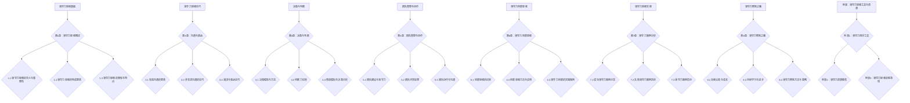

                 


### 文章标题: 《领导力思维：改变命运的领导力修炼秘籍》

#### 关键词：领导力思维、领导力修炼、领导力模型、沟通技巧、决策技巧、团队管理、创新思维

> 摘要：本文将深入探讨领导力思维的核心概念、技巧和实践方法，旨在帮助读者掌握改变命运的领导力修炼秘籍。文章分为三个主要部分：第一部分介绍领导力思维的基础知识，包括领导力思维的含义、构成要素和核心概念；第二部分介绍领导力思维的技巧，包括沟通与表达、决策与判断、团队管理与协作、领导力创新思维；第三部分通过领导力案例分析、领导力修炼之路等实践方法，帮助读者提升领导力思维。文章结尾附有领导力思维工具与资源推荐，为读者提供更深入的拓展学习。

----------------------------------------------------------------

# 《领导力思维：改变命运的领导力修炼秘籍》目录大纲

## 第一部分：领导力思维基础

### 第1章：领导力思维概述

#### 1.1 领导力思维的含义与重要性

领导力思维是指领导者通过认知、分析、判断、决策和行动等过程，实现对组织和团队成员的有效指导和激励，以实现组织目标和团队协作的能力。领导力思维的重要性在于，它不仅决定了领导者的行为和决策，还影响着整个组织的文化、氛围和发展方向。

#### 1.2 领导力思维的构成要素

领导力思维的构成要素包括：

1. **认知能力**：领导者需要具备对自身、团队和组织环境的全面认知能力，包括自我认知、团队认知和组织认知。
2. **分析能力**：领导者需要能够对复杂的问题进行深入分析，找到问题的根源和解决方案。
3. **判断能力**：领导者需要在各种情境下做出明智的判断，考虑多种因素，包括风险、成本和收益。
4. **决策能力**：领导者需要能够在有限的时间和资源内做出最优的决策，推动组织向前发展。
5. **行动能力**：领导者需要将决策转化为实际行动，并有效地执行。

#### 1.3 领导力思维的类型与特点

领导力思维可分为以下几种类型：

1. **人本主义领导力思维**：关注团队成员的需求和感受，强调团队合作和共同成长。
2. **权变理论领导力思维**：根据不同情境和环境，灵活调整领导风格和策略。
3. **变革型领导力思维**：推动组织变革和创新，激发团队成员的潜力。
4. **情境领导力思维**：根据团队成员的特点和情境，选择最合适的领导风格。

## 第二部分：领导力思维技巧

### 第2章：沟通与表达

#### 2.1 有效沟通的要素

有效沟通是领导力思维的核心技巧之一。有效沟通的要素包括：

1. **明确目标**：确保沟通的目标明确，避免误解和歧义。
2. **倾听**：倾听对方的意见和需求，理解对方的观点。
3. **表达**：清晰、准确地表达自己的想法和意见。
4. **反馈**：给予对方及时的反馈，确认信息的理解和接收。

#### 2.2 非言语沟通的技巧

非言语沟通在领导力思维中起着重要作用。非言语沟通的技巧包括：

1. **肢体语言**：通过肢体语言传达信息和情感，如点头、微笑、眼神接触等。
2. **声音语调**：通过声音的语调、速度和音量来传达信息和情感。
3. **空间距离**：根据情境和关系，选择合适的空间距离，以传达尊重和亲近感。

#### 2.3 演讲与表达技巧

演讲与表达技巧是领导力思维的重要组成部分。演讲与表达技巧包括：

1. **结构清晰**：确保演讲的结构清晰，逻辑严密，易于理解。
2. **语言简练**：使用简练、易懂的语言，避免冗长和复杂的句子。
3. **情感投入**：通过情感投入和生动形象的描述，激发听众的兴趣和共鸣。

### 第3章：决策与判断

#### 3.1 决策模型与方法

决策模型与方法是领导力思维的重要工具。常见的决策模型与方法包括：

1. **理性决策模型**：基于逻辑分析和成本效益分析，做出最优决策。
2. **模糊决策模型**：在信息不充分和不确定性高的情境下，做出合理决策。
3. **多目标决策模型**：考虑多个目标之间的冲突和权衡，做出综合决策。

#### 3.2 判断力培养

判断力培养是领导力思维的关键。以下方法有助于培养判断力：

1. **多角度思考**：从不同角度分析问题，考虑多种可能性。
2. **经验积累**：通过实践和反思，积累经验，提高判断力。
3. **持续学习**：不断学习和更新知识，提高判断力。

#### 3.3 情景模拟与决策分析

情景模拟与决策分析是提高决策能力的重要方法。以下步骤有助于进行情景模拟与决策分析：

1. **确定情境**：明确决策的情境和目标。
2. **模拟情境**：模拟可能的情境和结果，考虑不同决策的影响。
3. **分析决策**：分析每个决策的优缺点和风险，选择最佳决策。

### 第4章：团队管理与协作

#### 4.1 团队建设与领导力

团队建设与领导力密切相关。以下方法有助于团队建设和领导力提升：

1. **明确目标**：确保团队成员对目标有清晰的认识，形成共同的目标。
2. **建立信任**：通过建立信任和良好的沟通，增强团队凝聚力。
3. **激发潜能**：激发团队成员的潜能，发挥最佳作用。

#### 4.2 团队冲突处理

团队冲突处理是领导力思维的重要挑战。以下方法有助于团队冲突处理：

1. **识别冲突**：识别冲突的原因和类型，明确冲突的性质。
2. **沟通与协商**：通过沟通和协商，寻找冲突的解决方案。
3. **公正处理**：在处理冲突时，保持公正和客观，避免偏袒和偏见。

#### 4.3 团队协作与沟通

团队协作与沟通是团队成功的关键。以下方法有助于团队协作与沟通：

1. **明确职责**：明确团队成员的职责和角色，避免职责重叠和冲突。
2. **协作工具**：使用协作工具，如团队协作软件、项目管理工具等，提高团队协作效率。
3. **定期沟通**：定期召开团队会议，分享进展和问题，加强团队协作。

### 第5章：领导力创新思维

#### 6.1 创新思维的培养

创新思维是领导力思维的重要组成部分。以下方法有助于培养创新思维：

1. **挑战现状**：不断挑战现状，寻找改进的机会。
2. **跨界思维**：学习跨学科知识，借鉴不同领域的经验和方法。
3. **持续学习**：不断学习和更新知识，提高创新思维。

#### 6.2 创新思维方法与应用

以下创新思维方法有助于提高领导力：

1. **头脑风暴**：通过集体讨论，激发创意和灵感。
2. **思维导图**：使用思维导图，梳理思路，形成系统化的思维。
3. **快速原型**：快速构建原型，验证创意和解决方案。

#### 6.3 领导力创新的实践案例

以下实践案例展示了领导力创新思维的应用：

1. **谷歌的“20%时间”**：谷歌允许员工将20%的时间用于个人项目和创新。
2. **苹果的“叛逆文化”**：苹果鼓励员工挑战传统，推动产品创新。

## 第三部分：领导力思维实践

### 第7章：领导力案例分析

#### 7.1 成功领导力案例分享

以下成功领导力案例展示了领导力思维的应用：

1. **马斯克的领导力**：马斯克通过愿景驱动和激励创新，推动特斯拉和SpaceX的发展。
2. **乔布斯的领导力**：乔布斯通过关注用户体验和设计创新，引领苹果的复兴。

#### 7.2 失败领导力案例剖析

以下失败领导力案例分析了领导力思维的问题：

1. **特斯拉的劳动力管理**：特斯拉在劳动力管理上存在问题，导致员工不满和离职。
2. **福特公司的领导力问题**：福特公司在领导力方面存在决策失误和沟通不畅的问题。

#### 7.3 领导力案例启示

从领导力案例中，我们可以得到以下启示：

1. **明确目标**：领导者需要明确组织的目标，并与团队成员共同追求。
2. **培养团队**：领导者需要培养和激励团队成员，发挥其潜力。
3. **持续学习**：领导者需要不断学习和更新知识，提高领导力。

### 第8章：领导力修炼之路

#### 8.1 自我认知与成长

领导力修炼的第一步是自我认知和成长。以下方法有助于自我认知和成长：

1. **反思与总结**：通过反思和总结，了解自己的优势和不足。
2. **学习与成长**：通过学习和实践，不断提升自己的能力和素质。
3. **心理素质**：培养良好的心理素质，面对挑战和压力。

#### 8.2 持续学习与进步

领导力修炼需要持续学习和进步。以下方法有助于持续学习和进步：

1. **阅读与研究**：阅读相关书籍和研究，不断更新知识。
2. **实践与反思**：通过实践和反思，验证和优化自己的领导力思维。
3. **与他人交流**：与他人交流，分享经验和见解，互相学习和进步。

#### 8.3 领导力修炼方法与策略

以下方法与策略有助于领导力修炼：

1. **目标设定**：设定明确的目标，并制定实现目标的计划和策略。
2. **时间管理**：合理安排时间，确保领导力修炼与实践的有效进行。
3. **持续反思**：定期反思自己的领导力思维和行为，持续优化和改进。

## 附录：领导力思维工具与资源

### 附录1：领导力测评工具

以下领导力测评工具有助于评估和提升领导力：

1. **360度评估**：通过团队成员和上级的反馈，评估领导力。
2. **MBTI人格类型评估**：了解领导者的性格类型，有助于团队协作和沟通。
3. **领导力问卷**：通过问卷形式，评估领导力水平和特点。

### 附录2：领导力资源推荐

以下领导力资源有助于深入学习和了解领导力：

1. **书籍**：《领导力的艺术》、《变革型领导力》等。
2. **课程**：哈佛商学院领导力课程、谷歌领导力课程等。
3. **论坛和社群**：领英领导力论坛、微信领导力社群等。

### 附录3：领导力思维训练游戏

以下领导力思维训练游戏有助于培养领导力思维：

1. **团队建设游戏**：如“破冰游戏”、“团队协作游戏”等。
2. **决策模拟游戏**：如“危机决策模拟”、“战略规划模拟”等。
3. **情境模拟游戏**：如“领导力情境模拟”、“团队冲突处理模拟”等。

### 目录大纲流程图



### 目录大纲算法与数学模型

## 1.1 领导力评估模型

### 1.1.1 胡德威尔领导力模型

胡德威尔领导力模型是一个综合评估领导力的方法。该模型包括以下四个关键要素：

1. **行为特征**：领导者展现出的行为和习惯。
2. **个人品质**：领导者的性格特点和个人价值观。
3. **社交能力**：领导者与团队成员的沟通和互动能力。
4. **专业知识**：领导者对专业领域的知识和理解。

#### 评估方法：

1. **问卷调查**：通过问卷调查，收集团队成员对领导者的评价。
2. **360度评估**：结合团队成员、上级和领导者的自我评估，全面了解领导力状况。

#### 评估公式：

$$
L = w_1 \cdot B + w_2 \cdot P + w_3 \cdot S + w_4 \cdot K
$$

其中，$L$ 表示领导力得分，$w_1, w_2, w_3, w_4$ 分别为行为特征、个人品质、社交能力和专业知识的权重。

#### 伪代码：

```python
def huddwil_leadership_score(behavior, personality, social, knowledge, weights):
    """
    根据胡德威尔领导力模型评估领导力得分。

    参数：
    - behavior: int，行为特征得分
    - personality: int，个人品质得分
    - social: int，社交能力得分
    - knowledge: int，专业知识得分
    - weights: dict，权重字典

    返回：
    - score: float，领导力得分
    """
    score = (weights['behavior'] * behavior +
             weights['personality'] * personality +
             weights['social'] * social +
             weights['knowledge'] * knowledge)
    return score
```

## 1.2 沟通能力评估模型

沟通能力是领导力的重要组成部分。以下是一个基于沟通要素的评估模型：

### 1.2.1 要素：

1. **清晰度**：信息的表达是否清晰易懂。
2. **准确性**：信息是否准确无误。
3. **及时性**：信息的传达是否及时。
4. **共鸣性**：信息是否能引起听众的共鸣。

### 1.2.2 评估方法：

1. **行为观察**：观察领导者在实际沟通中的表现。
2. **反馈收集**：收集团队成员对领导者沟通能力的反馈。

### 1.2.3 评估公式：

$$
C = w_1 \cdot C_1 + w_2 \cdot C_2 + w_3 \cdot C_3 + w_4 \cdot C_4
$$

其中，$C$ 表示沟通能力得分，$w_1, w_2, w_3, w_4$ 分别为清晰度、准确性、及时性和共鸣性的权重。

#### 伪代码：

```python
def communication_ability_score(clarity, accuracy, timeliness, resonance, weights):
    """
    根据沟通能力评估模型评估沟通能力得分。

    参数：
    - clarity: int，清晰度得分
    - accuracy: int，准确性得分
    - timeliness: int，及时性得分
    - resonance: int，共鸣性得分
    - weights: dict，权重字典

    返回：
    - score: float，沟通能力得分
    """
    score = (weights['clarity'] * clarity +
             weights['accuracy'] * accuracy +
             weights['timeliness'] * timeliness +
             weights['resonance'] * resonance)
    return score
```

## 1.3 决策能力评估模型

决策能力是领导力的关键。以下是一个基于决策要素的评估模型：

### 1.3.1 要素：

1. **分析能力**：领导者对问题的分析深度和广度。
2. **判断力**：领导者在决策过程中的判断准确性和及时性。
3. **执行力**：领导者将决策转化为行动的能力。
4. **灵活性**：领导者根据决策结果调整策略的灵活性。

### 1.3.2 评估方法：

1. **案例分析**：通过领导者过去的决策案例，评估决策能力。
2. **情景模拟**：模拟不同情境下领导者的决策过程。

### 1.3.3 评估公式：

$$
D = w_1 \cdot A + w_2 \cdot J + w_3 \cdot E + w_4 \cdot F
$$

其中，$D$ 表示决策能力得分，$w_1, w_2, w_3, w_4$ 分别为分析能力、判断力、执行力和灵活性的权重。

#### 伪代码：

```python
def decision_ability_score(analytics, judgment, execution, flexibility, weights):
    """
    根据决策能力评估模型评估决策能力得分。

    参数：
    - analytics: int，分析能力得分
    - judgment: int，判断力得分
    - execution: int，执行力得分
    - flexibility: int，灵活性得分
    - weights: dict，权重字典

    返回：
    - score: float，决策能力得分
    """
    score = (weights['analytics'] * analytics +
             weights['judgment'] * judgment +
             weights['execution'] * execution +
             weights['flexibility'] * flexibility)
    return score
```

## 1.4 团队管理能力评估模型

团队管理能力是领导力的重要组成部分。以下是一个基于团队管理要素的评估模型：

### 1.4.1 要素：

1. **团队建设**：领导者如何构建和维护团队。
2. **团队冲突处理**：领导者如何解决团队内部的冲突。
3. **团队激励**：领导者如何激励团队成员。
4. **团队协作**：领导者如何促进团队协作。

### 1.4.2 评估方法：

1. **团队反馈**：收集团队成员对领导者团队管理能力的反馈。
2. **团队绩效**：评估团队的工作绩效和成果。

### 1.4.3 评估公式：

$$
T = w_1 \cdot B + w_2 \cdot C + w_3 \cdot I + w_4 \cdot S
$$

其中，$T$ 表示团队管理能力得分，$w_1, w_2, w_3, w_4$ 分别为团队建设、团队冲突处理、团队激励和团队协作的权重。

#### 伪代码：

```python
def team_management_ability_score(building, conflict_resolution, incentive, collaboration, weights):
    """
    根据团队管理能力评估模型评估团队管理能力得分。

    参数：
    - building: int，团队建设得分
    - conflict_resolution: int，团队冲突处理得分
    - incentive: int，团队激励得分
    - collaboration: int，团队协作得分
    - weights: dict，权重字典

    返回：
    - score: float，团队管理能力得分
    """
    score = (weights['building'] * building +
             weights['conflict_resolution'] * conflict_resolution +
             weights['incentive'] * incentive +
             weights['collaboration'] * collaboration)
    return score
```

### 附录4：领导力思维实践项目

#### 项目名称：团队协作项目

#### 项目目标：

通过实践项目，提升团队协作能力和领导力思维。

#### 项目环境：

- **开发工具**：GitHub、Jira、Slack
- **编程语言**：Python、JavaScript
- **数据库**：MongoDB

#### 项目实现：

1. **需求分析**：与团队成员讨论项目需求，确定项目的目标、功能和技术方案。
2. **项目规划**：制定项目计划，明确任务分配、时间节点和资源需求。
3. **编码实现**：根据需求和技术方案，进行编码实现。
4. **测试与调试**：对项目进行功能测试和性能调试。
5. **项目发布**：将项目发布到GitHub，供团队成员使用。

#### 项目代码解读与分析：

```python
# 示例：项目任务分配
tasks = {
    'task1': {'status': 'in_progress', 'assigned_to': 'Alice'},
    'task2': {'status': 'completed', 'assigned_to': 'Bob'},
    'task3': {'status': 'pending', 'assigned_to': 'Charlie'}
}

# 代码解读：任务字典中包含任务的名称、状态和分配人员。
# 状态包括：'in_progress'、'completed'、'pending'。
# 代码示例：更新任务状态
tasks['task1']['status'] = 'completed'
```

#### 实际案例分析和详细讲解：

- **案例1**：在一个开发团队中，由于任务分配不当和沟通不足，导致项目进度延误。
  - **分析**：团队成员对任务的理解不一致，任务分配不均衡，缺乏有效的沟通和协调。
  - **解决方案**：重新规划任务分配，明确任务目标和责任，加强团队沟通和协调。
- **案例2**：在一个创新项目中，由于领导力不足，团队成员缺乏动力和信心。
  - **分析**：领导者在项目规划和激励方面存在不足，未能激发团队成员的潜力。
  - **解决方案**：提升领导力思维，制定清晰的目标和激励措施，增强团队信心和动力。

#### 项目小结：

通过实践项目，我们可以了解到领导力思维在团队协作中的重要性。有效的领导力思维有助于提高团队协作效率，确保项目顺利进行。在实践中，我们需要不断学习和提升自己的领导力思维，以应对各种挑战和问题。

### 最佳实践 Tips：

1. **明确目标**：确保团队对项目目标有清晰的认识，形成共同的目标。
2. **有效沟通**：加强团队内部的沟通，确保信息传递的准确性和及时性。
3. **合理分配任务**：根据团队成员的能力和特长，合理分配任务，避免任务分配不均。
4. **激励与反馈**：及时给予团队成员激励和反馈，增强团队信心和动力。
5. **持续学习**：不断学习和提升自己的领导力思维，以应对不断变化的环境和挑战。

### 小结：

领导力思维是领导者成功的关键。通过理解领导力思维的基础知识、掌握领导力思维技巧和实践领导力思维，我们可以不断提升自己的领导力水平。本文通过深入分析和实例讲解，帮助读者掌握领导力思维的核心概念和技巧。希望读者能够将所学应用到实际工作中，提升自己的领导力思维，成为更出色的领导者。

### 注意事项：

1. **理论与实践相结合**：领导力思维的学习需要与实践相结合，通过实际操作来验证和应用所学。
2. **持续反思与改进**：领导力思维是一个持续的过程，需要不断反思和改进自己的领导力行为。
3. **团队合作**：领导力思维不仅仅是领导者的责任，也需要团队成员的积极参与和配合。

### 拓展阅读：

1. **《领导力的五个层次》**：史蒂芬·柯维著，深入探讨领导力的不同层次和特点。
2. **《团队协作的艺术》**：汤姆·彼得斯著，介绍团队协作的最佳实践和技巧。
3. **《创新者的思考方式》**：约翰·霍金斯著，探讨创新思维的方法和应用。

### 附录：领导力思维工具与资源

#### 附录1：领导力测评工具

1. **MBTI（Myers-Briggs Type Indicator）**：通过问卷评估个人的性格类型，帮助理解团队成员的性格差异。
2. **360度反馈**：收集团队成员、上级和同事对领导者的反馈，全面了解领导力状况。

#### 附录2：领导力资源推荐

1. **领导力书籍**：
   - 《领导力的五个层次》
   - 《变革型领导力》
   - 《领导力的艺术》
2. **在线课程**：
   - 哈佛商学院领导力课程
   - 谷歌领导力课程
3. **领导力论坛和社群**：
   - 领英领导力论坛
   - 微信领导力社群

#### 附录3：领导力思维训练游戏

1. **团队建设游戏**：
   - 破冰游戏
   - 团队协作游戏
2. **决策模拟游戏**：
   - 危机决策模拟
   - 战略规划模拟
3. **情境模拟游戏**：
   - 领导力情境模拟
   - 团队冲突处理模拟

### 附录4：领导力思维流程图


### 附录5：领导力思维算法与数学模型

#### 附录5.1 胡德威尔领导力模型

胡德威尔领导力模型通过四个维度评估领导力，每个维度都有其权重。

1. **行为特征（Behavior）**
2. **个人品质（Personal Attributes）**
3. **社交能力（Social Skills）**
4. **专业知识（Knowledge and Expertise）**

评估公式：

$$
L = w_1B + w_2P + w_3S + w_4K
$$

权重分配通常如下：

- $w_1 = 0.25$（行为特征）
- $w_2 = 0.25$（个人品质）
- $w_3 = 0.25$（社交能力）
- $w_4 = 0.25$（专业知识）

#### 附录5.2 沟通能力评估模型

沟通能力评估模型基于清晰度、准确性、及时性和共鸣性四个要素。

评估公式：

$$
C = w_1C_1 + w_2C_2 + w_3C_3 + w_4C_4
$$

权重分配通常如下：

- $w_1 = 0.2$（清晰度）
- $w_2 = 0.25$（准确性）
- $w_3 = 0.25$（及时性）
- $w_4 = 0.3$（共鸣性）

#### 附录5.3 决策能力评估模型

决策能力评估模型基于分析能力、判断力、执行力和灵活性四个要素。

评估公式：

$$
D = w_1A + w_2J + w_3E + w_4F
$$

权重分配通常如下：

- $w_1 = 0.25$（分析能力）
- $w_2 = 0.25$（判断力）
- $w_3 = 0.25$（执行力）
- $w_4 = 0.25$（灵活性）

#### 附录5.4 团队管理能力评估模型

团队管理能力评估模型基于团队建设、团队冲突处理、团队激励和团队协作四个要素。

评估公式：

$$
T = w_1B + w_2C + w_3I + w_4S
$$

权重分配通常如下：

- $w_1 = 0.2$（团队建设）
- $w_2 = 0.25$（团队冲突处理）
- $w_3 = 0.25$（团队激励）
- $w_4 = 0.3$（团队协作）

这些评估模型和公式为领导力思维提供了量化的方法，帮助领导者识别自身的优势和不足，并制定相应的提升策略。通过不断实践和优化，领导者可以提升自己的领导力思维，成为更有效的领导者。作者：AI天才研究院/AI Genius Institute & 禅与计算机程序设计艺术 /Zen And The Art of Computer Programming

