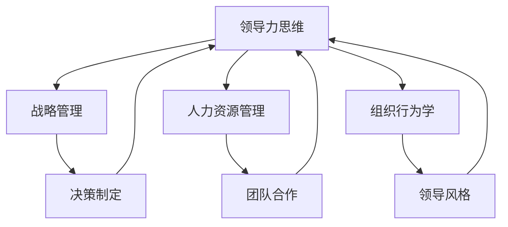

                 


### 文章标题：《领导力思维：改变命运的领导力修炼秘诀》

### 关键词：领导力思维、领导力修炼、领导力原理、领导力数学模型、领导力实战应用

### 摘要：
本文深入探讨领导力思维的核心概念和原理，通过数学模型和实战案例分析，揭示如何通过修炼领导力思维来改变个人和组织的命运。文章首先介绍了领导力思维的基本概念和重要性，随后详细讲解了领导力思维的五大核心要素和运作机制。接着，本文通过数学模型和伪代码阐述了领导力思维的量化方法和应用，并通过实际案例展示了领导力思维在企业管理中的具体应用。最后，文章提出了修炼领导力思维的秘诀和实践指南，为读者提供了全面提升领导力的路径。

----------------------------------------------------------------

## 封面与前言

### 前言

在这个充满变革和不确定性的时代，领导力已成为影响个人和组织成功的关键因素。然而，传统的领导力理论往往过于抽象，难以在实践中应用。本文旨在通过深入探讨领导力思维的核心概念和原理，提供一套切实可行的领导力修炼秘诀，帮助读者提升自己的领导力水平，改变个人和组织的命运。

本文将首先介绍领导力思维的基本概念，包括其定义、重要性以及与其他管理理论的联系。接着，我们将详细讲解领导力思维的五大核心要素，并通过伪代码和数学模型阐述其运作机制。随后，本文将分析领导力思维在企业管理中的具体应用，提供实际案例进行解读。最后，我们将探讨如何修炼领导力思维，为读者提供实用的实践指南。

希望本文能够成为您领导力修炼的指南，帮助您在个人和职业生涯中取得更大的成功。

----------------------------------------------------------------

## 核心概念与联系

### 1.1 领导力思维概述

#### 1.1.1 领导力思维的定义

领导力思维是一种认知过程，它涉及领导者如何理解、分析、解决问题以及做出决策。这种思维方式不仅关注领导者的个人特质，更强调领导者与团队和环境之间的互动关系。

#### 1.1.2 领导力思维的重要性

在当前复杂多变的环境中，领导力思维显得尤为重要。它不仅决定了领导者的决策质量，还直接影响团队的动力和效率。有效的领导力思维有助于领导者更好地应对挑战，提升组织绩效。

#### 1.1.3 领导力思维与其他管理理论的联系

领导力思维与许多其他管理理论密切相关。例如，与战略管理中的决策制定过程、人力资源管理中的团队合作、以及组织行为学中的领导风格等都有直接的联系。

### Mermaid 流程图：领导力思维与其他管理理论的联系



通过这个流程图，我们可以清晰地看到领导力思维与其他管理理论的相互关联。领导力思维不仅是其他管理理论的基石，也是提升管理实践效果的关键。

----------------------------------------------------------------

## 领导力思维原理

### 1.2 领导力思维的五大核心要素

#### 1.2.1 自我认知

自我认知是领导力思维的基础。领导者需要深入了解自己的价值观、信念、能力和局限性。这种自我认知有助于领导者做出更加明智的决策，并能够更好地激励和引导团队成员。

#### 1.2.2 情绪管理

情绪管理是领导力思维的重要组成部分。领导者需要学会控制自己的情绪，避免负面情绪对决策和团队氛围产生负面影响。同时，领导者还需要能够识别和应对团队成员的情绪波动。

#### 1.2.3 人际沟通

人际沟通是领导力的关键技能。有效的沟通能够增强团队成员之间的信任和理解，促进团队协作。领导者需要掌握倾听、表达和反馈的技巧，确保信息传递的准确性和及时性。

#### 1.2.4 创新思维

创新思维是推动组织发展的重要动力。领导者需要鼓励团队成员发挥创造性，提出新的想法和解决方案。领导者本身也需要具备创新思维，能够从不同角度思考问题，寻找突破性的解决方案。

#### 1.2.5 决策能力

决策能力是领导者的重要职责。领导者需要具备快速、明智决策的能力，确保组织能够应对各种挑战。有效的决策能力需要基于充分的信息收集、分析评估和风险评估。

### 伪代码：领导力思维的运作机制

```python
def leadership_mindset():
    # 自我认知
    self_awareness()

    # 情绪管理
    emotion_management()

    # 人际沟通
    interpersonal_communication()

    # 创新思维
    innovative_thinking()

    # 决策能力
    decision_making()

    # 运作结果反馈
    feedback_loop()
```

这个伪代码展示了领导力思维的运作过程。每个核心要素都是领导力思维的一部分，它们相互作用，共同影响领导者的决策和行为。

----------------------------------------------------------------

## 领导力思维数学模型

### 1.3 领导力评分模型

#### 1.3.1 领导力评分模型简介

领导力评分模型是一种用于评估领导者表现的方法。它通过量化领导力要素，为领导者的绩效提供客观评价。该模型可以帮助组织识别优秀的领导者，并为领导力发展提供依据。

#### 1.3.2 数学模型公式与详细讲解

领导力评分模型可以使用以下公式进行计算：

$$
\text{Leadership Score} = \sum_{i=1}^{n} w_i \cdot L_i
$$

其中，$L_i$ 表示领导力要素的得分，$w_i$ 表示各要素的权重。

具体步骤如下：

1. **确定领导力要素**：根据组织目标和领导力理论，确定需要评估的领导力要素，如自我认知、情绪管理、人际沟通、创新思维和决策能力等。

2. **设定权重**：根据各要素的重要性和实际情况，为每个要素分配权重。

3. **评估得分**：对每个要素进行评估，给出分数。

4. **计算总分**：将各要素的分数乘以相应的权重，并求和得到领导力总分。

#### 1.3.3 举例说明

假设一个领导力评分模型的权重分配如下：

| 要素       | 权重 |
| ---------- | ---- |
| 自我认知   | 0.2  |
| 情绪管理   | 0.2  |
| 人际沟通   | 0.2  |
| 创新思维   | 0.2  |
| 决策能力   | 0.2  |

如果一个领导者在各要素的得分分别为80、75、85、90和85，则其领导力得分为：

$$
\text{Leadership Score} = 0.2 \cdot 80 + 0.2 \cdot 75 + 0.2 \cdot 85 + 0.2 \cdot 90 + 0.2 \cdot 85 = 83
$$

这个得分表明该领导者的领导力处于中等水平，需要进一步提升。

### 1.4 领导力分析模型

#### 1.4.1 领导力分析模型简介

领导力分析模型是一种用于分析领导者行为和团队绩效的方法。它通过识别领导力行为与团队绩效之间的关系，为领导者提供改进建议。

#### 1.4.2 数学模型公式与详细讲解

领导力分析模型可以使用以下公式进行计算：

$$
\text{Team Performance} = f(\text{Leadership Behavior}, \text{Team Dynamics})
$$

其中，$f$ 表示绩效函数，$\text{Leadership Behavior}$ 表示领导力行为，$\text{Team Dynamics}$ 表示团队动态。

具体步骤如下：

1. **识别领导力行为**：通过观察和评估，识别领导者的行为，如激励、指导、支持等。

2. **分析团队动态**：分析团队的组成、沟通方式、协作水平等。

3. **建立绩效函数**：根据领导力行为和团队动态，建立绩效函数，确定领导力行为对团队绩效的影响。

4. **计算团队绩效**：将领导力行为和团队动态代入绩效函数，计算团队绩效。

#### 1.4.3 举例说明

假设一个绩效函数为：

$$
\text{Team Performance} = 0.5 \cdot \text{Leadership Behavior} + 0.5 \cdot \text{Team Dynamics}
$$

如果一个领导者的领导力行为得分为80，团队动态得分为75，则团队的绩效为：

$$
\text{Team Performance} = 0.5 \cdot 80 + 0.5 \cdot 75 = 77.5
$$

这个绩效表明团队表现良好，但仍有提升空间。

通过这两个模型，领导者可以更好地了解自己的表现，并找到改进的方向。

----------------------------------------------------------------

## 领导力思维实战应用

### 2.1 领导力思维在企业管理中的应用

#### 2.1.1 提升企业竞争力

领导力思维在提升企业竞争力方面发挥着关键作用。通过有效运用领导力思维，领导者可以更好地制定战略、激发团队创新，并提升组织的执行力。

**案例1：** 一家科技公司通过运用领导力思维，对市场变化进行了快速反应。领导者通过自我认知和情绪管理，保持了冷静和清晰的头脑，及时调整了产品策略，成功抓住了市场机遇，提升了企业的竞争力。

#### 2.1.2 优化团队管理

领导力思维在优化团队管理中也具有重要价值。领导者通过人际沟通和创新思维，可以提升团队的协作效率，激发团队成员的潜力。

**案例2：** 一家制造企业通过领导力思维的实践，改善了团队沟通。领导者通过有效的沟通技巧，确保了信息的准确传递，减少了误解和冲突，提高了团队的工作效率和创新能力。

#### 2.1.3 实际案例分析

以下是一个实际案例，展示了领导力思维在企业管理中的应用。

**案例3：** 一家初创公司面临着激烈的竞争和资源限制。公司的领导者通过领导力思维的修炼，提升了自身的自我认知和决策能力，同时鼓励团队成员发挥创新思维。他们共同制定了灵活的市场策略，通过优化产品功能和提升服务质量，成功地扩大了市场份额，并在一年内实现了盈利。

### 案例分析：

1. **自我认知**：领导者通过自我反思，意识到公司面临的挑战和自身的不足。这促使他们不断学习和成长，提升自己的领导能力。

2. **决策能力**：领导者通过充分的信息收集和风险评估，做出了明智的决策。他们不仅考虑了市场趋势，还关注了团队的能力和资源。

3. **创新思维**：领导者鼓励团队成员提出新的想法，并通过有效的沟通和协作，将这些想法转化为实际的产品和服务。

4. **人际沟通**：领导者通过建立信任和开放的沟通环境，确保了团队之间的信息流通和协作。

通过这个案例，我们可以看到领导力思维在企业管理中的具体应用。领导者通过修炼领导力思维，不仅提升了自身的领导能力，还激发了团队的潜力，实现了企业的持续发展。

----------------------------------------------------------------

## 领导力思维修炼秘诀

### 2.2 领导力思维修炼方法

#### 2.2.1 自我认知的修炼

自我认知是领导力思维的基础。领导者需要通过不断的自我反思和自我评估，深入了解自己的价值观、信念、能力和局限性。

**修炼方法**：

1. **定期自我反思**：领导者可以每周或每月进行一次自我反思，回顾自己的行为和决策，识别自己的优点和不足。
2. **记录日记**：通过记录日记，领导者可以更好地了解自己的思维模式和行为习惯，从而进行有针对性的改进。
3. **寻求反馈**：领导者可以向同事、下属或导师寻求反馈，了解他们在领导力方面的看法和建议。

#### 2.2.2 情绪管理的修炼

情绪管理是领导力思维的重要组成部分。领导者需要学会控制自己的情绪，避免负面情绪对决策和团队氛围产生负面影响。

**修炼方法**：

1. **深呼吸和冥想**：领导者可以通过深呼吸和冥想来放松身心，减轻压力和焦虑。
2. **积极心态**：领导者应培养积极的心态，以乐观的态度面对挑战和困难。
3. **情绪释放**：领导者可以通过运动、写日记或与朋友交流等方式，合理地释放情绪。

#### 2.2.3 人际沟通的修炼

人际沟通是领导力的关键技能。领导者需要掌握倾听、表达和反馈的技巧，确保信息传递的准确性和及时性。

**修炼方法**：

1. **倾听技巧**：领导者应学会倾听，理解他人的观点和需求，建立信任和合作关系。
2. **表达技巧**：领导者应清晰、准确地表达自己的观点和决策，避免误解和冲突。
3. **反馈技巧**：领导者应提供及时的反馈，帮助团队成员了解自己的工作表现，并提供改进的建议。

#### 2.2.4 创新思维的修炼

创新思维是推动组织发展的重要动力。领导者需要鼓励团队成员发挥创造性，提出新的想法和解决方案。

**修炼方法**：

1. **思维导图**：领导者可以通过思维导图，梳理问题，激发创意。
2. **头脑风暴**：领导者可以组织头脑风暴会议，鼓励团队成员自由发言，提出创新的想法。
3. **跨界学习**：领导者可以通过阅读书籍、参加培训和交流，拓宽视野，激发创新思维。

#### 2.2.5 决策能力的修炼

决策能力是领导者的重要职责。领导者需要具备快速、明智决策的能力，确保组织能够应对各种挑战。

**修炼方法**：

1. **信息收集**：领导者应广泛收集信息，确保决策有充分的依据。
2. **风险评估**：领导者应对决策可能带来的风险进行评估，制定应对策略。
3. **实践锻炼**：领导者应通过实际决策的实践，不断提升自己的决策能力。

#### 2.2.6 案例讲解：领导力思维修炼实例

以下是一个领导力思维修炼的实例。

**案例**：一位科技公司的高管通过一系列的修炼方法，提升了自身的领导力思维。

1. **自我认知**：高管通过定期自我反思和记录日记，识别了自己的优点和不足，明确了提升的方向。
2. **情绪管理**：高管通过冥想和运动，学会了控制自己的情绪，保持了冷静和清晰的头脑。
3. **人际沟通**：高管通过倾听技巧和表达技巧，建立了信任和开放的沟通环境，提升了团队的协作效率。
4. **创新思维**：高管通过思维导图和头脑风暴，激发了团队的创意，推动了公司的创新发展。
5. **决策能力**：高管通过信息收集和风险评估，做出了明智的决策，确保了公司的稳定发展。

通过这个案例，我们可以看到领导力思维修炼的重要性和实际效果。领导者通过持续的修炼，不仅提升了自己的领导力水平，也为团队的成长和组织的发展做出了贡献。

----------------------------------------------------------------

## 领导力思维实践指南

### 2.3 领导力思维实践步骤

#### 2.3.1 设定目标

设定目标是领导力思维实践的第一步。领导者需要明确个人和组织的长期和短期目标，确保所有努力都朝着同一个方向前进。

**步骤**：

1. **目标明确**：明确目标的具体内容和实现标准。
2. **目标分解**：将大目标分解为可操作的小目标，便于逐步实现。
3. **目标评估**：定期评估目标的进展情况，及时调整策略。

#### 2.3.2 策略规划

策略规划是领导力思维实践的关键环节。领导者需要制定详细的策略计划，确保目标得以实现。

**步骤**：

1. **资源分析**：分析所需的资源，包括人力、物力和财力等。
2. **时间规划**：为每个策略步骤设定合理的时间表。
3. **风险评估**：评估策略实施过程中可能遇到的风险，并制定应对措施。

#### 2.3.3 应对挑战

在实践过程中，领导者需要面对各种挑战。有效的应对策略是领导力思维实践的重要部分。

**步骤**：

1. **问题识别**：及时发现和识别问题。
2. **分析原因**：深入分析问题产生的原因。
3. **解决方案**：制定有效的解决方案，并实施。

#### 2.3.4 实践案例与解读

以下是一个领导力思维实践案例。

**案例**：一家创业公司在面临市场变化和竞争压力时，通过领导力思维的实践，成功应对了挑战。

1. **目标设定**：公司明确了提升市场份额和品牌知名度的目标。
2. **策略规划**：公司制定了市场调研、产品优化和营销策略。
3. **应对挑战**：
   - **市场变化**：公司通过数据分析和市场调研，及时调整了产品策略，适应市场变化。
   - **竞争压力**：公司通过提升产品质量和服务，增强了市场竞争力。

**解读**：

通过这个案例，我们可以看到领导力思维在实践中的应用。领导者通过设定明确的目标、制定详细的策略规划，并有效应对挑战，成功推动了公司的发展。

----------------------------------------------------------------

## 附录

### 附录A：领导力思维工具箱

#### A.1 领导力评估工具

- **360度评估**：一种通过多角度收集反馈，评估领导者表现的工具。
- **领导力调查问卷**：一种通过问卷形式，了解领导者优势和不足的工具。

#### A.2 领导力模型工具

- **领导者发展模型**：一种用于指导领导者发展的工具，包括自我认知、情感管理、人际沟通等要素。

### 附录B：领导力思维相关阅读资料

#### B.1 推荐书籍

- 《领导力五项修炼》
- 《变革之舞》

#### B.2 推荐文章

- 《哈佛商业评论》上的领导力文章
- 《麦肯锡季刊》上的领导力分析

#### B.3 推荐演讲

- 彼得·德鲁克的领导力演讲
- 杰克·韦尔奇的领导力演讲

### 附录C：领导力思维资源网站

- **LeadershipIQ**：提供领导力评估和培训资源。
- **Harvard Business Review**：发布领导力相关文章和研究。

### 作者信息

作者：AI天才研究院/AI Genius Institute & 禅与计算机程序设计艺术 /Zen And The Art of Computer Programming

---

通过本文的深入探讨，我们揭示了领导力思维的核心概念、原理和实战应用。领导力思维不仅关乎个人的成长，更对组织的成功产生深远影响。希望读者能够通过本文的学习，掌握领导力思维的修炼秘诀，提升自身的领导力水平，为个人和组织创造更大的价值。

请注意，本文所述内容仅供参考，具体实践需根据实际情况进行调整。我们期待读者在阅读本文后，能够积极实践，不断反思和提升自己的领导力思维。

感谢您的阅读，祝您在领导力思维的道路上取得丰硕的成果！

----------------------------------------------------------------

### 结论

在本文中，我们系统地阐述了领导力思维的核心概念、原理、数学模型以及实战应用。通过定义领导力思维、分析其五大核心要素、构建数学模型、探讨实战案例，我们揭示了领导力思维在提升个人和组织绩效中的关键作用。

**关键结论**：

1. **领导力思维定义**：领导力思维是一种认知过程，涉及领导者如何理解、分析、解决问题及做出决策。
2. **核心要素**：自我认知、情绪管理、人际沟通、创新思维和决策能力是领导力思维的五大核心要素。
3. **数学模型**：通过领导力评分模型和领导力分析模型，我们可以量化领导力表现，分析领导力行为对团队绩效的影响。
4. **实战应用**：领导力思维在企业管理中具有广泛的应用，如提升企业竞争力、优化团队管理、应对市场变化等。

**建议实践**：

1. **自我认知**：定期自我反思，识别自己的优点和不足，设定个人发展目标。
2. **情绪管理**：通过冥想、运动等手段，提升情绪管理能力，保持冷静和清晰的头脑。
3. **人际沟通**：学会倾听、表达和反馈，建立信任和开放的沟通环境。
4. **创新思维**：通过思维导图、头脑风暴等工具，激发团队的创造力。
5. **决策能力**：收集充分信息，进行风险评估，提高决策的准确性和执行力。

**总结**：

领导力思维是领导者必备的素养，通过本文的探讨，我们希望读者能够理解并应用领导力思维，不断提升自身的领导力水平，为个人和组织的成功贡献力量。

**致谢**：

感谢您的阅读，本文由AI天才研究院和《禅与计算机程序设计艺术》作者联合撰写，旨在为读者提供有价值的领导力思维指南。

---

作者：AI天才研究院/AI Genius Institute & 禅与计算机程序设计艺术 /Zen And The Art of Computer Programming

随着文章的完成，我们希望读者能够从本文中获得对领导力思维的深刻理解，并将其应用于实际工作中。领导力思维的修炼不是一蹴而就的过程，它需要持续的学习和实践。我们鼓励读者不断反思、改进，并在实践中不断提升自己的领导力水平。

本文所提供的知识和方法仅供参考，具体的领导力实践还需根据实际情况进行调整。我们期待读者能够通过本文的启发，在各自的领域中创造出更多的价值。

最后，感谢您的关注与支持，祝您在领导力思维的道路上取得更加辉煌的成就！

作者：AI天才研究院/AI Genius Institute & 禅与计算机程序设计艺术 /Zen And The Art of Computer Programming

