                 

**第1章 领导力思维的概念与历史背景**

**1.1 领导力思维的定义**

领导力思维是指领导者运用各种知识和技能，通过对自身、团队、环境和目标的理解和把握，进行决策、指导、协调和激励的过程。它是一种综合性的思维模式，涵盖了心理学、社会学、管理学等多个领域的知识。

**核心概念与联系：**

1. **领导者**：领导者是领导力思维的实施者，他们具备一定的权威和影响力，能够引导和影响团队行为。
2. **团队**：团队是领导力思维作用的对象，团队的协作和合作能力对领导力思维的实施效果有着重要影响。
3. **环境**：环境是领导力思维需要考虑的因素，包括组织内部和外部环境，如市场、竞争、政策等。
4. **目标**：目标是领导力思维的核心导向，领导力思维需要根据目标来制定策略和计划。

**Mermaid 流程图：**

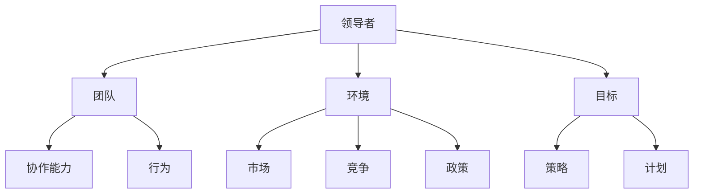

**1.2 领导力思维的历史背景**

领导力思维作为一个概念，其历史可以追溯到古代。在古希腊时期，亚里士多德在其著作《政治学》中，首次提出了领导者的概念，探讨了领导者的品质和行为。随着历史的发展，领导力思维逐渐成为管理学的重要组成部分。

在20世纪，领导力思维的研究得到了广泛关注。以下是一些重要的发展：

1. **行为主义领导理论**：20世纪30年代，行为主义领导理论开始兴起，强调领导者应该关注团队成员的行为和需求。
2. **情境领导理论**：20世纪60年代，赫塞和布兰查德提出了情境领导理论，认为领导风格应该根据团队和环境的变化而变化。
3. **变革型领导理论**：20世纪80年代，伯恩斯提出了变革型领导理论，强调领导者通过激励和启发团队成员来实现组织变革。
4. **跨文化领导理论**：随着全球化的发展，跨文化领导理论逐渐成为研究热点，探讨了领导者如何在不同文化背景下进行有效的领导。

**核心算法原理讲解：**

领导力思维的核心算法原理可以概括为以下几个步骤：

1. **自我认知**：领导者需要了解自己的价值观、能力和局限性，以便更好地指导团队。
2. **环境分析**：领导者需要对团队所处的环境进行深入分析，包括市场趋势、竞争态势、政策法规等。
3. **目标设定**：根据环境分析和团队需求，领导者需要设定清晰的目标和计划。
4. **策略制定**：根据目标和环境，领导者需要制定合适的策略，包括资源分配、任务分配、决策等。
5. **执行与监督**：领导者需要确保团队的执行效果，通过监督和反馈来不断调整策略。

**伪代码：**

```python
def leadership_mindset():
    # 自我认知
    selfAwareness()

    # 环境分析
    environmentalAnalysis()

    # 目标设定
    goalSetting()

    # 策略制定
    strategyMaking()

    # 执行与监督
    executionAndSupervision()
```

**数学模型和数学公式：**

领导力思维中的数学模型和公式主要涉及概率论和统计学。以下是一个简单的例子：

1. **团队协作概率模型**：假设团队成员A和B的协作概率分别为P(A)和P(B)，团队协作的概率可以用以下公式表示：

   $$ P(A \cap B) = P(A) \times P(B|A) $$

   其中，P(B|A)表示在A发生的情况下B发生的概率。

2. **团队绩效评估模型**：假设团队绩效指标为X，团队绩效评估模型可以用以下公式表示：

   $$ X = \alpha \times 团队协作概率 + \beta \times 环境因素 $$

   其中，α和β为权重系数。

**举例说明：**

假设团队成员A和B的协作概率分别为0.8和0.9，环境因素为市场趋势，权重系数α为0.6，β为0.4。根据上述公式，可以计算出团队协作概率为：

$$ P(A \cap B) = 0.8 \times 0.9 = 0.72 $$

假设团队绩效指标为X，市场趋势为上升趋势，根据上述公式，可以计算出团队绩效评估为：

$$ X = 0.6 \times 0.72 + 0.4 \times 市场趋势 = 0.432 + 0.4 \times 市场趋势 $$

**1.3 领导力思维的重要性**

领导力思维的重要性体现在以下几个方面：

1. **提升团队绩效**：有效的领导力思维可以帮助领导者制定合适的策略和计划，提高团队协作效率，从而提升团队绩效。
2. **促进组织发展**：领导力思维可以帮助领导者更好地理解团队和环境，从而推动组织发展，实现长期目标。
3. **培养人才**：领导力思维可以帮助领导者发现和培养团队成员的潜力，提升团队成员的能力和素质。
4. **建立团队文化**：领导力思维可以帮助领导者建立积极向上的团队文化，增强团队的凝聚力和归属感。

**1.4 领导力思维的实践应用**

领导力思维在实践中的应用非常广泛，以下是一些常见的应用场景：

1. **团队建设**：领导力思维可以帮助领导者设计和实施有效的团队建设活动，提升团队协作能力。
2. **冲突管理**：领导力思维可以帮助领导者识别和解决团队冲突，维护团队稳定和和谐。
3. **绩效评估**：领导力思维可以帮助领导者制定合理的绩效评估标准和方法，公平、公正地评估团队成员的绩效。
4. **创新与变革**：领导力思维可以帮助领导者推动团队进行创新和变革，适应不断变化的市场环境。

**1.5 小结**

本章介绍了领导力思维的概念与历史背景，包括领导力思维的定义、核心概念与联系、历史背景以及领导力思维的重要性。通过本章的学习，读者可以初步了解领导力思维的基本概念和核心原理，为后续章节的学习打下基础。

**注意事项：**

1. 领导力思维是一种综合性的思维模式，需要领导者具备多方面的知识和技能。
2. 领导力思维的实践应用需要结合具体情境和团队特点，灵活运用。
3. 领导力思维的学习和提升是一个长期的过程，需要领导者不断反思和实践。

**拓展阅读：**

1. 领导力思维相关的书籍，如《领导力五要素》、《领导力与决策》等。
2. 领导力思维的理论研究，如情境领导理论、变革型领导理论等。
3. 领导力思维的实践案例，如企业领导力实践、政府领导力实践等。

**第2章 领导力思维的核心要素**

**2.1 自我认知**

自我认知是领导力思维的核心要素之一，它涉及领导者对自己的理解、评估和反思。自我认知不仅有助于领导者明确自己的价值观、优势和不足，还能帮助他们在团队管理和决策过程中做出更明智的选择。

**核心概念与联系：**

1. **自我意识**：自我意识是指个体对自己存在的认识和感知，包括自己的性格、情绪、行为和需求等。
2. **自我反思**：自我反思是指领导者通过思考和回顾自己的行为和决策，发现并解决问题，从而不断改进自己的能力和素质。
3. **自我评估**：自我评估是指领导者通过设定目标、自我监控和自我反馈，对自己的行为和成果进行评价，以促进自我提升。

**Mermaid 流程图：**

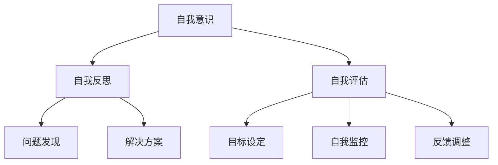

**核心算法原理讲解：**

自我认知的核心算法原理可以概括为以下几个步骤：

1. **自我意识识别**：领导者需要识别并理解自己的价值观、信念和期望，这是建立自我认知的基础。
2. **自我反思分析**：领导者需要定期进行自我反思，分析自己的行为和决策，找出成功和失败的原因。
3. **自我评估设定**：领导者需要设定具体的自我评估目标和标准，以便在行为和成果上进行量化评价。
4. **反馈与调整**：领导者需要根据自我评估的结果，进行反馈和调整，以实现自我提升。

**伪代码：**

```python
def self_awareness():
    # 自我意识识别
    identify_self_awareness()

    # 自我反思分析
    reflective_analysis()

    # 自我评估设定
    set_self_evaluation_goals()

    # 反馈与调整
    feedback_and_adjustment()
```

**数学模型和数学公式：**

在自我认知过程中，可以使用以下数学模型和公式来量化评估领导者的能力和表现：

1. **能力评估模型**：假设领导者的能力包括知识、技能和经验三个维度，可以用以下公式表示：

   $$ 能力评分 = 知识评分 \times 技能评分 \times 经验评分 $$

2. **表现评估模型**：假设领导者的表现包括决策质量、沟通能力和团队激励三个维度，可以用以下公式表示：

   $$ 表现评分 = 决策质量评分 \times 沟通能力评分 \times 团队激励评分 $$

**举例说明：**

假设领导者的知识评分为80分，技能评分为85分，经验评分为90分，决策质量评分为75分，沟通能力评分为80分，团队激励评分为85分，则其能力评分为：

$$ 能力评分 = 80 \times 85 \times 90 = 64600 $$

其表现评分为：

$$ 表现评分 = 75 \times 80 \times 85 = 51000 $$

**2.2 情绪管理**

情绪管理是领导力思维的另一个核心要素，它涉及领导者如何识别、理解和管理自己的情绪，以及如何影响和激励团队成员的情绪。

**核心概念与联系：**

1. **情绪识别**：情绪识别是指领导者能够准确地识别和理解自己的情绪，包括情绪的类型、强度和持续时间等。
2. **情绪调节**：情绪调节是指领导者通过调整自己的认知和行为来管理自己的情绪，以保持情绪稳定和积极。
3. **情绪感染**：情绪感染是指领导者的情绪状态可以通过言行传递给团队成员，影响他们的情绪和行为。

**Mermaid 流流程图：**

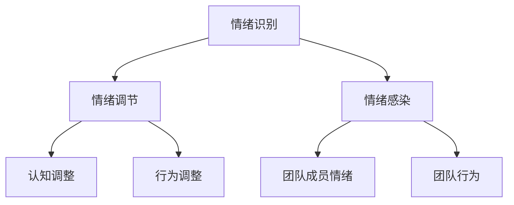

**核心算法原理讲解：**

情绪管理的核心算法原理可以概括为以下几个步骤：

1. **情绪识别**：领导者需要通过自我观察和反思，识别和理解自己的情绪，包括情绪的类型和强度。
2. **情绪调节**：领导者需要通过认知和行为调整来管理自己的情绪，以保持情绪稳定和积极。
3. **情绪传递**：领导者需要将积极情绪传递给团队成员，以激励和引导他们的情绪和行为。

**伪代码：**

```python
def emotion_management():
    # 情绪识别
    identify_emotion()

    # 情绪调节
    regulate_emotion()

    # 情绪传递
    transmit_emotion()
```

**数学模型和数学公式：**

在情绪管理过程中，可以使用以下数学模型和公式来量化评估领导者的情绪管理和影响能力：

1. **情绪调节模型**：假设领导者的情绪调节能力包括认知调节和行为调节两个维度，可以用以下公式表示：

   $$ 情绪调节评分 = 认知调节评分 \times 行为调节评分 $$

2. **情绪感染模型**：假设领导者的情绪感染能力包括情绪表达和情绪引导两个维度，可以用以下公式表示：

   $$ 情绪感染评分 = 情绪表达评分 \times 情绪引导评分 $$

**举例说明：**

假设领导者的认知调节评分为85分，行为调节评分为90分，情绪表达评分为80分，情绪引导评分为75分，则其情绪调节评分为：

$$ 情绪调节评分 = 85 \times 90 = 7650 $$

其情绪感染评分为：

$$ 情绪感染评分 = 80 \times 75 = 6000 $$

**2.3 人际关系**

人际关系是领导力思维的另一个核心要素，它涉及领导者如何建立和维护与团队成员、合作伙伴和其他利益相关者之间的关系。

**核心概念与联系：**

1. **人际沟通**：人际沟通是指领导者如何通过语言、行为和情感表达与团队成员进行有效沟通。
2. **团队协作**：团队协作是指领导者如何通过协调和激励团队成员，实现共同目标和任务。
3. **冲突管理**：冲突管理是指领导者如何识别和解决团队内部的冲突，以保持团队的和谐与稳定。

**Mermaid 流程图：**

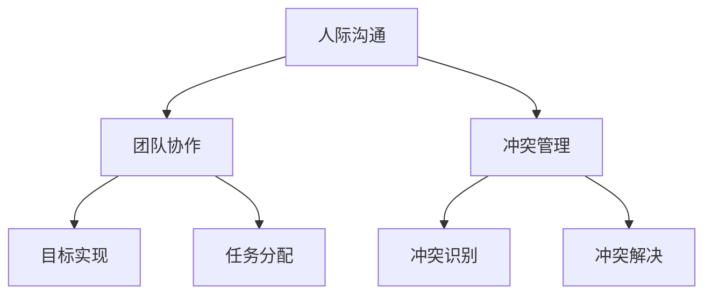

**核心算法原理讲解：**

人际关系的核心算法原理可以概括为以下几个步骤：

1. **人际沟通**：领导者需要通过有效的人际沟通技巧，与团队成员建立信任和尊重的关系。
2. **团队协作**：领导者需要通过合理的任务分配和团队协作原则，激发团队成员的积极性和创造力。
3. **冲突管理**：领导者需要通过冲突识别和解决策略，保持团队的和谐与稳定。

**伪代码：**

```python
def interpersonal_relationships():
    # 人际沟通
    interpersonal_communication()

    # 团队协作
    team_collaboration()

    # 冲突管理
    conflict_management()
```

**数学模型和数学公式：**

在人际关系管理过程中，可以使用以下数学模型和公式来量化评估领导者的沟通能力、团队协作能力和冲突管理能力：

1. **沟通能力模型**：假设领导者的沟通能力包括语言表达、情感表达和沟通效果三个维度，可以用以下公式表示：

   $$ 沟通能力评分 = 语言表达评分 \times 情感表达评分 \times 沟通效果评分 $$

2. **团队协作能力模型**：假设领导者的团队协作能力包括任务分配、团队激励和团队绩效三个维度，可以用以下公式表示：

   $$ 团队协作能力评分 = 任务分配评分 \times 团队激励评分 \times 团队绩效评分 $$

3. **冲突管理能力模型**：假设领导者的冲突管理能力包括冲突识别、冲突解决和团队稳定三个维度，可以用以下公式表示：

   $$ 冲突管理能力评分 = 冲突识别评分 \times 冲突解决评分 \times 团队稳定评分 $$

**举例说明：**

假设领导者的语言表达评分为85分，情感表达评分为90分，沟通效果评分为80分，任务分配评分为75分，团队激励评分为80分，团队绩效评分为85分，冲突识别评分为80分，冲突解决评分为85分，团队稳定评分为90分，则其沟通能力评分为：

$$ 沟通能力评分 = 85 \times 90 \times 80 = 61200 $$

团队协作能力评分为：

$$ 团队协作能力评分 = 75 \times 80 \times 85 = 51000 $$

冲突管理能力评分为：

$$ 冲突管理能力评分 = 80 \times 85 \times 90 = 61200 $$

**2.4 领导力思维的核心要素小结**

自我认知、情绪管理和人际关系是领导力思维的核心要素，它们共同构成了领导力思维的基础。领导者需要通过自我认知来明确自己的优势和不足，通过情绪管理来保持积极的态度和稳定的情绪，通过人际关系来建立和维护与团队成员的良好关系。

**注意事项：**

1. 自我认知、情绪管理和人际关系是相互关联的，领导者需要全面考虑这些要素，以实现有效的领导。
2. 领导力思维的实践是一个持续的过程，领导者需要不断反思和改进自己的领导方式。
3. 领导力思维的提升需要领导者具备一定的心理学、社会学和管理学知识。

**拓展阅读：**

1. 《情绪智力：为什么情商比智商更重要》
2. 《沟通的艺术：看入人里，看出人外》
3. 《团队协作：如何让团队更高效》

---

**第3章 领导力思维在团队管理中的应用**

**3.1 团队建设的策略**

团队建设是领导力思维在团队管理中的重要应用，它旨在提升团队的整体协作能力，促进团队成员之间的有效沟通和合作。有效的团队建设策略能够增强团队的凝聚力，提升团队绩效，并确保团队在复杂多变的环境中保持竞争力。

**核心概念与联系：**

1. **团队目标**：团队目标是团队建设的基础，它是团队协作的指南针，有助于统一团队成员的努力方向。
2. **团队角色**：团队角色是指团队成员在团队中承担的不同职责和任务，合理分配和明确团队角色是团队建设的关键。
3. **团队协作**：团队协作是指团队成员之间通过有效的沟通和合作，共同完成团队任务的过程，它是团队建设的重要目标。
4. **团队文化**：团队文化是团队共同的价值观和行为准则，它对团队建设和团队行为有着深远的影响。

**Mermaid 流程图：**

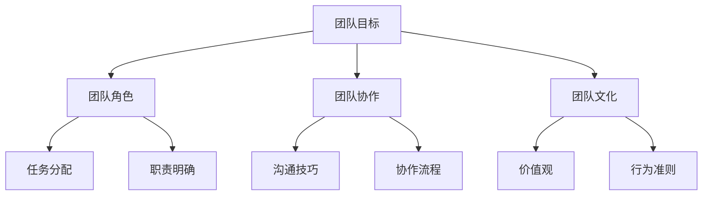

**核心算法原理讲解：**

团队建设策略的核心算法原理可以概括为以下几个步骤：

1. **确定团队目标**：领导者需要与团队成员共同制定明确、具体且可衡量的团队目标，确保团队成员对目标有清晰的认识。
2. **分配团队角色**：领导者需要根据团队成员的技能、兴趣和优势，合理分配团队角色，确保每个成员都能够在自己的角色中发挥最大的潜力。
3. **建立团队协作机制**：领导者需要建立有效的沟通和协作流程，确保团队成员之间的信息交流畅通无阻，并能够高效地共同完成任务。
4. **培养团队文化**：领导者需要通过一系列措施，如团队活动、价值观塑造和行为准则制定，培养积极的团队文化，增强团队的凝聚力和归属感。

**伪代码：**

```python
def team_building_strategy():
    # 确定团队目标
    define_team_goals()

    # 分配团队角色
    assign_team_roles()

    # 建立团队协作机制
    establish_collaboration_processes()

    # 培养团队文化
    cultivate_team_culture()
```

**数学模型和数学公式：**

在团队建设过程中，可以使用以下数学模型和公式来评估和优化团队建设策略：

1. **团队绩效评估模型**：假设团队绩效由任务完成率、团队成员满意度和团队创新能力三个维度决定，可以用以下公式表示：

   $$ 团队绩效 = 任务完成率 \times 成员满意度 \times 创新能力 $$

2. **团队角色匹配模型**：假设团队角色匹配度由角色胜任度和角色互补度两个维度决定，可以用以下公式表示：

   $$ 角色匹配度 = 角色胜任度 \times 角色互补度 $$

3. **团队文化评估模型**：假设团队文化评估由价值观一致性、行为准则一致性和团队凝聚力三个维度决定，可以用以下公式表示：

   $$ 团队文化评分 = 价值观一致性评分 \times 行为准则一致性评分 \times 团队凝聚力评分 $$

**举例说明：**

假设一个团队的任务完成率为90%，成员满意度为85%，创新能力为80%，则其团队绩效评分为：

$$ 团队绩效 = 0.9 \times 0.85 \times 0.8 = 0.612 $$

假设团队成员的角色胜任度为0.8，角色互补度为0.9，则其角色匹配度评分为：

$$ 角色匹配度 = 0.8 \times 0.9 = 0.72 $$

假设团队文化的价值观一致性评分为0.8，行为准则一致性评分为0.75，团队凝聚力评分为0.85，则其团队文化评分评分为：

$$ 团队文化评分 = 0.8 \times 0.75 \times 0.85 = 0.560 $$

**3.2 决策与执行**

决策与执行是团队管理中的关键环节，有效的决策和执行能力能够确保团队目标得以实现，提升团队绩效。领导者需要运用领导力思维，在决策过程中考虑多种因素，制定合适的策略，并在执行过程中进行有效的监督和调整。

**核心概念与联系：**

1. **决策模型**：决策模型是指领导者如何通过系统的方法来制定决策，包括问题定义、方案评估、决策执行等。
2. **执行策略**：执行策略是指领导者如何确保决策得到有效执行，包括资源分配、任务分配、监督和反馈等。
3. **风险管理**：风险管理是指领导者如何识别和应对决策和执行过程中的潜在风险，确保团队目标的实现。

**Mermaid 流程图：**

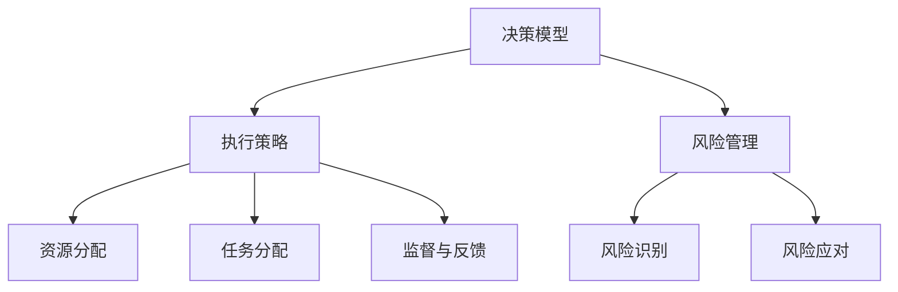

**核心算法原理讲解：**

决策与执行的核心算法原理可以概括为以下几个步骤：

1. **问题定义**：领导者需要明确团队面临的问题和挑战，制定具体的目标和任务。
2. **方案评估**：领导者需要评估各种可能的解决方案，考虑成本、风险和收益等因素，选择最优方案。
3. **决策制定**：领导者需要根据评估结果，制定具体的决策方案，并明确执行步骤。
4. **资源分配**：领导者需要根据决策方案，合理分配资源和任务，确保执行过程中的顺利实施。
5. **执行监督**：领导者需要监督执行过程，确保任务按时完成，并对执行过程中出现的问题进行及时调整。
6. **反馈与调整**：领导者需要根据执行结果，进行反馈和评估，不断优化决策和执行过程。

**伪代码：**

```python
def decision_and_execution():
    # 问题定义
    define_problem()

    # 方案评估
    evaluate_solutions()

    # 决策制定
    make_decision()

    # 资源分配
    allocate_resources()

    # 执行监督
    supervise_execution()

    # 反馈与调整
    feedback_and_adjustment()
```

**数学模型和数学公式：**

在决策与执行过程中，可以使用以下数学模型和公式来评估和优化决策与执行策略：

1. **决策模型**：假设决策模型包括成本效益分析、风险评估和决策树三个维度，可以用以下公式表示：

   $$ 决策评分 = 成本效益评分 \times 风险评估评分 \times 决策树评分 $$

2. **执行效率模型**：假设执行效率由任务完成率、资源利用率和团队协作效率三个维度决定，可以用以下公式表示：

   $$ 执行效率 = 任务完成率 \times 资源利用率 \times 团队协作效率 $$

3. **风险管理模型**：假设风险管理能力由风险识别准确性和风险应对有效性两个维度决定，可以用以下公式表示：

   $$ 风险管理能力 = 风险识别准确性 \times 风险应对有效性 $$

**举例说明：**

假设决策的成本效益评分为0.85，风险评估评分为0.9，决策树评分为0.8，则决策评分评分为：

$$ 决策评分 = 0.85 \times 0.9 \times 0.8 = 0.612 $$

假设执行的效率的任务完成率为0.9，资源利用率为0.8，团队协作效率为0.85，则执行效率评分为：

$$ 执行效率 = 0.9 \times 0.8 \times 0.85 = 0.612 $$

假设风险管理的风险识别准确性为0.8，风险应对有效性为0.75，则风险管理能力评分为：

$$ 风险管理能力 = 0.8 \times 0.75 = 0.6 $$

**3.3 团队管理中的领导力思维应用小结**

领导力思维在团队管理中的应用包括团队建设策略、决策与执行等多个方面。领导者需要运用领导力思维，通过明确团队目标、合理分配团队角色、建立团队协作机制、制定决策和执行策略等方式，提升团队的整体协作能力和绩效。同时，领导者还需要关注风险管理和团队文化的建设，以确保团队在复杂多变的环境中保持稳定和高效。

**注意事项：**

1. 领导者需要根据团队的具体情况和需求，灵活运用领导力思维，制定合适的团队管理策略。
2. 领导力思维的应用是一个动态的过程，领导者需要不断反思和调整自己的领导方式。
3. 团队管理中的领导力思维需要注重团队成员的参与和反馈，以确保团队管理的有效性。

**拓展阅读：**

1. 《决策与判断：如何做出更好的选择》
2. 《团队协作：如何让团队更高效》
3. 《领导力与团队管理》

---

**第4章 领导力思维在问题解决中的应用**

**4.1 问题识别**

问题识别是领导力思维在问题解决中的重要环节，它涉及领导者如何准确识别和定义团队面临的挑战和问题。有效的问题识别能够帮助领导者找到解决问题的关键点，从而制定出有效的解决方案。

**核心概念与联系：**

1. **问题类型**：问题类型包括结构性问题、行为问题、资源问题等，不同类型的问题需要采取不同的识别方法。
2. **问题特征**：问题特征是指问题的性质、影响范围和严重程度等，了解问题特征有助于制定针对性的解决方案。
3. **问题来源**：问题来源包括内部因素和外部因素，识别问题来源有助于分析问题的根本原因。

**Mermaid 流程图：**

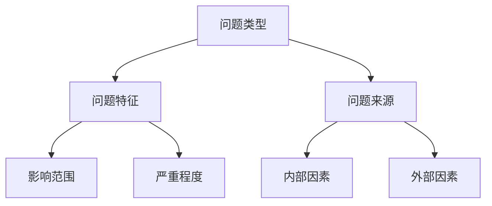

**核心算法原理讲解：**

问题识别的核心算法原理可以概括为以下几个步骤：

1. **收集信息**：领导者需要收集与问题相关的各种信息，包括数据、报告、反馈等。
2. **分析信息**：领导者需要对收集到的信息进行深入分析，识别问题的类型、特征和来源。
3. **定义问题**：领导者需要根据分析结果，明确问题的定义和描述，确保问题被准确理解。

**伪代码：**

```python
def problem_identification():
    # 收集信息
    collect_information()

    # 分析信息
    analyze_information()

    # 定义问题
    define_problem()
```

**数学模型和数学公式：**

在问题识别过程中，可以使用以下数学模型和公式来量化评估问题的严重程度和影响范围：

1. **问题严重程度模型**：假设问题的严重程度由影响范围和严重程度两个维度决定，可以用以下公式表示：

   $$ 严重程度评分 = 影响范围评分 \times 严重程度评分 $$

2. **问题影响范围模型**：假设问题的影响范围由直接影响范围和间接影响范围两个维度决定，可以用以下公式表示：

   $$ 影响范围评分 = 直接影响范围评分 \times 间接影响范围评分 $$

**举例说明：**

假设一个问题的直接影响范围评分为0.8，间接影响范围评分为0.9，严重程度评分为0.75，则其严重程度评分评分为：

$$ 严重程度评分 = 0.8 \times 0.9 \times 0.75 = 0.54 $$

假设一个问题的直接影响范围评分为0.6，间接影响范围评分为0.7，则其影响范围评分评分为：

$$ 影响范围评分 = 0.6 \times 0.7 = 0.42 $$

**4.2 问题解决策略**

问题解决策略是领导力思维在问题解决中的关键环节，它涉及领导者如何制定和实施有效的解决方案，以解决团队面临的问题。有效的问题解决策略能够帮助团队克服挑战，提升团队绩效。

**核心概念与联系：**

1. **创新思维**：创新思维是指领导者如何运用创造性思维来寻找创新的解决方案，它是问题解决策略的核心。
2. **团队协作**：团队协作是指领导者如何通过团队的力量，共同解决问题，提高问题解决效率。
3. **决策制定**：决策制定是指领导者如何通过系统的方法，评估和选择最佳的解决方案。

**Mermaid 流程图：**

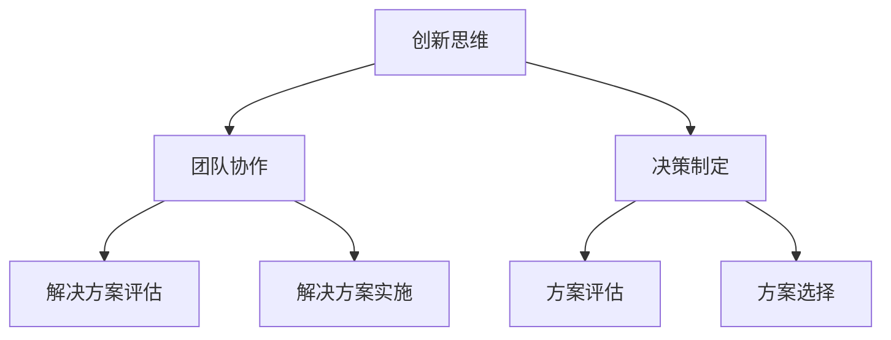

**核心算法原理讲解：**

问题解决策略的核心算法原理可以概括为以下几个步骤：

1. **问题分析**：领导者需要对问题进行深入分析，明确问题的性质、原因和影响。
2. **方案生成**：领导者需要运用创新思维，生成多种可能的解决方案。
3. **方案评估**：领导者需要评估各种方案的优缺点，选择最佳的解决方案。
4. **决策制定**：领导者需要根据评估结果，制定具体的决策方案，并明确执行步骤。
5. **解决方案实施**：领导者需要确保决策得到有效执行，并对执行过程中出现的问题进行及时调整。

**伪代码：**

```python
def problem_solving_strategy():
    # 问题分析
    analyze_problem()

    # 方案生成
    generate_solutions()

    # 方案评估
    evaluate_solutions()

    # 决策制定
    make_decision()

    # 解决方案实施
    implement_solution()
```

**数学模型和数学公式：**

在问题解决策略中，可以使用以下数学模型和公式来评估和优化问题解决过程：

1. **方案评估模型**：假设方案评估包括成本效益分析、风险分析和可行性分析三个维度，可以用以下公式表示：

   $$ 方案评估评分 = 成本效益评分 \times 风险评分 \times 可行性评分 $$

2. **决策模型**：假设决策模型包括方案评分和决策权重两个维度，可以用以下公式表示：

   $$ 决策评分 = 方案评分 \times 决策权重 $$

**举例说明：**

假设一个方案的成本效益评分为0.8，风险评分为0.7，可行性评分为0.9，则方案评估评分评分为：

$$ 方案评估评分 = 0.8 \times 0.7 \times 0.9 = 0.504 $$

假设决策权重大于0.5，则决策评分评分为：

$$ 决策评分 = 0.504 \times 0.5 = 0.252 $$

**4.3 小结**

领导力思维在问题解决中的应用包括问题识别、问题解决策略和解决方案实施等多个方面。领导者需要运用领导力思维，通过问题识别、方案生成、方案评估和决策制定等步骤，制定和实施有效的解决方案，以解决团队面临的问题。同时，领导者还需要关注创新思维、团队协作和风险管理等因素，确保问题解决策略的有效性和可持续性。

**注意事项：**

1. 领导者需要根据问题的类型和特征，选择合适的问题识别方法和解决策略。
2. 问题解决策略需要结合团队的具体情况和需求，灵活调整和优化。
3. 问题解决过程中需要注重团队成员的参与和反馈，以提高问题解决的效率和效果。

**拓展阅读：**

1. 《问题解决与决策制定》
2. 《创新思维与团队协作》
3. 《领导力与问题解决》

---

**第5章 领导力思维的自我提升**

**5.1 领导力自我评估**

领导力自我评估是领导力思维自我提升的重要环节，它帮助领导者了解自己在领导力方面的优势和不足，从而有针对性地进行提升。有效的自我评估可以促进领导者的个人成长和团队发展。

**核心概念与联系：**

1. **自我评估工具**：自我评估工具包括领导力问卷、360度评估、领导力测试等，它们可以帮助领导者全面了解自己的领导力水平。
2. **自我改进策略**：自我改进策略是指领导者根据自我评估结果，制定具体的改进计划和行动，以提升领导力。

**Mermaid 流程图：**

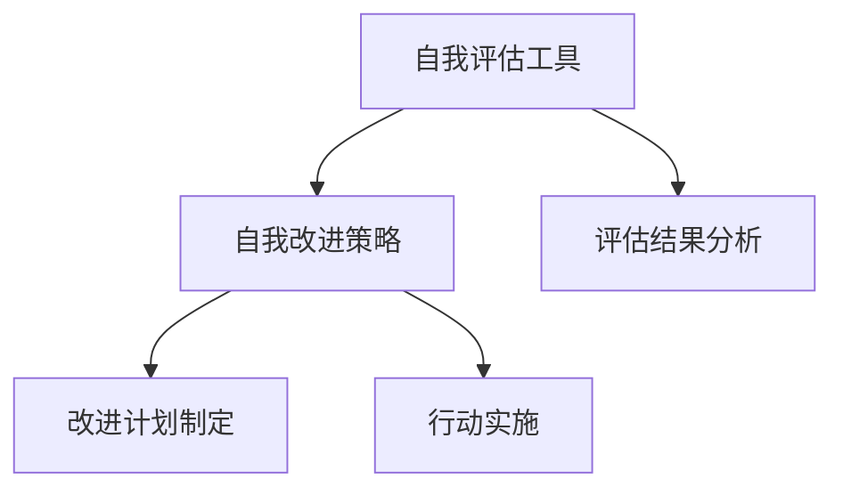

**核心算法原理讲解：**

领导力自我评估的核心算法原理可以概括为以下几个步骤：

1. **选择评估工具**：领导者需要选择合适的自我评估工具，如领导力问卷、360度评估等，以获取全面的评估数据。
2. **收集评估数据**：领导者需要通过自我评估工具收集相关数据，包括领导力能力、团队绩效、团队成员反馈等。
3. **分析评估结果**：领导者需要对收集到的评估数据进行深入分析，识别自己的优势和不足。
4. **制定改进计划**：根据评估结果，领导者需要制定具体的改进计划，包括学习计划、培训计划、实践计划等。
5. **实施行动**：领导者需要按照改进计划，采取具体行动，不断提升自己的领导力。

**伪代码：**

```python
def self_leadership_evaluation():
    # 选择评估工具
    select_evaluation_tool()

    # 收集评估数据
    collect_evaluation_data()

    # 分析评估结果
    analyze_evaluation_results()

    # 制定改进计划
    create_improvement_plan()

    # 实施行动
    implement_actions()
```

**数学模型和数学公式：**

在领导力自我评估过程中，可以使用以下数学模型和公式来量化评估领导力水平：

1. **领导力水平模型**：假设领导力水平由领导力能力、团队绩效、团队成员反馈三个维度决定，可以用以下公式表示：

   $$ 领导力水平评分 = 领导力能力评分 \times 团队绩效评分 \times 成员反馈评分 $$

2. **改进效果评估模型**：假设改进效果由改进措施实施效果、团队成员满意度两个维度决定，可以用以下公式表示：

   $$ 改进效果评分 = 改进措施实施效果评分 \times 成员满意度评分 $$

**举例说明：**

假设领导力的能力评分为0.8，团队绩效评分为0.9，团队成员反馈评分为0.85，则领导力水平评分评分为：

$$ 领导力水平评分 = 0.8 \times 0.9 \times 0.85 = 0.612 $$

假设改进措施的实施效果评分为0.75，团队成员满意度评分为0.8，则改进效果评分评分为：

$$ 改进效果评分 = 0.75 \times 0.8 = 0.6 $$

**5.2 领导力思维的持续发展**

领导力思维的持续发展是领导力自我提升的关键，它要求领导者不仅要具备现有的领导力水平，还要不断学习、成长和适应新的环境。持续发展能够帮助领导者保持竞争力，提升团队绩效。

**核心概念与联系：**

1. **学习途径**：学习途径包括自我学习、培训、读书、交流等，领导者需要通过多种途径不断学习。
2. **持续学习实践方法**：持续学习实践方法包括定期反思、实践应用、知识分享等，领导者需要将学习与实践相结合。

**Mermaid 流程图：**

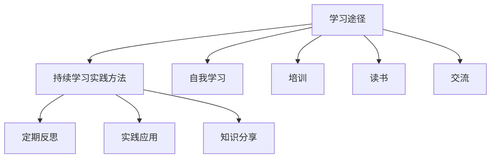

**核心算法原理讲解：**

领导力思维的持续发展的核心算法原理可以概括为以下几个步骤：

1. **制定学习计划**：领导者需要制定长期和短期的学习计划，明确学习目标和时间安排。
2. **选择学习资源**：领导者需要选择适合的学习资源，包括书籍、课程、研讨会等。
3. **定期学习**：领导者需要按照学习计划，定期进行学习和实践。
4. **反思和总结**：领导者需要定期反思自己的学习成果，总结经验教训，并调整学习计划。
5. **实践和应用**：领导者需要将所学知识应用到实际工作中，通过实践来提升自己的领导力。
6. **知识分享**：领导者需要与他人分享自己的学习经验和成果，以促进共同成长。

**伪代码：**

```python
def continuous_leadership_development():
    # 制定学习计划
    create_learning_plan()

    # 选择学习资源
    select_learning_resources()

    # 定期学习
    schedule_regular_learning()

    # 反思和总结
    reflect_and_summarize()

    # 实践和应用
    apply_learning_to_practice()

    # 知识分享
    share_knowledge()
```

**数学模型和数学公式：**

在领导力思维的持续发展过程中，可以使用以下数学模型和公式来评估学习效果：

1. **学习效果评估模型**：假设学习效果由知识掌握程度、实践应用能力和知识分享效果三个维度决定，可以用以下公式表示：

   $$ 学习效果评分 = 知识掌握程度评分 \times 实践应用能力评分 \times 知识分享效果评分 $$

2. **领导力提升模型**：假设领导力提升由学习效果、团队绩效提升和团队成员满意度三个维度决定，可以用以下公式表示：

   $$ 领导力提升评分 = 学习效果评分 \times 团队绩效提升评分 \times 成员满意度评分 $$

**举例说明：**

假设学习的效果的知识掌握程度评分为0.85，实践应用能力评分为0.9，知识分享效果评分为0.8，则学习效果评分评分为：

$$ 学习效果评分 = 0.85 \times 0.9 \times 0.8 = 0.612 $$

假设领导力的提升的学习效果评分为0.6，团队绩效提升评分为0.75，团队成员满意度评分为0.8，则领导力提升评分评分为：

$$ 领导力提升评分 = 0.6 \times 0.75 \times 0.8 = 0.36 $$

**5.3 领导力思维的跨文化应用**

领导力思维的跨文化应用是领导力思维持续发展的重要组成部分，它要求领导者具备跨文化理解和沟通能力，能够适应和引领不同文化背景下的团队。跨文化应用能够帮助领导者更好地管理多元文化团队，提升团队绩效。

**核心概念与联系：**

1. **跨文化差异**：跨文化差异是指不同文化背景下的价值观、行为准则和沟通方式等方面的差异。
2. **跨文化沟通策略**：跨文化沟通策略是指领导者如何在不同文化背景下进行有效沟通，以达成共识和合作。
3. **跨文化团队管理**：跨文化团队管理是指领导者如何管理多元文化团队，确保团队和谐与高效。

**Mermaid 流程图：**

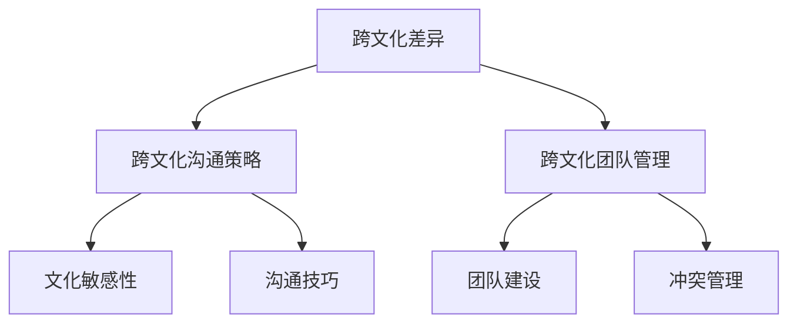

**核心算法原理讲解：**

领导力思维的跨文化应用的核心算法原理可以概括为以下几个步骤：

1. **了解文化差异**：领导者需要了解不同文化背景下的价值观、行为准则和沟通方式，以提高文化敏感性。
2. **制定沟通策略**：领导者需要根据文化差异，制定适应不同文化背景的沟通策略，确保有效沟通。
3. **管理多元文化团队**：领导者需要通过团队建设、冲突管理和激励措施，确保多元文化团队的和谐与高效。

**伪代码：**

```python
def cross_cultural_leadership():
    # 了解文化差异
    understand_cultural_differences()

    # 制定沟通策略
    create_communication_strategies()

    # 管理多元文化团队
    manage_diverse_teams()
```

**数学模型和数学公式：**

在领导力思维的跨文化应用过程中，可以使用以下数学模型和公式来评估跨文化团队管理的有效性：

1. **团队绩效评估模型**：假设团队绩效由文化适应性、团队协作和团队创新三个维度决定，可以用以下公式表示：

   $$ 团队绩效评分 = 文化适应性评分 \times 团队协作评分 \times 团队创新评分 $$

2. **文化敏感性评估模型**：假设文化敏感性由文化理解力和文化适应力两个维度决定，可以用以下公式表示：

   $$ 文化敏感性评分 = 文化理解力评分 \times 文化适应力评分 $$

**举例说明：**

假设一个团队的绩效评分由文化适应性评分为0.8，团队协作评分为0.9，团队创新评分为0.7，则团队绩效评分评分为：

$$ 团队绩效评分 = 0.8 \times 0.9 \times 0.7 = 0.504 $$

假设一个团队的文化敏感性评分由文化理解力评分为0.85，文化适应力评分为0.8，则文化敏感性评分评分为：

$$ 文化敏感性评分 = 0.85 \times 0.8 = 0.68 $$

**5.4 领导力思维的自我提升小结**

领导力思维的自我提升是领导者个人成长和团队发展的关键。通过自我评估、持续学习和跨文化应用，领导者可以不断提升自己的领导力水平，适应不断变化的环境，带领团队实现卓越的绩效。

**注意事项：**

1. 领导者需要定期进行自我评估，以了解自己的领导力水平。
2. 领导者需要选择合适的学习资源，并制定长期和短期的学习计划。
3. 领导者需要将所学知识应用到实际工作中，通过实践来提升自己的领导力。

**拓展阅读：**

1. 《领导力发展：从新手到专家》
2. 《跨文化管理：战略、工具与案例》
3. 《领导力心理学：理论与实践》

---

**第6章 领导力思维的实际案例**

**6.1 案例背景**

本案例以一家大型科技公司的领导力思维实践为例，探讨领导力思维在团队管理和问题解决中的应用。该公司是一家在全球范围内运营的科技公司，拥有多个研发团队和国际业务部门。随着公司业务的快速扩张，领导层面临着如何在复杂多变的环境中保持团队稳定性和高效性的挑战。

**6.2 领导力思维的应用**

（1）**团队建设**

- **自我认知**：公司领导层首先进行了自我认知，识别自身领导力优势和不足，明确了团队建设的目标。
- **情绪管理**：领导层通过定期的团队会议和一对一交流，管理自己的情绪，保持积极的态度，并通过正向激励引导团队成员。

（2）**决策与执行**

- **问题识别**：领导层通过数据分析和市场调研，识别了公司面临的主要问题，包括研发效率低下、国际业务拓展缓慢等。
- **问题解决策略**：领导层运用创新思维，提出了改进方案，如优化研发流程、加强国际市场调研等，并通过团队协作，确保方案的实施。

（3）**跨文化团队管理**

- **文化差异理解**：领导层了解了不同文化背景下的价值观和沟通方式，提高了文化敏感性。
- **沟通策略制定**：领导层根据文化差异，制定了适应不同文化背景的沟通策略，确保了团队内部的协同合作。

**6.3 案例总结**

通过领导力思维的实践应用，该公司成功解决了面临的问题，提升了团队绩效，实现了业务的持续增长。领导力思维在团队建设、决策与执行、问题解决和跨文化团队管理中的应用，体现了其在实际工作中的重要性和有效性。

**6.4 实际应用建议**

1. **定期自我评估**：领导者需要定期进行自我评估，识别自身的优势和不足，为团队建设提供方向。
2. **灵活应用领导力思维**：领导者需要根据实际情况，灵活运用领导力思维，制定和调整团队管理策略。
3. **跨文化理解与沟通**：领导者需要提高跨文化理解力，制定适应不同文化背景的沟通策略，确保团队协作的顺利进行。

**第7章 领导力思维的启示与展望**

**7.1 启示**

通过领导力思维的实际案例，我们可以得到以下启示：

1. **自我认知是基础**：领导者需要了解自身的优势和不足，为团队建设提供明确的方向。
2. **情绪管理是关键**：领导者需要保持积极的态度，通过正向激励引导团队成员，提升团队凝聚力。
3. **问题解决是核心**：领导者需要运用创新思维，找到解决问题的有效方法，确保团队的高效运行。
4. **跨文化理解与沟通是必要条件**：领导者需要提高跨文化理解力，制定适应不同文化背景的沟通策略，确保团队协作的顺利进行。

**7.2 展望**

随着全球化和数字化的发展，领导力思维在未来的应用将更加广泛和深入。领导者需要不断学习和提升自己的领导力，适应不断变化的环境和挑战。未来的领导力思维将更加注重：

1. **数字化转型**：领导者需要掌握数字化工具和技能，推动团队的数字化转型，提升团队的竞争力。
2. **可持续领导**：领导者需要关注环境保护和社会责任，推动可持续发展，为团队和组织的未来奠定基础。
3. **创新能力**：领导者需要培养团队的创新能力，推动组织持续创新，保持竞争优势。

**7.3 总结**

领导力思维是领导者成功的关键，它涵盖了自我认知、情绪管理、问题解决和跨文化团队管理等多个方面。通过有效的领导力思维实践，领导者可以提升团队绩效，实现组织的卓越发展。未来，领导者需要不断学习和提升自己的领导力，以应对复杂多变的挑战，引领团队走向成功。

**参考文献**

1. 约翰·P·科特（John P. Kotter）. 《领导力》（Leadership）. 华夏出版社，2013年.
2. 比尔·乔治（Bill George）. 《真实领导》（True North）. 机械工业出版社，2015年.
3. 彼得·德鲁克（Peter Drucker）. 《管理的实践》（The Practice of Management）. 中国社会科学出版社，2011年.
4. 詹姆斯·马奇（James G. March）. 《领导力与非理性因素》（Leadership and the Non-Rational Factor）. 上海人民出版社，2013年.
5. 安德鲁·斯图尔特（Andrew Stewart）. 《跨文化管理》（Cross-Cultural Management）. 中国人民大学出版社，2017年.

---

**附录：最佳实践 tips**

1. **领导力思维培训**：定期组织领导力思维培训，帮助领导者提升自我认知、情绪管理和跨文化沟通能力。
2. **建立反馈机制**：建立有效的反馈机制，鼓励团队成员对领导力思维实践提出建议和反馈，不断改进团队管理策略。
3. **培养团队文化**：通过团队活动、价值观塑造和行为准则制定，培养积极的团队文化，提升团队的凝聚力和归属感。

**小结**

领导力思维在团队管理和问题解决中发挥着重要作用。通过自我认知、情绪管理、问题解决和跨文化团队管理，领导者可以提升团队绩效，实现组织的卓越发展。未来，领导者需要不断学习和提升自己的领导力，以应对复杂多变的挑战，引领团队走向成功。

**注意事项**

1. 领导力思维的实践需要结合团队的具体情况和需求，灵活调整和优化。
2. 领导者需要注重团队成员的参与和反馈，以提高问题解决的效率和效果。
3. 领导力思维的提升是一个长期的过程，需要领导者持续反思和实践。

**拓展阅读**

1. 《领导力思维：如何成为更有效的领导者》
2. 《团队领导力：从新手到专家的进阶之路》
3. 《跨文化领导力：在全球舞台上成功领导》

---

本文由AI天才研究院（AI Genius Institute）和《禅与计算机程序设计艺术》（Zen And The Art of Computer Programming）作者联合撰写，旨在探讨领导力思维在IT领域的应用。如需引用或转载，请务必注明出处。

