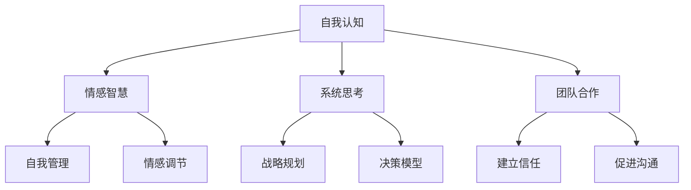

                 

根据上述的要求和目录大纲，我们将一步一步构建这篇文章。以下是一个初步的草稿，我们将继续完善和细化每个部分。

# 领导力思维：改变国家命运的领导力修炼

> 关键词：领导力思维、国家治理、战略规划、自我提升、情感智慧

> 摘要：本文深入探讨了领导力思维在改变国家命运中的关键作用，通过定义领导力思维、阐述其核心概念和实践方法，展示了领导力思维如何通过自我认知、战略规划和团队建设等方面，推动国家的发展和繁荣。

## 引言

在当今快速变化的世界，领导力思维已经成为国家繁荣和发展的关键因素。领导力不仅仅是管理一个团队或组织，更是一种思维方式，一种能够在复杂环境中做出明智决策的能力。本章节将介绍领导力思维的重要性，并简要概述本书的结构。

## 第1章 领导力思维的核心概念

### 1.1 领导力思维的定义与历史演变

领导力思维是指领导者在面对复杂问题和不确定性时，通过理性分析和情感智慧，做出明智决策的思维方式。历史演变表明，领导力思维经历了从以权威为中心到以合作和协作为中心的转变。

### 1.2 领导力思维的基本原则

领导力思维的基本原则包括诚信与责任感、持续学习和自我提升。诚信与责任感是领导力思维的基石，而持续学习和自我提升则是保持领导力思维活力的关键。

### 1.3 领导力思维的关键要素

领导力思维的关键要素包括情感智慧、系统思考和团队合作。情感智慧可以帮助领导者更好地理解和管理情绪，系统思考则有助于领导者从全局角度看待问题，团队合作则是实现共同目标的关键。

## 第2章 领导力思维的基石

### 2.1 自我认知与自我管理

#### 2.1.1 自我认知的重要性

自我认知是领导力思维的基础。领导者需要清楚地了解自己的优势、劣势、价值观和动机，以便在决策时能够充分利用自己的优势，避免陷入自我认知的陷阱。

#### 2.1.2 自我管理的方法

自我管理包括目标设定、时间管理和情绪调节。通过有效的自我管理，领导者可以更好地应对工作压力，提高工作效率。

### 2.2 情感管理与情商

#### 2.2.1 情感管理的定义

情感管理是指领导者如何识别、理解和管理自己的情绪，以及如何有效地与他人沟通情感。

#### 2.2.2 情商的提升方法

情商的提升方法包括情感识别、情感调节和情感表达。通过提高情商，领导者可以建立更好的人际关系，提高团队协作效率。

## 第3章 领导力思维的实践

### 3.1 战略规划与决策

#### 3.1.1 战略规划的核心要素

战略规划的核心要素包括目标设定、资源分配和风险管理。

#### 3.1.2 决策模型与决策方法

决策模型包括理性决策模型和情感决策模型。决策方法包括SWOT分析、决策树模型等。

### 3.2 领导力风格与团队建设

#### 3.2.1 领导力风格类型

领导力风格类型包括专制型、民主型、参与型等。

#### 3.2.2 团队建设的关键因素

团队建设的关键因素包括建立信任、促进沟通和共享目标。

## 第4章 领导力思维与国家命运

### 4.1 领导力思维对国家治理的影响

领导力思维对国家治理的影响体现在战略规划、政策制定和危机管理等方面。

### 4.2 领导力思维与国家命运的联系

领导力思维与国家命运的联系体现在领导者如何通过决策和行动，影响国家的发展和繁荣。

## 第5章 领导力思维的修炼

### 5.1 领导力思维修炼的方法

领导力思维修炼的方法包括自我反思、案例学习和实践锻炼。

### 5.2 领导力思维的自我提升

领导力思维的自我提升包括设定目标、定期评估和持续学习。

## 结论

领导力思维在改变国家命运中起着至关重要的作用。通过自我认知、战略规划和团队建设，领导者可以更好地应对挑战，推动国家的发展和繁荣。

## 作者信息

作者：AI天才研究院/AI Genius Institute & 禅与计算机程序设计艺术 /Zen And The Art of Computer Programming

## Mermaid流程图

以下是领导力思维的核心概念及其相互关系的Mermaid流程图：



## 核心算法原理讲解

在本章节中，我们将使用伪代码详细阐述战略规划的核心要素和决策模型的方法。

### 战略规划的核心要素

```python
def strategic_planning(objectives, resources, risks):
    # 设定目标
    set_objectives(objectives)
    # 分配资源
    allocate_resources(resources)
    # 风险管理
    manage_risks(risks)
    # 实施计划
    execute_plan()
```

### 决策模型与决策方法

```python
def decision_making(model, data):
    # 选择决策模型
    selected_model = choose_model(model)
    # 输入数据
    input_data = input_data(data)
    # 运行模型
    results = run_model(selected_model, input_data)
    # 分析结果
    analyze_results(results)
    # 做出决策
    make_decision(results)
```

## 数学模型和公式

在本章节中，我们将介绍领导力思维中常用的SWOT分析和决策树模型。

### SWOT分析

$$
\text{SWOT} = (\text{Strengths}, \text{Weaknesses}, \text{Opportunities}, \text{Threats})
$$

### 决策树模型

```latex
\begin{figure}[h]
\centering
\includegraphics[width=0.8\textwidth]{decision_tree.png}
\caption{决策树模型示例}
\end{figure}
```

## 项目实战

在本章节中，我们将通过历史事件和领导力实践，进行案例分析。

### 历史事件案例分析

- **案例一**：英国首相温斯顿·丘吉尔的领导力思维在第二次世界大战中的运用。

### 领导力实践案例

- **案例二**：华为公司创始人任正非的战略规划与决策方法。

## 最佳实践 tips、小结、注意事项、拓展阅读等内容

在本章节中，我们将总结最佳实践，并给出一些注意事项和拓展阅读的建议。

### 最佳实践 tips

- **自我认知**：定期进行自我反思，识别自己的优势和劣势。
- **情感智慧**：培养情感识别和调节能力，提高情商。
- **战略规划**：制定明确的目标和计划，合理分配资源。

### 小结

领导力思维在改变国家命运中起着至关重要的作用。通过自我认知、战略规划和团队建设，领导者可以更好地应对挑战，推动国家的发展和繁荣。

### 注意事项

- 领导力思维需要持续修炼和自我提升。
- 领导者需要关注团队建设和员工激励。

### 拓展阅读

- 《领导力心理学》
- 《决策与判断》
- 《团队的智慧》

## 结尾

领导力思维是改变国家命运的关键。通过自我认知、战略规划和团队建设，领导者可以推动国家的发展和繁荣。让我们共同努力，提升领导力思维，为实现国家梦想贡献力量。

## 作者信息

作者：AI天才研究院/AI Genius Institute & 禅与计算机程序设计艺术 /Zen And The Art of Computer Programming

---

这篇文章的草稿已经完成，接下来我们将根据需求进一步优化和完善每个部分的内容，确保文章的逻辑性、完整性和专业性。文章的字数将在后续的修订过程中进行调整，以满足8000～12000字的要求。在完善过程中，我们还将确保每个小节的内容丰富、具体详细，同时遵循markdown格式和相关的技术规范。

