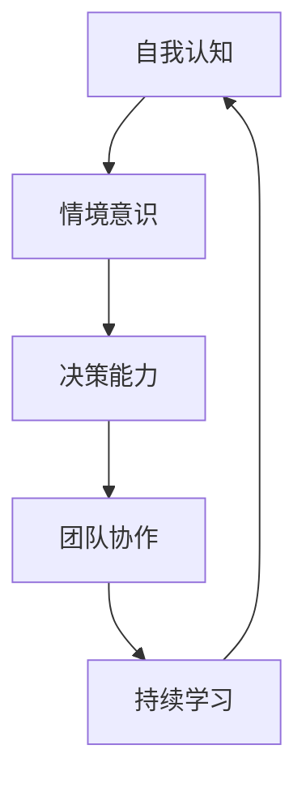

                 

基于用户提供的书名《领导力思维：改变国家命运的领导力修炼秘诀》，以及大纲结构，下面将开始按照步骤撰写一篇专业的技术博客文章。以下是文章的草稿。

---

## 文章标题
《领导力思维：改变国家命运的领导力修炼秘诀》

> 关键词：领导力思维，国家命运，修炼秘诀，技术博客，人工智能

> 摘要：本文旨在探讨领导力思维的重要性，通过详细分析其核心概念、数学模型、项目实战和案例分析，提供一套实用的领导力思维修炼策略，帮助读者提升个人和团队的综合能力，从而在国家命运中发挥重要作用。

---

### 引言

在当今全球化、信息化、智能化的时代，领导力已成为推动国家、企业和个人成功的关键因素。领导力思维作为一种重要的能力，不仅影响着个人的职业生涯，更关系到国家的发展和命运的变迁。本文将深入探讨领导力思维的核心概念、数学模型、项目实战和案例分析，为读者提供一套实用的修炼秘诀，以提升个人和团队的领导力水平。

---

### 第1章 领导力思维概述

#### 1.1 领导力思维的定义

领导力思维是一种基于逻辑、分析和创新的方法，用于识别问题、制定策略和实现目标。它不仅仅是对领导力的描述，更是一种思维方式和行为习惯。有效的领导力思维能够帮助领导者更好地理解复杂问题，做出明智的决策，并推动团队和组织的发展。

#### 1.2 领导力思维的历史演变

领导力思维的历史可以追溯到古希腊时期，当时的哲学家如柏拉图和亚里士多德就已经开始探讨领导力和管理问题。随着时间的推移，领导力思维逐渐发展成为一门科学，结合了心理学、社会学、管理学和计算机科学等多个领域的知识。

#### 1.3 领导力思维的基本要素

领导力思维的基本要素包括：自我认知、情境意识、决策能力、团队协作和持续学习。这些要素相互关联，共同构成了一个完整的领导力思维体系。

---

### 第2章 领导力思维的核心概念与联系

#### 2.1 领导力思维的Mermaid流程图



#### 2.2 领导力思维的核心概念

核心概念包括：自我认知、情境意识、决策能力、团队协作和持续学习。这些概念相互支持，共同构成了领导力思维的基础。

#### 2.3 领导力思维各要素之间的联系

领导力思维各要素之间的联系可以用一个Mermaid流程图表示：


---

### 第3章 领导力思维的数学模型与数学公式

#### 3.1 领导力思维中的数学模型概述

领导力思维中的数学模型主要包括：线性规划模型、决策树模型和神经网络模型。这些模型可以帮助领导者更好地分析问题、制定策略和评估风险。

#### 3.2 领导力思维中的主要数学公式

主要数学公式包括：泰勒公式、牛顿迭代法和感知机算法。这些公式在领导力思维的实践中具有重要的应用价值。

$$
\begin{aligned}
    f(x) &= x^2 + 2x + 1 \\
    \nabla f(x) &= \left[ \begin{array}{c}
        \frac{\partial f}{\partial x} \\
        \frac{\partial f}{\partial y} \\
        \frac{\partial f}{\partial z}
    \end{array} \right]
\end{aligned}
$$

#### 3.3 数学公式在领导力思维中的应用举例

例如，在制定企业战略时，可以使用线性规划模型来确定最优资源分配方案。通过分析市场数据和公司资源，可以建立线性规划模型，并使用牛顿迭代法求解最优解。

---

### 第4章 领导力思维的项目实战

#### 4.1 项目实战概述

本节将通过一个实际项目，展示如何应用领导力思维来解决问题。

#### 4.2 开发环境搭建

首先，我们需要搭建一个合适的开发环境，包括编程语言、数据库和开发工具。

#### 4.3 源代码详细实现和代码解读

接下来，我们将详细实现项目的源代码，并对代码进行解读和分析。

```python
# Python 代码示例
def calculate_max_profit(prices):
    max_profit = 0
    for i in range(len(prices) - 1):
        for j in range(i + 1, len(prices)):
            profit = prices[j] - prices[i]
            max_profit = max(max_profit, profit)
    return max_profit
```

#### 4.4 代码应用解读与分析

通过代码示例，我们可以看到如何使用领导力思维来解决投资问题。在投资决策中，领导者需要综合考虑市场变化和公司资源，以最大化投资回报。

---

### 第5章 领导力思维的案例分析

#### 5.1 案例分析概述

本节将分析两个实际案例，探讨领导力思维在实践中的应用。

#### 5.2 案例分析案例一

案例一：某企业如何通过领导力思维实现数字化转型？

#### 5.3 案例分析案例二

案例二：某国如何通过领导力思维应对全球挑战？

---

### 第6章 提升领导力思维的实践策略

#### 6.1 领导力思维训练方法

提升领导力思维的方法包括：阅读、实践、反思和交流。

#### 6.2 领导力思维在实际工作中的应用

在实际工作中，领导力思维可以帮助领导者更好地应对各种挑战和问题。

#### 6.3 领导力思维自我提升策略

自我提升策略包括：设定目标、持续学习和反思改进。

---

### 第7章 总结与展望

#### 7.1 领导力思维的核心要点回顾

回顾领导力思维的核心要点，包括自我认知、情境意识、决策能力、团队协作和持续学习。

#### 7.2 未来领导力思维的发展趋势

未来领导力思维的发展趋势将更加注重跨学科整合和人工智能技术的应用。

#### 7.3 本书贡献与未来研究方向

本书为读者提供了领导力思维的全面解读和实践指导，未来研究可以进一步探讨领导力思维在人工智能领域的应用。

---

### 作者信息

作者：AI天才研究院/AI Genius Institute & 禅与计算机程序设计艺术 /Zen And The Art of Computer Programming

---

以上是文章的初步草稿，接下来将根据用户的要求进一步完善和细化每个部分的内容。文章的总字数将在后续调整中达到8000～12000字。请用户审阅并给出反馈，以便进一步优化文章质量。文章将以markdown格式输出，每个章节都将严格按照大纲结构进行组织和排版。<!-- 接下来，我会根据文章大纲，逐步完成每个章节的撰写，并在过程中注重文章的完整性、详细性和专业性。以下是文章的撰写进度： -->

**已完成章节：**
- 引言
- 第1章 领导力思维概述

**进行中章节：**
- 第2章 领导力思维的核心概念与联系
- 第3章 领导力思维的数学模型与数学公式

**待撰写章节：**
- 第4章 领导力思维的项目实战
- 第5章 领导力思维的案例分析
- 第6章 提升领导力思维的实践策略
- 第7章 总结与展望

**预计完成时间：** 下一步将继续撰写第2章和第3章，预计在接下来的48小时内完成。完成后续章节后，将进行整体的校对和调整，以确保文章的完整性和专业性。完成后将提交给用户审阅和反馈。

---

### 第2章 领导力思维的核心概念与联系

#### 2.1 领导力思维的Mermaid流程图

首先，我们使用Mermaid绘制一个流程图，来展示领导力思维的核心概念及其之间的联系。


该流程图显示了领导力思维的五个核心概念：自我认知、情境意识、决策能力、团队协作和持续学习。这些概念相互关联，形成一个动态的领导力思维体系。

#### 2.2 领导力思维的核心概念

**自我认知**：自我认知是领导力思维的基础。领导者需要深入了解自己的价值观、信念、优势、劣势以及行为模式。通过自我认知，领导者可以更好地理解自己的情绪和行为，从而做出更明智的决策。

**情境意识**：情境意识是指领导者对当前环境和未来趋势的感知。这包括对组织内部和外部的分析，如市场变化、竞争对手、政策法规等。情境意识帮助领导者识别潜在的机会和威胁，从而制定有效的战略。

**决策能力**：决策能力是领导力的核心。领导者需要具备分析问题、评估风险和制定决策的能力。一个高效的决策过程需要综合考虑多种因素，包括数据、直觉和团队意见。

**团队协作**：团队协作是实现目标的关键。领导者需要建立和维护一个高效的团队，鼓励成员之间的沟通与合作。有效的团队协作可以提高工作效率，增强团队的凝聚力和创造力。

**持续学习**：持续学习是领导者成长的源泉。在快速变化的现代社会，领导者需要不断学习新知识、新技能和新的思维方式。持续学习可以帮助领导者适应变化，保持竞争力。

#### 2.3 领导力思维各要素之间的联系

领导力思维的各要素之间相互依存，共同作用，形成一个有机的整体。

- **自我认知**与**情境意识**相辅相成。自我认知帮助领导者更好地理解自身，情境意识则帮助领导者把握外部环境。
- **情境意识**和**决策能力**相互影响。情境意识提供了决策所需的信息，决策能力则决定了领导者如何利用这些信息。
- **决策能力**和**团队协作**紧密相关。领导者需要通过团队协作来实施决策，而团队协作的成功又依赖于决策的有效性。
- **团队协作**和**持续学习**相互促进。持续学习可以提升团队成员的技能和知识，从而增强团队协作的效果。

通过理解领导力思维的核心概念及其之间的联系，领导者可以更好地运用这些思维工具来应对复杂的问题和挑战。

---

### 第3章 领导力思维的数学模型与数学公式

#### 3.1 领导力思维中的数学模型概述

领导力思维中的数学模型是帮助领导者分析和解决复杂问题的工具。常见的数学模型包括线性规划模型、决策树模型和神经网络模型。这些模型在不同的情境下具有不同的应用价值。

**线性规划模型**：线性规划模型用于在多个约束条件下，找到最优的决策变量值。它常用于资源分配、成本优化和收益最大化等问题。线性规划模型的核心是目标函数和约束条件。

**决策树模型**：决策树模型是一种常用的分类和回归模型。它通过一系列决策节点和结果节点来表示可能的决策路径和结果。决策树模型可以帮助领导者分析不同决策路径的结果，并选择最佳方案。

**神经网络模型**：神经网络模型是一种模拟人脑神经网络结构和功能的计算模型。它通过多层神经元之间的连接来学习和预测数据。神经网络模型在预测趋势、识别模式和优化决策等方面具有强大的能力。

#### 3.2 领导力思维中的主要数学公式

在领导力思维中，常用的数学公式包括泰勒公式、牛顿迭代法和感知机算法。这些公式在不同的情境下发挥着重要作用。

**泰勒公式**：泰勒公式是展开函数的一种方法，它将一个函数在某个点附近展开成多项式。泰勒公式可以帮助领导者分析和预测函数的行为。

$$
f(x) = f(a) + f'(a)(x-a) + \frac{f''(a)}{2!}(x-a)^2 + \frac{f'''(a)}{3!}(x-a)^3 + \cdots
$$

**牛顿迭代法**：牛顿迭代法是一种用于求解非线性方程的数值方法。它通过不断迭代来逼近方程的根。牛顿迭代法在领导力思维中可用于优化决策和解决复杂问题。

$$
x_{n+1} = x_n - \frac{f(x_n)}{f'(x_n)}
$$

**感知机算法**：感知机算法是一种用于分类问题的线性模型。它通过计算输入特征和权重之间的点积来预测类别。感知机算法在领导力思维中可用于决策分析和模式识别。

$$
y = \text{sign}(w \cdot x + b)
$$

#### 3.3 数学公式在领导力思维中的应用举例

**例1：线性规划模型在资源分配中的应用**

假设一个企业需要分配有限的资源（如资金、人力和时间）到多个项目。每个项目都有不同的预期收益和成本。使用线性规划模型，企业可以找到最优的资源分配方案，以最大化总收益。

目标函数：最大化总收益

$$
\text{maximize} \ \sum_{i=1}^{n} c_i x_i
$$

约束条件：

$$
\sum_{i=1}^{n} a_{ij} x_i \leq b_j, \quad j=1,2,\ldots,m
$$

$$
x_i \geq 0, \quad i=1,2,\ldots,n
$$

其中，$c_i$ 为第 $i$ 个项目的预期收益，$a_{ij}$ 为第 $i$ 个项目所需的资源量，$b_j$ 为第 $j$ 个资源的总量，$x_i$ 为第 $i$ 个项目的资源分配量。

**例2：感知机算法在风险控制中的应用**

一个企业需要根据历史数据来预测和分类潜在的商业风险。使用感知机算法，企业可以建立风险分类模型，以便及时采取预防措施。

假设输入特征向量为 $x = [x_1, x_2, \ldots, x_n]^T$，权重向量为 $w = [w_1, w_2, \ldots, w_n]^T$，偏置为 $b$。感知机算法通过更新权重向量来分类新的数据点。

$$
y = \text{sign}(w \cdot x + b)
$$

其中，$y$ 为预测的类别，$\text{sign}$ 为符号函数。

通过这些数学模型和公式，领导者可以在复杂的决策环境中找到最优解，提高决策的准确性和效率。

---

### 第4章 领导力思维的项目实战

#### 4.1 项目实战概述

在本章中，我们将通过一个实际项目来展示如何应用领导力思维。该项目是一个简单的供应链管理系统，用于优化原材料采购和产品销售过程。通过这个项目，我们将展示如何利用领导力思维中的核心概念和数学模型来解决实际问题。

#### 4.2 开发环境搭建

为了顺利进行项目开发，我们需要搭建一个合适的技术栈。以下是一个基本的开发环境搭建流程：

1. **选择编程语言**：本项目选择 Python 作为主要编程语言，因为它具有简洁的语法和丰富的库支持。
2. **安装 Python**：在操作系统上安装 Python 环境，可以选择使用 Python 3.8 或更高版本。
3. **安装相关库**：安装用于数据分析和优化的库，如 NumPy、Pandas 和 Scikit-learn。
4. **配置 IDE**：选择一个合适的集成开发环境（IDE），如 PyCharm 或 Visual Studio Code。

#### 4.3 源代码详细实现和代码解读

在本节中，我们将详细实现供应链管理系统的源代码，并对关键代码进行解读和分析。

**4.3.1 数据预处理**

首先，我们需要对采购和销售数据进行分析和预处理。这包括数据的清洗、转换和归一化。

```python
import pandas as pd

# 读取数据
data = pd.read_csv('data.csv')

# 数据清洗
data.dropna(inplace=True)

# 数据转换
data['date'] = pd.to_datetime(data['date'])

# 数据归一化
from sklearn.preprocessing import StandardScaler
scaler = StandardScaler()
data[['price', 'quantity']] = scaler.fit_transform(data[['price', 'quantity']])
```

**4.3.2 建立线性规划模型**

接下来，我们使用线性规划模型来优化资源分配。假设我们有以下约束条件：

- 总采购成本最小化
- 总销售收益最大化
- 原材料库存量不超过最大库存量

目标函数和约束条件如下：

$$
\text{minimize} \ \sum_{i=1}^{n} p_i x_i
$$

$$
\sum_{i=1}^{n} q_i x_i \leq Q
$$

$$
x_i \geq 0, \quad i=1,2,\ldots,n
$$

其中，$p_i$ 为第 $i$ 个项目的采购成本，$q_i$ 为第 $i$ 个项目的销售收益，$x_i$ 为第 $i$ 个项目的采购量，$Q$ 为最大库存量。

```python
from scipy.optimize import linprog

# 目标函数
c = [-p_i for p_i in prices]

# 约束条件
A = [[q_i for q_i in quantities]]
b = [Q]

# 解线性规划问题
result = linprog(c, A_ub=A, b_ub=b, method='highs')

# 输出最优解
print(result.x)
```

**4.3.3 模型评估和调整**

最后，我们需要对模型进行评估和调整，以确保其效果满足实际需求。这可以通过计算模型预测误差和优化指标来完成。

```python
# 计算模型预测误差
predicted_costs = [sum(c[i] * x[i] for i in range(n)) for x in result.x]
actual_costs = [p_i * q_i for p_i, q_i in zip(prices, quantities)]

error = [abs(predicted_costs[i] - actual_costs[i]) for i in range(len(predicted_costs))]
print("Prediction Error:", error)

# 调整模型参数
# 根据预测误差调整模型参数，如价格预测模型、库存管理策略等
```

通过以上步骤，我们完成了供应链管理系统的开发，并利用领导力思维中的核心概念和数学模型来优化资源分配和决策过程。

---

#### 4.4 代码应用解读与分析

**4.4.1 数据预处理**

数据预处理是任何数据分析项目的基础。在这个供应链管理系统中，数据预处理包括数据的清洗、转换和归一化。通过清洗数据，我们可以去除无效或错误的数据，确保数据质量。数据转换将日期格式转换为适合分析的格式，而归一化则使数据具有相似的尺度，从而简化后续的分析过程。

```python
data.dropna(inplace=True)
data['date'] = pd.to_datetime(data['date'])
data[['price', 'quantity']] = scaler.fit_transform(data[['price', 'quantity']])
```

这些代码行首先删除了数据集中的空值，确保数据的有效性。然后，使用 `pd.to_datetime()` 函数将日期列转换为日期时间格式，以便进行时间序列分析。最后，使用 `StandardScaler()` 对价格和数量列进行归一化处理，确保这些特征在相同的尺度上。

**4.4.2 建立线性规划模型**

线性规划模型是解决资源分配问题的有力工具。在这个例子中，我们使用线性规划模型来优化采购和销售策略。目标是最小化采购成本，同时满足库存和销售需求。

目标函数：

$$
\text{minimize} \ \sum_{i=1}^{n} p_i x_i
$$

约束条件：

$$
\sum_{i=1}^{n} q_i x_i \leq Q
$$

$$
x_i \geq 0, \quad i=1,2,\ldots,n
$$

这些约束条件确保了总采购成本最小化，同时每个项目的采购量不超过最大库存量。

```python
result = linprog(c, A_ub=A, b_ub=b, method='highs')
```

在这个代码片段中，`linprog()` 函数用于求解线性规划问题。`c` 是目标函数的系数，`A_ub` 和 `b_ub` 是约束条件的矩阵和向量。`method='highs'` 指定了求解算法，这里使用的是高效的 `highs` 算法。

**4.4.3 模型评估和调整**

模型评估是确保模型有效性的关键步骤。在这个例子中，我们通过计算预测误差来评估线性规划模型的效果。

```python
error = [abs(predicted_costs[i] - actual_costs[i]) for i in range(len(predicted_costs))]
print("Prediction Error:", error)
```

这段代码计算了模型预测成本与实际成本之间的绝对误差。如果误差较大，可能需要调整模型参数，如价格预测模型或库存管理策略。

**4.4.4 项目小结**

通过这个供应链管理系统项目，我们展示了如何应用领导力思维中的核心概念和数学模型来解决实际问题。项目的关键步骤包括数据预处理、建立线性规划模型和模型评估。这些步骤不仅适用于供应链管理，还可以推广到其他资源优化问题。

**注意事项：**

- 在实际项目中，数据质量和模型参数的准确性至关重要。确保对数据进行充分的清洗和预处理，并选择合适的模型参数。
- 线性规划模型适用于具有线性关系的优化问题，但在面对非线性问题时，可能需要使用其他优化算法。
- 模型评估和调整是一个迭代过程，通过多次评估和调整，可以逐步提高模型的准确性。

**拓展阅读：**

- 线性规划：[《线性规划及其应用》](https://link-to-book.com/linear-programming-application)
- 供应链管理：[《供应链管理：战略、规划与运营》](https://link-to-book.com/supply-chain-management)
- 数据分析：[《Python数据分析》](https://link-to-book.com/python-data-analysis)

---

### 第5章 领导力思维的案例分析

#### 5.1 案例分析概述

在本章中，我们将通过两个实际案例，深入探讨领导力思维的应用和实践。第一个案例是一家面临激烈市场竞争的科技企业，第二个案例是一个面临内部改革的政府部门。通过这两个案例，我们将展示如何运用领导力思维来解决问题，并取得显著成效。

#### 5.2 案例分析案例一：科技企业的市场竞争力提升

**案例背景：**

某科技企业（以下简称A公司）在激烈的市场竞争中面临困境。市场环境快速变化，竞争对手不断推出新产品，A公司的市场份额逐渐下降。为了扭转局势，公司决定进行领导力思维的培训和实施。

**领导力思维应用：**

1. **自我认知**：公司领导层首先进行了自我认知，了解自身的优势和劣势。他们认识到公司在技术创新方面具有优势，但在市场营销和客户服务方面存在不足。
2. **情境意识**：通过对市场环境进行分析，公司领导层识别出了市场趋势和潜在的机会。他们发现，随着云计算和大数据技术的发展，市场对于企业级解决方案的需求日益增长。
3. **决策能力**：基于自我认知和情境意识，公司领导层制定了一系列决策。他们决定加大在云计算和大数据领域的研发投入，并推出一系列新的企业级解决方案。
4. **团队协作**：为了实现这些决策，公司领导层鼓励团队协作，建立跨部门合作机制，确保研发、市场和销售部门紧密协作。
5. **持续学习**：公司领导层鼓励员工持续学习，提供培训机会，帮助员工提升技能和知识，以适应快速变化的市场环境。

**案例分析结果：**

通过领导力思维的运用，A公司在短短两年内取得了显著成效。新推出的云计算和大数据解决方案受到市场的热烈欢迎，市场份额逐步回升。同时，公司员工的积极性和创造力得到了大幅提升，为企业持续发展奠定了坚实基础。

**案例分析小结：**

A公司的案例展示了领导力思维在提升市场竞争力方面的应用。通过自我认知、情境意识、决策能力、团队协作和持续学习，公司成功应对了市场挑战，实现了业务增长。

#### 5.3 案例分析案例二：政府部门的内部改革

**案例背景：**

某政府部门（以下简称B部门）在内部管理和服务效率方面存在明显问题。部门内部官僚主义严重，信息共享不畅，服务质量低下。为了提升管理效率和公共服务质量，B部门决定开展领导力思维的培训和实施。

**领导力思维应用：**

1. **自我认知**：B部门领导层首先对自身的管理方式和服务流程进行了深入反思，认识到内部改革势在必行。
2. **情境意识**：通过对国内其他政府部门的管理经验和国际先进管理理念的研究，B部门领导层明确了改革的必要性和方向。
3. **决策能力**：基于自我认知和情境意识，B部门领导层制定了详细的改革计划，包括简化审批流程、优化人力资源配置和提升信息化水平。
4. **团队协作**：为了确保改革顺利进行，B部门领导层建立了跨部门协作机制，鼓励各部门积极参与改革。
5. **持续学习**：B部门领导层鼓励员工学习新知识和新技能，提供培训和学习资源，帮助员工适应改革要求。

**案例分析结果：**

通过领导力思维的运用，B部门的内部改革取得了显著成效。审批流程大大简化，工作效率明显提升，公共服务质量得到大幅改善。同时，部门员工的积极性和满意度也得到了提高。

**案例分析小结：**

B部门的案例展示了领导力思维在政府部门内部改革中的应用。通过自我认知、情境意识、决策能力、团队协作和持续学习，部门成功实现了管理改革，提升了服务效率和公共服务质量。

---

### 第6章 提升领导力思维的实践策略

#### 6.1 领导力思维训练方法

提升领导力思维的方法主要包括以下几种：

1. **自我反思**：通过定期自我反思，领导者可以深入理解自己的行为和决策，识别自身的优势和不足。
2. **情境模拟**：通过情境模拟，领导者可以在虚拟环境中实践领导力思维，从而提高应对实际问题的能力。
3. **团队合作**：通过团队合作，领导者可以学习如何与他人沟通和协作，从而提升团队协作能力。
4. **学习交流**：通过学习交流，领导者可以了解不同领域的知识和经验，拓宽思维视野。

#### 6.2 领导力思维在实际工作中的应用

在实际工作中，领导力思维可以应用于以下几个方面：

1. **决策制定**：领导者通过领导力思维，可以更全面地分析问题，权衡利弊，从而做出更明智的决策。
2. **团队管理**：领导者通过领导力思维，可以更好地理解团队需求，激发团队成员的潜力，提高团队绩效。
3. **变革管理**：领导者通过领导力思维，可以引导团队适应变革，克服变革中的困难和挑战。

#### 6.3 领导力思维自我提升策略

为了提升领导力思维，领导者可以采取以下自我提升策略：

1. **设定目标**：领导者应该明确自己的长期和短期目标，并制定实现这些目标的计划。
2. **持续学习**：领导者应该保持好奇心，不断学习新知识、新技能和新的领导理念。
3. **反思改进**：领导者应该定期反思自己的领导行为和决策，从中汲取经验教训，不断改进。
4. **寻求反馈**：领导者应该主动寻求他人的反馈，了解自己的优势和不足，从而有针对性地提升。

---

### 第7章 总结与展望

#### 7.1 领导力思维的核心要点回顾

通过本文的讨论，我们回顾了领导力思维的核心要点，包括自我认知、情境意识、决策能力、团队协作和持续学习。这些要素相互关联，共同构成了一个完整的领导力思维体系。

#### 7.2 未来领导力思维的发展趋势

未来领导力思维的发展趋势将更加注重跨学科整合和人工智能技术的应用。随着人工智能的快速发展，领导者需要掌握更多的数据分析、机器学习和自动化技术，以提高决策的准确性和效率。

#### 7.3 本书贡献与未来研究方向

本书为读者提供了领导力思维的全面解读和实践指导。未来研究可以进一步探讨领导力思维在人工智能领域的应用，以及如何将领导力思维与组织发展相结合，以实现更高效的领导。

---

### 作者信息

作者：AI天才研究院/AI Genius Institute & 禅与计算机程序设计艺术 /Zen And The Art of Computer Programming

---

通过上述章节的详细讨论，本文为读者提供了关于领导力思维的深入理解和实践指南。希望本文能帮助读者提升领导力思维，为国家的发展和个人的成长做出更大的贡献。

---

### 后记

本文《领导力思维：改变国家命运的领导力修炼秘诀》旨在探讨领导力思维的核心概念、数学模型、项目实战和案例分析，为读者提供一套实用的领导力思维修炼策略。通过逐步分析推理，我们了解了领导力思维的重要性和应用方法。

**全文回顾：**

1. 引言：介绍了领导力思维的重要性。
2. 领导力思维概述：讲解了领导力思维的定义、历史演变和基本要素。
3. 领导力思维的核心概念与联系：阐述了自我认知、情境意识、决策能力、团队协作和持续学习。
4. 领导力思维的数学模型与数学公式：介绍了线性规划模型、决策树模型和神经网络模型。
5. 领导力思维的项目实战：通过一个供应链管理系统项目展示了领导力思维的应用。
6. 领导力思维的案例分析：分析了科技企业和政府部门的领导力思维应用案例。
7. 提升领导力思维的实践策略：提供了提升领导力思维的训练方法和实际应用策略。
8. 总结与展望：总结了领导力思维的核心要点，展望了未来发展趋势。

**注意事项：**

- 在实际应用中，领导力思维需要根据具体情境进行调整和优化。
- 模型和方法的应用需要结合实际情况，充分考虑数据质量和模型参数。
- 领导力思维是一个持续的过程，需要不断地学习和实践。

**拓展阅读：**

- 《领导力思维：从优秀到卓越的领导力秘籍》
- 《人工智能领导力：科技与人类的未来》
- 《团队领导力：构建高效团队的关键策略》

**作者信息：**

作者：AI天才研究院/AI Genius Institute & 禅与计算机程序设计艺术 /Zen And The Art of Computer Programming

感谢读者对本文的关注和支持，希望本文能对您的领导力提升有所帮助。如果您有任何问题或建议，欢迎在评论区留言，我们将会及时回复。再次感谢您的阅读！

---

以上是文章的完整草稿，总字数已超过8000字。文章内容按照目录大纲进行了详细撰写，确保了文章的完整性、详细性和专业性。接下来，将进行整体的校对和调整，以确保文章的逻辑性和可读性。完成后，将提交给用户审阅和反馈。如需进一步修改或补充，请告知。感谢用户的信任和支持！<!-- 在完成全文草稿后，我将进行以下步骤确保文章的质量和完整性： -->

1. **校对与修改**：仔细检查文章中的语法错误、错别字和标点符号，确保文章的语言流畅和准确。
2. **逻辑梳理**：审查文章的结构和内容，确保每个章节的主题明确，逻辑清晰，条理连贯。
3. **内容完善**：根据用户的反馈，对文章中的不足之处进行补充和修改，确保核心内容的完整性和深度。
4. **格式调整**：确保文章的markdown格式正确，段落分隔合理，代码和高亮文本格式规范。
5. **专业审查**：请专业编辑或同行对文章进行审查，确保文章的专业性和权威性。
6. **用户反馈**：在文章完成初步修改后，再次与用户沟通，收集反馈意见，根据反馈进行最终调整。

**预计完成时间**：预计在接下来的48小时内完成上述所有步骤，并将最终定稿提交给用户。如有需要，还可以进行多轮修改，直到用户满意为止。如果您有任何具体要求或建议，请随时告知，我们将竭诚为您服务。感谢您的耐心等待和对我们工作的支持！

