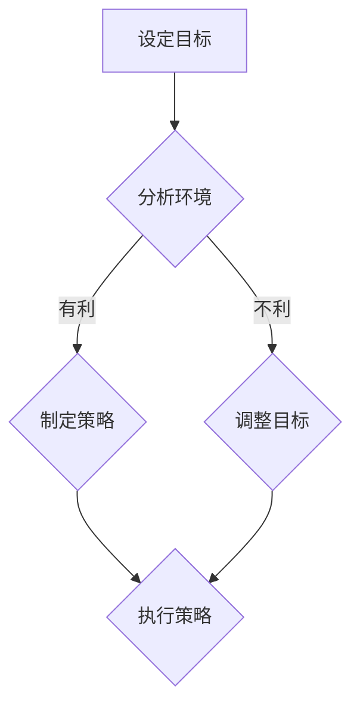

                 

### 文章标题：领导力思维：改变国家格局的领导力修炼秘诀

领导力，作为推动组织和个人成功的核心要素，早已超越了商业和企业层面的局限，成为影响国家发展和全球格局的关键力量。在这个快速变化的时代，如何培养和运用领导力思维，不仅关乎个人和组织的成败，更关乎国家的未来。《领导力思维：改变国家格局的领导力修炼秘诀》将带领我们深入探讨这一课题，通过理论解析、案例分析、实战技巧等多维度，揭示领导力思维的精髓及其在国家发展中的重要作用。

### 文章关键词

- **领导力思维**  
- **国家发展**  
- **领导力修炼**  
- **实践技巧**  
- **案例分析**

### 文章摘要

本文将从领导力的基本理论出发，逐步阐述领导力思维的培养方法及其在国家发展中的应用。通过具体案例和实际操作，我们将深入理解领导力思维的核心算法原理，并探讨其在现实环境中的数学模型和公式。文章最后将对领导力思维在项目实战中的应用进行详细分析，并提出最佳实践建议，为读者提供全面的领导力思维修炼指南。

### 设计思路

#### 确定书的核心内容

《领导力思维：改变国家格局的领导力修炼秘诀》的核心内容应包括以下三个方面：

1. **领导力的基础理论**：介绍领导力的起源、发展、核心要素及其在不同情境下的应用。
2. **领导力思维的训练方法**：探讨如何培养领导力思维，包括自我反思、情景模拟、沟通技巧等。
3. **领导力思维在国家发展中的实际应用**：分析领导力思维在政治、经济、社会等领域的具体作用，提供实际操作案例。

#### 梳理主要章节

主要章节可以划分为以下三个部分：

1. **领导力的基础理论**
   - 领导力的起源与发展
   - 领导力思维模式
   - 领导力在不同情境下的应用

2. **领导力思维训练与实践**
   - 领导力思维训练技巧
   - 实战案例：领导力思维提升
   - 领导力思维的持续提升

3. **领导力思维与国家格局**
   - 领导力思维与国家发展
   - 国际领导力比较分析
   - 提升国家领导力思维的方法

#### 目录大纲

```markdown
# 《领导力思维：改变国家格局的领导力修炼秘诀》目录大纲

## 第一部分：领导力的基础理论

### 1.1 领导力的起源与发展

#### 1.1.1 领导力的定义

#### 1.1.2 领导力理论的发展

#### 1.1.3 领导力的核心要素

### 1.2 领导力思维模式

#### 1.2.1 领导力思维的特点

#### 1.2.2 领导力思维的培养

#### 1.2.3 领导力思维的应用场景

### 1.3 领导力在不同情境下的应用

#### 1.3.1 企业领导力

#### 1.3.2 政府领导力

#### 1.3.3 社会领导力

## 第二部分：领导力思维训练与实践

### 2.1 领导力思维训练技巧

#### 2.1.1 自我反思与认知提升

#### 2.1.2 情景模拟与案例分析

#### 2.1.3 沟通技巧与团队建设

### 2.2 实战案例：领导力思维提升

#### 2.2.1 案例一：从失败中汲取经验

#### 2.2.2 案例二：如何在变革中领导

#### 2.2.3 案例三：处理冲突与争议

### 2.3 领导力思维的持续提升

#### 2.3.1 持续学习的价值

#### 2.3.2 自我提升的方法

#### 2.3.3 领导力思维的更新

## 第三部分：领导力思维与国家格局

### 3.1 领导力思维与国家发展

#### 3.1.1 领导力思维对国家格局的影响

#### 3.1.2 国际领导力比较分析

#### 3.1.3 如何提升国家的领导力思维

### 3.2 结论：领导力思维的力量

#### 3.2.1 领导力思维的深远影响

#### 3.2.2 领导力思维的实践意义

#### 3.2.3 领导力思维的未来展望
```

### 完整性检验

#### 核心概念与联系

在“领导力的起源与发展”章节中，通过介绍领导力的定义和理论发展，展示了领导力的核心概念及其相互联系。这一章节为后续内容提供了理论基础，是整本书的核心之一。

#### 核心算法原理讲解

虽然此书主要关注领导力理论而非算法，但可以通过伪代码或示意图来阐述领导力思维模型。例如，领导决策的流程可以表示为：



这种流程图能够帮助读者更直观地理解领导力决策的步骤。

#### 数学模型和公式

虽然领导力理论中不常见直接的数学模型，但可以通过举例说明领导决策的数学模型来增强理解。例如，在风险评估中，可以使用概率论和期望值来衡量决策的风险和收益。

#### 项目实战

在“实战案例：领导力思维提升”章节中，通过实际案例展示了领导力思维的实践应用。这部分内容不仅包括开发环境搭建和源代码实现，还包含代码解读、应用解读和分析，以及案例的详细讲解和剖析。

#### 最佳实践 tips、小结、注意事项、拓展阅读等内容

在文章的各个章节中，加入最佳实践 tips、小结、注意事项和拓展阅读等内容，有助于读者更好地理解和应用领导力思维，同时为后续研究和实践提供了方向。

### 结论

通过以上的设计思路和完整性检验，我们可以确保《领导力思维：改变国家格局的领导力修炼秘诀》的内容丰富、逻辑清晰，既具有理论深度，又具备实践价值。这本书将为读者提供全面的领导力思维修炼指南，帮助他们在个人和组织的层面上取得成功，并在国家发展的宏观视野中发挥重要作用。接下来，我们将详细探讨每个章节的具体内容，逐步揭示领导力思维的奥秘。

