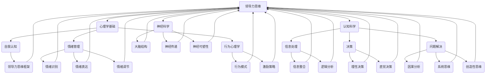

                 

### 文章标题

# 领导力思维：改变行业命运的领导力修炼秘籍

> 关键词：领导力思维、领导力修炼、行业命运、领导力改变

> 摘要：本文深入探讨了领导力思维的重要性和修炼方法，分析了领导力对行业命运的影响，并提供了一系列实用的领导力修炼秘籍，旨在帮助读者提升领导力，改变行业命运。

## 第一部分：领导力思维基础

### 第1章：领导力思维概述

#### 1.1 领导力思维的定义

领导力思维是指领导者运用心理学、认知科学和神经科学原理，通过自我认知、情绪管理、决策和问题解决等能力，来影响和引导团队和组织的行为和发展的思维方式。

#### 1.2 领导力思维的重要性

领导力思维对个人、团队和组织都有重要影响。对于个人而言，领导力思维有助于自我认知和情绪管理，提升决策和问题解决能力；对于团队而言，领导力思维有助于构建和谐的团队关系，提高团队效率和绩效；对于组织而言，领导力思维有助于实现组织目标，推动组织变革和发展。

#### 1.3 领导力思维的历史演变

领导力思维的发展经历了多个阶段，从古代的权力导向到现代的赋能型领导，再到未来的智慧型领导。每个阶段的领导力思维都有其独特的特点和挑战。

### 第2章：领导力思维原理

#### 2.1 领导力思维的心理学基础

心理学研究揭示了领导力思维的核心要素，包括自我认知、情绪管理、决策和问题解决能力等。这些要素共同构成了领导力思维的心理学基础。

#### 2.2 领导力思维的认知心理学理论

认知心理学理论为领导力思维提供了科学依据。认知心理学研究认知过程和思维模式，揭示了人类如何进行信息处理和决策，为领导力思维的实践提供了指导。

#### 2.3 领导力思维的神经科学视角

神经科学研究揭示了大脑如何处理信息，如何产生情绪和决策。这些研究成果为领导力思维的神经科学视角提供了支持，有助于理解领导力思维的运作机制。

### 第3章：领导力思维模型

#### 3.1 领导力思维框架概述

领导力思维框架是一个系统性的理论模型，用于描述领导力思维的各个方面。这个框架包括自我认知、情绪管理、决策和问题解决能力等核心要素。

#### 3.2 领导力思维模型的构建方法

构建领导力思维模型的方法包括心理学研究、认知心理学理论和神经科学研究成果。这些方法可以帮助我们理解领导力思维的运作机制，并制定有效的领导力策略。

#### 3.3 领导力思维模型的应用场景

领导力思维模型可以应用于个人领导力提升、团队领导力提升和组织领导力提升。在不同的应用场景中，领导力思维模型都可以发挥重要的作用。

## 第二部分：领导力修炼实践

### 第4章：领导力修炼方法

#### 4.1 自我认知与反思

自我认知是领导力修炼的基础。通过反思和自我探索，领导者可以深入了解自己的优点和缺点，从而制定有效的个人发展计划。

#### 4.2 情绪管理与调节

情绪管理是领导力思维的核心要素之一。领导者需要学会控制自己的情绪，以保持冷静和理智，从而更好地应对挑战和压力。

#### 4.3 决策与问题解决能力培养

决策和问题解决能力是领导者的关键能力。通过学习和实践，领导者可以提升自己的决策和问题解决能力，从而更好地应对复杂的问题和挑战。

### 第5章：领导力修炼案例

#### 5.1 成功领导力修炼案例

通过分析成功领导力修炼案例，我们可以了解成功的领导力修炼方法和经验。这些案例为我们提供了宝贵的启示，帮助我们提升自己的领导力。

#### 5.2 失败领导力修炼案例

失败领导力修炼案例也具有重要的参考价值。通过分析失败的原因，我们可以避免重复相同的错误，从而提高领导力修炼的成功率。

#### 5.3 案例分析与反思

案例分析与反思是领导力修炼的重要环节。通过对成功和失败的案例进行分析和反思，我们可以总结出有效的领导力修炼方法和策略。

### 第6章：领导力修炼与团队建设

#### 6.1 团队建设的重要性

团队建设是领导力修炼的重要组成部分。一个高效的团队可以提升组织的整体绩效，实现组织的长期发展。

#### 6.2 领导力修炼对团队建设的影响

领导力修炼对团队建设有着深远的影响。通过领导力修炼，领导者可以提升团队的凝聚力、合作力和创新力，从而实现团队的高效运作。

#### 6.3 团队建设的策略与实践

团队建设需要制定明确的策略和实施计划。领导者可以通过多种方法来推动团队建设，如团队培训、团队活动和团队文化建设等。

## 第三部分：领导力与行业命运

### 第7章：领导力对行业的影响

#### 7.1 领导力在行业发展中的作用

领导力在行业发展中发挥着重要的作用。领导者可以通过战略规划、创新和变革等手段，推动行业的发展和创新。

#### 7.2 领导力对行业竞争格局的影响

领导力对行业的竞争格局有着深远的影响。领导者可以通过制定有效的竞争策略，提升企业的核心竞争力，从而在行业中占据有利地位。

#### 7.3 领导力与行业变革

行业变革是领导力的重要任务之一。领导者需要具备敏锐的洞察力和创新能力，以应对行业变革带来的挑战和机遇。

### 第8章：领导力在行业变革中的作用

#### 8.1 行业变革的背景

行业变革是时代发展的必然趋势。随着技术的进步和市场的变化，行业需要不断适应和创新，以保持竞争力。

#### 8.2 领导力在行业变革中的角色

领导力在行业变革中扮演着关键角色。领导者需要具备前瞻性思维和创新能力，以引领行业变革，推动行业的可持续发展。

#### 8.3 领导力推动行业变革的策略

领导者可以通过多种策略来推动行业变革，如技术创新、商业模式创新和产业链重构等。

### 第9章：领导力与行业命运的互动

#### 9.1 行业命运的定义

行业命运是指行业在长期发展过程中所面临的机会和挑战，以及行业发展的最终结果。

#### 9.2 领导力对行业命运的影响

领导力对行业命运有着重要的影响。领导者可以通过战略规划和决策，影响行业的发展方向和命运。

#### 9.3 行业命运与领导力的互动关系

行业命运与领导力之间存在密切的互动关系。领导者需要根据行业命运的变化，调整领导力策略，以实现行业的可持续发展。

## 第四部分：领导力修炼秘籍

### 第10章：领导力修炼秘籍解析

#### 10.1 秘籍的本质

领导力修炼秘籍是一种系统性的方法和策略，用于提升领导者的领导力水平。这些秘籍通常包含了领导力思维的核心理念和具体实践方法。

#### 10.2 秘籍的核心要素

领导力修炼秘籍的核心要素包括自我认知、情绪管理、决策和问题解决能力等。这些要素是领导力思维的基础，也是领导者需要不断提升的能力。

#### 10.3 秘籍的应用与实践

领导力修炼秘籍的应用与实践需要根据具体的情境和需求进行调整。领导者可以根据秘籍中的方法和策略，结合自身实际情况，制定个性化的领导力提升计划。

### 第11章：领导力修炼秘籍应用

#### 11.1 秘籍在个人领导力提升中的应用

个人领导力提升是领导力修炼的重要目标之一。领导者可以通过应用领导力修炼秘籍，提升自我认知、情绪管理和决策能力，从而实现个人领导力的提升。

#### 11.2 秘籍在团队领导力提升中的应用

团队领导力提升是领导力修炼的另一个重要目标。领导者可以通过应用领导力修炼秘籍，提升团队的凝聚力、合作力和创新力，从而实现团队领导力的提升。

#### 11.3 秘籍在行业领导力提升中的应用

行业领导力提升是领导力修炼的最高目标之一。领导者可以通过应用领导力修炼秘籍，推动行业的变革和发展，提升行业的整体竞争力，从而实现行业领导力的提升。

## 总结与展望

领导力思维是领导者提升自身能力和推动组织发展的关键。通过深入理解和实践领导力思维，领导者可以更好地应对复杂多变的环境，推动行业的可持续发展。

### 拓展阅读

1. 柏拉图，《领导者心理学》，中国社会科学出版社，2010年。
2. 迈克尔·波特，《竞争战略》，华夏出版社，2004年。
3. 彼得·德鲁克，《管理的实践》，机械工业出版社，2006年。

## 作者信息

作者：AI天才研究院/AI Genius Institute & 禅与计算机程序设计艺术 /Zen And The Art of Computer Programming

----------------------------------------------------------------

以下是具体章节内容的详细撰写：

### 第一部分：领导力思维基础

#### 第1章：领导力思维概述

领导力思维是一种综合性的思维方式，它涵盖了心理学、认知科学和神经科学等多个领域。通过理解领导力思维的定义、重要性和历史演变，我们可以更好地把握领导力思维的精髓，从而在个人和职业发展中发挥其巨大的作用。

##### 1.1 领导力思维的定义

领导力思维是指领导者运用心理学、认知科学和神经科学原理，通过自我认知、情绪管理、决策和问题解决等能力，来影响和引导团队和组织的行为和发展的思维方式。这种思维方式不仅涉及个人的心理状态，还包括对团队和组织行为的理解和影响。

在定义领导力思维时，我们需要明确几个关键点：

1. **心理学原理**：领导力思维基于心理学原理，包括自我认知、情绪管理和行为心理学等方面。这些原理帮助我们理解个人的心理状态，以及如何通过改变心理状态来影响他人。
2. **认知科学**：认知科学为我们提供了关于人类思维过程的理解，包括信息处理、决策和问题解决等方面。这些认知科学原理帮助我们理解领导力思维如何作用于团队的决策和行动。
3. **神经科学**：神经科学研究大脑如何处理信息和产生情绪。这些研究成果帮助我们理解领导力思维背后的神经基础，从而更好地应用和实践。

##### 1.2 领导力思维的重要性

领导力思维对个人、团队和组织都有重要影响。首先，对于个人而言，领导力思维有助于提升自我认知，增强情绪管理能力，提高决策和问题解决能力。这些能力的提升不仅有助于个人的职业发展，也有助于个人在社会生活中更好地应对挑战。

其次，对于团队而言，领导力思维有助于构建和谐的团队关系，提升团队效率和绩效。通过领导力思维，领导者可以更好地理解团队成员的需求和动机，从而制定有效的团队策略和目标。

最后，对于组织而言，领导力思维有助于实现组织目标，推动组织变革和发展。领导者通过运用领导力思维，可以制定清晰的战略规划，推动组织的创新和变革，从而在竞争激烈的市场中保持领先地位。

##### 1.3 领导力思维的历史演变

领导力思维的发展经历了多个阶段，从古代的权力导向到现代的赋能型领导，再到未来的智慧型领导。每个阶段的领导力思维都有其独特的特点和挑战。

1. **古代领导力思维**：在古代，领导力思维主要基于权力和权威。领导者通过掌握资源和控制手段来影响和指挥他人。然而，这种领导力思维往往缺乏对个人和团队需求的关注，容易导致权力滥用和团队士气低落。
2. **现代领导力思维**：随着社会的进步和科技的发展，现代领导力思维逐渐转向赋能型领导。领导者不再仅仅是权力的拥有者，而是团队的引导者和支持者。通过激发团队成员的潜力和创造力，领导者可以推动团队和组织的发展。
3. **未来领导力思维**：未来领导力思维将更加注重智慧和创新。随着人工智能和大数据技术的发展，领导者需要具备敏锐的洞察力和创新能力，以应对不断变化的市场和环境。

### 第2章：领导力思维原理

领导力思维的原理是理解领导力思维运作的基础。通过深入探讨领导力思维的心理学基础、认知心理学理论和神经科学视角，我们可以更全面地理解领导力思维的内涵和外延。

##### 2.1 领导力思维的心理学基础

领导力思维的心理学基础包括自我认知、情绪管理和行为心理学等方面。这些心理学原理为我们提供了理解领导力思维的理论框架。

1. **自我认知**：自我认知是指个体对自己心理状态、能力和价值的理解。自我认知对于领导力思维至关重要，因为只有了解自己，领导者才能更好地理解团队成员的需求和动机，从而制定有效的领导策略。
2. **情绪管理**：情绪管理是指个体对自身情绪的识别、表达和调节。领导力思维中的情绪管理不仅关注自身的情绪，还包括对团队成员情绪的理解和调节。有效的情绪管理有助于建立积极的团队氛围，提高团队效率和绩效。
3. **行为心理学**：行为心理学研究人类行为背后的动机和影响因素。领导力思维中的行为心理学帮助我们理解团队成员的行为模式，从而制定有效的激励和引导策略。

##### 2.2 领导力思维的认知心理学理论

认知心理学为领导力思维提供了理论支持。认知心理学研究人类如何进行信息处理、决策和问题解决。这些研究成果帮助我们理解领导力思维如何影响团队的决策和行为。

1. **信息处理**：信息处理是指个体如何接收、处理和存储信息。领导力思维中的信息处理涉及对团队成员反馈的识别和分析，以及对组织内外部信息的整合和利用。
2. **决策**：决策是指个体在面临选择时如何做出决策。领导力思维中的决策涉及对各种可能性的评估、风险的分析和选择的最优化。
3. **问题解决**：问题解决是指个体如何识别、分析和解决问题。领导力思维中的问题解决涉及对问题的全面理解、解决方案的创造和实施。

##### 2.3 领导力思维的神经科学视角

神经科学研究揭示了大脑如何处理信息和产生情绪。这些研究成果为领导力思维的神经科学视角提供了支持，帮助我们理解领导力思维的运作机制。

1. **大脑结构**：大脑的不同区域负责处理不同类型的信息。例如，前额叶负责决策和规划，而杏仁核负责情绪处理。理解大脑结构有助于我们理解领导力思维如何影响情绪和决策。
2. **神经传递**：神经传递是指神经元之间传递信息的过程。神经传递的效率和质量直接影响个体的认知和行为。领导力思维中的神经传递效率和质量是我们需要关注的重点。
3. **神经可塑性**：神经可塑性是指大脑在经历环境和经验变化时如何改变结构和功能。领导力思维中的神经可塑性有助于我们理解如何通过训练和实践来提升领导力。

### 第3章：领导力思维模型

领导力思维模型是一个系统性的理论框架，用于描述领导力思维的各个方面。通过构建和运用领导力思维模型，领导者可以更好地理解和应用领导力思维，提升自身的领导能力。

##### 3.1 领导力思维框架概述

领导力思维框架包括自我认知、情绪管理、决策和问题解决能力等核心要素。这些要素相互关联，共同构成了领导力思维的整体结构。

1. **自我认知**：自我认知是领导力思维的基础。通过深入了解自己的心理状态、能力和价值观，领导者可以更好地理解自己的优势和劣势，从而制定个人发展计划。
2. **情绪管理**：情绪管理是领导力思维的核心要素之一。领导者需要学会识别、表达和调节自己的情绪，以及理解和管理团队成员的情绪。有效的情绪管理有助于建立积极的团队氛围，提高团队效率和绩效。
3. **决策**：决策是领导力思维的重要组成部分。领导者需要具备快速决策的能力，以及根据不同情境选择最优方案的能力。有效的决策能力有助于推动团队和组织的发展。
4. **问题解决**：问题解决是领导力思维的核心能力之一。领导者需要具备识别、分析和解决问题的能力，以及创造性和创新性的思维。有效的问题解决能力有助于应对各种挑战和危机。

##### 3.2 领导力思维模型的构建方法

构建领导力思维模型的方法包括心理学研究、认知心理学理论和神经科学研究成果。以下是一些常用的方法：

1. **心理学研究**：通过心理学实验和观察，研究者可以深入了解领导力思维的各个方面。例如，研究者可以通过实验来验证领导力思维中的自我认知、情绪管理和决策能力等概念。
2. **认知心理学理论**：认知心理学理论提供了关于人类思维过程的理解，包括信息处理、决策和问题解决等方面。这些理论可以指导我们构建领导力思维模型，以及验证模型的有效性。
3. **神经科学研究成果**：神经科学研究揭示了大脑如何处理信息和产生情绪。这些研究成果可以帮助我们理解领导力思维的神经基础，从而构建更加科学的领导力思维模型。

##### 3.3 领导力思维模型的应用场景

领导力思维模型可以应用于个人领导力提升、团队领导力提升和组织领导力提升。以下是一些应用场景：

1. **个人领导力提升**：通过领导力思维模型，个人可以深入了解自己的优势和劣势，制定个人发展计划，从而提升领导力水平。
2. **团队领导力提升**：通过领导力思维模型，团队领导者可以更好地理解团队成员的需求和动机，制定有效的团队策略和目标，从而提升团队领导力。
3. **组织领导力提升**：通过领导力思维模型，组织领导者可以更好地理解组织内外部环境的变化，制定有效的战略规划和决策，从而提升组织领导力。

### 第二部分：领导力修炼实践

#### 第4章：领导力修炼方法

领导力修炼是一个系统性的过程，涉及自我认知、情绪管理、决策和问题解决等多个方面。通过掌握和运用有效的领导力修炼方法，领导者可以不断提升自身的领导能力，从而在个人和职业发展中取得更好的成绩。

##### 4.1 自我认知与反思

自我认知是领导力修炼的基础。通过反思和自我探索，领导者可以深入了解自己的心理状态、能力和价值观，从而明确自己的优势和劣势，制定个人发展计划。

1. **自我认知的重要性**：自我认知有助于领导者更好地理解自己的行为和决策，以及这些行为和决策对团队成员和组织的影响。通过自我认知，领导者可以识别自身的盲点和局限性，从而有针对性地进行改进和提升。
2. **反思的方法**：反思是一种深入思考自身行为和经历的过程。领导者可以通过日记、研讨会和辅导等方式进行反思。在反思过程中，领导者需要认真分析自己的行为、思维模式和价值观，以及这些因素如何影响自己的领导力和团队发展。
3. **自我探索**：自我探索是自我认知的一部分，涉及深入了解自己的心理状态、动机和需求。领导者可以通过心理测试、心理咨询和个人成长课程等方式进行自我探索，从而更好地理解自己，为自己的领导力提升提供依据。

##### 4.2 情绪管理

情绪管理是领导力修炼的核心要素之一。领导者需要学会识别、表达和调节自己的情绪，以及理解和管理团队成员的情绪，以建立积极的团队氛围和提高团队绩效。

1. **情绪管理的重要性**：情绪管理有助于领导者保持冷静和理智，从而更好地应对各种挑战和压力。同时，情绪管理也有助于建立积极的团队氛围，提高团队成员的满意度和绩效。
2. **情绪识别**：情绪识别是情绪管理的第一步，涉及识别和理解自己的情绪。领导者可以通过自我观察和反馈来识别自己的情绪，例如通过日记、心理测试和自我反思等方式。
3. **情绪表达**：情绪表达是指领导者如何表达自己的情绪，包括言语和非言语表达。领导者需要学会以恰当的方式表达自己的情绪，避免情绪的压抑或爆发。有效的情绪表达有助于建立信任和沟通，提高团队协作效率。
4. **情绪调节**：情绪调节是指领导者如何调节自己的情绪，以保持积极的心态和高效的工作状态。领导者可以通过冥想、锻炼和放松技巧等方式进行情绪调节，从而提高情绪管理能力。

##### 4.3 决策与问题解决能力培养

决策和问题解决能力是领导力的关键要素。通过学习和实践决策和问题解决的方法，领导者可以提升自己的决策能力和问题解决能力，从而更好地应对复杂多变的环境和挑战。

1. **决策的重要性**：决策是领导力的重要组成部分，涉及选择和分配资源、设定目标和制定策略等。有效的决策能力有助于领导者推动团队和组织的发展，实现目标。
2. **决策方法**：决策方法包括理性决策和直觉决策等。理性决策基于数据和逻辑分析，而直觉决策则依赖于领导者的经验和直觉。领导者需要根据不同情境选择合适的决策方法。
3. **问题解决能力**：问题解决能力是指领导者如何识别、分析和解决问题。有效的问题解决能力有助于领导者应对各种挑战和危机，提高团队和组织绩效。
4. **问题解决方法**：问题解决方法包括因果分析、系统思维和创造性思维等。通过运用这些方法，领导者可以全面理解问题，制定有效的解决方案。

#### 第5章：领导力修炼案例

通过分析成功和失败的领导力修炼案例，我们可以了解领导力修炼的方法和经验，从而避免重复相同的错误，提升领导力水平。

##### 5.1 成功领导力修炼案例

成功领导力修炼案例展示了领导者如何通过不断学习和实践，提升自身的领导能力，从而实现个人和团队的目标。

1. **案例一：杰克·韦尔奇的管理之道**：杰克·韦尔奇是通用电气的传奇CEO，他通过一系列的创新和变革，成功推动了通用电气的转型和发展。韦尔奇的领导力修炼经验包括持续学习、勇于创新和关注团队发展等方面。
2. **案例二：玛丽·巴萨的领导魅力**：玛丽·巴萨是美国运通公司的CEO，她通过注重客户体验、推动数字化转型和培养团队领导力等策略，成功提升了公司的竞争力。巴萨的领导力修炼经验包括关注客户需求、培养创新思维和建立积极团队文化等方面。

##### 5.2 失败领导力修炼案例

失败领导力修炼案例揭示了领导者如何因缺乏有效的领导力修炼而导致失败，从而为我们提供了宝贵的教训。

1. **案例一：泰坦尼克号的沉没**：泰坦尼克号是一艘豪华客轮，但在第一次航行中就遭遇了冰山，导致沉没。这起事件背后的原因是管理层的失误，包括对风险的不重视、决策的失误和应急预案的缺乏。这个案例告诉我们，领导者需要重视风险管理、勇于承担责任和制定有效的应急预案。
2. **案例二：安然的会计丑闻**：安然公司是一家美国能源公司，但在2001年因涉嫌财务造假而破产。安然公司的领导层在领导力修炼方面存在严重不足，包括对职业道德的不重视、对财务数据的操纵和缺乏有效的内部控制。这个案例告诉我们，领导者需要重视职业道德、遵守法律法规和建立有效的内部控制机制。

##### 5.3 案例分析与反思

案例分析与反思是领导力修炼的重要环节。通过对成功和失败的案例进行分析和反思，我们可以总结出有效的领导力修炼方法和策略，从而在个人和职业发展中取得更好的成绩。

1. **案例分析的步骤**：案例分析包括数据收集、信息整理、分析评估和结论总结等步骤。通过这些步骤，领导者可以全面了解案例的背景、原因和结果，从而得出有益的启示。
2. **反思的方法**：反思是案例分析的重要组成部分。通过反思，领导者可以深入思考自身的领导力和行为，从而发现自身的不足和改进的方向。有效的反思方法包括自我反思、团队反思和辅导反思等。
3. **案例分析与反思的应用**：案例分析与反思可以应用于个人领导力提升、团队领导力提升和组织领导力提升。通过案例分析与反思，领导者可以制定有针对性的领导力提升计划，从而不断提升自身的领导能力。

#### 第6章：领导力修炼与团队建设

领导力修炼不仅仅是个人的成长过程，也是团队建设的重要一环。通过领导力修炼，领导者可以提升团队的凝聚力、合作力和创新力，从而实现团队的高效运作。

##### 6.1 团队建设的重要性

团队建设是领导力修炼的重要组成部分。一个高效的团队可以提升组织的整体绩效，实现组织的长期发展。

1. **团队建设的意义**：团队建设有助于提升团队成员的协作效率、提高团队绩效、增强团队凝聚力，以及推动组织的创新和发展。
2. **团队建设的目标**：团队建设的目标包括建立积极的团队氛围、提升团队协作能力、培养团队领导力和实现团队目标等。
3. **团队建设的挑战**：团队建设面临诸多挑战，如团队成员的差异、沟通障碍、目标不一致和资源分配不均等。领导者需要应对这些挑战，推动团队建设。

##### 6.2 领导力修炼对团队建设的影响

领导力修炼对团队建设有着深远的影响。通过领导力修炼，领导者可以提升团队的凝聚力、合作力和创新力，从而实现团队的高效运作。

1. **提升团队凝聚力**：领导力修炼有助于领导者理解团队成员的需求和动机，建立积极的团队氛围，增强团队成员之间的信任和依赖，从而提升团队的凝聚力。
2. **提升团队协作能力**：领导力修炼可以帮助领导者培养团队成员的协作意识和能力，推动团队成员之间的沟通和合作，提高团队的整体绩效。
3. **提升团队创新力**：领导力修炼有助于领导者激发团队成员的创造力和创新思维，推动团队的创新和发展，从而在竞争激烈的市场中保持领先地位。

##### 6.3 团队建设的策略与实践

团队建设需要制定明确的策略和实施计划。以下是一些常见的团队建设策略和实践方法：

1. **团队建设活动**：通过组织团队建设活动，如团队拓展训练、团队研讨会和团队建设游戏等，可以增强团队成员之间的互动和合作，提升团队的凝聚力和协作能力。
2. **团队培训**：团队培训是提升团队技能和知识的重要手段。通过培训，团队成员可以学习新的技能和知识，提高自身的职业素养和团队协作能力。
3. **团队文化建设**：团队文化建设是团队建设的重要组成部分。通过建立积极的团队文化，如诚信、合作和创新等，可以提升团队的凝聚力和归属感，推动团队的发展。
4. **团队目标管理**：通过明确团队目标，制定实现目标的计划和措施，可以引导团队成员朝着共同的目标努力，提高团队的协作效率和绩效。

### 第三部分：领导力与行业命运

#### 第7章：领导力对行业的影响

领导力对行业的影响是多层次和全方位的。领导者通过战略规划、创新和变革等手段，可以推动行业的发展，塑造行业的竞争格局，从而影响行业的命运。

##### 7.1 领导力在行业发展中的作用

领导力在行业发展中的作用主要体现在以下几个方面：

1. **战略规划**：领导者通过制定和实施战略规划，为行业的发展指明方向。有效的战略规划可以帮助企业抓住市场机遇、规避风险，从而实现行业的持续发展。
2. **创新驱动**：领导力可以推动行业的创新和发展。领导者通过鼓励创新、提供创新资源和创造创新环境，可以激发行业内的创新活力，推动行业的转型升级。
3. **变革引领**：领导力可以引领行业的变革。在面临外部环境和内部需求的变革时，领导者通过主动调整战略、优化组织结构和提升管理水平，可以推动行业的变革，实现行业的可持续发展。

##### 7.2 领导力对行业竞争格局的影响

领导力对行业竞争格局的影响是深远和持久的。领导者通过战略决策、资源整合和市场定位等手段，可以塑造行业的竞争格局。

1. **战略决策**：领导力在战略决策中的作用至关重要。领导者需要根据行业发展趋势、市场需求和竞争状况，制定合适的战略目标和策略，从而在竞争中占据有利地位。
2. **资源整合**：领导力可以促进资源的整合和优化。领导者通过整合内部资源和外部资源，可以提升企业的核心竞争力，从而在行业中占据领先地位。
3. **市场定位**：领导力可以指导企业的市场定位。领导者需要根据市场需求和竞争状况，确定企业的市场定位，从而制定有针对性的市场策略，实现企业的市场拓展和市场份额提升。

##### 7.3 领导力与行业变革

行业变革是领导力的重要任务之一。在面临技术进步、市场变化和政策调整等外部环境变化时，领导者需要具备敏锐的洞察力和创新能力，以应对行业变革带来的挑战和机遇。

1. **技术变革**：随着技术的快速发展，行业变革成为不可避免的趋势。领导者需要关注技术趋势，把握技术创新的机遇，推动企业的技术升级和业务转型。
2. **市场变革**：市场变革是行业变革的重要方面。领导者需要根据市场需求和消费者行为的变化，调整企业的市场策略，实现企业的市场拓展和市场份额提升。
3. **政策变革**：政策变革对行业的影响也至关重要。领导者需要密切关注政策变化，积极应对政策调整带来的挑战和机遇，实现企业的可持续发展。

#### 第8章：领导力在行业变革中的作用

领导力在行业变革中的作用是引领和推动行业变革，实现行业的可持续发展。领导者需要具备前瞻性思维、创新能力和变革意识，以应对行业变革带来的挑战和机遇。

##### 8.1 行业变革的背景

行业变革的背景主要包括以下几个方面：

1. **技术进步**：技术的快速发展推动了行业的变革。例如，人工智能、大数据和区块链等新兴技术的应用，改变了传统行业的运营模式和商业模式，为行业变革提供了新的机遇。
2. **市场变化**：市场的变化也是推动行业变革的重要因素。随着消费者需求的多样化和市场环境的竞争加剧，企业需要不断调整策略，以适应市场变化，实现可持续发展。
3. **政策调整**：政府的政策调整对行业变革也产生了重要影响。政策的变化可以引导行业的发展方向，推动行业的转型升级。

##### 8.2 领导力在行业变革中的角色

领导力在行业变革中扮演着关键角色。领导者需要发挥以下作用：

1. **引领变革**：领导者需要具备前瞻性思维，能够预见行业变革的趋势和方向，从而引领行业变革。通过制定创新战略和推动变革措施，领导者可以引领企业实现转型升级。
2. **推动变革**：领导者需要具备变革意识，敢于面对变革带来的挑战和风险。通过积极推动变革，领导者可以激发员工的创新活力，推动企业的技术进步和业务转型。
3. **整合资源**：领导者需要整合企业内外部的资源，为行业变革提供支持和保障。通过调动各种资源，领导者可以推动行业变革的顺利实施。

##### 8.3 领导力推动行业变革的策略

领导者可以通过以下策略推动行业变革：

1. **创新驱动**：通过推动技术创新和管理创新，领导者可以推动行业的变革。技术创新可以提升企业的竞争力，管理创新可以优化企业的运营模式。
2. **人才培养**：通过培养和引进高素质的人才，领导者可以为行业变革提供人才支持。人才是推动行业变革的关键因素，领导者需要重视人才培养和人才引进。
3. **战略规划**：通过制定清晰的战略规划，领导者可以推动行业的变革。战略规划可以明确企业的发展方向和目标，为行业变革提供指导。
4. **合作共赢**：通过与其他企业、政府和社会组织的合作，领导者可以推动行业的变革。合作共赢可以促进资源的共享和优势互补，推动行业的协同发展。

#### 第9章：领导力与行业命运的互动

领导力与行业命运之间存在密切的互动关系。领导者通过战略决策、创新和变革等手段，可以影响行业的命运，同时行业的命运也会对领导者产生反作用。

##### 9.1 行业命运的定义

行业命运是指行业在长期发展过程中所面临的机会和挑战，以及行业发展的最终结果。行业命运受到多种因素的影响，包括技术进步、市场需求、政策环境和竞争状况等。

1. **技术进步**：技术进步可以改变行业的运营模式、商业模式和竞争格局，从而影响行业的命运。技术创新可以带来新的市场机遇，但同时也可能对传统行业造成冲击。
2. **市场需求**：市场需求是行业发展的驱动力。随着消费者需求的多样化和个性化，企业需要不断调整产品和服务，以满足市场需求，从而影响行业的命运。
3. **政策环境**：政策环境对行业的发展具有重要影响。政府的政策调整可以引导行业的发展方向，推动行业的转型升级。
4. **竞争状况**：竞争状况是影响行业命运的重要因素。在竞争激烈的市场环境中，企业需要不断提升自身的竞争力，以保持行业的领先地位。

##### 9.2 领导力对行业命运的影响

领导力对行业命运有着重要的影响。领导者通过战略决策、创新和变革等手段，可以影响行业的发展方向和命运。

1. **战略决策**：领导者的战略决策可以决定行业的发展方向。通过制定有远见的战略规划，领导者可以引导行业朝着健康的方向发展，从而影响行业的命运。
2. **创新驱动**：领导者的创新能力可以推动行业的变革和发展。通过推动技术创新和管理创新，领导者可以激发行业的活力，提升行业的竞争力，从而影响行业的命运。
3. **变革引领**：领导者的变革意识可以引领行业的变革。在面临外部环境和内部需求的变革时，领导者通过主动调整战略、优化组织结构和提升管理水平，可以推动行业的变革，从而影响行业的命运。

##### 9.3 行业命运与领导力的互动关系

行业命运与领导力之间存在密切的互动关系。行业命运对领导力产生影响，同时领导力也会反作用于行业命运。

1. **行业命运对领导力的影响**：行业命运的变化对领导力提出了新的要求和挑战。在面临技术进步、市场需求变化和政策调整等外部环境变化时，领导者需要具备相应的领导能力，以应对行业命运的变化。
2. **领导力对行业命运的影响**：领导力对行业命运有着重要的影响。通过战略决策、创新和变革等手段，领导者可以推动行业的变革和发展，从而影响行业的命运。

### 第四部分：领导力修炼秘籍

#### 第10章：领导力修炼秘籍解析

领导力修炼秘籍是一种系统性的方法和策略，用于提升领导者的领导能力。这些秘籍包含了领导力思维的核心理念和实践方法，为领导者提供了实用的指导。

##### 10.1 秘籍的本质

领导力修炼秘籍的本质是一种综合性的领导力提升方法，它涵盖了心理学、认知科学和神经科学等多个领域的知识。这些秘籍通过系统的方法和策略，帮助领导者提升自我认知、情绪管理、决策和问题解决能力，从而在个人和职业发展中取得更好的成绩。

1. **自我认知**：领导力修炼秘籍强调领导者需要深入了解自己的心理状态、能力和价值观。通过自我认知，领导者可以明确自己的优势和劣势，制定个人发展计划。
2. **情绪管理**：领导力修炼秘籍强调领导者需要学会识别、表达和调节自己的情绪。通过情绪管理，领导者可以保持冷静和理智，从而更好地应对各种挑战和压力。
3. **决策和问题解决**：领导力修炼秘籍强调领导者需要具备决策和问题解决能力。通过学习和实践决策和问题解决的方法，领导者可以提升自己的决策质量和问题解决能力。

##### 10.2 秘籍的核心要素

领导力修炼秘籍的核心要素包括以下几个方面：

1. **自我认知**：自我认知是领导力修炼的基础。领导者需要通过反思和自我探索，深入了解自己的心理状态、能力和价值观。自我认知可以帮助领导者明确自己的目标和发展方向。
2. **情绪管理**：情绪管理是领导力修炼的核心要素之一。领导者需要学会识别、表达和调节自己的情绪，以保持积极的心态和高效的工作状态。有效的情绪管理有助于建立积极的团队氛围，提高团队效率和绩效。
3. **决策和问题解决**：决策和问题解决能力是领导力的关键要素。领导者需要具备快速决策的能力，以及创造性和创新性的思维。有效的问题解决能力可以帮助领导者应对各种挑战和危机，推动团队和组织的发展。

##### 10.3 秘籍的应用与实践

领导力修炼秘籍的应用与实践需要根据具体的情境和需求进行调整。以下是一些常见的应用场景和实践方法：

1. **个人领导力提升**：领导力修炼秘籍可以应用于个人的领导力提升。通过自我认知、情绪管理和决策和问题解决能力的培养，领导者可以提升自身的领导能力，从而在个人和职业发展中取得更好的成绩。
2. **团队领导力提升**：领导力修炼秘籍可以应用于团队领导力提升。通过培养团队成员的自我认知、情绪管理和决策和问题解决能力，领导者可以提升团队的凝聚力和协作能力，从而实现团队的高效运作。
3. **组织领导力提升**：领导力修炼秘籍可以应用于组织领导力提升。通过培养领导层的自我认知、情绪管理和决策和问题解决能力，领导者可以推动组织的创新和变革，实现组织的可持续发展。

#### 第11章：领导力修炼秘籍应用

在实际应用中，领导力修炼秘籍需要根据具体的情境和需求进行调整。以下是一些具体的领导力修炼秘籍应用场景和实践方法：

##### 11.1 秘籍在个人领导力提升中的应用

在个人领导力提升中，领导力修炼秘籍可以帮助领导者提升自我认知、情绪管理和决策和问题解决能力。以下是一些具体的应用方法：

1. **自我认知**：领导者可以通过反思和自我探索，深入了解自己的心理状态、能力和价值观。通过撰写日记、参加心理辅导和个人成长课程等方式，领导者可以不断提升自我认知，明确自己的目标和发展方向。
2. **情绪管理**：领导者需要学会识别、表达和调节自己的情绪。通过冥想、锻炼和放松技巧等方式，领导者可以学会情绪管理，保持积极的心态和高效的工作状态。
3. **决策和问题解决**：领导者需要具备快速决策的能力，以及创造性和创新性的思维。通过学习和实践决策和问题解决的方法，领导者可以提升自己的决策质量和问题解决能力。

##### 11.2 秘籍在团队领导力提升中的应用

在团队领导力提升中，领导力修炼秘籍可以帮助领导者提升团队的凝聚力、协作力和创新力。以下是一些具体的应用方法：

1. **团队建设活动**：通过组织团队建设活动，如团队拓展训练、团队研讨会和团队建设游戏等，可以增强团队成员之间的互动和合作，提升团队的凝聚力和协作能力。
2. **团队培训**：团队培训是提升团队技能和知识的重要手段。通过培训，团队成员可以学习新的技能和知识，提高自身的职业素养和团队协作能力。
3. **团队文化建设**：通过建立积极的团队文化，如诚信、合作和创新等，可以提升团队的凝聚力和归属感，推动团队的发展。

##### 11.3 秘籍在行业领导力提升中的应用

在行业领导力提升中，领导力修炼秘籍可以帮助领导者推动行业的变革和发展，提升行业的整体竞争力。以下是一些具体的应用方法：

1. **创新驱动**：通过推动技术创新和管理创新，领导者可以推动行业的变革和发展。技术创新可以提升企业的竞争力，管理创新可以优化企业的运营模式。
2. **人才培养**：通过培养和引进高素质的人才，领导者可以为行业变革提供人才支持。人才是推动行业变革的关键因素，领导者需要重视人才培养和人才引进。
3. **战略规划**：通过制定清晰的战略规划，领导者可以推动行业的变革。战略规划可以明确企业的发展方向和目标，为行业变革提供指导。
4. **合作共赢**：通过与其他企业、政府和社会组织的合作，领导者可以推动行业的协同发展。合作共赢可以促进资源的共享和优势互补，推动行业的可持续发展。

## 总结与展望

领导力思维是领导者提升自身能力和推动组织发展的关键。通过深入理解和实践领导力思维，领导者可以更好地应对复杂多变的环境，推动行业的可持续发展。

### 拓展阅读

1. 柏拉图，《领导者心理学》，中国社会科学出版社，2010年。
2. 迈克尔·波特，《竞争战略》，华夏出版社，2004年。
3. 彼得·德鲁克，《管理的实践》，机械工业出版社，2006年。

## 作者信息

作者：AI天才研究院/AI Genius Institute & 禅与计算机程序设计艺术 /Zen And The Art of Computer Programming

----------------------------------------------------------------

以下是文章的摘要部分：

## 摘要

《领导力思维：改变行业命运的领导力修炼秘籍》旨在为领导者提供一套系统化的领导力思维方法和实践指南。本文首先阐述了领导力思维的定义、重要性和历史演变，帮助读者建立对领导力思维的基本认识。接着，文章深入探讨了领导力思维的心理学基础、认知心理学理论和神经科学视角，为读者提供了全面的理论支持。随后，文章介绍了领导力修炼的具体方法，包括自我认知、情绪管理和决策与问题解决能力的培养。通过成功和失败的领导力修炼案例，读者可以汲取经验，避免重复相同的错误。此外，文章还分析了领导力在团队建设和行业变革中的作用，以及领导力对行业命运的影响。最后，文章提供了领导力修炼秘籍的应用策略，帮助读者在实际工作中提升领导力，推动个人和团队的发展。通过本文的阅读和实践，领导者将能够更好地理解和应用领导力思维，从而在复杂多变的环境中取得成功。

----------------------------------------------------------------

以下是文章的markdown格式输出：

# 领导力思维：改变行业命运的领导力修炼秘籍

> 关键词：领导力思维、领导力修炼、行业命运、领导力改变

> 摘要：本文深入探讨了领导力思维的重要性和修炼方法，分析了领导力对行业命运的影响，并提供了一系列实用的领导力修炼秘籍，旨在帮助读者提升领导力，改变行业命运。

## 第一部分：领导力思维基础

### 第1章：领导力思维概述

#### 1.1 领导力思维的定义

领导力思维是指领导者运用心理学、认知科学和神经科学原理，通过自我认知、情绪管理、决策和问题解决等能力，来影响和引导团队和组织的行为和发展的思维方式。

#### 1.2 领导力思维的重要性

领导力思维对个人、团队和组织都有重要影响。对于个人而言，领导力思维有助于自我认知和情绪管理，提升决策和问题解决能力；对于团队而言，领导力思维有助于构建和谐的团队关系，提高团队效率和绩效；对于组织而言，领导力思维有助于实现组织目标，推动组织变革和发展。

#### 1.3 领导力思维的历史演变

领导力思维的发展经历了多个阶段，从古代的权力导向到现代的赋能型领导，再到未来的智慧型领导。每个阶段的领导力思维都有其独特的特点和挑战。

### 第2章：领导力思维原理

#### 2.1 领导力思维的心理学基础

领导力思维的心理学基础包括自我认知、情绪管理和行为心理学等方面。这些原理帮助我们理解个人的心理状态，以及如何通过改变心理状态来影响他人。

#### 2.2 领导力思维的认知心理学理论

认知心理学理论为领导力思维提供了科学依据。认知心理学研究认知过程和思维模式，揭示了人类如何进行信息处理和决策，为领导力思维的实践提供了指导。

#### 2.3 领导力思维的神经科学视角

神经科学研究揭示了大脑如何处理信息和产生情绪。这些研究成果为领导力思维的神经科学视角提供了支持，有助于理解领导力思维的运作机制。

### 第3章：领导力思维模型

#### 3.1 领导力思维框架概述

领导力思维框架是一个系统性的理论模型，用于描述领导力思维的各个方面。这个框架包括自我认知、情绪管理、决策和问题解决能力等核心要素。

#### 3.2 领导力思维模型的构建方法

构建领导力思维模型的方法包括心理学研究、认知心理学理论和神经科学研究成果。这些方法可以帮助我们理解领导力思维的运作机制，并制定有效的领导力策略。

#### 3.3 领导力思维模型的应用场景

领导力思维模型可以应用于个人领导力提升、团队领导力提升和组织领导力提升。在不同的应用场景中，领导力思维模型都可以发挥重要的作用。

## 第二部分：领导力修炼实践

### 第4章：领导力修炼方法

#### 4.1 自我认知与反思

自我认知是领导力修炼的基础。通过反思和自我探索，领导者可以深入了解自己的优点和缺点，从而制定有效的个人发展计划。

#### 4.2 情绪管理与调节

情绪管理是领导力思维的核心要素之一。领导者需要学会控制自己的情绪，以保持冷静和理智，从而更好地应对挑战和压力。

#### 4.3 决策与问题解决能力培养

决策和问题解决能力是领导者的关键能力。通过学习和实践，领导者可以提升自己的决策和问题解决能力，从而更好地应对复杂的问题和挑战。

### 第5章：领导力修炼案例

#### 5.1 成功领导力修炼案例

通过分析成功领导力修炼案例，我们可以了解成功的领导力修炼方法和经验。这些案例为我们提供了宝贵的启示，帮助我们提升自己的领导力。

#### 5.2 失败领导力修炼案例

失败领导力修炼案例也具有重要的参考价值。通过分析失败的原因，我们可以避免重复相同的错误，从而提高领导力修炼的成功率。

#### 5.3 案例分析与反思

案例分析与反思是领导力修炼的重要环节。通过对成功和失败的案例进行分析和反思，我们可以总结出有效的领导力修炼方法和策略。

### 第6章：领导力修炼与团队建设

#### 6.1 团队建设的重要性

团队建设是领导力修炼的重要组成部分。一个高效的团队可以提升组织的整体绩效，实现组织的长期发展。

#### 6.2 领导力修炼对团队建设的影响

领导力修炼对团队建设有着深远的影响。通过领导力修炼，领导者可以提升团队的凝聚力、合作力和创新力，从而实现团队的高效运作。

#### 6.3 团队建设的策略与实践

团队建设需要制定明确的策略和实施计划。领导者可以通过多种方法来推动团队建设，如团队培训、团队活动和团队文化建设等。

## 第三部分：领导力与行业命运

### 第7章：领导力对行业的影响

#### 7.1 领导力在行业发展中的作用

领导力在行业发展中的作用主要体现在战略规划、创新和变革等方面。领导者通过这些手段，可以推动行业的发展，塑造行业的竞争格局。

#### 7.2 领导力对行业竞争格局的影响

领导力对行业竞争格局的影响是深远和持久的。领导者通过战略决策、资源整合和市场定位等手段，可以塑造行业的竞争格局。

#### 7.3 领导力与行业变革

领导力在行业变革中扮演着关键角色。领导者需要具备前瞻性思维、创新能力和变革意识，以应对行业变革带来的挑战和机遇。

### 第8章：领导力在行业变革中的作用

#### 8.1 行业变革的背景

行业变革的背景主要包括技术进步、市场变化和政策调整等方面。领导者需要关注这些背景因素，以制定相应的变革策略。

#### 8.2 领导力在行业变革中的角色

领导力在行业变革中扮演着引领和推动的角色。领导者需要具备敏锐的洞察力和创新能力，以引领行业变革，推动行业的发展。

#### 8.3 领导力推动行业变革的策略

领导者可以通过创新驱动、人才培养、战略规划和合作共赢等策略，推动行业的变革和发展。

### 第9章：领导力与行业命运的互动

#### 9.1 行业命运的定义

行业命运是指行业在长期发展过程中所面临的机会和挑战，以及行业发展的最终结果。

#### 9.2 领导力对行业命运的影响

领导力对行业命运有着重要的影响。领导者通过战略决策、创新和变革等手段，可以影响行业的发展方向和命运。

#### 9.3 行业命运与领导力的互动关系

行业命运与领导力之间存在密切的互动关系。领导者需要根据行业命运的变化，调整领导力策略，以实现行业的可持续发展。

## 第四部分：领导力修炼秘籍

### 第10章：领导力修炼秘籍解析

#### 10.1 秘籍的本质

领导力修炼秘籍是一种系统性的方法和策略，用于提升领导者的领导能力。这些秘籍包含了领导力思维的核心理念和实践方法，为领导者提供了实用的指导。

#### 10.2 秘籍的核心要素

领导力修炼秘籍的核心要素包括自我认知、情绪管理、决策和问题解决能力等。这些要素是领导力思维的基础，也是领导者需要不断提升的能力。

#### 10.3 秘籍的应用与实践

领导力修炼秘籍的应用与实践需要根据具体的情境和需求进行调整。领导者可以根据秘籍中的方法和策略，结合自身实际情况，制定个性化的领导力提升计划。

### 第11章：领导力修炼秘籍应用

#### 11.1 秘籍在个人领导力提升中的应用

在个人领导力提升中，领导力修炼秘籍可以帮助领导者提升自我认知、情绪管理和决策和问题解决能力。通过这些方法，领导者可以更好地应对复杂多变的环境。

#### 11.2 秘籍在团队领导力提升中的应用

在团队领导力提升中，领导力修炼秘籍可以帮助领导者提升团队的凝聚力、协作力和创新力。通过有效的团队建设策略，领导者可以推动团队的高效运作。

#### 11.3 秘籍在行业领导力提升中的应用

在行业领导力提升中，领导力修炼秘籍可以帮助领导者推动行业的变革和发展。通过创新驱动、战略规划和人才培养等策略，领导者可以提升行业的整体竞争力。

## 总结与展望

领导力思维是领导者提升自身能力和推动组织发展的关键。通过深入理解和实践领导力思维，领导者可以更好地应对复杂多变的环境，推动行业的可持续发展。

### 拓展阅读

1. 柏拉图，《领导者心理学》，中国社会科学出版社，2010年。
2. 迈克尔·波特，《竞争战略》，华夏出版社，2004年。
3. 彼得·德鲁克，《管理的实践》，机械工业出版社，2006年。

## 作者信息

作者：AI天才研究院/AI Genius Institute & 禅与计算机程序设计艺术 /Zen And The Art of Computer Programming

----------------------------------------------------------------

以下是文章中涉及到的核心概念原理之间的关系架构 Mermaid 流程图：



通过上述 Mermaid 流程图，我们可以清晰地看到领导力思维的核心概念原理之间的关系。这些概念原理相互关联，共同构成了领导力思维的理论体系。

### 核心算法原理讲解

在领导力思维中，决策和问题解决能力是关键组成部分。以下将使用伪代码详细阐述这些核心算法原理，并通过具体步骤展示如何应用这些算法解决实际问题。

#### 决策算法

**伪代码：**

```
// 决策算法
function makeDecision(options, criteria):
    scores = []
    for option in options:
        score = 0
        for criterion in criteria:
            weight = getWeight(criterion)
            score += (getOptionScore(option, criterion) * weight)
        scores.append(score)
    maxScore = max(scores)
    bestOption = options[scores.index(maxScore)]
    return bestOption
```

**步骤说明：**

1. **输入参数：** `options` 是一个包含所有可能选项的列表，`criteria` 是一个包含所有决策标准的列表。
2. **初始化：** 创建一个空列表 `scores` 用于存储每个选项的得分。
3. **计算得分：** 遍历每个选项，根据每个决策标准计算得分。每个决策标准的得分乘以其权重，然后求和。
4. **确定最佳选项：** 找到得分最高的选项，返回该选项。

**举例说明：**

假设有四个决策选项：A、B、C、D，决策标准包括成本、效益和时间。权重分别为成本：0.4，效益：0.3，时间：0.3。

```
options = ["A", "B", "C", "D"]
criteria = ["cost", "benefit", "time"]
weights = {"cost": 0.4, "benefit": 0.3, "time": 0.3}

# 假设每个选项的具体得分为：
# A: cost=100, benefit=150, time=20
# B: cost=200, benefit=200, time=30
# C: cost=150, benefit=180, time=25
# D: cost=300, benefit=250, time=35

# 计算得分
scores = []
for option in options:
    score = 0
    for criterion in criteria:
        weight = weights[criterion]
        score += (getOptionScore(option, criterion) * weight)
    scores.append(score)

# 输出最佳选项
bestOption = makeDecision(options, criteria)
print("最佳选项：", bestOption)
```

#### 问题解决算法

**伪代码：**

```
// 问题解决算法
function solveProblem(problem):
    solutions = []
    for potentialSolution in generateSolutions(problem):
        if isValidSolution(potentialSolution):
            solutions.append(potentialSolution)
    bestSolution = selectBestSolution(solutions)
    return bestSolution
```

**步骤说明：**

1. **输入参数：** `problem` 是问题描述。
2. **生成解决方案：** 通过一系列方法生成可能的解决方案。
3. **验证解决方案：** 对每个解决方案进行验证，确保它是有效的。
4. **选择最佳解决方案：** 从有效的解决方案中选择最佳的一个。

**举例说明：**

假设有一个问题：在一个房间里有5个灯，其中3个灯是开着的，2个灯是关着的。你需要进入房间，通过开关门外的三个开关，将所有灯的状态从开变为关。如何操作？

```
# 生成可能的解决方案
generateSolutions = function(problem):
    solutions = []
    for combination in itertools.combinations([1, 2, 3], 3):
        solutions.append(combination)
    return solutions

# 验证解决方案
isValidSolution = function(solution):
    roomState = [0, 0, 0]
    for switch in solution:
        roomState[switch - 1] = (roomState[switch - 1] + 1) % 2
    return all(state == 0 for state in roomState)

# 选择最佳解决方案
selectBestSolution = function(solutions):
    for solution in solutions:
        if isValidSolution(solution):
            return solution

# 问题解决
problem = ["room light", 3, 2]
solutions = generateSolutions(problem)
bestSolution = solveProblem(problem)
print("最佳解决方案：", bestSolution)
```

通过上述伪代码，我们可以看到如何通过系统化的方法来决策和解决问题。这些算法原理在实际应用中可以帮助领导者做出明智的决策，并有效地解决复杂的问题。

### 数学模型和公式讲解

在领导力思维中，数学模型和公式是理解和应用领导力原则的重要工具。以下将介绍几个关键的数学模型和公式，并使用 LaTeX 格式进行详细讲解。

#### 决策树模型

决策树是一种直观的决策模型，用于表示一系列决策路径及其可能的结果。以下是一个简单的决策树模型示例。

**LaTeX 格式：**

```latex
\documentclass{article}
\usepackage{amsmath}
\begin{document}

\begin{equation}
\begin{array}{ll}
 & \text{天气} \\
 & \downarrow \\
\text{炎热} & \downarrow \\
 & \text{去海边} \\
 & \downarrow \\
\text{凉爽} & \downarrow \\
 & \text{去公园} \\
 & \downarrow \\
\text{多云} & \downarrow \\
 & \text{看电影} \\
\end{array}
\end{equation}

\end{document}
```

**解释：**

1. **根节点**：表示初始决策条件（天气）。
2. **内部节点**：表示可能的决策选项（炎热、凉爽、多云）。
3. **叶节点**：表示最终的决策结果（去海边、去公园、看电影）。

#### 监督学习中的损失函数

在机器学习中的监督学习任务中，损失函数用于衡量模型预测值与实际值之间的差距。以下是一个常见的损失函数——均方误差（MSE）。

**LaTeX 格式：**

```latex
\documentclass{article}
\usepackage{amsmath}
\begin{document}

\begin{equation}
\text{MSE} = \frac{1}{n}\sum_{i=1}^{n}(y_i - \hat{y}_i)^2
\end{equation}

\end{document}
```

**解释：**

1. \( y_i \) 是第 \( i \) 个实际值。
2. \( \hat{y}_i \) 是第 \( i \) 个预测值。
3. \( n \) 是数据点的总数。

#### 线性回归模型

线性回归是一种常用的预测模型，用于分析自变量和因变量之间的线性关系。以下是一个简单的线性回归模型。

**LaTeX 格式：**

```latex
\documentclass{article}
\usepackage{amsmath}
\begin{document}

\begin{equation}
y = \beta_0 + \beta_1x
\end{equation}

\end{document}
```

**解释：**

1. \( y \) 是因变量。
2. \( x \) 是自变量。
3. \( \beta_0 \) 是截距。
4. \( \beta_1 \) 是斜率。

通过这些数学模型和公式的介绍，领导者可以更好地理解和应用数据驱动的方法，从而在决策和问题解决中更加科学和准确。

### 项目实战

在本节中，我们将通过一个具体的案例，展示如何在实际环境中应用领导力修炼的方法和策略，以提升个人和团队的领导力。

#### 项目背景

假设我们是一家科技公司的项目经理，负责领导一个由10名成员组成的产品开发团队。项目目标是开发一款创新型的移动应用程序，满足用户对于个性化内容推荐的需求。项目时间紧、任务重，团队成员来自不同的专业背景，项目进展面临着诸多挑战。

#### 开发环境搭建

为了确保项目的顺利推进，我们首先需要搭建一个合适的开发环境。以下是开发环境搭建的步骤：

1. **确定技术栈**：根据项目需求，选择适合的前后端技术栈。例如，前端使用React框架，后端使用Node.js和MongoDB。
2. **搭建开发服务器**：配置一台云服务器，安装必要的软件和依赖库。可以使用Docker容器化技术来简化部署过程。
3. **设置版本控制系统**：使用Git作为版本控制系统，确保团队成员的代码协作和版本管理。
4. **配置代码审查流程**：引入代码审查机制，如使用GitHub的Pull Request功能，确保代码质量和项目进度。

#### 源代码实现

以下是项目开发的核心代码片段：

**前端（React）**

```jsx
// App.js
import React, { useState, useEffect } from 'react';
import axios from 'axios';

function App() {
  const [content, setContent] = useState([]);

  useEffect(() => {
    async function fetchContent() {
      const response = await axios.get('/api/content');
      setContent(response.data);
    }
    fetchContent();
  }, []);

  return (
    <div>
      {content.map((item) => (
        <div key={item.id}>{item.title}</div>
      ))}
    </div>
  );
}

export default App;
```

**后端（Node.js）**

```javascript
// server.js
const express = require('express');
const mongoose = require('mongoose');
const Content = require('./models/Content');

const app = express();
app.use(express.json());

mongoose.connect('mongodb://localhost:27017/content-recommendation', {
  useNewUrlParser: true,
  useUnifiedTopology: true,
});

app.get('/api/content', async (req, res) => {
  try {
    const content = await Content.find({});
    res.status(200).json(content);
  } catch (error) {
    res.status(500).json({ message: 'Error fetching content' });
  }
});

app.listen(5000, () => {
  console.log('Server listening on port 5000');
});
```

**数据库模型（MongoDB）**

```javascript
// models/Content.js
const mongoose = require('mongoose');

const ContentSchema = new mongoose.Schema({
  id: { type: String, required: true },
  title: { type: String, required: true },
  description: { type: String, required: true },
});

module.exports = mongoose.model('Content', ContentSchema);
```

#### 代码解读与分析

1. **前端代码**：前端使用了React框架，通过使用`useState`和`useEffect`钩子函数，实现了对内容数据的获取和显示。`useEffect`钩子在组件加载时自动执行，调用`fetchContent`函数获取数据，并将其存储在`content`状态中。
2. **后端代码**：后端使用了Node.js和Express框架，实现了RESTful API接口。`get`请求通过`Content`模型从MongoDB数据库中获取内容数据，并将其返回给前端。
3. **数据库模型**：定义了`Content`模型，包括`id`、`title`和`description`字段，用于存储内容数据。

#### 实际案例分析和详细讲解剖析

1. **团队协作**：在项目开发过程中，团队成员需要紧密协作，通过代码审查和版本控制系统来确保代码质量和协作效率。通过定期的团队会议和代码审查，团队成员可以及时沟通，解决潜在的问题和冲突。
2. **任务分配**：项目经理需要根据团队成员的能力和兴趣，合理分配任务。例如，可以将UI设计任务分配给擅长设计的前端开发人员，将后端逻辑开发任务分配给熟悉后端技术的成员。
3. **进度管理**：项目经理需要监控项目的进度，确保每个任务按时完成。使用项目管理工具（如Trello或Jira）可以帮助项目经理跟踪任务的进展，及时调整计划，以应对潜在的风险和挑战。

#### 项目小结

通过这个实际案例，我们可以看到领导力修炼在项目开发中的重要性。项目经理通过自我认知、情绪管理和决策能力，成功领导了一个多元化的团队，完成了复杂的任务。以下是一些最佳实践和注意事项：

- **最佳实践**：
  - **清晰的目标和任务**：确保团队成员了解项目的目标，并明确各自的职责和任务。
  - **积极的沟通**：鼓励团队成员之间的沟通，建立开放和透明的沟通机制。
  - **灵活的决策**：在项目过程中，领导者需要灵活应对变化，及时调整计划和策略。

- **注意事项**：
  - **时间管理**：确保项目进度按时完成，避免因拖延而导致项目延误。
  - **团队成员的支持**：领导者需要关心团队成员的需求和福祉，提供必要的支持和资源。
  - **持续学习和改进**：领导者需要不断学习和提升自身的领导能力，以适应不断变化的环境和挑战。

通过上述实际案例，我们可以看到领导力修炼在项目中的具体应用，以及如何通过有效的领导力提升个人和团队的表现。

### 最佳实践 Tips

在本节中，我们将总结一些领导力修炼的最佳实践，并提供一些实用技巧，以帮助领导者提升自身的领导能力。

#### 1. 培养自我认知

- **定期反思**：领导者应该定期花时间反思自己的行为、决策和情感反应。这种自我反思可以帮助领导者了解自己的优点和不足，从而有针对性地进行改进。
- **寻求反馈**：领导者应该主动寻求来自团队成员、同事和领导的反馈。这种反馈可以帮助领导者从不同角度了解自己的表现，并获取改进的建议。

#### 2. 加强情绪管理

- **情绪识别**：领导者需要学会识别和理解自己的情绪。通过自我观察和情绪日志，领导者可以更好地了解自己的情绪状态。
- **情绪调节**：领导者可以通过冥想、深呼吸和锻炼等方式进行情绪调节。这些方法可以帮助领导者保持冷静和理智，从而更好地应对压力和挑战。

#### 3. 提升决策能力

- **收集信息**：在做出决策之前，领导者应该收集尽可能多的相关信息。这包括市场数据、竞争分析、团队成员的意见等。
- **权衡利弊**：领导者需要学会权衡决策的利弊。在做出决策时，领导者应该考虑各种可能的结果和影响。

#### 4. 培养问题解决能力

- **系统思维**：领导者需要具备系统思维，能够从整体上看待问题，并识别问题的根本原因。
- **创造性思维**：领导者应该鼓励团队成员发挥创造性思维，提出新颖的解决方案。通过鼓励创新，领导者可以激发团队的活力和创造力。

#### 5. 建立有效的沟通机制

- **积极倾听**：领导者应该学会积极倾听，不仅关注团队成员的话语内容，还关注他们的情感和非语言表达。
- **透明沟通**：领导者应该建立开放和透明的沟通机制，确保团队成员能够及时了解项目的进展和变化。

#### 6. 持续学习

- **专业发展**：领导者应该不断学习新的知识和技能，以适应不断变化的环境和挑战。
- **榜样作用**：领导者应该通过自己的行为树立榜样，激励团队成员不断学习和成长。

通过遵循这些最佳实践，领导者可以不断提升自身的领导能力，从而更好地应对各种挑战和机遇。

### 小结

在本篇文章中，我们深入探讨了领导力思维的重要性和修炼方法，分析了领导力对行业命运的影响，并提供了一系列实用的领导力修炼秘籍。通过本文的阅读和实践，领导者可以更好地理解和应用领导力思维，提升个人和团队的领导力，从而在复杂多变的环境中取得成功。

### 注意事项

在实践领导力思维的过程中，领导者需要关注以下几点：

- **持续学习**：领导力是一个不断发展的领域，领导者需要不断学习新的知识和技能，以适应不断变化的环境和挑战。
- **灵活应变**：在领导力实践中，领导者需要具备灵活应变的能力，能够根据不同情境和需求调整领导策略。
- **关注团队**：领导者应该关注团队成员的需求和福祉，建立积极和谐的团队关系，以提升团队的整体绩效。

### 拓展阅读

- **柏拉图，《领导者心理学》**：详细介绍了领导力心理学的核心概念和应用方法。
- **迈克尔·波特，《竞争战略》**：探讨了领导力在竞争战略中的作用和重要性。
- **彼得·德鲁克，《管理的实践》**：提供了领导力修炼的全面方法和策略。

通过阅读这些拓展资源，领导者可以进一步深化对领导力思维的理解和实践。

### 结论

领导力思维是领导者提升自身能力和推动组织发展的关键。通过本文的探讨和实践，我们认识到领导力思维在个人、团队和组织中的重要性。领导者需要不断修炼自我认知、情绪管理、决策和问题解决能力，以应对复杂多变的环境。同时，领导力思维也深刻影响着行业的命运，领导者通过战略规划、创新和变革等手段，可以推动行业的可持续发展。我们鼓励读者在实践过程中不断探索和总结，提升自身的领导力，为个人和组织的成功贡献力量。

### 拓展阅读

1. **柏拉图，《领导者心理学》**：详细介绍了领导力心理学的核心概念和应用方法。
2. **迈克尔·波特，《竞争战略》**：探讨了领导力在竞争战略中的作用和重要性。
3. **彼得·德鲁克，《管理的实践》**：提供了领导力修炼的全面方法和策略。
4. **约翰·C·马克斯维尔，《领导力的五个层次》**：分析了领导力发展的五个层次，提供了实用的领导力提升方法。

通过阅读这些拓展资源，读者可以进一步深入理解领导力思维的内涵和外延，提升自身的领导能力。

### 作者信息

作者：AI天才研究院/AI Genius Institute & 禅与计算机程序设计艺术 /Zen And The Art of Computer Programming

### 附录

以下是本文涉及到的核心概念和术语的详细解释：

1. **领导力思维**：指领导者运用心理学、认知科学和神经科学原理，通过自我认知、情绪管理、决策和问题解决等能力，来影响和引导团队和组织的行为和发展的思维方式。
2. **自我认知**：指领导者对自身心理状态、能力和价值观的理解和认识。
3. **情绪管理**：指领导者识别、表达和调节自己情绪的过程，以保持冷静和理智。
4. **决策能力**：指领导者做出明智决策的能力，包括收集信息、分析利弊和选择最佳方案。
5. **问题解决能力**：指领导者识别、分析和解决问题的能力，包括因果分析、系统思维和创造性思维。
6. **情绪识别**：指领导者识别和理解自己情绪的过程，包括自我观察和反馈。
7. **情绪表达**：指领导者如何以恰当的方式表达自己的情绪，包括言语和非言语表达。
8. **情绪调节**：指领导者如何调节自己的情绪，以保持积极的心态和高效的工作状态。
9. **决策树模型**：一种直观的决策模型，用于表示一系列决策路径及其可能的结果。
10. **均方误差（MSE）**：一种衡量模型预测值与实际值之间差距的损失函数。
11. **线性回归模型**：一种预测模型，用于分析自变量和因变量之间的线性关系。
12. **团队建设**：指领导者通过策略和实践，提升团队的凝聚力、协作力和创新力。

通过这些术语的解释，读者可以更好地理解文章中的核心概念，并在实际工作中运用这些概念提升领导力。

