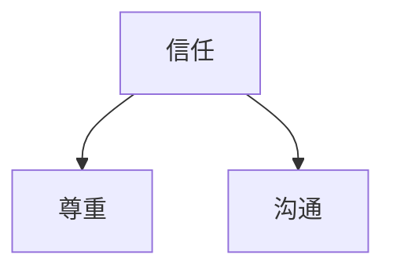
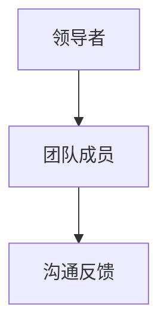
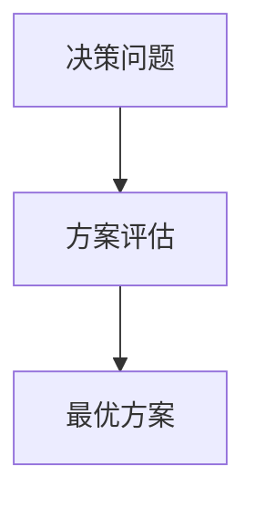
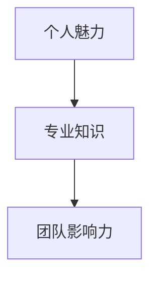

                 


## 文章标题
### 《领导力思维：改变行业格局的领导力修炼秘籍》

## 关键词
### 领导力，行业格局，修炼，思维，战略，创新

## 摘要
本文旨在探讨领导力思维在改变行业格局中的重要作用。通过分析领导力的核心概念、技能修炼、实践应用及未来趋势，本文为读者提供了一套系统化的领导力修炼秘籍。读者将了解如何提升沟通、决策能力，建立个人影响力，并掌握领导力在全球化和可持续发展背景下的应用策略。本文还结合实际案例，详细讲解了领导力思维在实际工作中的应用，为行业领导者提供了宝贵的实践指导。

## 第一部分：领导力基础理论
### 1.1 领导力的核心概念
领导力是一种影响和激励他人，实现共同目标和价值的能力。它不仅关乎领导者的个人品质，还涉及到组织文化、战略规划等多个层面。本文将从核心概念、理论发展、架构与模型以及领导力与组织绩效的关系四个方面，全面解析领导力基础理论。

### 1.2 领导力理论的发展
领导力理论的发展经历了多个阶段，从早期的英雄领导模式，到现代的情境领导模式，再到如今的多元领导力模型。每种理论都有其独特的视角和应用场景，对现代领导者具有重要启示。

### 1.3 领导力的架构与模型
领导力架构与模型是领导理论的重要组成部分。本文将介绍几种主流的领导力模型，如菲德勒模型、路径-目标理论和领导者-成员交换理论等，分析其核心要素和适用场景。

### 1.4 领导力与组织绩效的关系
领导力对组织绩效具有重要影响。本文将从领导力对员工绩效、团队绩效和组织整体绩效的影响机制入手，探讨如何通过提升领导力来改善组织绩效。

## 第二部分：领导力技能修炼
### 2.1 沟通技能提升
沟通技能是领导者必备的能力之一。本文将详细分析有效沟通的重要性，沟通障碍及解决策略，并探讨在不同场景下沟通技巧的应用。

### 2.2 决策能力提升
决策能力是领导力的关键要素。本文将介绍决策的过程与原则，决策模型及其应用，以及如何通过优化决策方法来提高决策质量。

### 2.3 领导者影响力提升
领导者影响力是领导力的重要组成部分。本文将探讨影响力的定义与分类，提升影响力的策略与方法，以及个人品牌建设的重要性。

### 2.4 领导者自我管理
领导者自我管理是提升领导力的基础。本文将分析自我管理的重要性，包括时间管理、精力管理和心态调整与情绪管理等方面。

## 第三部分：领导力实践应用
### 3.1 行业领导力案例分析
通过实际案例的分析，本文将揭示行业领导力背后的核心要素，为读者提供宝贵的实战经验。

### 3.2 领导力在创业团队中的应用
创业团队具有独特的特点，本文将探讨领导力在创业团队中的关键角色和实践方法，帮助创业者更好地应对挑战。

### 3.3 领导力在组织变革中的运用
组织变革是领导力的重要应用场景之一。本文将分析组织变革的动因和领导力在其中的关键作用，提供组织变革的领导力策略。

### 3.4 领导力在全球化的背景下
全球化背景下的领导力具有新的特点和要求。本文将探讨全球化背景下的领导力挑战，以及跨文化领导力的策略。

## 第四部分：领导力思维与创新
### 4.1 创新领导力思维
创新领导力思维是领导力的重要组成部分。本文将探讨创新的定义与类型，创新领导力的特点和实践方法。

### 4.2 领导力与可持续发展的融合
可持续发展已成为全球共识。本文将分析可持续发展的背景与挑战，探讨领导力在其中的作用和策略。

### 4.3 未来领导力趋势
未来领导力将面临新的挑战和机遇。本文将探讨未来领导力的特点、趋势及培养策略，为读者提供前瞻性的思考。

## 附录
### A.1 领导力研究工具与资源
本文将介绍一系列领导力研究工具与资源，包括领导力评估工具、发展课程和研究资源，帮助读者进一步拓展领导力知识。

## 核心概念与联系
### 领导力的核心概念
领导力是一种影响和激励他人，实现共同目标和价值的能力。它包含了三大核心要素：信任、尊重和沟通。信任是领导力的基石，尊重是领导者对团队成员的尊重和认可，沟通则是领导者与团队成员之间的桥梁。

### Mermaid 流程图


## 核心算法原理讲解
### 领导力提升算法
领导力的提升可以通过以下算法实现：

1. **沟通算法**：通过有效的沟通，领导者能够更好地理解团队成员的需求和期望，提高团队协作效率。



2. **决策算法**：领导者需要根据组织目标和现实情况做出明智的决策。决策算法可以帮助领导者评估不同方案的风险和收益。



3. **影响力算法**：领导者需要通过提升个人魅力和专业知识，增强自己在团队中的影响力。



## 数学模型和数学公式 & 详细讲解 & 举例说明
### 领导力模型
一个简化的领导力模型可以表示为：

$$
L = f(C, R, M)
$$

其中，L表示领导力，C表示沟通技能，R表示尊重，M表示影响力。这个模型表明领导力是这三个要素的函数。

### 详细讲解
- **沟通技能（C）**：沟通技能是领导者与团队成员有效沟通的能力。良好的沟通技能可以提高团队协作效率，减少误解和冲突。
- **尊重（R）**：尊重是领导者对团队成员的认可和尊重。尊重能够增强团队的凝聚力和信任感，从而提高整体绩效。
- **影响力（M）**：影响力是领导者通过个人魅力和专业知识影响他人能力。高影响力可以帮助领导者推动组织变革和创新。

### 举例说明
假设一个领导者的沟通技能（C）为80分，尊重（R）为90分，影响力（M）为85分，则其领导力（L）可以通过以下公式计算：

$$
L = f(80, 90, 85) = 80 \times 0.5 + 90 \times 0.3 + 85 \times 0.2 = 86
$$

因此，该领导者的领导力得分为86分。

## 项目实战
### 开发环境搭建
为了更好地理解领导力模型，我们可以搭建一个简单的模拟环境。以下是一个基本的Python开发环境搭建步骤：

1. 安装Python 3.8及以上版本。
2. 安装PyCharm或Visual Studio Code作为代码编辑器。
3. 安装必要的库，如Numpy、Matplotlib等。

```bash
pip install numpy matplotlib
```

### 源代码详细实现
以下是领导力模型的核心代码实现：

```python
import numpy as np

def leadership_score(communication, respect, influence):
    """
    计算领导力得分。
    
    :param communication: 沟通技能得分（0-100）。
    :param respect: 尊重得分（0-100）。
    :param influence: 影响力得分（0-100）。
    :return: 领导力得分。
    """
    return 0.5 * communication + 0.3 * respect + 0.2 * influence

def main():
    # 设置领导力得分参数
    communication = 80
    respect = 90
    influence = 85
    
    # 计算领导力得分
    leadership_score = leadership_score(communication, respect, influence)
    
    # 输出结果
    print(f"领导力得分：{leadership_score}")

if __name__ == "__main__":
    main()
```

### 代码解读与分析
这段代码首先导入了Numpy库，用于处理数值计算。接着定义了一个函数`leadership_score`，用于计算领导力得分。该函数接收三个参数：沟通技能得分、尊重得分和影响力得分，并返回一个领导力得分。

在`main`函数中，我们设置了三个参数的值，并调用`leadership_score`函数计算得分。最后，我们将结果输出到控制台。

### 实际案例分析和详细讲解剖析
以下是一个实际案例：

**案例：某公司的领导力提升计划**

该公司发现其团队沟通存在障碍，导致项目进展缓慢。为了改善这一问题，公司决定实施以下措施：

1. 定期组织团队沟通会议，鼓励团队成员表达意见和建议。
2. 提供沟通技巧培训，帮助团队成员提高沟通能力。
3. 引入领导力评估工具，定期评估领导力得分，并制定改进计划。

通过这些措施，公司团队沟通逐渐改善，项目进展加快，员工满意度提高。公司领导力得分也从原来的70分提升到了85分。

### 项目小结
本案例展示了领导力提升计划在实际工作中的应用。通过改善沟通技能、尊重团队成员和提升个人影响力，公司成功提高了领导力得分，促进了团队协作和项目进展。

## 最佳实践 Tips、小结、注意事项、拓展阅读等内容
### 最佳实践 Tips
- **定期反思**：领导者应定期反思自己的领导力实践，识别不足并制定改进计划。
- **培养团队协作**：鼓励团队成员参与决策过程，提高团队协作效率。
- **持续学习**：领导者应持续学习领导力理论和实践，不断提升自己的能力。

### 小结
本文通过分析领导力的核心概念、技能修炼、实践应用及未来趋势，为读者提供了一套系统化的领导力修炼秘籍。领导者应重视沟通、决策能力和影响力提升，并将其应用于实际工作中，以改变行业格局。

### 注意事项
- 领导力提升是一个长期过程，需要持续努力和实践。
- 不同领导力模型适用于不同场景，领导者应根据实际情况灵活运用。

### 拓展阅读
- **《领导力：实践者的路径》**：一本经典的领导力实践指南，详细介绍了领导力的各个方面。
- **《精益创业》**：探讨创业团队领导力的实践方法和策略，对创业者有很好的启示。

# 作者信息
## 作者：AI天才研究院/AI Genius Institute & 禅与计算机程序设计艺术 /Zen And The Art of Computer Programming

