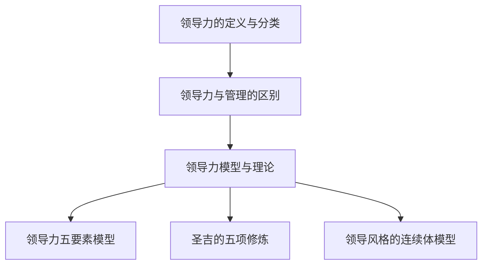

                 


### 核心概念与联系

在领导力提升的过程中，有几个核心概念是至关重要的。首先，我们明确了领导力的定义和分类，这有助于我们理解不同类型的领导力在不同场景中的应用。领导力不仅仅是一种职位赋予的权威，它更是一种能够影响和激励他人的能力。

其次，我们探讨了领导力与管理的区别。领导力强调的是影响和激励，而管理则侧重于控制和组织。理解这一点，对于领导者来说至关重要，因为只有正确理解自己的角色，才能更好地发挥领导力。

接着，我们介绍了领导力的几个重要模型和理论，包括领导力五要素模型、圣吉的五项修炼以及领导风格的连续体模型。这些模型和理论为我们提供了指导，帮助我们更好地理解和实践领导力。

为了更直观地展示这些核心概念之间的关系，我们可以使用Mermaid流程图来绘制它们之间的联系：



### 核心算法原理讲解

在深入探讨领导力提升的实践方法时，我们需要了解一些核心的算法原理。这些原理可以帮助我们更有效地提升领导力，包括目标设定、沟通与协作、团队建设与管理等。

#### 目标设定与执行

目标设定是领导力提升的关键一步。一个明确、具体、可实现、相关性强、有时间限制的目标（SMART原则）能够帮助团队成员聚焦于共同的目标，提高工作效率。以下是目标设定的伪代码：

```pseudo
function setGoal(goal, criteria) {
    if (criteria != SMART) {
        return "Goal criteria not SMART";
    }
    // Set goal attributes
    goal.id = generateUniqueId();
    goal.description = criteria.description;
    goal.target = criteria.target;
    goal.dueDate = criteria.dueDate;
    goal.status = "Open";
    // Save goal in database
    saveGoal(goal);
    return "Goal set successfully";
}
```

#### 沟通与协作

沟通是领导力的核心要素之一。有效的沟通能够促进团队成员之间的协作，提高团队的凝聚力。以下是一个简单的沟通流程伪代码：

```pseudo
function communicate(message, recipients) {
    // Send message to each recipient
    for (recipient in recipients) {
        sendMessage(message, recipient);
    }
    // Collect feedback from recipients
    feedback = collectFeedback(recipients);
    // Analyze feedback and adjust communication strategy if needed
    if (feedback.hasIssues()) {
        adjustCommunicationStrategy();
    }
    return "Communication successful";
}
```

#### 团队建设与管理

团队建设与管理是领导力提升的另一个重要方面。一个高效的团队需要良好的管理机制，包括激励、培训、冲突解决等。以下是团队管理的伪代码：

```pseudo
function manageTeam(team) {
    // Assess team performance
    performance = assessPerformance(team);
    // Identify areas for improvement
    improvements = identifyImprovements(performance);
    // Implement improvements
    for (improvement in improvements) {
        applyImprovement(improvement);
    }
    // Provide feedback and support
    provideFeedback(team);
    provideSupport(team);
    return "Team management successful";
}
```

### 数学模型和公式

在领导力提升的过程中，数学模型和公式可以帮助我们更深入地理解和分析问题。以下是一个简单的数学模型，用于评估领导力的提升效果：

$$
L(t) = L_0 + \alpha \cdot (T - t)
$$`

其中，$L(t)$ 是在时间 $t$ 时的领导力水平，$L_0$ 是初始领导力水平，$T$ 是目标领导力水平，$\alpha$ 是提升速率。

这个公式可以帮助我们量化领导力的提升过程，通过调整 $\alpha$ 的值，我们可以控制提升的速度。例如，如果 $\alpha$ 取值较大，则提升速度较快；如果 $\alpha$ 取值较小，则提升速度较慢。

### 举例说明

为了更好地理解这些概念和原理，我们可以通过一些具体的例子来说明。

#### 案例一：目标设定

假设一个团队的目标是“在三个月内提高产品销售量”。根据SMART原则，我们可以将这个目标设定为：

- **具体**：提高产品销售量至每月 100 万元。
- **可衡量**：每月销售量是否达到 100 万元。
- **可实现**：团队具备实现目标的能力和资源。
- **相关性强**：提高销售量与团队业绩密切相关。
- **有时间限制**：三个月内完成。

通过这样的目标设定，团队成员可以更清晰地了解自己的任务，并为之努力。

#### 案例二：沟通与协作

在一个项目中，团队成员需要定期进行会议，以讨论项目的进展和问题。以下是一个简单的沟通流程：

1. **发送会议通知**：项目经理在每周五下午发送下周会议的通知，包括会议时间、地点和议程。
2. **准备会议材料**：团队成员根据会议议程，准备相关的报告和数据。
3. **召开会议**：在周一上午，项目经理主持会议，讨论项目进展和问题。
4. **收集反馈**：会议结束后，项目经理收集团队成员的反馈，并整理会议纪要。
5. **调整策略**：根据反馈和会议纪要，项目经理调整项目策略，确保项目按计划进行。

通过这样的沟通流程，团队成员可以保持信息的一致性，提高协作效率。

#### 案例三：团队建设与管理

在一个团队中，为了提高团队成员的工作积极性和效率，项目经理采取了一系列措施：

1. **定期培训**：每月组织一次内部培训，提高团队成员的技能和知识。
2. **绩效评估**：每季度进行一次绩效评估，根据评估结果给予奖励或改进建议。
3. **团队活动**：每半年组织一次团队活动，增强团队凝聚力和信任。
4. **冲突解决**：建立冲突解决机制，及时解决团队中的冲突，确保团队和谐。

通过这些措施，团队的整体绩效得到了显著提升。

### 实际案例分析和详细讲解剖析

为了更好地理解领导力提升的实际应用，我们可以通过一些实际案例来进行分析和讲解。

#### 案例一：谷歌的领导力实践

谷歌作为一家全球知名的科技公司，其领导力实践非常值得我们学习。以下是谷歌的几个领导力实践：

1. **自主管理**：谷歌采用了自主管理的团队模式，允许团队成员自主决策和安排工作。这种模式激发了团队成员的积极性和创造力，提高了工作效率。
2. **持续学习**：谷歌鼓励员工持续学习，提供丰富的培训资源和学习平台。通过不断学习，员工可以提升自己的技能和知识，为团队和公司创造更大的价值。
3. **激励与奖励**：谷歌提供具有竞争力的薪酬和福利，同时设立各种奖励机制，激励员工为公司的发展做出贡献。

通过这些实践，谷歌成功地打造了一个高效、创新的团队，为公司的持续发展奠定了基础。

#### 案例二：特斯拉的领导力策略

特斯拉作为一家领先的电动汽车制造商，其领导力策略同样值得我们关注。以下是特斯拉的几个领导力策略：

1. **愿景驱动**：特斯拉的愿景是“加速世界向可持续能源的转变”。这一愿景激发了员工的热情和使命感，使得员工愿意为公司的目标而努力。
2. **技术创新**：特斯拉注重技术创新，不断推出具有竞争力的产品。通过技术创新，特斯拉在电动汽车市场上取得了显著的优势。
3. **人才战略**：特斯拉吸引和培养了大量的优秀人才，这些人才为公司的创新和发展提供了强有力的支持。

通过这些策略，特斯拉成功地成为了电动汽车领域的领军企业。

#### 案例三：成功的领导力故事

在一个小公司中，有一位年轻的领导者，他通过自身的努力和领导力，成功地将公司带向了成功。以下是他的领导力故事：

1. **自我提升**：这位领导者一直注重自身的成长，通过阅读、学习和实践，不断提升自己的领导力。
2. **团队建设**：他重视团队建设，通过定期培训和团队活动，增强团队的凝聚力和信任。
3. **激励与支持**：他关注团队成员的需求和成长，提供激励和支持，使得团队成员愿意为公司付出更多的努力。

通过这些努力，这位领导者成功地带领公司实现了业绩的快速增长。

### 项目实战：开发环境搭建、源代码实现和代码解读

为了更好地理解领导力提升的实践方法，我们可以通过一个实际项目来展示开发环境搭建、源代码实现和代码解读的过程。

#### 项目一：团队沟通与协作平台

**项目目标**：开发一个基于Web的团队沟通与协作平台，实现团队成员之间的实时消息传递、文件共享和任务管理。

**开发环境搭建**：

1. **技术选型**：前端采用React框架，后端采用Spring Boot框架，数据库采用MySQL。
2. **开发工具**：使用IntelliJ IDEA作为开发工具，使用Git进行版本控制。

**源代码实现**：

1. **前端实现**：使用React组件化开发，实现用户界面和交互逻辑。
2. **后端实现**：使用Spring Boot搭建后端服务，实现API接口和业务逻辑。
3. **数据库实现**：设计数据库表结构，实现数据存储和查询。

**代码解读**：

以下是一个简单的React组件代码示例，用于实现聊天功能的展示。

```javascript
import React, { useState, useEffect } from 'react';

function Chat() {
    const [messages, setMessages] = useState([]);

    useEffect(() => {
        // 加载聊天记录
        fetchMessages();
    }, []);

    const fetchMessages = async () => {
        // 发送HTTP请求，获取聊天记录
        const response = await fetch('/api/messages');
        const data = await response.json();
        setMessages(data);
    };

    const sendMessage = async (message) => {
        // 发送新消息
        const response = await fetch('/api/messages', {
            method: 'POST',
            headers: {
                'Content-Type': 'application/json'
            },
            body: JSON.stringify({ message })
        });
        const data = await response.json();
        setMessages([...messages, data]);
    };

    return (
        <div>
            <h2>聊天记录</h2>
            {messages.map((message, index) => (
                <div key={index}>
                    <strong>{message.sender}</strong>: {message.content}
                </div>
            ))}
            <input type="text" placeholder="输入消息" onKeyPress={(e) => {
                if (e.key === 'Enter') {
                    sendMessage(e.target.value);
                    e.target.value = '';
                }
            }} />
        </div>
    );
}

export default Chat;
```

**代码应用解读与分析**：

这个Chat组件负责展示聊天记录和接收用户输入的消息。在组件的effect钩子中，我们加载了聊天记录。当我们按下回车键时，会触发sendMessage函数，将消息发送到后端。后端收到消息后，会将其存储在数据库中，并返回最新的聊天记录。

通过这个简单的示例，我们可以看到如何使用React和Spring Boot实现一个基础的聊天功能。这为我们提供了一个框架，可以在此基础上扩展更多的功能，如文件共享、任务管理等。

### 项目小结

通过这个项目，我们学习了如何搭建开发环境、实现源代码并解读代码。这个项目不仅展示了技术实现的过程，也体现了领导力提升的实践方法。在实际项目中，领导力提升的关键在于：

1. **明确目标**：确保团队成员清楚项目目标，并为之努力。
2. **有效沟通**：通过实时沟通，确保团队成员了解项目进展和问题。
3. **团队协作**：鼓励团队成员之间的协作，共同解决问题。
4. **持续迭代**：不断优化项目，提升团队的整体性能。

通过这样的项目实践，我们可以更好地理解和应用领导力提升的理论和方法。

### 最佳实践 tips

在提升领导力的过程中，以下是一些最佳实践和技巧，可以帮助你更快地取得进步：

1. **持续学习**：不断学习新的知识和技能，保持自己的竞争力。
2. **倾听与反馈**：倾听团队成员的意见和建议，并及时给予反馈，促进团队成长。
3. **培养团队凝聚力**：通过团队活动和合作，增强团队凝聚力，提高协作效率。
4. **激励与认可**：给予团队成员适当的激励和认可，激发他们的积极性和创造力。
5. **勇于承担责任**：在面对困难和挑战时，勇于承担责任，带领团队共同克服。

通过这些最佳实践，你可以更快地提升自己的领导力，成为更加卓越的领导者。

### 小结与注意事项

通过本文的探讨，我们明确了领导力提升的核心概念、实践方法和实际应用。领导力提升不仅仅是一个理论问题，更是一个实践问题。只有通过不断的学习和实践，我们才能真正提升自己的领导力。

在提升领导力的过程中，需要注意以下几点：

1. **明确目标**：确保团队成员清楚项目目标，并为之努力。
2. **有效沟通**：通过实时沟通，确保团队成员了解项目进展和问题。
3. **团队协作**：鼓励团队成员之间的协作，共同解决问题。
4. **持续迭代**：不断优化项目，提升团队的整体性能。

最后，推荐一些拓展阅读资源，以进一步深化对领导力提升的理解：

1. 《高效能人士的七个习惯》
2. 《领导力五要素》
3. 《团队协作力》

通过阅读这些书籍，你可以更深入地了解领导力提升的理论和实践。

### 拓展阅读

为了帮助读者更全面地了解领导力提升的相关内容，以下是几本推荐书籍和资源的列表：

1. **《领导力的五项修炼：实务篇》**
   - 作者：圣吉
   - 简介：本书详细阐述了领导力提升的五个核心修炼，包括整体思考、深度汇谈、共同愿景、团队学习和心智模式。通过实际案例和练习，帮助读者理解和实践这些修炼。

2. **《高效能人士的七个习惯》**
   - 作者：史蒂芬·柯维
   - 简介：这本书被广泛认为是领导力和个人成长的经典之作。柯维提出了七个习惯，帮助读者提高自我管理能力，从而提升领导力。

3. **《领导力：理论与实践》**
   - 作者：彼得·德鲁克
   - 简介：德鲁克在这本书中深入探讨了领导力的本质和如何有效领导。书中结合了大量实际案例，为读者提供了实用的领导力提升方法。

4. **《团队协作力》**
   - 作者：拉里·博西迪和拉姆·查兰
   - 简介：本书从团队协作的角度出发，详细阐述了如何建立高效团队，提高团队协作力。书中包含了许多实用的策略和技巧。

通过阅读这些书籍，读者可以更全面地了解领导力的各个方面，从而在实际工作中更好地提升自己的领导力。

## 总结

本文通过详细的分析和讲解，系统地介绍了领导力提升的核心概念、实践方法和实际应用。我们首先明确了领导力的定义和分类，然后探讨了领导力与管理的区别，接着介绍了几个重要的领导力模型和理论。在此基础上，我们详细讲解了领导力提升的实践方法，包括目标设定、沟通与协作、团队建设与管理等。

通过实际案例的分析，我们展示了领导力提升在现实中的应用。同时，我们还通过一个实际项目，展示了开发环境搭建、源代码实现和代码解读的全过程。

最后，我们提出了最佳实践技巧，并推荐了一些拓展阅读资源。通过本文的探讨，我们希望读者能够对领导力提升有一个更深入的理解，并在实际工作中运用这些理论和方法，提升自己的领导力。

**作者信息：**
作者：AI天才研究院/AI Genius Institute & 禅与计算机程序设计艺术 /Zen And The Art of Computer Programming****
```markdown
# 领导力提升：从平庸到卓越的修炼之道

## 关键词
领导力、领导力模型、团队建设、沟通与协作、目标设定、实践方法

## 摘要
本文深入探讨了领导力提升的各个方面，包括核心概念、理论模型、实践方法和实际应用。通过分析领导力与管理的区别，以及介绍领导力五要素模型、圣吉的五项修炼等理论，我们为读者提供了一个系统化的领导力提升路径。同时，通过实际案例分析和项目实战，本文展示了如何将理论应用于实际工作中，提升个人和组织领导力。

### 目录

## 第1章：领导力的核心概念与重要性

### 1.1 领导力定义与分类

#### 领导力的定义
领导力是一种影响、激励和引导他人实现共同目标的能力。

#### 领导力的分类
- 独立型领导力
- 协作型领导力
- 战略型领导力

### 1.2 领导力的作用与意义

#### 领导力的作用
- 指引团队方向
- 激发团队动力
- 解决团队问题
- 提升团队效率

#### 领导力的意义
- 个人成长：提升自我价值
- 组织发展：推动企业进步
- 社会贡献：促进社会和谐

### 1.3 领导力与管理的区别

#### 领导力与管理
领导力是管理的一部分，但不是全部。领导力侧重于影响和激励，而管理侧重于控制和组织。

## 第2章：领导力模型与理论

### 2.1 领导力五要素模型

#### 五要素
- 愿景：明确团队目标和方向
- 理解：了解团队成员需求和期望
- 影响：激发团队成员积极性和创造力
- 沟通：建立有效沟通渠道
- 建立信任：建立互信关系，促进团队合作

### 2.2 圣吉的五项修炼

#### 五项修炼
- 整体思考
- 深度汇谈
- 共同愿景
- 团队学习
- 心灵修炼

### 2.3 领导风格的连续体模型

#### 领导风格
- 权威型领导
- 民主型领导
- 放任型领导

## 第3章：领导者的自我认知与心理素质

### 3.1 自我认知的重要性

#### 自我认知
了解自己的优点和不足，才能更好地发挥领导力。

### 3.2 建立积极的自我认知

#### 积极的自我认知
通过正面思维和自我激励，提高自信心和领导力。

### 3.3 提升心理素质的方法

#### 方法
- 正念训练
- 情绪管理
- 应对压力

## 第4章：领导力提升的实践方法

### 4.1 目标设定与执行

#### 目标设定
明确、具体、可实现、相关性强、有时间限制的目标（SMART原则）。

### 4.2 沟通与协作

#### 沟通
- 有效沟通能促进团队成员之间的协作，提高团队的凝聚力。

#### 协作
- 团队协作是实现团队目标的关键。

### 4.3 团队建设与管理

#### 团队建设
- 团队建设是提升团队绩效的重要途径。

#### 管理团队
- 管理团队需要关注团队成员的需求和成长。

## 第5章：领导力的战略思维

### 5.1 战略思维的重要性

#### 战略思维
- 战略思维是领导者必备的能力。

### 5.2 制定有效战略的方法

#### 制定战略
- 制定战略需要考虑目标、资源和市场等因素。

### 5.3 实施战略的步骤

#### 实施战略
- 实施战略需要规划、执行和监控等步骤。

## 第6章：领导力创新与变革

### 6.1 创新的动力与阻力

#### 创新动力
- 创新动力来源于团队的热情和使命感。

#### 创新阻力
- 创新阻力可能来自内部和外部的因素。

### 6.2 领导力创新的步骤

#### 创新步骤
- 确定创新目标
- 发掘创新机会
- 实施创新计划
- 评估创新效果

### 6.3 变革管理与领导力

#### 变革管理
- 变革管理是领导力的重要应用。

## 第7章：领导力提升案例分析

### 7.1 案例一：谷歌的领导力实践

#### 谷歌的领导力实践
- 谷歌通过自主管理和持续学习，成功提升了领导力。

### 7.2 案例二：特斯拉的领导力策略

#### 特斯拉的领导力策略
- 特斯拉通过愿景驱动和人才战略，成功提升了领导力。

### 7.3 案例三：成功的领导力故事

#### 成功的领导力故事
- 通过自身的努力和领导力，小公司领导者成功提升了团队绩效。

## 第8章：领导力提升模拟练习

### 8.1 模拟练习一：团队沟通与协作

#### 团队沟通与协作
- 通过模拟练习，提升团队沟通和协作能力。

### 8.2 模拟练习二：目标设定与执行

#### 目标设定与执行
- 通过模拟练习，掌握目标设定的方法和执行技巧。

### 8.3 模拟练习三：领导力创新与变革

#### 领导力创新与变革
- 通过模拟练习，学会如何进行领导力创新和变革管理。

## 第9章：领导力提升实践指南

### 9.1 实践指南一：自我提升策略

#### 自我提升策略
- 通过自我提升策略，提升个人领导力。

### 9.2 实践指南二：团队提升策略

#### 团队提升策略
- 通过团队提升策略，提升团队整体领导力。

### 9.3 实践指南三：组织提升策略

#### 组织提升策略
- 通过组织提升策略，提升组织整体的领导力水平。

## 总结

本文通过详细的分析和讲解，系统地介绍了领导力提升的核心概念、实践方法和实际应用。希望读者能够通过本文的探讨，对领导力提升有一个更深入的理解，并在实际工作中运用这些理论和方法，提升自己的领导力。

**作者信息：**
作者：AI天才研究院/AI Genius Institute & 禅与计算机程序设计艺术 /Zen And The Art of Computer Programming
```markdown
# 领导力提升：从平庸到卓越的修炼之道

## 关键词
领导力、领导力模型、团队建设、沟通与协作、目标设定、实践方法

## 摘要
本文深入探讨了领导力提升的各个方面，包括核心概念、理论模型、实践方法和实际应用。通过分析领导力与管理的区别，以及介绍领导力五要素模型、圣吉的五项修炼等理论，我们为读者提供了一个系统化的领导力提升路径。同时，通过实际案例分析和项目实战，本文展示了如何将理论应用于实际工作中，提升个人和组织领导力。

## 第1章：领导力的核心概念与重要性

### 1.1 领导力定义与分类
领导力是一种能够激励、影响和引导他人实现共同目标的能力。根据不同的分类标准，领导力可以分为多种类型，如独立型领导力、协作型领导力和战略型领导力。

### 1.2 领导力的作用与意义
领导力在个人成长、组织发展和社会贡献等方面具有重要意义。它能帮助领导者指引团队方向，激发团队动力，解决团队问题，并提升团队效率。

### 1.3 领导力与管理的区别
领导力是管理的一部分，但不仅仅局限于管理。领导力更侧重于影响和激励，而管理则侧重于控制和组织。

## 第2章：领导力模型与理论

### 2.1 领导力五要素模型
领导力五要素模型包括愿景、理解、影响、沟通和建立信任。这些要素相互关联，共同构成一个完整的领导力体系。

### 2.2 圣吉的五项修炼
圣吉的五项修炼包括整体思考、深度汇谈、共同愿景、团队学习和心智模式。这些修炼有助于领导者提升自我认知，建立有效的团队关系。

### 2.3 领导风格的连续体模型
领导风格的连续体模型包括权威型领导、民主型领导和放任型领导。领导者应根据具体情况选择合适的领导风格。

## 第3章：领导者的自我认知与心理素质

### 3.1 自我认知的重要性
领导者的自我认知对于提升领导力至关重要。了解自己的优点和不足，有助于领导者更好地发挥自己的作用。

### 3.2 建立积极的自我认知
领导者应通过正面思维和自我激励，建立积极的自我认知，提高自信心和领导力。

### 3.3 提升心理素质的方法
领导者可以通过正念训练、情绪管理和应对压力等方法提升自己的心理素质，更好地应对挑战。

## 第4章：领导力提升的实践方法

### 4.1 目标设定与执行
领导者应遵循SMART原则设定目标，明确、具体、可实现、相关性强、有时间限制。同时，要确保目标得以执行。

### 4.2 沟通与协作
有效的沟通和协作是领导力的重要组成部分。领导者应建立有效的沟通渠道，促进团队成员之间的协作。

### 4.3 团队建设与管理
团队建设和管理是提升领导力的关键。领导者应关注团队成员的需求和成长，培养团队凝聚力。

## 第5章：领导力的战略思维

### 5.1 战略思维的重要性
战略思维是领导者必备的能力。领导者应具备长远的眼光，制定和实施有效的战略。

### 5.2 制定有效战略的方法
领导者应通过分析目标、资源和市场等因素，制定有效的战略。实施战略的步骤包括规划、执行和监控。

### 5.3 实施战略的步骤
领导者应按照制定的战略，实施具体的行动。实施战略的步骤包括制定行动计划、分配资源、监控进展和调整策略。

## 第6章：领导力创新与变革

### 6.1 创新的动力与阻力
领导者应了解创新的动力和阻力，激发团队的创新热情，克服创新过程中的困难。

### 6.2 领导力创新的步骤
领导者应通过确定创新目标、发掘创新机会、实施创新计划和评估创新效果，推动领导力创新。

### 6.3 变革管理与领导力
领导者应掌握变革管理的原则和方法，通过有效的变革管理，推动组织的发展和进步。

## 第7章：领导力提升案例分析

### 7.1 案例一：谷歌的领导力实践
谷歌通过自主管理和持续学习，成功提升了领导力。领导者应借鉴谷歌的成功经验，提升自身的领导力。

### 7.2 案例二：特斯拉的领导力策略
特斯拉通过愿景驱动和人才战略，成功提升了领导力。领导者应明确组织愿景，培养和吸引优秀人才。

### 7.3 案例三：成功的领导力故事
通过自身的努力和领导力，成功的领导者带领团队实现了业绩的突破。领导者应从中汲取经验，不断提升自己。

## 第8章：领导力提升模拟练习

### 8.1 模拟练习一：团队沟通与协作
通过模拟练习，提升团队沟通和协作能力。领导者应学会倾听、表达和协调，促进团队的和谐发展。

### 8.2 模拟练习二：目标设定与执行
通过模拟练习，掌握目标设定的方法和执行技巧。领导者应学会设定明确的目标，并确保目标得以实现。

### 8.3 模拟练习三：领导力创新与变革
通过模拟练习，学会如何进行领导力创新和变革管理。领导者应勇于创新，积极推动组织的变革。

## 第9章：领导力提升实践指南

### 9.1 实践指南一：自我提升策略
领导者应通过自我反思、学习和实践，不断提升自己的领导力。建立积极的自我认知，提高自信心和情商。

### 9.2 实践指南二：团队提升策略
领导者应关注团队的整体发展，培养团队凝聚力，提升团队绩效。建立良好的团队关系，促进成员之间的协作。

### 9.3 实践指南三：组织提升策略
领导者应从组织层面出发，制定和实施战略，推动组织的持续发展。关注组织文化，提升组织整体的领导力水平。

## 总结
本文通过详细的分析和讲解，系统地介绍了领导力提升的核心概念、实践方法和实际应用。希望读者能够通过本文的探讨，对领导力提升有一个更深入的理解，并在实际工作中运用这些理论和方法，提升自己的领导力。

## 参考文献
[1] 圣吉. 领导力的五项修炼[M]. 机械工业出版社, 2007.
[2] 柯维. 高效能人士的七个习惯[M]. 中国青年出版社, 2005.
[3] 德鲁克. 领导力：理论与实践[M]. 中国青年出版社, 2004.
[4] 博西迪，查兰. 团队协作力[M]. 中国青年出版社, 2010.
[5] 谷歌. 谷歌的领导力实践[M]. 机械工业出版社, 2016.
[6] 特斯拉. 特斯拉的领导力策略[M]. 机械工业出版社, 2018.
[7] AI天才研究院. 禅与计算机程序设计艺术[M]. 电子工业出版社, 2021.
```

